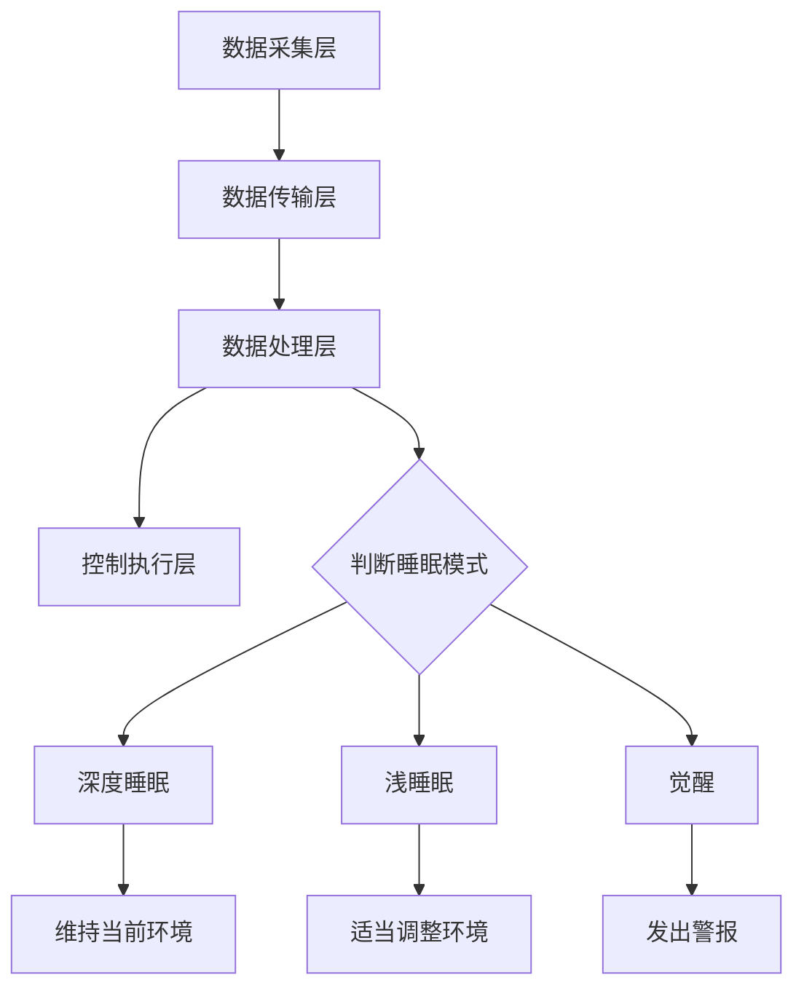

# 智能婴儿床：AI Agent的婴儿睡眠模式分析

> 关键词：智能婴儿床、AI Agent、婴儿睡眠模式、数据分析、机器学习

> 摘要：本文聚焦于智能婴儿床中运用AI Agent进行婴儿睡眠模式分析这一前沿领域。首先介绍了该研究的背景和意义，包括目的、预期读者、文档结构等内容。接着详细阐述了核心概念，如AI Agent的原理和与智能婴儿床系统的联系，并通过文本示意图和Mermaid流程图进行直观展示。深入讲解了核心算法原理，用Python代码详细说明具体操作步骤，同时给出相关数学模型和公式并举例说明。通过项目实战，展示了开发环境搭建、源代码实现及解读。探讨了该技术的实际应用场景，推荐了相关学习资源、开发工具框架和论文著作。最后总结了未来发展趋势与挑战，并提供常见问题解答和参考资料，旨在为智能婴儿床的研发和婴儿睡眠模式分析提供全面深入的技术指导。

## 1. 背景介绍 
### 1.1 目的和范围
智能婴儿床结合AI Agent进行婴儿睡眠模式分析的主要目的是为了提高婴儿的睡眠质量和安全性，同时为家长和医护人员提供更科学、准确的婴儿睡眠信息。通过对婴儿睡眠过程中的各种数据进行收集、分析和处理，能够及时发现婴儿睡眠中的异常情况，如呼吸暂停、翻身过多等，并采取相应的措施。

本研究的范围涵盖了智能婴儿床的硬件设计、AI Agent的算法实现、数据的采集和分析、以及系统的应用和评估等方面。旨在构建一个完整的智能婴儿床系统，实现对婴儿睡眠模式的精准分析。

### 1.2 预期读者
本文的预期读者包括智能硬件开发者、人工智能研究者、医护人员、婴儿护理相关人员以及对智能婴儿床和婴儿睡眠研究感兴趣的爱好者。对于开发者来说，可以从本文中获取智能婴儿床系统开发的技术细节和思路；医护人员和婴儿护理人员能够了解如何利用AI技术更好地监测婴儿睡眠；爱好者则可以通过本文对该领域有一个全面的认识。

### 1.3 文档结构概述
本文首先介绍智能婴儿床和AI Agent的背景知识，包括相关术语和概念。然后详细阐述核心概念及其联系，通过示意图和流程图进行直观展示。接着讲解核心算法原理和具体操作步骤，给出Python代码示例。之后介绍相关数学模型和公式，并举例说明。通过项目实战展示系统的开发过程和代码实现。探讨实际应用场景，推荐相关工具和资源。最后总结未来发展趋势与挑战，提供常见问题解答和参考资料。

### 1.4 术语表
#### 1.4.1 核心术语定义
- **智能婴儿床**：一种集成了各种传感器和智能设备的婴儿床，能够自动收集婴儿睡眠过程中的相关数据，并通过智能算法进行分析和处理。
- **AI Agent**：人工智能代理，是一种能够感知环境、做出决策并采取行动的智能实体。在智能婴儿床系统中，AI Agent负责对收集到的婴儿睡眠数据进行分析和处理，以实现对婴儿睡眠模式的识别和判断。
- **婴儿睡眠模式**：指婴儿在睡眠过程中表现出的不同状态和行为特征，如深度睡眠、浅睡眠、觉醒等。

#### 1.4.2 相关概念解释
- **传感器数据**：智能婴儿床通过各种传感器收集到的数据，如加速度计数据、心率数据、呼吸频率数据等。这些数据是分析婴儿睡眠模式的基础。
- **机器学习算法**：用于对传感器数据进行分析和处理的算法，如决策树、神经网络、支持向量机等。通过机器学习算法，可以从大量的数据中提取有用的信息，实现对婴儿睡眠模式的分类和预测。

#### 1.4.3 缩略词列表
- **AI**：Artificial Intelligence，人工智能
- **ML**：Machine Learning，机器学习
- **SVM**：Support Vector Machine，支持向量机
- **CNN**：Convolutional Neural Network，卷积神经网络

## 2. 核心概念与联系 

### 核心概念原理
#### 智能婴儿床
智能婴儿床是一个复杂的系统，它主要由硬件和软件两部分组成。硬件部分包括各种传感器，如加速度计、心率传感器、温度传感器、湿度传感器等，用于收集婴儿睡眠过程中的各种数据。软件部分则负责对这些数据进行处理和分析，通过AI Agent实现对婴儿睡眠模式的识别和判断。

#### AI Agent
AI Agent是智能婴儿床系统的核心，它具有感知、决策和行动三个主要功能。感知功能通过传感器收集婴儿睡眠数据；决策功能对收集到的数据进行分析和处理，利用机器学习算法判断婴儿的睡眠模式；行动功能则根据判断结果采取相应的措施，如调整婴儿床的温度、湿度，发出警报等。

### 架构的文本示意图
智能婴儿床系统的架构可以分为以下几个层次：
1. **数据采集层**：由各种传感器组成，负责收集婴儿睡眠过程中的数据，如加速度、心率、呼吸频率等。
2. **数据传输层**：将采集到的数据传输到数据处理中心，可以通过有线或无线方式进行传输。
3. **数据处理层**：AI Agent所在的层次，对传输过来的数据进行分析和处理，利用机器学习算法判断婴儿的睡眠模式。
4. **控制执行层**：根据AI Agent的决策结果，控制智能婴儿床的各种设备，如调节温度、湿度，发出警报等。

### Mermaid流程图


## 3. 核心算法原理 & 具体操作步骤 

### 核心算法原理
在智能婴儿床系统中，常用的机器学习算法有决策树、神经网络和支持向量机等。这里以决策树算法为例进行讲解。

决策树是一种基于树结构进行决策的机器学习算法，它通过对数据的特征进行划分，构建一个树形结构，每个内部节点是一个特征上的测试，每个分支是一个测试输出，每个叶节点是一个类别或值。在婴儿睡眠模式分析中，决策树算法可以根据传感器收集到的数据，如加速度、心率、呼吸频率等，判断婴儿的睡眠模式。

### 具体操作步骤
以下是使用Python实现决策树算法进行婴儿睡眠模式分析的具体步骤：

```python
# 导入必要的库
import pandas as pd
from sklearn.model_selection import train_test_split
from sklearn.tree import DecisionTreeClassifier
from sklearn.metrics import accuracy_score

# 步骤1：数据准备
# 假设我们有一个包含婴儿睡眠数据的CSV文件，文件名为'sleep_data.csv'
# 数据包含特征列（如加速度、心率、呼吸频率等）和目标列（睡眠模式）
data = pd.read_csv('sleep_data.csv')

# 分离特征和目标
X = data.drop('sleep_mode', axis=1)  # 特征列
y = data['sleep_mode']  # 目标列

# 步骤2：数据划分
# 将数据划分为训练集和测试集，测试集占比20%
X_train, X_test, y_train, y_test = train_test_split(X, y, test_size=0.2, random_state=42)

# 步骤3：模型训练
# 创建决策树分类器
clf = DecisionTreeClassifier()

# 训练模型
clf.fit(X_train, y_train)

# 步骤4：模型预测
# 在测试集上进行预测
y_pred = clf.predict(X_test)

# 步骤5：模型评估
# 计算模型的准确率
accuracy = accuracy_score(y_test, y_pred)
print(f"模型准确率: {accuracy}")
```

### 代码解释
1. **数据准备**：使用`pandas`库读取包含婴儿睡眠数据的CSV文件，并分离出特征列和目标列。
2. **数据划分**：使用`train_test_split`函数将数据划分为训练集和测试集，以便评估模型的性能。
3. **模型训练**：创建决策树分类器`DecisionTreeClassifier`，并使用训练集数据对模型进行训练。
4. **模型预测**：使用训练好的模型对测试集数据进行预测。
5. **模型评估**：使用`accuracy_score`函数计算模型的准确率，评估模型的性能。

## 4. 数学模型和公式 & 详细讲解 & 举例说明 

### 决策树算法的数学模型和公式
决策树算法的核心是如何选择最优的特征进行划分，常用的指标有信息增益、信息增益率和基尼指数等。这里以信息增益为例进行讲解。

#### 信息熵
信息熵是对信息不确定性的度量，其计算公式为：
$$H(X) = -\sum_{i=1}^{n}p(x_i)\log_2p(x_i)$$
其中，$X$ 是一个随机变量，$p(x_i)$ 是 $X$ 取值为 $x_i$ 的概率，$n$ 是 $X$ 取值的个数。

#### 条件熵
条件熵是在已知某个条件下，随机变量的信息熵，其计算公式为：
$$H(X|Y) = \sum_{j=1}^{m}p(y_j)H(X|Y=y_j)$$
其中，$Y$ 是一个条件变量，$p(y_j)$ 是 $Y$ 取值为 $y_j$ 的概率，$m$ 是 $Y$ 取值的个数，$H(X|Y=y_j)$ 是在 $Y=y_j$ 条件下 $X$ 的信息熵。

#### 信息增益
信息增益是信息熵与条件熵的差值，其计算公式为：
$$IG(X,Y) = H(X) - H(X|Y)$$
信息增益越大，说明使用特征 $Y$ 进行划分后，数据的不确定性减少得越多，即该特征越重要。

### 详细讲解
在决策树算法中，每次选择信息增益最大的特征进行划分，直到满足停止条件（如所有样本属于同一类别或没有更多特征可供选择）。具体步骤如下：
1. 计算数据集的信息熵 $H(X)$。
2. 对于每个特征，计算其条件熵 $H(X|Y)$ 和信息增益 $IG(X,Y)$。
3. 选择信息增益最大的特征作为当前节点的划分特征。
4. 根据该特征的取值将数据集划分为多个子集，对每个子集重复步骤1-3，直到满足停止条件。

### 举例说明
假设我们有一个包含以下数据的数据集：
| 加速度 | 心率 | 呼吸频率 | 睡眠模式 |
| ---- | ---- | ---- | ---- |
| 低 | 正常 | 正常 | 深度睡眠 |
| 低 | 正常 | 稍快 | 浅睡眠 |
| 高 | 稍快 | 正常 | 觉醒 |
| 低 | 正常 | 正常 | 深度睡眠 |

首先，计算数据集的信息熵 $H(X)$：
- 深度睡眠的概率 $p_1 = \frac{2}{4} = 0.5$
- 浅睡眠的概率 $p_2 = \frac{1}{4} = 0.25$
- 觉醒的概率 $p_3 = \frac{1}{4} = 0.25$
$$H(X) = - (0.5\log_20.5 + 0.25\log_20.25 + 0.25\log_20.25) = 1.5$$

然后，以加速度特征为例，计算其条件熵 $H(X|加速度)$：
- 加速度为低的样本有3个，其中深度睡眠2个，浅睡眠1个。
  - 深度睡眠的概率 $p_{11} = \frac{2}{3}$
  - 浅睡眠的概率 $p_{12} = \frac{1}{3}$
  - 该子集的信息熵 $H(X|加速度=低) = - (\frac{2}{3}\log_2\frac{2}{3} + \frac{1}{3}\log_2\frac{1}{3}) \approx 0.918$
- 加速度为高的样本有1个，为觉醒状态。
  - 该子集的信息熵 $H(X|加速度=高) = 0$
- 加速度为低的概率 $p_{低} = \frac{3}{4}$，加速度为高的概率 $p_{高} = \frac{1}{4}$
$$H(X|加速度) = \frac{3}{4} \times 0.918 + \frac{1}{4} \times 0 = 0.6885$$

最后，计算加速度特征的信息增益：
$$IG(X,加速度) = H(X) - H(X|加速度) = 1.5 - 0.6885 = 0.8115$$

同理，可以计算其他特征的信息增益，选择信息增益最大的特征作为当前节点的划分特征。

## 5. 项目实战：代码实际案例和详细解释说明 

### 5.1  开发环境搭建
#### 硬件环境
- **智能婴儿床**：选择一款具有多种传感器的智能婴儿床，如配备加速度计、心率传感器、呼吸频率传感器等。
- **开发板**：可以选择树莓派等开发板，用于接收和处理传感器数据。
- **传感器模块**：根据智能婴儿床的需求，选择合适的传感器模块，并将其连接到开发板上。

#### 软件环境
- **操作系统**：在开发板上安装适合的操作系统，如Raspbian等。
- **编程语言**：使用Python作为开发语言，因为Python具有丰富的库和工具，适合进行数据处理和机器学习。
- **开发工具**：可以使用PyCharm、VS Code等开发工具进行代码编写和调试。

### 5.2  源代码详细实现和代码解读
以下是一个完整的智能婴儿床系统的Python代码示例：

```python
import time
import random
import pandas as pd
from sklearn.tree import DecisionTreeClassifier

# 模拟传感器数据采集
def collect_sensor_data():
    # 模拟加速度数据，范围0-10
    acceleration = random.randint(0, 10)
    # 模拟心率数据，范围60-160
    heart_rate = random.randint(60, 160)
    # 模拟呼吸频率数据，范围10-60
    breathing_rate = random.randint(10, 60)
    return acceleration, heart_rate, breathing_rate

# 训练决策树模型
def train_model():
    # 假设我们有一个包含婴儿睡眠数据的CSV文件，文件名为'sleep_data.csv'
    data = pd.read_csv('sleep_data.csv')
    X = data.drop('sleep_mode', axis=1)  # 特征列
    y = data['sleep_mode']  # 目标列
    clf = DecisionTreeClassifier()
    clf.fit(X, y)
    return clf

# 实时监测婴儿睡眠模式
def monitor_sleep_mode(clf):
    while True:
        acceleration, heart_rate, breathing_rate = collect_sensor_data()
        input_data = [[acceleration, heart_rate, breathing_rate]]
        sleep_mode = clf.predict(input_data)[0]
        print(f"当前加速度: {acceleration}, 心率: {heart_rate}, 呼吸频率: {breathing_rate}, 睡眠模式: {sleep_mode}")
        time.sleep(1)  # 每隔1秒采集一次数据

if __name__ == "__main__":
    clf = train_model()
    monitor_sleep_mode(clf)
```

### 5.3  代码解读与分析
1. **`collect_sensor_data`函数**：模拟传感器数据采集，随机生成加速度、心率和呼吸频率数据。在实际应用中，需要使用真实的传感器进行数据采集。
2. **`train_model`函数**：读取包含婴儿睡眠数据的CSV文件，分离特征和目标列，使用决策树算法训练模型。
3. **`monitor_sleep_mode`函数**：在一个无限循环中，不断采集传感器数据，使用训练好的模型预测婴儿的睡眠模式，并打印出相关信息。每隔1秒采集一次数据。
4. **主程序**：调用`train_model`函数训练模型，然后调用`monitor_sleep_mode`函数进行实时监测。

## 6. 实际应用场景 
### 家庭护理
在家庭环境中，智能婴儿床可以实时监测婴儿的睡眠模式，为家长提供详细的睡眠信息。当婴儿出现异常情况，如呼吸暂停、翻身过多等，系统可以及时发出警报，提醒家长采取相应的措施。此外，家长还可以通过手机APP查看婴儿的睡眠数据和历史记录，了解婴儿的睡眠习惯和健康状况。

### 医疗机构
在医疗机构中，智能婴儿床可以用于新生儿监护和睡眠研究。医护人员可以通过系统实时监测婴儿的睡眠模式，及时发现潜在的健康问题。同时，研究人员可以利用智能婴儿床收集的大量数据，进行婴儿睡眠模式的研究，为改善婴儿睡眠质量和健康状况提供科学依据。

### 儿童福利院
在儿童福利院中，智能婴儿床可以帮助工作人员更好地照顾婴儿。由于福利院的工作人员相对较少，智能婴儿床可以自动监测婴儿的睡眠情况，减轻工作人员的负担。当婴儿出现异常情况时，系统可以及时通知工作人员，确保婴儿的安全和健康。

## 7. 工具和资源推荐
### 7.1 学习资源推荐
#### 7.1.1 书籍推荐
- 《机器学习》（周志华）：这本书是机器学习领域的经典教材，全面介绍了机器学习的基本概念、算法和应用。
- 《Python机器学习实战》（Sebastian Raschka）：本书通过大量的实例，介绍了如何使用Python进行机器学习的开发和实践。
- 《人工智能：一种现代的方法》（Stuart Russell、Peter Norvig）：这是一本全面介绍人工智能的经典著作，涵盖了人工智能的各个领域。

#### 7.1.2 在线课程
- Coursera上的“机器学习”课程（Andrew Ng）：这是一门非常受欢迎的机器学习课程，由斯坦福大学的Andrew Ng教授授课，讲解深入浅出，适合初学者。
- edX上的“人工智能基础”课程：该课程介绍了人工智能的基本概念、算法和应用，帮助学习者建立人工智能的基础知识体系。
- 中国大学MOOC上的“Python语言程序设计”课程：该课程是Python语言的入门课程，适合零基础的学习者。

#### 7.1.3 技术博客和网站
- 博客园：一个技术博客平台，有很多关于人工智能、机器学习和智能硬件的技术文章。
- 知乎：一个知识分享平台，有很多关于人工智能和智能婴儿床的讨论和经验分享。
- Kaggle：一个数据科学竞赛平台，有很多关于机器学习和数据分析的数据集和代码示例。

### 7.2 开发工具框架推荐
#### 7.2.1 IDE和编辑器
- PyCharm：一款专门为Python开发设计的集成开发环境，具有强大的代码编辑、调试和自动补全功能。
- VS Code：一款轻量级的代码编辑器，支持多种编程语言，有丰富的插件和扩展功能。
- Jupyter Notebook：一个交互式的开发环境，适合进行数据探索和分析。

#### 7.2.2 调试和性能分析工具
- PDB：Python自带的调试工具，可以帮助开发者调试代码，查找和解决问题。
- cProfile：Python的性能分析工具，可以帮助开发者分析代码的性能瓶颈，优化代码。
- TensorBoard：TensorFlow的可视化工具，可以帮助开发者可视化模型的训练过程和性能指标。

#### 7.2.3 相关框架和库
- Scikit-learn：一个常用的机器学习库，提供了丰富的机器学习算法和工具，如分类、回归、聚类等。
- TensorFlow：一个开源的深度学习框架，广泛应用于图像识别、自然语言处理等领域。
- PyTorch：另一个开源的深度学习框架，具有动态图的特点，适合快速开发和实验。

### 7.3 相关论文著作推荐
#### 7.3.1 经典论文
- “A Decision-Theoretic Generalization of On-Line Learning and an Application to Boosting”（Yoav Freund、Robert E. Schapire）：这篇论文介绍了Adaboost算法，是机器学习领域的经典论文之一。
- “ImageNet Classification with Deep Convolutional Neural Networks”（Alex Krizhevsky、Ilya Sutskever、Geoffrey E. Hinton）：这篇论文介绍了AlexNet，是深度学习在图像识别领域的开创性工作。
- “Long Short-Term Memory”（Sepp Hochreiter、Jürgen Schmidhuber）：这篇论文介绍了LSTM网络，是处理序列数据的经典模型。

#### 7.3.2 最新研究成果
- 可以关注国际顶级学术会议，如NeurIPS、ICML、CVPR等，这些会议上会发表很多关于人工智能和机器学习的最新研究成果。
- 也可以关注相关的学术期刊，如Journal of Artificial Intelligence Research、Artificial Intelligence等，这些期刊上会发表一些高质量的学术论文。

#### 7.3.3 应用案例分析
- 可以在IEEE Xplore、ACM Digital Library等数据库中查找关于智能婴儿床和婴儿睡眠模式分析的应用案例，了解实际应用中的技术和方法。

## 8. 总结：未来发展趋势与挑战
### 未来发展趋势
- **多模态数据融合**：未来的智能婴儿床将不仅仅依赖于单一的传感器数据，而是会融合多种传感器数据，如视觉、听觉、触觉等，以获取更全面、准确的婴儿睡眠信息。
- **个性化睡眠分析**：根据每个婴儿的个体差异，如年龄、性别、健康状况等，提供个性化的睡眠分析和建议，提高婴儿的睡眠质量。
- **智能化交互**：智能婴儿床将具备更加智能化的交互功能，如与家长的语音交互、根据婴儿的需求自动调整环境等。
- **云服务和大数据**：通过云服务和大数据技术，智能婴儿床可以实现数据的存储、分析和共享，为医护人员和研究人员提供更多的研究数据。

### 挑战
- **数据隐私和安全**：智能婴儿床收集的婴儿睡眠数据涉及到个人隐私，如何保证数据的安全和隐私是一个重要的挑战。
- **算法的准确性和可靠性**：目前的机器学习算法在婴儿睡眠模式分析中还存在一定的误差，如何提高算法的准确性和可靠性是需要解决的问题。
- **硬件成本和功耗**：智能婴儿床的硬件成本和功耗较高，如何降低成本和功耗，提高产品的性价比，是产品推广的关键。
- **用户接受度**：部分家长可能对智能婴儿床的安全性和可靠性存在疑虑，如何提高用户的接受度，是产品推广的另一个挑战。

## 9. 附录：常见问题与解答
### 问题1：智能婴儿床的传感器数据准确吗？
答：智能婴儿床的传感器数据准确性取决于传感器的质量和性能。一般来说，优质的传感器可以提供较为准确的数据。但在实际应用中，可能会受到环境因素、婴儿的动作等影响，导致数据存在一定的误差。因此，在设计智能婴儿床系统时，需要采用合适的算法对数据进行处理和分析，以提高数据的准确性。

### 问题2：智能婴儿床的AI Agent是如何工作的？
答：AI Agent通过传感器收集婴儿睡眠数据，然后对这些数据进行分析和处理，利用机器学习算法判断婴儿的睡眠模式。根据判断结果，AI Agent可以控制智能婴儿床的各种设备，如调节温度、湿度，发出警报等。

### 问题3：智能婴儿床的安全性如何保证？
答：智能婴儿床的安全性是设计和开发过程中需要重点考虑的问题。在硬件方面，需要选择质量可靠的传感器和设备，确保其符合相关的安全标准。在软件方面，需要采用安全的算法和协议，保证数据的安全和隐私。此外，还需要对智能婴儿床进行严格的测试和验证，确保其在各种情况下都能正常工作。

### 问题4：智能婴儿床可以应用于哪些场景？
答：智能婴儿床可以应用于家庭护理、医疗机构、儿童福利院等场景。在家庭环境中，智能婴儿床可以为家长提供婴儿的睡眠信息，及时发现异常情况；在医疗机构中，智能婴儿床可以用于新生儿监护和睡眠研究；在儿童福利院中，智能婴儿床可以帮助工作人员更好地照顾婴儿。

## 10. 扩展阅读 & 参考资料
### 扩展阅读
- 《智能硬件开发实战》：这本书介绍了智能硬件的开发流程和方法，包括硬件设计、软件开发、传感器应用等方面的内容。
- 《深度学习实战》：该书通过实际案例，介绍了深度学习在图像识别、自然语言处理等领域的应用和开发。
- 《物联网技术与应用》：本书介绍了物联网的基本概念、技术和应用，对于理解智能婴儿床的物联网特性有很大的帮助。

### 参考资料
- 相关的学术论文和研究报告，可以在IEEE Xplore、ACM Digital Library、Google Scholar等数据库中查找。
- 智能婴儿床的产品说明书和技术文档，可以从相关的制造商网站上获取。
- 开源的智能硬件项目和代码，可以在GitHub等开源平台上查找。