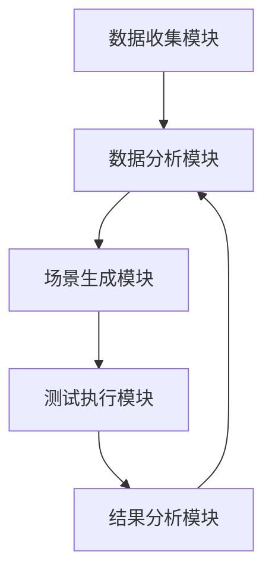

# 智能性能测试场景生成:全面评估系统性能

> 关键词：智能性能测试、场景生成、系统性能评估、测试用例、自动化测试

> 摘要：本文围绕智能性能测试场景生成展开，旨在深入探讨如何通过科学有效的方法全面评估系统性能。详细介绍了智能性能测试场景生成的背景知识，包括目的、预期读者等。阐述了核心概念与联系，给出了原理和架构的示意图及流程图。深入讲解了核心算法原理，并结合 Python 源代码进行说明，同时介绍了相关数学模型和公式。通过项目实战展示了具体的代码实现和解读，分析了实际应用场景。还推荐了相关的工具和资源，最后总结了未来发展趋势与挑战，提供了常见问题解答和扩展阅读参考资料，为全面了解和应用智能性能测试场景生成技术提供了系统而深入的指导。

## 1. 背景介绍 
### 1.1 目的和范围
在当今数字化时代，软件系统的性能对于其成功部署和使用至关重要。性能不佳的系统可能导致用户体验下降、业务流程受阻，甚至造成经济损失。智能性能测试场景生成的目的在于通过自动化和智能化的手段，生成全面且具有代表性的测试场景，从而对系统的性能进行准确、全面的评估。

其范围涵盖了各种类型的软件系统，包括但不限于 Web 应用程序、移动应用、分布式系统、大数据平台等。无论是小型企业应用还是大型的企业级系统，都可以借助智能性能测试场景生成技术来提升系统性能的可靠性和稳定性。

### 1.2 预期读者
本文的预期读者包括软件测试人员、性能测试工程师、软件开发者、系统架构师以及对系统性能评估和测试技术感兴趣的研究人员。对于软件测试人员和性能测试工程师来说，本文可以提供具体的技术方法和实践经验，帮助他们更高效地进行性能测试。软件开发者可以从本文中了解性能测试的需求和方法，从而在开发过程中更好地考虑系统性能因素。系统架构师可以通过本文的内容，优化系统架构以提高系统的性能。研究人员则可以将本文作为参考，深入研究智能性能测试场景生成领域的相关问题。

### 1.3 文档结构概述
本文首先介绍智能性能测试场景生成的背景知识，包括目的、预期读者等内容。接着阐述核心概念与联系，通过文本示意图和 Mermaid 流程图展示其原理和架构。然后详细讲解核心算法原理，并结合 Python 源代码进行说明，同时介绍相关的数学模型和公式。通过项目实战部分展示具体的代码实现和解读，分析实际应用场景。推荐相关的工具和资源，包括学习资源、开发工具框架和相关论文著作。最后总结未来发展趋势与挑战，提供常见问题解答和扩展阅读参考资料。

### 1.4 术语表
#### 1.4.1 核心术语定义
- **智能性能测试**：利用人工智能和自动化技术，对软件系统的性能进行测试和评估的过程。
- **场景生成**：根据系统的需求和特点，自动生成一系列具有代表性的测试场景的过程。
- **系统性能评估**：对软件系统在不同条件下的性能指标进行测量和分析，以确定系统是否满足性能需求的过程。
- **测试用例**：为了验证系统的某个功能或性能指标而设计的一组输入和预期输出。
- **自动化测试**：使用自动化工具执行测试用例，减少人工干预，提高测试效率的测试方法。

#### 1.4.2 相关概念解释
- **性能指标**：用于衡量系统性能的各种参数，如响应时间、吞吐量、并发用户数等。
- **负载测试**：通过模拟不同的用户负载，测试系统在各种负载条件下的性能表现。
- **压力测试**：在极端负载条件下，测试系统的性能极限和稳定性。
- **并发用户数**：同时访问系统的用户数量。
- **吞吐量**：系统在单位时间内处理的请求数量。

#### 1.4.3 缩略词列表
- **QPS**：Queries Per Second，每秒查询率。
- **TPS**：Transactions Per Second，每秒事务数。
- **RT**：Response Time，响应时间。
- **CPU**：Central Processing Unit，中央处理器。
- **RAM**：Random Access Memory，随机存取存储器。

## 2. 核心概念与联系 

智能性能测试场景生成的核心在于利用人工智能和自动化技术，根据系统的需求和特点，生成一系列具有代表性的测试场景，以全面评估系统的性能。其基本原理是通过对系统的功能、业务流程、用户行为等进行分析，提取关键信息，然后利用这些信息生成测试场景。

### 核心概念原理和架构的文本示意图

智能性能测试场景生成的架构主要包括以下几个部分：

1. **数据收集模块**：负责收集系统的相关数据，包括系统的功能需求、业务流程、用户行为日志等。
2. **数据分析模块**：对收集到的数据进行分析，提取关键信息，如系统的性能瓶颈、用户的高频操作等。
3. **场景生成模块**：根据数据分析模块提取的关键信息，利用人工智能算法生成测试场景。
4. **测试执行模块**：执行生成的测试场景，收集系统的性能数据。
5. **结果分析模块**：对测试执行模块收集的性能数据进行分析，评估系统的性能。

### Mermaid 流程图



该流程图展示了智能性能测试场景生成的整个流程。首先，数据收集模块收集系统的相关数据，然后数据分析模块对这些数据进行分析，提取关键信息。场景生成模块根据这些关键信息生成测试场景，测试执行模块执行这些测试场景并收集性能数据。最后，结果分析模块对性能数据进行分析，评估系统的性能。如果在分析过程中发现需要进一步收集数据或调整测试场景，则返回数据收集模块或场景生成模块进行相应的操作。

## 3. 核心算法原理 & 具体操作步骤 

### 核心算法原理

智能性能测试场景生成的核心算法可以采用机器学习算法，如决策树、随机森林、神经网络等。这里以决策树算法为例进行说明。

决策树算法是一种基于树结构进行决策的算法，它通过对数据进行划分，构建一棵决策树，每个内部节点表示一个属性上的测试，每个分支表示一个测试输出，每个叶节点表示一个类别或值。在智能性能测试场景生成中，决策树算法可以根据系统的功能、业务流程、用户行为等信息，生成不同的测试场景。

### 具体操作步骤

1. **数据预处理**：对收集到的数据进行清洗、转换和归一化等操作，以提高数据的质量和可用性。
2. **特征选择**：从预处理后的数据中选择与系统性能相关的特征，以减少数据的维度和复杂度。
3. **模型训练**：使用决策树算法对特征选择后的数据进行训练，构建决策树模型。
4. **场景生成**：根据训练好的决策树模型，生成不同的测试场景。
5. **测试执行**：执行生成的测试场景，收集系统的性能数据。
6. **模型评估**：对收集到的性能数据进行分析，评估决策树模型的性能。
7. **模型优化**：根据模型评估的结果，对决策树模型进行优化，以提高其性能。

### Python 源代码实现

```python
import pandas as pd
from sklearn.tree import DecisionTreeClassifier
from sklearn.model_selection import train_test_split
from sklearn.metrics import accuracy_score

# 数据预处理
def preprocess_data(data):
    # 清洗数据
    data = data.dropna()
    # 转换数据
    data = pd.get_dummies(data)
    # 归一化数据
    data = (data - data.mean()) / data.std()
    return data

# 特征选择
def feature_selection(data):
    # 选择与系统性能相关的特征
    features = data.drop(['performance'], axis=1)
    labels = data['performance']
    return features, labels

# 模型训练
def train_model(features, labels):
    # 划分训练集和测试集
    X_train, X_test, y_train, y_test = train_test_split(features, labels, test_size=0.2, random_state=42)
    # 构建决策树模型
    model = DecisionTreeClassifier()
    # 训练模型
    model.fit(X_train, y_train)
    # 评估模型
    y_pred = model.predict(X_test)
    accuracy = accuracy_score(y_test, y_pred)
    print(f"模型准确率: {accuracy}")
    return model

# 场景生成
def generate_scenarios(model, features):
    # 生成测试场景
    scenarios = model.predict(features)
    return scenarios

# 主函数
def main():
    # 读取数据
    data = pd.read_csv('system_data.csv')
    # 数据预处理
    data = preprocess_data(data)
    # 特征选择
    features, labels = feature_selection(data)
    # 模型训练
    model = train_model(features, labels)
    # 场景生成
    scenarios = generate_scenarios(model, features)
    print(f"生成的测试场景: {scenarios}")

if __name__ == "__main__":
    main()
```

### 代码解释

1. **数据预处理**：`preprocess_data` 函数对收集到的数据进行清洗、转换和归一化等操作，以提高数据的质量和可用性。
2. **特征选择**：`feature_selection` 函数从预处理后的数据中选择与系统性能相关的特征，以减少数据的维度和复杂度。
3. **模型训练**：`train_model` 函数使用决策树算法对特征选择后的数据进行训练，构建决策树模型，并评估模型的准确率。
4. **场景生成**：`generate_scenarios` 函数根据训练好的决策树模型，生成不同的测试场景。
5. **主函数**：`main` 函数调用上述函数，完成数据预处理、特征选择、模型训练和场景生成等操作。

## 4. 数学模型和公式 & 详细讲解 & 举例说明 

### 信息增益公式

在决策树算法中，信息增益是一种常用的特征选择方法。信息增益的计算公式如下：

$$
IG(S, A) = H(S) - \sum_{v \in Values(A)} \frac{|S_v|}{|S|} H(S_v)
$$

其中：
- $IG(S, A)$ 表示特征 $A$ 对数据集 $S$ 的信息增益。
- $H(S)$ 表示数据集 $S$ 的熵。
- $Values(A)$ 表示特征 $A$ 的所有可能取值。
- $S_v$ 表示数据集 $S$ 中特征 $A$ 取值为 $v$ 的子集。
- $|S|$ 表示数据集 $S$ 的样本数量。
- $|S_v|$ 表示子集 $S_v$ 的样本数量。

### 熵的计算公式

熵是衡量数据集纯度的一种指标，其计算公式如下：

$$
H(S) = - \sum_{i=1}^{n} p_i \log_2 p_i
$$

其中：
- $H(S)$ 表示数据集 $S$ 的熵。
- $p_i$ 表示数据集 $S$ 中第 $i$ 类样本的比例。
- $n$ 表示数据集 $S$ 中类别的数量。

### 详细讲解

信息增益的计算过程如下：

1. 计算数据集 $S$ 的熵 $H(S)$。
2. 对于每个特征 $A$，计算其所有可能取值 $v$ 对应的子集 $S_v$。
3. 计算每个子集 $S_v$ 的熵 $H(S_v)$。
4. 根据信息增益公式计算特征 $A$ 对数据集 $S$ 的信息增益 $IG(S, A)$。
5. 选择信息增益最大的特征作为决策树的根节点。

### 举例说明

假设有一个数据集 $S$，包含 10 个样本，分为两个类别：正类和负类。其中，正类样本有 6 个，负类样本有 4 个。则数据集 $S$ 的熵为：

$$
H(S) = - \left( \frac{6}{10} \log_2 \frac{6}{10} + \frac{4}{10} \log_2 \frac{4}{10} \right) \approx 0.971
$$

假设存在一个特征 $A$，有两个可能取值：$v_1$ 和 $v_2$。其中，取值为 $v_1$ 的样本有 4 个，正类样本有 3 个，负类样本有 1 个；取值为 $v_2$ 的样本有 6 个，正类样本有 3 个，负类样本有 3 个。则子集 $S_{v_1}$ 和 $S_{v_2}$ 的熵分别为：

$$
H(S_{v_1}) = - \left( \frac{3}{4} \log_2 \frac{3}{4} + \frac{1}{4} \log_2 \frac{1}{4} \right) \approx 0.811
$$

$$
H(S_{v_2}) = - \left( \frac{3}{6} \log_2 \frac{3}{6} + \frac{3}{6} \log_2 \frac{3}{6} \right) = 1
$$

则特征 $A$ 对数据集 $S$ 的信息增益为：

$$
IG(S, A) = H(S) - \left( \frac{4}{10} H(S_{v_1}) + \frac{6}{10} H(S_{v_2}) \right) \approx 0.971 - \left( \frac{4}{10} \times 0.811 + \frac{6}{10} \times 1 \right) \approx 0.126
$$

## 5. 项目实战：代码实际案例和详细解释说明 

### 5.1  开发环境搭建

#### 操作系统
本项目可以在 Windows、Linux 或 macOS 操作系统上进行开发。建议使用 Linux 或 macOS 系统，因为它们对 Python 开发环境的支持更好。

#### Python 环境
安装 Python 3.7 或更高版本。可以从 Python 官方网站（https://www.python.org/downloads/） 下载并安装。

#### 依赖库安装
使用以下命令安装项目所需的依赖库：

```sh
pip install pandas scikit-learn
```

### 5.2  源代码详细实现和代码解读

```python
import pandas as pd
from sklearn.tree import DecisionTreeClassifier
from sklearn.model_selection import train_test_split
from sklearn.metrics import accuracy_score

# 数据预处理
def preprocess_data(data):
    # 清洗数据，去除缺失值
    data = data.dropna()
    # 对分类变量进行独热编码
    data = pd.get_dummies(data)
    # 归一化数据，使数据具有零均值和单位方差
    data = (data - data.mean()) / data.std()
    return data

# 特征选择
def feature_selection(data):
    # 假设 'performance' 是目标变量
    features = data.drop(['performance'], axis=1)
    labels = data['performance']
    return features, labels

# 模型训练
def train_model(features, labels):
    # 划分训练集和测试集，测试集占比 20%
    X_train, X_test, y_train, y_test = train_test_split(features, labels, test_size=0.2, random_state=42)
    # 构建决策树分类器
    model = DecisionTreeClassifier()
    # 训练模型
    model.fit(X_train, y_train)
    # 在测试集上进行预测
    y_pred = model.predict(X_test)
    # 计算模型的准确率
    accuracy = accuracy_score(y_test, y_pred)
    print(f"模型准确率: {accuracy}")
    return model

# 场景生成
def generate_scenarios(model, features):
    # 根据训练好的模型生成测试场景
    scenarios = model.predict(features)
    return scenarios

# 主函数
def main():
    # 读取数据集
    data = pd.read_csv('system_data.csv')
    # 数据预处理
    data = preprocess_data(data)
    # 特征选择
    features, labels = feature_selection(data)
    # 模型训练
    model = train_model(features, labels)
    # 场景生成
    scenarios = generate_scenarios(model, features)
    print(f"生成的测试场景: {scenarios}")

if __name__ == "__main__":
    main()
```

### 5.3  代码解读与分析

1. **数据预处理**：`preprocess_data` 函数的主要作用是对数据进行清洗、转换和归一化。首先，使用 `dropna` 方法去除数据中的缺失值，以确保数据的完整性。然后，使用 `pd.get_dummies` 方法对分类变量进行独热编码，将分类变量转换为数值变量，以便模型能够处理。最后，对数据进行归一化处理，使数据具有零均值和单位方差，有助于提高模型的性能。

2. **特征选择**：`feature_selection` 函数的作用是从数据中选择特征和标签。假设 `'performance'` 是目标变量，使用 `drop` 方法去除该列，得到特征矩阵 `features`，同时提取目标变量 `labels`。

3. **模型训练**：`train_model` 函数使用 `train_test_split` 方法将数据集划分为训练集和测试集，测试集占比 20%。然后，构建决策树分类器 `DecisionTreeClassifier`，并使用训练集对模型进行训练。在测试集上进行预测，并使用 `accuracy_score` 方法计算模型的准确率。

4. **场景生成**：`generate_scenarios` 函数根据训练好的模型对特征矩阵进行预测，生成测试场景。

5. **主函数**：`main` 函数是程序的入口点，它调用上述函数，完成数据读取、预处理、特征选择、模型训练和场景生成等操作。

## 6. 实际应用场景 

### Web 应用程序性能测试
在 Web 应用程序开发中，智能性能测试场景生成可以帮助测试人员模拟不同的用户行为和负载，全面评估 Web 应用程序的性能。例如，可以生成不同用户并发访问、不同页面请求、不同数据量操作等测试场景，以检测 Web 应用程序在各种情况下的响应时间、吞吐量等性能指标。通过智能性能测试场景生成，可以及时发现 Web 应用程序的性能瓶颈，优化代码和服务器配置，提高用户体验。

### 移动应用性能测试
对于移动应用来说，性能是用户选择和使用的重要因素之一。智能性能测试场景生成可以模拟不同的移动设备、网络环境和用户操作，对移动应用的性能进行全面评估。例如，可以生成不同屏幕分辨率、不同网络带宽、不同用户操作频率等测试场景，以检测移动应用的启动时间、响应时间、内存占用等性能指标。通过智能性能测试场景生成，可以优化移动应用的性能，提高用户满意度。

### 分布式系统性能测试
分布式系统通常由多个节点组成，其性能受到网络延迟、节点负载均衡等多种因素的影响。智能性能测试场景生成可以模拟不同的分布式环境和负载，对分布式系统的性能进行全面评估。例如，可以生成不同节点数量、不同网络拓扑结构、不同数据分布等测试场景，以检测分布式系统的吞吐量、响应时间、数据一致性等性能指标。通过智能性能测试场景生成，可以优化分布式系统的架构和配置，提高系统的性能和可靠性。

### 大数据平台性能测试
大数据平台需要处理海量的数据，其性能对数据处理的效率和准确性至关重要。智能性能测试场景生成可以模拟不同的大数据处理任务和负载，对大数据平台的性能进行全面评估。例如，可以生成不同数据量、不同数据类型、不同处理算法等测试场景，以检测大数据平台的处理速度、内存占用、磁盘 I/O 等性能指标。通过智能性能测试场景生成，可以优化大数据平台的算法和配置，提高数据处理的效率和准确性。

## 7. 工具和资源推荐
### 7.1 学习资源推荐
#### 7.1.1 书籍推荐
- 《Python 数据分析实战》：这本书详细介绍了 Python 在数据分析领域的应用，包括数据预处理、特征选择、模型训练等内容，对于理解智能性能测试场景生成中的数据处理和机器学习算法有很大帮助。
- 《机器学习实战》：通过实际案例介绍了各种机器学习算法的原理和实现，对于学习智能性能测试场景生成中的核心算法非常有帮助。
- 《性能之巅：洞悉系统、企业与云计算》：全面介绍了系统性能分析的方法和技术，对于理解系统性能评估的原理和方法有很大的帮助。

#### 7.1.2 在线课程
- Coursera 上的 “Machine Learning” 课程：由斯坦福大学的 Andrew Ng 教授授课，系统地介绍了机器学习的基本概念、算法和应用，对于学习智能性能测试场景生成中的机器学习算法非常有帮助。
- edX 上的 “Data Science MicroMasters Program” 课程：提供了全面的数据科学知识和技能培训，包括数据预处理、特征工程、模型训练等内容，对于理解智能性能测试场景生成中的数据处理和建模有很大帮助。
- Udemy 上的 “Python for Data Science and Machine Learning Bootcamp” 课程：通过实际案例介绍了 Python 在数据科学和机器学习领域的应用，对于学习智能性能测试场景生成中的 Python 编程和机器学习算法非常有帮助。

#### 7.1.3 技术博客和网站
- Medium：上面有很多关于数据科学、机器学习和性能测试的技术文章，可以及时了解最新的技术动态和研究成果。
- Towards Data Science：专注于数据科学和机器学习领域的技术博客，提供了很多高质量的技术文章和案例分析。
- Stack Overflow：一个知名的技术问答社区，可以在上面查找和解决在智能性能测试场景生成过程中遇到的技术问题。

### 7.2 开发工具框架推荐
#### 7.2.1 IDE和编辑器
- PyCharm：一款专业的 Python 集成开发环境，提供了丰富的代码编辑、调试、版本控制等功能，对于开发智能性能测试场景生成相关的 Python 代码非常方便。
- Visual Studio Code：一款轻量级的代码编辑器，支持多种编程语言和插件，对于快速开发和调试智能性能测试场景生成相关的代码非常有用。
- Jupyter Notebook：一个交互式的开发环境，适合进行数据探索、模型训练和可视化等操作，对于智能性能测试场景生成中的数据分析和模型训练非常有帮助。

#### 7.2.2 调试和性能分析工具
- pdb：Python 内置的调试器，可以帮助开发人员调试 Python 代码，定位和解决代码中的问题。
- cProfile：Python 内置的性能分析工具，可以帮助开发人员分析 Python 代码的性能瓶颈，优化代码性能。
- Py-Spy：一个跨平台的 Python 性能分析工具，可以实时监控 Python 程序的性能，找出性能瓶颈。

#### 7.2.3 相关框架和库
- Pandas：一个强大的数据分析库，提供了高效的数据结构和数据处理工具，对于智能性能测试场景生成中的数据预处理和分析非常有用。
- Scikit-learn：一个简单易用的机器学习库，提供了各种机器学习算法和工具，对于智能性能测试场景生成中的模型训练和预测非常有帮助。
- TensorFlow：一个开源的深度学习框架，提供了高效的深度学习算法和工具，对于处理复杂的智能性能测试场景生成问题非常有用。

### 7.3 相关论文著作推荐
#### 7.3.1 经典论文
- “A Decision-Theoretic Generalization of On-Line Learning and an Application to Boosting”：这篇论文介绍了决策理论在在线学习和提升算法中的应用，对于理解智能性能测试场景生成中的决策树算法有很大帮助。
- “The Elements of Statistical Learning”：这本书全面介绍了统计学习的基本概念、算法和应用，对于理解智能性能测试场景生成中的机器学习算法非常有帮助。
- “Pattern Recognition and Machine Learning”：这本书系统地介绍了模式识别和机器学习的基本概念、算法和应用，对于理解智能性能测试场景生成中的机器学习算法非常有帮助。

#### 7.3.2 最新研究成果
- 可以通过学术搜索引擎（如 Google Scholar、IEEE Xplore、ACM Digital Library 等）搜索关于智能性能测试场景生成的最新研究论文，了解该领域的最新研究动态和成果。

#### 7.3.3 应用案例分析
- 可以通过相关的技术博客、会议论文和行业报告等渠道，查找智能性能测试场景生成的应用案例分析，了解该技术在实际项目中的应用效果和经验教训。

## 8. 总结：未来发展趋势与挑战

### 未来发展趋势

#### 智能化程度不断提高
随着人工智能技术的不断发展，智能性能测试场景生成的智能化程度将不断提高。未来，智能性能测试场景生成系统将能够自动学习和适应系统的变化，生成更加准确、全面的测试场景。例如，系统可以根据用户的行为模式和系统的性能反馈，自动调整测试场景的生成策略，提高测试的效率和准确性。

#### 与其他技术的融合
智能性能测试场景生成将与其他技术（如大数据、云计算、物联网等）进行深度融合。例如，结合大数据技术，可以对海量的系统运行数据进行分析，提取更有价值的信息，从而生成更具针对性的测试场景。利用云计算技术，可以实现测试资源的弹性分配和高效利用，提高测试的效率和可扩展性。在物联网领域，智能性能测试场景生成可以模拟各种物联网设备的行为和交互，对物联网系统的性能进行全面评估。

#### 可视化和自动化程度提高
未来的智能性能测试场景生成系统将提供更加直观、可视化的界面，方便测试人员进行操作和管理。同时，系统的自动化程度将进一步提高，从数据收集、场景生成到测试执行和结果分析，都可以实现自动化处理，减少人工干预，提高测试的效率和准确性。

### 挑战

#### 数据质量和安全性
智能性能测试场景生成需要大量的系统运行数据作为输入，数据的质量和安全性直接影响到测试场景的准确性和可靠性。如何保证数据的准确性、完整性和安全性是一个重要的挑战。例如，数据可能存在缺失值、错误值等问题，需要进行有效的数据清洗和预处理。同时，数据的安全性也需要得到保障，防止数据泄露和滥用。

#### 算法的复杂性和可解释性
智能性能测试场景生成中使用的机器学习和人工智能算法往往比较复杂，难以理解和解释。如何提高算法的可解释性，让测试人员能够理解和信任生成的测试场景，是一个需要解决的问题。例如，决策树算法虽然相对简单，但当树的深度较大时，也会变得难以理解。而一些深度学习算法，如神经网络，其内部机制更加复杂，可解释性较差。

#### 系统的适应性和可扩展性
随着软件系统的不断发展和变化，智能性能测试场景生成系统需要能够快速适应系统的变化，生成相应的测试场景。同时，系统还需要具备良好的可扩展性，能够处理大规模的系统和数据。例如，当系统的功能和业务流程发生变化时，测试场景生成系统需要能够及时调整生成策略，生成新的测试场景。

## 9. 附录：常见问题与解答

### 1. 智能性能测试场景生成与传统性能测试有什么区别？
智能性能测试场景生成利用人工智能和自动化技术，能够根据系统的需求和特点，自动生成全面且具有代表性的测试场景。而传统性能测试通常需要手动设计测试场景，测试场景的覆盖范围和准确性可能受到测试人员经验和知识的限制。智能性能测试场景生成可以提高测试的效率和准确性，减少人工工作量。

### 2. 如何保证生成的测试场景的质量？
可以从以下几个方面保证生成的测试场景的质量：
- **数据质量**：确保收集到的系统数据准确、完整，经过有效的清洗和预处理。
- **算法选择**：选择合适的机器学习和人工智能算法，根据系统的特点和需求进行优化和调整。
- **模型评估**：对生成的测试场景进行评估和验证，通过实际测试和分析，不断优化测试场景的生成策略。
- **人工干预**：在必要时，由测试人员对生成的测试场景进行人工审核和调整，确保测试场景的合理性和有效性。

### 3. 智能性能测试场景生成需要具备哪些技术知识？
智能性能测试场景生成需要具备以下技术知识：
- **数据处理**：包括数据清洗、转换、归一化等操作，以及对数据的分析和理解。
- **机器学习**：了解常见的机器学习算法，如决策树、随机森林、神经网络等，掌握模型训练、评估和优化的方法。
- **Python 编程**：掌握 Python 编程语言，能够使用相关的库和框架进行数据处理、模型训练和测试场景生成。
- **系统性能评估**：了解系统性能评估的基本概念和方法，掌握常见的性能指标和测试工具。

### 4. 智能性能测试场景生成可以应用于哪些领域？
智能性能测试场景生成可以应用于各种类型的软件系统，包括但不限于 Web 应用程序、移动应用、分布式系统、大数据平台等。在金融、医疗、电商、游戏等行业的软件系统性能测试中都有广泛的应用。

### 5. 如何选择适合的智能性能测试场景生成算法？
选择适合的智能性能测试场景生成算法需要考虑以下因素：
- **数据特点**：根据数据的类型、规模和分布等特点，选择合适的算法。例如，如果数据具有明显的分类特征，可以选择决策树算法；如果数据具有复杂的非线性关系，可以选择神经网络算法。
- **系统需求**：根据系统的性能需求和测试目标，选择能够满足需求的算法。例如，如果需要快速生成测试场景，可以选择简单高效的算法；如果需要高精度的测试场景，可以选择复杂的算法。
- **算法复杂度**：考虑算法的复杂度和可解释性，选择能够在可接受的时间和资源成本内完成测试场景生成的算法。

## 10. 扩展阅读 & 参考资料

### 扩展阅读
- 《软件性能测试实战》：深入介绍了软件性能测试的方法和技术，包括性能测试的流程、工具和案例分析，对于进一步了解智能性能测试场景生成在软件性能测试中的应用有很大帮助。
- 《人工智能：一种现代的方法》：全面介绍了人工智能的基本概念、算法和应用，对于深入理解智能性能测试场景生成中的人工智能技术有很大的帮助。
- 《Python 机器学习实战》：通过实际案例介绍了 Python 在机器学习领域的应用，对于学习智能性能测试场景生成中的 Python 编程和机器学习算法非常有帮助。

### 参考资料
- [Python 官方文档](https://docs.python.org/3/)：提供了 Python 编程语言的详细文档和教程。
- [Scikit-learn 官方文档](https://scikit-learn.org/stable/)：提供了 Scikit-learn 机器学习库的详细文档和教程。
- [Pandas 官方文档](https://pandas.pydata.org/docs/)：提供了 Pandas 数据分析库的详细文档和教程。
- [TensorFlow 官方文档](https://www.tensorflow.org/api_docs)：提供了 TensorFlow 深度学习框架的详细文档和教程。