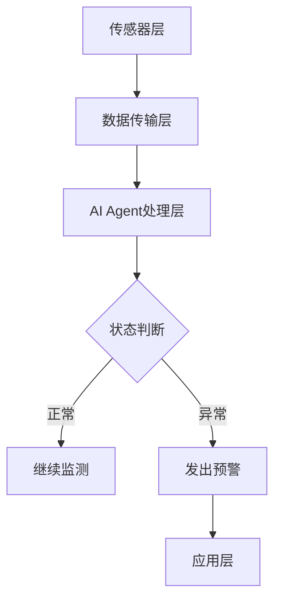

# 智能浴室防滑垫：AI Agent的老人关怀系统

> 关键词：智能浴室防滑垫、AI Agent、老人关怀系统、安全监测、健康管理

> 摘要：本文聚焦于智能浴室防滑垫这一创新产品，深入探讨其作为AI Agent的老人关怀系统的相关技术和应用。通过详细介绍其背景、核心概念、算法原理、数学模型、项目实战、实际应用场景等内容，阐述了该系统在保障老人浴室安全、进行健康管理等方面的重要作用。同时，推荐了相关的学习资源、开发工具和论文著作，最后对其未来发展趋势与挑战进行了总结，并提供常见问题解答和参考资料，为相关领域的研究和应用提供全面的技术参考。

## 1. 背景介绍 
### 1.1 目的和范围
随着全球人口老龄化的加剧，老人的生活安全和健康问题日益受到关注。浴室作为日常生活中容易发生意外的场所，对于老人来说存在较高的安全风险，如滑倒、摔倒等。智能浴室防滑垫作为一种新型的智能设备，旨在利用先进的AI技术，实时监测老人在浴室中的状态，提供安全保障和健康关怀。本文章的范围涵盖了智能浴室防滑垫的技术原理、开发实现、应用场景以及未来发展等多个方面，旨在全面介绍这一创新的老人关怀系统。

### 1.2 预期读者
本文预期读者包括从事智能硬件开发、人工智能研究、养老服务等领域的专业人士，以及对智能养老产品感兴趣的爱好者。对于智能硬件开发者，可从中获取智能浴室防滑垫的技术实现细节和开发思路；人工智能研究人员可关注AI Agent在该系统中的应用和算法优化；养老服务从业者能了解如何借助智能设备提升老人的生活安全和质量；而爱好者则可通过本文了解智能养老产品的发展趋势和技术魅力。

### 1.3 文档结构概述
本文共分为十个部分。首先介绍智能浴室防滑垫：AI Agent的老人关怀系统的背景，包括目的、预期读者和文档结构概述；接着阐述核心概念与联系，通过文本示意图和Mermaid流程图展示系统的原理和架构；然后详细讲解核心算法原理及具体操作步骤，并给出Python源代码；再介绍数学模型和公式，通过举例说明其应用；随后进行项目实战，包括开发环境搭建、源代码实现和代码解读；之后介绍实际应用场景；接着推荐相关的工具和资源；再总结未来发展趋势与挑战；提供常见问题与解答作为附录；最后给出扩展阅读和参考资料。

### 1.4 术语表
#### 1.4.1 核心术语定义
- **智能浴室防滑垫**：一种集成了多种传感器和智能芯片的防滑垫，能够实时监测使用者在浴室中的状态信息，如压力分布、站立时长等。
- **AI Agent（人工智能代理）**：能够感知环境、做出决策并采取行动的智能实体。在智能浴室防滑垫中，AI Agent通过对传感器数据的分析，实现对老人状态的监测和预警。
- **老人关怀系统**：以保障老人生活安全和健康为目的，综合运用多种技术手段，对老人的生活状态进行监测、管理和关怀的系统。

#### 1.4.2 相关概念解释
- **传感器融合**：将多种不同类型的传感器数据进行整合和处理，以获取更全面、准确的信息。在智能浴室防滑垫中，可能会融合压力传感器、温度传感器等数据，用于判断老人的状态。
- **实时监测**：对目标对象的状态进行连续、不间断的监测，以便及时发现异常情况。在智能浴室防滑垫中，实时监测老人在浴室中的行为和状态，为安全保障提供支持。

#### 1.4.3 缩略词列表
- **AI**：Artificial Intelligence（人工智能）
- **IoT**：Internet of Things（物联网）

## 2. 核心概念与联系 

### 核心概念原理
智能浴室防滑垫的核心原理是利用多种传感器收集老人在浴室中的行为和状态信息，然后通过AI Agent对这些信息进行分析和处理。压力传感器可以感知老人的站立位置、压力分布和体重变化，温度传感器可以监测浴室的温度和湿度。AI Agent将这些传感器数据进行融合，运用机器学习和数据分析算法，判断老人的行为是否正常，如是否滑倒、是否长时间静止等。如果检测到异常情况，系统会及时发出预警信息，通知相关人员。

### 架构的文本示意图
智能浴室防滑垫的架构主要包括传感器层、数据传输层、AI Agent处理层和应用层。传感器层负责收集老人在浴室中的各种数据，如压力、温度等；数据传输层将传感器收集的数据传输到AI Agent处理层；AI Agent处理层对数据进行分析和处理，判断老人的状态；应用层则将处理结果呈现给用户，如通过手机APP或智能音箱发出预警信息。

### Mermaid 流程图


## 3. 核心算法原理 & 具体操作步骤 

### 核心算法原理
智能浴室防滑垫中主要运用的算法包括机器学习算法和数据分析算法。以判断老人是否滑倒为例，我们可以使用支持向量机（SVM）算法进行分类。支持向量机是一种二分类模型，它的基本模型是定义在特征空间上的间隔最大的线性分类器，间隔最大使它有别于感知机。

### 具体操作步骤
1. **数据收集**：通过压力传感器和其他传感器收集老人在浴室中的数据，包括压力分布、站立时长、温度等。
2. **数据预处理**：对收集到的数据进行清洗、归一化等处理，以提高数据的质量和可用性。
3. **特征提取**：从预处理后的数据中提取有代表性的特征，如压力的最大值、最小值、平均值等。
4. **模型训练**：使用支持向量机算法对提取的特征进行训练，构建滑倒判断模型。
5. **实时监测**：在老人使用浴室时，实时收集传感器数据，提取特征并输入到训练好的模型中进行判断。
6. **预警处理**：如果模型判断老人可能滑倒，系统及时发出预警信息。

### Python源代码实现
```python
import numpy as np
from sklearn import svm
from sklearn.preprocessing import StandardScaler

# 模拟数据收集
# 假设我们有100个样本，每个样本有5个特征
X_train = np.random.rand(100, 5)
# 标签，0表示正常，1表示滑倒
y_train = np.random.randint(0, 2, 100)

# 数据预处理
scaler = StandardScaler()
X_train_scaled = scaler.fit_transform(X_train)

# 模型训练
clf = svm.SVC(kernel='linear')
clf.fit(X_train_scaled, y_train)

# 模拟实时监测数据
new_data = np.random.rand(1, 5)
new_data_scaled = scaler.transform(new_data)

# 进行预测
prediction = clf.predict(new_data_scaled)

if prediction[0] == 1:
    print("预警：老人可能滑倒！")
else:
    print("老人状态正常。")
```

## 4. 数学模型和公式 & 详细讲解 & 举例说明 

### 支持向量机的数学模型
支持向量机的目标是找到一个最优的超平面，使得不同类别的样本能够被最大程度地分开。对于线性可分的数据集，我们可以定义一个超平面：
$$w^T x + b = 0$$
其中，$w$ 是超平面的法向量，$b$ 是偏置项，$x$ 是样本向量。

支持向量机的优化目标是最大化间隔，间隔的定义为：
$$\gamma = \frac{2}{\|w\|}$$
为了求解最优的 $w$ 和 $b$，我们需要满足以下约束条件：
$$y_i(w^T x_i + b) \geq 1, i = 1, 2, \cdots, n$$
其中，$y_i$ 是样本 $x_i$ 的标签，$n$ 是样本数量。

### 详细讲解
支持向量机通过求解上述优化问题，找到最优的超平面。在实际应用中，我们可以使用拉格朗日乘子法将约束优化问题转化为无约束优化问题，进而求解最优解。

### 举例说明
假设我们有一个二维数据集，包含两个类别：正类和负类。我们希望找到一个超平面将这两个类别分开。通过支持向量机算法，我们可以找到一个最优的超平面，使得两个类别之间的间隔最大。在这个例子中，超平面的法向量 $w$ 和偏置项 $b$ 决定了超平面的位置和方向，而支持向量则是离超平面最近的样本点，它们对超平面的确定起着关键作用。

## 5. 项目实战：代码实际案例和详细解释说明 

### 5.1  开发环境搭建
1. **硬件准备**：选择合适的压力传感器、温度传感器等硬件设备，并将它们与开发板（如Arduino、Raspberry Pi等）连接。
2. **软件环境**：安装Python开发环境，建议使用Anaconda来管理Python环境和安装相关的库。安装必要的Python库，如NumPy、Scikit-learn、Pandas等。

### 5.2  源代码详细实现和代码解读
```python
import numpy as np
import pandas as pd
from sklearn import svm
from sklearn.preprocessing import StandardScaler
import serial

# 串口通信设置
ser = serial.Serial('COM3', 9600)  # 根据实际情况修改串口号和波特率

# 数据收集函数
def collect_data():
    data_list = []
    for i in range(100):  # 收集100个样本
        line = ser.readline().decode('utf-8').strip()
        data = [float(x) for x in line.split(',')]
        data_list.append(data)
    return np.array(data_list)

# 数据预处理函数
def preprocess_data(X):
    scaler = StandardScaler()
    X_scaled = scaler.fit_transform(X)
    return X_scaled

# 模型训练函数
def train_model(X_train, y_train):
    clf = svm.SVC(kernel='linear')
    clf.fit(X_train, y_train)
    return clf

# 主函数
def main():
    # 数据收集
    X = collect_data()
    # 假设标签数据
    y = np.random.randint(0, 2, X.shape[0])
    # 数据预处理
    X_scaled = preprocess_data(X)
    # 模型训练
    model = train_model(X_scaled, y)

    while True:
        line = ser.readline().decode('utf-8').strip()
        new_data = np.array([float(x) for x in line.split(',')]).reshape(1, -1)
        new_data_scaled = preprocess_data(new_data)
        prediction = model.predict(new_data_scaled)
        if prediction[0] == 1:
            print("预警：老人可能滑倒！")
        else:
            print("老人状态正常。")

if __name__ == "__main__":
    main()
```

### 5.3  代码解读与分析
1. **串口通信**：使用 `serial.Serial` 函数建立与硬件设备的串口通信，从硬件设备中读取传感器数据。
2. **数据收集**：`collect_data` 函数通过串口读取100个样本的数据，并将其转换为NumPy数组。
3. **数据预处理**：`preprocess_data` 函数使用 `StandardScaler` 对数据进行归一化处理，提高数据的质量。
4. **模型训练**：`train_model` 函数使用支持向量机算法对预处理后的数据进行训练，构建滑倒判断模型。
5. **实时监测**：在主函数中，通过不断读取串口数据，对新的数据进行预处理并输入到训练好的模型中进行判断，根据判断结果发出预警信息。

## 6. 实际应用场景 
### 家庭场景
在家庭浴室中安装智能浴室防滑垫，可以实时监测老人的浴室安全。当老人在浴室中发生滑倒等意外情况时，系统会及时发出预警信息，通知家人或紧急联系人，以便及时采取救援措施。此外，智能浴室防滑垫还可以记录老人在浴室中的行为习惯，如洗澡时长、站立时间等，为家人了解老人的健康状况提供参考。

### 养老机构场景
在养老机构的浴室中，智能浴室防滑垫可以大规模应用。养老机构的工作人员可以通过管理平台实时查看老人在浴室中的状态，提高管理效率和服务质量。同时，智能浴室防滑垫还可以与养老机构的其他系统集成，如健康管理系统、紧急救援系统等，实现更加全面的老人关怀服务。

### 医疗康复场景
在医疗康复机构的浴室中，智能浴室防滑垫可以帮助医护人员监测康复患者的行动能力和身体状况。通过对患者在浴室中的行为数据进行分析，医护人员可以及时调整康复方案，提高康复效果。

## 7. 工具和资源推荐
### 7.1 学习资源推荐
#### 7.1.1 书籍推荐
- 《机器学习》（周志华）：全面介绍了机器学习的基本概念、算法和应用，是机器学习领域的经典教材。
- 《Python机器学习实战》（Sebastian Raschka）：通过实际案例详细介绍了如何使用Python进行机器学习开发，适合初学者。
- 《人工智能：一种现代的方法》（Stuart Russell、Peter Norvig）：系统地介绍了人工智能的各个领域，是人工智能领域的权威著作。

#### 7.1.2 在线课程
- Coursera上的“Machine Learning”（Andrew Ng）：由斯坦福大学的Andrew Ng教授主讲，是机器学习领域的经典在线课程。
- edX上的“Artificial Intelligence”：由伯克利大学的教授主讲，全面介绍了人工智能的理论和应用。
- 中国大学MOOC上的“机器学习基础”：由国内知名高校的教授主讲，适合国内学生学习。

#### 7.1.3 技术博客和网站
- Medium：一个技术博客平台，上面有很多关于人工智能、机器学习的优秀文章。
- Towards Data Science：专注于数据科学和机器学习领域的博客，提供了很多实用的技术教程和案例分析。
- 博客园：国内知名的技术博客网站，有很多关于智能硬件开发和人工智能的技术文章。

### 7.2 开发工具框架推荐
#### 7.2.1 IDE和编辑器
- PyCharm：一款专业的Python集成开发环境，提供了丰富的代码编辑、调试和项目管理功能。
- Visual Studio Code：一款轻量级的代码编辑器，支持多种编程语言和插件扩展，适合快速开发。
- Jupyter Notebook：一种交互式的开发环境，适合数据探索和模型训练。

#### 7.2.2 调试和性能分析工具
- PySnooper：一个简单易用的Python调试工具，可以自动打印函数的执行过程和变量的值。
- cProfile：Python内置的性能分析工具，可以分析代码的运行时间和函数调用关系。
- TensorBoard：一个可视化工具，用于可视化深度学习模型的训练过程和性能指标。

#### 7.2.3 相关框架和库
- Scikit-learn：一个简单易用的机器学习库，提供了丰富的机器学习算法和工具。
- TensorFlow：一个开源的深度学习框架，广泛应用于图像识别、自然语言处理等领域。
- PyTorch：另一个流行的深度学习框架，具有动态计算图和易于使用的特点。

### 7.3 相关论文著作推荐
#### 7.3.1 经典论文
- “Support-Vector Networks”（Cortes、Vapnik）：支持向量机的经典论文，详细介绍了支持向量机的原理和算法。
- “ImageNet Classification with Deep Convolutional Neural Networks”（Krizhevsky、Sutskever、Hinton）：深度学习领域的经典论文，介绍了卷积神经网络在图像分类中的应用。
- “Attention Is All You Need”（Vaswani等）：提出了Transformer模型，在自然语言处理领域取得了巨大的成功。

#### 7.3.2 最新研究成果
- 可以通过IEEE Xplore、ACM Digital Library等学术数据库搜索关于智能养老、智能硬件和人工智能的最新研究成果。
- 关注国际知名学术会议，如AAAI、IJCAI、NeurIPS等，了解最新的研究动态。

#### 7.3.3 应用案例分析
- 可以参考一些行业报告和研究机构的分析报告，了解智能浴室防滑垫等智能养老产品的实际应用案例和市场前景。
- 关注一些知名企业的技术博客和产品介绍，了解他们在智能养老领域的创新实践。

## 8. 总结：未来发展趋势与挑战
### 未来发展趋势
1. **功能集成化**：智能浴室防滑垫将集成更多的功能，如健康监测（心率、血压等）、环境监测（空气质量、水质等），为老人提供更加全面的关怀服务。
2. **智能化升级**：随着人工智能技术的不断发展，智能浴室防滑垫的AI Agent将更加智能，能够更好地理解老人的行为和需求，提供个性化的服务。
3. **物联网融合**：智能浴室防滑垫将与其他智能设备（如智能门锁、智能灯具等）进行融合，实现智能家居的互联互通，提高老人的生活便利性和安全性。
4. **数据共享与分析**：通过与医疗机构、养老机构等的数据共享和分析，智能浴室防滑垫可以为老人提供更加精准的健康管理和医疗服务。

### 挑战
1. **数据安全与隐私保护**：智能浴室防滑垫收集的老人数据涉及到个人隐私和安全问题，需要采取有效的措施进行保护，防止数据泄露和滥用。
2. **技术可靠性**：智能浴室防滑垫需要在潮湿、高温等恶劣环境下稳定运行，对技术的可靠性提出了更高的要求。
3. **用户接受度**：部分老人可能对智能设备的接受度较低，需要加强宣传和培训，提高老人对智能浴室防滑垫的认知和使用意愿。
4. **标准和规范缺失**：目前智能养老产品的标准和规范还不够完善，需要加快制定相关标准，促进智能浴室防滑垫等产品的健康发展。

## 9. 附录：常见问题与解答
### 1. 智能浴室防滑垫的使用寿命是多久？
智能浴室防滑垫的使用寿命取决于多个因素，如使用频率、使用环境、硬件质量等。一般来说，正常使用情况下，智能浴室防滑垫的使用寿命可以达到2 - 3年。

### 2. 智能浴室防滑垫的传感器精度如何？
智能浴室防滑垫的传感器精度因传感器类型和品牌而异。一般来说，压力传感器的精度可以达到±1%，温度传感器的精度可以达到±0.5℃。

### 3. 智能浴室防滑垫如何进行维护？
智能浴室防滑垫的维护主要包括定期清洁、检查传感器和电池等。清洁时，应使用柔软的湿布擦拭，避免使用尖锐的物品刮擦。定期检查传感器是否正常工作，电池电量是否充足。

### 4. 智能浴室防滑垫的预警信息如何接收？
智能浴室防滑垫的预警信息可以通过手机APP、智能音箱、短信等方式接收。用户可以根据自己的需求选择合适的接收方式。

### 5. 智能浴室防滑垫是否可以与其他智能设备集成？
智能浴室防滑垫可以与其他智能设备集成，如智能门锁、智能灯具等。通过与其他智能设备的集成，可以实现智能家居的互联互通，提高老人的生活便利性和安全性。

## 10. 扩展阅读 & 参考资料
### 扩展阅读
- 《智能养老：技术与应用》
- 《物联网与智能生活》

### 参考资料
1. 周志华. 机器学习[M]. 清华大学出版社, 2016.
2. Sebastian Raschka. Python机器学习实战[M]. 人民邮电出版社, 2018.
3. Stuart Russell, Peter Norvig. 人工智能：一种现代的方法[M]. 清华大学出版社, 2006.
4. Cortes C, Vapnik V. Support-Vector Networks[J]. Machine Learning, 1995, 20(3): 273-297.
5. Krizhevsky A, Sutskever I, Hinton G E. ImageNet Classification with Deep Convolutional Neural Networks[C]. Advances in Neural Information Processing Systems, 2012: 1097-1105.
6. Vaswani A, Shazeer N, Parmar N, et al. Attention Is All You Need[C]. Advances in Neural Information Processing Systems, 2017: 5998-6008.