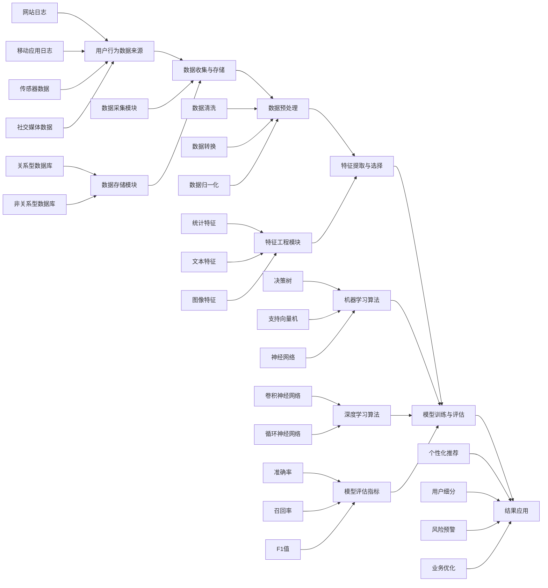

# 智能用户行为分析中的人工智能应用

> 关键词：智能用户行为分析、人工智能、机器学习、深度学习、数据挖掘、模式识别、用户画像

> 摘要：本文聚焦于智能用户行为分析中的人工智能应用，旨在深入探讨人工智能技术如何在用户行为分析领域发挥关键作用。首先介绍了智能用户行为分析的背景，包括目的、预期读者等内容。接着阐述了核心概念与联系，通过文本示意图和 Mermaid 流程图展示其架构。详细讲解了核心算法原理，并用 Python 源代码进行说明，同时给出了相关的数学模型和公式。通过项目实战，展示了代码的实际案例及详细解释。探讨了智能用户行为分析的实际应用场景，推荐了学习资源、开发工具框架以及相关论文著作。最后总结了未来发展趋势与挑战，并提供常见问题解答和扩展阅读参考资料，帮助读者全面了解智能用户行为分析中人工智能的应用。

## 1. 背景介绍 
### 1.1 目的和范围
智能用户行为分析在当今数字化时代具有至关重要的意义。其目的在于通过对用户在各种数字化平台上的行为数据进行收集、整理、分析和挖掘，深入了解用户的需求、偏好、习惯和行为模式。这有助于企业和组织优化产品和服务，提高用户满意度和忠诚度，进而提升市场竞争力。

本文章的范围涵盖了智能用户行为分析的各个方面，包括核心概念、算法原理、数学模型、实际应用场景等。重点关注人工智能技术在智能用户行为分析中的应用，如机器学习、深度学习、数据挖掘等方法。

### 1.2 预期读者
本文预期读者包括从事计算机科学、人工智能、数据分析等领域的专业人士，如程序员、数据分析师、算法工程师、软件架构师等。同时，也适合对智能用户行为分析感兴趣的研究人员、企业管理人员以及相关专业的学生阅读。

### 1.3 文档结构概述
本文将按照以下结构进行阐述：首先介绍智能用户行为分析的背景信息，包括目的、预期读者和文档结构概述等。接着详细讲解核心概念与联系，通过文本示意图和 Mermaid 流程图展示其架构。然后深入探讨核心算法原理，并用 Python 源代码进行详细说明，同时给出相关的数学模型和公式。通过项目实战，展示代码的实际案例及详细解释。探讨智能用户行为分析的实际应用场景，推荐学习资源、开发工具框架以及相关论文著作。最后总结未来发展趋势与挑战，提供常见问题解答和扩展阅读参考资料。

### 1.4 术语表
#### 1.4.1 核心术语定义
- **智能用户行为分析**：利用人工智能技术对用户在数字化平台上的行为数据进行收集、分析和挖掘，以发现用户的行为模式、需求和偏好等信息的过程。
- **人工智能**：研究如何使计算机能够模拟人类的智能行为，如学习、推理、决策等的学科。
- **机器学习**：人工智能的一个分支，通过让计算机从数据中自动学习模式和规律，从而实现预测和决策等任务的技术。
- **深度学习**：一种基于人工神经网络的机器学习方法，通过构建多层神经网络来学习数据的深层特征和表示。
- **数据挖掘**：从大量数据中发现有价值的信息和知识的过程，包括数据预处理、模式发现、知识表示等步骤。
- **用户画像**：根据用户的行为数据和属性信息，构建的对用户特征和行为模式的抽象描述。

#### 1.4.2 相关概念解释
- **行为数据**：用户在数字化平台上的各种操作记录，如点击、浏览、购买、评论等。
- **特征工程**：从原始数据中提取和选择有用的特征，以提高机器学习模型性能的过程。
- **模型评估**：使用评估指标对机器学习模型的性能进行评估和比较的过程。
- **预测分析**：利用机器学习模型对未来事件或行为进行预测的过程。

#### 1.4.3 缩略词列表
- **AI**：Artificial Intelligence，人工智能
- **ML**：Machine Learning，机器学习
- **DL**：Deep Learning，深度学习
- **DM**：Data Mining，数据挖掘

## 2. 核心概念与联系 
### 核心概念原理
智能用户行为分析的核心在于通过对用户行为数据的深入挖掘和分析，揭示用户的行为模式、需求和偏好。其原理基于以下几个方面：

- **数据收集**：通过各种方式收集用户在数字化平台上的行为数据，如日志记录、埋点技术、传感器等。
- **数据预处理**：对收集到的原始数据进行清洗、转换和归一化等处理，以提高数据的质量和可用性。
- **特征提取**：从预处理后的数据中提取有用的特征，如用户的年龄、性别、购买频率、浏览时长等。
- **模型训练**：使用机器学习或深度学习算法对提取的特征进行训练，构建用户行为分析模型。
- **模型评估**：使用评估指标对训练好的模型进行评估和比较，选择最优模型。
- **结果应用**：将训练好的模型应用于实际场景中，如个性化推荐、用户细分、风险预警等。

### 架构的文本示意图
```plaintext
智能用户行为分析系统架构

用户行为数据来源
|-- 网站日志
|-- 移动应用日志
|-- 传感器数据
|-- 社交媒体数据

数据收集与存储
|-- 数据采集模块
|-- 数据存储模块
|   |-- 关系型数据库
|   |-- 非关系型数据库

数据预处理
|-- 数据清洗
|-- 数据转换
|-- 数据归一化

特征提取与选择
|-- 特征工程模块
|   |-- 统计特征
|   |-- 文本特征
|   |-- 图像特征

模型训练与评估
|-- 机器学习算法
|   |-- 决策树
|   |-- 支持向量机
|   |-- 神经网络
|-- 深度学习算法
|   |-- 卷积神经网络
|   |-- 循环神经网络
|-- 模型评估指标
|   |-- 准确率
|   |-- 召回率
|   |-- F1值

结果应用
|-- 个性化推荐
|-- 用户细分
|-- 风险预警
|-- 业务优化
```

### Mermaid 流程图


## 3. 核心算法原理 & 具体操作步骤 
### 决策树算法原理
决策树是一种常用的机器学习算法，它通过构建一棵树状结构来进行决策。决策树的每个内部节点表示一个属性上的测试，每个分支表示一个测试输出，每个叶节点表示一个类别或值。

决策树的构建过程主要包括以下几个步骤：
1. **特征选择**：选择一个最优的特征作为当前节点的划分特征。
2. **划分数据集**：根据选择的特征对数据集进行划分，生成多个子集。
3. **递归构建子树**：对每个子集递归地执行步骤 1 和步骤 2，直到满足终止条件。
4. **生成决策树**：将所有子树组合成一棵完整的决策树。

### Python 源代码实现
```python
from sklearn.datasets import load_iris
from sklearn.model_selection import train_test_split
from sklearn.tree import DecisionTreeClassifier
from sklearn.metrics import accuracy_score

# 加载数据集
iris = load_iris()
X = iris.data
y = iris.target

# 划分训练集和测试集
X_train, X_test, y_train, y_test = train_test_split(X, y, test_size=0.3, random_state=42)

# 创建决策树分类器
clf = DecisionTreeClassifier()

# 训练模型
clf.fit(X_train, y_train)

# 预测
y_pred = clf.predict(X_test)

# 评估模型
accuracy = accuracy_score(y_test, y_pred)
print(f"Accuracy: {accuracy}")
```

### 具体操作步骤
1. **数据加载**：使用 `load_iris` 函数加载鸢尾花数据集。
2. **数据划分**：使用 `train_test_split` 函数将数据集划分为训练集和测试集。
3. **模型创建**：使用 `DecisionTreeClassifier` 类创建决策树分类器。
4. **模型训练**：使用 `fit` 方法对模型进行训练。
5. **模型预测**：使用 `predict` 方法对测试集进行预测。
6. **模型评估**：使用 `accuracy_score` 函数计算模型的准确率。

## 4. 数学模型和公式 & 详细讲解 & 举例说明 
### 信息熵公式
信息熵是衡量数据集中不确定性的一个指标，其公式为：
$$
H(X) = -\sum_{i=1}^{n} p(x_i) \log_2 p(x_i)
$$
其中，$X$ 是一个随机变量，$p(x_i)$ 是 $x_i$ 出现的概率。

### 详细讲解
信息熵的值越大，表示数据集中的不确定性越大；信息熵的值越小，表示数据集中的不确定性越小。在决策树算法中，信息熵常用于特征选择，选择信息增益最大的特征作为划分特征。

### 举例说明
假设有一个数据集 $D$，其中包含两个类别 $C_1$ 和 $C_2$，$C_1$ 出现的次数为 6，$C_2$ 出现的次数为 4，则数据集 $D$ 的信息熵为：
$$
p(C_1) = \frac{6}{10} = 0.6
$$
$$
p(C_2) = \frac{4}{10} = 0.4
$$
$$
H(D) = - (0.6 \log_2 0.6 + 0.4 \log_2 0.4) \approx 0.971
$$

### 信息增益公式
信息增益是指在使用某个特征进行划分后，数据集的信息熵减少的量，其公式为：
$$
IG(D, A) = H(D) - \sum_{v \in Values(A)} \frac{|D^v|}{|D|} H(D^v)
$$
其中，$D$ 是数据集，$A$ 是特征，$Values(A)$ 是特征 $A$ 的所有取值，$D^v$ 是特征 $A$ 取值为 $v$ 的子集。

### 详细讲解
信息增益越大，表示使用该特征进行划分后，数据集的不确定性减少得越多，该特征越适合作为划分特征。

### 举例说明
假设有一个数据集 $D$，包含两个特征 $A$ 和 $B$，使用特征 $A$ 进行划分后，得到两个子集 $D_1$ 和 $D_2$，$|D_1| = 5$，$|D_2| = 5$，$H(D_1) = 0.8$，$H(D_2) = 0.7$，则使用特征 $A$ 进行划分的信息增益为：
$$
IG(D, A) = H(D) - (\frac{5}{10} H(D_1) + \frac{5}{10} H(D_2)) = 0.971 - (0.5 \times 0.8 + 0.5 \times 0.7) = 0.121
$$

## 5. 项目实战：代码实际案例和详细解释说明 
### 5.1  开发环境搭建
- **Python 安装**：从 Python 官方网站（https://www.python.org/downloads/）下载并安装 Python 3.x 版本。
- **开发工具安装**：推荐使用 PyCharm 作为开发工具，从 JetBrains 官方网站（https://www.jetbrains.com/pycharm/download/）下载并安装。
- **库安装**：使用以下命令安装所需的库：
```sh
pip install numpy pandas scikit-learn matplotlib
```

### 5.2  源代码详细实现和代码解读
```python
import numpy as np
import pandas as pd
from sklearn.model_selection import train_test_split
from sklearn.tree import DecisionTreeClassifier
from sklearn.metrics import accuracy_score
import matplotlib.pyplot as plt

# 加载数据集
data = pd.read_csv('user_behavior_data.csv')

# 数据预处理
X = data.drop('label', axis=1)
y = data['label']

# 划分训练集和测试集
X_train, X_test, y_train, y_test = train_test_split(X, y, test_size=0.3, random_state=42)

# 创建决策树分类器
clf = DecisionTreeClassifier()

# 训练模型
clf.fit(X_train, y_train)

# 预测
y_pred = clf.predict(X_test)

# 评估模型
accuracy = accuracy_score(y_test, y_pred)
print(f"Accuracy: {accuracy}")

# 可视化决策树
from sklearn.tree import plot_tree
plt.figure(figsize=(12, 8))
plot_tree(clf, feature_names=X.columns, class_names=['0', '1'], filled=True)
plt.show()
```

### 5.3  代码解读与分析
1. **数据加载**：使用 `pandas` 库的 `read_csv` 函数加载用户行为数据集。
2. **数据预处理**：将特征和标签分离，使用 `drop` 方法删除标签列，得到特征矩阵 $X$，将标签列赋值给 $y$。
3. **数据划分**：使用 `train_test_split` 函数将数据集划分为训练集和测试集，测试集占比为 30%。
4. **模型创建**：使用 `DecisionTreeClassifier` 类创建决策树分类器。
5. **模型训练**：使用 `fit` 方法对模型进行训练。
6. **模型预测**：使用 `predict` 方法对测试集进行预测。
7. **模型评估**：使用 `accuracy_score` 函数计算模型的准确率。
8. **可视化决策树**：使用 `plot_tree` 函数可视化决策树。

## 6. 实际应用场景 
### 个性化推荐
智能用户行为分析可以帮助企业了解用户的兴趣和偏好，从而为用户提供个性化的推荐服务。例如，电商平台可以根据用户的浏览历史、购买记录等行为数据，为用户推荐符合其兴趣的商品；音乐平台可以根据用户的听歌历史，为用户推荐相似风格的歌曲。

### 用户细分
通过对用户行为数据的分析，企业可以将用户划分为不同的群体，每个群体具有相似的行为特征和需求。例如，电信运营商可以根据用户的通话时长、流量使用情况等行为数据，将用户划分为高价值用户、普通用户和低价值用户，从而针对不同用户群体制定不同的营销策略。

### 风险预警
智能用户行为分析可以帮助企业及时发现潜在的风险。例如，银行可以通过分析用户的交易行为数据，及时发现异常交易，如盗刷、洗钱等，从而采取相应的措施进行防范；电商平台可以通过分析用户的评价和投诉数据，及时发现产品质量问题和服务问题，从而采取相应的措施进行改进。

### 业务优化
通过对用户行为数据的分析，企业可以了解用户的需求和痛点，从而对产品和服务进行优化。例如，网站可以通过分析用户的浏览行为数据，了解用户的访问路径和停留时间，从而对网站的布局和内容进行优化；移动应用可以通过分析用户的操作行为数据，了解用户的使用习惯和需求，从而对应用的功能和界面进行优化。

## 7. 工具和资源推荐
### 7.1 学习资源推荐
#### 7.1.1 书籍推荐
- 《机器学习》（周志华）：全面介绍了机器学习的基本概念、算法和应用，是机器学习领域的经典教材。
- 《深度学习》（Ian Goodfellow、Yoshua Bengio、Aaron Courville）：深入介绍了深度学习的理论和实践，是深度学习领域的权威著作。
- 《Python 数据分析实战》（Aurélien Géron）：介绍了使用 Python 进行数据分析的方法和技巧，包括数据处理、可视化、机器学习等方面的内容。

#### 7.1.2 在线课程
- Coursera 上的“机器学习”课程（Andrew Ng）：由机器学习领域的知名专家 Andrew Ng 授课，是学习机器学习的经典课程。
- edX 上的“深度学习”课程（Geoffrey Hinton）：由深度学习领域的先驱 Geoffrey Hinton 授课，深入介绍了深度学习的理论和实践。
- 中国大学 MOOC 上的“Python 语言程序设计”课程（嵩天）：介绍了 Python 语言的基本语法和编程技巧，是学习 Python 的入门课程。

#### 7.1.3 技术博客和网站
- 机器之心（https://www.alizila.com/）：提供人工智能领域的最新技术和应用案例，是了解人工智能发展动态的重要渠道。
- 深度学习技术前沿（https://www.deeplearning.ai/）：专注于深度学习领域的技术分享和交流，提供深度学习的最新研究成果和应用案例。
- 开源中国（https://www.oschina.net/）：提供开源软件的资讯、技术文章和代码托管服务，是了解开源技术的重要平台。

### 7.2 开发工具框架推荐
#### 7.2.1 IDE和编辑器
- PyCharm：一款专业的 Python 集成开发环境，提供代码编辑、调试、版本控制等功能，是 Python 开发的首选工具。
- Jupyter Notebook：一款交互式的笔记本工具，支持 Python、R 等多种编程语言，适合数据探索和模型开发。
- Visual Studio Code：一款轻量级的代码编辑器，支持多种编程语言，具有丰富的插件和扩展功能。

#### 7.2.2 调试和性能分析工具
- PyCharm 调试器：PyCharm 自带的调试工具，支持单步调试、断点调试等功能，方便开发者调试代码。
- cProfile：Python 自带的性能分析工具，用于分析代码的性能瓶颈。
- TensorBoard：TensorFlow 自带的可视化工具，用于可视化模型的训练过程和性能指标。

#### 7.2.3 相关框架和库
- Scikit-learn：一个简单易用的机器学习库，提供了各种机器学习算法和工具，如分类、回归、聚类等。
- TensorFlow：一个开源的深度学习框架，由 Google 开发，提供了丰富的深度学习模型和工具，如卷积神经网络、循环神经网络等。
- PyTorch：一个开源的深度学习框架，由 Facebook 开发，提供了动态图机制和丰富的深度学习模型和工具，如卷积神经网络、循环神经网络等。

### 7.3 相关论文著作推荐
#### 7.3.1 经典论文
- “A Decision-Theoretic Generalization of On-Line Learning and an Application to Boosting”（Yoav Freund、Robert E. Schapire）：介绍了 AdaBoost 算法的基本原理和应用，是机器学习领域的经典论文。
- “ImageNet Classification with Deep Convolutional Neural Networks”（Alex Krizhevsky、Ilya Sutskever、Geoffrey E. Hinton）：介绍了 AlexNet 模型的基本原理和应用，是深度学习领域的经典论文。
- “Long Short-Term Memory”（Sepp Hochreiter、Jürgen Schmidhuber）：介绍了长短期记忆网络（LSTM）的基本原理和应用，是深度学习领域的经典论文。

#### 7.3.2 最新研究成果
- 关注顶级学术会议和期刊，如 NeurIPS、ICML、CVPR、JMLR 等，及时了解人工智能领域的最新研究成果。
- 关注知名研究机构和学者的研究动态，如 Google Brain、OpenAI、Yoshua Bengio、Geoffrey Hinton 等。

#### 7.3.3 应用案例分析
- 关注行业报告和案例分析，如 Gartner、IDC 等机构发布的行业报告，了解人工智能在各个行业的应用案例和实践经验。
- 关注企业的技术博客和官方网站，了解企业在人工智能领域的应用案例和实践经验，如 Google、Facebook、Amazon 等。

## 8. 总结：未来发展趋势与挑战
### 未来发展趋势
- **多模态融合**：未来的智能用户行为分析将不仅仅局限于文本、图像等单一模态的数据，而是会融合多种模态的数据，如语音、视频、传感器数据等，以更全面地了解用户的行为和需求。
- **实时分析**：随着数据量的不断增加和业务需求的不断提高，实时分析将成为智能用户行为分析的重要发展方向。实时分析可以帮助企业及时发现用户的行为变化和潜在风险，从而采取相应的措施进行应对。
- **个性化深度定制**：未来的智能用户行为分析将更加注重个性化和深度定制。通过对用户行为数据的深入挖掘和分析，企业可以为用户提供更加个性化的产品和服务，满足用户的个性化需求。
- **与其他技术的融合**：智能用户行为分析将与其他技术，如区块链、物联网、云计算等进行融合，以实现更加智能化、高效化的用户行为分析和应用。

### 挑战
- **数据隐私和安全**：智能用户行为分析需要收集和处理大量的用户行为数据，这涉及到用户的隐私和安全问题。如何在保证数据隐私和安全的前提下，进行有效的用户行为分析，是一个亟待解决的问题。
- **数据质量和多样性**：智能用户行为分析的效果很大程度上取决于数据的质量和多样性。如何收集到高质量、多样性的数据，以及如何对数据进行有效的预处理和清洗，是一个挑战。
- **算法复杂度和可解释性**：随着人工智能技术的不断发展，智能用户行为分析所使用的算法越来越复杂。如何在保证算法性能的前提下，提高算法的可解释性，让用户能够理解算法的决策过程和结果，是一个挑战。
- **人才短缺**：智能用户行为分析需要具备多学科知识和技能的人才，如计算机科学、统计学、数学等。目前，相关领域的人才短缺，如何培养和吸引更多的专业人才，是一个挑战。

## 9. 附录：常见问题与解答
### 问题 1：智能用户行为分析需要哪些数据？
智能用户行为分析需要收集用户在数字化平台上的各种行为数据，如点击、浏览、购买、评论等。此外，还可以收集用户的属性信息，如年龄、性别、职业等，以更全面地了解用户的特征和需求。

### 问题 2：如何选择合适的机器学习算法进行用户行为分析？
选择合适的机器学习算法需要考虑多个因素，如数据类型、数据规模、问题类型等。一般来说，如果数据规模较小，可以选择简单的算法，如决策树、朴素贝叶斯等；如果数据规模较大，可以选择复杂的算法，如神经网络、支持向量机等。此外，还可以通过交叉验证等方法对不同的算法进行评估和比较，选择最优算法。

### 问题 3：如何保证用户行为数据的隐私和安全？
保证用户行为数据的隐私和安全需要采取多种措施，如数据加密、访问控制、匿名化处理等。此外，还需要遵守相关的法律法规和行业标准，如《网络安全法》、《数据保护法》等。

### 问题 4：智能用户行为分析的结果如何应用到实际业务中？
智能用户行为分析的结果可以应用到多个实际业务中，如个性化推荐、用户细分、风险预警、业务优化等。企业可以根据自身的业务需求和目标，选择合适的应用场景，并将分析结果转化为具体的业务策略和措施。

## 10. 扩展阅读 & 参考资料
### 扩展阅读
- 《人工智能简史》（尼克）：介绍了人工智能的发展历程和重要事件，帮助读者了解人工智能的发展脉络。
- 《大数据时代》（维克托·迈尔 - 舍恩伯格、肯尼斯·库克耶）：介绍了大数据的概念、特点和应用，帮助读者了解大数据时代的发展趋势。
- 《创新者的窘境》（克莱顿·克里斯坦森）：介绍了创新的规律和方法，帮助读者了解创新的本质和重要性。

### 参考资料
- 《机器学习》（周志华）
- 《深度学习》（Ian Goodfellow、Yoshua Bengio、Aaron Courville）
- 《Python 数据分析实战》（Aurélien Géron）
- Coursera 上的“机器学习”课程（Andrew Ng）
- edX 上的“深度学习”课程（Geoffrey Hinton）
- 中国大学 MOOC 上的“Python 语言程序设计”课程（嵩天）
- 机器之心（https://www.alizila.com/）
- 深度学习技术前沿（https://www.deeplearning.ai/）
- 开源中国（https://www.oschina.net/）
- Scikit-learn 官方文档（https://scikit-learn.org/stable/）
- TensorFlow 官方文档（https://www.tensorflow.org/）
- PyTorch 官方文档（https://pytorch.org/）