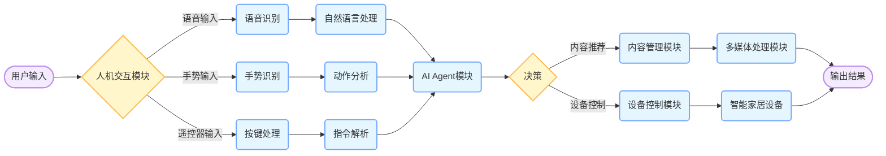

# 智能电视：AI Agent的家庭娱乐管家系统

> 关键词：智能电视、AI Agent、家庭娱乐管家系统、人工智能、人机交互、多媒体技术、智能家居

> 摘要：本文围绕智能电视的AI Agent家庭娱乐管家系统展开深入探讨。随着人工智能技术的不断发展，智能电视不再仅仅是播放视频的设备，AI Agent的融入使其成为家庭娱乐的智能管理中心。文章首先介绍了该系统的背景，包括目的、预期读者等内容。接着详细阐述了核心概念与联系，通过文本示意图和Mermaid流程图进行直观展示。然后深入讲解核心算法原理和具体操作步骤，结合Python源代码进行说明。还介绍了相关的数学模型和公式，并举例说明。通过项目实战，展示了系统的代码实现和详细解读。探讨了系统的实际应用场景，推荐了学习该系统所需的工具和资源，包括书籍、在线课程、开发工具等。最后总结了系统的未来发展趋势与挑战，以及常见问题与解答，并提供了扩展阅读和参考资料，旨在为读者全面呈现智能电视的AI Agent家庭娱乐管家系统的技术原理、实现方法和应用前景。

## 1. 背景介绍 
### 1.1 目的和范围
智能电视的AI Agent家庭娱乐管家系统旨在为用户提供更加智能化、个性化、便捷化的家庭娱乐体验。传统的智能电视功能相对单一，主要以播放视频为主，用户在寻找内容、控制设备等方面存在诸多不便。而该系统通过引入AI Agent技术，能够理解用户的需求，主动为用户推荐合适的娱乐内容，实现设备的智能控制，以及与其他智能家居设备的联动。

本系统的范围涵盖了智能电视上的各类娱乐功能，包括但不限于视频播放、音乐播放、游戏、直播等。同时，系统还可以与其他智能家居设备进行交互，如智能音箱、智能灯光、智能窗帘等，打造全方位的家庭娱乐环境。

### 1.2 预期读者
本文的预期读者包括对智能电视技术、人工智能技术、家庭娱乐系统感兴趣的技术爱好者、研究人员、开发者，以及希望了解智能家居发展趋势的普通消费者。对于技术爱好者和研究人员，本文提供了深入的技术原理和实现方法；对于开发者，本文的Python代码和项目实战部分可以作为参考；对于普通消费者，本文可以帮助他们了解智能电视的AI Agent家庭娱乐管家系统的功能和优势。

### 1.3 文档结构概述
本文共分为十个部分。第一部分是背景介绍，包括目的和范围、预期读者、文档结构概述和术语表。第二部分详细阐述核心概念与联系，通过文本示意图和Mermaid流程图进行直观展示。第三部分介绍核心算法原理和具体操作步骤，结合Python源代码进行说明。第四部分讲解数学模型和公式，并举例说明。第五部分通过项目实战，展示系统的代码实现和详细解读。第六部分探讨系统的实际应用场景。第七部分推荐学习该系统所需的工具和资源，包括书籍、在线课程、开发工具等。第八部分总结系统的未来发展趋势与挑战。第九部分是附录，包含常见问题与解答。第十部分提供扩展阅读和参考资料。

### 1.4 术语表
#### 1.4.1 核心术语定义
- **智能电视**：一种具备操作系统和网络连接功能的电视机，能够实现多种智能化功能，如在线视频播放、应用程序安装等。
- **AI Agent（人工智能代理）**：一种能够感知环境、理解用户需求、做出决策并执行相应动作的智能实体。在本系统中，AI Agent可以理解用户的语音指令、分析用户的行为习惯，为用户提供个性化的娱乐服务。
- **家庭娱乐管家系统**：以智能电视为核心，整合多种娱乐资源和智能家居设备，为用户提供一站式家庭娱乐解决方案的系统。
- **人机交互**：指人与计算机或其他智能设备之间进行信息交换和沟通的过程。在本系统中，人机交互包括语音交互、手势交互、遥控器交互等多种方式。
- **多媒体技术**：涉及对文本、图像、音频、视频等多种媒体形式进行处理、存储、传输和展示的技术。本系统中广泛应用多媒体技术来实现各种娱乐功能。

#### 1.4.2 相关概念解释
- **智能家居**：利用先进的计算机技术、网络通信技术、传感器技术等，将家居设备进行智能化连接和管理，实现家居的自动化控制、远程监控和智能化服务的系统。本系统可以与智能家居设备进行联动，实现家庭娱乐环境的智能化控制。
- **深度学习**：一种基于人工神经网络的机器学习方法，能够自动从大量数据中学习特征和模式，具有很强的模式识别和预测能力。在本系统中，深度学习可以用于语音识别、图像识别、内容推荐等任务。
- **自然语言处理**：研究如何让计算机理解和处理人类语言的技术。在本系统中，自然语言处理可以用于理解用户的语音指令，实现人机之间的自然语言交互。

#### 1.4.3 缩略词列表
- **AI**：Artificial Intelligence，人工智能
- **NLP**：Natural Language Processing，自然语言处理
- **CNN**：Convolutional Neural Network，卷积神经网络
- **RNN**：Recurrent Neural Network，循环神经网络
- **API**：Application Programming Interface，应用程序编程接口

## 2. 核心概念与联系 
### 核心概念原理
智能电视的AI Agent家庭娱乐管家系统主要基于人工智能、人机交互和多媒体技术等核心概念构建。

AI Agent作为系统的核心，负责感知用户的需求和环境信息，通过自然语言处理技术理解用户的语音指令，利用深度学习算法分析用户的行为习惯和偏好，从而为用户提供个性化的娱乐服务。例如，当用户说“我想看一部动作电影”时，AI Agent可以根据用户的历史观影记录和偏好，从视频平台中筛选出合适的动作电影推荐给用户。

人机交互是实现用户与系统之间沟通的桥梁。系统支持多种人机交互方式，包括语音交互、手势交互、遥控器交互等。语音交互通过语音识别技术将用户的语音指令转换为文本，然后由AI Agent进行处理；手势交互通过摄像头捕捉用户的手势动作，实现对系统的控制；遥控器交互则是传统的控制方式，用户可以通过遥控器上的按键进行操作。

多媒体技术用于处理和展示各种娱乐内容，包括视频、音频、图像等。系统通过多媒体解码和渲染技术，将视频和音频数据解码并播放出来，为用户提供高质量的视听体验。

### 架构的文本示意图
智能电视的AI Agent家庭娱乐管家系统主要由以下几个部分组成：

1. **用户界面层**：负责与用户进行交互，包括语音输入、手势输入、遥控器输入等。用户可以通过这些方式向系统发出指令，获取娱乐服务。
2. **人机交互模块**：将用户的输入转换为系统能够理解的信息，如将语音指令转换为文本，将手势动作转换为控制指令等。
3. **AI Agent模块**：是系统的核心，负责感知用户需求、分析用户偏好、做出决策并执行相应动作。AI Agent模块包括自然语言处理子模块、深度学习子模块等。
4. **内容管理模块**：负责管理各种娱乐内容，包括视频、音频、游戏等。该模块可以从不同的内容源获取内容，并进行分类、存储和检索。
5. **设备控制模块**：负责与其他智能家居设备进行通信和控制，如智能音箱、智能灯光、智能窗帘等。通过设备控制模块，系统可以实现家庭娱乐环境的智能化控制。
6. **多媒体处理模块**：负责处理和展示各种娱乐内容，包括视频解码、音频解码、图像渲染等。

### Mermaid流程图


## 3. 核心算法原理 & 具体操作步骤 
### 核心算法原理
#### 语音识别算法
语音识别是将语音信号转换为文本的过程。目前，主流的语音识别算法基于深度学习技术，如端到端的循环神经网络（RNN）和卷积神经网络（CNN）的结合。

以基于RNN的语音识别算法为例，其基本原理是将语音信号分割成一系列的帧，每个帧表示一段时间内的语音特征。然后，将这些帧输入到RNN中，RNN可以处理序列数据，学习语音信号的时间序列特征。最后，通过一个解码器将RNN的输出转换为文本。

以下是一个简单的基于Python和TensorFlow的语音识别示例代码：
```python
import tensorflow as tf
import numpy as np

# 定义一个简单的RNN模型
class SimpleRNN(tf.keras.Model):
    def __init__(self, vocab_size, hidden_size):
        super(SimpleRNN, self).__init__()
        self.embedding = tf.keras.layers.Embedding(vocab_size, hidden_size)
        self.rnn = tf.keras.layers.SimpleRNN(hidden_size)
        self.dense = tf.keras.layers.Dense(vocab_size, activation='softmax')

    def call(self, inputs):
        x = self.embedding(inputs)
        x = self.rnn(x)
        x = self.dense(x)
        return x

# 模拟语音数据
vocab_size = 100
hidden_size = 64
input_data = np.random.randint(0, vocab_size, size=(10, 20))

# 创建模型
model = SimpleRNN(vocab_size, hidden_size)

# 编译模型
model.compile(optimizer='adam', loss='sparse_categorical_crossentropy', metrics=['accuracy'])

# 训练模型
model.fit(input_data, input_data, epochs=10)
```

#### 自然语言处理算法
自然语言处理主要包括文本分类、命名实体识别、情感分析等任务。在本系统中，自然语言处理的主要任务是理解用户的语音指令，提取关键信息。

以文本分类为例，常用的算法有朴素贝叶斯、支持向量机和深度学习模型（如卷积神经网络、循环神经网络）。以下是一个基于Python和Scikit-learn的朴素贝叶斯文本分类示例代码：
```python
from sklearn.feature_extraction.text import CountVectorizer
from sklearn.naive_bayes import MultinomialNB
from sklearn.pipeline import Pipeline

# 训练数据
texts = ["我想看动作电影", "我想听流行音乐", "我想玩游戏"]
labels = ["电影", "音乐", "游戏"]

# 创建管道
pipeline = Pipeline([
    ('vectorizer', CountVectorizer()),
    ('classifier', MultinomialNB())
])

# 训练模型
pipeline.fit(texts, labels)

# 预测
new_text = "我想看科幻电影"
predicted_label = pipeline.predict([new_text])
print("预测结果:", predicted_label[0])
```

#### 内容推荐算法
内容推荐算法的目的是根据用户的历史行为和偏好，为用户推荐合适的娱乐内容。常用的内容推荐算法有基于内容的推荐、协同过滤推荐和混合推荐。

基于内容的推荐算法通过分析内容的特征和用户的偏好，为用户推荐与他们喜欢的内容相似的内容。协同过滤推荐算法则通过分析用户之间的行为相似性，为用户推荐其他相似用户喜欢的内容。混合推荐算法则结合了基于内容的推荐和协同过滤推荐的优点。

以下是一个简单的基于内容的推荐算法示例代码：
```python
import pandas as pd
from sklearn.feature_extraction.text import TfidfVectorizer
from sklearn.metrics.pairwise import cosine_similarity

# 电影数据
movies = pd.DataFrame({
    'id': [1, 2, 3],
    'title': ['动作电影1', '动作电影2', '科幻电影1'],
    'genre': ['动作', '动作', '科幻']
})

# 提取特征
vectorizer = TfidfVectorizer()
genre_matrix = vectorizer.fit_transform(movies['genre'])

# 计算相似度
similarity_matrix = cosine_similarity(genre_matrix)

# 用户喜欢的电影
user_liked_movie_id = 1

# 推荐相似的电影
similar_movies_indices = similarity_matrix[user_liked_movie_id - 1].argsort()[::-1][1:]
recommended_movies = movies.iloc[similar_movies_indices]

print("推荐的电影:", recommended_movies)
```

### 具体操作步骤
1. **用户输入**：用户通过语音、手势或遥控器向系统发出指令。
2. **人机交互模块处理**：人机交互模块将用户的输入转换为系统能够理解的信息，如将语音指令转换为文本，将手势动作转换为控制指令等。
3. **自然语言处理**：对用户的文本指令进行自然语言处理，提取关键信息，如用户的需求类型（电影、音乐、游戏等）、内容偏好（动作、科幻、流行等）。
4. **AI Agent决策**：AI Agent根据用户的需求和偏好，结合内容管理模块中的内容信息，做出决策，如推荐合适的娱乐内容、控制智能家居设备等。
5. **内容推荐或设备控制**：根据AI Agent的决策，内容管理模块推荐合适的娱乐内容，设备控制模块控制智能家居设备。
6. **多媒体处理**：多媒体处理模块对推荐的娱乐内容进行解码和渲染，为用户提供高质量的视听体验。

## 4. 数学模型和公式 & 详细讲解 & 举例说明 
### 语音识别的数学模型
语音识别的目标是找到最可能的文本序列 $W$ ，使得给定语音信号 $X$ 的条件概率 $P(W|X)$ 最大。根据贝叶斯定理，有：

$$P(W|X)=\frac{P(X|W)P(W)}{P(X)}$$

其中，$P(X|W)$ 是声学模型，表示给定文本序列 $W$ 时语音信号 $X$ 的概率；$P(W)$ 是语言模型，表示文本序列 $W$ 的概率；$P(X)$ 是语音信号 $X$ 的概率，由于对于所有的文本序列 $W$ 都是相同的，因此在寻找最大概率的文本序列时可以忽略。

因此，语音识别的问题可以转化为寻找使得 $P(X|W)P(W)$ 最大的文本序列 $W$ ，即：

$$\hat{W}=\arg\max_{W}P(X|W)P(W)$$

### 自然语言处理的数学模型
以文本分类为例，假设我们有一个文本集合 $D=\{d_1,d_2,\cdots,d_n\}$ ，每个文本 $d_i$ 属于一个类别 $c_j$ ，$j=1,2,\cdots,m$ 。文本分类的目标是找到一个分类器 $f$ ，使得对于一个新的文本 $d$ ，能够预测其所属的类别 $\hat{c}=f(d)$ 。

朴素贝叶斯分类器是一种常用的文本分类算法，其基本思想是基于贝叶斯定理和特征条件独立假设。对于一个文本 $d$ ，朴素贝叶斯分类器计算其属于每个类别 $c_j$ 的后验概率 $P(c_j|d)$ ，并选择后验概率最大的类别作为预测结果，即：

$$\hat{c}=\arg\max_{c_j}P(c_j|d)=\arg\max_{c_j}\frac{P(d|c_j)P(c_j)}{P(d)}$$

由于 $P(d)$ 对于所有的类别 $c_j$ 都是相同的，因此可以忽略，得到：

$$\hat{c}=\arg\max_{c_j}P(d|c_j)P(c_j)$$

在朴素贝叶斯分类器中，假设文本 $d$ 中的每个特征（如单词）是条件独立的，因此有：

$$P(d|c_j)=\prod_{i=1}^{k}P(w_i|c_j)$$

其中，$w_i$ 是文本 $d$ 中的第 $i$ 个特征，$k$ 是文本 $d$ 中的特征数量。

### 内容推荐的数学模型
以基于内容的推荐算法为例，假设我们有一个内容集合 $C=\{c_1,c_2,\cdots,c_n\}$ ，每个内容 $c_i$ 有一个特征向量 $x_i$ ，表示其特征信息（如电影的类型、演员、导演等）。用户的偏好可以用一个特征向量 $y$ 表示。

基于内容的推荐算法的基本思想是计算每个内容 $c_i$ 的特征向量 $x_i$ 与用户偏好特征向量 $y$ 的相似度 $s(x_i,y)$ ，并选择相似度最大的内容作为推荐结果。常用的相似度计算方法有余弦相似度、欧几里得距离等。

余弦相似度的计算公式为：

$$s(x_i,y)=\frac{x_i\cdot y}{\|x_i\|\|y\|}$$

其中，$x_i\cdot y$ 是向量 $x_i$ 和 $y$ 的点积，$\|x_i\|$ 和 $\|y\|$ 分别是向量 $x_i$ 和 $y$ 的模。

### 举例说明
#### 语音识别举例
假设语音信号 $X$ 对应的文本序列有两个可能的结果：$W_1=$ “我想看动作电影”，$W_2=$ “我想听流行音乐”。声学模型计算得到 $P(X|W_1)=0.8$ ，$P(X|W_2)=0.2$ ，语言模型计算得到 $P(W_1)=0.6$ ，$P(W_2)=0.4$ 。

则 $P(X|W_1)P(W_1)=0.8\times0.6 = 0.48$ ，$P(X|W_2)P(W_2)=0.2\times0.4 = 0.08$ 。

由于 $0.48>0.08$ ，因此语音识别的结果为 $W_1=$ “我想看动作电影”。

#### 自然语言处理举例
假设我们有一个文本分类任务，有两个类别：$c_1=$ “电影”，$c_2=$ “音乐”。文本 $d=$ “我想看科幻电影”，其中包含的特征有“想看”、“科幻”、“电影”。

假设通过训练得到的概率如下：$P(c_1)=0.6$ ，$P(c_2)=0.4$ ，$P(想看|c_1)=0.8$ ，$P(想看|c_2)=0.2$ ，$P(科幻|c_1)=0.7$ ，$P(科幻|c_2)=0.1$ ，$P(电影|c_1)=0.9$ ，$P(电影|c_2)=0.1$ 。

则 $P(d|c_1)P(c_1)=P(想看|c_1)P(科幻|c_1)P(电影|c_1)P(c_1)=0.8\times0.7\times0.9\times0.6 = 0.3024$ ，$P(d|c_2)P(c_2)=P(想看|c_2)P(科幻|c_2)P(电影|c_2)P(c_2)=0.2\times0.1\times0.1\times0.4 = 0.0008$ 。

由于 $0.3024>0.0008$ ，因此文本 $d$ 被分类为 $c_1=$ “电影”。

#### 内容推荐举例
假设我们有两个电影 $c_1$ 和 $c_2$ ，其特征向量分别为 $x_1=(0.8,0.2)$ ，$x_2=(0.3,0.7)$ ，用户的偏好特征向量为 $y=(0.9,0.1)$ 。

则 $s(x_1,y)=\frac{x_1\cdot y}{\|x_1\|\|y\|}=\frac{0.8\times0.9 + 0.2\times0.1}{\sqrt{0.8^2 + 0.2^2}\sqrt{0.9^2 + 0.1^2}}\approx0.98$ ，$s(x_2,y)=\frac{x_2\cdot y}{\|x_2\|\|y\|}=\frac{0.3\times0.9 + 0.7\times0.1}{\sqrt{0.3^2 + 0.7^2}\sqrt{0.9^2 + 0.1^2}}\approx0.47$ 。

由于 $0.98>0.47$ ，因此推荐电影 $c_1$ 给用户。

## 5. 项目实战：代码实际案例和详细解释说明 
### 5.1  开发环境搭建
#### 硬件环境
- 智能电视：支持Android或Linux操作系统，具备网络连接功能。
- 麦克风：用于语音输入。
- 摄像头：用于手势识别（可选）。

#### 软件环境
- 操作系统：Android或Linux。
- 开发语言：Python。
- 开发框架：TensorFlow、Scikit-learn、Flask等。
- 依赖库：NumPy、Pandas、Matplotlib等。

### 5.2  源代码详细实现和代码解读
以下是一个简单的智能电视的AI Agent家庭娱乐管家系统的示例代码：
```python
from flask import Flask, request
import numpy as np
from sklearn.feature_extraction.text import CountVectorizer
from sklearn.naive_bayes import MultinomialNB
from sklearn.metrics.pairwise import cosine_similarity
import pandas as pd

app = Flask(__name__)

# 训练自然语言处理模型
texts = ["我想看动作电影", "我想听流行音乐", "我想玩游戏"]
labels = ["电影", "音乐", "游戏"]

vectorizer = CountVectorizer()
X = vectorizer.fit_transform(texts)
clf = MultinomialNB()
clf.fit(X, labels)

# 电影数据
movies = pd.DataFrame({
    'id': [1, 2, 3],
    'title': ['动作电影1', '动作电影2', '科幻电影1'],
    'genre': ['动作', '动作', '科幻']
})

# 提取电影特征
genre_vectorizer = CountVectorizer()
genre_matrix = genre_vectorizer.fit_transform(movies['genre'])

@app.route('/get_recommendation', methods=['POST'])
def get_recommendation():
    # 获取用户输入
    user_input = request.json.get('input')

    # 自然语言处理
    input_vector = vectorizer.transform([user_input])
    predicted_label = clf.predict(input_vector)[0]

    if predicted_label == "电影":
        # 提取用户偏好特征
        user_preference = vectorizer.transform([user_input])
        user_preference_vector = np.array(user_preference.toarray()[0])

        # 计算相似度
        similarity_matrix = cosine_similarity(genre_matrix, user_preference_vector.reshape(1, -1))

        # 推荐相似的电影
        similar_movies_indices = similarity_matrix.argsort(axis=0)[::-1][:2].flatten()
        recommended_movies = movies.iloc[similar_movies_indices]

        return recommended_movies.to_json()
    else:
        return "暂不支持该类型的推荐"

if __name__ == '__main__':
    app.run(debug=True)
```

### 5.3  代码解读与分析
1. **导入必要的库**：导入Flask、NumPy、Scikit-learn、Pandas等库。
2. **训练自然语言处理模型**：使用CountVectorizer将文本转换为向量，使用MultinomialNB训练朴素贝叶斯分类器，用于识别用户的需求类型（电影、音乐、游戏等）。
3. **电影数据处理**：定义电影数据，使用CountVectorizer提取电影的类型特征。
4. **定义API接口**：使用Flask定义一个POST请求的API接口 `/get_recommendation` ，用于接收用户的输入并返回推荐结果。
5. **自然语言处理**：将用户的输入转换为向量，使用训练好的分类器预测用户的需求类型。
6. **内容推荐**：如果用户的需求类型是电影，提取用户的偏好特征，计算电影与用户偏好的相似度，推荐相似度最高的两部电影。
7. **返回结果**：将推荐结果以JSON格式返回给用户。

## 6. 实际应用场景 
### 个性化娱乐内容推荐
智能电视的AI Agent家庭娱乐管家系统可以根据用户的历史观影记录、音乐播放记录、游戏记录等，分析用户的偏好和兴趣，为用户推荐个性化的娱乐内容。例如，如果用户经常观看动作电影，系统可以为用户推荐更多的动作电影；如果用户喜欢听流行音乐，系统可以为用户推荐流行音乐排行榜上的歌曲。

### 智能设备控制
系统可以与其他智能家居设备进行联动，实现智能设备的控制。例如，当用户说“打开灯光”时，系统可以通过设备控制模块控制智能灯光打开；当用户说“调暗灯光”时，系统可以控制智能灯光调暗。此外，系统还可以控制智能音箱播放音乐、控制智能窗帘的开合等，为用户打造全方位的家庭娱乐环境。

### 语音交互控制
用户可以通过语音指令与智能电视进行交互，无需使用遥控器。例如，用户可以说“播放电影《复仇者联盟》”，系统可以自动搜索并播放该电影；用户可以说“暂停”、“快进”、“后退”等指令，实现对电影播放的控制。语音交互控制大大提高了用户的使用便利性，尤其是在用户手中不方便操作遥控器时。

### 家庭聚会娱乐
在家庭聚会时，智能电视的AI Agent家庭娱乐管家系统可以发挥重要作用。系统可以推荐适合家庭聚会的娱乐内容，如喜剧电影、音乐派对、互动游戏等。用户可以通过语音指令控制音乐的播放、电影的切换、游戏的开始等，增加家庭聚会的乐趣。

### 儿童教育娱乐
系统可以为儿童提供适合他们的教育娱乐内容，如动画故事、儿歌、学习课程等。家长可以设置儿童模式，限制儿童观看的内容和使用时间，确保儿童的健康成长。同时，系统可以通过语音交互与儿童进行互动，回答他们的问题，帮助他们学习和成长。

## 7. 工具和资源推荐
### 7.1 学习资源推荐
#### 7.1.1 书籍推荐
- 《人工智能：一种现代的方法》：这本书是人工智能领域的经典教材，全面介绍了人工智能的基本概念、算法和应用。
- 《Python机器学习》：详细介绍了Python在机器学习领域的应用，包括各种机器学习算法的原理和实现。
- 《自然语言处理入门》：适合初学者学习自然语言处理的基础知识和常用算法。

#### 7.1.2 在线课程
- Coursera上的“机器学习”课程：由斯坦福大学教授Andrew Ng主讲，是机器学习领域的经典课程。
- edX上的“人工智能基础”课程：系统介绍了人工智能的基本概念、算法和应用。
- 中国大学MOOC上的“自然语言处理”课程：提供了自然语言处理的理论知识和实践案例。

#### 7.1.3 技术博客和网站
- 机器之心：提供人工智能领域的最新技术动态、研究成果和应用案例。
- 开源中国：有丰富的技术文章和开源项目，涵盖了人工智能、机器学习、自然语言处理等多个领域。
- 知乎：有很多关于人工智能和智能电视的讨论和分享，可以了解到最新的行业动态和技术趋势。

### 7.2 开发工具框架推荐
#### 7.2.1 IDE和编辑器
- PyCharm：一款功能强大的Python集成开发环境，提供代码编辑、调试、版本控制等功能。
- Visual Studio Code：一款轻量级的代码编辑器，支持多种编程语言，有丰富的插件可以扩展功能。
- Jupyter Notebook：一个交互式的开发环境，适合进行数据探索、模型训练和可视化。

#### 7.2.2 调试和性能分析工具
- TensorBoard：TensorFlow提供的可视化工具，可以帮助用户可视化模型的训练过程、性能指标等。
- Py-Spy：一个Python性能分析工具，可以帮助用户找出Python代码中的性能瓶颈。
- Flask Debugtoolbar：Flask的调试工具，可以帮助用户调试Flask应用程序。

#### 7.2.3 相关框架和库
- TensorFlow：一个开源的机器学习框架，提供了丰富的工具和库，用于构建和训练深度学习模型。
- Scikit-learn：一个简单易用的机器学习库，提供了各种机器学习算法的实现，如分类、回归、聚类等。
- Pandas：一个数据分析库，提供了高效的数据结构和数据分析工具，用于数据处理和分析。

### 7.3 相关论文著作推荐
#### 7.3.1 经典论文
- 《Gradient-Based Learning Applied to Document Recognition》：介绍了卷积神经网络在手写字符识别中的应用，是深度学习领域的经典论文。
- 《Long Short-Term Memory》：提出了长短期记忆网络（LSTM），解决了循环神经网络中的梯度消失问题。
- 《Attention Is All You Need》：提出了Transformer模型，是自然语言处理领域的重要突破。

#### 7.3.2 最新研究成果
- 关注顶级学术会议如NeurIPS、ICML、ACL等的最新论文，了解人工智能领域的最新研究成果。
- 关注知名学术期刊如Journal of Artificial Intelligence Research（JAIR）、Artificial Intelligence等的最新文章。

#### 7.3.3 应用案例分析
- 参考各大科技公司的技术博客，如Google AI Blog、Facebook AI Research等，了解人工智能在智能电视、智能家居等领域的应用案例。
- 研究相关的专利和行业报告，了解智能电视的AI Agent家庭娱乐管家系统的市场趋势和应用前景。

## 8. 总结：未来发展趋势与挑战
### 未来发展趋势
#### 更加智能化和个性化
未来，智能电视的AI Agent家庭娱乐管家系统将更加智能化和个性化。系统将能够更好地理解用户的需求和偏好，提供更加精准的娱乐内容推荐和智能设备控制服务。例如，系统可以根据用户的情绪状态推荐适合的音乐或电影，根据用户的生活习惯自动调整智能家居设备的状态。

#### 多模态交互
除了语音交互和遥控器交互外，未来的系统将支持更多的交互方式，如手势交互、表情交互、眼动追踪等。多模态交互将使用户与系统之间的沟通更加自然和便捷，提高用户的使用体验。

#### 与其他智能家居设备深度融合
智能电视的AI Agent家庭娱乐管家系统将与其他智能家居设备深度融合，形成一个更加完整的智能家居生态系统。例如，系统可以与智能安防设备联动，当检测到家中有陌生人时，自动暂停娱乐内容的播放并发出警报；系统可以与智能健康设备联动，根据用户的健康数据推荐适合的运动视频或音乐。

#### 云服务和边缘计算的应用
云服务和边缘计算将在智能电视的AI Agent家庭娱乐管家系统中得到广泛应用。云服务可以提供强大的计算资源和存储能力，支持系统进行大规模的数据处理和模型训练；边缘计算可以在本地设备上进行实时的数据处理和决策，减少数据传输延迟，提高系统的响应速度。

### 挑战
#### 数据隐私和安全问题
智能电视的AI Agent家庭娱乐管家系统需要收集和处理大量的用户数据，如用户的观影记录、音乐播放记录、语音指令等。这些数据涉及用户的隐私和个人信息，如何保护这些数据的安全和隐私是一个重要的挑战。系统需要采取有效的数据加密、访问控制等措施，防止用户数据被泄露和滥用。

#### 语音识别和自然语言处理的准确性
语音识别和自然语言处理是智能电视的AI Agent家庭娱乐管家系统的关键技术，其准确性直接影响系统的性能和用户体验。目前，语音识别和自然语言处理技术在复杂环境下的准确性还存在一定的问题，如语音识别在嘈杂环境下的准确率较低，自然语言处理在理解语义和语境方面还存在一定的局限性。需要进一步研究和改进这些技术，提高其准确性和鲁棒性。

#### 系统的兼容性和互操作性
智能电视的AI Agent家庭娱乐管家系统需要与不同品牌、不同型号的智能家居设备进行兼容和互操作。由于不同设备的通信协议、接口标准等存在差异，实现系统的兼容性和互操作性是一个挑战。需要制定统一的标准和规范，促进不同设备之间的互联互通。

#### 人工智能伦理和法律问题
随着人工智能技术的发展，人工智能伦理和法律问题也日益凸显。智能电视的AI Agent家庭娱乐管家系统在决策和推荐过程中可能会受到算法偏见、不公平性等问题的影响，需要制定相应的伦理准则和法律规范，确保系统的公平性、透明度和可解释性。

## 9. 附录：常见问题与解答
### 问题1：智能电视的AI Agent家庭娱乐管家系统需要连接网络吗？
解答：大部分功能需要连接网络，如内容推荐、语音识别、自然语言处理等都需要网络支持。但一些本地功能，如本地视频播放、本地音乐播放等可以在离线状态下使用。

### 问题2：系统的语音识别准确率如何？
解答：语音识别准确率受到多种因素的影响，如语音清晰度、环境噪音、方言等。一般来说，在安静环境下，使用标准普通话，语音识别准确率可以达到较高水平。但在复杂环境下，准确率可能会有所下降。

### 问题3：系统可以支持哪些智能家居设备？
解答：系统支持的智能家居设备取决于其兼容性。一般来说，常见的智能灯光、智能音箱、智能窗帘等设备都可以支持。具体支持的设备列表可以参考系统的官方文档。

### 问题4：系统的推荐内容是如何确定的？
解答：系统的推荐内容是根据用户的历史行为和偏好确定的。系统会分析用户的观影记录、音乐播放记录、游戏记录等，提取用户的偏好特征，然后根据这些特征从内容库中筛选出合适的内容进行推荐。

### 问题5：系统的隐私保护措施有哪些？
解答：系统采取了多种隐私保护措施，如数据加密、访问控制、匿名化处理等。用户的数据会被加密存储，只有经过授权的人员才能访问。同时，系统会对用户的数据进行匿名化处理，保护用户的个人信息安全。

## 10. 扩展阅读 & 参考资料
### 扩展阅读
- 《智能时代》：介绍了人工智能在各个领域的应用和影响，帮助读者了解智能时代的发展趋势。
- 《未来简史：从智人到神人》：探讨了人类未来的发展方向，包括人工智能、生物技术等对人类社会的影响。
- 《失控：全人类的最终命运和结局》：从生物学、计算机科学、控制论等多个角度探讨了复杂系统的发展规律和未来趋势。

### 参考资料
- 智能电视相关的技术文档和官方网站，了解智能电视的技术原理和功能特点。
- 人工智能、机器学习、自然语言处理等领域的学术论文和研究报告，了解相关技术的最新进展。
- 智能家居设备的产品说明书和技术文档，了解智能家居设备的通信协议和接口标准。