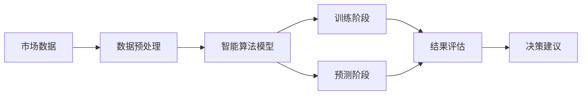

# 智能算法识别市场泡沫形成

> 关键词：智能算法、市场泡沫、金融市场、机器学习、数据挖掘、风险识别、泡沫预警

> 摘要：本文聚焦于利用智能算法识别市场泡沫形成这一重要课题。首先介绍了研究的背景、目的和预期读者等内容，接着阐述了与市场泡沫及智能算法相关的核心概念与联系，详细讲解了用于识别市场泡沫的核心算法原理及具体操作步骤，并通过数学模型和公式进行理论支撑与举例说明。随后通过项目实战展示了代码实现和详细解释，探讨了智能算法在不同市场场景下的实际应用，推荐了相关的学习资源、开发工具框架以及论文著作。最后总结了未来发展趋势与挑战，还提供了常见问题解答和扩展阅读参考资料，旨在为金融从业者、研究者及相关领域人士提供全面且深入的技术指导和理论依据，以更好地运用智能算法识别市场泡沫，降低金融风险。

## 1. 背景介绍 
### 1.1 目的和范围
在金融市场中，市场泡沫的形成与破裂往往伴随着巨大的金融风险，对投资者、金融机构乃至整个经济体系都会产生深远影响。2008 年的全球金融危机就是房地产市场泡沫破裂引发的严重后果。因此，准确识别市场泡沫的形成具有至关重要的意义。

本研究的目的在于探索利用智能算法来识别市场泡沫形成的有效方法和技术。研究范围涵盖了股票市场、房地产市场、大宗商品市场等主要金融市场领域，旨在通过对多源数据的分析和挖掘，运用智能算法构建高效、准确的市场泡沫识别模型。

### 1.2 预期读者
本文的预期读者包括金融市场从业者，如投资经理、交易员、风险分析师等，他们可以通过本文了解智能算法在市场泡沫识别中的应用，提升投资决策的准确性和风险管理能力；也包括计算机科学和人工智能领域的研究人员和开发者，为他们在金融领域的算法应用提供参考和思路；此外，还面向对金融市场和智能算法感兴趣的学者和学生，帮助他们深入理解相关理论和技术。

### 1.3 文档结构概述
本文将按照以下结构展开：首先介绍背景知识，包括研究的目的、预期读者和文档结构等内容；接着阐述与市场泡沫及智能算法相关的核心概念与联系，通过文本示意图和 Mermaid 流程图进行直观展示；然后详细讲解核心算法原理及具体操作步骤，并给出 Python 源代码示例；之后通过数学模型和公式进行理论支撑和举例说明；再通过项目实战展示代码实现和详细解释；探讨智能算法在不同市场场景下的实际应用；推荐相关的学习资源、开发工具框架以及论文著作；最后总结未来发展趋势与挑战，提供常见问题解答和扩展阅读参考资料。

### 1.4 术语表
#### 1.4.1 核心术语定义
- **市场泡沫**：指资产价格显著高于其内在价值的现象，通常是由于投资者的过度乐观、投机行为和市场非理性因素导致的。当泡沫破裂时，资产价格会急剧下跌，引发金融市场的动荡。
- **智能算法**：是指基于人工智能技术的算法，包括机器学习、深度学习、数据挖掘等，能够从大量数据中自动学习模式和规律，实现对未知数据的预测和分类。
- **机器学习**：是一门多领域交叉学科，涉及概率论、统计学、逼近论、凸分析、算法复杂度理论等多门学科。它专门研究计算机怎样模拟或实现人类的学习行为，以获取新的知识或技能，重新组织已有的知识结构使之不断改善自身的性能。
- **数据挖掘**：是指从大量的数据中通过算法搜索隐藏于其中信息的过程。数据挖掘通常与计算机科学有关，并通过统计、在线分析处理、情报检索、机器学习、专家系统（依靠过去的经验法则）和模式识别等诸多方法来实现上述目标。

#### 1.4.2 相关概念解释
- **金融时间序列**：是指按照时间顺序排列的金融数据，如股票价格、汇率、利率等。金融时间序列具有非线性、非平稳性等特点，给市场泡沫的识别带来了挑战。
- **特征工程**：是指从原始数据中提取有用的特征，以提高模型的性能和准确性。在市场泡沫识别中，特征工程包括选择合适的变量、进行数据变换和降维等操作。
- **模型评估**：是指使用一定的指标和方法对模型的性能进行评估，以确定模型的优劣和适用性。常见的模型评估指标包括准确率、召回率、F1 值、均方误差等。

#### 1.4.3 缩略词列表
- **ML**：Machine Learning，机器学习
- **DL**：Deep Learning，深度学习
- **DM**：Data Mining，数据挖掘
- **MSE**：Mean Squared Error，均方误差
- **ROC**：Receiver Operating Characteristic，受试者工作特征曲线

## 2. 核心概念与联系 

### 核心概念原理
市场泡沫的形成是一个复杂的过程，涉及到投资者行为、市场情绪、宏观经济环境等多个因素。智能算法通过对这些因素进行分析和挖掘，寻找市场泡沫形成的规律和特征。

机器学习算法是智能算法的重要组成部分，它可以分为监督学习、无监督学习和强化学习。在市场泡沫识别中，监督学习算法常用于构建分类模型，将市场状态分为泡沫状态和非泡沫状态；无监督学习算法则用于发现数据中的潜在模式和结构，如聚类分析可以将市场数据分为不同的类别，从而发现市场泡沫的迹象。

深度学习算法是机器学习的一个分支，它通过构建深度神经网络来学习数据的复杂特征和模式。在市场泡沫识别中，深度学习算法可以处理大规模的金融时间序列数据，自动提取数据中的特征，提高识别的准确性和效率。

### 架构的文本示意图
```plaintext
市场数据（股票价格、宏观经济指标、投资者情绪等）
|
|-- 数据预处理（清洗、归一化、特征选择等）
|
|-- 智能算法模型（机器学习、深度学习等）
|   |
|   |-- 训练阶段（使用历史数据进行模型训练）
|   |
|   |-- 预测阶段（对当前市场状态进行预测）
|
|-- 结果评估（使用评估指标评估模型性能）
|
|-- 决策建议（根据预测结果提供投资决策建议）
```

### Mermaid 流程图


## 3. 核心算法原理 & 具体操作步骤 

### 算法原理讲解
在市场泡沫识别中，我们可以使用逻辑回归算法作为示例。逻辑回归是一种常用的监督学习算法，用于解决分类问题。它通过对输入特征进行线性组合，然后使用逻辑函数将线性组合的结果映射到 0 到 1 之间的概率值，从而实现对样本的分类。

逻辑回归的数学模型可以表示为：

$$P(y=1|x)=\frac{1}{1+e^{-(w_0 + w_1x_1 + w_2x_2 + \cdots + w_nx_n)}}$$

其中，$P(y=1|x)$ 表示样本 $x$ 属于正类的概率，$w_0, w_1, \cdots, w_n$ 是模型的参数，$x_1, x_2, \cdots, x_n$ 是样本的特征。

### Python 源代码示例
```python
import numpy as np
from sklearn.linear_model import LogisticRegression
from sklearn.model_selection import train_test_split
from sklearn.metrics import accuracy_score

# 生成示例数据
np.random.seed(42)
X = np.random.randn(100, 2)
y = (X[:, 0] + X[:, 1] > 0).astype(int)

# 划分训练集和测试集
X_train, X_test, y_train, y_test = train_test_split(X, y, test_size=0.2, random_state=42)

# 创建逻辑回归模型
model = LogisticRegression()

# 训练模型
model.fit(X_train, y_train)

# 预测
y_pred = model.predict(X_test)

# 评估模型
accuracy = accuracy_score(y_test, y_pred)
print(f"模型准确率: {accuracy}")
```

### 具体操作步骤
1. **数据收集**：收集与市场泡沫相关的数据，包括股票价格、宏观经济指标、投资者情绪等。
2. **数据预处理**：对收集到的数据进行清洗、归一化、特征选择等操作，以提高数据的质量和可用性。
3. **模型选择**：根据问题的特点和数据的类型，选择合适的智能算法模型，如逻辑回归、决策树、神经网络等。
4. **模型训练**：使用训练数据对模型进行训练，调整模型的参数，以提高模型的性能。
5. **模型评估**：使用测试数据对训练好的模型进行评估，计算评估指标，如准确率、召回率、F1 值等，以确定模型的优劣。
6. **模型应用**：将训练好的模型应用于实际市场数据，对市场状态进行预测，为投资决策提供参考。

## 4. 数学模型和公式 & 详细讲解 & 举例说明 

### 逻辑回归的损失函数
逻辑回归的损失函数通常使用对数损失函数（Log Loss），也称为交叉熵损失函数（Cross Entropy Loss）。对数损失函数的定义如下：

$$L(w)=-\frac{1}{m}\sum_{i=1}^{m}[y^{(i)}\log(P(y^{(i)}=1|x^{(i)}))+(1 - y^{(i)})\log(1 - P(y^{(i)}=1|x^{(i)}))]$$

其中，$m$ 是样本的数量，$y^{(i)}$ 是第 $i$ 个样本的真实标签，$P(y^{(i)}=1|x^{(i)})$ 是第 $i$ 个样本属于正类的概率。

对数损失函数的目标是最小化预测概率与真实标签之间的差异。当预测概率与真实标签越接近时，损失函数的值越小。

### 梯度下降法
为了最小化对数损失函数，我们可以使用梯度下降法。梯度下降法是一种迭代优化算法，通过不断更新模型的参数，使得损失函数的值逐渐减小。

梯度下降法的更新公式如下：

$$w_j := w_j - \alpha\frac{\partial L(w)}{\partial w_j}$$

其中，$w_j$ 是模型的第 $j$ 个参数，$\alpha$ 是学习率，$\frac{\partial L(w)}{\partial w_j}$ 是损失函数关于 $w_j$ 的偏导数。

### 举例说明
假设我们有一个简单的二分类问题，样本的特征只有一个，即 $x$。真实标签 $y$ 为 0 或 1。我们使用逻辑回归模型进行分类，模型的参数为 $w_0$ 和 $w_1$。

我们的目标是最小化对数损失函数 $L(w)$。首先，我们需要计算损失函数关于 $w_0$ 和 $w_1$ 的偏导数：

$$\frac{\partial L(w)}{\partial w_0}=-\frac{1}{m}\sum_{i=1}^{m}(y^{(i)}-P(y^{(i)}=1|x^{(i)}))$$

$$\frac{\partial L(w)}{\partial w_1}=-\frac{1}{m}\sum_{i=1}^{m}(y^{(i)}-P(y^{(i)}=1|x^{(i)}))x^{(i)}$$

然后，我们使用梯度下降法更新模型的参数：

$$w_0 := w_0 - \alpha\frac{\partial L(w)}{\partial w_0}$$

$$w_1 := w_1 - \alpha\frac{\partial L(w)}{\partial w_1}$$

重复上述步骤，直到损失函数的值收敛或达到最大迭代次数。

## 5. 项目实战：代码实际案例和详细解释说明 

### 5.1  开发环境搭建
- **操作系统**：Windows、Linux 或 macOS
- **Python 版本**：Python 3.7 及以上
- **开发工具**：PyCharm、Jupyter Notebook 等
- **依赖库**：numpy、pandas、scikit-learn、matplotlib 等

可以使用以下命令安装依赖库：
```sh
pip install numpy pandas scikit-learn matplotlib
```

### 5.2  源代码详细实现和代码解读
```python
import numpy as np
import pandas as pd
from sklearn.linear_model import LogisticRegression
from sklearn.model_selection import train_test_split
from sklearn.metrics import accuracy_score
import matplotlib.pyplot as plt

# 读取数据
data = pd.read_csv('market_data.csv')

# 数据预处理
X = data.drop('label', axis=1).values
y = data['label'].values

# 划分训练集和测试集
X_train, X_test, y_train, y_test = train_test_split(X, y, test_size=0.2, random_state=42)

# 创建逻辑回归模型
model = LogisticRegression()

# 训练模型
model.fit(X_train, y_train)

# 预测
y_pred = model.predict(X_test)

# 评估模型
accuracy = accuracy_score(y_test, y_pred)
print(f"模型准确率: {accuracy}")

# 可视化结果
plt.figure(figsize=(10, 6))
plt.scatter(range(len(y_test)), y_test, label='真实标签', color='blue')
plt.scatter(range(len(y_pred)), y_pred, label='预测标签', color='red', marker='x')
plt.xlabel('样本编号')
plt.ylabel('标签')
plt.title('逻辑回归模型预测结果')
plt.legend()
plt.show()
```

### 代码解读与分析
1. **数据读取**：使用 `pandas` 库的 `read_csv` 函数读取市场数据文件 `market_data.csv`。
2. **数据预处理**：将特征数据和标签数据分别存储在 `X` 和 `y` 中。
3. **划分训练集和测试集**：使用 `sklearn` 库的 `train_test_split` 函数将数据划分为训练集和测试集，测试集占比为 20%。
4. **创建模型**：使用 `sklearn` 库的 `LogisticRegression` 类创建逻辑回归模型。
5. **训练模型**：使用训练数据对模型进行训练。
6. **预测**：使用训练好的模型对测试数据进行预测。
7. **评估模型**：使用 `sklearn` 库的 `accuracy_score` 函数计算模型的准确率。
8. **可视化结果**：使用 `matplotlib` 库绘制真实标签和预测标签的散点图，直观展示模型的预测结果。

## 6. 实际应用场景 
### 股票市场
在股票市场中，智能算法可以通过对股票价格、成交量、市盈率等数据的分析，识别股票市场泡沫的形成。当算法检测到市场泡沫的迹象时，投资者可以及时调整投资策略，降低风险。例如，在 2000 年的互联网泡沫时期，如果投资者能够使用智能算法及时识别市场泡沫，就可以避免巨大的损失。

### 房地产市场
房地产市场的泡沫对经济的影响更为深远。智能算法可以通过对房价、租金、土地价格、人口流动等数据的分析，判断房地产市场是否存在泡沫。政府可以根据算法的预测结果，制定相应的政策，如调整利率、控制信贷规模等，以稳定房地产市场。

### 大宗商品市场
大宗商品市场包括石油、黄金、铜等商品。智能算法可以通过对大宗商品价格、供求关系、宏观经济指标等数据的分析，识别大宗商品市场泡沫的形成。企业可以根据算法的预测结果，合理安排生产和采购计划，降低成本和风险。

## 7. 工具和资源推荐
### 7.1 学习资源推荐
#### 7.1.1 书籍推荐
- 《机器学习》（周志华著）：这本书全面介绍了机器学习的基本概念、算法和应用，是机器学习领域的经典教材。
- 《深度学习》（Ian Goodfellow、Yoshua Bengio 和 Aaron Courville 著）：这本书系统地介绍了深度学习的理论和实践，是深度学习领域的权威著作。
- 《Python 数据分析实战》（Sebastian Raschka 著）：这本书介绍了使用 Python 进行数据分析的方法和技巧，包括数据处理、可视化、机器学习等内容。

#### 7.1.2 在线课程
- Coursera 上的《机器学习》课程（Andrew Ng 教授主讲）：这是一门经典的机器学习课程，适合初学者入门。
- edX 上的《深度学习》课程（由全球知名高校的教授主讲）：这门课程深入介绍了深度学习的理论和实践，适合有一定基础的学习者。
- 中国大学 MOOC 上的《数据挖掘》课程：这门课程介绍了数据挖掘的基本概念、算法和应用，适合对数据挖掘感兴趣的学习者。

#### 7.1.3 技术博客和网站
- Medium：这是一个技术博客平台，有很多关于机器学习、深度学习和金融科技的优质文章。
- Kaggle：这是一个数据科学竞赛平台，有很多关于金融数据挖掘和市场预测的案例和代码。
- Towards Data Science：这是一个专注于数据科学和人工智能的技术博客，有很多高质量的技术文章和教程。

### 7.2 开发工具框架推荐
#### 7.2.1 IDE和编辑器
- PyCharm：这是一款专业的 Python 集成开发环境，具有代码编辑、调试、版本控制等功能，适合开发大型 Python 项目。
- Jupyter Notebook：这是一个交互式的开发环境，适合进行数据探索、模型训练和可视化等工作。
- Visual Studio Code：这是一款轻量级的代码编辑器，支持多种编程语言和插件，适合快速开发和调试代码。

#### 7.2.2 调试和性能分析工具
- PySnooper：这是一个简单易用的 Python 调试工具，可以自动记录函数的调用过程和变量的值。
- cProfile：这是 Python 内置的性能分析工具，可以分析代码的执行时间和函数调用次数。
- TensorBoard：这是 TensorFlow 提供的可视化工具，可以用于可视化模型的训练过程、性能指标等。

#### 7.2.3 相关框架和库
- scikit-learn：这是一个常用的机器学习框架，提供了丰富的机器学习算法和工具，如分类、回归、聚类等。
- TensorFlow：这是一个开源的深度学习框架，由 Google 开发，广泛应用于图像识别、自然语言处理等领域。
- PyTorch：这是一个开源的深度学习框架，由 Facebook 开发，具有动态图、易于调试等优点。

### 7.3 相关论文著作推荐
#### 7.3.1 经典论文
- Eugene F. Fama 的《Efficient Capital Markets: A Review of Theory and Empirical Work》：这篇论文提出了有效市场假说，对金融市场的研究产生了深远影响。
- Robert J. Shiller 的《Irrational Exuberance》：这篇论文探讨了投资者的非理性行为和市场泡沫的形成机制。
- Andrew W. Lo 和 A. Craig MacKinlay 的《A Non - Random Walk Down Wall Street》：这篇论文对有效市场假说提出了质疑，强调了市场的非随机性。

#### 7.3.2 最新研究成果
- 关注顶级金融期刊，如《Journal of Finance》、《Review of Financial Studies》等，这些期刊发表了很多关于市场泡沫识别和金融风险管理的最新研究成果。
- 关注人工智能和机器学习领域的顶级会议，如 NeurIPS、ICML 等，这些会议上有很多关于智能算法在金融领域应用的研究论文。

#### 7.3.3 应用案例分析
- 可以参考一些金融机构和研究机构发布的市场研究报告，这些报告中通常会包含市场泡沫识别和预测的应用案例和分析。
- Kaggle 上也有很多关于金融数据挖掘和市场预测的竞赛和案例，可以从中学习到不同的算法和技术的应用。

## 8. 总结：未来发展趋势与挑战
### 未来发展趋势
- **多源数据融合**：未来的市场泡沫识别将不仅仅依赖于传统的金融数据，还将融合社交媒体数据、新闻数据、卫星图像数据等多源数据，以更全面地反映市场信息和投资者情绪。
- **深度学习的深入应用**：深度学习算法在处理复杂数据和挖掘数据潜在模式方面具有独特优势，未来将在市场泡沫识别中得到更广泛的应用，如使用循环神经网络（RNN）、长短期记忆网络（LSTM）等处理金融时间序列数据。
- **实时监测和预警**：随着技术的发展，市场泡沫的识别将向实时监测和预警方向发展，能够及时发现市场泡沫的形成迹象，为投资者和监管机构提供及时的决策支持。
- **跨市场和跨领域研究**：市场之间的关联性越来越强，未来的研究将不仅仅局限于单个市场的泡沫识别，还将开展跨市场和跨领域的研究，以更好地把握市场的整体风险。

### 挑战
- **数据质量和隐私问题**：多源数据的融合带来了数据质量和隐私问题。不同来源的数据可能存在噪声、缺失值和不一致性，需要进行有效的数据清洗和预处理。同时，数据的隐私保护也是一个重要的问题，需要在保证数据可用性的前提下，保护用户的隐私。
- **模型解释性**：深度学习等复杂模型在提高预测准确性的同时，也带来了模型解释性的问题。这些模型通常被视为“黑匣子”，难以理解其决策过程和依据，这在金融领域中是一个重要的挑战，因为投资者和监管机构需要了解模型的决策逻辑。
- **市场的复杂性和不确定性**：金融市场是一个复杂的系统，受到多种因素的影响，如宏观经济环境、政策变化、突发事件等。这些因素的复杂性和不确定性给市场泡沫的识别带来了很大的挑战，需要不断改进和优化算法模型。
- **算法的适应性和鲁棒性**：市场环境是不断变化的，算法模型需要具有良好的适应性和鲁棒性，能够在不同的市场条件下保持稳定的性能。同时，算法还需要能够抵御数据中的噪声和异常值的影响。

## 9. 附录：常见问题与解答
### 1. 智能算法识别市场泡沫的准确性如何保证？
智能算法识别市场泡沫的准确性受到多种因素的影响，如数据质量、模型选择、特征工程等。为了保证准确性，需要进行充分的数据预处理，选择合适的模型，并进行有效的特征工程。同时，还需要使用交叉验证等方法对模型进行评估和优化，以提高模型的泛化能力。

### 2. 如何选择适合的智能算法模型？
选择适合的智能算法模型需要考虑问题的特点、数据的类型和规模等因素。对于简单的分类问题，可以选择逻辑回归、决策树等模型；对于复杂的非线性问题，可以选择神经网络、支持向量机等模型。此外，还可以使用模型选择算法，如网格搜索、随机搜索等，来自动选择最优的模型和参数。

### 3. 智能算法在市场泡沫识别中的应用是否存在局限性？
智能算法在市场泡沫识别中的应用存在一定的局限性。首先，市场是一个复杂的系统，受到多种因素的影响，智能算法可能无法完全捕捉到所有的因素和变化。其次，智能算法的性能依赖于数据的质量和数量，如果数据存在偏差或不足，可能会影响模型的准确性。此外，模型的解释性也是一个问题，复杂的模型可能难以理解其决策过程和依据。

### 4. 如何处理金融时间序列数据中的非平稳性和非线性？
处理金融时间序列数据中的非平稳性和非线性可以采用多种方法。对于非平稳性，可以使用差分、对数变换等方法将数据转换为平稳序列。对于非线性，可以使用非线性模型，如神经网络、支持向量机等，或者进行特征工程，提取数据中的非线性特征。

### 5. 智能算法识别市场泡沫的结果如何应用于投资决策？
智能算法识别市场泡沫的结果可以为投资决策提供参考。当算法检测到市场泡沫的迹象时，投资者可以采取相应的措施，如减少风险资产的配置、增加防御性资产的配置等。同时，投资者还需要结合自己的投资目标、风险承受能力等因素，综合考虑决策。

## 10. 扩展阅读 & 参考资料
### 扩展阅读
- 《金融市场学》（张亦春、郑振龙主编）：这本书系统地介绍了金融市场的基本概念、理论和实践，有助于深入理解金融市场的运行机制。
- 《行为金融学》（饶育蕾、盛虎编著）：这本书介绍了行为金融学的基本理论和方法，探讨了投资者的非理性行为和市场异常现象，对于理解市场泡沫的形成机制有很大帮助。
- 《数据挖掘：概念与技术》（Jiawei Han、Jian Pei 和 Micheline Kamber 著）：这本书全面介绍了数据挖掘的基本概念、算法和应用，是数据挖掘领域的经典著作。

### 参考资料
- 相关金融数据可以从金融数据提供商，如 Wind、Bloomberg 等获取。
- 机器学习和深度学习的相关文档和教程可以参考官方网站，如 scikit - learn、TensorFlow、PyTorch 等的官方文档。
- 学术论文可以通过学术数据库，如 IEEE Xplore、ACM Digital Library、Web of Science 等进行检索。