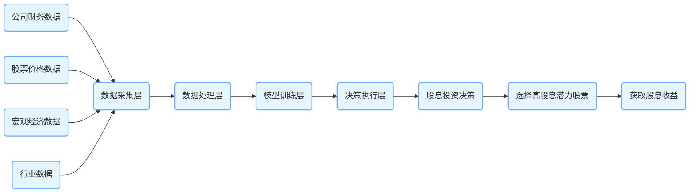

# 智能系统优化股息投资策略

> 关键词：智能系统、股息投资、投资策略优化、机器学习、量化分析

> 摘要：本文聚焦于如何利用智能系统优化股息投资策略。首先介绍了股息投资的背景和智能系统在投资领域的重要性，接着阐述了相关核心概念与联系，包括股息、智能系统架构等。详细讲解了用于优化策略的核心算法原理及具体操作步骤，借助数学模型和公式深入分析。通过项目实战给出实际案例及代码解释，探讨了股息投资策略在不同场景的实际应用。同时推荐了学习、开发相关的工具和资源，最后总结了未来股息投资策略发展的趋势与挑战，并提供常见问题解答及参考资料，旨在为投资者和相关从业者提供全面的智能股息投资策略优化方案。

## 1. 背景介绍 
### 1.1 目的和范围
股息投资作为一种重要的投资方式，旨在通过持有能够稳定派发股息的股票，获取持续的现金流收益并实现资产的增值。然而，传统的股息投资策略往往依赖于投资者的经验和主观判断，缺乏系统性和科学性，难以适应复杂多变的市场环境。本文章的目的在于探讨如何运用智能系统对股息投资策略进行优化，提高投资决策的准确性和效率，降低投资风险。

本文的范围涵盖了股息投资的基本概念、智能系统的相关技术和算法、基于智能系统的股息投资策略优化方法，以及实际应用案例和未来发展趋势等方面。通过对这些内容的深入研究，为投资者提供一种科学、有效的股息投资策略优化方案。

### 1.2 预期读者
本文预期读者包括但不限于以下几类人群：
1. **投资者**：包括个人投资者和机构投资者，希望通过学习智能系统优化股息投资策略，提高投资收益和降低风险。
2. **金融从业者**：如基金经理、分析师、交易员等，对智能投资领域感兴趣，希望了解相关技术和方法，为实际工作提供参考。
3. **技术开发者**：对人工智能、机器学习等技术在金融领域的应用有兴趣，希望通过本文了解相关技术的具体应用场景和实现方法。
4. **研究人员**：从事金融工程、投资学、人工智能等领域研究的学者，希望通过本文获取相关研究的前沿动态和实践经验。

### 1.3 文档结构概述
本文将按照以下结构进行组织：
1. **背景介绍**：介绍股息投资的背景和智能系统在投资领域的重要性，明确本文的目的和范围，以及预期读者和文档结构概述。
2. **核心概念与联系**：阐述股息、智能系统等核心概念的原理和架构，通过文本示意图和 Mermaid 流程图展示它们之间的联系。
3. **核心算法原理 & 具体操作步骤**：详细讲解用于优化股息投资策略的核心算法原理，包括机器学习算法和量化分析方法，并给出具体的操作步骤，使用 Python 源代码进行详细阐述。
4. **数学模型和公式 & 详细讲解 & 举例说明**：介绍用于股息投资策略优化的数学模型和公式，对其进行详细讲解，并通过具体的例子进行说明。
5. **项目实战：代码实际案例和详细解释说明**：通过一个实际的项目案例，展示如何使用智能系统优化股息投资策略，包括开发环境搭建、源代码详细实现和代码解读。
6. **实际应用场景**：探讨股息投资策略在不同场景下的实际应用，如长期投资、短期投机、资产配置等。
7. **工具和资源推荐**：推荐学习、开发相关的工具和资源，包括书籍、在线课程、技术博客和网站、IDE 和编辑器、调试和性能分析工具、相关框架和库、经典论文、最新研究成果和应用案例分析等。
8. **总结：未来发展趋势与挑战**：总结智能系统优化股息投资策略的未来发展趋势和面临的挑战。
9. **附录：常见问题与解答**：提供常见问题的解答，帮助读者更好地理解和应用本文介绍的内容。
10. **扩展阅读 & 参考资料**：提供相关的扩展阅读材料和参考资料，方便读者进一步深入学习和研究。

### 1.4 术语表
#### 1.4.1 核心术语定义
1. **股息**：股息是指股份公司从提取了公积金、公益金的税后利润中按照股息率派发给股东的收益。股息的分配方式通常有现金股息、股票股息等。
2. **股息率**：股息率是股息与股票价格之间的比率，通常以百分比表示。股息率是衡量股票投资价值的重要指标之一。
3. **智能系统**：智能系统是指能够模拟人类智能，具有感知、学习、推理、决策等能力的计算机系统。在投资领域，智能系统可以通过对大量数据的分析和处理，为投资者提供投资决策支持。
4. **机器学习**：机器学习是一门多领域交叉学科，涉及概率论、统计学、逼近论、凸分析、算法复杂度理论等多门学科。它专门研究计算机怎样模拟或实现人类的学习行为，以获取新的知识或技能，重新组织已有的知识结构使之不断改善自身的性能。
5. **量化分析**：量化分析是指运用数学模型和统计方法对金融市场的数据进行分析和处理，以发现市场规律和投资机会的方法。

#### 1.4.2 相关概念解释
1. **基本面分析**：基本面分析是指通过对宏观经济、行业和公司的基本情况进行分析，评估股票的内在价值，从而做出投资决策的方法。基本面分析的主要内容包括宏观经济指标、行业发展趋势、公司财务状况、管理层能力等。
2. **技术分析**：技术分析是指通过对股票价格、成交量等市场数据的分析，研究股票价格的走势和变化规律，从而做出投资决策的方法。技术分析的主要内容包括图表分析、技术指标分析等。
3. **资产配置**：资产配置是指根据投资者的风险偏好、投资目标和投资期限等因素，将资金分配到不同的资产类别中，以实现投资组合的风险分散和收益最大化的方法。资产配置的主要资产类别包括股票、债券、现金、房地产等。

#### 1.4.3 缩略词列表
1. **AI**：Artificial Intelligence，人工智能
2. **ML**：Machine Learning，机器学习
3. **DL**：Deep Learning，深度学习
4. **ETF**：Exchange Traded Fund，交易型开放式指数基金
5. **ROE**：Return on Equity，净资产收益率

## 2. 核心概念与联系 

### 股息的概念原理
股息是公司盈利的一部分，公司在盈利后，会根据一定的政策和规则，将部分利润分配给股东。股息的分配方式主要有现金股息和股票股息。现金股息是公司直接向股东支付现金，这是最常见的股息分配方式；股票股息则是公司向股东发放新的股票，增加股东持有的股份数量。

公司决定是否发放股息以及发放多少股息，受到多种因素的影响，包括公司的盈利状况、财务状况、发展战略、行业竞争等。一般来说，盈利稳定、现金流充足的公司更有可能发放较高的股息。

### 智能系统的架构
智能系统通常由数据采集层、数据处理层、模型训练层和决策执行层组成。

- **数据采集层**：负责收集与股息投资相关的各种数据，包括公司财务报表、股票价格、宏观经济数据、行业数据等。这些数据来源广泛，可以通过金融数据提供商、公司官网、政府部门网站等渠道获取。
- **数据处理层**：对采集到的数据进行清洗、预处理和特征工程。清洗数据是为了去除噪声、缺失值和异常值；预处理包括数据归一化、标准化等操作，以提高数据的质量和可用性；特征工程则是从原始数据中提取有价值的特征，作为模型训练的输入。
- **模型训练层**：选择合适的机器学习或深度学习模型，如决策树、随机森林、神经网络等，对处理后的数据进行训练。训练的目标是让模型学习到股息投资的规律和模式，从而能够对未来的股息情况进行预测。
- **决策执行层**：根据模型的预测结果，结合投资者的风险偏好和投资目标，生成具体的投资决策，并执行相应的投资操作。

### 核心概念联系的文本示意图
股息投资与智能系统之间存在着紧密的联系。智能系统通过对大量与股息相关的数据进行分析和处理，挖掘出影响股息分配的因素和规律，从而为投资者提供更准确的股息预测和投资决策建议。投资者可以根据智能系统的建议，选择具有较高股息潜力的股票进行投资，以获取更高的收益。

### Mermaid 流程图


## 3. 核心算法原理 & 具体操作步骤 

### 核心算法原理 - 随机森林算法
随机森林是一种集成学习算法，它由多个决策树组成。每个决策树在一个随机选择的样本子集和特征子集上进行训练，最后通过投票或平均的方式综合多个决策树的预测结果，得到最终的预测。

随机森林算法的优点在于它具有较高的准确性和稳定性，能够处理高维数据和复杂的非线性关系，同时不容易过拟合。

以下是随机森林算法的 Python 代码示例：
```python
from sklearn.ensemble import RandomForestRegressor
from sklearn.model_selection import train_test_split
from sklearn.metrics import mean_squared_error
import pandas as pd

# 假设我们有一个包含股息相关特征和股息率的数据集
# 读取数据
data = pd.read_csv('dividend_data.csv')

# 分离特征和目标变量
X = data.drop('dividend_yield', axis=1)
y = data['dividend_yield']

# 划分训练集和测试集
X_train, X_test, y_train, y_test = train_test_split(X, y, test_size=0.2, random_state=42)

# 创建随机森林回归模型
rf_model = RandomForestRegressor(n_estimators=100, random_state=42)

# 训练模型
rf_model.fit(X_train, y_train)

# 进行预测
y_pred = rf_model.predict(X_test)

# 计算均方误差
mse = mean_squared_error(y_test, y_pred)
print(f"均方误差: {mse}")
```

### 具体操作步骤
1. **数据准备**：收集与股息投资相关的数据，包括公司财务指标（如净利润、营业收入、净资产等）、股票价格、宏观经济指标（如 GDP 增长率、通货膨胀率等）、行业数据等。对数据进行清洗和预处理，去除噪声和缺失值，进行数据归一化和标准化。
2. **特征选择**：从原始数据中选择与股息率相关性较高的特征。可以使用相关性分析、特征重要性排序等方法进行特征选择。
3. **模型训练**：选择合适的机器学习模型，如随机森林、神经网络等，对处理后的数据进行训练。在训练过程中，可以使用交叉验证等方法进行模型调优，选择最优的模型参数。
4. **模型评估**：使用测试集对训练好的模型进行评估，计算评估指标，如均方误差、决定系数等，评估模型的性能。
5. **投资决策**：根据模型的预测结果，结合投资者的风险偏好和投资目标，生成具体的投资决策。例如，选择股息率预测值较高的股票进行投资。

## 4. 数学模型和公式 & 详细讲解 & 举例说明 

### 股息率的计算
股息率是衡量股票股息收益的重要指标，其计算公式为：
$$股息率 = \frac{每股股息}{股票价格} \times 100\%$$

例如，某股票的每股股息为 2 元，当前股票价格为 50 元，则该股票的股息率为：
$$股息率 = \frac{2}{50} \times 100\% = 4\%$$

### 随机森林模型的预测原理
随机森林模型的预测是基于多个决策树的预测结果进行综合的。假设我们有 $n$ 个决策树，第 $i$ 个决策树的预测结果为 $\hat{y}_i$，则随机森林模型的最终预测结果 $\hat{y}$ 可以通过以下公式计算：
$$\hat{y} = \frac{1}{n} \sum_{i=1}^{n} \hat{y}_i$$

例如，假设有 3 个决策树，它们的预测结果分别为 3%、4% 和 5%，则随机森林模型的最终预测结果为：
$$\hat{y} = \frac{3\% + 4\% + 5\%}{3} = 4\%$$

### 均方误差的计算
均方误差（Mean Squared Error，MSE）是衡量模型预测误差的常用指标，其计算公式为：
$$MSE = \frac{1}{m} \sum_{i=1}^{m} (y_i - \hat{y}_i)^2$$
其中，$m$ 是样本数量，$y_i$ 是真实值，$\hat{y}_i$ 是预测值。

例如，假设有 5 个样本，它们的真实值分别为 [2, 3, 4, 5, 6]，预测值分别为 [2.1, 2.9, 4.2, 4.8, 6.1]，则均方误差为：
$$MSE = \frac{(2 - 2.1)^2 + (3 - 2.9)^2 + (4 - 4.2)^2 + (5 - 4.8)^2 + (6 - 6.1)^2}{5} = 0.02$$

## 5. 项目实战：代码实际案例和详细解释说明 

### 5.1  开发环境搭建
1. **安装 Python**：可以从 Python 官方网站（https://www.python.org/downloads/）下载并安装 Python 3.x 版本。
2. **安装必要的库**：使用 pip 命令安装以下必要的库：
```bash
pip install pandas numpy scikit-learn matplotlib
```
3. **数据准备**：收集与股息投资相关的数据，保存为 CSV 文件，例如 `dividend_data.csv`。

### 5.2  源代码详细实现和代码解读
```python
import pandas as pd
import numpy as np
from sklearn.ensemble import RandomForestRegressor
from sklearn.model_selection import train_test_split
from sklearn.metrics import mean_squared_error
import matplotlib.pyplot as plt

# 读取数据
data = pd.read_csv('dividend_data.csv')

# 查看数据基本信息
print("数据基本信息：")
data.info()

# 分离特征和目标变量
X = data.drop('dividend_yield', axis=1)
y = data['dividend_yield']

# 划分训练集和测试集
X_train, X_test, y_train, y_test = train_test_split(X, y, test_size=0.2, random_state=42)

# 创建随机森林回归模型
rf_model = RandomForestRegressor(n_estimators=100, random_state=42)

# 训练模型
rf_model.fit(X_train, y_train)

# 进行预测
y_pred = rf_model.predict(X_test)

# 计算均方误差
mse = mean_squared_error(y_test, y_pred)
print(f"均方误差: {mse}")

# 可视化预测结果
plt.figure(figsize=(10, 6))
plt.scatter(y_test, y_pred)
plt.xlabel('真实股息率')
plt.ylabel('预测股息率')
plt.title('真实股息率 vs 预测股息率')
plt.show()
```

### 5.3  代码解读与分析
1. **数据读取**：使用 `pandas` 库的 `read_csv` 函数读取保存的 CSV 文件，将数据加载到 DataFrame 中。
2. **数据探索**：使用 `info` 方法查看数据的基本信息，包括数据的行数、列数、数据类型等。
3. **特征和目标变量分离**：使用 `drop` 方法将目标变量 `dividend_yield` 从数据集中分离出来，得到特征矩阵 `X` 和目标向量 `y`。
4. **数据集划分**：使用 `train_test_split` 函数将数据集划分为训练集和测试集，测试集占比为 20%。
5. **模型创建和训练**：创建随机森林回归模型，并使用训练集对模型进行训练。
6. **模型预测**：使用训练好的模型对测试集进行预测，得到预测结果 `y_pred`。
7. **模型评估**：使用 `mean_squared_error` 函数计算预测结果与真实值之间的均方误差，评估模型的性能。
8. **可视化**：使用 `matplotlib` 库绘制散点图，将真实股息率和预测股息率进行可视化，直观地观察模型的预测效果。

## 6. 实际应用场景 
### 长期投资
对于长期投资者来说，股息投资是一种稳健的投资策略。通过智能系统优化股息投资策略，可以帮助投资者筛选出具有稳定股息派发历史和良好发展前景的公司股票。投资者可以长期持有这些股票，享受股息收益和股票增值带来的双重回报。例如，一些大型蓝筹股公司，如可口可乐、强生等，具有较高的股息率和稳定的业绩增长，是长期股息投资的优质选择。

### 资产配置
在资产配置中，股息投资可以作为一种重要的资产类别。智能系统可以根据投资者的风险偏好和投资目标，将一定比例的资金分配到股息股票中，以实现资产的多元化和风险分散。例如，对于风险偏好较低的投资者，可以适当增加股息股票的配置比例，以获取稳定的现金流收益；对于风险偏好较高的投资者，可以在资产配置中适当降低股息股票的比例，增加成长型股票的投资。

### 退休规划
对于退休人员或即将退休的人群来说，股息投资是一种理想的养老收入来源。通过智能系统优化股息投资策略，可以帮助退休人员选择具有较高股息率和稳定分红的股票，确保退休后有稳定的现金流收入。同时，股息投资还可以在一定程度上抵御通货膨胀的影响，保障退休生活的质量。

## 7. 工具和资源推荐
### 7.1 学习资源推荐
#### 7.1.1 书籍推荐
1. 《聪明的投资者》（The Intelligent Investor）：本杰明·格雷厄姆（Benjamin Graham）著，被誉为投资领域的圣经，书中详细介绍了价值投资的理念和方法，对股息投资也有深入的探讨。
2. 《漫步华尔街》（A Random Walk Down Wall Street）：伯顿·马尔基尔（Burton Malkiel）著，该书介绍了各种投资理论和策略，包括股息投资，是一本适合初学者的投资入门书籍。
3. 《机器学习》（Machine Learning）：周志华著，全面介绍了机器学习的基本概念、算法和应用，对于理解智能系统在股息投资中的应用有很大的帮助。

#### 7.1.2 在线课程
1. Coursera 上的 “Machine Learning” 课程：由斯坦福大学教授 Andrew Ng 授课，是一门经典的机器学习入门课程，涵盖了机器学习的基本算法和应用。
2. edX 上的 “Data Science MicroMasters Program” 课程：该课程涵盖了数据科学的各个方面，包括数据处理、机器学习、深度学习等，对于学习智能系统在股息投资中的应用有很大的帮助。
3. 中国大学 MOOC 上的 “金融大数据分析与应用” 课程：该课程介绍了金融大数据的基本概念、分析方法和应用案例，对于理解金融数据在股息投资中的应用有很大的帮助。

#### 7.1.3 技术博客和网站
1. Medium：是一个知名的技术博客平台，上面有很多关于机器学习、金融科技等领域的优秀文章，可以帮助读者了解最新的技术动态和应用案例。
2. Towards Data Science：是一个专注于数据科学和机器学习的技术博客，上面有很多高质量的技术文章和教程，对于学习智能系统在股息投资中的应用有很大的帮助。
3. 金融界网站：提供了丰富的金融资讯和数据，包括股票行情、公司财务报表、宏观经济数据等，是投资者获取金融信息的重要渠道。

### 7.2 开发工具框架推荐
#### 7.2.1 IDE和编辑器
1. PyCharm：是一款专门为 Python 开发设计的集成开发环境（IDE），具有代码编辑、调试、版本控制等功能，是 Python 开发者的首选工具。
2. Jupyter Notebook：是一个交互式的开发环境，支持多种编程语言，包括 Python、R 等。Jupyter Notebook 可以方便地进行数据探索、模型训练和可视化，是数据科学家和机器学习工程师常用的工具。
3. Visual Studio Code：是一款轻量级的代码编辑器，支持多种编程语言和插件扩展。Visual Studio Code 具有丰富的功能和良好的用户体验，是开发者的常用工具之一。

#### 7.2.2 调试和性能分析工具
1. Py-Spy：是一个用于 Python 代码性能分析的工具，可以实时监控 Python 程序的 CPU 使用率和函数调用情况，帮助开发者找出性能瓶颈。
2. cProfile：是 Python 内置的性能分析工具，可以对 Python 程序的执行时间和函数调用次数进行统计分析，帮助开发者优化代码性能。
3. TensorBoard：是 TensorFlow 提供的可视化工具，可以对深度学习模型的训练过程和性能进行可视化分析，帮助开发者调试和优化模型。

#### 7.2.3 相关框架和库
1. Pandas：是一个用于数据处理和分析的 Python 库，提供了丰富的数据结构和数据操作方法，是数据科学家和机器学习工程师常用的工具之一。
2. NumPy：是一个用于科学计算的 Python 库，提供了高效的多维数组对象和数学函数，是 Python 科学计算的基础库。
3. Scikit-learn：是一个用于机器学习的 Python 库，提供了丰富的机器学习算法和工具，包括分类、回归、聚类等算法，是机器学习工程师常用的工具之一。
4. TensorFlow：是一个开源的深度学习框架，由 Google 开发和维护。TensorFlow 提供了丰富的深度学习模型和工具，包括神经网络、卷积神经网络、循环神经网络等，是深度学习开发者的常用工具之一。

### 7.3 相关论文著作推荐
#### 7.3.1 经典论文
1. “A Random Walk Down Wall Street”（1973）：伯顿·马尔基尔（Burton Malkiel）著，该论文提出了随机漫步理论，对股票市场的有效性和投资策略进行了深入的探讨。
2. “The Capital Asset Pricing Model: Theory and Evidence”（1972）：迈克尔·詹森（Michael Jensen）著，该论文对资本资产定价模型（CAPM）进行了系统的阐述和实证研究，是现代金融理论的重要基石之一。
3. “Machine Learning in Automated Trading: Review and Classification”（2019）：该论文对机器学习在自动化交易中的应用进行了全面的综述和分类，为智能系统在股息投资中的应用提供了理论基础和实践指导。

#### 7.3.2 最新研究成果
1. “Deep Learning for Stock Market Prediction: A Review”（2020）：该论文对深度学习在股票市场预测中的应用进行了最新的研究综述，介绍了深度学习模型在股票价格预测、股息预测等方面的应用进展和挑战。
2. “Quantitative Investment Strategies Based on Machine Learning: A Review”（2021）：该论文对基于机器学习的量化投资策略进行了最新的研究综述，介绍了机器学习算法在量化选股、资产配置、风险控制等方面的应用进展和挑战。
3. “Artificial Intelligence in Finance: Applications and Challenges”（2022）：该论文对人工智能在金融领域的应用进行了最新的研究综述，介绍了人工智能技术在金融风险管理、投资决策、客户服务等方面的应用进展和挑战。

#### 7.3.3 应用案例分析
1. “Applying Machine Learning to Optimize Dividend Investment Strategies”（2022）：该案例分析了如何使用机器学习算法优化股息投资策略，通过对历史数据的分析和模型训练，提高了股息投资的收益和风险控制能力。
2. “Using Deep Learning to Predict Dividend Yields”（2023）：该案例分析了如何使用深度学习模型预测股息收益率，通过对大量的财务数据和市场数据的分析和模型训练，提高了股息收益率预测的准确性和可靠性。
3. “Quantitative Investment Strategies Based on Machine Learning in the Chinese Stock Market”（2023）：该案例分析了基于机器学习的量化投资策略在中国股票市场的应用，通过对中国股票市场的历史数据的分析和模型训练，验证了机器学习算法在量化投资中的有效性和实用性。

## 8. 总结：未来发展趋势与挑战
### 未来发展趋势
1. **智能化程度不断提高**：随着人工智能技术的不断发展，智能系统在股息投资策略优化中的应用将越来越广泛和深入。未来的智能系统将能够自动学习和适应市场变化，实时调整投资策略，提高投资决策的准确性和效率。
2. **多技术融合应用**：智能系统将与大数据、云计算、区块链等技术深度融合，实现数据的高效处理和安全共享，为股息投资策略优化提供更强大的技术支持。例如，区块链技术可以确保金融数据的真实性和不可篡改，提高投资决策的可靠性。
3. **个性化投资服务**：未来的智能系统将能够根据投资者的个性化需求和风险偏好，提供定制化的股息投资策略。投资者可以根据自己的投资目标、投资期限、风险承受能力等因素，选择适合自己的投资策略，实现个性化的投资服务。

### 挑战
1. **数据质量和安全问题**：智能系统的性能和效果高度依赖于数据的质量和安全性。然而，金融数据往往存在噪声、缺失值和异常值等问题，同时数据的安全和隐私也面临着严峻的挑战。如何保证数据的质量和安全，是智能系统在股息投资策略优化中面临的重要挑战之一。
2. **模型解释性问题**：机器学习和深度学习模型通常被视为“黑箱”模型，其决策过程和结果难以解释。在股息投资领域，投资者需要了解模型的决策依据和风险因素，以便做出合理的投资决策。因此，如何提高模型的解释性，是智能系统在股息投资策略优化中面临的另一个重要挑战。
3. **市场不确定性和复杂性**：金融市场具有高度的不确定性和复杂性，受到宏观经济、政策法规、公司基本面、投资者情绪等多种因素的影响。智能系统难以准确预测市场的变化和风险，如何在复杂多变的市场环境中提高投资策略的适应性和稳定性，是智能系统在股息投资策略优化中面临的重大挑战。

## 9. 附录：常见问题与解答
### 1. 智能系统优化股息投资策略一定能保证盈利吗？
不能。智能系统优化股息投资策略只是基于历史数据和模型预测，提供一种更科学、更合理的投资决策建议。然而，金融市场具有高度的不确定性和复杂性，受到多种因素的影响，模型的预测结果可能存在误差。因此，即使使用智能系统优化股息投资策略，也不能保证一定能盈利，投资者仍然需要承担一定的投资风险。

### 2. 如何选择适合的机器学习模型？
选择适合的机器学习模型需要考虑多个因素，包括数据的特点、问题的类型、模型的性能和复杂度等。一般来说，可以先尝试一些简单的模型，如线性回归、决策树等，然后根据模型的性能和效果，逐步尝试更复杂的模型，如随机森林、神经网络等。同时，还可以使用交叉验证等方法进行模型调优，选择最优的模型参数。

### 3. 如何保证数据的质量和安全？
保证数据的质量和安全需要采取一系列措施，包括数据清洗、预处理、加密、备份等。在数据采集阶段，需要选择可靠的数据来源，确保数据的准确性和完整性。在数据处理阶段，需要对数据进行清洗和预处理，去除噪声、缺失值和异常值。在数据存储和传输阶段，需要对数据进行加密处理，确保数据的安全性和隐私性。同时，还需要定期对数据进行备份，防止数据丢失和损坏。

### 4. 智能系统优化股息投资策略需要具备哪些专业知识？
智能系统优化股息投资策略需要具备金融、数学、计算机等多方面的专业知识。具体来说，需要了解股息投资的基本概念、原理和方法，掌握机器学习、深度学习等人工智能技术的基本算法和应用，熟悉 Python 等编程语言和相关的开发工具和框架。此外，还需要具备一定的数据分析和处理能力，能够对金融数据进行有效的分析和挖掘。

## 10. 扩展阅读 & 参考资料
### 扩展阅读
1. 《金融炼金术》（The Alchemy of Finance）：乔治·索罗斯（George Soros）著，该书介绍了索罗斯的投资哲学和交易策略，对理解金融市场的运行机制和投资决策有很大的帮助。
2. 《黑天鹅》（The Black Swan）：纳西姆·尼古拉斯·塔勒布（Nassim Nicholas Taleb）著，该书介绍了黑天鹅事件的概念和影响，提醒投资者要注意市场的不确定性和风险。
3. 《人类简史：从动物到上帝》（Sapiens: A Brief History of Humankind）：尤瓦尔·赫拉利（Yuval Noah Harari）著，该书从人类历史的角度探讨了人类的发展和进步，对理解人类行为和决策有很大的启发。

### 参考资料
1. Yahoo Finance：https://finance.yahoo.com/
2. Bloomberg：https://www.bloomberg.com/
3. Python 官方网站：https://www.python.org/
4. Scikit-learn 官方文档：https://scikit-learn.org/stable/
5. TensorFlow 官方文档：https://www.tensorflow.org/