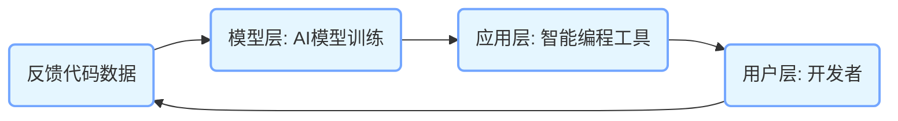

# 智能编程：AI如何改变开发者的角色

> 关键词：智能编程、AI、开发者角色、代码生成、自动化测试、未来趋势

> 摘要：本文深入探讨了智能编程领域中AI对开发者角色的影响。随着AI技术的飞速发展，其在编程领域的应用日益广泛，正在重塑开发者的工作方式和职责。文章首先介绍了相关背景，包括目的、预期读者等内容。接着阐述了智能编程的核心概念与联系，详细讲解了核心算法原理及具体操作步骤，并辅以Python代码示例。通过数学模型和公式进一步剖析智能编程的内在逻辑，结合项目实战案例加深理解。同时，探讨了智能编程的实际应用场景，推荐了相关的学习资源、开发工具框架和论文著作。最后总结了未来发展趋势与挑战，解答常见问题，并提供扩展阅读与参考资料，旨在全面呈现AI在智能编程中对开发者角色的改变，为开发者和相关从业者提供有价值的参考。

## 1. 背景介绍 
### 1.1 目的和范围
智能编程是当前信息技术领域的热门话题，AI技术的融入为编程带来了前所未有的变革。本文的目的在于全面分析AI如何改变开发者的角色，涵盖了从编程过程中的代码生成、调试优化到项目管理等多个方面。范围包括对智能编程核心概念的阐述、相关算法原理的讲解、实际应用场景的探讨以及未来发展趋势的预测等，旨在为读者提供一个系统、深入的视角来理解AI在编程领域的影响。

### 1.2 预期读者
本文预期读者包括广大的开发者群体，无论是新手程序员还是经验丰富的软件工程师，都能从本文中获得关于AI对自身角色影响的深入理解。同时，也适合对智能编程、AI技术感兴趣的研究者、行业分析师以及相关领域的学生，帮助他们了解这一领域的最新动态和发展趋势。

### 1.3 文档结构概述
本文将按照以下结构展开：首先介绍智能编程的背景信息，包括目的、预期读者和文档结构概述等内容；接着阐述智能编程的核心概念与联系，通过文本示意图和Mermaid流程图进行详细说明；然后讲解核心算法原理及具体操作步骤，并用Python代码进行示例；再通过数学模型和公式进一步剖析智能编程的内在逻辑，并举例说明；之后结合项目实战案例，详细介绍开发环境搭建、源代码实现和代码解读；探讨智能编程的实际应用场景；推荐相关的学习资源、开发工具框架和论文著作；最后总结未来发展趋势与挑战，解答常见问题，并提供扩展阅读与参考资料。

### 1.4 术语表
#### 1.4.1 核心术语定义
- **智能编程**：指利用人工智能技术辅助或自动化完成编程任务的过程，包括代码生成、代码优化、错误检测等多个方面。
- **AI（人工智能）**：是一门研究如何使计算机能够模拟人类智能的学科，通过机器学习、深度学习等技术实现智能决策和问题解决。
- **代码生成**：指利用AI技术自动生成符合特定需求的代码，减少开发者的手动编码工作量。
- **自动化测试**：利用工具和脚本自动执行测试用例，对软件进行功能、性能等方面的测试，提高测试效率和准确性。

#### 1.4.2 相关概念解释
- **机器学习**：是AI的一个重要分支，通过让计算机从数据中学习模式和规律，从而实现预测和决策。在智能编程中，机器学习可用于代码推荐、错误预测等任务。
- **深度学习**：是一种基于人工神经网络的机器学习技术，具有强大的特征提取和模式识别能力。在智能编程中，深度学习可用于代码生成、代码理解等复杂任务。

#### 1.4.3 缩略词列表
- **AI**：Artificial Intelligence（人工智能）
- **ML**：Machine Learning（机器学习）
- **DL**：Deep Learning（深度学习）
- **IDE**：Integrated Development Environment（集成开发环境）

## 2. 核心概念与联系 

智能编程的核心概念涉及多个方面，主要包括AI技术在编程过程中的应用、开发者与AI工具的协作以及编程流程的智能化改造。

### 核心概念原理

AI在智能编程中的应用基于其强大的数据分析和模式识别能力。通过对大量代码数据的学习，AI可以理解代码的结构、语法和语义，从而实现代码生成、错误检测和优化等功能。例如，深度学习模型可以学习代码的模式和规律，根据输入的需求生成相应的代码。

开发者与AI工具的协作是智能编程的关键。AI工具可以为开发者提供代码建议、自动完成功能等，帮助开发者提高编程效率。同时，开发者的专业知识和经验可以指导AI工具的学习和优化，使其更好地适应不同的编程场景。

编程流程的智能化改造是指利用AI技术对传统的编程流程进行优化和自动化。例如，自动化测试工具可以利用AI技术自动生成测试用例，提高测试效率和准确性；智能代码审查工具可以利用AI技术分析代码质量，提出改进建议。

### 架构的文本示意图

智能编程的架构可以分为数据层、模型层、应用层和用户层。

- **数据层**：存储大量的代码数据，包括开源代码库、项目代码等，为AI模型的训练提供数据支持。
- **模型层**：包括各种AI模型，如深度学习模型、机器学习模型等，通过对数据层的数据进行学习和训练，实现代码生成、错误检测等功能。
- **应用层**：将模型层的功能封装成具体的应用工具，如代码生成器、自动化测试工具等，为开发者提供服务。
- **用户层**：即开发者，通过使用应用层的工具，与AI进行协作，完成编程任务。

### Mermaid流程图



这个流程图展示了智能编程中数据、模型、应用和用户之间的关系。数据层为模型层提供训练数据，模型层训练得到的模型应用到应用层的工具中，开发者使用这些工具完成编程任务，并将反馈的代码数据再次输入到数据层，形成一个闭环的智能编程系统。

## 3. 核心算法原理 & 具体操作步骤 

### 核心算法原理

在智能编程中，常用的核心算法包括机器学习算法和深度学习算法。下面以代码生成为例，介绍基于深度学习的代码生成算法原理。

基于深度学习的代码生成通常使用循环神经网络（RNN）或其变体，如长短期记忆网络（LSTM）和门控循环单元（GRU）。这些网络可以处理序列数据，适合处理代码这种具有序列结构的数据。

代码生成的基本思想是将代码数据作为输入，通过神经网络学习代码的模式和规律，然后根据输入的需求生成相应的代码。具体来说，首先将代码数据进行预处理，将其转换为适合神经网络处理的格式，如词向量表示。然后将预处理后的数据输入到神经网络中进行训练，调整网络的参数，使其能够学习到代码的模式和规律。最后，根据输入的需求，利用训练好的网络生成相应的代码。

### 具体操作步骤及Python源代码

以下是一个简单的基于LSTM的代码生成示例，使用Python和Keras库实现。

```python
import numpy as np
from keras.models import Sequential
from keras.layers import LSTM, Dense
from keras.preprocessing.text import Tokenizer
from keras.preprocessing.sequence import pad_sequences

# 示例代码数据
code_data = [
    "print('Hello, World!')",
    "x = 10",
    "if x > 5:",
    "    print('x is greater than 5')",
    "else:",
    "    print('x is less than or equal to 5')"
]

# 数据预处理
tokenizer = Tokenizer()
tokenizer.fit_on_texts(code_data)
total_words = len(tokenizer.word_index) + 1

input_sequences = []
for line in code_data:
    token_list = tokenizer.texts_to_sequences([line])[0]
    for i in range(1, len(token_list)):
        n_gram_sequence = token_list[:i + 1]
        input_sequences.append(n_gram_sequence)

max_sequence_len = max([len(x) for x in input_sequences])
input_sequences = np.array(pad_sequences(input_sequences, maxlen=max_sequence_len, padding='pre'))

predictors, label = input_sequences[:, :-1], input_sequences[:, -1]

# 构建LSTM模型
model = Sequential()
model.add(LSTM(100, input_shape=(max_sequence_len - 1, 1)))
model.add(Dense(total_words, activation='softmax'))
model.compile(loss='sparse_categorical_crossentropy', optimizer='adam', metrics=['accuracy'])

# 训练模型
model.fit(predictors, label, epochs=100, verbose=1)

# 代码生成函数
def generate_code(seed_text, next_words, model, max_sequence_len):
    for _ in range(next_words):
        token_list = tokenizer.texts_to_sequences([seed_text])[0]
        token_list = pad_sequences([token_list], maxlen=max_sequence_len - 1, padding='pre')
        predicted = model.predict_classes(token_list, verbose=0)
        output_word = ""
        for word, index in tokenizer.word_index.items():
            if index == predicted:
                output_word = word
                break
        seed_text += " " + output_word
    return seed_text

# 生成代码示例
seed_text = "print"
generated_code = generate_code(seed_text, 3, model, max_sequence_len)
print("Generated Code:", generated_code)
```

### 代码解释

1. **数据预处理**：
    - 使用`Tokenizer`将代码数据转换为词序列。
    - 构建输入序列，将每个代码行拆分为多个n-gram序列。
    - 使用`pad_sequences`对输入序列进行填充，使其长度一致。

2. **模型构建**：
    - 使用`Sequential`模型构建一个简单的LSTM模型。
    - 输入层为LSTM层，包含100个神经元。
    - 输出层为全连接层，使用`softmax`激活函数，输出每个词的概率。

3. **模型训练**：
    - 使用`fit`方法对模型进行训练，训练100个周期。

4. **代码生成**：
    - 定义`generate_code`函数，根据输入的种子文本和需要生成的词数，利用训练好的模型生成代码。

## 4. 数学模型和公式 & 详细讲解 & 举例说明 

### 数学模型

在基于深度学习的代码生成中，常用的数学模型是循环神经网络（RNN）及其变体，如LSTM和GRU。这里以LSTM为例进行介绍。

LSTM的核心结构包括输入门、遗忘门、输出门和细胞状态。其数学模型可以表示为以下公式：

- 遗忘门：
$$
f_t = \sigma(W_f[h_{t - 1}, x_t] + b_f)
$$

- 输入门：
$$
i_t = \sigma(W_i[h_{t - 1}, x_t] + b_i)
$$

- 细胞状态更新：
$$
\tilde{C}_t = \tanh(W_C[h_{t - 1}, x_t] + b_C)
$$
$$
C_t = f_t \odot C_{t - 1} + i_t \odot \tilde{C}_t
$$

- 输出门：
$$
o_t = \sigma(W_o[h_{t - 1}, x_t] + b_o)
$$
$$
h_t = o_t \odot \tanh(C_t)
$$

其中，$x_t$ 是时刻 $t$ 的输入，$h_{t - 1}$ 是上一时刻的隐藏状态，$C_{t - 1}$ 是上一时刻的细胞状态，$W_f$、$W_i$、$W_C$、$W_o$ 是权重矩阵，$b_f$、$b_i$、$b_C$、$b_o$ 是偏置向量，$\sigma$ 是sigmoid函数，$\tanh$ 是双曲正切函数，$\odot$ 表示逐元素相乘。

### 详细讲解

- **遗忘门**：决定上一时刻的细胞状态 $C_{t - 1}$ 中有多少信息需要被遗忘。通过sigmoid函数将输入和上一时刻的隐藏状态进行线性组合，输出一个介于0和1之间的值，表示遗忘的程度。

- **输入门**：决定当前输入 $x_t$ 中有多少信息需要被添加到细胞状态中。同样使用sigmoid函数进行计算。

- **细胞状态更新**：首先通过tanh函数计算一个候选细胞状态 $\tilde{C}_t$，然后根据遗忘门和输入门的输出更新细胞状态 $C_t$。

- **输出门**：决定当前细胞状态 $C_t$ 中有多少信息需要被输出到隐藏状态 $h_t$ 中。同样使用sigmoid函数和tanh函数进行计算。

### 举例说明

假设我们有一个简单的代码序列 "print('Hello')"，将其转换为词向量表示后作为输入 $x_t$ 输入到LSTM模型中。在第一个时刻，遗忘门会根据当前输入和上一时刻的隐藏状态（初始为零向量）决定是否遗忘上一时刻的细胞状态信息。输入门会决定是否将当前输入的信息添加到细胞状态中。细胞状态更新会根据遗忘门和输入门的输出更新细胞状态。最后，输出门会根据细胞状态和当前输入决定输出的隐藏状态。这个隐藏状态可以作为下一个时刻的输入，继续进行计算，直到生成完整的代码序列。

## 5. 项目实战：代码实际案例和详细解释说明 

### 5.1  开发环境搭建

在进行智能编程的项目实战之前，需要搭建相应的开发环境。以下是具体的步骤：

1. **安装Python**：从Python官方网站（https://www.python.org/downloads/）下载并安装Python 3.x版本。

2. **安装开发工具**：推荐使用PyCharm作为集成开发环境（IDE），可以从JetBrains官方网站（https://www.jetbrains.com/pycharm/download/）下载并安装。

3. **安装必要的库**：在命令行中使用以下命令安装必要的库：
```bash
pip install numpy keras tensorflow
```

### 5.2  源代码详细实现和代码解读

以下是一个基于智能编程的代码自动补全项目的源代码示例：

```python
import numpy as np
from keras.models import Sequential
from keras.layers import LSTM, Dense
from keras.preprocessing.text import Tokenizer
from keras.preprocessing.sequence import pad_sequences

# 示例代码数据
code_data = [
    "def add(a, b):",
    "    return a + b",
    "def subtract(a, b):",
    "    return a - b",
    "result = add(5, 3)",
    "print(result)"
]

# 数据预处理
tokenizer = Tokenizer()
tokenizer.fit_on_texts(code_data)
total_words = len(tokenizer.word_index) + 1

input_sequences = []
for line in code_data:
    token_list = tokenizer.texts_to_sequences([line])[0]
    for i in range(1, len(token_list)):
        n_gram_sequence = token_list[:i + 1]
        input_sequences.append(n_gram_sequence)

max_sequence_len = max([len(x) for x in input_sequences])
input_sequences = np.array(pad_sequences(input_sequences, maxlen=max_sequence_len, padding='pre'))

predictors, label = input_sequences[:, :-1], input_sequences[:, -1]

# 构建LSTM模型
model = Sequential()
model.add(LSTM(100, input_shape=(max_sequence_len - 1, 1)))
model.add(Dense(total_words, activation='softmax'))
model.compile(loss='sparse_categorical_crossentropy', optimizer='adam', metrics=['accuracy'])

# 训练模型
model.fit(predictors, label, epochs=100, verbose=1)

# 代码自动补全函数
def auto_complete(seed_text, next_words, model, max_sequence_len):
    for _ in range(next_words):
        token_list = tokenizer.texts_to_sequences([seed_text])[0]
        token_list = pad_sequences([token_list], maxlen=max_sequence_len - 1, padding='pre')
        predicted = model.predict_classes(token_list, verbose=0)
        output_word = ""
        for word, index in tokenizer.word_index.items():
            if index == predicted:
                output_word = word
                break
        seed_text += " " + output_word
    return seed_text

# 测试代码自动补全
seed_text = "def"
completed_code = auto_complete(seed_text, 3, model, max_sequence_len)
print("Completed Code:", completed_code)
```

### 5.3  代码解读与分析

1. **数据预处理**：
    - 使用`Tokenizer`将代码数据转换为词序列，方便模型处理。
    - 构建输入序列，将每个代码行拆分为多个n-gram序列，用于训练模型。
    - 使用`pad_sequences`对输入序列进行填充，使其长度一致。

2. **模型构建**：
    - 使用`Sequential`模型构建一个简单的LSTM模型。
    - 输入层为LSTM层，包含100个神经元，用于学习代码的序列模式。
    - 输出层为全连接层，使用`softmax`激活函数，输出每个词的概率。

3. **模型训练**：
    - 使用`fit`方法对模型进行训练，训练100个周期，使模型学习代码的模式和规律。

4. **代码自动补全**：
    - 定义`auto_complete`函数，根据输入的种子文本和需要补全的词数，利用训练好的模型生成补全的代码。

通过这个项目实战，我们可以看到智能编程如何利用AI技术实现代码自动补全功能，提高开发者的编程效率。

## 6. 实际应用场景 

### 代码生成
AI可以根据开发者的需求自动生成代码，大大减少了手动编码的工作量。例如，在开发一个简单的Web应用时，开发者只需要描述应用的功能需求，AI工具就可以自动生成相应的HTML、CSS和JavaScript代码。

### 代码优化
AI可以分析代码的性能瓶颈，提出优化建议。例如，通过对代码的复杂度分析和性能测试，AI可以发现代码中存在的冗余部分，并提供优化方案，提高代码的执行效率。

### 错误检测与调试
AI可以自动检测代码中的语法错误和逻辑错误，并提供错误提示和修复建议。例如，利用机器学习算法对代码进行分析，识别出常见的错误模式，帮助开发者快速定位和解决问题。

### 自动化测试
AI可以自动生成测试用例，对软件进行功能、性能等方面的测试。例如，通过对代码的结构和逻辑进行分析，AI可以生成覆盖各种情况的测试用例，提高测试的效率和准确性。

### 智能代码审查
AI可以对代码进行审查，评估代码的质量和规范性。例如，利用自然语言处理技术对代码注释进行分析，检查代码是否符合编程规范，是否存在潜在的安全隐患。

## 7. 工具和资源推荐
### 7.1 学习资源推荐
#### 7.1.1 书籍推荐
- 《深度学习》（Deep Learning）：由Ian Goodfellow、Yoshua Bengio和Aaron Courville合著，是深度学习领域的经典教材，全面介绍了深度学习的理论和实践。
- 《Python机器学习》（Python Machine Learning）：由Sebastian Raschka和Vahid Mirjalili合著，介绍了如何使用Python进行机器学习，包括各种机器学习算法的实现和应用。
- 《人工智能：一种现代的方法》（Artificial Intelligence: A Modern Approach）：由Stuart Russell和Peter Norvig合著，是人工智能领域的经典教材，涵盖了人工智能的各个方面，包括搜索算法、知识表示、机器学习等。

#### 7.1.2 在线课程
- Coursera上的“深度学习专项课程”（Deep Learning Specialization）：由Andrew Ng教授讲授，包括深度学习的基础、优化算法、卷积神经网络等多个课程，是学习深度学习的优质资源。
- edX上的“人工智能导论”（Introduction to Artificial Intelligence）：由麻省理工学院（MIT）的Patrick H. Winston教授讲授，介绍了人工智能的基本概念、算法和应用。
- Udemy上的“Python实战：从入门到精通”（Python for Beginners: Learn Python Programming from Scratch）：适合初学者学习Python编程，包括Python的基础语法、数据结构、函数等内容。

#### 7.1.3 技术博客和网站
- Medium：是一个技术博客平台，有很多关于AI、智能编程等领域的优秀文章，可以关注一些知名的作者和博客。
- Towards Data Science：专注于数据科学和机器学习领域的技术博客，有很多高质量的文章和教程。
- GitHub：是全球最大的开源代码托管平台，可以在上面找到很多与智能编程相关的开源项目和代码示例。

### 7.2 开发工具框架推荐
#### 7.2.1 IDE和编辑器
- PyCharm：是一款专门为Python开发设计的集成开发环境（IDE），具有代码自动完成、调试、版本控制等功能，适合专业开发者使用。
- Visual Studio Code：是一款轻量级的代码编辑器，支持多种编程语言，有丰富的插件和扩展，可以方便地进行智能编程开发。
- Jupyter Notebook：是一个交互式的编程环境，适合进行数据分析、机器学习等领域的开发和实验。

#### 7.2.2 调试和性能分析工具
- Py-Spy：是一个Python性能分析工具，可以实时分析Python程序的性能瓶颈，帮助开发者优化代码。
- PDB：是Python自带的调试器，可以帮助开发者定位和解决代码中的问题。
- TensorBoard：是TensorFlow的可视化工具，可以帮助开发者可视化模型的训练过程和性能指标。

#### 7.2.3 相关框架和库
- TensorFlow：是一个开源的机器学习框架，由Google开发，提供了丰富的工具和库，支持深度学习模型的开发和训练。
- PyTorch：是一个开源的深度学习框架，由Facebook开发，具有动态图和静态图两种模式，适合快速开发和研究。
- Keras：是一个高级神经网络API，基于TensorFlow、Theano等后端，提供了简单易用的接口，适合初学者快速上手。

### 7.3 相关论文著作推荐
#### 7.3.1 经典论文
- “Attention Is All You Need”：提出了Transformer模型，是自然语言处理领域的重要突破，为后续的预训练语言模型奠定了基础。
- “ImageNet Classification with Deep Convolutional Neural Networks”：介绍了AlexNet模型，开启了深度学习在计算机视觉领域的应用热潮。
- “Long Short-Term Memory”：提出了LSTM模型，解决了传统RNN的梯度消失问题，在序列数据处理中取得了很好的效果。

#### 7.3.2 最新研究成果
- 关注顶级学术会议，如NeurIPS（神经信息处理系统大会）、ICML（国际机器学习会议）、CVPR（计算机视觉与模式识别会议）等，这些会议上的论文代表了AI领域的最新研究成果。
- 关注知名学术期刊，如Journal of Artificial Intelligence Research（JAIR）、Artificial Intelligence等，这些期刊上的论文具有较高的学术水平和影响力。

#### 7.3.3 应用案例分析
- 一些知名的科技公司，如Google、Microsoft、Facebook等，会在其官方博客或技术论坛上分享AI在智能编程领域的应用案例，可以从中学习到实际的应用经验和技术方法。
- 一些开源项目的文档和README文件中也会包含详细的应用案例和实现细节，可以参考这些项目来深入理解智能编程的应用。

## 8. 总结：未来发展趋势与挑战

### 未来发展趋势

1. **更强大的代码生成能力**：未来的AI工具将能够生成更加复杂、高质量的代码，甚至可以根据自然语言描述生成完整的软件系统。

2. **深度集成开发环境**：AI将与集成开发环境（IDE）深度集成，为开发者提供更加智能、便捷的编程体验。例如，在代码编辑过程中实时提供代码建议、错误检测和修复等功能。

3. **跨语言和跨领域编程**：AI将能够支持多种编程语言和不同领域的编程任务，帮助开发者快速适应不同的编程环境和需求。

4. **智能编程辅助系统**：AI将不仅仅是代码生成和优化的工具，还将成为开发者的智能助手，提供项目管理、需求分析、设计规划等全方位的支持。

5. **自主学习和进化**：未来的AI工具将具有更强的自主学习能力，能够不断从新的代码数据中学习和进化，提高自身的性能和智能水平。

### 挑战

1. **数据隐私和安全问题**：智能编程需要大量的代码数据进行训练，这些数据可能包含敏感信息，如何保护数据的隐私和安全是一个重要的挑战。

2. **模型可解释性**：深度学习模型通常是黑盒模型，其决策过程难以解释。在智能编程中，开发者需要理解AI生成的代码和建议的合理性，因此提高模型的可解释性是一个关键问题。

3. **技术门槛和人才短缺**：智能编程涉及到AI、机器学习等多个领域的知识和技术，对开发者的技术水平要求较高。目前，相关领域的专业人才短缺，如何培养和吸引更多的人才是一个挑战。

4. **伦理和法律问题**：随着AI在智能编程中的应用越来越广泛，可能会引发一系列伦理和法律问题，如代码版权、责任归属等，需要制定相应的法律和规范来解决。

## 9. 附录：常见问题与解答

### 1. AI生成的代码质量如何保证？
AI生成的代码质量可以通过以下方法保证：
- 使用高质量的训练数据，确保模型学习到正确的代码模式和规范。
- 对生成的代码进行人工审查和测试，检查代码的正确性、性能和规范性。
- 结合代码审查工具和自动化测试工具，对生成的代码进行全面的检查和验证。

### 2. AI会取代开发者吗？
AI不会取代开发者，而是会改变开发者的角色。AI可以帮助开发者提高编程效率，完成一些重复性、繁琐的任务，但开发者的专业知识、创造力和问题解决能力是AI无法替代的。开发者将更多地专注于需求分析、系统设计、架构规划等高级任务，与AI工具进行协作，共同完成软件开发项目。

### 3. 如何选择适合的智能编程工具？
选择适合的智能编程工具可以考虑以下因素：
- 功能需求：根据自己的编程任务和需求，选择具有相应功能的工具，如代码生成、代码优化、错误检测等。
- 易用性：选择操作简单、界面友好的工具，方便自己使用。
- 性能和稳定性：选择性能高、稳定性好的工具，确保在使用过程中不会出现卡顿、崩溃等问题。
- 社区支持：选择有活跃社区支持的工具，这样可以获取更多的帮助和资源。

### 4. 智能编程对开发者的技能要求有哪些变化？
智能编程对开发者的技能要求有以下变化：
- 增加了对AI、机器学习等领域知识的要求，开发者需要了解相关的算法和技术。
- 强调了数据处理和分析能力，开发者需要能够处理和分析大量的代码数据。
- 提高了对编程规范和代码质量的要求，开发者需要编写更加规范、高质量的代码，以便AI工具更好地理解和处理。
- 要求开发者具备更强的问题解决能力和创造力，能够在AI工具的辅助下解决复杂的编程问题。

## 10. 扩展阅读 & 参考资料

### 扩展阅读
- 《AI未来进行式》：李开复和王咏刚著，探讨了AI在各个领域的应用和未来发展趋势。
- 《生命3.0：人工智能时代人类的进化与重生》：迈克斯·泰格马克著，思考了AI对人类社会和未来的影响。

### 参考资料
- 相关的学术论文和研究报告，可以从学术数据库如IEEE Xplore、ACM Digital Library等获取。
- 开源项目的文档和代码，可以从GitHub、GitLab等开源代码托管平台获取。
- 官方文档和教程，如Python官方文档、TensorFlow官方文档等。