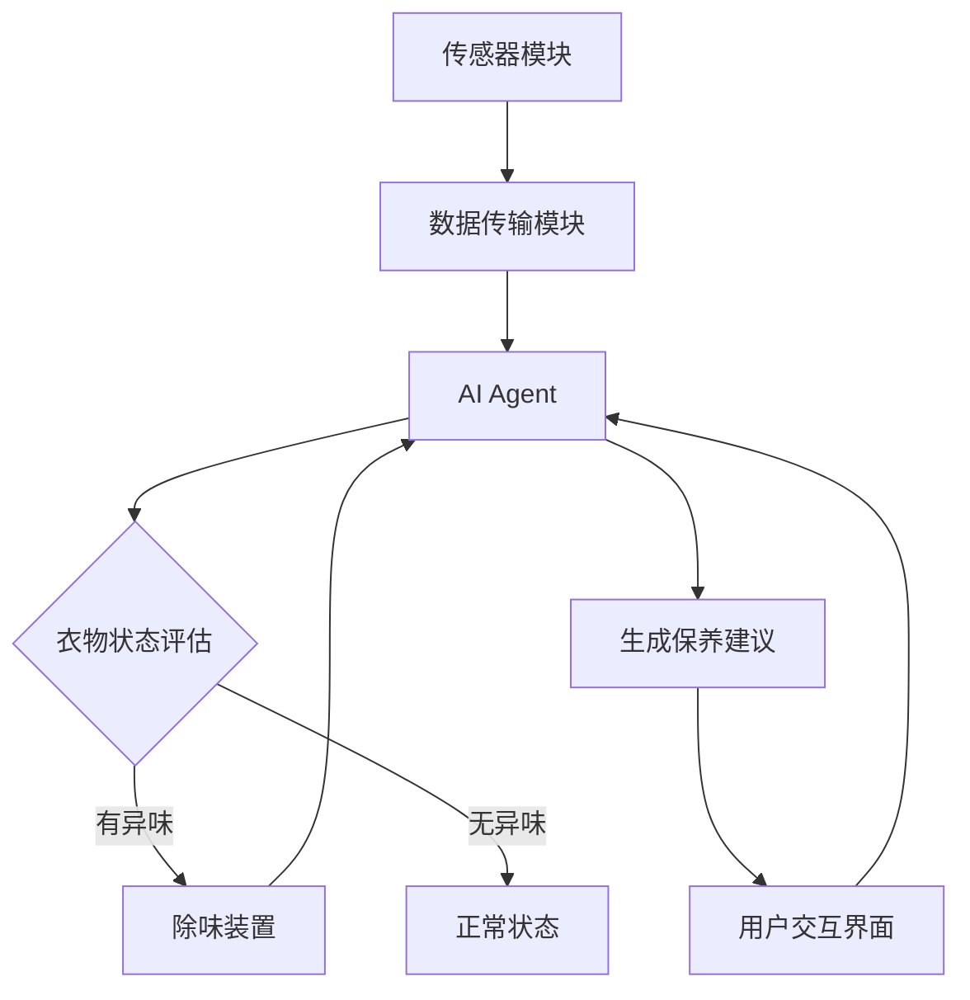

# 智能衣架：AI Agent的衣物除味与保养建议

> 关键词：智能衣架、AI Agent、衣物除味、衣物保养、智能家居

> 摘要：本文围绕智能衣架这一创新智能家居产品展开，深入探讨了其借助AI Agent实现衣物除味与提供保养建议的原理、技术及应用。详细阐述了核心概念、算法原理、数学模型，通过项目实战展示代码实现与解读，介绍了实际应用场景，推荐了相关工具和资源，最后总结了未来发展趋势与挑战，旨在全面剖析智能衣架在衣物护理领域的重要价值和发展潜力。

## 1. 背景介绍 
### 1.1 目的和范围
随着人们生活水平的提高，对衣物护理的要求也日益增加。传统衣架功能单一，仅能满足挂放衣物的基本需求。而智能衣架的出现，融合了先进的AI技术，旨在为用户提供更全面、智能化的衣物护理解决方案，包括衣物除味和专业的保养建议。本文的范围涵盖智能衣架的技术原理、实现方法、实际应用以及未来发展方向等多个方面。

### 1.2 预期读者
本文预期读者包括对智能家居技术感兴趣的普通消费者，希望了解智能衣架工作原理和应用场景；计算机科学、电子工程等相关专业的学生和研究人员，可从中获取技术细节和研究思路；从事智能家居产品开发的工程师和创业者，能借鉴相关技术和实现方案。

### 1.3 文档结构概述
本文首先介绍智能衣架的背景信息，包括目的、预期读者和文档结构。接着阐述核心概念与联系，通过文本示意图和Mermaid流程图展示智能衣架的工作原理和架构。然后详细讲解核心算法原理和具体操作步骤，结合Python源代码进行说明。随后介绍数学模型和公式，并举例说明。通过项目实战展示代码实际案例和详细解释。再探讨实际应用场景，推荐相关工具和资源。最后总结未来发展趋势与挑战，提供常见问题与解答和扩展阅读参考资料。

### 1.4 术语表
#### 1.4.1 核心术语定义
- **智能衣架**：集成了多种传感器和智能控制模块，具备衣物除味、监测衣物状态并提供保养建议等功能的新型衣架。
- **AI Agent**：人工智能代理，是一种能够感知环境、自主决策并采取行动以实现特定目标的智能实体。在智能衣架中，AI Agent通过分析传感器数据，实现衣物除味和保养建议的生成。
- **衣物除味**：通过物理或化学方法去除衣物上的异味。
- **衣物保养**：采取一系列措施保护衣物的质量和外观，延长其使用寿命。

#### 1.4.2 相关概念解释
- **传感器技术**：智能衣架利用多种传感器，如气味传感器、湿度传感器、温度传感器等，实时获取衣物的状态信息。
- **数据分析**：AI Agent对传感器采集的数据进行处理和分析，以识别衣物的异味类型、湿度水平等，为除味和保养提供依据。
- **机器学习算法**：用于训练AI Agent，使其能够根据不同的衣物状态和用户需求，提供准确的除味和保养建议。

#### 1.4.3 缩略词列表
- **AI**：Artificial Intelligence，人工智能
- **IoT**：Internet of Things，物联网

## 2. 核心概念与联系 

### 核心概念原理
智能衣架的核心在于AI Agent与各种传感器的协同工作。传感器负责实时采集衣物的相关信息，如气味、湿度、温度等。AI Agent接收这些数据后，通过数据分析和机器学习算法，对衣物的状态进行评估。根据评估结果，AI Agent会控制相应的除味装置进行除味操作，并根据衣物的材质、使用情况等因素，提供个性化的保养建议。

### 架构的文本示意图
智能衣架的架构主要包括以下几个部分：
1. **传感器模块**：包括气味传感器、湿度传感器、温度传感器等，负责采集衣物的状态信息。
2. **数据传输模块**：将传感器采集的数据传输到AI Agent。
3. **AI Agent**：对数据进行分析和处理，决策除味操作和生成保养建议。
4. **除味装置**：根据AI Agent的指令进行除味操作，如释放除味剂、通风等。
5. **用户交互界面**：用户可以通过手机APP或智能终端查看衣物状态和保养建议，也可以对智能衣架进行控制。

### Mermaid流程图


## 3. 核心算法原理 & 具体操作步骤 

### 核心算法原理
智能衣架的核心算法主要包括气味识别算法、湿度温度分析算法和保养建议生成算法。

#### 气味识别算法
气味识别算法基于机器学习的分类算法，如支持向量机（SVM）或卷积神经网络（CNN）。首先，收集大量不同类型异味的气味数据，并进行标注。然后，使用这些数据训练分类模型。在实际应用中，气味传感器采集到的气味数据输入到训练好的模型中，模型输出异味的类型。

#### 湿度温度分析算法
湿度温度分析算法主要是根据采集到的湿度和温度数据，判断衣物的干燥程度和适宜的保存环境。可以使用简单的阈值判断方法，例如，当湿度超过一定阈值时，认为衣物过于潮湿，需要进行通风干燥处理。

#### 保养建议生成算法
保养建议生成算法根据衣物的材质、使用情况、异味类型等因素，通过规则引擎或机器学习算法生成相应的保养建议。例如，对于丝绸材质的衣物，建议采用轻柔的洗涤方式和低温熨烫。

### 具体操作步骤
#### 步骤1：数据采集
智能衣架的传感器模块实时采集衣物的气味、湿度、温度等数据。

#### 步骤2：数据传输
采集到的数据通过数据传输模块传输到AI Agent。

#### 步骤3：数据预处理
AI Agent对传输过来的数据进行预处理，如去除噪声、归一化等。

#### 步骤4：气味识别
使用训练好的气味识别模型对气味数据进行分类，确定异味的类型。

#### 步骤5：湿度温度分析
根据采集到的湿度和温度数据，判断衣物的干燥程度和保存环境是否适宜。

#### 步骤6：决策除味操作
根据气味识别和湿度温度分析的结果，AI Agent决策是否需要进行除味操作，并控制除味装置进行相应的操作。

#### 步骤7：生成保养建议
根据衣物的材质、使用情况、异味类型等因素，生成个性化的保养建议。

#### 步骤8：用户交互
将衣物状态和保养建议通过用户交互界面展示给用户，用户可以根据需要对智能衣架进行控制。

### Python源代码详细阐述
以下是一个简单的Python示例，模拟智能衣架的部分功能，包括气味识别和保养建议生成：

```python
import numpy as np
from sklearn.svm import SVC

# 模拟气味数据和标签
odor_data = np.array([[1, 2, 3], [4, 5, 6], [7, 8, 9], [10, 11, 12]])
odor_labels = np.array([0, 1, 0, 1])  # 0表示无异味，1表示有异味

# 训练气味识别模型
odor_model = SVC()
odor_model.fit(odor_data, odor_labels)

# 模拟采集到的气味数据
new_odor_data = np.array([[2, 3, 4]])

# 进行气味识别
odor_prediction = odor_model.predict(new_odor_data)

if odor_prediction[0] == 1:
    print("衣物有异味，需要进行除味操作。")
else:
    print("衣物无异味。")

# 模拟衣物材质和使用情况
clothes_material = "丝绸"
usage_condition = "经常穿着"

# 保养建议生成规则
if clothes_material == "丝绸":
    if usage_condition == "经常穿着":
        print("丝绸材质的衣物建议轻柔洗涤，低温熨烫，避免暴晒。")
    else:
        print("丝绸材质的衣物建议定期通风，避免长时间折叠。")
```

## 4. 数学模型和公式 & 详细讲解 & 举例说明 

### 气味识别的数学模型
气味识别通常使用分类模型，以支持向量机（SVM）为例，其数学模型可以表示为：

给定训练数据集 $D = \{(x_1, y_1), (x_2, y_2), \cdots, (x_n, y_n)\}$，其中 $x_i \in \mathbb{R}^d$ 是气味特征向量，$y_i \in \{-1, 1\}$ 是对应的标签。SVM的目标是找到一个超平面 $w^T x + b = 0$，使得不同类别的样本能够被最大间隔地分开。

优化问题可以表示为：

$$
\min_{w, b} \frac{1}{2} \|w\|^2 \quad \text{s.t.} \quad y_i (w^T x_i + b) \geq 1, i = 1, 2, \cdots, n
$$

通过引入拉格朗日乘子 $\alpha_i$，可以将上述问题转化为对偶问题：

$$
\max_{\alpha} \sum_{i=1}^{n} \alpha_i - \frac{1}{2} \sum_{i=1}^{n} \sum_{j=1}^{n} \alpha_i \alpha_j y_i y_j x_i^T x_j \quad \text{s.t.} \quad \sum_{i=1}^{n} \alpha_i y_i = 0, \alpha_i \geq 0, i = 1, 2, \cdots, n
$$

求解对偶问题得到最优的拉格朗日乘子 $\alpha^*$，然后可以计算出最优的 $w^*$ 和 $b^*$。对于新的气味特征向量 $x$，其分类结果可以通过以下公式判断：

$$
\text{sign}(w^{*T} x + b^*)
$$

### 举例说明
假设我们有两个气味样本 $x_1 = [1, 2]$ 和 $x_2 = [3, 4]$，对应的标签 $y_1 = -1$ 和 $y_2 = 1$。我们可以使用SVM来训练一个分类模型，然后对新的气味样本 $x = [2, 3]$ 进行分类。

```python
from sklearn.svm import SVC
import numpy as np

# 训练数据
X = np.array([[1, 2], [3, 4]])
y = np.array([-1, 1])

# 训练SVM模型
model = SVC(kernel='linear')
model.fit(X, y)

# 新的气味样本
new_x = np.array([[2, 3]])

# 进行分类
prediction = model.predict(new_x)
print("分类结果:", prediction)
```

### 湿度温度分析的数学模型
湿度温度分析通常使用阈值判断方法。假设我们设定湿度阈值为 $H_{th}$，温度阈值为 $T_{th}$。当采集到的湿度 $H$ 大于 $H_{th}$ 时，认为衣物过于潮湿；当采集到的温度 $T$ 不在合适的范围 $[T_{min}, T_{max}]$ 内时，认为温度不适宜。

### 举例说明
假设湿度阈值 $H_{th} = 60\%$，温度范围 $[T_{min}, T_{max}] = [20, 30]$。采集到的湿度 $H = 70\%$，温度 $T = 15$。则可以判断衣物过于潮湿，温度不适宜。

```python
H_th = 60
T_min = 20
T_max = 30

H = 70
T = 15

if H > H_th:
    print("衣物过于潮湿，需要通风干燥。")
if T < T_min or T > T_max:
    print("温度不适宜，建议调整环境温度。")
```

## 5. 项目实战：代码实际案例和详细解释说明 

### 5.1  开发环境搭建
#### 硬件环境
- **智能衣架原型**：可以使用3D打印技术制作智能衣架的外壳，集成各种传感器和除味装置。
- **传感器模块**：选择合适的气味传感器、湿度传感器、温度传感器等。
- **控制板**：如Arduino或Raspberry Pi，用于控制传感器和除味装置。
- **通信模块**：如Wi-Fi模块或蓝牙模块，用于数据传输。

#### 软件环境
- **开发语言**：Python、C++等。
- **开发工具**：PyCharm、Arduino IDE等。
- **机器学习库**：Scikit-learn、TensorFlow等。

### 5.2  源代码详细实现和代码解读
以下是一个完整的智能衣架项目的Python代码示例，包括数据采集、气味识别、湿度温度分析和保养建议生成：

```python
import time
import random
from sklearn.svm import SVC

# 模拟传感器数据采集
def collect_sensor_data():
    odor_data = [random.randint(1, 10) for _ in range(3)]  # 气味数据
    humidity = random.randint(30, 80)  # 湿度数据
    temperature = random.randint(10, 40)  # 温度数据
    return odor_data, humidity, temperature

# 气味识别模型训练
odor_data = [[1, 2, 3], [4, 5, 6], [7, 8, 9], [10, 11, 12]]
odor_labels = [0, 1, 0, 1]
odor_model = SVC()
odor_model.fit(odor_data, odor_labels)

# 湿度温度阈值
humidity_threshold = 60
temperature_min = 20
temperature_max = 30

# 衣物材质和使用情况
clothes_material = "丝绸"
usage_condition = "经常穿着"

while True:
    # 数据采集
    odor_data, humidity, temperature = collect_sensor_data()

    # 气味识别
    odor_prediction = odor_model.predict([odor_data])
    if odor_prediction[0] == 1:
        print("衣物有异味，启动除味装置。")
    else:
        print("衣物无异味。")

    # 湿度温度分析
    if humidity > humidity_threshold:
        print("衣物过于潮湿，启动通风装置。")
    if temperature < temperature_min or temperature > temperature_max:
        print("温度不适宜，建议调整环境温度。")

    # 保养建议生成
    if clothes_material == "丝绸":
        if usage_condition == "经常穿着":
            print("丝绸材质的衣物建议轻柔洗涤，低温熨烫，避免暴晒。")
        else:
            print("丝绸材质的衣物建议定期通风，避免长时间折叠。")

    time.sleep(60)  # 每隔60秒采集一次数据
```

### 5.3  代码解读与分析
- **数据采集**：`collect_sensor_data` 函数模拟传感器数据采集，返回气味数据、湿度数据和温度数据。
- **气味识别**：使用训练好的SVM模型对气味数据进行分类，判断衣物是否有异味。
- **湿度温度分析**：根据设定的湿度阈值和温度范围，判断衣物的干燥程度和温度是否适宜。
- **保养建议生成**：根据衣物的材质和使用情况，生成相应的保养建议。
- **循环采集**：使用 `while True` 循环每隔60秒采集一次数据，实现实时监测和控制。

## 6. 实际应用场景 
### 家庭场景
在家庭中，智能衣架可以放置在卧室、衣帽间等地方。用户可以将衣物挂在智能衣架上，智能衣架会实时监测衣物的状态。如果衣物有异味，会自动启动除味装置进行除味；如果衣物过于潮湿，会启动通风装置进行干燥。同时，用户可以通过手机APP查看衣物的状态和保养建议，方便对衣物进行管理和护理。

### 酒店场景
在酒店中，智能衣架可以放置在客房内。客人入住后，可以将衣物挂在智能衣架上，智能衣架会为客人提供衣物除味和保养建议。这不仅可以提高客人的入住体验，还可以延长酒店衣物的使用寿命。

### 洗衣店场景
在洗衣店中，智能衣架可以用于衣物的存放和护理。洗衣店工作人员可以将洗好的衣物挂在智能衣架上，智能衣架会对衣物进行除味和保养，确保衣物在存放过程中保持良好的状态。同时，智能衣架可以为洗衣店提供专业的衣物保养建议，提高洗衣店的服务质量。

## 7. 工具和资源推荐
### 7.1 学习资源推荐
#### 7.1.1 书籍推荐
- 《机器学习》（周志华）：全面介绍了机器学习的基本概念、算法和应用，是学习机器学习的经典教材。
- 《Python数据分析实战》（Sebastian Raschka）：通过实际案例介绍了Python在数据分析中的应用，包括数据处理、可视化和机器学习等方面。
- 《智能家居技术与应用》（XXX）：详细介绍了智能家居的技术原理、系统架构和应用场景，对智能衣架的开发有很好的参考价值。

#### 7.1.2 在线课程
- Coursera上的“机器学习”课程（Andrew Ng）：由斯坦福大学教授Andrew Ng主讲，是全球最受欢迎的机器学习课程之一。
- edX上的“Python for Data Science”课程：介绍了Python在数据科学中的应用，包括数据处理、数据分析和机器学习等方面。
- 中国大学MOOC上的“智能家居系统设计与实践”课程：介绍了智能家居系统的设计原理和实践方法，对智能衣架的开发有很大的帮助。

#### 7.1.3 技术博客和网站
- Medium：一个技术博客平台，有很多关于人工智能、机器学习和智能家居的文章。
- 开源中国：提供了大量的开源项目和技术文章，对智能衣架的开发有很好的参考价值。
- 知乎：一个知识分享平台，有很多关于智能家居和人工智能的讨论和经验分享。

### 7.2 开发工具框架推荐
#### 7.2.1 IDE和编辑器
- PyCharm：一款专门用于Python开发的集成开发环境，提供了丰富的功能和插件，方便代码的编写和调试。
- Arduino IDE：用于Arduino开发的集成开发环境，简单易用，适合初学者。
- Visual Studio Code：一款轻量级的代码编辑器，支持多种编程语言和插件，具有强大的代码编辑和调试功能。

#### 7.2.2 调试和性能分析工具
- GDB：一个强大的调试工具，支持多种编程语言，可用于调试智能衣架的硬件和软件。
- Profiler：Python的性能分析工具，可用于分析代码的性能瓶颈，优化代码效率。
- Wireshark：一个网络协议分析工具，可用于分析智能衣架的数据传输和通信过程。

#### 7.2.3 相关框架和库
- Scikit-learn：一个简单易用的机器学习库，提供了多种机器学习算法和工具，可用于气味识别和数据分类。
- TensorFlow：一个开源的深度学习框架，可用于开发更复杂的人工智能模型，如卷积神经网络。
- Flask：一个轻量级的Python Web框架，可用于开发智能衣架的用户交互界面和数据接口。

### 7.3 相关论文著作推荐
#### 7.3.1 经典论文
- “Support-Vector Networks”（Cortes and Vapnik, 1995）：介绍了支持向量机的基本原理和算法，是机器学习领域的经典论文。
- “ImageNet Classification with Deep Convolutional Neural Networks”（Krizhevsky et al., 2012）：介绍了卷积神经网络在图像分类中的应用，开创了深度学习的新时代。
- “The Future of Home Automation: A Review”（XXX）：对智能家居的发展趋势和未来方向进行了综述，对智能衣架的研究有很好的参考价值。

#### 7.3.2 最新研究成果
- 近年来，关于智能衣架和智能家居的研究成果不断涌现。可以通过IEEE Xplore、ACM Digital Library等学术数据库搜索最新的研究论文。

#### 7.3.3 应用案例分析
- 一些知名企业和研究机构发布了关于智能衣架和智能家居的应用案例分析，可以通过他们的官方网站或技术博客获取相关信息。

## 8. 总结：未来发展趋势与挑战
### 未来发展趋势
- **功能集成化**：未来的智能衣架将集成更多的功能，如衣物折叠、熨烫等，实现一站式的衣物护理服务。
- **个性化定制**：根据用户的个性化需求，智能衣架可以提供更加个性化的衣物除味和保养建议。例如，根据用户的生活习惯、衣物喜好等因素，为用户定制专属的护理方案。
- **与其他智能家居设备的联动**：智能衣架将与其他智能家居设备，如智能空调、智能除湿机等进行联动，实现家居环境的智能调节，为衣物提供更好的保存环境。
- **人工智能技术的深度应用**：随着人工智能技术的不断发展，智能衣架将能够更加准确地识别衣物的材质、异味类型等信息，提供更加精准的除味和保养建议。

### 挑战
- **技术难题**：智能衣架的开发涉及到多种技术，如传感器技术、人工智能技术、通信技术等。如何将这些技术有机地结合起来，实现稳定、可靠的系统运行，是一个挑战。
- **数据安全与隐私**：智能衣架会采集用户的衣物信息和生活习惯等数据，如何保障这些数据的安全和隐私，是一个需要解决的问题。
- **用户接受度**：智能衣架作为一种新型的智能家居产品，用户对其功能和使用方法可能需要一定的时间来接受和适应。如何提高用户的接受度，推广智能衣架的应用，是一个挑战。

## 9. 附录：常见问题与解答
### 问题1：智能衣架的除味效果如何？
智能衣架采用了先进的除味技术，如释放除味剂、通风等，可以有效去除衣物上的异味。但是，除味效果可能会受到异味的类型、浓度等因素的影响。

### 问题2：智能衣架的保养建议准确吗？
智能衣架的保养建议是基于AI Agent对衣物的材质、使用情况等因素进行分析后生成的，具有一定的准确性。但是，由于衣物的实际情况可能会有所不同，保养建议仅供参考。

### 问题3：智能衣架的使用寿命是多久？
智能衣架的使用寿命取决于其硬件质量和使用环境等因素。一般来说，正常使用情况下，智能衣架的使用寿命可以达到3-5年。

### 问题4：智能衣架的安装复杂吗？
智能衣架的安装相对简单，一般用户可以按照说明书进行自行安装。如果用户在安装过程中遇到问题，可以联系厂家的客服人员进行咨询。

## 10. 扩展阅读 & 参考资料
### 扩展阅读
- 《智能家居革命：未来生活的新趋势》
- 《人工智能时代的家居变革》

### 参考资料
- 相关的技术文档和产品说明书
- 学术论文和研究报告
- 行业新闻和资讯网站