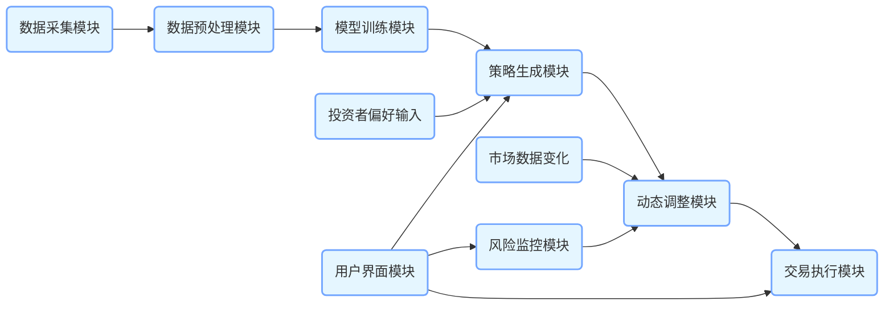

# 智能资产配置策略动态调整系统

> 关键词：智能资产配置、动态调整、投资策略、风险管理、人工智能、金融科技、量化投资

> 摘要：本文围绕智能资产配置策略动态调整系统展开，深入探讨该系统的核心概念、算法原理、数学模型等内容。通过详细的代码实现和案例分析，展示系统在实际应用中的操作流程和效果。同时，介绍相关的工具和资源，为读者提供学习和研究的方向。最后对系统的未来发展趋势与挑战进行总结，旨在为金融投资领域的智能化发展提供理论和实践参考。

## 1. 背景介绍 
### 1.1 目的和范围
智能资产配置策略动态调整系统的主要目的是帮助投资者在复杂多变的金融市场环境中，实现资产的最优配置和风险的有效控制。该系统通过实时监测市场数据、分析资产表现和投资者风险偏好等因素，动态调整资产配置策略，以提高投资收益和降低风险。

本系统的范围涵盖了多种金融资产，包括股票、债券、基金、期货等。同时，系统可以应用于个人投资者、机构投资者以及金融机构的投资组合管理等领域。

### 1.2 预期读者
本文的预期读者包括金融投资领域的从业者，如投资经理、分析师、交易员等；对金融科技和量化投资感兴趣的技术人员，如程序员、数据分析师、算法工程师等；以及希望了解智能资产配置和风险管理知识的普通投资者。

### 1.3 文档结构概述
本文将按照以下结构进行阐述：首先介绍智能资产配置策略动态调整系统的背景信息，包括目的、范围、预期读者和文档结构概述等；接着讲解系统的核心概念与联系，通过文本示意图和 Mermaid 流程图展示系统的原理和架构；然后详细阐述核心算法原理和具体操作步骤，使用 Python 源代码进行说明；再介绍系统所涉及的数学模型和公式，并举例说明；之后通过项目实战，展示代码实际案例和详细解释说明；接着探讨系统的实际应用场景；随后推荐相关的工具和资源；最后对系统的未来发展趋势与挑战进行总结，并提供常见问题与解答以及扩展阅读和参考资料。

### 1.4 术语表
#### 1.4.1 核心术语定义
- **智能资产配置**：利用先进的技术和算法，结合投资者的风险偏好、投资目标等因素，对多种金融资产进行合理分配，以实现资产的最优配置。
- **动态调整**：根据市场变化、资产表现等实时信息，及时对资产配置策略进行调整，以适应不同的市场环境。
- **投资策略**：投资者为实现投资目标而采取的一系列投资决策和操作方法。
- **风险管理**：识别、评估和控制投资过程中可能面临的风险，以降低损失的可能性。
- **量化投资**：利用数学模型和计算机技术，对金融市场数据进行分析和处理，以制定投资策略的一种投资方式。

#### 1.4.2 相关概念解释
- **资产组合理论**：由哈里·马科维茨（Harry Markowitz）提出，该理论认为投资者可以通过分散投资来降低风险，即在一定的风险水平下追求最高的预期收益，或在一定的预期收益水平下追求最低的风险。
- **风险度量指标**：如标准差、夏普比率、最大回撤等，用于衡量投资组合的风险水平。标准差反映了资产收益率的波动程度；夏普比率衡量了投资组合在承担单位风险时所能获得的超过无风险收益的额外收益；最大回撤表示在某一时间段内，投资组合净值从最高点到最低点的最大跌幅。
- **市场有效性**：指市场价格能够及时、准确地反映所有相关信息的程度。在有效市场中，资产价格已经包含了所有已知的信息，投资者很难通过分析历史数据或其他公开信息获得超额收益。

#### 1.4.3 缩略词列表
- **CAPM**：Capital Asset Pricing Model，资本资产定价模型
- **VaR**：Value at Risk，风险价值
- **ETF**：Exchange - Traded Fund，交易型开放式指数基金
- **AI**：Artificial Intelligence，人工智能
- **ML**：Machine Learning，机器学习

## 2. 核心概念与联系 

### 核心概念原理
智能资产配置策略动态调整系统的核心原理是基于现代投资理论和人工智能技术，通过对市场数据、资产信息和投资者偏好的分析，制定合理的资产配置策略，并根据市场变化实时调整策略。

系统首先收集和整理各种金融数据，包括资产价格、收益率、宏观经济指标等。然后，利用机器学习算法对这些数据进行分析和建模，以预测资产的未来表现和市场趋势。同时，系统考虑投资者的风险偏好和投资目标，如预期收益率、风险承受能力等，为投资者量身定制资产配置方案。

在市场运行过程中，系统实时监测市场数据的变化，当市场条件发生重大变化或资产表现偏离预期时，系统会自动触发调整机制，对资产配置策略进行动态调整，以确保投资组合始终处于最优状态。

### 架构的文本示意图
智能资产配置策略动态调整系统主要由以下几个部分组成：

1. **数据采集模块**：负责收集各种金融数据，包括股票、债券、基金等资产的价格、交易量、财务报表等信息，以及宏观经济数据、政策信息等。数据来源可以包括金融数据提供商、交易所、新闻媒体等。
2. **数据预处理模块**：对采集到的数据进行清洗、整理和转换，去除噪声和缺失值，统一数据格式，为后续的分析和建模提供高质量的数据。
3. **模型训练模块**：利用机器学习和深度学习算法，对预处理后的数据进行训练，建立资产预测模型和风险评估模型。常见的算法包括线性回归、逻辑回归、决策树、随机森林、神经网络等。
4. **策略生成模块**：根据投资者的风险偏好和投资目标，结合模型训练的结果，生成初始的资产配置策略。策略可以包括资产的种类、权重、买卖时机等。
5. **动态调整模块**：实时监测市场数据的变化，当市场条件发生重大变化或资产表现偏离预期时，利用风险评估模型和优化算法对资产配置策略进行动态调整。
6. **交易执行模块**：根据调整后的资产配置策略，自动执行交易指令，实现资产的买卖操作。
7. **风险监控模块**：对投资组合的风险进行实时监控，计算各种风险度量指标，如 VaR、标准差等，当风险超过设定的阈值时，及时发出预警信号。
8. **用户界面模块**：为投资者提供一个直观、便捷的操作界面，投资者可以在界面上输入自己的风险偏好和投资目标，查看资产配置策略和投资组合的实时表现，进行交易操作等。

### Mermaid 流程图


## 3. 核心算法原理 & 具体操作步骤 

### 核心算法原理
智能资产配置策略动态调整系统中常用的核心算法包括均值 - 方差优化算法、风险平价算法、机器学习预测算法等。下面以均值 - 方差优化算法为例进行详细介绍。

均值 - 方差优化算法是由哈里·马科维茨（Harry Markowitz）提出的一种资产配置方法，其核心思想是在一定的预期收益水平下，通过优化资产的权重，使投资组合的风险（方差）最小化；或者在一定的风险水平下，使投资组合的预期收益最大化。

设投资组合中包含 $n$ 种资产，其权重向量为 $\mathbf{w} = [w_1, w_2, \cdots, w_n]^T$，其中 $\sum_{i = 1}^{n} w_i = 1$，$w_i \geq 0$。资产的预期收益率向量为 $\mathbf{\mu} = [\mu_1, \mu_2, \cdots, \mu_n]^T$，资产收益率的协方差矩阵为 $\mathbf{\Sigma}$。

投资组合的预期收益率 $E(R_p)$ 和方差 $\sigma_p^2$ 分别为：

$E(R_p)=\mathbf{w}^T\mathbf{\mu}$

$\sigma_p^2=\mathbf{w}^T\mathbf{\Sigma}\mathbf{w}$

均值 - 方差优化问题可以表示为以下两种形式：

1. **最小方差问题**：在给定预期收益率 $E(R_p)^*$ 的条件下，求解使投资组合方差最小的权重向量 $\mathbf{w}$，即

$\min_{\mathbf{w}} \mathbf{w}^T\mathbf{\Sigma}\mathbf{w}$

s.t. $\mathbf{w}^T\mathbf{\mu}=E(R_p)^*$

$\sum_{i = 1}^{n} w_i = 1$

$w_i \geq 0, i = 1, 2, \cdots, n$

2. **最大预期收益问题**：在给定投资组合方差 $\sigma_p^{*2}$ 的条件下，求解使投资组合预期收益率最大的权重向量 $\mathbf{w}$，即

$\max_{\mathbf{w}} \mathbf{w}^T\mathbf{\mu}$

s.t. $\mathbf{w}^T\mathbf{\Sigma}\mathbf{w}=\sigma_p^{*2}$

$\sum_{i = 1}^{n} w_i = 1$

$w_i \geq 0, i = 1, 2, \cdots, n$

### 具体操作步骤
以下是使用 Python 实现均值 - 方差优化算法的具体操作步骤和代码示例：

```python
import numpy as np
from scipy.optimize import minimize

# 定义资产的预期收益率和协方差矩阵
mu = np.array([0.1, 0.15, 0.2])  # 预期收益率向量
Sigma = np.array([[0.04, 0.02, 0.01],
                  [0.02, 0.09, 0.03],
                  [0.01, 0.03, 0.16]])  # 协方差矩阵

# 定义目标函数：最小方差
def portfolio_variance(w, Sigma):
    return np.dot(np.dot(w, Sigma), w)

# 定义约束条件
def weight_constraint(w):
    return np.sum(w) - 1

# 定义边界条件
bounds = [(0, None) for _ in range(len(mu))]

# 初始权重猜测
initial_guess = np.ones(len(mu)) / len(mu)

# 给定预期收益率
target_return = 0.15

# 定义预期收益率约束条件
def return_constraint(w, mu, target_return):
    return np.dot(w, mu) - target_return

# 定义约束列表
constraints = [{'type': 'eq', 'fun': weight_constraint},
               {'type': 'eq', 'fun': return_constraint, 'args': (mu, target_return)}]

# 求解最小方差问题
result = minimize(portfolio_variance, initial_guess, args=(Sigma,),
                  method='SLSQP', bounds=bounds, constraints=constraints)

# 输出最优权重
optimal_weights = result.x
print("最优权重:", optimal_weights)
```

在上述代码中，首先定义了资产的预期收益率向量 $\mathbf{\mu}$ 和协方差矩阵 $\mathbf{\Sigma}$。然后定义了目标函数 `portfolio_variance` 用于计算投资组合的方差。接着定义了约束条件，包括权重之和等于 1 和预期收益率等于目标收益率。最后使用 `scipy.optimize.minimize` 函数求解最小方差问题，得到最优的资产权重。

## 4. 数学模型和公式 & 详细讲解 & 举例说明 

### 均值 - 方差优化模型
如前面所述，均值 - 方差优化模型的核心公式为投资组合的预期收益率 $E(R_p)$ 和方差 $\sigma_p^2$：

$E(R_p)=\mathbf{w}^T\mathbf{\mu}$

$\sigma_p^2=\mathbf{w}^T\mathbf{\Sigma}\mathbf{w}$

其中，$\mathbf{w}$ 是资产的权重向量，$\mathbf{\mu}$ 是资产的预期收益率向量，$\mathbf{\Sigma}$ 是资产收益率的协方差矩阵。

### 详细讲解
- **预期收益率**：投资组合的预期收益率是各资产预期收益率的加权平均值，权重为各资产在投资组合中的比例。预期收益率反映了投资组合的平均收益水平。
- **方差**：投资组合的方差衡量了投资组合收益率的波动程度，即风险水平。方差越大，说明投资组合的收益率波动越大，风险越高；方差越小，说明投资组合的收益率波动越小，风险越低。

### 举例说明
假设有两种资产 A 和 B，资产 A 的预期收益率为 10%，资产 B 的预期收益率为 15%。资产 A 和 B 的收益率协方差矩阵为：

$\mathbf{\Sigma}=\begin{bmatrix}0.04 & 0.02\\0.02 & 0.09\end{bmatrix}$

现在我们要构建一个投资组合，使得在预期收益率为 12% 的条件下，投资组合的方差最小。

设资产 A 的权重为 $w_1$，资产 B 的权重为 $w_2$，则有 $w_2 = 1 - w_1$。

投资组合的预期收益率为：

$E(R_p)=w_1\times0.1 + w_2\times0.15=w_1\times0.1+(1 - w_1)\times0.15=0.15 - 0.05w_1$

令 $E(R_p)=0.12$，则 $0.15 - 0.05w_1 = 0.12$，解得 $w_1 = 0.6$，$w_2 = 0.4$。

投资组合的方差为：

$\sigma_p^2=\begin{bmatrix}w_1 & w_2\end{bmatrix}\begin{bmatrix}0.04 & 0.02\\0.02 & 0.09\end{bmatrix}\begin{bmatrix}w_1\\w_2\end{bmatrix}$

将 $w_1 = 0.6$，$w_2 = 0.4$ 代入上式，可得：

$\sigma_p^2=\begin{bmatrix}0.6 & 0.4\end{bmatrix}\begin{bmatrix}0.04 & 0.02\\0.02 & 0.09\end{bmatrix}\begin{bmatrix}0.6\\0.4\end{bmatrix}$

$=0.6\times(0.04\times0.6 + 0.02\times0.4)+0.4\times(0.02\times0.6 + 0.09\times0.4)$

$=0.6\times(0.024 + 0.008)+0.4\times(0.012 + 0.036)$

$=0.6\times0.032+0.4\times0.048$

$=0.0192 + 0.0192$

$=0.0384$

通过上述例子可以看出，均值 - 方差优化模型可以帮助我们在给定预期收益率的条件下，找到使投资组合方差最小的资产权重，从而实现风险的有效控制。

### 风险平价模型
风险平价模型的核心思想是使各资产对投资组合风险的贡献相等。设投资组合中包含 $n$ 种资产，资产 $i$ 的风险贡献 $RC_i$ 定义为：

$RC_i = w_i\frac{\partial\sigma_p}{\partial w_i}$

其中，$\sigma_p$ 是投资组合的标准差。

风险平价模型的目标是求解权重向量 $\mathbf{w}$，使得 $RC_1 = RC_2 = \cdots = RC_n$。

### 详细讲解
风险平价模型不依赖于资产的预期收益率，而是关注资产的风险贡献。通过使各资产的风险贡献相等，可以实现投资组合的风险分散化，降低单一资产对投资组合风险的影响。

### 举例说明
假设有三种资产 A、B、C，其收益率的协方差矩阵为：

$\mathbf{\Sigma}=\begin{bmatrix}0.04 & 0.02 & 0.01\\0.02 & 0.09 & 0.03\\0.01 & 0.03 & 0.16\end{bmatrix}$

使用 Python 实现风险平价模型的代码如下：

```python
import numpy as np
from scipy.optimize import minimize

# 定义协方差矩阵
Sigma = np.array([[0.04, 0.02, 0.01],
                  [0.02, 0.09, 0.03],
                  [0.01, 0.03, 0.16]])

# 定义目标函数：各资产风险贡献的平方和
def risk_parity_objective(w, Sigma):
    portfolio_volatility = np.sqrt(np.dot(np.dot(w, Sigma), w))
    marginal_risks = np.dot(Sigma, w) / portfolio_volatility
    risk_contributions = w * marginal_risks
    risk_contribution_differences = risk_contributions - np.mean(risk_contributions)
    return np.sum(risk_contribution_differences ** 2)

# 定义约束条件
def weight_constraint(w):
    return np.sum(w) - 1

# 定义边界条件
bounds = [(0, None) for _ in range(len(Sigma))]

# 初始权重猜测
initial_guess = np.ones(len(Sigma)) / len(Sigma)

# 求解风险平价问题
result = minimize(risk_parity_objective, initial_guess, args=(Sigma,),
                  method='SLSQP', bounds=bounds, constraints=[{'type': 'eq', 'fun': weight_constraint}])

# 输出最优权重
optimal_weights = result.x
print("风险平价最优权重:", optimal_weights)
```

在上述代码中，首先定义了协方差矩阵 $\mathbf{\Sigma}$。然后定义了目标函数 `risk_parity_objective`，用于计算各资产风险贡献的平方和。接着定义了约束条件，即权重之和等于 1。最后使用 `scipy.optimize.minimize` 函数求解风险平价问题，得到最优的资产权重。

## 5. 项目实战：代码实际案例和详细解释说明 

### 5.1  开发环境搭建
- **Python 环境**：建议使用 Python 3.7 及以上版本。可以从 Python 官方网站（https://www.python.org/downloads/） 下载并安装。
- **开发工具**：推荐使用 PyCharm 或 Jupyter Notebook 作为开发工具。PyCharm 是一款功能强大的 Python 集成开发环境，提供了代码编辑、调试、版本控制等丰富的功能；Jupyter Notebook 是一个交互式的开发环境，适合进行数据分析和模型实验。
- **第三方库**：需要安装以下第三方库：
    - `numpy`：用于数值计算和矩阵运算。
    - `pandas`：用于数据处理和分析。
    - `scipy`：用于科学计算和优化算法。
    - `matplotlib`：用于数据可视化。
    - `yfinance`：用于获取金融数据。

可以使用以下命令安装这些库：

```sh
pip install numpy pandas scipy matplotlib yfinance
```

### 5.2  源代码详细实现和代码解读
以下是一个完整的智能资产配置策略动态调整系统的代码示例，包括数据获取、数据预处理、均值 - 方差优化、动态调整等步骤：

```python
import yfinance as yf
import numpy as np
import pandas as pd
from scipy.optimize import minimize
import matplotlib.pyplot as plt

# 定义资产列表
assets = ['AAPL', 'MSFT', 'GOOG', 'AMZN', 'TSLA']

# 获取数据
start_date = '2020-01-01'
end_date = '2023-01-01'
data = yf.download(assets, start=start_date, end=end_date)['AdjClose']

# 计算收益率
returns = data.pct_change().dropna()

# 计算预期收益率和协方差矩阵
mu = returns.mean() * 252  # 年化预期收益率
Sigma = returns.cov() * 252  # 年化协方差矩阵

# 定义目标函数：最小方差
def portfolio_variance(w, Sigma):
    return np.dot(np.dot(w, Sigma), w)

# 定义约束条件
def weight_constraint(w):
    return np.sum(w) - 1

# 定义边界条件
bounds = [(0, None) for _ in range(len(mu))]

# 初始权重猜测
initial_guess = np.ones(len(mu)) / len(mu)

# 给定预期收益率
target_return = 0.2

# 定义预期收益率约束条件
def return_constraint(w, mu, target_return):
    return np.dot(w, mu) - target_return

# 定义约束列表
constraints = [{'type': 'eq', 'fun': weight_constraint},
               {'type': 'eq', 'fun': return_constraint, 'args': (mu, target_return)}]

# 求解最小方差问题
result = minimize(portfolio_variance, initial_guess, args=(Sigma,),
                  method='SLSQP', bounds=bounds, constraints=constraints)

# 输出最优权重
optimal_weights = result.x
print("最优权重:", optimal_weights)

# 动态调整策略
# 假设每个月进行一次调整
adjustment_period = 21  # 一个月大约 21 个交易日
portfolio_values = []
weights = optimal_weights
portfolio_value = 100000  # 初始投资金额

for i in range(0, len(returns), adjustment_period):
    # 计算当前投资组合的价值
    current_returns = returns.iloc[i:i + adjustment_period]
    portfolio_return = np.dot(current_returns, weights).sum()
    portfolio_value *= (1 + portfolio_return)
    portfolio_values.append(portfolio_value)

    # 更新预期收益率和协方差矩阵
    recent_returns = returns.iloc[:i + adjustment_period]
    mu = recent_returns.mean() * 252
    Sigma = recent_returns.cov() * 252

    # 重新求解最小方差问题
    result = minimize(portfolio_variance, weights, args=(Sigma,),
                      method='SLSQP', bounds=bounds, constraints=constraints)
    weights = result.x

# 绘制投资组合价值曲线
plt.plot(portfolio_values)
plt.xlabel('调整次数')
plt.ylabel('投资组合价值')
plt.title('智能资产配置策略动态调整系统')
plt.show()
```

### 5.3  代码解读与分析
- **数据获取**：使用 `yfinance` 库从雅虎财经获取指定资产的历史收盘价数据。
- **数据预处理**：计算资产的收益率，并去除缺失值。然后计算年化预期收益率和年化协方差矩阵。
- **均值 - 方差优化**：定义目标函数 `portfolio_variance` 用于计算投资组合的方差，定义约束条件包括权重之和等于 1 和预期收益率等于目标收益率。使用 `scipy.optimize.minimize` 函数求解最小方差问题，得到最优的资产权重。
- **动态调整**：假设每个月进行一次调整，在每次调整时，计算当前投资组合的价值，更新预期收益率和协方差矩阵，然后重新求解最小方差问题，得到新的资产权重。
- **可视化**：使用 `matplotlib` 库绘制投资组合价值随调整次数的变化曲线，直观展示动态调整策略的效果。

## 6. 实际应用场景 
### 个人投资者
对于个人投资者来说，智能资产配置策略动态调整系统可以帮助他们根据自己的风险偏好和投资目标，合理配置资产，实现资产的保值增值。例如，年轻的投资者可能风险承受能力较高，更倾向于投资股票等风险资产，以获取较高的预期收益；而临近退休的投资者可能风险承受能力较低，更倾向于投资债券等稳健资产，以保障资产的安全性。系统可以根据投资者的情况，实时调整资产配置策略，适应市场变化。

### 机构投资者
机构投资者如基金公司、保险公司等，管理着大量的资金，需要进行有效的资产配置和风险管理。智能资产配置策略动态调整系统可以帮助机构投资者优化投资组合，降低风险，提高投资收益。例如，基金公司可以使用系统对不同类型的基金进行资产配置，根据市场情况动态调整基金的投资组合，以满足投资者的需求。

### 金融机构
银行、证券公司等金融机构可以将智能资产配置策略动态调整系统应用于客户服务中，为客户提供个性化的投资建议和资产配置方案。例如，银行可以根据客户的资产状况、风险偏好等信息，使用系统为客户制定专属的理财计划，并实时跟踪和调整投资组合，提高客户的满意度和忠诚度。

## 7. 工具和资源推荐
### 7.1 学习资源推荐
#### 7.1.1 书籍推荐
- 《投资学》（原书第 10 版），滋维·博迪（Zvi Bodie）等著，本书是投资学领域的经典教材，全面介绍了投资学的基本理论和方法，包括资产组合理论、资本资产定价模型、有效市场假说等。
- 《量化投资：策略与技术》，丁鹏著，本书详细介绍了量化投资的基本概念、策略和技术，包括数据获取、数据处理、模型构建、策略回测等内容，适合对量化投资感兴趣的读者阅读。
- 《Python 金融数据分析实战》，里查德·伯恩斯坦（Richard Bernstein）著，本书通过大量的实际案例，介绍了如何使用 Python 进行金融数据分析和建模，包括数据获取、数据清洗、统计分析、机器学习等内容。

#### 7.1.2 在线课程
- Coursera 上的 “Financial Markets” 课程，由耶鲁大学的罗伯特·席勒（Robert Shiller）教授授课，该课程介绍了金融市场的基本原理和运行机制，包括股票市场、债券市场、衍生品市场等。
- edX 上的 “Introduction to Computational Finance and Financial Econometrics” 课程，由哥伦比亚大学的教授授课，该课程介绍了计算金融和金融计量学的基本方法和技术，包括时间序列分析、风险管理、期权定价等。
- 中国大学 MOOC 上的 “金融大数据分析与应用” 课程，由对外经济贸易大学的教授授课，该课程介绍了金融大数据的基本概念、分析方法和应用案例，包括数据挖掘、机器学习、深度学习等在金融领域的应用。

#### 7.1.3 技术博客和网站
- Seeking Alpha（https://seekingalpha.com/）：提供股票、基金、债券等金融资产的分析和评论，以及市场动态和投资策略等信息。
- QuantNet（https://www.quantnet.com/）：量化投资领域的专业论坛，提供量化投资的技术文章、算法实现、案例分析等内容。
- Towards Data Science（https://towardsdatascience.com/）：数据科学领域的技术博客，提供机器学习、深度学习、数据分析等方面的技术文章和案例。

### 7.2 开发工具框架推荐
#### 7.2.1 IDE和编辑器
- PyCharm：功能强大的 Python 集成开发环境，提供代码编辑、调试、版本控制等丰富的功能，适合开发大型的 Python 项目。
- Jupyter Notebook：交互式的开发环境，适合进行数据分析和模型实验，可以实时查看代码的运行结果和可视化图表。
- Visual Studio Code：轻量级的代码编辑器，支持多种编程语言和插件，具有丰富的扩展功能，适合快速开发和调试代码。

#### 7.2.2 调试和性能分析工具
- PDB：Python 自带的调试工具，可以在代码中设置断点，逐步执行代码，查看变量的值和程序的执行流程。
- cProfile：Python 自带的性能分析工具，可以分析代码的执行时间和函数调用次数，帮助优化代码性能。
- Py-Spy：一个轻量级的 Python 性能分析工具，可以实时分析 Python 程序的性能，查看函数的调用栈和执行时间。

#### 7.2.3 相关框架和库
- NumPy：用于数值计算和矩阵运算的 Python 库，提供了高效的数组对象和各种数学函数。
- Pandas：用于数据处理和分析的 Python 库，提供了 DataFrame 和 Series 等数据结构，方便进行数据的读取、清洗、转换和分析。
- Scikit-learn：用于机器学习的 Python 库，提供了各种机器学习算法和工具，包括分类、回归、聚类、降维等。
- TensorFlow 和 PyTorch：深度学习框架，用于构建和训练神经网络模型，在图像识别、自然语言处理、金融预测等领域有广泛的应用。

### 7.3 相关论文著作推荐
#### 7.3.1 经典论文
- Markowitz, H. M. (1952). Portfolio Selection. The Journal of Finance, 7(1), 77 - 91. 这篇论文提出了均值 - 方差优化模型，开创了现代投资组合理论的先河。
- Sharpe, W. F. (1964). Capital Asset Prices: A Theory of Market Equilibrium under Conditions of Risk. The Journal of Finance, 19(3), 425 - 442. 这篇论文提出了资本资产定价模型（CAPM），为资产定价和风险管理提供了重要的理论基础。
- Fama, E. F., & French, K. R. (1992). The Cross - Section of Expected Stock Returns. The Journal of Finance, 47(2), 427 - 465. 这篇论文提出了 Fama - French 三因子模型，对股票收益率的横截面差异进行了解释。

#### 7.3.2 最新研究成果
- Feng, Y., & Giglio, S. (2021). The Risk - Return Trade - Off in the Cross - Section of Stocks. The Review of Financial Studies, 34(8), 3679 - 3720. 该论文研究了股票横截面的风险 - 收益权衡关系，提出了新的风险度量指标和投资策略。
- Cochrane, J. H. (2022). Presidential Address: The Dog that Did Not Bark: A Defense of Return Predictability. The Journal of Finance, 77(4), 1987 - 2032. 该论文对股票收益率的可预测性进行了深入探讨，提出了新的理论和实证证据。

#### 7.3.3 应用案例分析
- Ang, A., & Bekaert, G. (2002). International Asset Allocation with Regime Shifts. Review of Financial Studies, 15(4), 1137 - 1187. 该论文研究了在制度转换条件下的国际资产配置问题，通过实证分析展示了制度转换对资产配置策略的影响。
- DeMiguel, V., Garlappi, L., & Uppal, R. (2009). Optimal Versus Naive Diversification: How Inefficient is the 1/N Portfolio Strategy? The Review of Financial Studies, 22(5), 1915 - 1953. 该论文比较了最优资产配置策略和简单分散化策略（1/N 策略）的效率，通过实证分析发现 1/N 策略在某些情况下表现出较好的性能。

## 8. 总结：未来发展趋势与挑战
### 未来发展趋势
- **人工智能和机器学习的深度应用**：未来，智能资产配置策略动态调整系统将更加广泛地应用人工智能和机器学习技术，如深度学习、强化学习等。这些技术可以帮助系统更好地处理复杂的金融数据，挖掘数据中的潜在信息，提高资产预测和策略优化的准确性。
- **多资产类别和全球市场的覆盖**：随着金融市场的全球化和金融产品的不断创新，系统将覆盖更多的资产类别和全球市场，如大宗商品、数字货币、新兴市场股票等。这将为投资者提供更丰富的投资选择，实现更广泛的资产配置和风险分散。
- **个性化和定制化服务**：系统将更加注重投资者的个性化需求，根据投资者的年龄、收入、风险偏好、投资目标等因素，为投资者提供定制化的资产配置方案和投资建议。同时，系统将提供更加友好和便捷的用户界面，方便投资者进行操作和管理。
- **与区块链技术的结合**：区块链技术具有去中心化、不可篡改、透明等特点，可以为智能资产配置策略动态调整系统提供更安全、高效的交易环境。例如，区块链可以用于资产登记、交易结算、风险管理等方面，提高系统的可信度和运行效率。

### 挑战
- **数据质量和数据安全**：智能资产配置策略动态调整系统依赖于大量的金融数据，数据的质量和准确性直接影响系统的性能和决策结果。同时，金融数据涉及投资者的隐私和利益，数据安全至关重要。因此，如何保证数据的质量和安全是系统面临的重要挑战。
- **模型的准确性和可靠性**：系统中使用的各种模型，如资产预测模型、风险评估模型等，其准确性和可靠性直接影响资产配置策略的有效性。由于金融市场的复杂性和不确定性，模型可能存在误差和局限性，如何提高模型的准确性和可靠性是系统需要解决的关键问题。
- **法律法规和监管要求**：金融行业受到严格的法律法规和监管要求的约束，智能资产配置策略动态调整系统的开发和应用需要遵守相关的法律法规和监管要求。例如，系统需要保证投资者的知情权、选择权和公平交易权，防止内幕交易、操纵市场等违法行为。
- **市场变化和不确定性**：金融市场是复杂多变的，受到宏观经济、政策、政治、社会等多种因素的影响。系统需要及时响应市场变化，调整资产配置策略，但市场的不确定性增加了系统决策的难度和风险。如何在不确定的市场环境中实现资产的稳定增值是系统面临的重大挑战。

## 9. 附录：常见问题与解答
### 1. 智能资产配置策略动态调整系统的准确性如何保证？
系统的准确性主要通过以下几个方面来保证：
- **数据质量**：对采集到的数据进行严格的清洗、整理和验证，去除噪声和错误数据，确保数据的准确性和完整性。
- **模型选择和优化**：选择合适的模型，并对模型进行优化和调参，提高模型的准确性和泛化能力。同时，使用历史数据对模型进行回测和验证，评估模型的性能。
- **实时监测和调整**：实时监测市场数据的变化，当市场条件发生重大变化或资产表现偏离预期时，及时调整资产配置策略，确保系统的适应性和准确性。

### 2. 系统如何考虑投资者的风险偏好？
系统在制定资产配置策略时，会充分考虑投资者的风险偏好。投资者可以在用户界面上输入自己的风险偏好信息，如风险承受能力、预期收益率等。系统根据这些信息，结合资产的风险特征和预期收益，使用优化算法生成适合投资者风险偏好的资产配置方案。同时，在动态调整过程中，系统也会根据投资者的风险偏好进行相应的调整，确保投资组合的风险水平始终在投资者可承受的范围内。

### 3. 系统的交易执行是自动的吗？
系统的交易执行可以是自动的，也可以是手动的。在自动模式下，系统根据调整后的资产配置策略，自动生成交易指令，并通过交易接口发送到交易平台进行执行。在手动模式下，系统会生成交易建议，投资者可以根据自己的判断决定是否执行交易。无论采用哪种模式，系统都会提供详细的交易信息和风险提示，帮助投资者做出合理的决策。

### 4. 系统的运行成本高吗？
系统的运行成本主要包括数据获取成本、计算资源成本、开发和维护成本等。数据获取成本取决于数据来源和数据量的大小，可以选择合适的数据提供商和数据采集方式来降低成本。计算资源成本可以通过优化算法和模型，提高计算效率，减少计算资源的消耗。开发和维护成本取决于系统的复杂度和功能需求，可以采用开源技术和模块化设计来降低开发和维护成本。总体来说，随着技术的不断进步和成本的不断降低，系统的运行成本会逐渐降低。

## 10. 扩展阅读 & 参考资料
### 扩展阅读
- 《聪明的投资者》，本杰明·格雷厄姆（Benjamin Graham）著，本书是价值投资领域的经典著作，介绍了价值投资的基本理念和方法，对投资者具有重要的指导意义。
- 《金融炼金术》，乔治·索罗斯（George Soros）著，本书介绍了索罗斯的投资哲学和投资方法，包括反身性理论、市场均衡理论等，对理解金融市场的运行机制和投资策略具有重要的启示作用。
- 《黑天鹅：如何应对不可预知的未来》，纳西姆·尼古拉斯·塔勒布（Nassim Nicholas Taleb）著，本书介绍了黑天鹅事件的概念和特点，以及如何应对黑天鹅事件带来的风险和机遇，对投资者的风险管理具有重要的参考价值。

### 参考资料
- 雅虎财经（https://finance.yahoo.com/）：提供股票、基金、债券等金融资产的历史数据和实时行情信息。
- 万得资讯（https://www.wind.com.cn/）：国内专业的金融数据提供商，提供丰富的金融数据和分析工具。
- 中国金融期货交易所（https://www.cffex.com.cn/）：提供金融期货的交易信息和市场数据。
- 美国证券交易委员会（https://www.sec.gov/）：提供美国证券市场的监管信息和上市公司的财务报告等资料。