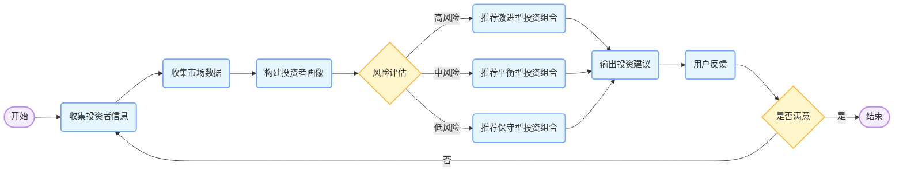

# 智能金融顾问系统的设计与实现

> 关键词：智能金融顾问系统、人工智能、金融服务、算法原理、项目实战

> 摘要：本文围绕智能金融顾问系统的设计与实现展开，深入探讨了其背景、核心概念、算法原理、数学模型等多方面内容。首先介绍了智能金融顾问系统的目的、预期读者、文档结构和相关术语，为后续内容奠定基础。接着详细阐述了核心概念及其联系，通过文本示意图和 Mermaid 流程图进行直观展示。在算法原理部分，使用 Python 源代码详细讲解具体算法。数学模型和公式部分进行了理论推导和举例说明。项目实战部分包括开发环境搭建、源代码实现与解读。同时探讨了实际应用场景，推荐了学习资源、开发工具框架和相关论文著作。最后总结了未来发展趋势与挑战，并提供常见问题解答和参考资料，旨在为智能金融顾问系统的研究和开发提供全面且深入的指导。

## 1. 背景介绍 
### 1.1 目的和范围
智能金融顾问系统的出现是金融科技领域的重要创新，其目的在于利用先进的信息技术和人工智能算法，为投资者提供个性化、智能化的金融投资建议和服务。传统的金融顾问服务往往存在成本高、覆盖范围有限等问题，而智能金融顾问系统可以通过自动化的方式，快速、准确地分析投资者的风险偏好、财务状况等信息，为其量身定制投资组合，降低服务成本，提高服务效率和质量。

本文章的范围主要涵盖智能金融顾问系统的设计理念、核心算法、数学模型、实际开发与应用等方面，旨在全面介绍该系统从理论到实践的整个过程，为相关领域的研究人员、开发者和从业者提供有价值的参考。

### 1.2 预期读者
本文的预期读者包括但不限于以下几类人群：
1. **金融从业者**：如银行理财经理、投资顾问等，他们可以通过了解智能金融顾问系统的原理和实现方式，更好地利用该系统为客户提供服务，提升自身的专业水平和服务质量。
2. **信息技术开发者**：包括软件工程师、数据科学家等，他们对智能金融顾问系统的技术实现细节感兴趣，希望通过本文学习相关的算法、模型和开发技巧，应用到实际项目中。
3. **研究人员**：从事金融科技、人工智能等领域研究的学者和科研人员，他们可以从本文中获取智能金融顾问系统的最新研究成果和发展趋势，为进一步的学术研究提供参考。
4. **投资者**：普通投资者可以通过了解智能金融顾问系统的工作原理和优势，更好地理解投资建议的来源和依据，从而做出更明智的投资决策。

### 1.3 文档结构概述
本文的文档结构主要包括以下几个部分：
1. **背景介绍**：介绍智能金融顾问系统的目的、预期读者、文档结构和相关术语，为后续内容的展开奠定基础。
2. **核心概念与联系**：详细阐述智能金融顾问系统的核心概念，如风险评估、投资组合优化等，并通过文本示意图和 Mermaid 流程图展示这些概念之间的联系。
3. **核心算法原理 & 具体操作步骤**：使用 Python 源代码详细讲解智能金融顾问系统中涉及的核心算法，如机器学习算法、优化算法等，并说明具体的操作步骤。
4. **数学模型和公式 & 详细讲解 & 举例说明**：介绍智能金融顾问系统中使用的数学模型和公式，如马科维茨均值 - 方差模型等，并进行详细的理论推导和举例说明。
5. **项目实战：代码实际案例和详细解释说明**：包括开发环境搭建、源代码实现与解读，通过实际项目案例展示智能金融顾问系统的开发过程和实现细节。
6. **实际应用场景**：探讨智能金融顾问系统在不同金融场景中的应用，如银行理财、证券投资等。
7. **工具和资源推荐**：推荐学习智能金融顾问系统相关的书籍、在线课程、技术博客和网站，以及开发工具框架和相关论文著作。
8. **总结：未来发展趋势与挑战**：总结智能金融顾问系统的发展现状，分析未来的发展趋势和面临的挑战。
9. **附录：常见问题与解答**：提供关于智能金融顾问系统常见问题的解答，帮助读者更好地理解和应用相关知识。
10. **扩展阅读 & 参考资料**：列出与智能金融顾问系统相关的扩展阅读材料和参考资料，方便读者进一步深入学习。

### 1.4 术语表
#### 1.4.1 核心术语定义
1. **智能金融顾问系统**：一种利用人工智能技术和金融知识，为投资者提供个性化投资建议和服务的系统。
2. **风险评估**：对投资者面临的各种风险进行量化和分析的过程，包括市场风险、信用风险、流动性风险等。
3. **投资组合优化**：根据投资者的风险偏好和投资目标，选择最优的投资组合，以实现风险和收益的平衡。
4. **机器学习算法**：一类让计算机通过数据学习模式和规律的算法，如决策树、神经网络等，在智能金融顾问系统中可用于风险评估、投资预测等。
5. **马科维茨均值 - 方差模型**：一种经典的投资组合优化模型，通过计算资产的预期收益率和方差，来确定最优投资组合。

#### 1.4.2 相关概念解释
1. **个性化服务**：根据投资者的个人特征、财务状况、风险偏好等因素，为其提供定制化的投资建议和服务。
2. **自动化决策**：智能金融顾问系统通过预设的算法和模型，自动分析投资者的信息并生成投资建议，减少人为干预。
3. **数据驱动**：智能金融顾问系统的决策和建议基于大量的金融数据和投资者信息，通过数据分析和挖掘来发现规律和趋势。

#### 1.4.3 缩略词列表
1. **AI**：Artificial Intelligence，人工智能
2. **ML**：Machine Learning，机器学习
3. **MVO**：Mean - Variance Optimization，均值 - 方差优化

## 2. 核心概念与联系 
智能金融顾问系统涉及多个核心概念，这些概念相互关联，共同构成了系统的运作基础。

### 核心概念原理
1. **风险评估**
风险评估是智能金融顾问系统的重要环节，其原理是通过收集投资者的各种信息，如年龄、收入、投资经验、资产状况等，结合市场数据和金融模型，对投资者面临的风险进行量化和分析。例如，年龄较大的投资者可能更倾向于保守型投资，因为他们的风险承受能力相对较低；而年轻投资者可能更愿意承担一定的风险以获取更高的收益。风险评估的结果将作为后续投资组合优化的重要依据。

2. **投资组合优化**
投资组合优化的目标是在给定的风险水平下，实现投资收益的最大化，或者在给定的收益目标下，使投资风险最小化。其原理基于现代投资组合理论，通过对不同资产的预期收益率、风险（方差）以及资产之间的相关性进行分析，选择最优的资产配置比例。例如，马科维茨均值 - 方差模型就是一种常用的投资组合优化模型，它通过求解一个二次规划问题来确定最优投资组合。

3. **投资者画像**
投资者画像是对投资者个人特征、财务状况、投资目标和风险偏好等信息的综合描述。通过收集和分析投资者的各种数据，系统可以构建出每个投资者的画像，从而为其提供个性化的投资建议。例如，一个投资者的画像可能显示他是一个年轻的、有较高收入的、风险偏好较高的投资者，那么系统可能会为他推荐一些成长型的股票或基金。

### 架构的文本示意图
智能金融顾问系统的架构主要包括数据层、处理层和应用层。
- **数据层**：负责收集和存储各种数据，包括投资者信息、市场数据、金融产品数据等。
- **处理层**：对数据层收集的数据进行处理和分析，包括风险评估、投资组合优化、投资者画像构建等核心算法的实现。
- **应用层**：将处理层的结果以直观的方式呈现给投资者，如投资建议、风险报告等，同时提供用户交互界面，方便投资者进行操作和反馈。

### Mermaid 流程图


该流程图展示了智能金融顾问系统的基本工作流程。首先收集投资者信息和市场数据，然后构建投资者画像，进行风险评估，根据风险评估结果推荐不同类型的投资组合，输出投资建议后收集用户反馈，根据用户是否满意决定是否重新开始流程。

## 3. 核心算法原理 & 具体操作步骤 
### 风险评估算法原理及 Python 实现
风险评估的一种常见方法是基于问卷调查和机器学习算法。通过设计一系列问题，了解投资者的风险承受能力、投资目标等信息，然后使用机器学习算法对这些信息进行分类和预测。

以下是一个简单的基于逻辑回归算法的风险评估示例：
```python
import numpy as np
from sklearn.linear_model import LogisticRegression
from sklearn.model_selection import train_test_split
from sklearn.metrics import accuracy_score

# 模拟投资者信息数据
# 假设每个投资者有三个特征：年龄、收入、投资经验
X = np.array([[25, 50000, 2], [35, 80000, 5], [45, 120000, 8], [55, 150000, 10],
              [20, 30000, 1], [30, 60000, 3], [40, 90000, 6], [50, 130000, 9]])
# 对应的风险等级标签：0 表示低风险，1 表示中风险，2 表示高风险
y = np.array([0, 1, 1, 2, 0, 1, 1, 2])

# 划分训练集和测试集
X_train, X_test, y_train, y_test = train_test_split(X, y, test_size=0.2, random_state=42)

# 创建逻辑回归模型
model = LogisticRegression()

# 训练模型
model.fit(X_train, y_train)

# 预测测试集
y_pred = model.predict(X_test)

# 计算准确率
accuracy = accuracy_score(y_test, y_pred)
print(f"模型准确率: {accuracy}")

# 对新投资者进行风险评估
new_investor = np.array([[32, 70000, 4]])
risk_level = model.predict(new_investor)
print(f"新投资者的风险等级: {risk_level[0]}")
```
**具体操作步骤**：
1. **数据准备**：收集投资者的相关信息，如年龄、收入、投资经验等，并将其整理成特征矩阵 $X$，同时为每个投资者标注对应的风险等级标签 $y$。
2. **数据划分**：使用 `train_test_split` 函数将数据集划分为训练集和测试集，以便评估模型的性能。
3. **模型创建**：创建逻辑回归模型 `LogisticRegression`。
4. **模型训练**：使用训练集数据对模型进行训练，调用 `fit` 方法。
5. **模型预测**：使用测试集数据对模型进行预测，调用 `predict` 方法。
6. **模型评估**：计算模型的准确率，使用 `accuracy_score` 函数。
7. **新投资者风险评估**：将新投资者的信息输入到训练好的模型中，得到其风险等级。

### 投资组合优化算法原理及 Python 实现
马科维茨均值 - 方差模型是一种经典的投资组合优化模型，其目标是在给定的预期收益率下，使投资组合的方差最小。

以下是一个简单的基于马科维茨均值 - 方差模型的投资组合优化示例：
```python
import numpy as np
import pandas as pd
from scipy.optimize import minimize

# 模拟资产收益率数据
# 假设有三种资产，历史收益率数据如下
returns = pd.DataFrame({
    'Asset1': [0.05, 0.03, 0.06, 0.04, 0.07],
    'Asset2': [0.03, 0.02, 0.04, 0.03, 0.05],
    'Asset3': [0.06, 0.04, 0.07, 0.05, 0.08]
})

# 计算资产的预期收益率和协方差矩阵
expected_returns = returns.mean()
cov_matrix = returns.cov()

# 定义目标函数：最小化投资组合的方差
def portfolio_variance(weights, cov_matrix):
    return np.dot(weights.T, np.dot(cov_matrix, weights))

# 定义约束条件：权重之和为 1
def weight_constraint(weights):
    return np.sum(weights) - 1

# 初始权重猜测
num_assets = len(expected_returns)
initial_weights = np.ones(num_assets) / num_assets

# 边界条件：权重在 0 到 1 之间
bounds = [(0, 1) for _ in range(num_assets)]

# 约束条件列表
constraints = [{'type': 'eq', 'fun': weight_constraint}]

# 优化问题求解
result = minimize(portfolio_variance, initial_weights, args=(cov_matrix,),
                  method='SLSQP', bounds=bounds, constraints=constraints)

# 最优权重
optimal_weights = result.x

print("最优投资组合权重:")
for i in range(num_assets):
    print(f"Asset{i + 1}: {optimal_weights[i]:.2f}")
```
**具体操作步骤**：
1. **数据准备**：收集资产的历史收益率数据，计算资产的预期收益率和协方差矩阵。
2. **定义目标函数**：定义要最小化的目标函数，这里是投资组合的方差。
3. **定义约束条件**：定义权重之和为 1 的约束条件。
4. **初始权重猜测**：初始化权重向量。
5. **边界条件设置**：设置权重的取值范围在 0 到 1 之间。
6. **优化问题求解**：使用 `minimize` 函数求解优化问题，得到最优权重。

## 4. 数学模型和公式 & 详细讲解 & 举例说明 
### 马科维茨均值 - 方差模型
马科维茨均值 - 方差模型是现代投资组合理论的基石，其核心思想是通过分散投资来降低风险。

#### 数学模型
设投资组合中有 $n$ 种资产，其权重向量为 $\mathbf{w} = [w_1, w_2, \cdots, w_n]^T$，其中 $\sum_{i = 1}^{n} w_i = 1$，$w_i \geq 0$ 表示第 $i$ 种资产的投资比例。资产的预期收益率向量为 $\mathbf{\mu} = [\mu_1, \mu_2, \cdots, \mu_n]^T$，协方差矩阵为 $\mathbf{\Sigma}$。

投资组合的预期收益率 $E(R_p)$ 为：
$$E(R_p) = \mathbf{w}^T \mathbf{\mu} = \sum_{i = 1}^{n} w_i \mu_i$$

投资组合的方差 $\sigma_p^2$ 为：
$$\sigma_p^2 = \mathbf{w}^T \mathbf{\Sigma} \mathbf{w} = \sum_{i = 1}^{n} \sum_{j = 1}^{n} w_i w_j \sigma_{ij}$$
其中 $\sigma_{ij}$ 是资产 $i$ 和资产 $j$ 的协方差。

马科维茨均值 - 方差模型的优化问题可以表示为：
$$\min_{\mathbf{w}} \sigma_p^2 = \mathbf{w}^T \mathbf{\Sigma} \mathbf{w}$$
$$\text{s.t. } \mathbf{w}^T \mathbf{\mu} = R_{target}$$
$$\sum_{i = 1}^{n} w_i = 1$$
$$w_i \geq 0, i = 1, 2, \cdots, n$$
其中 $R_{target}$ 是给定的预期收益率目标。

#### 详细讲解
该模型的目标是在给定的预期收益率目标下，找到一组最优的资产权重，使得投资组合的方差最小，即风险最小。通过求解上述优化问题，可以得到最优的投资组合。

#### 举例说明
假设有两种资产，资产 1 的预期收益率 $\mu_1 = 0.1$，资产 2 的预期收益率 $\mu_2 = 0.2$，资产 1 的方差 $\sigma_1^2 = 0.04$，资产 2 的方差 $\sigma_2^2 = 0.09$，资产 1 和资产 2 的协方差 $\sigma_{12} = 0.02$。预期收益率目标 $R_{target} = 0.15$。

首先，写出预期收益率向量 $\mathbf{\mu} = [0.1, 0.2]^T$，协方差矩阵 $\mathbf{\Sigma} = \begin{bmatrix} 0.04 & 0.02 \\ 0.02 & 0.09 \end{bmatrix}$。

设权重向量 $\mathbf{w} = [w_1, w_2]^T$，根据约束条件 $\mathbf{w}^T \mathbf{\mu} = R_{target}$ 和 $\sum_{i = 1}^{2} w_i = 1$，即 $0.1w_1 + 0.2w_2 = 0.15$ 和 $w_1 + w_2 = 1$，解得 $w_1 = 0.5$，$w_2 = 0.5$。

投资组合的预期收益率 $E(R_p) = 0.5 \times 0.1 + 0.5 \times 0.2 = 0.15$。

投资组合的方差 $\sigma_p^2 = [0.5, 0.5] \begin{bmatrix} 0.04 & 0.02 \\ 0.02 & 0.09 \end{bmatrix} \begin{bmatrix} 0.5 \\ 0.5 \end{bmatrix} = 0.0375$。

### 资本资产定价模型（CAPM）
#### 数学模型
资本资产定价模型（CAPM）描述了单个资产的预期收益率与市场风险之间的关系。其公式为：
$$E(R_i) = R_f + \beta_i (E(R_m) - R_f)$$
其中 $E(R_i)$ 是资产 $i$ 的预期收益率，$R_f$ 是无风险利率，$\beta_i$ 是资产 $i$ 的贝塔系数，$E(R_m)$ 是市场组合的预期收益率。

#### 详细讲解
贝塔系数 $\beta_i$ 衡量了资产 $i$ 的收益率对市场组合收益率变动的敏感性。$\beta_i > 1$ 表示资产 $i$ 的波动大于市场组合，$\beta_i < 1$ 表示资产 $i$ 的波动小于市场组合，$\beta_i = 1$ 表示资产 $i$ 的波动与市场组合相同。

#### 举例说明
假设无风险利率 $R_f = 0.03$，市场组合的预期收益率 $E(R_m) = 0.1$，资产 $A$ 的贝塔系数 $\beta_A = 1.2$。

则资产 $A$ 的预期收益率 $E(R_A) = 0.03 + 1.2 \times (0.1 - 0.03) = 0.114$。

## 5. 项目实战：代码实际案例和详细解释说明 
### 5.1  开发环境搭建
#### 操作系统
本项目可以在 Windows、Linux 或 macOS 等主流操作系统上进行开发。建议使用 Linux 或 macOS 系统，因为它们对 Python 和相关开发工具的支持更好。

#### Python 环境
安装 Python 3.7 及以上版本，可以从 Python 官方网站（https://www.python.org/downloads/） 下载安装包进行安装。安装完成后，建议使用虚拟环境来管理项目的依赖。可以使用 `venv` 或 `conda` 来创建虚拟环境。

以下是使用 `venv` 创建虚拟环境的示例：
```bash
python -m venv myenv
source myenv/bin/activate  # 在 Linux 或 macOS 上
myenv\Scripts\activate  # 在 Windows 上
```

#### 依赖库安装
在虚拟环境中安装项目所需的依赖库，主要包括 `pandas`、`numpy`、`scikit-learn`、`matplotlib` 等。可以使用 `pip` 进行安装：
```bash
pip install pandas numpy scikit-learn matplotlib
```

### 5.2  源代码详细实现和代码解读
以下是一个简单的智能金融顾问系统的源代码示例，包括风险评估和投资组合优化功能：
```python
import numpy as np
import pandas as pd
from sklearn.linear_model import LogisticRegression
from sklearn.model_selection import train_test_split
from sklearn.metrics import accuracy_score
from scipy.optimize import minimize

# 风险评估部分
# 模拟投资者信息数据
X = np.array([[25, 50000, 2], [35, 80000, 5], [45, 120000, 8], [55, 150000, 10],
              [20, 30000, 1], [30, 60000, 3], [40, 90000, 6], [50, 130000, 9]])
y = np.array([0, 1, 1, 2, 0, 1, 1, 2])

# 划分训练集和测试集
X_train, X_test, y_train, y_test = train_test_split(X, y, test_size=0.2, random_state=42)

# 创建逻辑回归模型
model = LogisticRegression()

# 训练模型
model.fit(X_train, y_train)

# 预测测试集
y_pred = model.predict(X_test)

# 计算准确率
accuracy = accuracy_score(y_test, y_pred)
print(f"风险评估模型准确率: {accuracy}")

# 对新投资者进行风险评估
new_investor = np.array([[32, 70000, 4]])
risk_level = model.predict(new_investor)
print(f"新投资者的风险等级: {risk_level[0]}")

# 投资组合优化部分
# 模拟资产收益率数据
returns = pd.DataFrame({
    'Asset1': [0.05, 0.03, 0.06, 0.04, 0.07],
    'Asset2': [0.03, 0.02, 0.04, 0.03, 0.05],
    'Asset3': [0.06, 0.04, 0.07, 0.05, 0.08]
})

# 计算资产的预期收益率和协方差矩阵
expected_returns = returns.mean()
cov_matrix = returns.cov()

# 定义目标函数：最小化投资组合的方差
def portfolio_variance(weights, cov_matrix):
    return np.dot(weights.T, np.dot(cov_matrix, weights))

# 定义约束条件：权重之和为 1
def weight_constraint(weights):
    return np.sum(weights) - 1

# 初始权重猜测
num_assets = len(expected_returns)
initial_weights = np.ones(num_assets) / num_assets

# 边界条件：权重在 0 到 1 之间
bounds = [(0, 1) for _ in range(num_assets)]

# 约束条件列表
constraints = [{'type': 'eq', 'fun': weight_constraint}]

# 优化问题求解
result = minimize(portfolio_variance, initial_weights, args=(cov_matrix,),
                  method='SLSQP', bounds=bounds, constraints=constraints)

# 最优权重
optimal_weights = result.x

print("最优投资组合权重:")
for i in range(num_assets):
    print(f"Asset{i + 1}: {optimal_weights[i]:.2f}")
```
### 5.3  代码解读与分析
#### 风险评估部分
1. **数据准备**：使用 `numpy` 数组模拟投资者的信息数据 `X` 和对应的风险等级标签 `y`。
2. **数据划分**：使用 `train_test_split` 函数将数据集划分为训练集和测试集，方便评估模型的性能。
3. **模型创建**：创建逻辑回归模型 `LogisticRegression`。
4. **模型训练**：使用训练集数据对模型进行训练，调用 `fit` 方法。
5. **模型预测**：使用测试集数据对模型进行预测，调用 `predict` 方法。
6. **模型评估**：计算模型的准确率，使用 `accuracy_score` 函数。
7. **新投资者风险评估**：将新投资者的信息输入到训练好的模型中，得到其风险等级。

#### 投资组合优化部分
1. **数据准备**：使用 `pandas` 数据框模拟资产的历史收益率数据，计算资产的预期收益率和协方差矩阵。
2. **定义目标函数**：定义要最小化的目标函数 `portfolio_variance`，即投资组合的方差。
3. **定义约束条件**：定义权重之和为 1 的约束条件 `weight_constraint`。
4. **初始权重猜测**：初始化权重向量 `initial_weights`。
5. **边界条件设置**：设置权重的取值范围在 0 到 1 之间。
6. **优化问题求解**：使用 `minimize` 函数求解优化问题，得到最优权重。

## 6. 实际应用场景 
### 银行理财
银行可以利用智能金融顾问系统为客户提供个性化的理财建议。通过收集客户的财务状况、风险偏好等信息，系统可以为客户推荐适合的理财产品，如银行定期存款、理财产品、基金等。同时，系统可以根据市场情况实时调整投资组合，帮助客户实现资产的保值增值。

### 证券投资
在证券投资领域，智能金融顾问系统可以帮助投资者分析股票、债券等证券的风险和收益，为投资者提供投资决策建议。例如，系统可以根据投资者的风险承受能力和投资目标，为其推荐不同类型的股票组合，或者提供买卖时机的建议。

### 基金投资
对于基金投资者来说，智能金融顾问系统可以帮助他们选择合适的基金产品。系统可以分析基金的历史业绩、风险指标等信息，结合投资者的需求，为其推荐优质的基金。同时，系统可以对基金组合进行优化，降低投资风险。

### 个人财富管理
个人投资者可以使用智能金融顾问系统进行财富管理。系统可以帮助投资者制定长期的投资计划，合理分配资产，实现财富的增长。例如，系统可以根据投资者的年龄、收入、家庭状况等因素，为其规划养老、教育等方面的投资。

## 7. 工具和资源推荐
### 7.1 学习资源推荐
#### 7.1.1 书籍推荐
1. 《聪明的投资者》（The Intelligent Investor）：作者本杰明·格雷厄姆（Benjamin Graham），被誉为投资领域的圣经，介绍了价值投资的理念和方法。
2. 《金融市场与金融机构基础》（Fundamentals of Financial Markets and Institutions）：全面介绍了金融市场和金融机构的基本知识，为理解智能金融顾问系统的背景和原理提供帮助。
3. 《Python 数据分析实战》（Python for Data Analysis）：作者 Wes McKinney，详细介绍了使用 Python 进行数据分析的方法和技巧，对于智能金融顾问系统的数据处理和分析部分有很大的帮助。

#### 7.1.2 在线课程
1. Coursera 上的 “Machine Learning”（机器学习）课程：由斯坦福大学教授 Andrew Ng 授课，系统介绍了机器学习的基本算法和原理，对于智能金融顾问系统中涉及的机器学习算法有深入的讲解。
2. edX 上的 “Financial Markets”（金融市场）课程：由耶鲁大学教授 Robert Shiller 授课，讲解了金融市场的运行机制和相关理论，有助于理解智能金融顾问系统在金融领域的应用。
3. 中国大学 MOOC 上的 “Python 语言程序设计” 课程：介绍了 Python 语言的基本语法和编程技巧，为学习智能金融顾问系统的代码实现提供基础。

#### 7.1.3 技术博客和网站
1. Medium：一个内容丰富的技术博客平台，有很多关于金融科技、人工智能等领域的文章，可以获取最新的研究成果和实践经验。
2. Towards Data Science：专注于数据科学和机器学习领域的博客，提供了大量的技术文章和案例分析，对于智能金融顾问系统的技术实现有很大的参考价值。
3. 金融界（https://www.jrj.com.cn/）：国内知名的金融资讯网站，提供了丰富的金融市场数据和资讯，有助于了解金融行业的动态。

### 7.2 开发工具框架推荐
#### 7.2.1 IDE和编辑器
1. PyCharm：一款功能强大的 Python 集成开发环境，提供了代码编辑、调试、版本控制等一系列功能，适合开发智能金融顾问系统的 Python 代码。
2. Visual Studio Code：一款轻量级的代码编辑器，支持多种编程语言和插件扩展，具有良好的用户体验和社区支持。

#### 7.2.2 调试和性能分析工具
1. PDB：Python 自带的调试工具，可以帮助开发者调试 Python 代码，定位问题。
2. cProfile：Python 标准库中的性能分析工具，可以分析代码的运行时间和函数调用次数，帮助优化代码性能。

#### 7.2.3 相关框架和库
1. Pandas：一个强大的数据分析库，提供了数据结构和数据分析工具，方便处理和分析金融数据。
2. NumPy：Python 的数值计算库，提供了高效的数组操作和数学函数，在智能金融顾问系统的算法实现中经常使用。
3. Scikit-learn：一个常用的机器学习库，提供了各种机器学习算法和工具，如分类、回归、聚类等，可用于智能金融顾问系统的风险评估和预测。

### 7.3 相关论文著作推荐
#### 7.3.1 经典论文
1. Markowitz, H. M. (1952). Portfolio Selection. The Journal of Finance, 7(1), 77 - 91. 该论文提出了马科维茨均值 - 方差模型，奠定了现代投资组合理论的基础。
2. Sharpe, W. F. (1964). Capital Asset Prices: A Theory of Market Equilibrium under Conditions of Risk. The Journal of Finance, 19(3), 425 - 442. 该论文提出了资本资产定价模型（CAPM），为资产定价和风险评估提供了重要的理论依据。

#### 7.3.2 最新研究成果
可以关注顶级金融期刊和学术会议，如 The Journal of Financial Economics、The Review of Financial Studies、Annual Conference on Financial Economics and Accounting 等，获取智能金融顾问系统领域的最新研究成果。

#### 7.3.3 应用案例分析
可以参考一些金融机构的报告和案例研究，了解智能金融顾问系统在实际应用中的效果和经验教训。例如，一些银行和基金公司会发布关于智能投顾服务的实践报告。

## 8. 总结：未来发展趋势与挑战
### 未来发展趋势
1. **技术融合**：智能金融顾问系统将与更多的先进技术进行融合，如区块链、物联网等。区块链技术可以提高金融数据的安全性和透明度，物联网技术可以获取更多的实时数据，为智能金融顾问系统提供更准确的决策依据。
2. **个性化服务升级**：随着数据挖掘和机器学习技术的不断发展，智能金融顾问系统将能够提供更加个性化的服务。系统将不仅考虑投资者的财务状况和风险偏好，还会考虑投资者的生活习惯、消费行为等因素，为投资者提供全方位的金融服务。
3. **全球化发展**：智能金融顾问系统将打破地域限制，实现全球化发展。投资者可以通过互联网随时随地获取全球范围内的金融服务和投资建议，促进全球金融市场的互联互通。
4. **与金融监管的协同发展**：智能金融顾问系统的发展将与金融监管更加紧密地结合。监管机构将制定更加完善的监管政策，规范智能金融顾问系统的运作，保障投资者的合法权益。

### 挑战
1. **数据质量和安全问题**：智能金融顾问系统依赖大量的金融数据和投资者信息，数据的质量和安全至关重要。数据的不准确、不完整或泄露可能会导致系统的决策失误和投资者的损失。因此，如何保证数据的质量和安全是一个重要的挑战。
2. **算法的可解释性**：一些复杂的机器学习算法，如深度学习算法，虽然在预测和分类方面表现出色，但往往缺乏可解释性。在金融领域，投资者和监管机构需要了解算法的决策过程和依据，因此如何提高算法的可解释性是一个亟待解决的问题。
3. **法律和监管问题**：智能金融顾问系统的发展带来了一系列新的法律和监管问题。例如，如何界定智能金融顾问系统的法律责任，如何规范其服务行为等。需要建立健全相关的法律法规和监管制度，以保障智能金融顾问系统的健康发展。
4. **市场竞争和用户信任问题**：随着智能金融顾问系统市场的不断发展，竞争将日益激烈。如何在激烈的市场竞争中脱颖而出，赢得用户的信任和认可，是每个智能金融顾问系统提供商面临的挑战。

## 9. 附录：常见问题与解答
### 1. 智能金融顾问系统的投资建议一定准确吗？
智能金融顾问系统的投资建议是基于大量的数据和算法模型生成的，但金融市场是复杂多变的，存在很多不确定性因素。因此，智能金融顾问系统的投资建议不能保证一定准确，只能作为投资者决策的参考。投资者在做出投资决策时，还需要结合自己的实际情况和市场情况进行综合考虑。

### 2. 智能金融顾问系统会取代人工金融顾问吗？
智能金融顾问系统和人工金融顾问各有优势。智能金融顾问系统可以快速、准确地分析大量数据，提供个性化的投资建议，并且成本较低。而人工金融顾问可以与投资者进行面对面的沟通，了解投资者的需求和情感，提供更加人性化的服务。因此，智能金融顾问系统不会完全取代人工金融顾问，而是与人工金融顾问相互补充，共同为投资者提供更好的服务。

### 3. 智能金融顾问系统如何保护投资者的隐私？
智能金融顾问系统通常会采取一系列措施来保护投资者的隐私。例如，对投资者的信息进行加密处理，限制访问权限，遵守相关的法律法规等。同时，系统开发和运营方也会建立健全的隐私保护制度，加强内部管理，确保投资者的信息安全。

### 4. 智能金融顾问系统的收费模式是怎样的？
智能金融顾问系统的收费模式因提供商而异。常见的收费模式包括按资产规模收费、按服务次数收费、会员制收费等。投资者在选择智能金融顾问系统时，需要了解其收费模式和标准，以便做出合理的决策。

## 10. 扩展阅读 & 参考资料
### 扩展阅读
1. 《金融科技：发展趋势与监管》：介绍了金融科技的发展现状和趋势，以及相关的监管政策，有助于深入了解智能金融顾问系统所处的行业环境。
2. 《人工智能：现代方法》：全面介绍了人工智能的基本概念、算法和应用，对于理解智能金融顾问系统中涉及的人工智能技术有很大的帮助。

### 参考资料
1. 相关金融期刊和学术论文，如 The Journal of Finance、The Journal of Financial Economics 等。
2. 金融机构的官方网站和报告，如银行、基金公司等发布的关于智能投顾服务的报告。
3. 相关技术文档和开源项目，如 Pandas、NumPy、Scikit-learn 等库的官方文档。