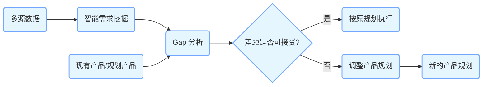

# 智能需求 gap 分析：提高产品规划准确性

> 关键词：智能需求、gap 分析、产品规划、准确性、需求管理、数据分析、用户反馈

> 摘要：本文聚焦于智能需求 gap 分析在提高产品规划准确性方面的重要作用。首先介绍了相关背景知识，包括目的范围、预期读者等内容。接着阐述了智能需求、gap 分析等核心概念及其联系，并给出了相应的文本示意图和 Mermaid 流程图。详细讲解了核心算法原理和具体操作步骤，通过 Python 源代码进行说明，同时介绍了相关的数学模型和公式。通过项目实战案例，展示了如何在实际中运用智能需求 gap 分析来优化产品规划。探讨了其实际应用场景，推荐了相关的工具和资源。最后对未来发展趋势与挑战进行总结，还提供了常见问题解答和扩展阅读参考资料，旨在帮助企业和产品开发者更好地利用智能需求 gap 分析提升产品规划的质量和准确性。

## 1. 背景介绍 
### 1.1 目的和范围
在当今竞争激烈的市场环境中，产品规划的准确性对于企业的成功至关重要。不准确的产品规划可能导致产品与市场需求脱节，造成资源浪费和市场份额的损失。智能需求 gap 分析作为一种有效的方法，可以帮助企业识别用户需求与现有产品或规划产品之间的差距，从而优化产品规划，提高产品的市场适应性和竞争力。

本文的范围涵盖了智能需求 gap 分析的基本概念、核心算法、数学模型、实际应用以及相关工具和资源等方面。旨在为读者提供全面、深入的了解，以便在实际工作中能够运用该方法来提高产品规划的准确性。

### 1.2 预期读者
本文的预期读者包括产品经理、项目经理、市场调研人员、数据分析师、软件开发人员以及对产品规划和需求管理感兴趣的相关人员。这些读者可以从本文中获取智能需求 gap 分析的理论知识和实践经验，应用到实际工作中，提升产品规划的水平。

### 1.3 文档结构概述
本文将按照以下结构进行组织：首先介绍背景知识，包括目的范围、预期读者等；接着阐述核心概念与联系，给出相关的文本示意图和 Mermaid 流程图；然后详细讲解核心算法原理和具体操作步骤，通过 Python 源代码进行说明；介绍相关的数学模型和公式，并举例说明；通过项目实战案例展示如何运用智能需求 gap 分析；探讨实际应用场景；推荐相关的工具和资源；总结未来发展趋势与挑战；提供常见问题解答和扩展阅读参考资料。

### 1.4 术语表
#### 1.4.1 核心术语定义
- **智能需求**：指基于用户行为、偏好、市场趋势等多源数据，通过智能分析技术挖掘出的用户潜在需求和期望。
- **Gap 分析**：也称为差距分析，是一种通过比较实际情况与期望情况之间的差异，找出问题和改进方向的分析方法。在智能需求领域，即比较用户智能需求与现有产品或规划产品功能之间的差距。
- **产品规划**：是指企业根据市场需求、竞争状况和自身资源，对产品的发展方向、功能特性、上市时间等进行全面规划和安排的过程。

#### 1.4.2 相关概念解释
- **需求管理**：是对产品需求进行收集、分析、评估、优先级排序和跟踪的过程，确保产品需求能够准确反映用户期望，并在产品开发过程中得到有效实现。
- **数据分析**：是指对各种数据进行收集、清洗、转换、分析和可视化的过程，以发现数据中的规律和价值，为决策提供支持。在智能需求 gap 分析中，数据分析用于挖掘用户需求和评估产品现状。

#### 1.4.3 缩略词列表
- **AI**：Artificial Intelligence，人工智能
- **ML**：Machine Learning，机器学习
- **NLP**：Natural Language Processing，自然语言处理
- **CRM**：Customer Relationship Management，客户关系管理

## 2. 核心概念与联系 

### 智能需求的产生与特点
智能需求的产生源于对多源数据的分析和挖掘。这些数据包括用户行为数据（如浏览记录、购买记录等）、用户反馈数据（如评论、投诉等）、市场数据（如行业报告、竞争对手信息等）。通过人工智能和机器学习技术对这些数据进行分析，可以发现用户的潜在需求和行为模式。

智能需求具有以下特点：
- **潜在性**：很多需求是用户尚未明确表达出来的，但通过数据分析可以挖掘出来。
- **动态性**：用户需求会随着时间、市场环境等因素的变化而变化。
- **多样性**：不同用户群体的需求存在差异，且需求的类型也多种多样，包括功能需求、性能需求、体验需求等。

### Gap 分析的原理和作用
Gap 分析的基本原理是通过设定目标和标准，将实际情况与目标进行对比，找出两者之间的差距。在智能需求领域，目标是用户的智能需求，实际情况是现有产品或规划产品的功能和特性。

Gap 分析的作用主要体现在以下几个方面：
- **发现问题**：找出产品与用户需求之间的不足之处，为产品改进提供方向。
- **优化资源分配**：根据差距的大小和重要性，合理分配资源，优先解决关键问题。
- **评估产品规划的合理性**：通过比较规划产品与用户需求的差距，评估产品规划是否符合市场需求。

### 智能需求、Gap 分析与产品规划的联系
智能需求是产品规划的基础，产品规划应该以满足用户的智能需求为目标。Gap 分析则是连接智能需求和产品规划的桥梁，通过 Gap 分析可以发现用户需求与现有产品或规划产品之间的差距，从而对产品规划进行调整和优化。

以下是核心概念联系的文本示意图：

智能需求（多源数据挖掘） -- Gap 分析（对比需求与产品现状） -- 产品规划（根据差距调整优化）

以下是 Mermaid 流程图：



## 3. 核心算法原理 & 具体操作步骤 

### 核心算法原理
智能需求 gap 分析涉及多种算法，包括数据挖掘算法、机器学习算法和自然语言处理算法等。下面以用户评论情感分析和需求分类为例，介绍核心算法原理。

#### 用户评论情感分析
用户评论情感分析是指判断用户评论是积极、消极还是中性的。常用的算法是基于机器学习的分类算法，如朴素贝叶斯算法。

朴素贝叶斯算法的基本原理是基于贝叶斯定理：

$P(C|x)=\frac{P(x|C)P(C)}{P(x)}$

其中，$C$ 表示类别（如积极、消极、中性），$x$ 表示特征（如评论中的词语）。$P(C|x)$ 表示在特征 $x$ 出现的情况下，属于类别 $C$ 的概率；$P(x|C)$ 表示在类别 $C$ 下，特征 $x$ 出现的概率；$P(C)$ 表示类别 $C$ 的先验概率；$P(x)$ 表示特征 $x$ 出现的概率。

在实际应用中，通常使用训练数据来计算这些概率，然后根据计算结果对新的评论进行分类。

#### 需求分类
需求分类是指将用户需求分为不同的类别，如功能需求、性能需求、体验需求等。常用的算法是文本分类算法，如支持向量机（SVM）算法。

支持向量机算法的基本思想是找到一个最优的超平面，将不同类别的样本分开。在文本分类中，将文本表示为向量，然后通过 SVM 算法找到最优的超平面进行分类。

### 具体操作步骤

#### 数据收集
收集多源数据，包括用户行为数据、用户反馈数据、市场数据等。数据来源可以包括网站日志、用户评论、调查问卷、行业报告等。

#### 数据预处理
对收集到的数据进行清洗、转换和归一化等处理，去除噪声数据和无效信息，将数据转换为适合算法处理的格式。

#### 特征提取
从预处理后的数据中提取有用的特征，如评论中的关键词、用户行为的统计特征等。

#### 模型训练
使用训练数据对情感分析模型和需求分类模型进行训练，调整模型的参数，提高模型的准确性。

#### Gap 分析
将提取的用户需求与现有产品或规划产品的功能进行对比，找出差距。

#### 结果可视化
将 Gap 分析的结果以图表、报表等形式进行可视化展示，方便决策者理解和分析。

### Python 源代码实现

以下是一个简单的用户评论情感分析的 Python 代码示例：

```python
import pandas as pd
from sklearn.feature_extraction.text import CountVectorizer
from sklearn.naive_bayes import MultinomialNB
from sklearn.model_selection import train_test_split
from sklearn.metrics import accuracy_score

# 读取数据
data = pd.read_csv('user_comments.csv')

# 划分训练集和测试集
X_train, X_test, y_train, y_test = train_test_split(data['comment'], data['sentiment'], test_size=0.2, random_state=42)

# 特征提取
vectorizer = CountVectorizer()
X_train_vec = vectorizer.fit_transform(X_train)
X_test_vec = vectorizer.transform(X_test)

# 模型训练
model = MultinomialNB()
model.fit(X_train_vec, y_train)

# 模型预测
y_pred = model.predict(X_test_vec)

# 模型评估
accuracy = accuracy_score(y_test, y_pred)
print(f"模型准确率: {accuracy}")
```

## 4. 数学模型和公式 & 详细讲解 & 举例说明 

### 贝叶斯定理
贝叶斯定理是智能需求 gap 分析中常用的数学模型之一，其公式为：

$$P(C|x)=\frac{P(x|C)P(C)}{P(x)}$$

详细讲解：
- $P(C|x)$：后验概率，表示在观察到特征 $x$ 的情况下，样本属于类别 $C$ 的概率。
- $P(x|C)$：似然概率，表示在类别 $C$ 下，特征 $x$ 出现的概率。
- $P(C)$：先验概率，表示类别 $C$ 在总体中的概率。
- $P(x)$：证据概率，表示特征 $x$ 出现的概率。

举例说明：
假设有一个用户评论分类问题，类别 $C$ 包括积极（$C_1$）、消极（$C_2$）和中性（$C_3$）。特征 $x$ 是评论中出现的关键词“好”。

已知：
- $P(C_1)=0.6$（积极评论的先验概率）
- $P(C_2)=0.2$（消极评论的先验概率）
- $P(C_3)=0.2$（中性评论的先验概率）
- $P(x|C_1)=0.8$（在积极评论中出现“好”的概率）
- $P(x|C_2)=0.1$（在消极评论中出现“好”的概率）
- $P(x|C_3)=0.2$（在中性评论中出现“好”的概率）

首先计算 $P(x)$：

$$P(x)=P(x|C_1)P(C_1)+P(x|C_2)P(C_2)+P(x|C_3)P(C_3)$$
$$=0.8\times0.6 + 0.1\times0.2 + 0.2\times0.2$$
$$=0.48 + 0.02 + 0.04 = 0.54$$

然后计算 $P(C_1|x)$：

$$P(C_1|x)=\frac{P(x|C_1)P(C_1)}{P(x)}=\frac{0.8\times0.6}{0.54}\approx0.89$$

同理可计算 $P(C_2|x)$ 和 $P(C_3|x)$。根据计算结果，可以判断该评论更有可能是积极评论。

### 支持向量机（SVM）的数学模型
支持向量机的目标是找到一个最优的超平面，将不同类别的样本分开。对于线性可分的情况，超平面的方程为：

$$w^T x + b = 0$$

其中，$w$ 是超平面的法向量，$x$ 是样本向量，$b$ 是偏置项。

SVM 的优化目标是最大化间隔，即：

$$\max_{\omega,b}\frac{2}{\|\omega\|}$$
$$s.t. \quad y_i(\omega^T x_i + b) \geq 1, \quad i = 1,2,\cdots,n$$

其中，$y_i$ 是样本 $x_i$ 的类别标签（$y_i \in \{-1, +1\}$），$n$ 是样本数量。

通过引入拉格朗日乘子，可以将上述优化问题转化为对偶问题进行求解。

## 5. 项目实战：代码实际案例和详细解释说明 

### 5.1  开发环境搭建
- **操作系统**：Windows 10 或 Linux（如 Ubuntu）
- **编程语言**：Python 3.7 及以上
- **开发工具**：PyCharm 或 Jupyter Notebook
- **相关库**：pandas、scikit-learn、matplotlib、seaborn 等

安装相关库的命令：

```bash
pip install pandas scikit-learn matplotlib seaborn
```

### 5.2  源代码详细实现和代码解读

以下是一个完整的智能需求 gap 分析项目实战代码示例：

```python
import pandas as pd
from sklearn.feature_extraction.text import TfidfVectorizer
from sklearn.svm import SVC
from sklearn.model_selection import train_test_split
from sklearn.metrics import classification_report
import matplotlib.pyplot as plt
import seaborn as sns

# 读取数据
data = pd.read_csv('user_needs.csv')

# 数据预处理
data['needs'] = data['needs'].str.lower()  # 转换为小写
data['needs'] = data['needs'].str.replace('[^\w\s]', '')  # 去除标点符号

# 划分训练集和测试集
X_train, X_test, y_train, y_test = train_test_split(data['needs'], data['category'], test_size=0.2, random_state=42)

# 特征提取
vectorizer = TfidfVectorizer()
X_train_vec = vectorizer.fit_transform(X_train)
X_test_vec = vectorizer.transform(X_test)

# 模型训练
model = SVC(kernel='linear')
model.fit(X_train_vec, y_train)

# 模型预测
y_pred = model.predict(X_test_vec)

# 模型评估
report = classification_report(y_test, y_pred)
print(report)

# 可视化混淆矩阵
from sklearn.metrics import confusion_matrix
cm = confusion_matrix(y_test, y_pred)
sns.heatmap(cm, annot=True, fmt='d', cmap='Blues')
plt.xlabel('Predicted')
plt.ylabel('Actual')
plt.show()

# Gap 分析
# 假设现有产品功能列表
existing_features = ['功能1', '功能2', '功能3']
# 提取用户需求中的功能需求
user_functional_needs = data[data['category'] == '功能需求']['needs'].tolist()
# 找出差距
gap = [need for need in user_functional_needs if need not in existing_features]
print(f"功能需求差距: {gap}")
```

### 5.3  代码解读与分析
- **数据读取**：使用 `pandas` 库读取用户需求数据。
- **数据预处理**：将用户需求文本转换为小写，并去除标点符号，以提高模型的准确性。
- **特征提取**：使用 `TfidfVectorizer` 将文本转换为向量，`Tfidf` 可以反映词语在文本中的重要性。
- **模型训练**：使用支持向量机（SVM）模型进行训练，选择线性核函数。
- **模型预测**：使用训练好的模型对测试集进行预测。
- **模型评估**：使用 `classification_report` 输出分类报告，包括准确率、召回率、F1 值等指标。
- **可视化混淆矩阵**：使用 `seaborn` 库绘制混淆矩阵，直观地展示模型的分类效果。
- **Gap 分析**：通过对比用户需求中的功能需求和现有产品功能列表，找出差距。

## 6. 实际应用场景 

### 电商产品规划
在电商领域，智能需求 gap 分析可以帮助企业了解用户对商品的需求和期望，优化商品种类和功能。例如，通过分析用户评论和搜索记录，发现用户对某种特定功能的商品有较高的需求，但现有商品中缺乏该功能，企业可以根据这个差距，调整商品采购计划或开发新的商品。

### 软件产品开发
在软件产品开发过程中，智能需求 gap 分析可以帮助开发团队准确把握用户需求，避免开发出与用户需求不符的产品。例如，通过分析用户反馈和市场调研数据，发现用户对软件的某些功能有改进的需求，开发团队可以根据这个差距，对软件进行功能优化和升级。

### 金融产品创新
在金融领域，智能需求 gap 分析可以帮助金融机构了解客户的金融需求和风险偏好，开发出更符合客户需求的金融产品。例如，通过分析客户的交易记录和问卷调查数据，发现客户对某种新型金融产品有潜在需求，金融机构可以根据这个差距，设计和推出相应的金融产品。

### 医疗服务优化
在医疗领域，智能需求 gap 分析可以帮助医疗机构了解患者的需求和期望，优化医疗服务流程和质量。例如，通过分析患者的病历记录和满意度调查数据，发现患者对医疗服务的某些环节有不满，医疗机构可以根据这个差距，改进服务流程，提高患者满意度。

## 7. 工具和资源推荐
### 7.1 学习资源推荐
#### 7.1.1 书籍推荐
- 《Python 数据分析实战》：介绍了 Python 在数据分析领域的应用，包括数据处理、可视化等内容。
- 《机器学习实战》：通过实际案例介绍了机器学习的基本算法和应用，帮助读者快速掌握机器学习的知识。
- 《自然语言处理入门》：系统地介绍了自然语言处理的基本概念、算法和应用，适合初学者学习。

#### 7.1.2 在线课程
- Coursera 上的“机器学习”课程：由斯坦福大学教授 Andrew Ng 主讲，是机器学习领域的经典课程。
- edX 上的“数据科学与机器学习微硕士”课程：提供了系统的数据分析和机器学习知识体系。
- 中国大学 MOOC 上的“自然语言处理”课程：由国内知名高校的教授授课，讲解自然语言处理的理论和实践。

#### 7.1.3 技术博客和网站
- 博客园：提供了大量的技术文章和经验分享，涵盖了数据分析、机器学习、自然语言处理等多个领域。
- 开源中国：关注开源技术和创新，有很多关于数据分析和人工智能的文章和项目分享。
- Kaggle：是一个数据科学竞赛平台，上面有很多优秀的数据科学项目和经验分享，可以学习到最新的数据分析和机器学习技术。

### 7.2 开发工具框架推荐
#### 7.2.1 IDE和编辑器
- PyCharm：是一款专业的 Python 集成开发环境，提供了丰富的功能和插件，方便开发和调试 Python 代码。
- Jupyter Notebook：是一个交互式的开发环境，适合进行数据分析和模型训练的实验和演示。
- Visual Studio Code：是一款轻量级的代码编辑器，支持多种编程语言和插件，可用于快速开发和调试。

#### 7.2.2 调试和性能分析工具
- PDB：Python 自带的调试工具，可以帮助开发者定位代码中的问题。
- cProfile：Python 自带的性能分析工具，可以分析代码的性能瓶颈。
- Py-Spy：是一个基于 Rust 的 Python 性能分析工具，具有较高的性能和准确性。

#### 7.2.3 相关框架和库
- pandas：是一个强大的数据处理和分析库，提供了高效的数据结构和数据操作方法。
- scikit-learn：是一个常用的机器学习库，提供了多种机器学习算法和工具，方便进行模型训练和评估。
- NLTK：是一个自然语言处理库，提供了丰富的自然语言处理工具和语料库，可用于文本处理和分析。

### 7.3 相关论文著作推荐
#### 7.3.1 经典论文
- “The Elements of Statistical Learning”：介绍了统计学习的基本理论和方法，是机器学习领域的经典著作。
- “Speech and Language Processing”：系统地介绍了自然语言处理的理论和技术，是自然语言处理领域的权威书籍。
- “Data Mining: Concepts and Techniques”：介绍了数据挖掘的基本概念、算法和应用，是数据挖掘领域的经典教材。

#### 7.3.2 最新研究成果
- 在 ACM SIGKDD、NeurIPS、ACL 等顶级学术会议上发表的关于数据分析、机器学习、自然语言处理等领域的最新研究成果。
- 在《Journal of Artificial Intelligence Research》、《Artificial Intelligence》等学术期刊上发表的相关论文。

#### 7.3.3 应用案例分析
- 一些知名企业的技术博客和案例分享，如 Google、Microsoft、Amazon 等公司的技术博客，介绍了他们在智能需求分析和产品规划方面的实践经验。
- 行业报告和研究机构的分析报告，如 Gartner、IDC 等机构发布的关于人工智能、大数据等领域的应用案例分析。

## 8. 总结：未来发展趋势与挑战

### 未来发展趋势
- **多模态数据融合**：未来的智能需求 gap 分析将不仅仅依赖于文本数据，还会融合图像、语音、视频等多模态数据，以更全面地了解用户需求。
- **深度学习的广泛应用**：深度学习技术在自然语言处理、图像识别等领域取得了显著的成果，未来将在智能需求 gap 分析中得到更广泛的应用，提高分析的准确性和效率。
- **实时分析与决策**：随着技术的发展，智能需求 gap 分析将实现实时性，能够及时捕捉用户需求的变化，并为企业提供实时的决策支持。
- **个性化需求分析**：越来越注重用户的个性化需求，通过对用户的行为、偏好等数据的深度分析，为用户提供个性化的产品和服务。

### 挑战
- **数据质量和隐私问题**：数据质量直接影响智能需求 gap 分析的准确性，而数据隐私问题也越来越受到关注。如何保证数据的质量和安全，是未来需要解决的重要问题。
- **算法复杂度和可解释性**：一些先进的算法，如深度学习算法，具有较高的复杂度，且模型的可解释性较差。如何在提高算法性能的同时，保证模型的可解释性，是一个挑战。
- **跨领域知识融合**：智能需求 gap 分析涉及多个领域的知识，如数据分析、机器学习、市场营销等。如何实现跨领域知识的融合，培养复合型人才，是未来发展的关键。

## 9. 附录：常见问题与解答

### 问题 1：如何选择合适的算法进行智能需求 gap 分析？
解答：选择合适的算法需要考虑数据的特点、问题的复杂度和应用场景等因素。如果数据量较小且特征简单，可以选择朴素贝叶斯、决策树等简单算法；如果数据量较大且需要处理复杂的文本数据，可以选择支持向量机、深度学习等算法。同时，还可以通过实验比较不同算法的性能，选择最优的算法。

### 问题 2：智能需求 gap 分析需要多少数据？
解答：数据量的大小取决于问题的复杂度和算法的要求。一般来说，数据量越大，模型的准确性越高。但也不是数据量越大越好，过多的数据可能会导致计算资源的浪费和过拟合问题。在实际应用中，可以通过数据抽样和特征选择等方法，在保证数据质量的前提下，合理控制数据量。

### 问题 3：如何处理数据中的噪声和缺失值？
解答：处理数据中的噪声可以采用数据清洗的方法，如去除重复数据、异常值处理等。处理缺失值可以采用填充法，如用均值、中位数、众数等填充缺失值；也可以采用删除法，删除包含缺失值的记录。具体方法需要根据数据的特点和分析的目的来选择。

### 问题 4：智能需求 gap 分析的结果如何应用到产品规划中？
解答：智能需求 gap 分析的结果可以为产品规划提供方向和依据。可以根据差距的大小和重要性，对产品的功能、特性、上市时间等进行调整和优化。同时，还可以将分析结果反馈给研发、市场、销售等部门，促进各部门之间的协作，提高产品规划的准确性和效率。

## 10. 扩展阅读 & 参考资料
- 《人工智能：现代方法》
- 《Python 机器学习》
- 《数据挖掘导论》
- 相关学术期刊和会议论文，如《ACM Transactions on Knowledge Discovery from Data》、ICML、KDD 等。
- 企业技术博客和行业报告，如阿里巴巴、腾讯等公司的技术博客，艾瑞咨询、易观智库等机构的行业报告。