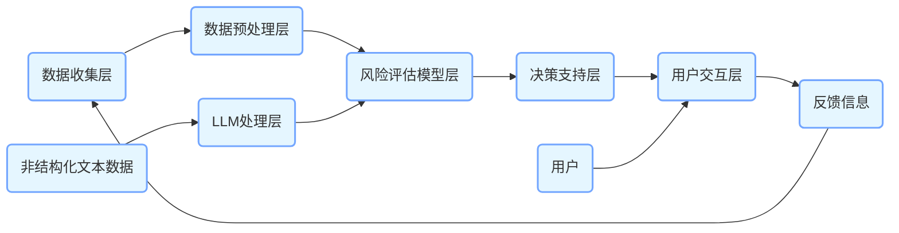

# 智能风险评估 AI Agent：LLM 在保险行业中的应用

> 关键词：智能风险评估、AI Agent、大语言模型（LLM）、保险行业、风险分析、机器学习、数据驱动决策

> 摘要：本文聚焦于智能风险评估 AI Agent 以及大语言模型（LLM）在保险行业中的应用。首先介绍了相关背景知识，包括研究目的、预期读者、文档结构和术语表。接着阐述了核心概念与联系，通过文本示意图和 Mermaid 流程图进行清晰展示。详细讲解了核心算法原理和具体操作步骤，结合 Python 源代码进行说明。深入探讨了数学模型和公式，并举例说明。通过项目实战给出代码实际案例和详细解释。分析了实际应用场景，推荐了相关工具和资源，包括学习资源、开发工具框架和论文著作。最后总结了未来发展趋势与挑战，还包含常见问题解答和扩展阅读参考资料，旨在全面剖析 LLM 在保险行业智能风险评估中的应用，为相关从业者和研究者提供有价值的参考。

## 1. 背景介绍 
### 1.1 目的和范围
在当今数字化时代，保险行业面临着越来越复杂的风险评估挑战。传统的风险评估方法往往依赖于有限的数据和固定的规则，难以适应快速变化的市场环境和多样化的客户需求。智能风险评估 AI Agent 结合大语言模型（LLM）的应用，为保险行业带来了新的机遇。本文的目的在于深入探讨如何利用 LLM 构建智能风险评估 AI Agent，以及其在保险行业各个环节中的具体应用，包括客户风险评估、理赔风险分析、保险产品定价等。通过对相关技术和应用的研究，旨在为保险行业提供更高效、准确、智能的风险评估解决方案，提升行业的整体竞争力。

### 1.2 预期读者
本文预期读者包括保险行业的从业者，如保险精算师、风险评估师、理赔专员等，他们可以从本文中了解到如何利用新兴技术提升自身工作效率和准确性；计算机科学领域的研究者和开发者，他们可以获取关于智能风险评估 AI Agent 和 LLM 应用的技术细节和实践经验；对金融科技和人工智能应用感兴趣的学生和爱好者，本文可以作为他们了解相关领域的入门参考。

### 1.3 文档结构概述
本文将按照以下结构展开：首先介绍相关背景知识，包括目的、读者、文档结构和术语表；接着阐述核心概念与联系，通过文本示意图和 Mermaid 流程图进行展示；详细讲解核心算法原理和具体操作步骤，结合 Python 源代码；深入探讨数学模型和公式，并举例说明；通过项目实战给出代码实际案例和详细解释；分析实际应用场景；推荐相关工具和资源；总结未来发展趋势与挑战；最后包含常见问题解答和扩展阅读参考资料。

### 1.4 术语表
#### 1.4.1 核心术语定义
- **智能风险评估 AI Agent**：一种基于人工智能技术的智能体，能够自动收集、分析和处理与风险相关的信息，利用各种算法和模型进行风险评估，并提供相应的决策建议。
- **大语言模型（LLM）**：一种基于深度学习的自然语言处理模型，通过对大量文本数据的学习，能够生成自然语言文本，理解语言的语义和上下文信息。
- **保险行业**：指经营保险业务的经济行业，包括人寿保险、财产保险、健康保险等多个领域，主要通过收取保费来承担风险和提供经济补偿。
- **风险评估**：对可能影响目标实现的不确定性因素进行识别、分析和评价的过程，以确定风险的大小和可能性，为决策提供依据。

#### 1.4.2 相关概念解释
- **机器学习**：一门多领域交叉学科，涉及概率论、统计学、逼近论、凸分析、算法复杂度理论等多门学科。它专门研究计算机怎样模拟或实现人类的学习行为，以获取新的知识或技能，重新组织已有的知识结构使之不断改善自身的性能。
- **自然语言处理（NLP）**：计算机科学与人工智能领域中的一个重要方向。它研究能实现人与计算机之间用自然语言进行有效通信的各种理论和方法，包括文本分类、情感分析、机器翻译等多个任务。
- **数据驱动决策**：指基于数据的分析和挖掘结果来做出决策的过程，通过对大量数据的收集、整理和分析，发现数据中的规律和趋势，为决策提供科学依据。

#### 1.4.3 缩略词列表
- **LLM**：Large Language Model（大语言模型）
- **AI**：Artificial Intelligence（人工智能）
- **NLP**：Natural Language Processing（自然语言处理）
- **ML**：Machine Learning（机器学习）

## 2. 核心概念与联系 

### 核心概念原理
智能风险评估 AI Agent 结合 LLM 在保险行业中的应用，主要基于以下几个核心概念原理。

智能风险评估 AI Agent 是一个智能的决策系统，它通过收集各种来源的数据，包括客户信息、市场数据、历史理赔记录等，利用机器学习和自然语言处理技术对这些数据进行分析和处理，以评估风险的大小和可能性。LLM 作为一种强大的自然语言处理模型，能够理解和处理人类语言，为 AI Agent 提供更丰富的语义信息。在保险行业中，LLM 可以用于对保险条款、理赔报告等文本信息的理解和分析，帮助 AI Agent 更准确地评估风险。

例如，在客户风险评估中，AI Agent 可以收集客户的基本信息、健康状况、职业等数据，同时利用 LLM 对客户填写的问卷和提供的说明进行语义分析，提取关键信息，从而更全面地了解客户的风险状况。在理赔风险分析中，LLM 可以对理赔报告进行分析，判断理赔的合理性和真实性，帮助保险公司减少欺诈风险。

### 架构的文本示意图
智能风险评估 AI Agent 结合 LLM 在保险行业中的应用架构主要包括以下几个部分：

1. **数据收集层**：负责收集各种与风险评估相关的数据，包括结构化数据（如客户基本信息、财务数据等）和非结构化数据（如保险条款、理赔报告、客户反馈等）。
2. **数据预处理层**：对收集到的数据进行清洗、转换和特征提取等操作，将非结构化数据转换为结构化数据，以便后续的分析和处理。
3. **LLM 处理层**：利用大语言模型对非结构化文本数据进行处理，包括文本分类、情感分析、实体识别、语义理解等任务，提取有用的信息和特征。
4. **风险评估模型层**：基于机器学习和深度学习算法，利用预处理后的数据和 LLM 提取的特征，构建风险评估模型，对风险进行量化评估。
5. **决策支持层**：根据风险评估结果，为保险业务决策提供支持，如保险产品定价、理赔决策、客户风险分级等。
6. **用户交互层**：提供用户界面，方便用户与 AI Agent 进行交互，包括数据输入、查询、结果展示等功能。

### Mermaid 流程图


## 3. 核心算法原理 & 具体操作步骤 

### 核心算法原理
智能风险评估 AI Agent 结合 LLM 在保险行业中的应用，主要涉及以下几种核心算法：

#### 1. 大语言模型（LLM）算法
LLM 通常基于Transformer架构，通过自注意力机制来捕捉文本中的长距离依赖关系。以GPT（Generative Pretrained Transformer）系列模型为例，其训练过程包括预训练和微调两个阶段。

预训练阶段，模型在大规模无监督文本数据上进行训练，学习语言的通用模式和语义信息。微调阶段，模型在特定任务的标注数据上进行训练，以适应具体的应用场景。

#### 2. 机器学习算法
在风险评估模型层，常用的机器学习算法包括逻辑回归、决策树、随机森林、支持向量机等。这些算法可以根据输入的特征数据，建立风险评估模型，预测风险的概率。

例如，逻辑回归是一种常用的二分类算法，其原理是通过对输入特征进行线性组合，然后通过逻辑函数将线性组合的结果映射到[0, 1]区间，得到风险发生的概率。

### 具体操作步骤

#### 1. 数据收集
收集各种与风险评估相关的数据，包括客户信息、市场数据、历史理赔记录、保险条款等。可以通过数据库查询、网络爬虫、用户输入等方式获取数据。

#### 2. 数据预处理
- **数据清洗**：去除数据中的噪声、重复值、缺失值等。
- **数据转换**：将非结构化数据转换为结构化数据，如将文本数据进行分词、词性标注、命名实体识别等处理。
- **特征提取**：从数据中提取有用的特征，如客户的年龄、性别、收入、健康状况等。

#### 3. LLM 处理
- **文本分类**：将保险条款、理赔报告等文本数据分类到不同的类别中，如车险、寿险、健康险等。
- **情感分析**：分析客户反馈、理赔报告等文本中的情感倾向，判断客户的满意度和理赔的合理性。
- **实体识别**：识别文本中的关键实体，如客户姓名、保险公司名称、保险产品名称等。

#### 4. 风险评估模型训练
- **划分数据集**：将预处理后的数据划分为训练集、验证集和测试集。
- **选择算法**：根据数据特点和任务需求，选择合适的机器学习算法。
- **模型训练**：使用训练集对模型进行训练，调整模型的参数。
- **模型评估**：使用验证集和测试集对模型进行评估，评估指标包括准确率、召回率、F1值等。

#### 5. 决策支持
根据风险评估结果，为保险业务决策提供支持，如保险产品定价、理赔决策、客户风险分级等。

### Python 源代码详细阐述

以下是一个简单的示例，演示如何使用Python和相关库实现智能风险评估 AI Agent 的部分功能，包括数据预处理、LLM 处理和风险评估模型训练。

```python
import pandas as pd
from sklearn.model_selection import train_test_split
from sklearn.linear_model import LogisticRegression
from sklearn.metrics import accuracy_score
import transformers
from transformers import AutoTokenizer, AutoModelForSequenceClassification

# 数据收集和预处理
# 假设我们有一个包含客户信息和风险标签的数据集
data = pd.read_csv('insurance_data.csv')

# 数据清洗
data = data.dropna()

# 特征提取
X = data[['age', 'gender', 'income']]
y = data['risk_label']

# 划分数据集
X_train, X_test, y_train, y_test = train_test_split(X, y, test_size=0.2, random_state=42)

# LLM 处理示例
# 使用预训练的语言模型进行文本分类
tokenizer = AutoTokenizer.from_pretrained('bert-base-uncased')
model = AutoModelForSequenceClassification.from_pretrained('bert-base-uncased')

text = "This is a sample insurance claim report."
inputs = tokenizer(text, return_tensors='pt')
outputs = model(**inputs)
logits = outputs.logits
predicted_class_id = logits.argmax().item()

# 风险评估模型训练
model = LogisticRegression()
model.fit(X_train, y_train)

# 模型评估
y_pred = model.predict(X_test)
accuracy = accuracy_score(y_test, y_pred)
print(f"Accuracy: {accuracy}")
```

## 4. 数学模型和公式 & 详细讲解 & 举例说明 

### 逻辑回归数学模型和公式
逻辑回归是一种常用的二分类算法，其数学模型可以表示为：

$$P(Y=1|X)=\frac{1}{1 + e^{-(w_0 + w_1x_1 + w_2x_2 + \cdots + w_nx_n)}}$$

其中，$P(Y=1|X)$ 表示在给定特征向量 $X=(x_1, x_2, \cdots, x_n)$ 的条件下，样本属于正类（$Y=1$）的概率；$w_0, w_1, w_2, \cdots, w_n$ 是模型的参数。

逻辑回归的目标是通过最小化损失函数来估计模型的参数。常用的损失函数是对数损失函数，也称为交叉熵损失函数，其公式为：

$$L(w)=-\frac{1}{m}\sum_{i=1}^{m}[y_i\log(P(Y=1|X_i))+(1 - y_i)\log(1 - P(Y=1|X_i))]$$

其中，$m$ 是样本数量，$y_i$ 是第 $i$ 个样本的真实标签。

### 详细讲解
逻辑回归的基本思想是通过对输入特征进行线性组合，然后通过逻辑函数将线性组合的结果映射到[0, 1]区间，得到样本属于正类的概率。逻辑函数的形状是一个S形曲线，当输入趋近于正无穷时，输出趋近于1；当输入趋近于负无穷时，输出趋近于0。

在训练过程中，通过最小化对数损失函数来调整模型的参数。对数损失函数的特点是当预测概率与真实标签接近时，损失值较小；当预测概率与真实标签相差较大时，损失值较大。

### 举例说明
假设我们有一个简单的二分类问题，预测客户是否会发生保险理赔。我们有两个特征：客户的年龄 $x_1$ 和收入 $x_2$。逻辑回归模型的参数为 $w_0 = -2$，$w_1 = 0.1$，$w_2 = 0.001$。

对于一个年龄为30岁，收入为5000元的客户，其特征向量为 $X=(30, 5000)$。线性组合的结果为：

$$z = w_0 + w_1x_1 + w_2x_2 = -2 + 0.1\times30 + 0.001\times5000 = -2 + 3 + 5 = 6$$

则该客户发生保险理赔的概率为：

$$P(Y=1|X)=\frac{1}{1 + e^{-z}}=\frac{1}{1 + e^{-6}}\approx0.9975$$

## 5. 项目实战：代码实际案例和详细解释说明 

### 5.1  开发环境搭建
在进行智能风险评估 AI Agent 项目实战之前，需要搭建相应的开发环境。以下是具体的步骤：

#### 1. 安装 Python
建议使用 Python 3.7 及以上版本。可以从 Python 官方网站（https://www.python.org/downloads/） 下载并安装。

#### 2. 安装依赖库
使用 pip 命令安装所需的依赖库，包括 pandas、scikit-learn、transformers 等。

```bash
pip install pandas scikit-learn transformers
```

#### 3. 下载预训练模型
使用 transformers 库下载预训练的语言模型，如 BERT、GPT 等。

```python
from transformers import AutoTokenizer, AutoModelForSequenceClassification

tokenizer = AutoTokenizer.from_pretrained('bert-base-uncased')
model = AutoModelForSequenceClassification.from_pretrained('bert-base-uncased')
```

### 5.2  源代码详细实现和代码解读

以下是一个完整的智能风险评估 AI Agent 项目实战代码示例，包括数据收集、预处理、LLM 处理、风险评估模型训练和评估。

```python
import pandas as pd
from sklearn.model_selection import train_test_split
from sklearn.linear_model import LogisticRegression
from sklearn.metrics import accuracy_score, precision_score, recall_score, f1_score
import transformers
from transformers import AutoTokenizer, AutoModelForSequenceClassification
import torch

# 数据收集
# 假设我们有一个包含客户信息和风险标签的 CSV 文件
data = pd.read_csv('insurance_data.csv')

# 数据预处理
# 数据清洗
data = data.dropna()

# 特征提取
# 选择相关特征
numerical_features = ['age', 'income']
categorical_features = ['gender']

# 对分类特征进行编码
data = pd.get_dummies(data, columns=categorical_features)

# 划分特征和标签
X = data[numerical_features + [col for col in data.columns if col.startswith('gender_')]]
y = data['risk_label']

# 划分数据集
X_train, X_test, y_train, y_test = train_test_split(X, y, test_size=0.2, random_state=42)

# LLM 处理示例
# 使用预训练的语言模型进行文本分类
tokenizer = AutoTokenizer.from_pretrained('bert-base-uncased')
model = AutoModelForSequenceClassification.from_pretrained('bert-base-uncased')

# 假设我们有一个理赔报告文本
claim_report = "The customer reported a car accident due to sudden brake failure."
inputs = tokenizer(claim_report, return_tensors='pt')
outputs = model(**inputs)
logits = outputs.logits
predicted_class_id = logits.argmax().item()

# 风险评估模型训练
model = LogisticRegression()
model.fit(X_train, y_train)

# 模型评估
y_pred = model.predict(X_test)
accuracy = accuracy_score(y_test, y_pred)
precision = precision_score(y_test, y_pred)
recall = recall_score(y_test, y_pred)
f1 = f1_score(y_test, y_pred)

print(f"Accuracy: {accuracy}")
print(f"Precision: {precision}")
print(f"Recall: {recall}")
print(f"F1 Score: {f1}")
```

### 代码解读与分析
1. **数据收集**：使用 pandas 库读取包含客户信息和风险标签的 CSV 文件。
2. **数据预处理**：
    - **数据清洗**：使用 `dropna()` 方法去除数据中的缺失值。
    - **特征提取**：选择相关的数值特征和分类特征，并对分类特征进行独热编码。
    - **划分数据集**：使用 `train_test_split()` 方法将数据集划分为训练集和测试集。
3. **LLM 处理**：
    - 使用 `AutoTokenizer` 和 `AutoModelForSequenceClassification` 加载预训练的 BERT 模型。
    - 对理赔报告文本进行分词和编码，输入到模型中进行分类预测。
4. **风险评估模型训练**：使用逻辑回归算法对训练集进行训练。
5. **模型评估**：使用准确率、精确率、召回率和 F1 值等指标对模型进行评估。

## 6. 实际应用场景 
### 客户风险评估
在保险业务中，准确评估客户的风险状况是非常重要的。智能风险评估 AI Agent 结合 LLM 可以帮助保险公司更全面地了解客户的风险状况。通过收集客户的基本信息、健康状况、职业、生活习惯等数据，同时利用 LLM 对客户填写的问卷和提供的说明进行语义分析，提取关键信息。例如，对于一个申请健康保险的客户，AI Agent 可以分析客户的病历、体检报告等文本信息，了解客户的健康状况和潜在风险。对于一个申请车险的客户，AI Agent 可以分析客户的驾驶记录、交通违规信息等，评估客户的驾驶风险。

### 理赔风险分析
理赔风险分析是保险行业的重要环节，旨在防止欺诈理赔和不合理理赔。智能风险评估 AI Agent 结合 LLM 可以对理赔报告进行深入分析。LLM 可以理解理赔报告的语义，判断理赔的合理性和真实性。例如，对于一个车险理赔报告，AI Agent 可以分析事故描述、照片、维修记录等信息，判断事故是否真实发生，理赔金额是否合理。对于一个健康险理赔报告，AI Agent 可以分析病历、诊断证明、治疗记录等信息，判断理赔是否符合保险条款。

### 保险产品定价
保险产品定价需要考虑多种因素，包括风险程度、市场需求、成本等。智能风险评估 AI Agent 结合 LLM 可以帮助保险公司更准确地评估风险，从而制定合理的保险产品价格。通过对大量客户数据和市场数据的分析，AI Agent 可以了解不同客户群体的风险特征，根据风险程度对客户进行分类，为不同风险等级的客户制定不同的保险产品价格。例如，对于高风险客户，保险产品价格可以相应提高；对于低风险客户，保险产品价格可以适当降低。

### 客户服务与营销
智能风险评估 AI Agent 结合 LLM 还可以应用于客户服务和营销环节。在客户服务方面，AI Agent 可以通过自然语言处理技术与客户进行交互，解答客户的疑问，提供保险产品信息和理赔指导。例如，客户可以通过聊天机器人咨询保险条款、理赔流程等问题，AI Agent 可以快速准确地回答客户的问题。在营销方面，AI Agent 可以根据客户的风险评估结果和偏好，为客户推荐合适的保险产品。例如，对于一个年轻的上班族，AI Agent 可以推荐适合他们的健康保险和意外险产品。

## 7. 工具和资源推荐
### 7.1 学习资源推荐
#### 7.1.1 书籍推荐
- 《深度学习》（Deep Learning）：由 Ian Goodfellow、Yoshua Bengio 和 Aaron Courville 所著，是深度学习领域的经典教材，全面介绍了深度学习的基本原理、算法和应用。
- 《Python 机器学习》（Python Machine Learning）：由 Sebastian Raschka 和 Vahid Mirjalili 所著，详细介绍了如何使用 Python 进行机器学习任务，包括数据预处理、模型训练、评估和优化等。
- 《自然语言处理入门》（Natural Language Processing with Python）：由 Steven Bird、Ewan Klein 和 Edward Loper 所著，是自然语言处理领域的入门书籍，介绍了自然语言处理的基本概念、算法和工具。

#### 7.1.2 在线课程
- Coursera 上的《深度学习专项课程》（Deep Learning Specialization）：由 Andrew Ng 教授主讲，包括五门课程，全面介绍了深度学习的各个方面，如神经网络、卷积神经网络、循环神经网络等。
- edX 上的《人工智能基础》（Introduction to Artificial Intelligence）：由麻省理工学院（MIT）的教授主讲，介绍了人工智能的基本概念、算法和应用。
- 中国大学 MOOC 上的《自然语言处理》：由国内知名高校的教授主讲，介绍了自然语言处理的基本理论、方法和技术。

#### 7.1.3 技术博客和网站
- Medium：一个开源的博客平台，上面有很多关于人工智能、机器学习、自然语言处理等领域的技术文章和经验分享。
- Towards Data Science：一个专注于数据科学和人工智能的博客平台，提供了很多高质量的技术文章和案例分析。
- arXiv：一个预印本平台，上面有很多最新的学术论文，涵盖了人工智能、机器学习、自然语言处理等领域。

### 7.2 开发工具框架推荐
#### 7.2.1 IDE和编辑器
- PyCharm：一款专门为 Python 开发设计的集成开发环境（IDE），提供了丰富的功能，如代码编辑、调试、版本控制等。
- Jupyter Notebook：一个交互式的开发环境，适合进行数据分析、机器学习和深度学习的实验和演示。
- Visual Studio Code：一款轻量级的代码编辑器，支持多种编程语言，具有丰富的插件和扩展功能。

#### 7.2.2 调试和性能分析工具
- PDB：Python 自带的调试器，可以帮助开发者定位和解决代码中的问题。
- TensorBoard：一个用于可视化深度学习模型训练过程和结果的工具，可以帮助开发者分析模型的性能和优化模型。
- Scikit-learn 的 `cross_val_score` 和 `GridSearchCV`：用于模型评估和超参数调优的工具，可以帮助开发者选择最佳的模型和参数。

#### 7.2.3 相关框架和库
- TensorFlow：一个开源的深度学习框架，由 Google 开发，提供了丰富的工具和库，用于构建和训练深度学习模型。
- PyTorch：一个开源的深度学习框架，由 Facebook 开发，具有动态图的特点，适合进行快速迭代和实验。
- Transformers：一个开源的自然语言处理库，由 Hugging Face 开发，提供了预训练的语言模型和相关工具，方便开发者进行自然语言处理任务。

### 7.3 相关论文著作推荐
#### 7.3.1 经典论文
- 《Attention Is All You Need》：提出了 Transformer 架构，是自然语言处理领域的经典论文，为后续的大语言模型发展奠定了基础。
- 《Deep Residual Learning for Image Recognition》：提出了残差网络（ResNet），解决了深度神经网络训练中的梯度消失和梯度爆炸问题，在计算机视觉领域取得了巨大成功。
- 《Generative Adversarial Nets》：提出了生成对抗网络（GAN），是一种新型的生成模型，在图像生成、文本生成等领域有广泛应用。

#### 7.3.2 最新研究成果
- 《GPT-3: Language Models are Few-Shot Learners》：介绍了 GPT-3 大语言模型的原理和应用，展示了大语言模型在自然语言处理任务中的强大能力。
- 《BERT: Pre-training of Deep Bidirectional Transformers for Language Understanding》：提出了 BERT 模型，是自然语言处理领域的重要突破，在多个自然语言处理任务中取得了优异的成绩。
- 《RoBERTa: A Robustly Optimized BERT Pretraining Approach》：对 BERT 模型进行了优化，提高了模型的性能和效率。

#### 7.3.3 应用案例分析
- 《Applying Machine Learning to Insurance Fraud Detection》：介绍了如何使用机器学习算法进行保险欺诈检测，通过实际案例分析了不同算法的性能和应用效果。
- 《Using Natural Language Processing in Insurance Claims Processing》：探讨了自然语言处理技术在保险理赔处理中的应用，分析了如何利用自然语言处理技术提高理赔处理的效率和准确性。
- 《Risk Assessment in Insurance Using Deep Learning》：研究了如何使用深度学习算法进行保险风险评估，通过实验验证了深度学习算法在风险评估中的有效性。

## 8. 总结：未来发展趋势与挑战
### 未来发展趋势
#### 1. 更强大的大语言模型
随着技术的不断发展，大语言模型将变得越来越强大。未来的大语言模型将具有更高的语言理解能力和生成能力，能够处理更复杂的自然语言任务。这将为智能风险评估 AI Agent 提供更强大的支持，使其能够更准确地理解和分析保险相关的文本信息。

#### 2. 多模态融合
未来的智能风险评估 AI Agent 将不仅仅依赖于文本数据，还将融合图像、音频、视频等多模态数据。例如，在车险理赔中，可以结合事故现场的照片和视频，更全面地了解事故情况，提高理赔风险分析的准确性。在健康险理赔中，可以结合客户的医疗影像数据，更准确地评估客户的健康状况。

#### 3. 个性化服务
智能风险评估 AI Agent 将能够根据客户的个性化需求和风险状况，提供更加个性化的保险产品和服务。通过对客户数据的深入分析，AI Agent 可以了解客户的偏好和风险特征，为客户量身定制保险方案，提高客户的满意度和忠诚度。

#### 4. 与区块链技术结合
区块链技术具有去中心化、不可篡改、可追溯等特点，与智能风险评估 AI Agent 结合，可以提高保险数据的安全性和可信度。例如，在理赔过程中，可以使用区块链技术记录理赔信息，防止欺诈理赔和数据篡改。在客户信息管理方面，可以使用区块链技术保护客户的隐私，确保客户信息的安全。

### 挑战
#### 1. 数据隐私和安全
智能风险评估 AI Agent 需要收集和处理大量的客户数据，包括个人信息、健康状况、财务信息等。这些数据的隐私和安全问题是一个重要的挑战。保险公司需要采取有效的措施来保护客户数据的隐私和安全，防止数据泄露和滥用。

#### 2. 模型可解释性
大语言模型和机器学习模型通常是黑盒模型，其决策过程难以解释。在保险行业中，模型的可解释性非常重要，因为保险公司需要向客户和监管机构解释风险评估的结果和决策依据。因此，如何提高模型的可解释性是一个亟待解决的问题。

#### 3. 技术成本和人才短缺
开发和应用智能风险评估 AI Agent 需要大量的技术投入和专业人才。大语言模型的训练和微调需要强大的计算资源和大量的时间，这增加了技术成本。同时，目前市场上缺乏既懂保险业务又懂人工智能技术的复合型人才，这也限制了智能风险评估 AI Agent 的发展。

#### 4. 法律法规和监管
智能风险评估 AI Agent 的应用需要遵守相关的法律法规和监管要求。例如，在数据收集、处理和使用方面，需要遵守数据保护法规；在模型训练和应用方面，需要遵守公平、公正、透明的原则。如何确保智能风险评估 AI Agent 的应用符合法律法规和监管要求，是一个需要关注的问题。

## 9. 附录：常见问题与解答
### 1. 智能风险评估 AI Agent 与传统风险评估方法有什么区别？
智能风险评估 AI Agent 结合了大语言模型和机器学习技术，能够自动收集、分析和处理大量的结构化和非结构化数据，具有更高的效率和准确性。传统风险评估方法往往依赖于有限的数据和固定的规则，难以适应快速变化的市场环境和多样化的客户需求。

### 2. 大语言模型在智能风险评估 AI Agent 中起到什么作用？
大语言模型在智能风险评估 AI Agent 中主要起到文本处理和语义理解的作用。它可以对保险条款、理赔报告、客户反馈等非结构化文本数据进行分类、情感分析、实体识别等处理，提取有用的信息和特征，帮助 AI Agent 更准确地评估风险。

### 3. 如何确保智能风险评估 AI Agent 的结果准确可靠？
为了确保智能风险评估 AI Agent 的结果准确可靠，需要采取以下措施：
- **数据质量控制**：确保收集到的数据准确、完整、一致，对数据进行清洗和预处理，去除噪声和异常值。
- **模型选择和训练**：选择合适的机器学习算法和大语言模型，使用大量的标注数据进行训练和优化，对模型进行评估和验证。
- **模型可解释性**：提高模型的可解释性，让用户能够理解模型的决策过程和依据。
- **持续监测和更新**：对智能风险评估 AI Agent 进行持续监测和更新，根据新的数据和业务需求调整模型和参数。

### 4. 智能风险评估 AI Agent 会取代保险行业的人工岗位吗？
智能风险评估 AI Agent 不会完全取代保险行业的人工岗位，但会对一些重复性、规律性的工作产生影响。AI Agent 可以帮助保险从业者提高工作效率和准确性，处理大量的数据和信息，但在一些需要人类判断力、创造力和情感沟通的工作中，人工岗位仍然不可或缺。例如，在与客户沟通、处理复杂的理赔案件、制定保险策略等方面，人类的经验和智慧仍然具有重要的作用。

### 5. 智能风险评估 AI Agent 的应用需要哪些技术和知识？
智能风险评估 AI Agent 的应用需要以下技术和知识：
- **人工智能和机器学习**：了解机器学习算法、深度学习模型、自然语言处理技术等。
- **数据分析和处理**：掌握数据清洗、特征提取、数据可视化等数据分析和处理技术。
- **保险业务知识**：了解保险行业的基本业务流程、保险产品、风险评估方法等。
- **编程技能**：掌握 Python 等编程语言，能够使用相关的开发工具和框架进行模型开发和应用。

## 10. 扩展阅读 & 参考资料
### 扩展阅读
- 《人工智能：现代方法》（Artificial Intelligence: A Modern Approach）：全面介绍了人工智能的基本概念、算法和应用，是人工智能领域的经典教材。
- 《数据挖掘：概念与技术》（Data Mining: Concepts and Techniques）：介绍了数据挖掘的基本概念、算法和应用，是数据挖掘领域的经典书籍。
- 《保险学原理》：介绍了保险行业的基本原理、业务流程和风险管理方法，是保险行业的基础教材。

### 参考资料
- 相关学术论文和研究报告，如发表在《Journal of Artificial Intelligence Research》、《ACM Transactions on Intelligent Systems and Technology》等期刊上的论文。
- 保险行业的相关标准和规范，如中国保险行业协会发布的相关文件。
- 开源代码库和项目，如 GitHub 上的相关项目。