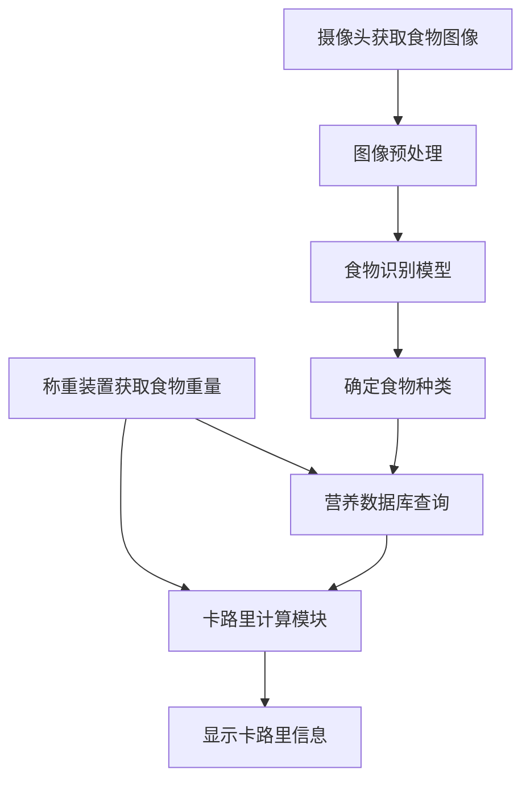

# 智能餐盘：AI Agent的食物识别与卡路里计算

> 关键词：智能餐盘、AI Agent、食物识别、卡路里计算、计算机视觉、深度学习、营养分析

> 摘要：本文围绕智能餐盘这一创新应用，深入探讨了利用AI Agent实现食物识别与卡路里计算的相关技术。首先介绍了智能餐盘的背景，包括其目的、预期读者和文档结构等。接着阐述了核心概念与联系，涵盖食物识别和卡路里计算的原理与架构。详细讲解了核心算法原理及具体操作步骤，结合Python源代码进行说明。通过数学模型和公式对计算过程进行了理论推导和举例。在项目实战部分，给出了开发环境搭建、源代码实现与解读。分析了智能餐盘的实际应用场景，并推荐了相关的学习资源、开发工具框架和论文著作。最后总结了未来发展趋势与挑战，还提供了常见问题解答和扩展阅读参考资料，旨在为读者全面呈现智能餐盘技术的全貌。

## 1. 背景介绍 
### 1.1 目的和范围
智能餐盘的开发目的在于为人们提供一种便捷、准确的方式来了解所摄入食物的种类和卡路里信息。在当今注重健康和营养的时代，人们对于自身饮食的关注度不断提高，而传统的食物记录和卡路里计算方式往往繁琐且不准确。智能餐盘利用先进的AI技术，能够自动识别餐盘内的食物，并快速计算出相应的卡路里含量，为用户提供实时、个性化的营养分析。

本文档的范围主要涵盖智能餐盘的技术原理、算法实现、项目实战以及实际应用等方面。详细介绍了如何利用计算机视觉和深度学习技术实现食物识别，以及如何根据食物种类计算卡路里。同时，通过项目实战部分展示了智能餐盘系统的开发过程，包括环境搭建、代码实现和分析。

### 1.2 预期读者
本文的预期读者包括对人工智能、计算机视觉、营养分析等领域感兴趣的技术爱好者，从事相关领域研究和开发的专业人员，以及关注健康饮食并希望了解智能餐盘技术的普通用户。对于技术爱好者来说，本文可以提供深入的技术原理和实现细节，满足他们对新技术的探索欲望；对于专业人员，可作为技术参考和项目开发的指导；对于普通用户，则能帮助他们理解智能餐盘的工作原理和优势，从而更好地利用这一技术来管理自己的饮食健康。

### 1.3 文档结构概述
本文将按照以下结构进行组织：
- 核心概念与联系：介绍食物识别和卡路里计算的基本原理和架构，通过文本示意图和Mermaid流程图进行直观展示。
- 核心算法原理 & 具体操作步骤：详细讲解实现食物识别和卡路里计算的核心算法，结合Python源代码进行说明。
- 数学模型和公式 & 详细讲解 & 举例说明：给出相关的数学模型和公式，对计算过程进行理论推导和举例。
- 项目实战：代码实际案例和详细解释说明：包括开发环境搭建、源代码实现和解读，展示智能餐盘系统的开发过程。
- 实际应用场景：分析智能餐盘在不同场景下的应用，如家庭、餐厅、学校等。
- 工具和资源推荐：推荐相关的学习资源、开发工具框架和论文著作，帮助读者进一步深入学习和研究。
- 总结：未来发展趋势与挑战：总结智能餐盘技术的发展趋势，分析面临的挑战和问题。
- 附录：常见问题与解答：提供常见问题的解答，帮助读者解决遇到的疑问。
- 扩展阅读 & 参考资料：列出相关的扩展阅读资料和参考来源，方便读者进一步查阅。

### 1.4 术语表
#### 1.4.1 核心术语定义
- **智能餐盘**：一种集成了计算机视觉和AI技术的餐盘，能够自动识别餐盘内的食物，并计算其卡路里含量。
- **AI Agent**：人工智能代理，是一种能够感知环境、做出决策并采取行动的智能实体。在智能餐盘系统中，AI Agent负责食物识别和卡路里计算等任务。
- **食物识别**：利用计算机视觉技术，对图像中的食物进行分类和识别，确定其种类。
- **卡路里计算**：根据食物的种类和重量，计算出其所含的卡路里数量。
- **计算机视觉**：一门研究如何使机器“看”的科学，通过图像和视频分析，让计算机理解和解释视觉信息。
- **深度学习**：一种基于人工神经网络的机器学习方法，能够自动从大量数据中学习特征和模式，在图像识别等领域取得了显著的成果。

#### 1.4.2 相关概念解释
- **卷积神经网络（CNN）**：一种专门用于处理具有网格结构数据（如图像）的深度学习模型。CNN通过卷积层、池化层等结构，自动提取图像的特征，从而实现图像分类和识别。
- **目标检测**：在图像或视频中检测出特定目标的位置和类别。在食物识别中，目标检测可以帮助定位餐盘内的食物区域。
- **图像分割**：将图像中的不同对象分割开来，得到每个对象的像素级掩码。在食物识别中，图像分割可以帮助分离出不同的食物。
- **营养数据库**：存储各种食物的营养信息（如卡路里、蛋白质、脂肪等）的数据库。在卡路里计算中，需要查询营养数据库来获取食物的卡路里含量。

#### 1.4.3 缩略词列表
- **CNN**：Convolutional Neural Network（卷积神经网络）
- **AI**：Artificial Intelligence（人工智能）
- **RGB**：Red, Green, Blue（红绿蓝，图像的颜色模式）
- **API**：Application Programming Interface（应用程序编程接口）

## 2. 核心概念与联系 

### 食物识别原理
食物识别是智能餐盘系统的核心功能之一，其主要原理是利用计算机视觉和深度学习技术对餐盘内的食物图像进行分析和处理。具体来说，首先通过摄像头获取食物图像，然后对图像进行预处理，如调整大小、归一化等，以提高后续处理的效率和准确性。接着，将预处理后的图像输入到预训练的卷积神经网络（CNN）中，CNN会自动提取图像的特征，并根据这些特征对食物进行分类和识别。

### 卡路里计算原理
卡路里计算是在食物识别的基础上进行的。一旦识别出食物的种类，系统会查询营养数据库，获取该食物每单位重量的卡路里含量。然后，通过称重装置获取食物的重量，将食物的重量乘以每单位重量的卡路里含量，即可计算出该食物的卡路里数量。最后，将餐盘内所有食物的卡路里数量相加，得到总卡路里含量。

### 核心概念架构示意图
以下是智能餐盘系统的核心概念架构示意图：

```plaintext
+----------------+          +----------------+          +----------------+
|  摄像头         | -------> |  图像预处理    | -------> |  食物识别模型  |
+----------------+          +----------------+          +----------------+
                                                           |
                                                           v
+----------------+          +----------------+          +----------------+
|  称重装置       | -------> |  营养数据库    | -------> |  卡路里计算模块|
+----------------+          +----------------+          +----------------+
                                                           |
                                                           v
+----------------+
|  用户界面       |
+----------------+
```

### Mermaid流程图


## 3. 核心算法原理 & 具体操作步骤 

### 食物识别算法原理
食物识别主要使用卷积神经网络（CNN）。CNN是一种前馈神经网络，它通过卷积层、池化层和全连接层等结构，自动提取图像的特征。以下是一个简单的CNN模型的Python代码示例：

```python
import torch
import torch.nn as nn
import torch.nn.functional as F

class FoodRecognitionCNN(nn.Module):
    def __init__(self, num_classes):
        super(FoodRecognitionCNN, self).__init__()
        self.conv1 = nn.Conv2d(3, 16, kernel_size=3, padding=1)
        self.pool = nn.MaxPool2d(2, 2)
        self.conv2 = nn.Conv2d(16, 32, kernel_size=3, padding=1)
        self.fc1 = nn.Linear(32 * 56 * 56, 128)
        self.fc2 = nn.Linear(128, num_classes)

    def forward(self, x):
        x = self.pool(F.relu(self.conv1(x)))
        x = self.pool(F.relu(self.conv2(x)))
        x = x.view(-1, 32 * 56 * 56)
        x = F.relu(self.fc1(x))
        x = self.fc2(x)
        return x
```

### 具体操作步骤
1. **数据收集**：收集大量的食物图像数据，并进行标注，标注信息包括食物的种类。
2. **数据预处理**：对收集到的图像数据进行预处理，如调整大小、归一化等。以下是一个简单的数据预处理代码示例：

```python
import torchvision.transforms as transforms

transform = transforms.Compose([
    transforms.Resize((224, 224)),
    transforms.ToTensor(),
    transforms.Normalize(mean=[0.485, 0.456, 0.406], std=[0.229, 0.224, 0.225])
])
```

3. **模型训练**：使用预处理后的数据对CNN模型进行训练。以下是一个简单的模型训练代码示例：

```python
import torch.optim as optim

# 初始化模型
model = FoodRecognitionCNN(num_classes=10)

# 定义损失函数和优化器
criterion = nn.CrossEntropyLoss()
optimizer = optim.SGD(model.parameters(), lr=0.001, momentum=0.9)

# 训练模型
for epoch in range(10):
    running_loss = 0.0
    for i, data in enumerate(trainloader, 0):
        inputs, labels = data
        optimizer.zero_grad()
        outputs = model(inputs)
        loss = criterion(outputs, labels)
        loss.backward()
        optimizer.step()
        running_loss += loss.item()
    print(f'Epoch {epoch + 1}, Loss: {running_loss / len(trainloader)}')
```

4. **模型评估**：使用测试数据对训练好的模型进行评估，计算模型的准确率等指标。以下是一个简单的模型评估代码示例：

```python
correct = 0
total = 0
with torch.no_grad():
    for data in testloader:
        images, labels = data
        outputs = model(images)
        _, predicted = torch.max(outputs.data, 1)
        total += labels.size(0)
        correct += (predicted == labels).sum().item()

print(f'Accuracy of the network on the test images: {100 * correct / total}%')
```

5. **食物识别**：使用训练好的模型对新的食物图像进行识别。以下是一个简单的食物识别代码示例：

```python
import cv2
import numpy as np

# 加载模型
model = FoodRecognitionCNN(num_classes=10)
model.load_state_dict(torch.load('food_recognition_model.pth'))
model.eval()

# 读取图像
image = cv2.imread('test_image.jpg')
image = cv2.cvtColor(image, cv2.COLOR_BGR2RGB)
image = transform(image).unsqueeze(0)

# 进行识别
with torch.no_grad():
    outputs = model(image)
    _, predicted = torch.max(outputs.data, 1)
    print(f'Predicted food class: {predicted.item()}')
```

### 卡路里计算算法原理
卡路里计算的原理是根据食物的种类和重量，查询营养数据库，获取该食物每单位重量的卡路里含量，然后将食物的重量乘以每单位重量的卡路里含量，得到该食物的卡路里数量。以下是一个简单的卡路里计算代码示例：

```python
# 营养数据库示例
nutrition_database = {
    'apple': 52,  # 每100克苹果的卡路里含量
    'banana': 89,
    'chicken': 165
}

def calculate_calories(food_name, weight):
    if food_name in nutrition_database:
        calories_per_100g = nutrition_database[food_name]
        calories = (weight / 100) * calories_per_100g
        return calories
    else:
        return 0
```

## 4. 数学模型和公式 & 详细讲解 & 举例说明 

### 食物识别的数学模型
在食物识别中，卷积神经网络（CNN）的数学模型可以表示为一个复合函数。假设输入图像为 $x$，经过卷积层、池化层和全连接层等操作后，输出的预测结果为 $y$。则CNN的数学模型可以表示为：

$$y = f_{fc}(f_{pool}(f_{conv}(x)))$$

其中，$f_{conv}$ 表示卷积层的操作，$f_{pool}$ 表示池化层的操作，$f_{fc}$ 表示全连接层的操作。

### 卡路里计算的数学公式
卡路里计算的数学公式非常简单。假设食物的种类为 $i$，其每单位重量的卡路里含量为 $c_i$（单位：千卡/100克），食物的重量为 $w$（单位：克），则该食物的卡路里数量 $C$ 可以表示为：

$$C = \frac{w}{100} \times c_i$$

### 举例说明
假设我们识别出餐盘内有一个苹果，称重后得到苹果的重量为150克。根据营养数据库，苹果每100克的卡路里含量为52千卡。则该苹果的卡路里数量为：

$$C = \frac{150}{100} \times 52 = 78 \text{ 千卡}$$

## 5. 项目实战：代码实际案例和详细解释说明 

### 5.1  开发环境搭建
1. **安装Python**：建议使用Python 3.7及以上版本。可以从Python官方网站（https://www.python.org/downloads/）下载并安装。
2. **安装深度学习框架**：本文使用PyTorch作为深度学习框架。可以根据自己的系统和CUDA版本，从PyTorch官方网站（https://pytorch.org/get-started/locally/）选择合适的安装命令进行安装。例如，在Windows系统上使用CPU进行训练，可以使用以下命令安装：

```bash
pip install torch torchvision torchaudio
```

3. **安装其他依赖库**：还需要安装一些其他的依赖库，如OpenCV、NumPy等。可以使用以下命令进行安装：

```bash
pip install opencv-python numpy
```

### 5.2  源代码详细实现和代码解读
以下是一个完整的智能餐盘系统的源代码示例，包括食物识别和卡路里计算：

```python
import torch
import torch.nn as nn
import torch.nn.functional as F
import torch.optim as optim
import torchvision.transforms as transforms
import cv2
import numpy as np

# 定义CNN模型
class FoodRecognitionCNN(nn.Module):
    def __init__(self, num_classes):
        super(FoodRecognitionCNN, self).__init__()
        self.conv1 = nn.Conv2d(3, 16, kernel_size=3, padding=1)
        self.pool = nn.MaxPool2d(2, 2)
        self.conv2 = nn.Conv2d(16, 32, kernel_size=3, padding=1)
        self.fc1 = nn.Linear(32 * 56 * 56, 128)
        self.fc2 = nn.Linear(128, num_classes)

    def forward(self, x):
        x = self.pool(F.relu(self.conv1(x)))
        x = self.pool(F.relu(self.conv2(x)))
        x = x.view(-1, 32 * 56 * 56)
        x = F.relu(self.fc1(x))
        x = self.fc2(x)
        return x

# 数据预处理
transform = transforms.Compose([
    transforms.Resize((224, 224)),
    transforms.ToTensor(),
    transforms.Normalize(mean=[0.485, 0.456, 0.406], std=[0.229, 0.224, 0.225])
])

# 营养数据库示例
nutrition_database = {
    'apple': 52,  # 每100克苹果的卡路里含量
    'banana': 89,
    'chicken': 165
}

# 卡路里计算函数
def calculate_calories(food_name, weight):
    if food_name in nutrition_database:
        calories_per_100g = nutrition_database[food_name]
        calories = (weight / 100) * calories_per_100g
        return calories
    else:
        return 0

# 食物识别函数
def recognize_food(image_path, model):
    image = cv2.imread(image_path)
    image = cv2.cvtColor(image, cv2.COLOR_BGR2RGB)
    image = transform(image).unsqueeze(0)
    with torch.no_grad():
        outputs = model(image)
        _, predicted = torch.max(outputs.data, 1)
        food_classes = ['apple', 'banana', 'chicken']  # 假设的食物类别列表
        food_name = food_classes[predicted.item()]
        return food_name

# 主函数
def main():
    # 初始化模型
    model = FoodRecognitionCNN(num_classes=3)
    model.load_state_dict(torch.load('food_recognition_model.pth'))
    model.eval()

    # 食物图像路径
    image_path = 'test_image.jpg'

    # 识别食物
    food_name = recognize_food(image_path, model)

    # 假设的食物重量（单位：克）
    weight = 150

    # 计算卡路里
    calories = calculate_calories(food_name, weight)

    print(f'识别出的食物：{food_name}')
    print(f'食物重量：{weight} 克')
    print(f'卡路里含量：{calories} 千卡')

if __name__ == '__main__':
    main()
```

### 5.3  代码解读与分析
1. **模型定义**：`FoodRecognitionCNN` 类定义了一个简单的CNN模型，包括卷积层、池化层和全连接层。
2. **数据预处理**：`transform` 定义了数据预处理的操作，包括调整大小、转换为张量和归一化。
3. **营养数据库**：`nutrition_database` 是一个字典，存储了不同食物每100克的卡路里含量。
4. **卡路里计算函数**：`calculate_calories` 函数根据食物的种类和重量，计算出该食物的卡路里数量。
5. **食物识别函数**：`recognize_food` 函数读取食物图像，进行预处理，然后使用训练好的模型进行识别，返回识别出的食物名称。
6. **主函数**：`main` 函数初始化模型，调用 `recognize_food` 函数进行食物识别，然后调用 `calculate_calories` 函数计算卡路里，并输出结果。

## 6. 实际应用场景 
### 家庭场景
在家庭场景中，智能餐盘可以帮助家庭成员更好地管理饮食健康。例如，家长可以使用智能餐盘来了解孩子每天摄入的食物种类和卡路里数量，确保孩子的饮食均衡。同时，对于关注健康的人士来说，智能餐盘可以帮助他们控制卡路里摄入量，实现减肥或保持健康体重的目标。

### 餐厅场景
在餐厅场景中，智能餐盘可以为顾客提供更加个性化的服务。例如，餐厅可以在餐盘上安装智能设备，顾客在点餐时可以通过智能餐盘了解每道菜的卡路里含量和营养信息，从而做出更加健康的选择。此外，智能餐盘还可以帮助餐厅管理食材库存，根据顾客的点餐情况及时调整食材采购计划。

### 学校场景
在学校场景中，智能餐盘可以用于学生的营养管理。学校可以为学生配备智能餐盘，记录学生每天的饮食情况，生成营养报告。学校可以根据营养报告，调整食堂的食谱，确保学生摄入足够的营养。同时，智能餐盘还可以帮助学校进行食品安全管理，通过对食物图像的分析，检测食物是否存在变质等问题。

### 健身场所场景
在健身场所场景中，智能餐盘可以帮助健身者更好地控制饮食。健身者可以使用智能餐盘来记录自己的饮食摄入，根据自己的健身目标（如增肌、减脂等）调整饮食计划。健身教练也可以通过智能餐盘了解学员的饮食情况，为学员提供更加专业的饮食建议。

## 7. 工具和资源推荐
### 7.1 学习资源推荐
#### 7.1.1 书籍推荐
- 《深度学习》（Deep Learning）：由Ian Goodfellow、Yoshua Bengio和Aaron Courville所著，是深度学习领域的经典教材，全面介绍了深度学习的理论和方法。
- 《Python深度学习》（Deep Learning with Python）：由Francois Chollet所著，通过实际案例介绍了如何使用Python和Keras进行深度学习开发。
- 《计算机视觉：算法与应用》（Computer Vision: Algorithms and Applications）：由Richard Szeliski所著，系统介绍了计算机视觉的基本算法和应用。

#### 7.1.2 在线课程
- Coursera上的“深度学习专项课程”（Deep Learning Specialization）：由Andrew Ng教授授课，包括神经网络和深度学习、改善深层神经网络、结构化机器学习项目等多个课程，全面介绍了深度学习的理论和实践。
- edX上的“计算机视觉基础”（Foundations of Computer Vision）：由UC Berkeley的教授授课，介绍了计算机视觉的基本概念、算法和应用。
- 中国大学MOOC上的“人工智能导论”：由国内多所高校的教授授课，介绍了人工智能的基本概念、技术和应用。

#### 7.1.3 技术博客和网站
- Medium：是一个技术博客平台，上面有很多关于人工智能、计算机视觉等领域的优秀文章。
- arXiv：是一个预印本服务器，上面有很多最新的学术论文，包括人工智能、计算机视觉等领域的研究成果。
- OpenAI Blog：OpenAI的官方博客，上面有很多关于人工智能的最新研究和应用案例。

### 7.2 开发工具框架推荐
#### 7.2.1 IDE和编辑器
- PyCharm：是一款专门用于Python开发的集成开发环境（IDE），提供了代码编辑、调试、版本控制等功能，非常适合深度学习开发。
- Jupyter Notebook：是一个交互式笔记本，支持Python、R等多种编程语言，非常适合数据探索、模型训练和可视化等任务。
- Visual Studio Code：是一款轻量级的代码编辑器，支持多种编程语言和插件，非常适合快速开发和调试。

#### 7.2.2 调试和性能分析工具
- TensorBoard：是TensorFlow的可视化工具，可以帮助用户可视化模型的训练过程、损失函数曲线、准确率曲线等信息，方便用户进行调试和优化。
- PyTorch Profiler：是PyTorch的性能分析工具，可以帮助用户分析模型的性能瓶颈，找出耗时较长的操作，从而进行优化。
- NVIDIA Nsight Systems：是NVIDIA提供的性能分析工具，可以帮助用户分析GPU程序的性能，找出GPU利用率低的原因，从而进行优化。

#### 7.2.3 相关框架和库
- PyTorch：是一个开源的深度学习框架，提供了丰富的神经网络层和优化算法，支持GPU加速，非常适合深度学习开发。
- TensorFlow：是一个开源的深度学习框架，由Google开发，提供了高级的API和分布式训练功能，广泛应用于工业界和学术界。
- OpenCV：是一个开源的计算机视觉库，提供了丰富的图像处理和计算机视觉算法，如图像滤波、特征提取、目标检测等，非常适合计算机视觉开发。

### 7.3 相关论文著作推荐
#### 7.3.1 经典论文
- “ImageNet Classification with Deep Convolutional Neural Networks”：由Alex Krizhevsky、Ilya Sutskever和Geoffrey Hinton所著，介绍了AlexNet网络，开启了深度学习在计算机视觉领域的革命。
- “Very Deep Convolutional Networks for Large-Scale Image Recognition”：由Karen Simonyan和Andrew Zisserman所著，介绍了VGG网络，提出了使用非常深的卷积神经网络进行图像分类的方法。
- “Going Deeper with Convolutions”：由Christian Szegedy等人所著，介绍了GoogLeNet网络，提出了Inception模块，提高了网络的计算效率和准确率。

#### 7.3.2 最新研究成果
- 关注arXiv上关于食物识别、计算机视觉和深度学习的最新论文，了解最新的研究进展和技术趋势。
- 参加相关的学术会议，如CVPR（计算机视觉与模式识别会议）、ICCV（国际计算机视觉会议）等，了解最新的研究成果和应用案例。

#### 7.3.3 应用案例分析
- 关注各大科技公司的博客和技术报告，了解他们在智能餐盘、食物识别等领域的应用案例和实践经验。
- 阅读相关的行业报告和研究论文，了解智能餐盘技术在不同行业的应用现状和发展趋势。

## 8. 总结：未来发展趋势与挑战
### 未来发展趋势
1. **更高的识别准确率**：随着深度学习技术的不断发展和数据集的不断扩充，智能餐盘的食物识别准确率将不断提高，能够识别更多种类的食物。
2. **更丰富的功能**：智能餐盘将不仅仅局限于食物识别和卡路里计算，还将具备更多的功能，如食物新鲜度检测、营养成分分析、饮食建议推荐等。
3. **与其他设备的集成**：智能餐盘将与其他智能设备（如智能手表、智能健康监测设备等）进行集成，实现数据共享和交互，为用户提供更加全面的健康管理服务。
4. **个性化服务**：根据用户的个人信息（如年龄、性别、身体状况、运动习惯等），智能餐盘将提供更加个性化的饮食建议和营养分析，满足用户的个性化需求。

### 挑战
1. **数据标注难题**：食物识别需要大量的标注数据，而食物种类繁多，数据标注的工作量非常大，且标注的准确性也会影响模型的性能。
2. **复杂场景下的识别**：在实际应用中，食物的摆放、光照条件、遮挡等因素都会影响食物识别的准确性，如何在复杂场景下实现准确的食物识别是一个挑战。
3. **营养数据库的更新和完善**：营养数据库需要不断更新和完善，以确保卡路里计算的准确性。然而，食物的营养成分会受到产地、品种、烹饪方式等因素的影响，如何建立一个准确、全面的营养数据库是一个挑战。
4. **用户隐私和数据安全**：智能餐盘需要收集用户的饮食数据，这些数据涉及用户的隐私和健康信息，如何保障用户的隐私和数据安全是一个重要的问题。

## 9. 附录：常见问题与解答
### 1. 智能餐盘的食物识别准确率有多高？
智能餐盘的食物识别准确率受到多种因素的影响，如数据集的质量和规模、模型的复杂度、食物的种类和形态等。一般来说，在理想条件下，智能餐盘的食物识别准确率可以达到80%以上，但在实际应用中，由于复杂场景的影响，准确率可能会有所下降。

### 2. 智能餐盘的卡路里计算准确吗？
智能餐盘的卡路里计算是基于食物的种类和重量，以及营养数据库中的数据。由于食物的营养成分会受到产地、品种、烹饪方式等因素的影响，营养数据库中的数据可能存在一定的误差。因此，智能餐盘的卡路里计算结果只能作为参考，不能完全替代专业的营养分析。

### 3. 智能餐盘可以识别哪些食物？
智能餐盘可以识别的食物种类取决于其训练数据集。一般来说，训练数据集包含的食物种类越多，智能餐盘可以识别的食物种类也就越多。目前，一些智能餐盘可以识别数百种常见的食物。

### 4. 智能餐盘的使用方法复杂吗？
智能餐盘的使用方法通常比较简单。一般来说，用户只需要将食物放在餐盘上，等待摄像头拍摄图像，然后智能餐盘就会自动进行食物识别和卡路里计算，并将结果显示在屏幕上或通过手机APP展示给用户。

### 5. 智能餐盘的价格贵吗？
智能餐盘的价格因品牌、功能、性能等因素而异。目前，市场上的智能餐盘价格从几百元到数千元不等。随着技术的不断发展和成本的不断降低，智能餐盘的价格有望逐渐下降。

## 10. 扩展阅读 & 参考资料
### 扩展阅读
- 《人工智能：现代方法》（Artificial Intelligence: A Modern Approach）：全面介绍了人工智能的基本概念、技术和应用，是人工智能领域的经典教材。
- 《机器之心》（The Master Algorithm）：探讨了机器学习的发展趋势和未来方向，提出了统一的机器学习算法的概念。
- 《人类简史：从动物到上帝》（Sapiens: A Brief History of Humankind）：从人类的进化和发展角度，探讨了人工智能对人类社会的影响。

### 参考资料
- [PyTorch官方文档](https://pytorch.org/docs/stable/index.html)
- [OpenCV官方文档](https://docs.opencv.org/master/)
- [TensorFlow官方文档](https://www.tensorflow.org/api_docs)
- [相关学术论文和研究报告]（可根据具体引用的论文和报告列出详细信息）