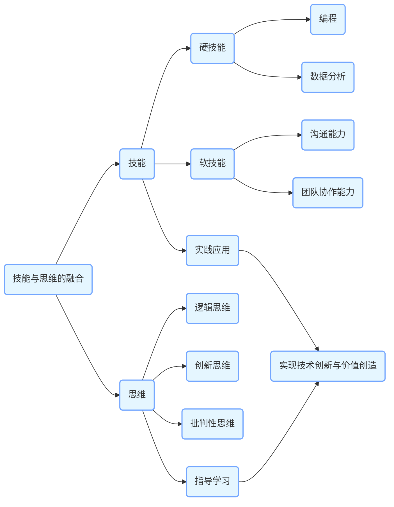

# 未来的技术工作者：技能与思维的融合

> 关键词：未来技术工作者、技能、思维、融合、数字化转型、创新能力、跨学科合作

> 摘要：随着科技的飞速发展，未来的技术工作者面临着前所未有的挑战与机遇。本文旨在探讨未来技术工作者所需具备的技能与思维，并深入分析两者融合的重要性和实现途径。通过对核心概念的阐述、算法原理的讲解、数学模型的分析以及项目实战案例的展示，揭示技能与思维融合在实际工作中的应用。同时，介绍相关的实际应用场景、工具和资源，展望未来技术工作者的发展趋势与挑战，为有志于从事技术领域的人士提供全面而深入的参考。

## 1. 背景介绍 
### 1.1 目的和范围
本文章的目的在于全面探讨未来技术工作者应具备的技能与思维，以及如何实现两者的有效融合。范围涵盖了从基础概念的解释到实际应用场景的分析，从技术原理的阐述到开发工具和资源的推荐，旨在为读者提供一个系统而深入的了解未来技术工作者职业发展的视角。

### 1.2 预期读者
本文预期读者包括正在学习或从事技术领域工作的人员，如程序员、软件工程师、人工智能专家等；对技术行业发展趋势感兴趣的研究者和学者；以及希望了解未来职业发展方向的学生和求职者。

### 1.3 文档结构概述
本文将按照以下结构展开：首先介绍相关背景知识，包括目的、预期读者和文档结构概述等；接着阐述核心概念与联系，通过文本示意图和 Mermaid 流程图进行清晰展示；然后讲解核心算法原理和具体操作步骤，并使用 Python 源代码详细阐述；随后分析数学模型和公式，并举例说明；再通过项目实战案例展示代码实现和详细解释；介绍实际应用场景；推荐相关的工具和资源；最后总结未来发展趋势与挑战，提供常见问题与解答以及扩展阅读和参考资料。

### 1.4 术语表
#### 1.4.1 核心术语定义
- **技能**：指在特定领域中完成任务所需的专业能力和操作技巧，如编程语言掌握、算法设计能力等。
- **思维**：包括逻辑思维、创新思维、批判性思维等，是解决问题、进行决策和创造价值的思考方式。
- **融合**：将技能和思维有机结合，使两者相互促进、协同发挥作用，以更好地应对复杂的技术问题和挑战。

#### 1.4.2 相关概念解释
- **数字化转型**：企业或组织利用数字技术对业务流程、产品和服务进行全面变革和优化的过程。
- **跨学科合作**：不同学科背景的人员共同合作，整合各自的专业知识和技能，解决复杂问题的工作模式。

#### 1.4.3 缩略词列表
- **AI**：Artificial Intelligence，人工智能
- **ML**：Machine Learning，机器学习
- **DL**：Deep Learning，深度学习
- **IDE**：Integrated Development Environment，集成开发环境

## 2. 核心概念与联系 

### 技能的分类与特点
技能可以分为硬技能和软技能。硬技能是指具体的技术能力，如编程、数据分析、网络工程等。这些技能通常具有明确的操作规范和技术标准，通过学习和实践可以逐步掌握。例如，掌握一门编程语言（如 Python、Java 等）需要学习其语法规则、数据结构和算法等基础知识，并通过编写代码不断练习来提高编程能力。

软技能则包括沟通能力、团队协作能力、问题解决能力等。这些技能虽然难以用具体的技术指标来衡量，但对于技术工作者的职业发展至关重要。例如，在一个大型项目中，良好的沟通能力可以确保团队成员之间信息的有效传递，避免误解和冲突，提高工作效率。

### 思维的类型与作用
思维方式对技术工作者的工作效果有着深远的影响。逻辑思维能够帮助技术工作者进行严谨的推理和分析，确保技术方案的合理性和可行性。例如，在算法设计中，逻辑思维可以帮助我们理清问题的本质，设计出高效的算法流程。

创新思维则是推动技术进步和产品创新的关键。在快速变化的技术领域，只有不断创新，才能满足用户日益增长的需求，保持竞争优势。例如，互联网行业的很多创新产品，如共享经济、短视频应用等，都是创新思维的产物。

批判性思维使技术工作者能够对现有技术和方案进行客观的评价和反思，发现其中的问题和不足，并提出改进的建议。例如，在评估一个机器学习模型时，批判性思维可以帮助我们分析模型的性能指标、适用场景和潜在风险，从而做出更明智的决策。

### 技能与思维的联系
技能和思维是相互依存、相互促进的关系。一方面，技能是思维的实践基础。只有掌握了扎实的技术技能，才能将思维中的创意和想法转化为实际的产品或解决方案。例如，一个具有创新思维的程序员，如果不掌握相应的编程技能，就无法将自己的创新想法实现为软件产品。

另一方面，思维是技能的提升动力。良好的思维方式可以帮助技术工作者更好地理解和掌握技能，提高学习效率和应用能力。例如，逻辑思维可以帮助我们更系统地学习编程语言的知识，创新思维可以促使我们探索新的技术应用场景，提高技能的应用价值。

### 文本示意图
```plaintext
           技能与思维的融合
                |
       +------------------+
       |                  |
    技能                 思维
       |                  |
+--------------+     +--------------+
| 硬技能        |     | 逻辑思维     |
| 软技能        |     | 创新思维     |
| （编程、数据  |     | 批判性思维   |
| 分析等）      |     |              |
+--------------+     +--------------+
       |                  |
       |                  |
       V                  V
  实践应用              指导学习
       |                  |
       |                  |
       +------------------+
                |
       实现技术创新与价值创造
```

### Mermaid 流程图


## 3. 核心算法原理 & 具体操作步骤 

### 以机器学习中的线性回归算法为例讲解核心算法原理
线性回归是一种简单而常用的机器学习算法，用于建立自变量和因变量之间的线性关系模型。其基本思想是通过最小化预测值与真实值之间的误差，找到一条最优的直线来拟合数据。

#### 算法原理
假设我们有一组数据集 $\{(x_1, y_1), (x_2, y_2), \cdots, (x_n, y_n)\}$，其中 $x_i$ 是自变量，$y_i$ 是因变量。线性回归模型的表达式为：

$y = \theta_0 + \theta_1x$

其中，$\theta_0$ 是截距，$\theta_1$ 是斜率，它们是需要通过训练数据来确定的参数。

为了找到最优的参数 $\theta_0$ 和 $\theta_1$，我们通常使用最小二乘法。最小二乘法的目标是最小化预测值与真实值之间的平方误差之和，即损失函数：

$J(\theta_0, \theta_1) = \frac{1}{2n} \sum_{i=1}^{n} (y_i - (\theta_0 + \theta_1x_i))^2$

通过对损失函数求偏导数，并令其等于 0，可以得到最优参数的计算公式：

$\theta_1 = \frac{\sum_{i=1}^{n} (x_i - \bar{x})(y_i - \bar{y})}{\sum_{i=1}^{n} (x_i - \bar{x})^2}$

$\theta_0 = \bar{y} - \theta_1\bar{x}$

其中，$\bar{x}$ 和 $\bar{y}$ 分别是自变量和因变量的均值。

#### Python 源代码实现
```python
import numpy as np

def linear_regression(x, y):
    """
    线性回归算法实现
    :param x: 自变量数组
    :param y: 因变量数组
    :return: 截距和斜率
    """
    n = len(x)
    x_mean = np.mean(x)
    y_mean = np.mean(y)

    numerator = np.sum((x - x_mean) * (y - y_mean))
    denominator = np.sum((x - x_mean) ** 2)

    theta_1 = numerator / denominator
    theta_0 = y_mean - theta_1 * x_mean

    return theta_0, theta_1

# 示例数据
x = np.array([1, 2, 3, 4, 5])
y = np.array([2, 4, 6, 8, 10])

# 调用线性回归函数
theta_0, theta_1 = linear_regression(x, y)

print(f"截距: {theta_0}")
print(f"斜率: {theta_1}")
```

### 具体操作步骤
1. **数据准备**：收集和整理需要分析的数据集，将自变量和因变量分别存储在数组中。
2. **数据预处理**：对数据进行清洗、归一化等预处理操作，以提高算法的性能和稳定性。
3. **算法实现**：根据线性回归算法的原理，编写代码实现算法。
4. **模型训练**：将预处理后的数据输入到算法中，计算最优参数。
5. **模型评估**：使用评估指标（如均方误差、决定系数等）对模型的性能进行评估。
6. **模型应用**：将训练好的模型应用到新的数据上，进行预测和分析。

## 4. 数学模型和公式 & 详细讲解 & 举例说明 

### 线性回归的数学模型和公式
线性回归的数学模型可以表示为：

$y = \theta_0 + \theta_1x + \epsilon$

其中，$\epsilon$ 是误差项，服从均值为 0，方差为 $\sigma^2$ 的正态分布。

损失函数 $J(\theta_0, \theta_1)$ 的计算公式为：

$J(\theta_0, \theta_1) = \frac{1}{2n} \sum_{i=1}^{n} (y_i - (\theta_0 + \theta_1x_i))^2$

### 详细讲解
损失函数 $J(\theta_0, \theta_1)$ 衡量了模型预测值与真实值之间的误差。我们的目标是找到一组参数 $\theta_0$ 和 $\theta_1$，使得损失函数的值最小。通过对损失函数求偏导数，并令其等于 0，可以得到最优参数的计算公式。

对 $J(\theta_0, \theta_1)$ 求关于 $\theta_0$ 的偏导数：

$\frac{\partial J(\theta_0, \theta_1)}{\partial \theta_0} = \frac{1}{n} \sum_{i=1}^{n} (y_i - (\theta_0 + \theta_1x_i))(-1) = 0$

化简可得：

$\sum_{i=1}^{n} (y_i - \theta_0 - \theta_1x_i) = 0$

$n\theta_0 + \theta_1\sum_{i=1}^{n} x_i = \sum_{i=1}^{n} y_i$

$\theta_0 = \frac{\sum_{i=1}^{n} y_i - \theta_1\sum_{i=1}^{n} x_i}{n} = \bar{y} - \theta_1\bar{x}$

对 $J(\theta_0, \theta_1)$ 求关于 $\theta_1$ 的偏导数：

$\frac{\partial J(\theta_0, \theta_1)}{\partial \theta_1} = \frac{1}{n} \sum_{i=1}^{n} (y_i - (\theta_0 + \theta_1x_i))(-x_i) = 0$

将 $\theta_0 = \bar{y} - \theta_1\bar{x}$ 代入上式，化简可得：

$\theta_1 = \frac{\sum_{i=1}^{n} (x_i - \bar{x})(y_i - \bar{y})}{\sum_{i=1}^{n} (x_i - \bar{x})^2}$

### 举例说明
假设我们有以下数据集：

| $x$ | $y$ |
| --- | --- |
| 1 | 2 |
| 2 | 4 |
| 3 | 6 |
| 4 | 8 |
| 5 | 10 |

首先，计算 $x$ 和 $y$ 的均值：

$\bar{x} = \frac{1 + 2 + 3 + 4 + 5}{5} = 3$

$\bar{y} = \frac{2 + 4 + 6 + 8 + 10}{5} = 6$

然后，计算分子和分母：

$\sum_{i=1}^{5} (x_i - \bar{x})(y_i - \bar{y}) = (1 - 3)(2 - 6) + (2 - 3)(4 - 6) + (3 - 3)(6 - 6) + (4 - 3)(8 - 6) + (5 - 3)(10 - 6) = 20$

$\sum_{i=1}^{5} (x_i - \bar{x})^2 = (1 - 3)^2 + (2 - 3)^2 + (3 - 3)^2 + (4 - 3)^2 + (5 - 3)^2 = 10$

最后，计算 $\theta_1$ 和 $\theta_0$：

$\theta_1 = \frac{20}{10} = 2$

$\theta_0 = 6 - 2 \times 3 = 0$

所以，线性回归模型为 $y = 2x$。

## 5. 项目实战：代码实际案例和详细解释说明 

### 5.1  开发环境搭建
本次项目实战使用 Python 语言进行开发，需要安装以下库：
- **NumPy**：用于数值计算和数组操作。
- **Matplotlib**：用于数据可视化。

可以使用以下命令安装所需库：

```sh
pip install numpy matplotlib
```

### 5.2  源代码详细实现和代码解读
```python
import numpy as np
import matplotlib.pyplot as plt

# 生成示例数据
np.random.seed(0)
x = np.linspace(0, 10, 100)
y = 2 * x + 1 + np.random.randn(100)

# 定义线性回归函数
def linear_regression(x, y):
    n = len(x)
    x_mean = np.mean(x)
    y_mean = np.mean(y)

    numerator = np.sum((x - x_mean) * (y - y_mean))
    denominator = np.sum((x - x_mean) ** 2)

    theta_1 = numerator / denominator
    theta_0 = y_mean - theta_1 * x_mean

    return theta_0, theta_1

# 调用线性回归函数
theta_0, theta_1 = linear_regression(x, y)

# 预测值
y_pred = theta_0 + theta_1 * x

# 绘制数据点和拟合直线
plt.scatter(x, y, label='Data Points')
plt.plot(x, y_pred, color='red', label='Fitted Line')
plt.xlabel('x')
plt.ylabel('y')
plt.title('Linear Regression')
plt.legend()
plt.show()

# 输出结果
print(f"截距: {theta_0}")
print(f"斜率: {theta_1}")
```

### 5.3  代码解读与分析
1. **数据生成**：使用 `np.linspace` 生成 0 到 10 之间的 100 个等间距的点作为自变量 $x$，然后根据线性关系 $y = 2x + 1$ 生成因变量 $y$，并添加一些随机噪声。
2. **线性回归函数**：定义 `linear_regression` 函数，实现线性回归算法的核心逻辑，计算截距和斜率。
3. **预测值计算**：根据计算得到的截距和斜率，计算预测值 $y_{pred}$。
4. **数据可视化**：使用 `matplotlib` 库绘制数据点和拟合直线，直观展示线性回归的结果。
5. **结果输出**：输出截距和斜率的值。

通过这个项目实战，我们可以看到如何使用线性回归算法对数据进行拟合，并通过可视化的方式展示结果。同时，也体现了技能（编程实现线性回归算法）和思维（理解线性回归的原理和应用场景）的融合。

## 6. 实际应用场景 

### 金融领域
在金融领域，线性回归可以用于预测股票价格、利率走势等。例如，分析师可以收集历史股票价格数据和相关的经济指标数据，使用线性回归模型建立两者之间的关系，从而预测未来股票价格的走势。同时，在风险管理中，线性回归可以用于评估资产之间的相关性，帮助投资者合理配置资产。

### 医疗领域
在医疗领域，线性回归可以用于分析疾病的发病率与环境因素、生活习惯等之间的关系。例如，研究人员可以收集不同地区的疾病发病率数据和当地的空气质量、饮食习惯等数据，使用线性回归模型分析这些因素对疾病发病率的影响，为疾病的预防和控制提供依据。

### 交通领域
在交通领域，线性回归可以用于预测交通流量、交通事故发生率等。例如，交通管理部门可以收集道路的交通流量数据和时间、天气等因素的数据，使用线性回归模型预测未来的交通流量，从而合理安排交通资源，提高交通效率。

### 工业制造领域
在工业制造领域，线性回归可以用于质量控制和生产优化。例如，制造商可以收集生产过程中的工艺参数和产品质量数据，使用线性回归模型分析工艺参数对产品质量的影响，从而调整工艺参数，提高产品质量和生产效率。

## 7. 工具和资源推荐
### 7.1 学习资源推荐
#### 7.1.1 书籍推荐
- 《Python 数据分析实战》：本书详细介绍了使用 Python 进行数据分析的方法和技巧，包括数据清洗、数据可视化、机器学习等内容，适合初学者和有一定基础的读者。
- 《机器学习》（周志华著）：这是一本经典的机器学习教材，系统地介绍了机器学习的基本概念、算法和应用，适合深入学习机器学习的读者。
- 《算法导论》：本书是算法领域的经典著作，全面介绍了各种算法的原理和实现，对于提高算法设计和分析能力有很大帮助。

#### 7.1.2 在线课程
- Coursera 上的《机器学习》课程（Andrew Ng 教授授课）：这是一门非常受欢迎的机器学习课程，通过视频讲解、编程作业和考试等方式，帮助学习者系统地掌握机器学习的知识和技能。
- edX 上的《Python 数据科学导论》课程：该课程介绍了使用 Python 进行数据科学的基本方法和工具，包括 NumPy、Pandas、Matplotlib 等库的使用。
- 中国大学 MOOC 上的《人工智能基础》课程：适合初学者了解人工智能的基本概念、技术和应用。

#### 7.1.3 技术博客和网站
- Medium：一个汇聚了众多技术专家和爱好者的博客平台，上面有很多关于技术领域的最新文章和见解。
- Stack Overflow：一个技术问答社区，开发者可以在上面提问、回答问题，解决遇到的技术难题。
- 开源中国：提供了丰富的开源项目和技术文章，对于了解国内的技术动态和开源项目有很大帮助。

### 7.2 开发工具框架推荐
#### 7.2.1 IDE和编辑器
- PyCharm：一款专业的 Python 集成开发环境，提供了代码编辑、调试、版本控制等功能，适合 Python 开发者使用。
- Visual Studio Code：一款轻量级的代码编辑器，支持多种编程语言，拥有丰富的插件扩展，可根据需要进行定制。
- Jupyter Notebook：一个交互式的编程环境，适合数据科学和机器学习领域的开发和实验，方便代码的编写、运行和展示。

#### 7.2.2 调试和性能分析工具
- PDB：Python 内置的调试器，可以帮助开发者定位代码中的错误和问题。
- cProfile：Python 内置的性能分析工具，可以分析代码的执行时间和函数调用关系，帮助优化代码性能。
- Py-Spy：一个轻量级的 Python 性能分析工具，无需修改代码即可进行性能分析，非常方便。

#### 7.2.3 相关框架和库
- NumPy：用于数值计算和数组操作的 Python 库，提供了高效的多维数组对象和各种数学函数。
- Pandas：用于数据处理和分析的 Python 库，提供了数据结构（如 DataFrame）和数据操作方法，方便数据的清洗、转换和分析。
- Scikit-learn：一个开源的机器学习库，提供了各种机器学习算法和工具，如分类、回归、聚类等，适合快速开发和实验机器学习模型。

### 7.3 相关论文著作推荐
#### 7.3.1 经典论文
- 《A Machine Learning Approach to Automated Stock Trading》：该论文介绍了使用机器学习方法进行股票交易的研究，提出了一种基于机器学习的股票交易策略。
- 《The Elements of Statistical Learning》：这是一本统计学习领域的经典著作，系统地介绍了统计学习的理论和方法，对于深入理解机器学习的原理有很大帮助。
- 《Pattern Recognition and Machine Learning》：本书全面介绍了模式识别和机器学习的基本概念、算法和应用，是该领域的重要参考文献。

#### 7.3.2 最新研究成果
- 关注顶级学术会议（如 NeurIPS、ICML、CVPR 等）上的最新研究成果，了解机器学习、人工智能等领域的前沿技术和发展趋势。
- 查阅相关学术期刊（如 Journal of Machine Learning Research、Artificial Intelligence 等）上的最新论文，获取最新的研究动态和创新成果。

#### 7.3.3 应用案例分析
- 研究一些成功的技术应用案例，如 Google 的搜索算法、阿里巴巴的电商推荐系统等，了解这些系统的技术架构、算法实现和应用效果，从中汲取经验和灵感。

## 8. 总结：未来发展趋势与挑战

### 未来发展趋势
- **数字化转型加速**：随着科技的不断进步，各行各业都在加速数字化转型的步伐。未来的技术工作者将面临更多的数字化项目和挑战，需要具备更强的数字化技能和思维。
- **跨学科合作加强**：复杂的技术问题往往需要不同学科背景的人员共同合作解决。未来的技术工作者需要具备跨学科的知识和能力，能够与不同领域的专家进行有效的沟通和协作。
- **人工智能和机器学习广泛应用**：人工智能和机器学习技术将在各个领域得到更广泛的应用。未来的技术工作者需要掌握相关的技术知识和技能，能够运用人工智能和机器学习算法解决实际问题。
- **创新能力至关重要**：在快速变化的技术环境中，创新是企业和个人保持竞争优势的关键。未来的技术工作者需要具备创新思维和创新能力，能够不断探索新的技术应用场景和商业模式。

### 挑战
- **技术更新换代快**：技术领域的发展日新月异，新技术、新方法不断涌现。未来的技术工作者需要不断学习和更新自己的知识和技能，以适应技术的快速变化。
- **数据安全和隐私问题**：随着数字化程度的提高，数据安全和隐私问题日益突出。未来的技术工作者需要关注数据安全和隐私保护，能够设计和实现安全可靠的技术系统。
- **人才竞争激烈**：技术领域的人才需求旺盛，竞争也日益激烈。未来的技术工作者需要不断提升自己的综合素质和竞争力，以在激烈的人才竞争中脱颖而出。
- **伦理和社会问题**：人工智能和机器学习等技术的发展也带来了一系列伦理和社会问题，如算法歧视、就业结构变化等。未来的技术工作者需要关注这些问题，积极参与伦理和社会讨论，推动技术的健康发展。

## 9. 附录：常见问题与解答

### 问题 1：如何培养创新思维？
解答：培养创新思维可以从以下几个方面入手：
- **广泛阅读**：阅读不同领域的书籍和文章，拓宽自己的知识面和视野。
- **参加创新活动**：参加创新比赛、创业活动等，锻炼自己的创新能力和实践能力。
- **与他人交流**：与不同背景的人交流思想，激发创新灵感。
- **勇于尝试**：敢于尝试新的方法和思路，不怕失败。

### 问题 2：如何提高跨学科合作能力？
解答：提高跨学科合作能力可以采取以下措施：
- **学习跨学科知识**：了解不同学科的基本概念和方法，增加自己的知识储备。
- **培养沟通能力**：学会与不同领域的人员进行有效的沟通和交流，理解他们的需求和观点。
- **尊重他人意见**：在合作中尊重他人的专业知识和意见，共同解决问题。
- **参与跨学科项目**：通过实际参与跨学科项目，积累跨学科合作的经验。

### 问题 3：如何应对技术更新换代快的问题？
解答：应对技术更新换代快的问题可以从以下几个方面入手：
- **持续学习**：保持学习的热情和积极性，定期学习新的技术知识和技能。
- **关注行业动态**：关注行业的最新发展趋势和技术动态，及时了解新技术的应用场景和发展前景。
- **参加培训和研讨会**：参加相关的培训课程和研讨会，与同行交流学习，获取最新的技术信息。
- **实践应用**：将所学的新技术应用到实际项目中，通过实践加深对新技术的理解和掌握。

## 10. 扩展阅读 & 参考资料

### 扩展阅读
- 《人类简史：从动物到上帝》：这本书从宏观的角度探讨了人类的发展历程和未来趋势，对于理解技术发展对人类社会的影响有一定的启发。
- 《未来简史：从智人到神人》：作者在书中对未来人类的发展进行了大胆的预测和想象，引发读者对未来技术和社会的思考。
- 《失控：全人类的最终命运和结局》：这本书探讨了复杂系统的自组织、自适应和进化等特性，对于理解技术系统的发展和演化有一定的帮助。

### 参考资料
- 相关学术论文和研究报告
- 技术书籍和教材
- 在线技术文档和教程
- 行业新闻和资讯网站