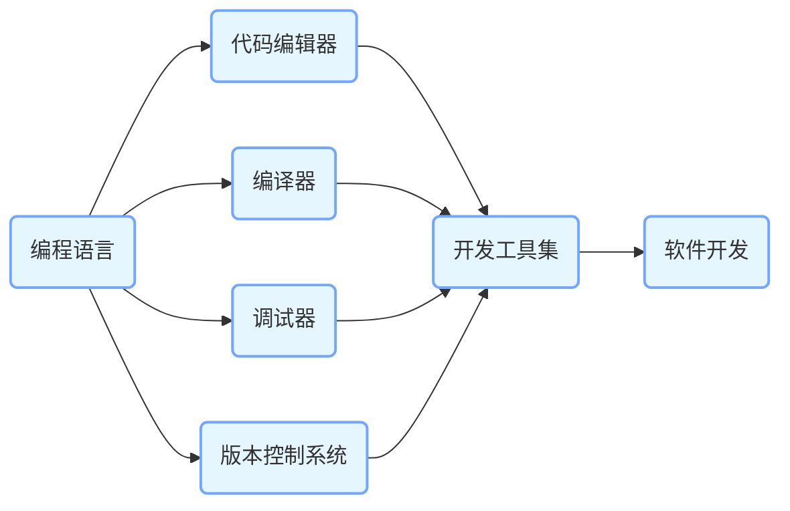

# 未来的编程语言与开发工具的演变

> 关键词：编程语言、开发工具、演变、未来趋势、人工智能、自动化、量子计算

> 摘要：本文旨在深入探讨未来编程语言与开发工具的演变趋势。随着科技的飞速发展，如人工智能、量子计算等新兴技术的崛起，编程语言和开发工具也必然会发生相应的变革。我们将从背景介绍入手，阐述相关核心概念与联系，剖析核心算法原理及具体操作步骤，探讨数学模型和公式，通过项目实战案例详细说明，分析实际应用场景，推荐相关工具和资源，最后总结未来发展趋势与挑战，并解答常见问题，为读者全面呈现未来编程语言与开发工具的发展图景。

## 1. 背景介绍 
### 1.1 目的和范围
本文章的目的在于全面且深入地探讨未来编程语言与开发工具的演变趋势。范围涵盖了当前科技发展的多个前沿领域，包括但不限于人工智能、量子计算、物联网等对编程语言和开发工具的影响，以及编程语言自身特性（如语法、语义、编程范式）和开发工具功能（如集成开发环境、调试工具、自动化部署工具）的未来发展方向。

### 1.2 预期读者
预期读者包括计算机科学领域的专业人士，如程序员、软件架构师、技术管理人员等；对科技发展趋势感兴趣的爱好者；以及正在学习计算机相关专业的学生。通过阅读本文，读者能够了解未来编程语言与开发工具的发展动态，为自身的学习、研究和职业发展提供参考。

### 1.3 文档结构概述
本文将按照以下结构展开：首先介绍相关背景知识，包括目的、预期读者和文档结构概述等；接着阐述核心概念与联系，通过文本示意图和 Mermaid 流程图呈现；然后详细讲解核心算法原理和具体操作步骤，并使用 Python 源代码进行说明；之后探讨数学模型和公式，并举例说明；通过项目实战案例展示代码实现和详细解释；分析实际应用场景；推荐相关的学习资源、开发工具框架和论文著作；最后总结未来发展趋势与挑战，解答常见问题，并提供扩展阅读和参考资料。

### 1.4 术语表
#### 1.4.1 核心术语定义
- **编程语言**：用于编写计算机程序的形式语言，它规定了程序员如何表达算法和数据结构，以便计算机能够理解和执行。
- **开发工具**：辅助程序员进行软件开发的各种软件和硬件工具，包括集成开发环境（IDE）、代码编辑器、调试器、版本控制系统等。
- **人工智能（AI）**：使计算机系统能够模拟人类智能的技术，包括机器学习、深度学习、自然语言处理等领域。
- **量子计算**：基于量子力学原理的计算方式，具有比传统计算机更高的计算能力和速度。
- **物联网（IoT）**：通过互联网将各种物理设备连接起来，实现设备之间的通信和数据交换。

#### 1.4.2 相关概念解释
- **编程范式**：指程序员编写程序时所遵循的基本风格和方法，常见的编程范式包括面向对象编程、函数式编程、过程式编程等。
- **代码复用**：指在不同的程序或项目中重复使用已有的代码，以提高开发效率和代码质量。
- **自动化测试**：使用自动化工具执行测试用例，对软件进行功能、性能等方面的测试，以减少人工测试的工作量和提高测试的准确性。

#### 1.4.3 缩略词列表
- **IDE**：集成开发环境（Integrated Development Environment）
- **ML**：机器学习（Machine Learning）
- **DL**：深度学习（Deep Learning）
- **NLP**：自然语言处理（Natural Language Processing）
- **IoT**：物联网（Internet of Things）

## 2. 核心概念与联系 

### 核心概念原理
编程语言和开发工具是软件开发过程中不可或缺的两个方面。编程语言是程序员与计算机沟通的桥梁，它定义了程序的逻辑结构和执行方式。不同的编程语言具有不同的特点和适用场景，例如 Python 以其简洁易读的语法和丰富的库而广泛应用于数据分析、人工智能等领域；Java 以其跨平台性和面向对象的特性在企业级应用开发中占据重要地位。

开发工具则是辅助程序员进行软件开发的工具集，它可以提高开发效率、降低开发难度。例如，集成开发环境（IDE）提供了代码编辑、编译、调试等一体化的功能，使得程序员可以在一个统一的界面中完成软件开发的各个环节。

### 架构的文本示意图
编程语言和开发工具的关系可以用以下文本示意图表示：

编程语言处于软件开发的核心位置，它定义了程序的逻辑和数据结构。开发工具围绕编程语言展开，为程序员提供各种辅助功能。例如，代码编辑器用于编写和编辑代码，编译器将源代码转换为可执行文件，调试器用于查找和修复程序中的错误，版本控制系统用于管理代码的版本和变更。

### Mermaid 流程图


这个流程图展示了编程语言与开发工具之间的关系。编程语言是软件开发的基础，不同的开发工具围绕编程语言提供各种辅助功能，最终共同服务于软件开发的整个过程。

## 3. 核心算法原理 & 具体操作步骤 

### 核心算法原理
在软件开发中，有许多核心算法原理贯穿其中，例如排序算法、搜索算法、图算法等。这些算法是解决各种实际问题的基础，不同的编程语言和开发工具都提供了对这些算法的支持。

以排序算法中的快速排序为例，快速排序是一种分治算法，其基本思想是通过选择一个基准元素，将数组分为两部分，使得左边部分的所有元素都小于等于基准元素，右边部分的所有元素都大于等于基准元素，然后分别对左右两部分进行递归排序。

### Python 源代码实现
```python
def quick_sort(arr):
    if len(arr) <= 1:
        return arr
    else:
        pivot = arr[0]
        left = []
        right = []
        for num in arr[1:]:
            if num <= pivot:
                left.append(num)
            else:
                right.append(num)
        return quick_sort(left) + [pivot] + quick_sort(right)

# 测试代码
arr = [3, 6, 8, 10, 1, 2, 1]
sorted_arr = quick_sort(arr)
print(sorted_arr)
```

### 具体操作步骤
1. **选择基准元素**：在快速排序中，通常选择数组的第一个元素作为基准元素。
2. **划分操作**：遍历数组中除基准元素外的其他元素，将小于等于基准元素的元素放入左边的子数组，将大于基准元素的元素放入右边的子数组。
3. **递归排序**：对左右两个子数组分别递归调用快速排序算法，直到子数组的长度小于等于 1。
4. **合并结果**：将排序好的左子数组、基准元素和排序好的右子数组合并成一个有序的数组。

## 4. 数学模型和公式 & 详细讲解 & 举例说明 

### 数学模型
快速排序的时间复杂度可以用递归方程来描述。设 $T(n)$ 表示对长度为 $n$ 的数组进行快速排序所需的时间，则有：

$$T(n) = \begin{cases}
O(1), & \text{if } n \leq 1 \\
T(k) + T(n - k - 1) + O(n), & \text{otherwise}
\end{cases}$$

其中 $k$ 是基准元素左边子数组的长度。

### 详细讲解
- **最好情况**：当每次选择的基准元素都能将数组均匀地划分为两部分时，即 $k = \frac{n}{2}$，快速排序的时间复杂度为 $O(n \log n)$。这是因为每次划分操作的时间复杂度为 $O(n)$，而递归的深度为 $\log n$。
- **最坏情况**：当每次选择的基准元素都是数组中的最大或最小元素时，即 $k = 0$ 或 $k = n - 1$，快速排序的时间复杂度为 $O(n^2)$。这是因为每次划分操作只能将数组减少一个元素，递归的深度为 $n$。
- **平均情况**：在平均情况下，快速排序的时间复杂度为 $O(n \log n)$。这是通过对所有可能的划分情况进行概率分析得到的。

### 举例说明
假设我们有一个数组 $[3, 6, 8, 10, 1, 2, 1]$，选择第一个元素 3 作为基准元素。经过一次划分操作后，得到左子数组 $[1, 2, 1]$ 和右子数组 $[6, 8, 10]$。然后分别对左右子数组进行递归排序，最终得到排序好的数组 $[1, 1, 2, 3, 6, 8, 10]$。

## 5. 项目实战：代码实际案例和详细解释说明 

### 5.1  开发环境搭建
我们以一个简单的 Python 项目为例，使用 Flask 框架开发一个 Web 应用。开发环境搭建步骤如下：
1. **安装 Python**：从 Python 官方网站（https://www.python.org/downloads/）下载并安装 Python 3.x 版本。
2. **创建虚拟环境**：打开命令行工具，进入项目目录，使用以下命令创建虚拟环境：
```bash
python -m venv myenv
```
3. **激活虚拟环境**：在 Windows 系统中，使用以下命令激活虚拟环境：
```bash
myenv\Scripts\activate
```
在 Linux 或 macOS 系统中，使用以下命令激活虚拟环境：
```bash
source myenv/bin/activate
```
4. **安装 Flask**：在激活的虚拟环境中，使用以下命令安装 Flask：
```bash
pip install flask
```

### 5.2  源代码详细实现和代码解读
以下是一个简单的 Flask Web 应用的源代码：
```python
from flask import Flask

app = Flask(__name__)

@app.route('/')
def hello_world():
    return 'Hello, World!'

if __name__ == '__main__':
    app.run(debug=True)
```

### 代码解读
1. **导入 Flask 模块**：`from flask import Flask` 导入 Flask 类，用于创建 Flask 应用实例。
2. **创建 Flask 应用实例**：`app = Flask(__name__)` 创建一个 Flask 应用实例，`__name__` 是 Python 内置变量，表示当前模块的名称。
3. **定义路由和视图函数**：`@app.route('/')` 装饰器定义了一个路由，当用户访问根路径 `/` 时，会调用 `hello_world` 函数。`hello_world` 函数返回一个字符串 `'Hello, World!'`。
4. **运行应用**：`if __name__ == '__main__': app.run(debug=True)` 确保应用在直接运行时启动，`debug=True` 开启调试模式，方便开发过程中发现和解决问题。

### 5.3  代码解读与分析
这个简单的 Flask 应用展示了 Web 开发的基本流程。通过定义路由和视图函数，我们可以将不同的 URL 路径映射到不同的处理函数上，从而实现不同的功能。Flask 框架提供了丰富的功能和扩展，例如模板引擎、数据库集成等，可以帮助我们开发更加复杂的 Web 应用。

## 6. 实际应用场景 

### 人工智能领域
在人工智能领域，编程语言和开发工具发挥着至关重要的作用。Python 是人工智能领域最常用的编程语言之一，它拥有丰富的机器学习和深度学习库，如 TensorFlow、PyTorch、Scikit-learn 等。开发工具方面，Jupyter Notebook 提供了一个交互式的开发环境，方便数据科学家进行数据探索、模型训练和结果可视化。

### 量子计算领域
量子计算是一个新兴的领域，对编程语言和开发工具提出了新的挑战。目前，一些专门的量子编程语言，如 Qiskit、Cirq 等已经出现，用于编写量子算法和程序。开发工具方面，量子计算平台提供了模拟和执行量子程序的环境，帮助研究人员和开发者进行量子计算实验。

### 物联网领域
物联网涉及到大量的设备连接和数据传输，因此对编程语言和开发工具也有特殊的要求。C 和 C++ 由于其高效性和对硬件的直接控制能力，在物联网设备开发中得到广泛应用。开发工具方面，嵌入式开发环境如 Keil、IAR 等用于开发和调试物联网设备的固件。同时，云计算平台提供了物联网数据的存储和处理能力，使得开发者可以更方便地构建物联网应用。

### 企业级应用开发
在企业级应用开发中，Java 和 .NET 是常用的编程语言。Java 以其跨平台性和强大的企业级框架（如 Spring、Hibernate 等）在企业级应用开发中占据重要地位。.NET 则提供了一套完整的开发工具和框架，适用于 Windows 平台的企业级应用开发。开发工具方面，IntelliJ IDEA 和 Visual Studio 分别是 Java 和 .NET 开发的主流集成开发环境。

## 7. 工具和资源推荐
### 7.1 学习资源推荐
#### 7.1.1 书籍推荐
- 《Python 编程：从入门到实践》：适合初学者学习 Python 编程语言，通过实际案例引导读者掌握 Python 的基本语法和应用。
- 《Effective Java》：Java 领域的经典书籍，介绍了 Java 编程的最佳实践和技巧，帮助开发者写出高效、健壮的 Java 代码。
- 《人工智能：一种现代的方法》：全面介绍了人工智能的基本概念、算法和应用，是人工智能领域的权威教材。

#### 7.1.2 在线课程
- Coursera 上的“Python for Everybody”：由密歇根大学提供的 Python 入门课程，内容丰富，适合初学者。
- edX 上的“Introduction to Artificial Intelligence”：麻省理工学院提供的人工智能入门课程，介绍了人工智能的基本原理和算法。
- Udemy 上的“Full Stack Web Development with Flask”：全面介绍了使用 Flask 框架进行全栈 Web 开发的知识和技能。

#### 7.1.3 技术博客和网站
- Medium：一个技术博客平台，有许多关于编程语言、开发工具和科技趋势的优质文章。
- Stack Overflow：一个程序员社区，开发者可以在上面提问、分享经验和解决问题。
- GitHub：一个代码托管平台，上面有许多开源项目和代码示例，可以帮助开发者学习和借鉴他人的代码。

### 7.2 开发工具框架推荐
#### 7.2.1 IDE和编辑器
- Visual Studio Code：一款轻量级的代码编辑器，支持多种编程语言，具有丰富的插件生态系统。
- IntelliJ IDEA：一款功能强大的 Java 集成开发环境，提供了代码自动补全、调试、重构等丰富的功能。
- PyCharm：专门为 Python 开发设计的集成开发环境，对 Python 语言有很好的支持。

#### 7.2.2 调试和性能分析工具
- GDB：一款强大的调试器，支持多种编程语言，可用于调试程序中的错误。
- VisualVM：一款 Java 性能分析工具，可用于监控 Java 应用的性能和内存使用情况。
- Chrome DevTools：一款浏览器开发者工具，可用于调试和分析 Web 应用的性能。

#### 7.2.3 相关框架和库
- TensorFlow：一个开源的机器学习框架，广泛应用于深度学习领域。
- Django：一个高级的 Python Web 框架，提供了快速开发 Web 应用的功能。
- React：一个用于构建用户界面的 JavaScript 库，在前端开发中得到广泛应用。

### 7.3 相关论文著作推荐
#### 7.3.1 经典论文
- “A Mathematical Theory of Communication”：克劳德·香农的经典论文，奠定了信息论的基础。
- “Learning Representations by Back-propagating Errors”：介绍了反向传播算法，是神经网络领域的重要论文。
- “MapReduce: Simplified Data Processing on Large Clusters”：介绍了 MapReduce 编程模型，是大数据处理领域的经典论文。

#### 7.3.2 最新研究成果
- 关注顶级学术会议（如 ACM SIGPLAN、IEEE ICML 等）上的最新研究成果，了解编程语言和开发工具的前沿技术。
- 阅读相关学术期刊（如 Journal of the ACM、Artificial Intelligence 等）上的研究论文，深入了解相关领域的研究进展。

#### 7.3.3 应用案例分析
- 分析开源项目的代码和文档，了解优秀的编程实践和开发经验。
- 阅读企业级应用的技术博客和案例分享，了解实际应用中的技术选型和解决方案。

## 8. 总结：未来发展趋势与挑战 

### 未来发展趋势
- **智能化**：随着人工智能技术的发展，编程语言和开发工具将更加智能化。例如，智能代码补全、自动调试、智能编程助手等功能将逐渐普及，提高开发效率和代码质量。
- **自动化**：软件开发过程将越来越自动化，包括自动化测试、自动化部署、持续集成和持续交付等。这将减少人工干预，提高软件开发的效率和可靠性。
- **跨平台和跨语言**：未来的开发工具将支持更多的平台和编程语言，使得开发者可以更加方便地进行跨平台开发和多语言编程。
- **量子计算和物联网的融合**：量子计算和物联网的发展将带来新的机遇和挑战，编程语言和开发工具需要适应这些新技术的需求，实现量子计算和物联网的融合。

### 挑战
- **技术更新换代快**：编程语言和开发工具的技术更新换代非常快，开发者需要不断学习和掌握新的技术，以跟上时代的步伐。
- **安全问题**：随着软件系统的复杂性增加，安全问题变得越来越重要。编程语言和开发工具需要提供更加安全的编程模型和开发环境，以保障软件系统的安全性。
- **人才短缺**：人工智能、量子计算等新兴技术的发展对人才的需求越来越大，而相关领域的专业人才相对短缺。如何培养和吸引更多的专业人才是未来面临的一个重要挑战。

## 9. 附录：常见问题与解答 

### 1. 未来哪些编程语言会更有发展前景？
未来，Python、Java、JavaScript 等编程语言仍将保持其重要地位。Python 由于其在人工智能、数据分析等领域的广泛应用，将继续受到青睐；Java 以其跨平台性和企业级应用的优势，在企业级开发中仍将占据重要地位；JavaScript 作为前端开发的主流语言，随着 Web 技术的发展，其应用场景将不断扩大。此外，一些新兴的编程语言，如 Rust、Go 等，也具有很大的发展潜力。

### 2. 开发工具的智能化会对程序员产生什么影响？
开发工具的智能化将提高程序员的开发效率和代码质量。智能代码补全可以减少程序员的输入工作量，自动调试可以帮助程序员更快地找到和解决问题，智能编程助手可以提供实时的编程建议和解决方案。然而，这也可能导致程序员对工具的依赖增加，从而降低自身的编程能力。因此，程序员需要在使用智能开发工具的同时，不断提升自己的编程技能和思维能力。

### 3. 量子计算对编程语言和开发工具会带来哪些变革？
量子计算的发展将对编程语言和开发工具带来重大变革。目前的编程语言和开发工具主要是基于经典计算机设计的，无法直接应用于量子计算。因此，需要开发专门的量子编程语言和开发工具，以支持量子算法的编写和执行。此外，量子计算的特性（如量子比特的叠加和纠缠）也将对编程模型和算法设计带来挑战，需要研究新的编程范式和算法。

### 4. 如何选择适合自己的编程语言和开发工具？
选择适合自己的编程语言和开发工具需要考虑多个因素，如项目需求、个人兴趣、学习成本等。如果是进行数据分析和人工智能开发，Python 是一个不错的选择；如果是进行企业级应用开发，Java 或 .NET 可能更适合；如果是进行前端开发，JavaScript 是必不可少的。在选择开发工具时，需要考虑其功能、易用性、社区支持等因素。可以通过阅读相关的技术文档、教程和用户评价，以及进行实际的试用和比较，来选择适合自己的开发工具。

## 10. 扩展阅读 & 参考资料 

### 扩展阅读
- 《代码大全》：一本关于软件开发的经典书籍，介绍了软件开发的各个方面，包括编程实践、项目管理、代码优化等。
- 《人月神话》：探讨了软件开发中的团队协作、项目管理等问题，对软件开发的实践具有重要的指导意义。
- 《浪潮之巅》：介绍了科技行业的发展历程和重要企业的兴衰，帮助读者了解科技行业的发展趋势和规律。

### 参考资料
- 各编程语言和开发工具的官方文档和网站，如 Python 官方文档（https://docs.python.org/）、Flask 官方文档（https://flask.palletsprojects.com/）等。
- 学术数据库，如 ACM Digital Library、IEEE Xplore 等，提供了大量的学术论文和研究成果。
- 技术论坛和社区，如 Stack Overflow、Reddit 等，开发者可以在上面交流经验和获取最新的技术信息。