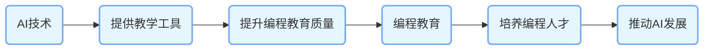

# 未来编程教育在AI时代的转型与创新路径规划

> 关键词：编程教育、AI时代、转型、创新路径、教育改革

> 摘要：本文聚焦于未来编程教育在AI时代的转型与创新路径规划。在AI技术迅猛发展的当下，编程教育面临着新的机遇与挑战。文章深入探讨了编程教育在AI时代背景下的现状，剖析了核心概念及联系，阐述了相关算法原理与操作步骤，借助数学模型进行理论支撑，并通过项目实战展示具体应用。同时，分析了实际应用场景，推荐了相关工具和资源，最后对未来编程教育的发展趋势与挑战进行总结，旨在为编程教育在AI时代的转型与创新提供全面且深入的路径规划与指导。

## 1. 背景介绍 
### 1.1 目的和范围
在当今AI时代，科技发展日新月异，编程教育作为培养未来科技人才的关键领域，其重要性日益凸显。本文章的目的在于深入探讨编程教育在AI时代所面临的转型需求以及创新路径规划，旨在为教育工作者、政策制定者、学生及相关从业者提供有价值的参考和指导。范围涵盖编程教育的各个层面，包括教学理念、课程设置、教学方法、评价体系等，同时涉及AI技术在编程教育中的应用与融合。

### 1.2 预期读者
本文的预期读者主要包括编程教育领域的教师、教育机构从业者、教育政策制定者、对编程教育感兴趣的学生及其家长，以及从事相关技术研究的科研人员等。通过本文，读者能够全面了解编程教育在AI时代的发展趋势和转型创新路径，为自身的教学实践、政策制定、学习规划等提供有益的启示。

### 1.3 文档结构概述
本文将按照以下结构展开：首先介绍背景信息，包括目的、预期读者和文档结构概述；接着阐述核心概念与联系，通过文本示意图和Mermaid流程图展示编程教育与AI的关系；然后讲解核心算法原理和具体操作步骤，并给出Python源代码示例；再通过数学模型和公式进行理论分析和举例说明；之后通过项目实战展示代码实际案例并进行详细解释；随后分析实际应用场景；接着推荐相关的工具和资源；最后总结未来发展趋势与挑战，提供常见问题与解答以及扩展阅读和参考资料。

### 1.4 术语表
#### 1.4.1 核心术语定义
- **编程教育**：是指教授学生计算机编程知识和技能，培养学生逻辑思维、创新能力和解决问题能力的教育活动。
- **AI时代**：指以人工智能技术为核心驱动力，在各个领域广泛应用和深度融合，推动社会经济快速发展的时代。
- **转型**：指编程教育在AI时代背景下，对教学理念、课程体系、教学方法等方面进行调整和变革，以适应新的发展需求。
- **创新路径**：是指编程教育在AI时代实现转型和发展的新方法、新策略和新途径。

#### 1.4.2 相关概念解释
- **人工智能**：是一门研究如何使计算机系统能够模拟人类智能的学科，包括机器学习、深度学习、自然语言处理等多个领域。
- **编程思维**：是一种运用计算机科学的概念和方法来解决问题的思维方式，包括分解问题、模式识别、抽象和算法设计等。
- **教育技术**：是指在教育过程中运用各种技术手段，如信息技术、多媒体技术、虚拟现实技术等，以提高教学效果和效率。

#### 1.4.3 缩略词列表
- **AI**：Artificial Intelligence（人工智能）
- **ML**：Machine Learning（机器学习）
- **DL**：Deep Learning（深度学习）
- **NLP**：Natural Language Processing（自然语言处理）

## 2. 核心概念与联系 

### 编程教育与AI的核心概念
编程教育旨在培养学生的编程技能和编程思维，使学生能够运用计算机语言进行程序设计和开发。而AI则是利用计算机系统模拟人类智能，通过数据和算法实现智能决策和问题解决。编程是实现AI的基础，AI的发展也为编程教育带来了新的机遇和挑战。

### 编程教育与AI的联系文本示意图
编程教育与AI相互关联、相互促进。编程教育为AI的发展提供人才支持，培养具备编程技能和创新能力的人才，推动AI技术的不断进步。而AI技术的发展也为编程教育提供了新的教学工具和方法，如智能辅导系统、自动化评测工具等，提高了编程教育的质量和效率。

### Mermaid流程图


## 3. 核心算法原理 & 具体操作步骤 

### 核心算法原理
在编程教育与AI融合的过程中，机器学习算法是重要的核心算法之一。以监督学习中的线性回归算法为例，其原理是通过寻找一条最佳的直线来拟合数据点，使得数据点到直线的误差最小。线性回归的目标是找到一组参数 $\theta$，使得预测值 $\hat{y}$ 与真实值 $y$ 之间的误差最小。误差通常用均方误差（MSE）来衡量，公式为：

$$MSE = \frac{1}{n} \sum_{i=1}^{n} (y_i - \hat{y}_i)^2$$

其中，$n$ 是样本数量，$y_i$ 是第 $i$ 个样本的真实值，$\hat{y}_i$ 是第 $i$ 个样本的预测值。

### Python源代码实现
```python
import numpy as np
from sklearn.linear_model import LinearRegression
from sklearn.model_selection import train_test_split
from sklearn.metrics import mean_squared_error

# 生成一些示例数据
X = np.array([1, 2, 3, 4, 5]).reshape(-1, 1)
y = np.array([2, 4, 6, 8, 10])

# 划分训练集和测试集
X_train, X_test, y_train, y_test = train_test_split(X, y, test_size=0.2, random_state=42)

# 创建线性回归模型
model = LinearRegression()

# 训练模型
model.fit(X_train, y_train)

# 进行预测
y_pred = model.predict(X_test)

# 计算均方误差
mse = mean_squared_error(y_test, y_pred)
print(f"均方误差: {mse}")
```

### 具体操作步骤
1. **数据准备**：收集和整理相关数据，并进行数据预处理，如数据清洗、特征选择等。
2. **模型选择**：根据问题的特点和数据的分布，选择合适的机器学习模型，如线性回归、决策树、神经网络等。
3. **模型训练**：使用训练数据对模型进行训练，调整模型的参数，使得模型能够更好地拟合数据。
4. **模型评估**：使用测试数据对训练好的模型进行评估，计算模型的性能指标，如准确率、召回率、均方误差等。
5. **模型优化**：根据评估结果，对模型进行优化，如调整模型参数、增加训练数据等，以提高模型的性能。

## 4. 数学模型和公式 & 详细讲解 & 举例说明 

### 线性回归数学模型
线性回归的数学模型可以表示为：

$$\hat{y} = \theta_0 + \theta_1 x_1 + \theta_2 x_2 + \cdots + \theta_n x_n$$

其中，$\hat{y}$ 是预测值，$\theta_0$ 是截距，$\theta_1, \theta_2, \cdots, \theta_n$ 是回归系数，$x_1, x_2, \cdots, x_n$ 是特征变量。

### 最小二乘法求解回归系数
为了找到最佳的回归系数 $\theta$，可以使用最小二乘法。最小二乘法的目标是使得误差平方和最小，即：

$$\min_{\theta} \sum_{i=1}^{n} (y_i - \hat{y}_i)^2$$

通过对误差平方和求偏导数，并令偏导数等于0，可以得到回归系数的解析解：

$$\theta = (X^T X)^{-1} X^T y$$

其中，$X$ 是特征矩阵，$y$ 是标签向量。

### 举例说明
假设有一组数据 $(x_1, y_1), (x_2, y_2), \cdots, (x_n, y_n)$，我们想要通过线性回归模型来预测 $y$ 的值。首先，我们需要将数据表示为特征矩阵 $X$ 和标签向量 $y$：

$$X = \begin{bmatrix}
1 & x_1 \\
1 & x_2 \\
\vdots & \vdots \\
1 & x_n
\end{bmatrix}, \quad y = \begin{bmatrix}
y_1 \\
y_2 \\
\vdots \\
y_n
\end{bmatrix}$$

然后，根据最小二乘法的公式计算回归系数 $\theta$：

$$\theta = (X^T X)^{-1} X^T y$$

最后，将回归系数代入线性回归模型中，得到预测值 $\hat{y}$：

$$\hat{y} = \theta_0 + \theta_1 x$$

## 5. 项目实战：代码实际案例和详细解释说明 

### 5.1  开发环境搭建
在进行项目实战之前，需要搭建相应的开发环境。以下是搭建Python开发环境的步骤：
1. **安装Python**：从Python官方网站（https://www.python.org/downloads/）下载并安装Python解释器。
2. **安装开发工具**：推荐使用PyCharm、VS Code等集成开发环境（IDE），方便编写、调试和运行Python代码。
3. **安装必要的库**：使用pip命令安装所需的库，如numpy、pandas、scikit-learn等。例如，安装numpy库的命令为：

```sh
pip install numpy
```

### 5.2  源代码详细实现和代码解读
以下是一个使用Python实现简单神经网络进行手写数字识别的示例代码：

```python
import numpy as np
from tensorflow.keras.datasets import mnist
from tensorflow.keras.models import Sequential
from tensorflow.keras.layers import Dense, Flatten
from tensorflow.keras.utils import to_categorical

# 加载MNIST数据集
(train_images, train_labels), (test_images, test_labels) = mnist.load_data()

# 数据预处理
train_images = train_images.reshape((60000, 28 * 28))
train_images = train_images.astype('float32') / 255

test_images = test_images.reshape((10000, 28 * 28))
test_images = test_images.astype('float32') / 255

train_labels = to_categorical(train_labels)
test_labels = to_categorical(test_labels)

# 构建神经网络模型
model = Sequential()
model.add(Dense(512, activation='relu', input_shape=(28 * 28,)))
model.add(Dense(10, activation='softmax'))

# 编译模型
model.compile(optimizer='rmsprop',
              loss='categorical_crossentropy',
              metrics=['accuracy'])

# 训练模型
model.fit(train_images, train_labels, epochs=5, batch_size=128)

# 评估模型
test_loss, test_acc = model.evaluate(test_images, test_labels)
print(f"测试集损失: {test_loss}, 测试集准确率: {test_acc}")
```

### 代码解读与分析
1. **数据加载**：使用`mnist.load_data()`函数加载MNIST手写数字数据集，该数据集包含60000个训练样本和10000个测试样本。
2. **数据预处理**：将图像数据从二维数组转换为一维向量，并将像素值归一化到0到1之间。同时，将标签数据进行one-hot编码，以便于神经网络进行分类。
3. **模型构建**：使用`Sequential`模型构建一个简单的神经网络，包含一个输入层、一个隐藏层和一个输出层。隐藏层使用ReLU激活函数，输出层使用softmax激活函数，用于多分类任务。
4. **模型编译**：使用`rmsprop`优化器、`categorical_crossentropy`损失函数和`accuracy`评估指标对模型进行编译。
5. **模型训练**：使用`fit`方法对模型进行训练，设置训练轮数为5，批次大小为128。
6. **模型评估**：使用`evaluate`方法对模型进行评估，计算测试集的损失和准确率。

## 6. 实际应用场景 
### 个性化学习
在AI时代，编程教育可以利用AI技术实现个性化学习。通过对学生的学习数据进行分析，如学习进度、错误类型、学习偏好等，AI系统可以为每个学生制定个性化的学习计划和学习资源推荐，提高学习效果和效率。

### 智能辅导
AI智能辅导系统可以实时监测学生的编程过程，及时发现学生的错误和问题，并提供针对性的指导和反馈。智能辅导系统还可以根据学生的学习情况自动调整教学难度和进度，实现个性化的辅导。

### 自动化评测
利用AI技术可以实现编程作业的自动化评测。AI系统可以对学生提交的代码进行语法检查、逻辑分析和性能评估，快速给出评测结果和反馈，减轻教师的工作负担，提高评测的准确性和公正性。

### 虚拟实验室
通过虚拟现实（VR）和增强现实（AR）技术，创建虚拟编程实验室，让学生在虚拟环境中进行编程实践。虚拟实验室可以提供丰富的实验场景和资源，让学生更加直观地感受编程的过程和效果。

## 7. 工具和资源推荐
### 7.1 学习资源推荐
#### 7.1.1 书籍推荐
- 《Python编程：从入门到实践》：适合初学者学习Python编程，内容丰富，案例实用。
- 《深度学习》：由深度学习领域的三位大牛所著，是深度学习领域的经典教材。
- 《算法导论》：全面介绍了算法的设计、分析和实现，是算法领域的权威著作。

#### 7.1.2 在线课程
- Coursera：提供了众多知名大学和机构的在线课程，包括编程、AI等领域的课程。
- edX：与全球顶尖大学和机构合作，提供高质量的在线课程。
- 中国大学MOOC：国内知名的在线学习平台，提供丰富的编程和AI相关课程。

#### 7.1.3 技术博客和网站
- Medium：一个汇聚了众多技术专家和开发者的博客平台，有很多关于编程和AI的优质文章。
- Stack Overflow：全球最大的技术问答社区，开发者可以在这里提问、分享经验和解决问题。
- 开源中国：国内知名的开源技术社区，提供了大量的开源项目和技术文章。

### 7.2 开发工具框架推荐
#### 7.2.1 IDE和编辑器
- PyCharm：专业的Python集成开发环境，功能强大，适合Python开发。
- VS Code：轻量级的代码编辑器，支持多种编程语言，插件丰富。
- Jupyter Notebook：交互式的编程环境，适合数据科学和机器学习的开发和实验。

#### 7.2.2 调试和性能分析工具
- pdb：Python内置的调试器，方便调试Python代码。
- cProfile：Python的性能分析工具，可以分析代码的运行时间和资源消耗。
- TensorBoard：TensorFlow的可视化工具，用于可视化训练过程和模型性能。

#### 7.2.3 相关框架和库
- TensorFlow：开源的机器学习框架，广泛应用于深度学习领域。
- PyTorch：另一个流行的深度学习框架，具有动态计算图的特点。
- Scikit-learn：简单易用的机器学习库，提供了丰富的机器学习算法和工具。

### 7.3 相关论文著作推荐
#### 7.3.1 经典论文
- 《Gradient-Based Learning Applied to Document Recognition》：Yann LeCun等人发表的关于卷积神经网络在手写数字识别中的应用的经典论文。
- 《ImageNet Classification with Deep Convolutional Neural Networks》：Alex Krizhevsky等人发表的关于AlexNet的论文，开启了深度学习在计算机视觉领域的热潮。
- 《Attention Is All You Need》：提出了Transformer架构，在自然语言处理领域取得了巨大的成功。

#### 7.3.2 最新研究成果
- 关注顶级学术会议，如NeurIPS、ICML、CVPR等，了解AI和编程教育领域的最新研究成果。
- 阅读相关的学术期刊，如Journal of Artificial Intelligence Research、Artificial Intelligence等。

#### 7.3.3 应用案例分析
- 研究各大科技公司的AI应用案例，如谷歌、微软、亚马逊等，了解AI在编程教育中的实际应用和效果。
- 分析国内外编程教育机构的创新实践案例，学习他们的成功经验和方法。

## 8. 总结：未来发展趋势与挑战
### 未来发展趋势
- **融合发展**：编程教育将与AI、物联网、大数据等技术深度融合，培养学生跨学科的综合能力。
- **个性化教育**：借助AI技术实现更加精准的个性化学习，满足每个学生的学习需求。
- **实践导向**：更加注重实践教学，通过项目实践和竞赛等方式提高学生的实际编程能力。
- **国际化合作**：加强国际间的编程教育交流与合作，引进先进的教育理念和资源。

### 挑战
- **师资短缺**：缺乏既懂编程又懂AI的专业教师，需要加强教师培训和人才引进。
- **课程更新**：AI技术发展迅速，编程教育课程需要及时更新和优化，以跟上技术发展的步伐。
- **数据安全与隐私**：在利用AI技术进行教学过程中，需要保护学生的个人数据安全和隐私。
- **教育公平**：如何确保不同地区、不同群体的学生都能享受到优质的编程教育资源，是需要解决的重要问题。

## 9. 附录：常见问题与解答
### 问题1：编程教育在AI时代有哪些新的教学方法？
解答：编程教育在AI时代有很多新的教学方法，如个性化学习、智能辅导、游戏化教学、项目式学习等。这些方法可以根据学生的特点和需求，提高学习的趣味性和效果。

### 问题2：如何培养学生的编程思维？
解答：培养学生的编程思维可以通过以下方法：多做编程练习，从简单的问题入手，逐步提高难度；学习算法和数据结构，理解编程的基本原理；参与编程项目和竞赛，锻炼解决实际问题的能力；阅读优秀的代码，学习他人的编程思路和技巧。

### 问题3：AI技术在编程教育中会取代教师吗？
解答：AI技术在编程教育中不会取代教师。虽然AI可以提供个性化的学习支持和智能辅导，但教师在教学过程中仍然起着重要的作用。教师可以引导学生的学习方向，激发学生的学习兴趣，培养学生的创新能力和团队合作精神。

### 问题4：编程教育对学生的未来发展有什么重要意义？
解答：编程教育对学生的未来发展具有重要意义。编程技能是未来社会的核心技能之一，掌握编程可以为学生提供更多的就业机会和发展空间。同时，编程教育还可以培养学生的逻辑思维、创新能力和解决问题的能力，对学生的综合素质提升有很大帮助。

## 10. 扩展阅读 & 参考资料
### 扩展阅读
- 《人工智能时代的教育革命》：探讨了AI时代教育的变革和发展趋势。
- 《编程教育的未来》：对编程教育的未来发展进行了深入的思考和展望。
- 《教育技术前沿》：关注教育技术领域的最新研究成果和发展动态。

### 参考资料
- [Python官方文档](https://docs.python.org/3/)
- [TensorFlow官方文档](https://www.tensorflow.org/api_docs)
- [Scikit-learn官方文档](https://scikit-learn.org/stable/documentation.html)
- [Coursera官方网站](https://www.coursera.org/)
- [edX官方网站](https://www.edx.org/)
- [中国大学MOOC官方网站](https://www.icourse163.org/)