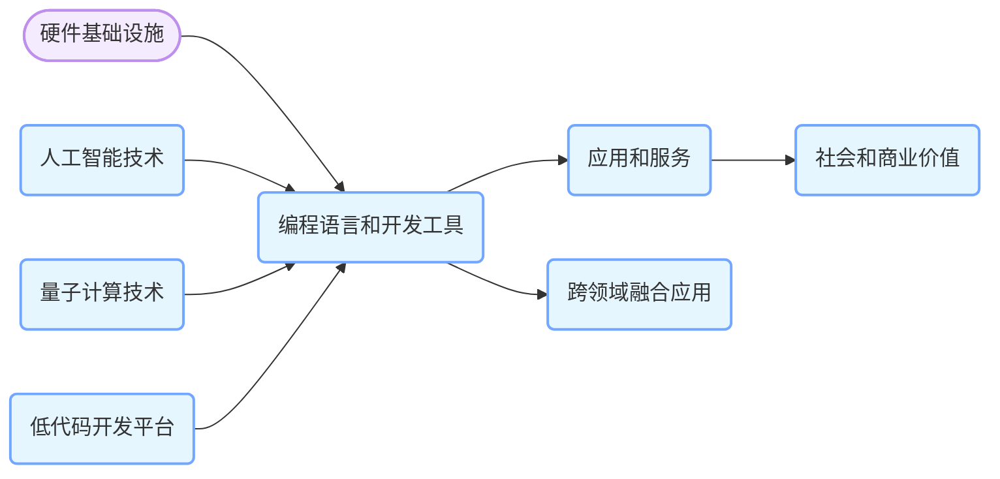

# 未来编程的挑战与机遇

> 关键词：未来编程、挑战、机遇、人工智能、量子计算、低代码开发、编程范式变革

> 摘要：本文深入探讨了未来编程领域所面临的挑战与蕴含的机遇。在技术飞速发展的当下，编程领域正经历着前所未有的变革。随着人工智能、量子计算等新兴技术的崛起，编程的环境和需求不断变化。一方面，我们面临着技术快速迭代、人才短缺、安全与伦理等诸多挑战；另一方面，也迎来了自动化编程、跨领域融合、新的编程范式等带来的巨大机遇。通过对这些挑战与机遇的全面分析，旨在为编程从业者和相关研究者提供有价值的参考，以更好地应对未来编程的发展趋势。

## 1. 背景介绍 
### 1.1 目的和范围
本文的目的在于全面、深入地剖析未来编程领域可能出现的挑战与蕴含的机遇。范围涵盖了从当前编程技术发展的趋势出发，预测未来几年甚至几十年内编程技术在不同层面的变化，包括但不限于编程语言、开发工具、应用场景、人才需求等方面。同时，分析这些变化对编程从业者、企业以及整个社会可能产生的影响。

### 1.2 预期读者
本文预期读者包括编程开发者、软件工程师、技术管理者、计算机科学研究者、相关专业的学生以及对未来编程发展趋势感兴趣的人士。希望通过本文的阐述，能为不同层次的读者提供对未来编程的清晰认知和有价值的思考。

### 1.3 文档结构概述
本文首先介绍背景信息，让读者了解研究的目的、范围和预期读者。接着阐述未来编程的核心概念及其联系，包括新兴技术与编程的关系。然后详细讲解核心算法原理和具体操作步骤，结合Python代码进行说明。之后介绍相关的数学模型和公式，并举例说明。通过项目实战部分展示代码实际案例及详细解释。再探讨未来编程的实际应用场景。随后推荐相关的工具和资源，包括学习资源、开发工具框架和论文著作。最后总结未来编程的发展趋势与挑战，提供常见问题解答和扩展阅读参考资料。

### 1.4 术语表
#### 1.4.1 核心术语定义
- **人工智能编程**：利用编程语言和相关技术实现人工智能算法和系统的过程，包括机器学习、深度学习、自然语言处理等领域的编程。
- **量子计算编程**：针对量子计算机编写程序的过程，涉及量子比特、量子门等量子计算概念，以实现量子算法的执行。
- **低代码开发**：一种通过可视化界面和少量代码来快速开发应用程序的方法，降低了编程门槛，提高了开发效率。
- **编程范式**：编程的基本风格和方法，如面向对象编程、函数式编程、逻辑编程等。

#### 1.4.2 相关概念解释
- **自动化编程**：利用人工智能和机器学习技术，自动生成代码或辅助程序员进行编程的过程。
- **跨领域融合编程**：将不同领域的知识和技术与编程相结合，创造出具有创新性的应用和解决方案。
- **无服务器计算**：一种云计算执行模型，用户无需管理服务器基础设施，只需上传代码，由云服务提供商自动分配资源并执行代码。

#### 1.4.3 缩略词列表
- **AI**：Artificial Intelligence，人工智能
- **ML**：Machine Learning，机器学习
- **DL**：Deep Learning，深度学习
- **QC**：Quantum Computing，量子计算
- **NLP**：Natural Language Processing，自然语言处理

## 2. 核心概念与联系 

### 核心概念原理
#### 人工智能编程
人工智能编程的核心原理是通过算法和模型让计算机模拟人类的智能行为。以机器学习为例，其基本流程是收集数据、对数据进行预处理、选择合适的算法进行训练，最后使用训练好的模型进行预测或分类。例如，在图像识别任务中，通过大量的图像数据训练卷积神经网络（CNN），使网络能够识别不同的图像类别。

#### 量子计算编程
量子计算基于量子力学原理，利用量子比特（qubit）的叠加和纠缠特性进行计算。量子比特可以同时处于多个状态的叠加，这使得量子计算机在某些问题上具有比经典计算机指数级的加速能力。量子计算编程需要使用专门的量子编程语言和工具，通过操作量子门来实现量子算法。

#### 低代码开发
低代码开发平台通过提供可视化的界面和预制的组件，让开发者可以通过拖拽和配置的方式快速搭建应用程序。其核心原理是将常见的业务逻辑和功能封装成组件，减少了开发者手动编写代码的工作量，提高了开发效率。

### 架构的文本示意图
未来编程的架构可以看作是一个多层次的体系，底层是硬件基础设施，包括传统的计算机硬件和新兴的量子计算机等。中间层是各种编程语言和开发工具，如Python、Java等编程语言，以及集成开发环境（IDE）。上层是各种应用和服务，包括人工智能应用、移动应用、企业级应用等。不同层次之间相互关联，硬件基础设施为编程语言和开发工具提供运行环境，编程语言和开发工具则用于开发各种应用和服务。

### Mermaid 流程图


## 3. 核心算法原理 & 具体操作步骤 

### 人工智能编程算法原理及Python代码示例
#### 线性回归算法原理
线性回归是一种简单的机器学习算法，用于建立自变量和因变量之间的线性关系。其基本公式为 $y = \theta_0 + \theta_1x_1 + \theta_2x_2 + \cdots + \theta_nx_n$，其中 $y$ 是因变量，$x_1, x_2, \cdots, x_n$ 是自变量，$\theta_0, \theta_1, \cdots, \theta_n$ 是模型的参数。

#### Python代码实现
```python
import numpy as np
from sklearn.linear_model import LinearRegression
from sklearn.model_selection import train_test_split
from sklearn.metrics import mean_squared_error

# 生成示例数据
np.random.seed(0)
X = np.random.rand(100, 1)
y = 2 * X + 1 + 0.5 * np.random.randn(100, 1)

# 划分训练集和测试集
X_train, X_test, y_train, y_test = train_test_split(X, y, test_size=0.2, random_state=42)

# 创建线性回归模型
model = LinearRegression()

# 训练模型
model.fit(X_train, y_train)

# 进行预测
y_pred = model.predict(X_test)

# 计算均方误差
mse = mean_squared_error(y_test, y_pred)
print(f"均方误差: {mse}")
```
#### 操作步骤
1. 导入必要的库，包括 `numpy` 用于数据处理，`sklearn` 中的相关模块用于模型训练和评估。
2. 生成示例数据，这里使用 `np.random.rand` 生成自变量，根据线性关系生成因变量并添加一定的噪声。
3. 使用 `train_test_split` 函数将数据划分为训练集和测试集。
4. 创建线性回归模型实例。
5. 使用训练集数据对模型进行训练，调用 `fit` 方法。
6. 使用训练好的模型对测试集数据进行预测，调用 `predict` 方法。
7. 计算预测结果的均方误差，使用 `mean_squared_error` 函数。

### 量子计算编程算法原理及Python代码示例（使用Qiskit）
#### 量子比特翻转算法原理
在量子计算中，量子比特可以通过量子门进行操作。例如，`X` 门可以将量子比特从 $|0\rangle$ 状态翻转到 $|1\rangle$ 状态，反之亦然。

#### Python代码实现
```python
from qiskit import QuantumCircuit, Aer, execute

# 创建一个包含1个量子比特和1个经典比特的量子电路
qc = QuantumCircuit(1, 1)

# 应用X门翻转量子比特
qc.x(0)

# 进行测量
qc.measure(0, 0)

# 选择模拟器
backend = Aer.get_backend('qasm_simulator')

# 执行量子电路
job = execute(qc, backend, shots=1024)

# 获取结果
result = job.result()
counts = result.get_counts(qc)
print(counts)
```
#### 操作步骤
1. 导入必要的库，包括 `qiskit` 中的相关模块。
2. 创建一个包含1个量子比特和1个经典比特的量子电路。
3. 应用 `X` 门对量子比特进行翻转操作。
4. 对量子比特进行测量，将测量结果存储到经典比特中。
5. 选择量子模拟器作为后端。
6. 执行量子电路，设置测量次数为1024次。
7. 获取执行结果，统计测量结果的出现次数。

## 4. 数学模型和公式 & 详细讲解 & 举例说明 

### 人工智能中的数学模型和公式
#### 逻辑回归的损失函数
逻辑回归用于二分类问题，其损失函数通常使用交叉熵损失函数。对于单个样本 $(x_i, y_i)$，其中 $x_i$ 是输入特征，$y_i \in \{0, 1\}$ 是真实标签，预测概率为 $\hat{y}_i$，交叉熵损失函数的公式为：
$$
L(y_i, \hat{y}_i) = -y_i \log(\hat{y}_i) - (1 - y_i) \log(1 - \hat{y}_i)
$$
对于整个数据集，损失函数为所有样本损失的平均值：
$$
J(\theta) = \frac{1}{m} \sum_{i=1}^{m} L(y_i, \hat{y}_i)
$$
其中 $m$ 是样本数量，$\theta$ 是模型的参数。

#### 详细讲解
交叉熵损失函数的目的是衡量预测概率与真实标签之间的差异。当真实标签 $y_i = 1$ 时，损失函数为 $-\log(\hat{y}_i)$，这意味着预测概率 $\hat{y}_i$ 越接近1，损失越小；当 $y_i = 0$ 时，损失函数为 $-\log(1 - \hat{y}_i)$，预测概率 $\hat{y}_i$ 越接近0，损失越小。

#### 举例说明
假设我们有一个二分类问题，真实标签 $y = 1$，预测概率 $\hat{y} = 0.8$，则损失为 $L(1, 0.8) = -\log(0.8) \approx 0.223$。如果预测概率 $\hat{y} = 0.2$，则损失为 $L(1, 0.2) = -\log(0.2) \approx 1.609$。可以看到，预测概率越接近真实标签，损失越小。

### 量子计算中的数学模型和公式
#### 量子比特的状态表示
量子比特的状态可以用二维复向量空间中的向量来表示。例如，基态 $|0\rangle$ 和 $|1\rangle$ 可以表示为：
$$
|0\rangle = \begin{bmatrix} 1 \\ 0 \end{bmatrix}, \quad |1\rangle = \begin{bmatrix} 0 \\ 1 \end{bmatrix}
$$
一般的量子比特状态可以表示为 $|\psi\rangle = \alpha |0\rangle + \beta |1\rangle$，其中 $\alpha$ 和 $\beta$ 是复数，且满足 $|\alpha|^2 + |\beta|^2 = 1$。

#### 详细讲解
$\alpha$ 和 $\beta$ 分别表示量子比特处于 $|0\rangle$ 状态和 $|1\rangle$ 状态的概率振幅。测量量子比特时，得到 $|0\rangle$ 状态的概率为 $|\alpha|^2$，得到 $|1\rangle$ 状态的概率为 $|\beta|^2$。

#### 举例说明
假设一个量子比特的状态为 $|\psi\rangle = \frac{1}{\sqrt{2}} |0\rangle + \frac{1}{\sqrt{2}} |1\rangle$，则测量得到 $|0\rangle$ 状态的概率为 $|\frac{1}{\sqrt{2}}|^2 = \frac{1}{2}$，得到 $|1\rangle$ 状态的概率也为 $\frac{1}{2}$。

## 5. 项目实战：代码实际案例和详细解释说明 

### 5.1  开发环境搭建
#### 人工智能项目环境搭建
1. **安装Python**：从Python官方网站（https://www.python.org/downloads/）下载并安装Python 3.x 版本。
2. **安装虚拟环境**：建议使用 `virtualenv` 或 `conda` 来创建虚拟环境，以隔离不同项目的依赖。例如，使用 `virtualenv` 创建虚拟环境的命令为：
```sh
pip install virtualenv
virtualenv myenv
source myenv/bin/activate  # 在Windows上使用 myenv\Scripts\activate
```
3. **安装必要的库**：在虚拟环境中安装 `numpy`、`pandas`、`scikit-learn`、`tensorflow` 或 `pytorch` 等库。例如：
```sh
pip install numpy pandas scikit-learn tensorflow
```

#### 量子计算项目环境搭建
1. **安装Python**：同样需要安装Python 3.x 版本。
2. **安装Qiskit**：Qiskit是一个开源的量子计算框架，可以使用以下命令安装：
```sh
pip install qiskit
```
3. **配置量子模拟器或真实量子设备**：可以使用Qiskit提供的本地模拟器进行开发和测试，也可以申请使用IBM的真实量子设备。

### 5.2  源代码详细实现和代码解读
#### 人工智能项目：手写数字识别
```python
import tensorflow as tf
from tensorflow.keras.datasets import mnist
from tensorflow.keras.models import Sequential
from tensorflow.keras.layers import Flatten, Dense

# 加载MNIST数据集
(x_train, y_train), (x_test, y_test) = mnist.load_data()

# 数据预处理
x_train = x_train / 255.0
x_test = x_test / 255.0

# 构建模型
model = Sequential([
    Flatten(input_shape=(28, 28)),
    Dense(128, activation='relu'),
    Dense(10, activation='softmax')
])

# 编译模型
model.compile(optimizer='adam',
              loss='sparse_categorical_crossentropy',
              metrics=['accuracy'])

# 训练模型
model.fit(x_train, y_train, epochs=5)

# 评估模型
test_loss, test_acc = model.evaluate(x_test, y_test)
print(f"测试准确率: {test_acc}")
```
#### 代码解读
1. **数据加载**：使用 `mnist.load_data()` 函数加载MNIST手写数字数据集，该数据集包含60000个训练样本和10000个测试样本。
2. **数据预处理**：将图像像素值归一化到0到1之间，有助于提高模型的训练效果。
3. **模型构建**：使用 `Sequential` 模型构建一个简单的神经网络，包含一个 `Flatten` 层将二维图像数据展平为一维向量，一个包含128个神经元的全连接层，激活函数为 `relu`，最后一个包含10个神经元的全连接层，激活函数为 `softmax`，用于输出每个数字的预测概率。
4. **模型编译**：使用 `adam` 优化器，`sparse_categorical_crossentropy` 损失函数，`accuracy` 作为评估指标。
5. **模型训练**：使用 `fit` 方法对模型进行训练，训练5个epoch。
6. **模型评估**：使用 `evaluate` 方法对模型在测试集上的性能进行评估，输出测试准确率。

#### 量子计算项目：量子纠缠态制备
```python
from qiskit import QuantumCircuit, Aer, execute
from qiskit.visualization import plot_histogram
import matplotlib.pyplot as plt

# 创建一个包含2个量子比特和2个经典比特的量子电路
qc = QuantumCircuit(2, 2)

# 应用Hadamard门到第一个量子比特
qc.h(0)

# 应用CNOT门，以第一个量子比特为控制比特，第二个量子比特为目标比特
qc.cx(0, 1)

# 进行测量
qc.measure([0, 1], [0, 1])

# 选择模拟器
backend = Aer.get_backend('qasm_simulator')

# 执行量子电路
job = execute(qc, backend, shots=1024)

# 获取结果
result = job.result()
counts = result.get_counts(qc)

# 绘制测量结果直方图
plot_histogram(counts).show()
```
#### 代码解读
1. **量子电路创建**：创建一个包含2个量子比特和2个经典比特的量子电路。
2. **Hadamard门操作**：对第一个量子比特应用Hadamard门，将其从 $|0\rangle$ 状态转换为叠加态 $\frac{1}{\sqrt{2}} (|0\rangle + |1\rangle)$。
3. **CNOT门操作**：应用CNOT门，以第一个量子比特为控制比特，第二个量子比特为目标比特，实现量子纠缠。
4. **测量操作**：对两个量子比特进行测量，将测量结果存储到经典比特中。
5. **选择模拟器并执行**：选择 `qasm_simulator` 作为后端，执行量子电路，设置测量次数为1024次。
6. **获取结果并绘制直方图**：获取测量结果，统计不同测量结果的出现次数，使用 `plot_histogram` 函数绘制直方图。

### 5.3  代码解读与分析
#### 人工智能项目分析
- **模型复杂度**：该手写数字识别模型相对简单，只有两个全连接层，对于复杂的图像识别任务可能不够。可以考虑使用更复杂的卷积神经网络（CNN）来提高模型的性能。
- **训练效果**：通过训练5个epoch，模型在测试集上可以达到较高的准确率，但可能存在过拟合的问题。可以使用正则化方法，如L1和L2正则化，来防止过拟合。
- **数据增强**：可以对训练数据进行数据增强，如旋转、平移、缩放等操作，增加数据的多样性，提高模型的泛化能力。

#### 量子计算项目分析
- **量子纠缠态**：通过Hadamard门和CNOT门的操作，成功制备了一个两量子比特的纠缠态。测量结果应该显示只有 $|00\rangle$ 和 $|11\rangle$ 两种状态，且概率大致相等。
- **噪声影响**：在实际的量子计算中，由于量子比特的脆弱性，会受到噪声的影响，导致测量结果出现误差。可以使用量子纠错码等技术来减少噪声的影响。
- **可扩展性**：该示例只是一个简单的两量子比特系统，随着量子比特数量的增加，量子计算的复杂度会指数级增长，需要更高效的算法和优化方法。

## 6. 实际应用场景 
### 人工智能编程的应用场景
#### 医疗领域
- **疾病诊断**：利用机器学习算法对医学图像（如X光、CT等）进行分析，辅助医生进行疾病诊断。例如，通过卷积神经网络可以检测肺部的结节，提高肺癌的早期诊断率。
- **药物研发**：使用人工智能技术预测药物的活性和副作用，加速药物研发的过程。可以通过分析大量的生物数据和化学结构，筛选出有潜力的药物分子。

#### 金融领域
- **风险评估**：基于历史数据和机器学习模型，对客户的信用风险进行评估，帮助金融机构做出更准确的贷款决策。例如，使用逻辑回归模型预测客户的违约概率。
- **量化交易**：利用人工智能算法分析市场数据，自动生成交易策略，实现量化交易。可以使用深度学习模型预测股票价格的走势，进行买卖决策。

### 量子计算编程的应用场景
#### 密码学
- **量子加密**：量子计算的发展对传统密码学提出了挑战，但同时也带来了量子加密的机遇。量子密钥分发（QKD）利用量子力学原理实现安全的密钥分发，保证通信的安全性。
- **破解密码**：量子计算机的强大计算能力可能会对现有的加密算法构成威胁，例如，量子计算机可以在多项式时间内破解RSA加密算法。

#### 优化问题
- **物流优化**：在物流领域，量子计算可以用于解决复杂的路径规划和调度问题。例如，通过量子退火算法可以找到最优的配送路线，降低物流成本。
- **金融投资组合优化**：量子计算可以帮助金融机构优化投资组合，在给定风险水平下实现最大收益。可以使用量子算法求解复杂的优化模型。

### 低代码开发的应用场景
#### 企业应用开发
- **快速搭建业务系统**：企业可以使用低代码开发平台快速搭建内部的业务系统，如客户关系管理（CRM）系统、企业资源规划（ERP）系统等。通过可视化的界面和预制的组件，减少开发时间和成本。
- **定制化应用开发**：低代码开发平台可以满足企业的个性化需求，开发定制化的应用程序。例如，根据企业的业务流程和规则，定制开发审批系统、报表系统等。

#### 政务服务
- **电子政务系统开发**：政府部门可以使用低代码开发平台快速开发电子政务系统，提高政务服务的效率和质量。例如，开发在线办事平台、行政审批系统等，方便市民办事。
- **数据共享和协同**：低代码开发平台可以实现政府部门之间的数据共享和协同工作，打破信息孤岛。例如，开发跨部门的数据共享平台，实现数据的实时交换和共享。

## 7. 工具和资源推荐
### 7.1 学习资源推荐
#### 7.1.1 书籍推荐
- **《Python机器学习》**：这本书详细介绍了Python在机器学习领域的应用，包括各种机器学习算法的原理和实现，适合初学者入门。
- **《量子计算与量子信息》**：经典的量子计算教材，全面介绍了量子计算的基本概念、算法和应用，适合对量子计算感兴趣的研究者和开发者。
- **《低代码开发实战》**：介绍了低代码开发的原理、方法和实践案例，帮助读者快速掌握低代码开发技术。

#### 7.1.2 在线课程
- **Coursera上的“机器学习”课程**：由斯坦福大学的Andrew Ng教授授课，是机器学习领域的经典课程，讲解了机器学习的基本概念、算法和应用。
- **edX上的“量子计算基础”课程**：由麻省理工学院等知名高校的教授授课，系统地介绍了量子计算的基础知识和前沿技术。
- **阿里云低代码开发平台在线课程**：介绍了阿里云低代码开发平台的使用方法和实践案例，帮助开发者快速上手低代码开发。

#### 7.1.3 技术博客和网站
- **Medium**：上面有很多关于编程、人工智能、量子计算等领域的技术文章和教程，由全球的开发者和研究者分享。
- **量子计算前沿**：专注于量子计算领域的资讯和技术分享，提供最新的量子计算研究成果和应用案例。
- **低代码开发社区**：一个专门讨论低代码开发的社区，开发者可以在这里交流经验、分享代码和学习资源。

### 7.2 开发工具框架推荐
#### 7.2.1 IDE和编辑器
- **PyCharm**：一款功能强大的Python集成开发环境，提供代码编辑、调试、版本控制等功能，适合Python开发者使用。
- **Visual Studio Code**：一款轻量级的代码编辑器，支持多种编程语言，具有丰富的插件生态系统，可以方便地进行编程和开发。
- **Qiskit Terra**：Qiskit的核心组件，提供了量子电路的创建、编译和执行等功能，是量子计算编程的重要工具。

#### 7.2.2 调试和性能分析工具
- **TensorBoard**：TensorFlow提供的可视化工具，可以帮助开发者可视化训练过程、模型结构和性能指标，方便调试和优化模型。
- **Qiskit Ignis**：Qiskit的一个组件，提供了量子纠错、噪声分析和性能优化等工具，用于提高量子计算的可靠性和性能。
- **低代码开发平台自带的调试工具**：大多数低代码开发平台都提供了可视化的调试工具，方便开发者检查和修复应用程序中的问题。

#### 7.2.3 相关框架和库
- **TensorFlow**：一个开源的机器学习框架，提供了丰富的工具和算法，支持深度学习、机器学习等多种任务。
- **PyTorch**：另一个流行的深度学习框架，具有动态计算图的特点，适合快速迭代和研究。
- **OutSystems**：一款知名的低代码开发平台，提供了丰富的组件和模板，支持快速开发企业级应用。

### 7.3 相关论文著作推荐
#### 7.3.1 经典论文
- **“A Fast Learning Algorithm for Deep Belief Nets”**：这篇论文介绍了深度信念网络（DBN）的快速学习算法，为深度学习的发展奠定了基础。
- **“Quantum Computing in the NISQ era and beyond”**：讨论了量子计算在有噪声中等规模量子（NISQ）时代的发展和挑战，对量子计算的研究具有重要的指导意义。
- **“Low-Code Development Platforms: A Systematic Literature Review”**：对低代码开发平台进行了系统的文献综述，分析了低代码开发的现状、趋势和挑战。

#### 7.3.2 最新研究成果
- **每年的NeurIPS（神经信息处理系统大会）、ICML（国际机器学习会议）等学术会议上的最新研究成果**：这些会议是机器学习和人工智能领域的顶级会议，展示了该领域的最新研究进展和创新成果。
- **量子计算领域的相关学术期刊，如《Physical Review A》、《Quantum》等**：这些期刊发表了量子计算领域的最新研究论文，涵盖了量子算法、量子硬件、量子信息等方面的内容。
- **低代码开发领域的研究报告和白皮书**：可以关注一些知名的研究机构和咨询公司发布的低代码开发领域的研究报告和白皮书，了解该领域的最新趋势和发展动态。

#### 7.3.3 应用案例分析
- **《人工智能医疗应用案例集》**：收集了人工智能在医疗领域的各种应用案例，包括疾病诊断、药物研发、医疗影像分析等方面，为人工智能在医疗领域的应用提供了参考和借鉴。
- **《量子计算商业应用案例》**：介绍了量子计算在金融、物流、密码学等领域的商业应用案例，展示了量子计算的实际应用价值和潜力。
- **《低代码开发企业应用案例精选》**：选取了一些企业使用低代码开发平台成功开发应用程序的案例，分析了低代码开发在企业数字化转型中的作用和优势。

## 8. 总结：未来发展趋势与挑战
### 未来发展趋势
#### 人工智能与编程的深度融合
未来，人工智能将在编程领域发挥越来越重要的作用。自动化编程将得到进一步发展，通过机器学习和自然语言处理技术，自动生成代码、修复代码错误和优化代码性能。同时，人工智能将帮助程序员更好地理解和分析代码，提高开发效率和质量。

#### 量子计算编程的突破
随着量子计算机硬件技术的不断发展，量子计算编程将取得重大突破。更多的量子算法将被开发出来，应用于密码学、优化问题、模拟物理系统等领域。量子计算与经典计算的混合编程模式将成为主流，充分发挥两者的优势。

#### 低代码开发的普及
低代码开发将越来越普及，成为企业快速开发应用程序的首选方式。低代码开发平台将不断完善，提供更多的功能和组件，支持更复杂的业务需求。同时，低代码开发将与人工智能、物联网等技术相结合，创造出更多创新的应用场景。

#### 跨领域融合编程的兴起
未来的编程将不再局限于传统的计算机领域，而是与生物学、物理学、化学等领域深度融合。跨领域融合编程将催生更多创新的应用和解决方案，如生物信息学中的基因测序分析、物理模拟中的量子力学计算等。

### 挑战
#### 技术快速迭代带来的学习压力
编程技术的快速发展使得程序员需要不断学习新的知识和技能，以跟上技术的步伐。例如，人工智能、量子计算等新兴技术的出现，要求程序员具备相关的专业知识和数学基础。这对程序员的学习能力和适应能力提出了很高的要求。

#### 人才短缺问题
随着编程技术的不断发展，对高素质编程人才的需求越来越大。然而，目前相关领域的专业人才相对短缺，尤其是人工智能、量子计算等前沿领域的人才更是稀缺。这将制约这些技术的发展和应用。

#### 安全与伦理问题
随着编程技术的广泛应用，安全与伦理问题日益凸显。例如，人工智能算法可能存在偏见和歧视，量子计算可能对现有的密码系统构成威胁。同时，数据隐私和安全问题也需要得到重视，如何确保用户数据的安全和隐私是一个亟待解决的问题。

#### 编程范式的变革带来的挑战
未来编程范式可能会发生变革，如从传统的面向对象编程向函数式编程、逻辑编程等范式转变。这对程序员的编程思维和习惯提出了挑战，需要他们重新学习和适应新的编程范式。

## 9. 附录：常见问题与解答
### 人工智能编程方面
#### 问题1：如何选择合适的机器学习算法？
解答：选择合适的机器学习算法需要考虑多个因素，如数据类型、问题类型（分类、回归、聚类等）、数据规模、模型复杂度等。一般来说，可以先对数据进行探索性分析，了解数据的特征和分布，然后根据问题类型选择一些常见的算法进行尝试，通过交叉验证等方法评估算法的性能，最终选择性能最优的算法。

#### 问题2：如何解决机器学习模型的过拟合问题？
解答：可以采用以下方法解决过拟合问题：增加训练数据、使用正则化方法（如L1和L2正则化）、减少模型复杂度（如减少神经网络的层数和神经元数量）、使用数据增强技术等。

### 量子计算编程方面
#### 问题1：量子计算编程与经典编程有哪些不同？
解答：量子计算编程与经典编程有很多不同之处。量子计算基于量子力学原理，使用量子比特和量子门进行计算，具有叠加和纠缠等特性，而经典编程基于二进制位进行计算。量子计算编程需要使用专门的量子编程语言和工具，并且需要考虑量子噪声和误差的影响。

#### 问题2：如何在实际的量子设备上运行量子程序？
解答：要在实际的量子设备上运行量子程序，首先需要申请使用量子设备的权限，如IBM的量子云服务。然后，将编写好的量子程序上传到量子设备的平台上，进行编译和执行。在执行过程中，需要考虑量子设备的噪声和误差，可能需要使用量子纠错码等技术来提高计算的可靠性。

### 低代码开发方面
#### 问题1：低代码开发是否会取代传统编程？
解答：低代码开发不会完全取代传统编程。低代码开发适合快速搭建一些简单的应用程序和业务系统，能够提高开发效率和降低开发成本。但对于一些复杂的、对性能和安全性要求较高的应用程序，仍然需要传统编程来实现。低代码开发和传统编程将相互补充，共同推动软件开发的发展。

#### 问题2：低代码开发平台的安全性如何保障？
解答：低代码开发平台通常会采取一系列措施来保障安全性，如数据加密、访问控制、漏洞扫描等。同时，平台的开发者也会不断更新和维护平台，修复安全漏洞。在使用低代码开发平台时，开发者也需要注意遵循安全规范，如合理设置用户权限、对敏感数据进行加密等。

## 10. 扩展阅读 & 参考资料
### 扩展阅读
- **《未来简史：从智人到神人》**：这本书探讨了人类未来的发展趋势，包括科技、社会、伦理等方面的变化，对理解未来编程的发展背景有一定的帮助。
- **《上帝与新物理学》**：介绍了现代物理学的前沿理论，如量子力学、相对论等，有助于深入理解量子计算的物理基础。
- **《数字化转型：企业如何实现可持续增长》**：讨论了企业数字化转型的策略和方法，对了解低代码开发在企业中的应用有一定的参考价值。

### 参考资料
- **相关技术文档**：如Python官方文档、TensorFlow官方文档、Qiskit官方文档、OutSystems官方文档等，这些文档提供了详细的技术信息和使用指南。
- **学术期刊和会议论文**：如《Journal of Artificial Intelligence Research》、《Physical Review Letters》、NeurIPS、ICML等学术期刊和会议上的论文，提供了最新的研究成果和技术进展。
- **行业报告和白皮书**：如Gartner、IDC等研究机构发布的关于人工智能、量子计算、低代码开发等领域的行业报告和白皮书，提供了行业的发展趋势和市场分析。