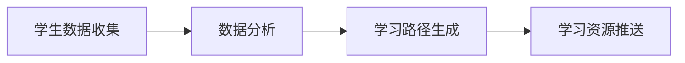
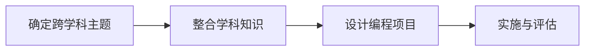
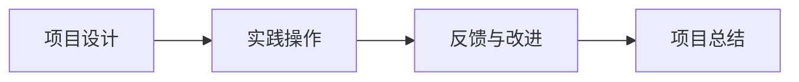

# 未来编程的教育与培训体系改革

> 关键词：编程教育、培训体系改革、未来趋势、教育创新、实践教学、个性化学习、跨学科融合

> 摘要：本文聚焦于未来编程的教育与培训体系改革，深入探讨在科技飞速发展的时代背景下，编程教育面临的机遇与挑战。分析了当前编程教育存在的问题，阐述了核心概念如个性化学习、跨学科融合等与编程教育的联系。详细讲解了编程教育中涉及的核心算法原理及操作步骤，引入数学模型和公式进行深入剖析。通过项目实战案例展示了如何将理论应用于实践，介绍了实际应用场景。同时推荐了相关的学习资源、开发工具框架以及论文著作。最后总结了未来编程教育的发展趋势与挑战，并提供常见问题解答和扩展阅读参考资料，旨在为编程教育与培训体系的改革提供全面且深入的思考与建议。

## 1. 背景介绍 
### 1.1 目的和范围
随着信息技术的迅猛发展，编程已经成为推动社会进步和经济发展的关键力量。编程教育不仅是培养技术人才的重要途径，更是提升全民数字素养的必要手段。本文章的目的在于探讨未来编程教育与培训体系的改革方向，以适应快速变化的技术环境和社会需求。范围涵盖了从基础教育到高等教育以及职业培训等各个阶段的编程教育，涉及教学方法、课程设置、师资培养、评价体系等多个方面。

### 1.2 预期读者
本文预期读者包括教育工作者、教育政策制定者、培训机构从业者、编程爱好者以及关注科技教育发展的各界人士。希望能为他们提供关于编程教育改革的新思路和参考依据，促进编程教育质量的提升和体系的完善。

### 1.3 文档结构概述
本文首先介绍编程教育的背景和相关概念，接着阐述核心算法原理和操作步骤，引入数学模型进行分析，通过项目实战展示应用，介绍实际应用场景和推荐相关资源，最后总结未来发展趋势与挑战，提供常见问题解答和参考资料。

### 1.4 术语表
#### 1.4.1 核心术语定义
- **编程教育**：是指通过教授编程语言、算法、数据结构等知识和技能，培养学生逻辑思维、创新能力和解决问题能力的教育活动。
- **培训体系**：是指为实现特定的培训目标而设计的一系列相互关联的培训环节、课程、方法和评估机制的总和。
- **个性化学习**：是指根据学生的学习风格、兴趣爱好、能力水平等个体差异，为其提供定制化的学习方案和资源，以提高学习效果。
- **跨学科融合**：是指将编程与其他学科知识相结合，打破学科界限，培养学生综合运用知识解决实际问题的能力。

#### 1.4.2 相关概念解释
- **计算思维**：是运用计算机科学的基础概念进行问题求解、系统设计以及人类行为理解等涵盖计算机科学之广度的一系列思维活动。编程教育是培养计算思维的重要途径。
- **数字素养**：是指个体在数字时代具备的获取、理解、创造和交流数字信息的能力，编程能力是数字素养的重要组成部分。

#### 1.4.3 缩略词列表
- **STEM**：Science（科学）、Technology（技术）、Engineering（工程）、Mathematics（数学）的缩写，强调跨学科教育。
- **AI**：Artificial Intelligence（人工智能）的缩写，是当前编程教育中的热门领域。

## 2. 核心概念与联系 

### 2.1 个性化学习与编程教育
在传统的编程教育中，往往采用统一的教学方法和课程内容，难以满足不同学生的需求。个性化学习则强调根据学生的个体差异进行教学。例如，对于基础较好、学习能力较强的学生，可以提供更具挑战性的项目和深入的知识讲解；对于基础薄弱的学生，则可以从更基础的内容开始，逐步引导。

个性化学习的原理是基于学生的学习数据，如学习进度、错误率、兴趣点等，通过智能算法为学生生成个性化的学习路径。其架构可以表示为：学生数据收集 -> 数据分析 -> 学习路径生成 -> 学习资源推送。



### 2.2 跨学科融合与编程教育
编程本身并不是孤立的学科，它与数学、物理、生物、艺术等多个学科都有着密切的联系。跨学科融合的编程教育可以让学生更好地理解编程的应用场景，提高学习的趣味性和实用性。

例如，在生物学科中，可以利用编程模拟生物进化过程；在艺术领域，可以使用编程进行图形设计和动画制作。跨学科融合的原理是将不同学科的知识和方法相互渗透，形成新的解决方案。其架构可以表示为：确定跨学科主题 -> 整合学科知识 -> 设计编程项目 -> 实施与评估。



### 2.3 实践教学与编程教育
编程是一门实践性很强的学科，实践教学是编程教育的核心环节。通过实践，学生可以将理论知识应用到实际项目中，提高编程能力和解决问题的能力。

实践教学的原理是让学生在实际的项目中学习和成长，通过不断地尝试和错误，积累经验。其架构可以表示为：项目设计 -> 实践操作 -> 反馈与改进 -> 项目总结。



## 3. 核心算法原理 & 具体操作步骤 

### 3.1 个性化学习算法原理及Python实现
个性化学习的核心算法之一是基于协同过滤的推荐算法。协同过滤算法的基本思想是根据用户的历史行为数据，找到与目标用户兴趣相似的其他用户，然后根据这些相似用户的行为来推荐学习资源。

以下是一个简单的基于用户的协同过滤算法的Python实现：

```python
import numpy as np

# 定义用户-课程评分矩阵
ratings = np.array([
    [5, 3, 0, 1],
    [4, 0, 0, 1],
    [1, 1, 0, 5],
    [1, 0, 0, 4],
    [0, 1, 5, 4]
])

# 计算用户之间的相似度（使用余弦相似度）
def cosine_similarity(user1, user2):
    dot_product = np.dot(user1, user2)
    norm_user1 = np.linalg.norm(user1)
    norm_user2 = np.linalg.norm(user2)
    if norm_user1 == 0 or norm_user2 == 0:
        return 0
    return dot_product / (norm_user1 * norm_user2)

# 找到与目标用户最相似的K个用户
def find_similar_users(ratings, target_user, k):
    num_users = ratings.shape[0]
    similarities = []
    for i in range(num_users):
        if i != target_user:
            similarity = cosine_similarity(ratings[target_user], ratings[i])
            similarities.append((i, similarity))
    similarities.sort(key=lambda x: x[1], reverse=True)
    return similarities[:k]

# 推荐课程
def recommend_courses(ratings, target_user, k):
    similar_users = find_similar_users(ratings, target_user, k)
    course_scores = {}
    for user, similarity in similar_users:
        for course in range(ratings.shape[1]):
            if ratings[target_user][course] == 0 and ratings[user][course] != 0:
                if course not in course_scores:
                    course_scores[course] = 0
                course_scores[course] += similarity * ratings[user][course]
    sorted_courses = sorted(course_scores.items(), key=lambda x: x[1], reverse=True)
    return sorted_courses

# 示例：为用户0推荐课程
target_user = 0
k = 2
recommended_courses = recommend_courses(ratings, target_user, k)
print("为用户0推荐的课程：", recommended_courses)
```

### 3.2 操作步骤
1. **数据收集**：收集学生的学习数据，如课程评分、学习进度、错误率等。
2. **数据预处理**：对收集到的数据进行清洗、归一化等处理，以便后续计算。
3. **相似度计算**：使用余弦相似度等算法计算学生之间的相似度。
4. **相似用户查找**：找到与目标学生最相似的K个学生。
5. **资源推荐**：根据相似学生的学习行为，为目标学生推荐学习资源。

## 4. 数学模型和公式 & 详细讲解 & 举例说明 

### 4.1 余弦相似度公式
余弦相似度是一种常用的计算向量相似度的方法，其公式为：

$$
\cos(\theta) = \frac{\mathbf{A} \cdot \mathbf{B}}{\|\mathbf{A}\| \|\mathbf{B}\|}
$$

其中，$\mathbf{A}$ 和 $\mathbf{B}$ 是两个向量，$\mathbf{A} \cdot \mathbf{B}$ 是它们的点积，$\|\mathbf{A}\|$ 和 $\|\mathbf{B}\|$ 分别是它们的模。

### 4.2 详细讲解
余弦相似度的取值范围是 $[-1, 1]$，值越接近1表示两个向量越相似，值越接近 -1 表示两个向量越不相似。在个性化学习中，我们可以将学生的学习行为表示为向量，通过计算向量之间的余弦相似度来找到相似的学生。

### 4.3 举例说明
假设有两个学生 A 和 B，他们对四门课程的评分分别为 $\mathbf{A} = [5, 3, 0, 1]$ 和 $\mathbf{B} = [4, 0, 0, 1]$。

首先计算点积：$\mathbf{A} \cdot \mathbf{B} = 5 \times 4 + 3 \times 0 + 0 \times 0 + 1 \times 1 = 21$。

然后计算模：$\|\mathbf{A}\| = \sqrt{5^2 + 3^2 + 0^2 + 1^2} = \sqrt{35}$，$\|\mathbf{B}\| = \sqrt{4^2 + 0^2 + 0^2 + 1^2} = \sqrt{17}$。

最后计算余弦相似度：$\cos(\theta) = \frac{21}{\sqrt{35} \times \sqrt{17}} \approx 0.86$。

这表明学生 A 和 B 的学习行为比较相似。

## 5. 项目实战：代码实际案例和详细解释说明 

### 5.1  开发环境搭建
在进行编程教育项目实战时，我们可以选择Python作为编程语言，使用Anaconda作为开发环境。以下是具体的搭建步骤：

1. **下载Anaconda**：从Anaconda官网（https://www.anaconda.com/products/individual）下载适合自己操作系统的Anaconda安装包。
2. **安装Anaconda**：运行安装包，按照提示完成安装。
3. **创建虚拟环境**：打开Anaconda Prompt，输入以下命令创建一个名为 `programming_project` 的虚拟环境：
```sh
conda create -n programming_project python=3.8
```
4. **激活虚拟环境**：输入以下命令激活虚拟环境：
```sh
conda activate programming_project
```
5. **安装必要的库**：输入以下命令安装必要的库，如 `numpy`、`pandas` 等：
```sh
conda install numpy pandas
```

### 5.2  源代码详细实现和代码解读
我们以一个简单的学生成绩管理系统为例，展示编程项目的实现过程。

```python
import pandas as pd

# 定义学生成绩类
class StudentGradeSystem:
    def __init__(self):
        self.students = []

    # 添加学生信息
    def add_student(self, student_id, name, scores):
        student = {
            "student_id": student_id,
            "name": name,
            "scores": scores
        }
        self.students.append(student)

    # 计算学生平均成绩
    def calculate_average_score(self, student_id):
        for student in self.students:
            if student["student_id"] == student_id:
                scores = student["scores"]
                if len(scores) == 0:
                    return 0
                return sum(scores) / len(scores)
        return 0

    # 显示所有学生信息
    def display_all_students(self):
        data = []
        for student in self.students:
            average_score = self.calculate_average_score(student["student_id"])
            data.append([student["student_id"], student["name"], student["scores"], average_score])
        df = pd.DataFrame(data, columns=["学生ID", "姓名", "成绩", "平均成绩"])
        print(df)

# 主程序
if __name__ == "__main__":
    sgs = StudentGradeSystem()
    sgs.add_student(1, "张三", [80, 90, 85])
    sgs.add_student(2, "李四", [70, 75, 80])
    sgs.display_all_students()
```

### 5.3  代码解读与分析
1. **类的定义**：`StudentGradeSystem` 类用于管理学生成绩信息。`__init__` 方法初始化一个空的学生列表。
2. **添加学生信息**：`add_student` 方法用于添加学生的ID、姓名和成绩信息。
3. **计算平均成绩**：`calculate_average_score` 方法根据学生的ID计算其平均成绩。
4. **显示所有学生信息**：`display_all_students` 方法将所有学生的信息以表格的形式显示出来，使用 `pandas` 库进行数据处理和显示。

通过这个项目，学生可以学习到类的定义、方法的使用、数据处理等编程知识，同时也能将编程应用到实际的学生成绩管理中。

## 6. 实际应用场景 
### 6.1 基础教育
在基础教育阶段，编程教育可以培养学生的逻辑思维和创新能力。例如，通过Scratch等图形化编程工具，让学生以游戏化的方式学习编程，激发他们对编程的兴趣。同时，编程教育还可以与其他学科融合，如在数学课堂上使用编程解决数学问题，提高学生的学习效果。

### 6.2 高等教育
在高等教育中，编程教育是计算机科学、软件工程等专业的核心课程。通过系统的编程学习，学生可以掌握编程语言、算法、数据结构等知识，为从事相关领域的工作打下坚实的基础。此外，编程教育还可以促进跨学科研究，如在生物信息学、金融科技等领域，编程能力是不可或缺的。

### 6.3 职业培训
对于在职人员来说，编程培训可以提升他们的职业技能，增强竞争力。例如，企业可以为员工提供编程培训，使他们能够更好地应对数字化转型带来的挑战。职业培训机构也可以针对市场需求，开设各种编程培训课程，如Python数据分析、人工智能开发等。

### 6.4 全民科普
编程教育不仅仅是针对专业人士，也可以面向普通大众进行科普。通过举办编程讲座、工作坊等活动，让更多的人了解编程的基本概念和应用，提高全民的数字素养。

## 7. 工具和资源推荐
### 7.1 学习资源推荐
#### 7.1.1 书籍推荐
- 《Python编程：从入门到实践》：适合初学者，通过实际项目介绍Python编程的基础知识和应用。
- 《算法导论》：经典的算法教材，深入讲解各种算法的原理和实现。
- 《计算机程序的构造和解释》：对计算机科学的核心概念进行了深入探讨，有助于培养计算思维。

#### 7.1.2 在线课程
- Coursera：提供丰富的编程课程，包括Python、Java、机器学习等多个领域。
- edX：与全球顶尖大学合作，提供高质量的编程教育资源。
- 中国大学MOOC：国内知名的在线教育平台，有许多国内高校的编程课程。

#### 7.1.3 技术博客和网站
- 博客园：国内知名的技术博客平台，有许多编程爱好者分享的经验和教程。
- 开源中国：提供开源项目信息和技术文章，对学习编程和了解行业动态有很大帮助。
- Stack Overflow：全球最大的程序员问答社区，遇到编程问题可以在这里查找解决方案。

### 7.2 开发工具框架推荐
#### 7.2.1 IDE和编辑器
- PyCharm：专业的Python集成开发环境，功能强大，适合开发大型Python项目。
- Visual Studio Code：轻量级的代码编辑器，支持多种编程语言，有丰富的插件。
- Jupyter Notebook：交互式的编程环境，适合数据分析和机器学习的学习和实践。

#### 7.2.2 调试和性能分析工具
- pdb：Python自带的调试工具，可以帮助我们定位和解决代码中的问题。
- cProfile：Python的性能分析工具，可以分析代码的运行时间和性能瓶颈。
- Py-Spy：用于实时分析Python程序的性能，找出性能瓶颈。

#### 7.2.3 相关框架和库
- TensorFlow：开源的机器学习框架，广泛应用于深度学习领域。
- PyTorch：另一个流行的深度学习框架，以其动态计算图和易用性受到开发者的喜爱。
- Django：Python的Web开发框架，适合快速开发高质量的Web应用。

### 7.3 相关论文著作推荐
#### 7.3.1 经典论文
- 《A Mathematical Theory of Communication》：香农的经典论文，奠定了信息论的基础，对编程和计算机科学的发展有深远影响。
- 《The Cathedral and the Bazaar》：探讨了开源软件的开发模式，对理解开源社区和软件开发过程有重要意义。

#### 7.3.2 最新研究成果
- 关注ACM、IEEE等计算机领域顶级学术会议的论文，了解编程教育和相关技术的最新研究成果。

#### 7.3.3 应用案例分析
- 一些知名企业的技术博客会分享他们在编程应用方面的案例和经验，如Google、Facebook等公司的技术博客。

## 8. 总结：未来发展趋势与挑战
### 8.1 未来发展趋势
- **人工智能与编程教育的融合**：人工智能技术将在编程教育中发挥越来越重要的作用，如智能辅导系统、自动代码检查等，提高编程教育的效率和质量。
- **跨学科融合的深化**：编程教育将与更多的学科进行深度融合，培养学生的综合能力和创新思维。
- **实践教学的强化**：更加注重实践教学，通过实际项目和竞赛等方式，提高学生的编程能力和解决问题的能力。
- **个性化学习的普及**：利用大数据和人工智能技术，实现个性化的编程学习，满足不同学生的需求。

### 8.2 挑战
- **师资短缺**：目前编程教育的师资力量相对薄弱，缺乏既懂编程又懂教育的专业教师。
- **课程体系不完善**：编程教育的课程体系还不够完善，需要进一步优化课程设置和教学内容。
- **教育资源不均衡**：不同地区和学校的编程教育资源存在较大差异，需要加强教育资源的均衡配置。
- **技术更新换代快**：编程技术发展迅速，教育内容和方法需要及时更新，以跟上技术的发展步伐。

## 9. 附录：常见问题与解答
### 9.1 编程教育适合所有年龄段的学生吗？
编程教育可以根据不同年龄段学生的认知水平和学习能力进行设计，因此适合各个年龄段的学生。对于低年龄段的学生，可以采用图形化编程工具，以游戏化的方式进行教学；对于高年龄段的学生，则可以学习更复杂的编程语言和算法。

### 9.2 学习编程需要具备哪些基础知识？
学习编程并不需要太多的基础知识，一些基本的数学知识（如逻辑运算、代数等）和英语基础会有帮助，但不是必需的。重要的是培养逻辑思维和解决问题的能力。

### 9.3 如何选择适合的编程教育机构或课程？
可以从以下几个方面考虑：师资力量、课程内容、教学方法、学习效果评价等。可以参考其他学生和家长的评价，也可以试听课程，了解教学质量。

### 9.4 编程教育对未来职业发展有什么帮助？
编程能力是未来很多职业的必备技能，如软件开发、数据分析、人工智能、金融科技等领域。学习编程可以提高个人的竞争力，为未来的职业发展打下坚实的基础。

## 10. 扩展阅读 & 参考资料
### 10.1 扩展阅读
- 《编码：隐匿在计算机软硬件背后的语言》：从底层原理的角度介绍计算机的工作原理和编程的本质。
- 《人月神话》：探讨软件开发过程中的管理和组织问题，对编程教育和项目实践有一定的启示。

### 10.2 参考资料
- 教育部发布的《教育信息化2.0行动计划》
- 中国计算机学会发布的《中国计算机科学与技术学科教程2020》
- 相关学术期刊和会议论文，如ACM Transactions on Computing Education、IEEE Transactions on Education等。