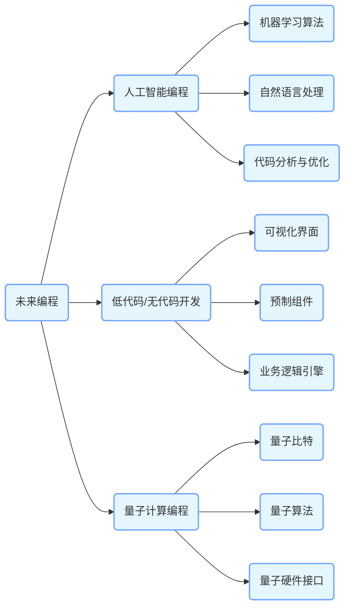

# 未来编程的趋势与挑战：程序员的生存之道

> 关键词：未来编程趋势、程序员挑战、生存之道、人工智能编程、低代码开发

> 摘要：本文旨在深入探讨未来编程领域的发展趋势以及程序员面临的诸多挑战，并针对性地提出程序员的生存之道。通过对人工智能与编程的融合、低代码/无代码开发的兴起、量子计算对编程的潜在影响等趋势的分析，以及对技术更新快、竞争加剧、伦理和安全问题等挑战的研究，为程序员在未来的职业发展提供全面且具有前瞻性的建议和策略，助力程序员在不断变化的编程世界中保持竞争力和适应能力。

## 1. 背景介绍 
### 1.1 目的和范围
随着科技的飞速发展，编程领域正经历着前所未有的变革。新的技术和理念不断涌现，深刻地改变着编程的方式和程序员的工作模式。本文的目的在于全面梳理未来编程的发展趋势，深入剖析程序员在这个过程中面临的挑战，并探索有效的生存之道。范围涵盖了从编程语言、开发工具到编程理念等多个层面，以及与之相关的行业动态和社会影响。

### 1.2 预期读者
本文主要面向广大程序员群体，包括初入职场的新手程序员、有一定经验的中级程序员以及资深的技术专家。同时，对于关注科技发展的相关人士，如科技爱好者、行业分析师、企业管理者等，也具有一定的参考价值。

### 1.3 文档结构概述
本文将按照以下结构展开：首先介绍核心概念与联系，帮助读者理解相关的基本概念和它们之间的关系；接着阐述核心算法原理和具体操作步骤，通过Python代码进行详细说明；然后介绍数学模型和公式，并举例说明；再通过项目实战展示代码实际案例并进行详细解释；之后探讨实际应用场景；推荐相关的工具和资源；最后总结未来发展趋势与挑战，提供常见问题与解答以及扩展阅读和参考资料。

### 1.4 术语表
#### 1.4.1 核心术语定义
- **人工智能编程**：指利用人工智能技术辅助或实现编程任务的过程，包括自动化代码生成、智能代码补全、代码质量分析等。
- **低代码/无代码开发**：一种通过可视化界面和少量或无需编写代码的方式来创建应用程序的开发方法。
- **量子计算**：基于量子力学原理的计算方式，具有强大的计算能力，可能会对编程产生深远影响。

#### 1.4.2 相关概念解释
- **机器学习**：人工智能的一个分支，通过让计算机从数据中学习模式和规律，从而实现预测和决策等功能。在编程中，机器学习可以用于代码分析、缺陷预测等。
- **云计算**：通过互联网提供计算资源和服务的模式，包括计算能力、存储、软件等。云计算使得程序员可以更方便地获取资源和部署应用。

#### 1.4.3 缩略词列表
- **AI**：Artificial Intelligence，人工智能
- **ML**：Machine Learning，机器学习
- **QPU**：Quantum Processing Unit，量子处理单元

## 2. 核心概念与联系 

### 核心概念原理
#### 人工智能编程
人工智能编程的核心在于利用机器学习、自然语言处理等技术来处理和分析代码。例如，通过训练模型来学习代码的语法、结构和语义，从而实现代码的自动生成和优化。智能代码补全工具可以根据程序员输入的部分代码，预测接下来可能的代码内容，提高编程效率。

#### 低代码/无代码开发
低代码/无代码开发平台提供了可视化的界面和预制的组件，用户可以通过拖拽、配置等方式来创建应用程序。这些平台通常内置了业务逻辑和数据处理功能，使得非专业程序员也能够参与到应用开发中。

#### 量子计算
量子计算基于量子比特的特性，如叠加和纠缠，能够在短时间内处理复杂的计算任务。在编程方面，量子算法的设计和实现将成为一个新的领域，可能会解决一些传统计算难以处理的问题，如密码学、优化问题等。

### 架构的文本示意图
```plaintext
未来编程生态系统
|-- 人工智能编程
|   |-- 机器学习算法
|   |-- 自然语言处理
|   |-- 代码分析与优化
|-- 低代码/无代码开发
|   |-- 可视化界面
|   |-- 预制组件
|   |-- 业务逻辑引擎
|-- 量子计算编程
|   |-- 量子比特
|   |-- 量子算法
|   |-- 量子硬件接口
```

### Mermaid 流程图


## 3. 核心算法原理 & 具体操作步骤 

### 人工智能编程中的代码生成算法原理
在人工智能编程中，一种常见的代码生成算法是基于循环神经网络（RNN）或其变体，如长短期记忆网络（LSTM）。下面是一个使用Python和Keras库实现简单代码生成的示例：

```python
import numpy as np
from keras.models import Sequential
from keras.layers import LSTM, Dense
from keras.utils import to_categorical

# 示例代码数据
text = "print('Hello, World!')\nfor i in range(10):\n    print(i)"
chars = sorted(list(set(text)))
char_to_index = dict((c, i) for i, c in enumerate(chars))
index_to_char = dict((i, c) for i, c in enumerate(chars))

# 准备训练数据
max_length = 20
step = 1
sentences = []
next_chars = []
for i in range(0, len(text) - max_length, step):
    sentences.append(text[i: i + max_length])
    next_chars.append(text[i + max_length])

x = np.zeros((len(sentences), max_length, len(chars)), dtype=np.bool)
y = np.zeros((len(sentences), len(chars)), dtype=np.bool)
for i, sentence in enumerate(sentences):
    for t, char in enumerate(sentence):
        x[i, t, char_to_index[char]] = 1
    y[i, char_to_index[next_chars[i]]] = 1

# 构建模型
model = Sequential()
model.add(LSTM(128, input_shape=(max_length, len(chars))))
model.add(Dense(len(chars), activation='softmax'))
model.compile(loss='categorical_crossentropy', optimizer='adam')

# 训练模型
model.fit(x, y, batch_size=128, epochs=60)

# 生成代码
start_index = np.random.randint(0, len(text) - max_length)
generated = ''
sentence = text[start_index: start_index + max_length]
generated += sentence
print('----- Generating with seed: "' + sentence + '"')

for i in range(400):
    x_pred = np.zeros((1, max_length, len(chars)))
    for t, char in enumerate(sentence):
        x_pred[0, t, char_to_index[char]] = 1.

    preds = model.predict(x_pred, verbose=0)[0]
    next_index = np.argmax(preds)
    next_char = index_to_char[next_index]

    generated += next_char
    sentence = sentence[1:] + next_char

print(generated)
```

### 具体操作步骤
1. **数据准备**：将示例代码数据进行处理，将字符转换为数字表示，并将其划分为输入序列和对应的下一个字符。
2. **模型构建**：使用Keras构建一个包含LSTM层和全连接层的神经网络模型。
3. **模型训练**：使用准备好的数据对模型进行训练，调整模型的参数以最小化损失函数。
4. **代码生成**：从一个随机的起始序列开始，根据模型的预测生成后续的代码字符。

## 4. 数学模型和公式 & 详细讲解 & 举例说明 

### 循环神经网络（RNN）的数学模型
RNN的基本结构可以用以下公式表示：

$$
h_t = \sigma(W_{hh}h_{t-1} + W_{xh}x_t + b_h)
$$

$$
y_t = W_{hy}h_t + b_y
$$

其中：
- $h_t$ 是时间步 $t$ 的隐藏状态。
- $x_t$ 是时间步 $t$ 的输入。
- $W_{hh}$ 是隐藏状态到隐藏状态的权重矩阵。
- $W_{xh}$ 是输入到隐藏状态的权重矩阵。
- $W_{hy}$ 是隐藏状态到输出的权重矩阵。
- $b_h$ 和 $b_y$ 分别是隐藏状态和输出的偏置向量。
- $\sigma$ 是激活函数，如sigmoid或tanh。

### 详细讲解
RNN通过在每个时间步更新隐藏状态，从而捕捉序列数据中的时间依赖关系。隐藏状态 $h_t$ 不仅取决于当前输入 $x_t$，还取决于上一个时间步的隐藏状态 $h_{t-1}$。输出 $y_t$ 则是由当前隐藏状态 $h_t$ 经过线性变换得到的。

### 举例说明
假设我们有一个简单的RNN，输入 $x_t$ 是一个长度为2的向量，隐藏状态 $h_t$ 也是一个长度为2的向量，输出 $y_t$ 是一个长度为1的向量。权重矩阵和偏置向量的维度如下：
- $W_{xh}$ 是一个 $2 \times 2$ 的矩阵。
- $W_{hh}$ 是一个 $2 \times 2$ 的矩阵。
- $W_{hy}$ 是一个 $1 \times 2$ 的矩阵。
- $b_h$ 是一个长度为2的向量。
- $b_y$ 是一个长度为1的向量。

给定输入 $x_t = [0.5, 0.3]$ 和上一个时间步的隐藏状态 $h_{t-1} = [0.2, 0.4]$，我们可以计算当前时间步的隐藏状态 $h_t$ 和输出 $y_t$：

首先计算 $W_{hh}h_{t-1} + W_{xh}x_t + b_h$：

$$
W_{hh}h_{t-1} = \begin{bmatrix} 0.1 & 0.2 \\ 0.3 & 0.4 \end{bmatrix} \begin{bmatrix} 0.2 \\ 0.4 \end{bmatrix} = \begin{bmatrix} 0.1 \times 0.2 + 0.2 \times 0.4 \\ 0.3 \times 0.2 + 0.4 \times 0.4 \end{bmatrix} = \begin{bmatrix} 0.1 \\ 0.22 \end{bmatrix}
$$

$$
W_{xh}x_t = \begin{bmatrix} 0.5 & 0.6 \\ 0.7 & 0.8 \end{bmatrix} \begin{bmatrix} 0.5 \\ 0.3 \end{bmatrix} = \begin{bmatrix} 0.5 \times 0.5 + 0.6 \times 0.3 \\ 0.7 \times 0.5 + 0.8 \times 0.3 \end{bmatrix} = \begin{bmatrix} 0.43 \\ 0.59 \end{bmatrix}
$$

$$
b_h = \begin{bmatrix} 0.1 \\ 0.2 \end{bmatrix}
$$

$$
W_{hh}h_{t-1} + W_{xh}x_t + b_h = \begin{bmatrix} 0.1 + 0.43 + 0.1 \\ 0.22 + 0.59 + 0.2 \end{bmatrix} = \begin{bmatrix} 0.63 \\ 1.01 \end{bmatrix}
$$

假设激活函数 $\sigma$ 是sigmoid函数：

$$
h_t = \sigma(W_{hh}h_{t-1} + W_{xh}x_t + b_h) = \begin{bmatrix} \frac{1}{1 + e^{-0.63}} \\ \frac{1}{1 + e^{-1.01}} \end{bmatrix} \approx \begin{bmatrix} 0.65 \\ 0.73 \end{bmatrix}
$$

然后计算输出 $y_t$：

$$
W_{hy}h_t = \begin{bmatrix} 0.3 & 0.4 \end{bmatrix} \begin{bmatrix} 0.65 \\ 0.73 \end{bmatrix} = 0.3 \times 0.65 + 0.4 \times 0.73 = 0.487
$$

$$
b_y = 0.1
$$

$$
y_t = W_{hy}h_t + b_y = 0.487 + 0.1 = 0.587
$$

## 5. 项目实战：代码实际案例和详细解释说明 

### 5.1  开发环境搭建
1. **安装Python**：从Python官方网站（https://www.python.org/downloads/）下载并安装Python 3.x版本。
2. **安装依赖库**：使用pip安装必要的库，如Keras、NumPy等。
```bash
pip install keras numpy
```
3. **选择集成开发环境（IDE）**：可以选择PyCharm、Visual Studio Code等IDE，方便代码的编写和调试。

### 5.2  源代码详细实现和代码解读
以下是一个使用Flask框架和机器学习模型实现简单代码生成服务的示例：

```python
from flask import Flask, request, jsonify
from keras.models import load_model
import numpy as np

app = Flask(__name__)

# 加载训练好的模型
model = load_model('code_generation_model.h5')

# 字符映射
chars = sorted(list(set("print('Hello, World!')\nfor i in range(10):\n    print(i)")))
char_to_index = dict((c, i) for i, c in enumerate(chars))
index_to_char = dict((i, c) for i, c in enumerate(chars))

max_length = 20

@app.route('/generate_code', methods=['POST'])
def generate_code():
    data = request.get_json()
    seed_text = data.get('seed_text')
    if len(seed_text) < max_length:
        return jsonify({'error': 'Seed text must be at least {} characters long'.format(max_length)}), 400

    generated = ''
    sentence = seed_text[-max_length:]
    generated += sentence

    for i in range(200):
        x_pred = np.zeros((1, max_length, len(chars)))
        for t, char in enumerate(sentence):
            x_pred[0, t, char_to_index[char]] = 1.

        preds = model.predict(x_pred, verbose=0)[0]
        next_index = np.argmax(preds)
        next_char = index_to_char[next_index]

        generated += next_char
        sentence = sentence[1:] + next_char

    return jsonify({'generated_code': generated})

if __name__ == '__main__':
    app.run(debug=True)
```

### 代码解读与分析
1. **Flask应用初始化**：创建一个Flask应用实例，并加载训练好的代码生成模型。
2. **字符映射**：定义字符到索引和索引到字符的映射，用于将字符转换为数字表示和将数字表示转换为字符。
3. **API接口**：定义一个POST请求的接口 `/generate_code`，接收一个包含种子文本的JSON数据。
4. **代码生成**：根据种子文本生成后续的代码，并将生成的代码作为JSON响应返回。

## 6. 实际应用场景 

### 人工智能编程的应用场景
- **自动化测试**：使用人工智能算法自动生成测试用例，提高测试效率和覆盖率。
- **代码审查**：通过分析代码的语法、结构和语义，自动发现代码中的潜在问题和漏洞。
- **智能编程助手**：为程序员提供实时的代码建议和解决方案，帮助他们更快地完成编程任务。

### 低代码/无代码开发的应用场景
- **业务流程自动化**：快速创建业务流程管理系统，实现业务流程的自动化和优化。
- **数据可视化**：无需编写复杂的代码，即可创建交互式的数据可视化报表和仪表盘。
- **小型应用开发**：对于一些简单的业务需求，如内部管理系统、小型网站等，可以使用低代码/无代码开发平台快速开发上线。

### 量子计算编程的应用场景
- **密码学**：量子计算可以破解传统的加密算法，同时也可以开发更安全的量子加密算法。
- **优化问题**：解决复杂的优化问题，如旅行商问题、资源分配问题等，提高计算效率。
- **药物研发**：模拟分子结构和化学反应，加速药物研发的过程。

## 7. 工具和资源推荐
### 7.1 学习资源推荐
#### 7.1.1 书籍推荐
- 《Python深度学习》：介绍了使用Python和Keras进行深度学习的基础知识和实践技巧。
- 《人工智能：一种现代的方法》：全面介绍了人工智能的理论和方法，是人工智能领域的经典教材。
- 《量子计算与量子信息》：详细讲解了量子计算的基本原理和算法，适合对量子计算感兴趣的读者。

#### 7.1.2 在线课程
- Coursera上的“深度学习专项课程”：由深度学习领域的知名专家授课，内容涵盖了深度学习的各个方面。
- edX上的“量子计算基础”：介绍了量子计算的基本概念和原理，以及量子算法的设计和实现。
- Udemy上的“低代码/无代码开发实战”：通过实际案例介绍了低代码/无代码开发平台的使用方法和技巧。

#### 7.1.3 技术博客和网站
- Medium：上面有很多关于编程、人工智能、量子计算等领域的优质博客文章。
- Towards Data Science：专注于数据科学和机器学习领域的技术博客，提供了很多实用的技术文章和案例。
- Hacker News：是一个技术社区，上面有很多关于科技行业的最新动态和技术讨论。

### 7.2 开发工具框架推荐
#### 7.2.1 IDE和编辑器
- PyCharm：是一款专门为Python开发设计的集成开发环境，提供了丰富的功能和插件，方便代码的编写、调试和管理。
- Visual Studio Code：是一款轻量级的代码编辑器，支持多种编程语言，并且有大量的扩展插件可供选择。
- Jupyter Notebook：是一个交互式的开发环境，适合进行数据分析、机器学习等领域的实验和开发。

#### 7.2.2 调试和性能分析工具
- pdb：Python自带的调试器，可以帮助程序员定位和解决代码中的问题。
- cProfile：Python的性能分析工具，可以分析代码的执行时间和函数调用关系，帮助优化代码性能。
- TensorBoard：是TensorFlow的可视化工具，可以帮助用户直观地查看模型的训练过程和性能指标。

#### 7.2.3 相关框架和库
- Keras：是一个高级神经网络API，简单易用，适合快速搭建和训练深度学习模型。
- PyTorch：是一个开源的深度学习框架，提供了丰富的工具和库，支持动态图和静态图的构建。
- LowCode Studio：是一个低代码开发平台，提供了可视化的界面和预制的组件，方便用户快速创建应用程序。

### 7.3 相关论文著作推荐
#### 7.3.1 经典论文
- “Learning Representations by Back-propagating Errors”：介绍了反向传播算法，是神经网络领域的经典论文。
- “Attention Is All You Need”：提出了Transformer架构，在自然语言处理领域取得了巨大的成功。
- “Quantum Computation and the Turing Machine”：探讨了量子计算与图灵机的关系，为量子计算的发展奠定了理论基础。

#### 7.3.2 最新研究成果
- 关注顶级学术会议，如NeurIPS（神经信息处理系统大会）、ICML（国际机器学习会议）、QIP（量子信息处理会议）等，了解最新的研究成果和技术趋势。
- 阅读相关的学术期刊，如Journal of Artificial Intelligence Research（JAIR）、Quantum Information & Computation等。

#### 7.3.3 应用案例分析
- 查看一些知名科技公司的技术博客和案例分享，如Google AI Blog、Microsoft Research等，了解他们在实际项目中应用人工智能、量子计算等技术的经验和方法。

## 8. 总结：未来发展趋势与挑战

### 未来发展趋势
- **人工智能与编程的深度融合**：人工智能将在编程的各个环节发挥越来越重要的作用，如自动化代码生成、智能调试、代码优化等。
- **低代码/无代码开发的普及**：随着企业对数字化转型的需求不断增加，低代码/无代码开发平台将得到更广泛的应用，使得更多非专业程序员能够参与到应用开发中。
- **量子计算编程的兴起**：随着量子计算技术的不断发展，量子算法的设计和实现将成为一个新的研究热点，为解决一些复杂的计算问题提供新的思路和方法。

### 挑战
- **技术更新快**：编程领域的技术发展迅速，程序员需要不断学习和掌握新的技术和知识，以适应市场的需求。
- **竞争加剧**：随着编程行业的发展，越来越多的人进入这个领域，竞争也越来越激烈。程序员需要不断提升自己的技能和竞争力，才能在市场中脱颖而出。
- **伦理和安全问题**：人工智能编程、量子计算等技术的发展也带来了一些伦理和安全问题，如算法偏见、数据隐私、量子安全等，程序员需要关注这些问题，并采取相应的措施来解决。

### 程序员的生存之道
- **持续学习**：保持学习的热情和动力，不断学习新的技术和知识，关注行业的最新动态和发展趋势。
- **培养跨学科能力**：未来的编程需要与其他领域的知识相结合，如人工智能、量子物理、数学等，程序员需要培养跨学科的能力，以更好地应对未来的挑战。
- **注重实践**：通过实际项目的实践，积累经验，提高自己的解决问题的能力和创新能力。
- **建立良好的人际关系**：与同行、专家、客户等建立良好的人际关系，分享经验和知识，拓展人脉资源。

## 9. 附录：常见问题与解答 

### 问题1：人工智能编程会取代程序员吗？
答：不会。虽然人工智能编程可以自动化一些编程任务，但它并不能完全取代程序员。程序员仍然需要负责设计算法、处理复杂的业务逻辑、进行系统架构设计等工作。而且，人工智能编程也需要程序员来开发和维护相关的模型和工具。

### 问题2：低代码/无代码开发平台适合所有的项目吗？
答：不是。低代码/无代码开发平台适合一些简单的、标准化的项目，如业务流程自动化、数据可视化等。对于一些复杂的、个性化的项目，如大型游戏开发、高性能计算等，仍然需要专业的程序员使用传统的编程方法来开发。

### 问题3：量子计算编程需要具备哪些知识和技能？
答：量子计算编程需要具备量子物理、线性代数、计算机科学等方面的知识。同时，还需要掌握量子编程语言和开发工具，如Qiskit、Cirq等。

## 10. 扩展阅读 & 参考资料 

### 扩展阅读
- 《代码大全》：全面介绍了软件开发的各个方面，包括代码设计、代码质量、项目管理等，是程序员的必备书籍。
- 《人月神话》：探讨了软件开发中的团队协作、项目管理等问题，对程序员的职业发展有很大的启示。
- 《黑客与画家》：从黑客和画家的角度探讨了编程的艺术和创造力，让读者对编程有更深入的理解。

### 参考资料
- 相关的学术论文和研究报告，可以从学术数据库如IEEE Xplore、ACM Digital Library等获取。
- 各大科技公司的官方文档和技术博客，如Google、Microsoft、Amazon等。
- 开源项目的文档和代码，如GitHub上的相关项目。