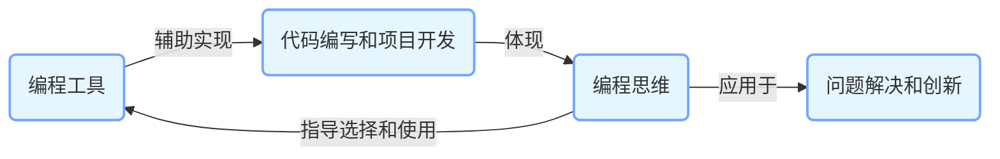

# 未来编程的趋势：从工具到思维

> 关键词：未来编程趋势、编程工具、编程思维、技术变革、创新思维

> 摘要：本文深入探讨未来编程从工具到思维的发展趋势。首先介绍编程发展的背景，明确目的、预期读者等。接着阐述编程工具与编程思维的核心概念及联系，详细讲解相关算法原理与操作步骤。通过数学模型和公式进一步剖析，结合项目实战案例展示实际应用。探讨实际应用场景，推荐学习资源、开发工具和相关论文著作。最后总结未来编程发展的趋势与挑战，解答常见问题并提供参考资料，旨在帮助读者全面理解未来编程趋势的转变，提升对编程的认知和实践能力。

## 1. 背景介绍 
### 1.1 目的和范围
编程作为现代科技领域的核心技能，其发展日新月异。本文章的目的在于深入探讨未来编程从依赖工具向注重思维转变的趋势。范围涵盖编程领域的各个方面，包括编程工具的演变、编程思维的重要性及具体体现，以及这种趋势对编程行业和从业者的影响。通过对这一趋势的研究，帮助读者更好地理解编程的发展方向，提前做好应对准备，提升自身的编程能力和竞争力。

### 1.2 预期读者
本文预期读者包括广大编程爱好者、专业程序员、软件工程师、计算机专业学生以及对科技发展趋势感兴趣的人士。无论是初学者想要了解编程的未来走向，还是有一定经验的专业人士希望在技术变革中保持领先，都能从本文中获取有价值的信息。

### 1.3 文档结构概述
本文将按照以下结构展开：首先介绍背景信息，包括目的、预期读者等；接着阐述编程工具与编程思维的核心概念及联系，以帮助读者建立基本的认知框架；然后详细讲解核心算法原理和具体操作步骤，通过 Python 代码进行示例；随后介绍相关的数学模型和公式，并举例说明；通过项目实战案例展示如何在实际中应用这些理论；探讨实际应用场景，分析这种趋势在不同领域的应用；推荐学习资源、开发工具和相关论文著作，为读者提供进一步学习的方向；最后总结未来编程的发展趋势与挑战，解答常见问题并提供参考资料。

### 1.4 术语表
#### 1.4.1 核心术语定义
- **编程工具**：指在编程过程中使用的各种软件和硬件，如集成开发环境（IDE）、文本编辑器、编译器、调试器等，用于辅助程序员编写、测试和部署代码。
- **编程思维**：是一种将问题抽象化、逻辑化，并通过算法和数据结构来解决问题的思维方式。它包括分解问题、模式识别、抽象和算法设计等关键要素。
- **算法**：是一系列解决问题的明确指令，是编程的核心内容之一，用于实现特定的功能。
- **数据结构**：是指相互之间存在一种或多种特定关系的数据元素的集合，用于组织和存储数据，以便高效地进行操作。

#### 1.4.2 相关概念解释
- **抽象**：在编程中，抽象是指忽略问题的细节，提取其本质特征的过程。通过抽象，可以将复杂的问题简化，便于理解和处理。
- **模式识别**：是指在编程过程中识别问题中的重复模式和规律，以便复用已有的解决方案或设计新的算法。
- **算法设计**：是指根据问题的需求和特点，设计出能够解决问题的算法的过程。算法设计需要考虑时间复杂度、空间复杂度等因素。

#### 1.4.3 缩略词列表
- **IDE**：Integrated Development Environment，集成开发环境
- **API**：Application Programming Interface，应用程序编程接口
- **OOP**：Object-Oriented Programming，面向对象编程
- **FP**：Functional Programming，函数式编程

## 2. 核心概念与联系 
### 编程工具
编程工具是程序员实现代码编写和项目开发的重要辅助手段。传统的编程工具主要包括文本编辑器和编译器。文本编辑器如 Vim、Emacs 等，提供了基本的代码编辑功能，程序员可以在其中输入和修改代码。编译器则负责将程序员编写的高级语言代码翻译成计算机能够理解的机器语言代码。

随着编程技术的发展，集成开发环境（IDE）逐渐成为主流的编程工具。IDE 集成了代码编辑、编译、调试、版本控制等多种功能，大大提高了程序员的开发效率。例如，Eclipse、IntelliJ IDEA 等 IDE 为 Java 开发提供了强大的支持，Visual Studio 则是 Windows 平台上开发多种语言的首选工具。

此外，还有一些专门的编程工具，如数据库管理工具、图形化开发工具等，满足不同编程场景的需求。

### 编程思维
编程思维是程序员解决问题的核心能力。它包括以下几个关键要素：
- **分解问题**：将一个复杂的问题分解成多个小的、易于解决的子问题。例如，在开发一个电子商务网站时，可以将问题分解为用户登录、商品展示、购物车管理、订单处理等子问题。
- **模式识别**：识别问题中的重复模式和规律，以便复用已有的解决方案。例如，在处理不同类型的数据排序问题时，可以识别出排序算法的模式，选择合适的排序算法进行处理。
- **抽象**：忽略问题的细节，提取其本质特征。例如，在设计一个游戏时，可以将角色、道具等抽象为对象，通过对象之间的交互来实现游戏的功能。
- **算法设计**：根据问题的需求和特点，设计出能够解决问题的算法。例如，在开发一个搜索引擎时，需要设计出高效的搜索算法，以提高搜索效率。

### 编程工具与编程思维的联系
编程工具和编程思维是相辅相成的关系。编程工具是实现编程思维的手段，而编程思维则指导着编程工具的使用。

一方面，编程思维决定了程序员如何选择和使用编程工具。例如，具有良好编程思维的程序员能够根据问题的特点选择合适的编程工具，并且能够充分发挥编程工具的功能。另一方面，编程工具的发展也促进了编程思维的提升。例如，现代的 IDE 提供了丰富的代码提示、调试功能等，帮助程序员更好地理解和实现自己的编程思维。

### 文本示意图
```plaintext
编程工具 <---- 相互作用 ----> 编程思维
|                          |
| 辅助实现编程思维         | 指导选择和使用工具
|                          |
V                          V
代码编写和项目开发         问题解决和创新
```

### Mermaid 流程图


## 3. 核心算法原理 & 具体操作步骤 
### 算法原理讲解 - 冒泡排序算法
冒泡排序是一种简单的排序算法，其基本思想是通过多次比较相邻元素的大小，将较大的元素逐步“冒泡”到数组的末尾。

以下是使用 Python 实现的冒泡排序算法：
```python
def bubble_sort(arr):
    n = len(arr)
    for i in range(n):
        for j in range(0, n - i - 1):
            if arr[j] > arr[j + 1]:
                arr[j], arr[j + 1] = arr[j + 1], arr[j]
    return arr

# 测试冒泡排序算法
arr = [64, 34, 25, 12, 22, 11, 90]
sorted_arr = bubble_sort(arr)
print("排序后的数组:", sorted_arr)
```
### 具体操作步骤
1. **确定数组长度**：首先获取数组的长度 `n`，这是为了确定需要进行比较的次数。
2. **外层循环**：外层循环控制排序的轮数，需要进行 `n` 轮排序。
3. **内层循环**：内层循环用于比较相邻元素的大小，并在必要时交换它们的位置。每一轮排序都会将当前未排序部分的最大元素移动到末尾。
4. **交换元素**：如果相邻元素的顺序不正确（前一个元素大于后一个元素），则交换它们的位置。
5. **返回结果**：经过 `n` 轮排序后，数组就会按照升序排列，最后返回排序后的数组。

### 算法复杂度分析
- **时间复杂度**：冒泡排序的时间复杂度为 $O(n^2)$，其中 $n$ 是数组的长度。这是因为需要进行两层嵌套循环，对于每个元素都需要进行多次比较。
- **空间复杂度**：冒泡排序的空间复杂度为 $O(1)$，因为只需要常数级的额外空间来进行元素的交换。

### 算法优化
冒泡排序的基本实现效率较低，可以进行一些优化。例如，添加一个标志位来判断是否在某一轮排序中没有发生交换，如果没有发生交换，则说明数组已经有序，可以提前结束排序。

以下是优化后的冒泡排序算法：
```python
def optimized_bubble_sort(arr):
    n = len(arr)
    for i in range(n):
        swapped = False
        for j in range(0, n - i - 1):
            if arr[j] > arr[j + 1]:
                arr[j], arr[j + 1] = arr[j + 1], arr[j]
                swapped = True
        if not swapped:
            break
    return arr

# 测试优化后的冒泡排序算法
arr = [64, 34, 25, 12, 22, 11, 90]
sorted_arr = optimized_bubble_sort(arr)
print("优化后排序后的数组:", sorted_arr)
```

## 4. 数学模型和公式 & 详细讲解 & 举例说明 
### 时间复杂度分析
时间复杂度是衡量算法执行效率的一个重要指标，它表示算法的执行时间与输入规模之间的关系。通常用大 $O$ 符号来表示。

对于冒泡排序算法，其基本操作是比较相邻元素的大小和交换元素的位置。在最坏情况下，即数组是逆序排列时，需要进行的比较次数为：
$$
\begin{align*}
&(n - 1)+(n - 2)+\cdots+1\\
=&\frac{n(n - 1)}{2}\\
=&O(n^2)
\end{align*}
$$
其中 $n$ 是数组的长度。这是因为在第一轮排序中，需要比较 $n - 1$ 次；在第二轮排序中，需要比较 $n - 2$ 次；以此类推，直到最后一轮排序只需要比较 1 次。

### 空间复杂度分析
空间复杂度是衡量算法所需额外存储空间的指标，它表示算法的存储空间与输入规模之间的关系。同样用大 $O$ 符号来表示。

对于冒泡排序算法，只需要常数级的额外空间来进行元素的交换，因此其空间复杂度为 $O(1)$。

### 举例说明
假设有一个数组 `arr = [64, 34, 25, 12, 22, 11, 90]`，长度 $n = 7$。

在冒泡排序的第一轮中，需要比较 $n - 1 = 6$ 次，比较过程如下：
- 比较 `64` 和 `34`，交换位置，数组变为 `[34, 64, 25, 12, 22, 11, 90]`。
- 比较 `64` 和 `25`，交换位置，数组变为 `[34, 25, 64, 12, 22, 11, 90]`。
- 比较 `64` 和 `12`，交换位置，数组变为 `[34, 25, 12, 64, 22, 11, 90]`。
- 比较 `64` 和 `22`，交换位置，数组变为 `[34, 25, 12, 22, 64, 11, 90]`。
- 比较 `64` 和 `11`，交换位置，数组变为 `[34, 25, 12, 22, 11, 64, 90]`。
- 比较 `64` 和 `90`，不交换位置，数组仍为 `[34, 25, 12, 22, 11, 64, 90]`。

经过第一轮排序后，最大的元素 `90` 已经移动到了数组的末尾。接下来的每一轮排序都会将当前未排序部分的最大元素移动到末尾，直到数组完全有序。

## 5. 项目实战：代码实际案例和详细解释说明 
### 5.1  开发环境搭建
本次项目实战将使用 Python 语言进行开发，开发环境的搭建步骤如下：
1. **安装 Python**：访问 Python 官方网站（https://www.python.org/downloads/），根据自己的操作系统选择合适的 Python 版本进行下载和安装。
2. **选择集成开发环境（IDE）**：推荐使用 PyCharm 作为开发工具，它是一款功能强大的 Python IDE，提供了丰富的代码提示、调试功能等。访问 PyCharm 官方网站（https://www.jetbrains.com/pycharm/download/），下载并安装 PyCharm。
3. **创建项目**：打开 PyCharm，选择 `Create New Project`，创建一个新的 Python 项目。

### 5.2  源代码详细实现和代码解读
本次项目实战将实现一个简单的学生信息管理系统，包括学生信息的添加、删除、查询和显示功能。

以下是实现该系统的 Python 代码：
```python
# 定义学生类
class Student:
    def __init__(self, id, name, age):
        self.id = id
        self.name = name
        self.age = age

    def __str__(self):
        return f"ID: {self.id}, Name: {self.name}, Age: {self.age}"

# 定义学生信息管理系统类
class StudentManagementSystem:
    def __init__(self):
        self.students = []

    # 添加学生信息
    def add_student(self, student):
        self.students.append(student)
        print(f"学生 {student.name} 信息添加成功！")

    # 删除学生信息
    def delete_student(self, id):
        for student in self.students:
            if student.id == id:
                self.students.remove(student)
                print(f"学生 ID 为 {id} 的信息删除成功！")
                return
        print(f"未找到学生 ID 为 {id} 的信息！")

    # 查询学生信息
    def query_student(self, id):
        for student in self.students:
            if student.id == id:
                print(student)
                return
        print(f"未找到学生 ID 为 {id} 的信息！")

    # 显示所有学生信息
    def show_all_students(self):
        if not self.students:
            print("暂无学生信息！")
        else:
            for student in self.students:
                print(student)

# 主函数
def main():
    sms = StudentManagementSystem()
    while True:
        print("\n学生信息管理系统")
        print("1. 添加学生信息")
        print("2. 删除学生信息")
        print("3. 查询学生信息")
        print("4. 显示所有学生信息")
        print("5. 退出系统")
        choice = input("请输入你的选择：")
        if choice == "1":
            id = input("请输入学生 ID：")
            name = input("请输入学生姓名：")
            age = input("请输入学生年龄：")
            student = Student(id, name, age)
            sms.add_student(student)
        elif choice == "2":
            id = input("请输入要删除的学生 ID：")
            sms.delete_student(id)
        elif choice == "3":
            id = input("请输入要查询的学生 ID：")
            sms.query_student(id)
        elif choice == "4":
            sms.show_all_students()
        elif choice == "5":
            print("退出系统，再见！")
            break
        else:
            print("输入无效，请重新输入！")

if __name__ == "__main__":
    main()
```
### 5.3  代码解读与分析
1. **学生类（`Student`）**：该类用于表示学生信息，包含学生的 ID、姓名和年龄属性。`__init__` 方法用于初始化学生信息，`__str__` 方法用于返回学生信息的字符串表示。
2. **学生信息管理系统类（`StudentManagementSystem`）**：该类用于管理学生信息，包含一个学生列表 `students`。`add_student` 方法用于添加学生信息，`delete_student` 方法用于删除学生信息，`query_student` 方法用于查询学生信息，`show_all_students` 方法用于显示所有学生信息。
3. **主函数（`main`）**：该函数是程序的入口，通过一个无限循环提供用户交互界面，根据用户的选择调用相应的方法。

通过这个项目实战，我们可以看到编程思维在实际项目中的应用。例如，将学生信息管理系统分解为学生类和学生信息管理系统类，体现了分解问题的思维方式；通过方法的封装和调用，实现了代码的复用和模块化。

## 6. 实际应用场景 
### 人工智能领域
在人工智能领域，编程思维的重要性日益凸显。例如，在机器学习算法的开发中，需要将复杂的问题分解为数据预处理、模型选择、训练和评估等子问题。同时，需要运用抽象思维将不同类型的数据和模型抽象为统一的表示形式，以便进行处理。编程工具则用于实现这些算法，如使用 Python 的 TensorFlow、PyTorch 等框架进行深度学习模型的开发。

### 软件开发领域
在软件开发中，编程思维指导着软件的架构设计和模块划分。例如，在开发一个大型的电子商务系统时，需要将系统分解为用户管理、商品管理、订单管理等模块，每个模块又可以进一步分解为更小的子模块。编程工具则用于实现这些模块，如使用 Java 的 Spring 框架进行后端开发，使用 HTML、CSS 和 JavaScript 进行前端开发。

### 嵌入式系统领域
在嵌入式系统开发中，编程思维需要考虑硬件资源的限制和实时性要求。例如，在开发一个智能家居设备时，需要将设备的功能分解为传感器数据采集、数据处理、控制指令发送等子功能。编程工具则用于将这些功能实现到嵌入式芯片中，如使用 C 语言进行嵌入式软件开发，使用 Keil 等开发工具进行代码编译和调试。

### 金融科技领域
在金融科技领域，编程思维用于处理复杂的金融数据和交易逻辑。例如，在开发一个股票交易系统时，需要将交易过程分解为行情获取、交易策略制定、订单执行等子过程。编程工具则用于实现这些功能，如使用 Python 的 Pandas、NumPy 等库进行数据处理，使用 Java 的 Spring Boot 框架进行后端开发。

## 7. 工具和资源推荐
### 7.1 学习资源推荐
#### 7.1.1 书籍推荐
- 《Python 编程：从入门到实践》：这本书适合 Python 初学者，通过实际项目帮助读者快速掌握 Python 编程的基础知识和技巧。
- 《算法导论》：经典的算法书籍，全面介绍了各种算法的原理和实现，对于提高编程思维和算法能力有很大帮助。
- 《代码大全》：这本书涵盖了软件开发的各个方面，包括代码设计、代码规范、调试技巧等，是一本软件开发的百科全书。

#### 7.1.2 在线课程
- Coursera 上的“Python for Everybody”：由密歇根大学提供的 Python 课程，适合初学者，内容丰富，讲解详细。
- edX 上的“Introduction to Computer Science and Programming Using Python”：由麻省理工学院提供的 Python 课程，深入介绍了 Python 编程的原理和应用。
- 慕课网上的“Python 3 进阶教程”：国内优秀的 Python 在线课程，适合有一定基础的学习者，提供了很多实际项目案例。

#### 7.1.3 技术博客和网站
- 阮一峰的网络日志：提供了很多关于编程、前端开发、技术趋势等方面的文章，内容深入浅出，易于理解。
- 开源中国：国内知名的开源技术社区，提供了很多开源项目和技术文章，对于了解最新的技术动态和学习开源项目有很大帮助。
- Stack Overflow：全球最大的程序员问答社区，遇到编程问题时可以在这里查找解决方案，同时也可以学习其他程序员的经验和技巧。

### 7.2 开发工具框架推荐
#### 7.2.1 IDE和编辑器
- PyCharm：功能强大的 Python IDE，提供了丰富的代码提示、调试功能等，适合 Python 开发。
- Visual Studio Code：轻量级的代码编辑器，支持多种编程语言，拥有丰富的插件生态系统，适合快速开发和调试。
- IntelliJ IDEA：功能强大的 Java IDE，提供了高效的代码编辑、调试和版本控制功能，适合 Java 开发。

#### 7.2.2 调试和性能分析工具
- PDB：Python 自带的调试工具，可以帮助程序员定位和解决代码中的问题。
- Py-Spy：用于分析 Python 程序性能的工具，可以找出程序中的性能瓶颈。
- VisualVM：用于分析 Java 程序性能的工具，提供了丰富的性能监控和分析功能。

#### 7.2.3 相关框架和库
- Django：Python 的 Web 开发框架，提供了高效的开发模式和丰富的功能组件，适合开发大型的 Web 应用。
- Flask：轻量级的 Python Web 开发框架，简洁灵活，适合快速开发小型的 Web 应用。
- TensorFlow：开源的深度学习框架，提供了丰富的深度学习模型和工具，适合开发人工智能应用。

### 7.3 相关论文著作推荐
#### 7.3.1 经典论文
- “A Mathematical Theory of Communication”：香农的经典论文，奠定了信息论的基础，对于理解信息的本质和传输有重要意义。
- “The Cathedral and the Bazaar”：探讨了开源软件开发的模式和理念，对于理解开源软件的发展和管理有很大帮助。
- “The Mythical Man-Month”：经典的软件工程著作，提出了很多关于软件开发项目管理的重要观点和原则。

#### 7.3.2 最新研究成果
- 关注顶级学术会议和期刊，如 ACM SIGPLAN、IEEE Transactions on Software Engineering 等，了解编程领域的最新研究成果。
- 关注知名研究机构和学者的研究动态，如麻省理工学院、斯坦福大学等的计算机科学研究团队。

#### 7.3.3 应用案例分析
- 研究一些成功的软件项目和开源项目，如 Linux 操作系统、GitHub 等，分析它们的架构设计、开发模式和编程思维的应用。
- 关注行业内的创新企业和产品，如谷歌、亚马逊等的技术创新和应用案例，学习它们的先进经验和技术。

## 8. 总结：未来发展趋势与挑战
### 未来发展趋势
- **从工具依赖到思维主导**：未来编程将更加注重编程思维的培养和应用，而不仅仅是依赖编程工具。程序员需要具备更强的问题解决能力和创新思维，能够独立设计和实现复杂的算法和系统。
- **跨学科融合**：编程将与其他学科如数学、物理学、生物学等深度融合，产生更多的交叉学科领域，如计算生物学、量子计算等。程序员需要具备跨学科的知识和思维能力，才能应对这些挑战。
- **人工智能与自动化**：人工智能和自动化技术将在编程领域得到更广泛的应用，如自动代码生成、智能调试等。程序员需要学会与人工智能工具协作，提高编程效率和质量。
- **开源和社区协作**：开源软件和社区协作将继续发展，程序员将更加注重开源文化和社区贡献。通过参与开源项目，程序员可以学习到更多的优秀代码和编程思维，同时也可以为开源社区做出贡献。

### 挑战
- **知识更新速度快**：编程领域的技术发展日新月异，程序员需要不断学习和更新知识，才能跟上技术的发展步伐。
- **跨学科知识要求高**：随着跨学科融合的发展，程序员需要具备更多的跨学科知识，这对程序员的学习能力和综合素质提出了更高的要求。
- **人工智能的竞争**：人工智能和自动化技术的发展可能会对一些重复性的编程工作产生冲击，程序员需要不断提升自己的编程思维和创新能力，才能在竞争中脱颖而出。
- **数据安全和隐私问题**：随着信息技术的发展，数据安全和隐私问题日益突出。程序员需要在编程过程中充分考虑数据安全和隐私问题，采取有效的措施保护用户的数据。

## 9. 附录：常见问题与解答
### 如何培养编程思维？
- **多做练习题**：通过做一些编程练习题，如 LeetCode、HackerRank 等平台上的题目，可以锻炼自己的逻辑思维和问题解决能力。
- **学习算法和数据结构**：算法和数据结构是编程思维的核心内容，学习它们可以帮助我们更好地理解和解决问题。
- **分析优秀代码**：学习和分析优秀的代码，了解别人的编程思路和方法，可以从中获取灵感和启发。
- **参与开源项目**：参与开源项目可以与其他程序员合作，学习他们的编程思维和实践经验，同时也可以为开源社区做出贡献。

### 编程工具重要还是编程思维重要？
编程工具和编程思维都很重要，它们是相辅相成的关系。编程工具是实现编程思维的手段，而编程思维则指导着编程工具的使用。在编程过程中，需要根据具体的问题和需求选择合适的编程工具，同时运用编程思维来解决问题。

### 如何选择适合自己的编程工具？
- **根据编程语言选择**：不同的编程语言有不同的编程工具，例如 Python 可以选择 PyCharm、Visual Studio Code 等，Java 可以选择 IntelliJ IDEA、Eclipse 等。
- **根据项目需求选择**：根据项目的规模、复杂度和功能需求选择合适的编程工具。例如，开发大型项目可以选择功能强大的 IDE，开发小型项目可以选择轻量级的编辑器。
- **根据个人习惯选择**：每个人的编程习惯不同，可以根据自己的习惯选择适合自己的编程工具。例如，有些人喜欢使用命令行工具，有些人喜欢使用图形化界面的工具。

### 未来编程会被人工智能取代吗？
虽然人工智能和自动化技术在编程领域的应用越来越广泛，但编程不会被完全取代。人工智能可以帮助程序员完成一些重复性的工作，如自动代码生成、智能调试等，但编程思维和创新能力是人类独有的，无法被人工智能取代。未来，程序员需要学会与人工智能工具协作，提高编程效率和质量。

## 10. 扩展阅读 & 参考资料
### 扩展阅读
- 《编程珠玑》：这本书通过实际案例介绍了编程中的各种技巧和方法，对于提高编程水平有很大帮助。
- 《程序员的职业素养》：这本书强调了程序员的职业素养和道德规范，对于培养优秀的程序员有重要意义。
- 《软技能：代码之外的生存指南》：这本书介绍了程序员在职业生涯中需要具备的各种软技能，如沟通能力、团队协作能力等。

### 参考资料
- Python 官方文档：https://docs.python.org/
- Java 官方文档：https://docs.oracle.com/javase/
- 维基百科：https://en.wikipedia.org/