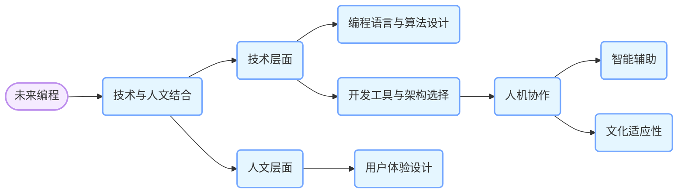

# 未来编程的趋势：技术与人文的结合

> 关键词：未来编程、技术与人文、编程趋势、人机协作、用户体验

> 摘要：本文深入探讨未来编程领域中技术与人文结合的趋势。随着科技的不断进步，编程不再仅仅是冰冷的代码堆砌，人文因素在其中的作用愈发重要。文章将从背景介绍出发，阐述这一趋势的目的和范围，明确预期读者。接着剖析核心概念，讲解相关算法原理和数学模型，通过项目实战展示代码实现和解读。还会探讨其实际应用场景，推荐相关工具和资源，最后总结未来发展趋势与挑战，解答常见问题并提供扩展阅读和参考资料，旨在帮助读者全面理解未来编程中技术与人文结合的重要性和发展方向。

## 1. 背景介绍 
### 1.1 目的和范围
编程领域发展至今，已经取得了巨大的成就。从早期的简单指令集到如今复杂的人工智能和大数据系统，技术的进步可谓日新月异。然而，在追求技术进步的过程中，人们往往忽略了编程的最终目的——服务于人。本文章的目的在于探讨未来编程如何更好地将技术与人文相结合，使编程不仅仅是实现功能的手段，更是满足人类需求、提升人类体验的工具。范围涵盖了编程的各个方面，包括编程语言、开发方法、用户界面设计等，以及与之相关的社会、文化和心理因素。

### 1.2 预期读者
本文预期读者包括广大的程序员、软件架构师、CTO 等技术人员，他们可以从文中了解到未来编程的发展趋势，为自己的技术发展提供方向。同时，也适合对编程和人文领域感兴趣的研究者、学生以及关注科技发展的普通读者，帮助他们理解编程与人文之间的关系以及这种结合对未来社会的影响。

### 1.3 文档结构概述
本文将首先介绍背景知识，包括目的、预期读者和文档结构。接着深入探讨核心概念，分析技术与人文在编程中的联系。然后讲解核心算法原理和具体操作步骤，用 Python 代码进行详细阐述。再介绍相关的数学模型和公式，并举例说明。通过项目实战展示代码实现和解读，探讨实际应用场景。推荐学习、开发工具和相关论文著作。最后总结未来发展趋势与挑战，解答常见问题并提供扩展阅读和参考资料。

### 1.4 术语表
#### 1.4.1 核心术语定义
- **编程**：是指使用特定的编程语言，按照一定的规则和逻辑，编写计算机可以执行的指令序列，以实现特定的功能或解决特定的问题。
- **技术**：在编程领域，技术通常指的是各种编程语言、开发工具、算法、架构等相关的知识和技能。
- **人文**：这里的人文主要是指与人类的价值观、情感、需求、文化等相关的因素，强调编程要以人类为中心，关注人的体验和感受。
- **人机协作**：是指人类和计算机之间通过有效的交互和合作，共同完成任务的过程。在编程中，人机协作体现在程序员与开发工具、用户与软件系统之间的互动。
- **用户体验**：是指用户在使用软件系统或产品过程中的主观感受和体验，包括易用性、舒适性、满意度等方面。

#### 1.4.2 相关概念解释
- **以人为本的设计**：强调在设计过程中，始终将人的需求、能力和行为作为首要考虑因素，使产品或系统更加符合人类的使用习惯和心理需求。
- **情感计算**：是指通过各种技术手段，对人类的情感状态进行识别、分析和处理，使计算机能够更好地理解人类的情感，并做出相应的反应。
- **文化适应性**：在编程中，文化适应性是指软件系统能够根据不同的文化背景和用户群体，提供相应的功能和界面，以满足不同文化的需求。

#### 1.4.3 缩略词列表
- **AI**：Artificial Intelligence，人工智能
- **UI**：User Interface，用户界面
- **UX**：User Experience，用户体验
- **API**：Application Programming Interface，应用程序编程接口

## 2. 核心概念与联系 

### 核心概念原理
在未来编程中，技术与人文的结合是基于人类对软件系统更高层次的需求。从技术角度来看，编程的发展使得计算机能够处理越来越复杂的任务，实现各种强大的功能。然而，这些功能的实现最终是为了服务人类，如果不考虑人类的需求和感受，即使技术再先进，也可能无法得到用户的认可。

人文因素在编程中的体现主要包括用户体验设计、人机协作和文化适应性等方面。用户体验设计要求程序员在开发软件时，充分考虑用户的使用习惯、认知能力和情感需求，使软件的界面更加友好、操作更加便捷。人机协作则强调人类和计算机之间的有效互动，通过合理的设计，让计算机能够更好地理解人类的意图，为人类提供更智能的辅助。文化适应性要求软件能够根据不同的文化背景和用户群体，提供相应的功能和界面，以满足不同文化的需求。

### 架构的文本示意图
```plaintext
               未来编程
               ┌───────────┐
               │           │
               │  技术与人文结合  │
               │           │
               └─────┬─────┘
                     │
       ┌─────────────┴─────────────┐
       │                           │
       │         技术层面          │         人文层面
       │                           │
       ├─────────────┬─────────────┤
       │             │             │
       │ 编程语言与  │  开发工具与  │  用户体验设计
       │  算法设计   │  架构选择   │
       │             │             │
       ├─────────────┴─────────────┤
       │                           │
       │        人机协作           │
       │                           │
       ├─────────────┬─────────────┤
       │             │             │
       │  智能辅助   │  文化适应性  │
       │             │             │
       └─────────────┴─────────────┘
```

### Mermaid 流程图


## 3. 核心算法原理 & 具体操作步骤 

### 算法原理讲解
在未来编程中，有许多算法可以体现技术与人文的结合。以用户体验设计中的个性化推荐算法为例，其核心思想是根据用户的历史行为、偏好和上下文信息，为用户提供个性化的内容和服务。

以下是一个简单的基于用户历史行为的个性化推荐算法的 Python 实现：

```python
import numpy as np

# 定义用户行为数据
user_behavior = {
    'user1': [1, 0, 1, 0, 1],
    'user2': [0, 1, 0, 1, 0],
    'user3': [1, 1, 0, 0, 1]
}

# 定义物品列表
items = ['item1', 'item2', 'item3', 'item4', 'item5']

# 计算用户之间的相似度
def cosine_similarity(user1, user2):
    vector1 = np.array(user_behavior[user1])
    vector2 = np.array(user_behavior[user2])
    dot_product = np.dot(vector1, vector2)
    norm1 = np.linalg.norm(vector1)
    norm2 = np.linalg.norm(vector2)
    if norm1 == 0 or norm2 == 0:
        return 0
    return dot_product / (norm1 * norm2)

# 为指定用户推荐物品
def recommend_items(target_user, top_n=3):
    similarities = {}
    for user in user_behavior:
        if user != target_user:
            similarities[user] = cosine_similarity(target_user, user)
    
    sorted_similarities = sorted(similarities.items(), key=lambda x: x[1], reverse=True)
    
    recommended_items = []
    for similar_user, similarity in sorted_similarities:
        for i in range(len(items)):
            if user_behavior[target_user][i] == 0 and user_behavior[similar_user][i] == 1:
                recommended_items.append(items[i])
        if len(recommended_items) >= top_n:
            break
    
    return recommended_items[:top_n]

# 测试推荐算法
target_user = 'user1'
recommended = recommend_items(target_user)
print(f"为用户 {target_user} 推荐的物品：{recommended}")
```

### 具体操作步骤
1. **数据收集**：收集用户的历史行为数据，例如用户的浏览记录、购买记录、评分记录等。这些数据可以存储在数据库或文件中。
2. **数据预处理**：对收集到的数据进行清洗、转换和归一化处理，以便后续的计算。
3. **相似度计算**：使用合适的相似度计算方法，如余弦相似度、皮尔逊相关系数等，计算用户之间的相似度。
4. **推荐物品生成**：根据用户之间的相似度，找出与目标用户最相似的用户，并推荐这些用户喜欢但目标用户尚未接触过的物品。
5. **推荐结果展示**：将推荐的物品展示给用户，可以通过网页、移动应用等界面进行展示。

## 4. 数学模型和公式 & 详细讲解 & 举例说明 

### 数学模型
在个性化推荐算法中，常用的数学模型是基于向量空间模型。用户的历史行为数据可以表示为一个向量，每个维度对应一个物品，向量的值表示用户对该物品的偏好程度（如是否浏览过、购买过等）。

### 公式
余弦相似度是一种常用的计算向量相似度的方法，其公式为：

$$
\text{cosine similarity}(A, B) = \frac{A \cdot B}{\|A\| \|B\|}
$$

其中，$A$ 和 $B$ 是两个向量，$A \cdot B$ 是它们的点积，$\|A\|$ 和 $\|B\|$ 分别是它们的模。

### 详细讲解
点积 $A \cdot B$ 表示两个向量在各个维度上的乘积之和，它反映了两个向量的方向是否相似。模 $\|A\|$ 和 $\|B\|$ 表示向量的长度，用于归一化点积的结果，使得相似度的值在 $[-1, 1]$ 之间。当两个向量的方向完全相同时，余弦相似度为 1；当两个向量的方向完全相反时，余弦相似度为 -1；当两个向量相互垂直时，余弦相似度为 0。

### 举例说明
假设有两个用户的历史行为向量分别为 $A = [1, 0, 1]$ 和 $B = [0, 1, 1]$，则它们的点积为：

$$
A \cdot B = 1 \times 0 + 0 \times 1 + 1 \times 1 = 1
$$

向量 $A$ 的模为：

$$
\|A\| = \sqrt{1^2 + 0^2 + 1^2} = \sqrt{2}
$$

向量 $B$ 的模为：

$$
\|B\| = \sqrt{0^2 + 1^2 + 1^2} = \sqrt{2}
$$

则它们的余弦相似度为：

$$
\text{cosine similarity}(A, B) = \frac{1}{\sqrt{2} \times \sqrt{2}} = \frac{1}{2}
$$

这表明两个用户的历史行为有一定的相似性。

## 5. 项目实战：代码实际案例和详细解释说明 

### 5.1  开发环境搭建
本次项目实战将使用 Python 语言进行开发，以下是开发环境搭建的步骤：

1. **安装 Python**：访问 Python 官方网站（https://www.python.org/downloads/），下载并安装适合你操作系统的 Python 版本。建议安装 Python 3.7 及以上版本。
2. **安装开发工具**：推荐使用 PyCharm 作为开发工具，它是一款功能强大的 Python 集成开发环境（IDE）。你可以从 JetBrains 官方网站（https://www.jetbrains.com/pycharm/download/）下载并安装 PyCharm。
3. **创建虚拟环境**：在命令行中使用以下命令创建一个虚拟环境：
```bash
python -m venv myenv
```
4. **激活虚拟环境**：在 Windows 系统中，使用以下命令激活虚拟环境：
```bash
myenv\Scripts\activate
```
在 Linux 或 macOS 系统中，使用以下命令激活虚拟环境：
```bash
source myenv/bin/activate
```
5. **安装依赖库**：在虚拟环境中，使用以下命令安装所需的依赖库：
```bash
pip install numpy
```

### 5.2  源代码详细实现和代码解读
以下是一个完整的基于 Flask 框架的个性化推荐系统的代码实现：

```python
from flask import Flask, jsonify
import numpy as np

app = Flask(__name__)

# 定义用户行为数据
user_behavior = {
    'user1': [1, 0, 1, 0, 1],
    'user2': [0, 1, 0, 1, 0],
    'user3': [1, 1, 0, 0, 1]
}

# 定义物品列表
items = ['item1', 'item2', 'item3', 'item4', 'item5']

# 计算用户之间的相似度
def cosine_similarity(user1, user2):
    vector1 = np.array(user_behavior[user1])
    vector2 = np.array(user_behavior[user2])
    dot_product = np.dot(vector1, vector2)
    norm1 = np.linalg.norm(vector1)
    norm2 = np.linalg.norm(vector2)
    if norm1 == 0 or norm2 == 0:
        return 0
    return dot_product / (norm1 * norm2)

# 为指定用户推荐物品
def recommend_items(target_user, top_n=3):
    similarities = {}
    for user in user_behavior:
        if user != target_user:
            similarities[user] = cosine_similarity(target_user, user)
    
    sorted_similarities = sorted(similarities.items(), key=lambda x: x[1], reverse=True)
    
    recommended_items = []
    for similar_user, similarity in sorted_similarities:
        for i in range(len(items)):
            if user_behavior[target_user][i] == 0 and user_behavior[similar_user][i] == 1:
                recommended_items.append(items[i])
        if len(recommended_items) >= top_n:
            break
    
    return recommended_items[:top_n]

@app.route('/recommend/<user>', methods=['GET'])
def get_recommendations(user):
    if user not in user_behavior:
        return jsonify({'error': '用户不存在'}), 404
    recommended = recommend_items(user)
    return jsonify({'recommended_items': recommended})

if __name__ == '__main__':
    app.run(debug=True)
```

### 代码解读与分析
1. **导入必要的库**：导入 Flask 框架和 numpy 库。
2. **定义用户行为数据和物品列表**：使用字典和列表分别存储用户的历史行为数据和物品列表。
3. **计算用户之间的相似度**：定义 `cosine_similarity` 函数，使用余弦相似度公式计算用户之间的相似度。
4. **为指定用户推荐物品**：定义 `recommend_items` 函数，根据用户之间的相似度，为目标用户推荐物品。
5. **定义 Flask 路由**：使用 `@app.route` 装饰器定义一个 GET 请求的路由，用于接收用户的请求并返回推荐的物品。
6. **运行 Flask 应用**：使用 `app.run` 方法启动 Flask 应用，开启调试模式。

## 6. 实际应用场景 
### 电子商务
在电子商务领域，技术与人文的结合可以体现在个性化推荐系统中。通过分析用户的浏览历史、购买记录、搜索关键词等数据，为用户提供个性化的商品推荐，提高用户的购买转化率和满意度。例如，亚马逊的推荐系统会根据用户的历史行为，为用户推荐相关的商品，使得用户更容易发现自己感兴趣的商品。

### 教育
在教育领域，技术与人文的结合可以体现在智能学习系统中。通过分析学生的学习进度、学习习惯、学习能力等数据，为学生提供个性化的学习计划和学习资源，提高学生的学习效果和学习兴趣。例如，一些在线教育平台会根据学生的学习情况，为学生推荐适合的课程和练习题。

### 医疗
在医疗领域，技术与人文的结合可以体现在医疗辅助诊断系统中。通过分析患者的病历、症状、检查结果等数据，为医生提供辅助诊断建议，提高诊断的准确性和效率。同时，考虑患者的心理需求，提供更加人性化的医疗服务。例如，一些医疗软件会在诊断结果中加入解释和建议，帮助患者更好地理解自己的病情。

### 娱乐
在娱乐领域，技术与人文的结合可以体现在游戏和影视推荐系统中。通过分析用户的兴趣爱好、观看历史、评分记录等数据，为用户推荐适合的游戏和影视作品，提高用户的娱乐体验。例如，Netflix 的推荐系统会根据用户的观看历史，为用户推荐相关的影视作品。

## 7. 工具和资源推荐
### 7.1 学习资源推荐
#### 7.1.1 书籍推荐
- 《代码大全》：这本书是软件开发的经典之作，涵盖了软件开发的各个方面，包括编程实践、代码设计、项目管理等，对于提高编程能力和理解编程的本质有很大的帮助。
- 《用户体验要素》：本书详细介绍了用户体验设计的五个层次，包括战略层、范围层、结构层、框架层和表现层，对于理解用户体验设计的原理和方法非常有帮助。
- 《情感化设计》：作者唐纳德·诺曼探讨了情感在设计中的重要性，以及如何通过设计来引发用户的情感共鸣，对于将人文因素融入编程有很好的启示作用。

#### 7.1.2 在线课程
- Coursera 上的“人机交互”课程：该课程由知名高校的教授授课，介绍了人机交互的基本概念、理论和方法，通过实际案例和实验，帮助学生掌握人机交互的设计原则和技巧。
- edX 上的“用户体验设计基础”课程：该课程从用户体验的角度出发，介绍了用户研究、界面设计、交互设计等方面的知识和技能，适合初学者学习。
- Udemy 上的“Python 数据分析实战”课程：该课程通过实际项目，介绍了 Python 在数据分析中的应用，包括数据清洗、数据可视化、机器学习等方面的内容，对于提高编程和数据分析能力有很大的帮助。

#### 7.1.3 技术博客和网站
- Medium：这是一个知名的技术博客平台，上面有很多关于编程、用户体验、人机交互等方面的文章，作者来自世界各地，可以从中获取最新的技术动态和行业趋势。
- Smashing Magazine：该网站专注于设计和开发领域，提供了很多关于用户体验设计、界面设计、前端开发等方面的优秀文章和案例，对于提高设计和开发水平有很大的帮助。
- A List Apart：这是一个专注于网页设计和开发的网站，上面有很多关于网页设计、用户体验、前端技术等方面的深度文章和案例分析，对于理解网页设计的原理和方法非常有帮助。

### 7.2 开发工具框架推荐
#### 7.2.1 IDE和编辑器
- PyCharm：是一款功能强大的 Python 集成开发环境（IDE），提供了代码编辑、调试、版本控制等一系列功能，适合 Python 开发者使用。
- Visual Studio Code：是一款轻量级的代码编辑器，支持多种编程语言，具有丰富的插件生态系统，可以根据自己的需求进行扩展，适合初学者和有经验的开发者使用。
- IntelliJ IDEA：是一款功能强大的 Java 集成开发环境（IDE），提供了代码编辑、调试、版本控制等一系列功能，适合 Java 开发者使用。

#### 7.2.2 调试和性能分析工具
- PySnooper：是一个简单易用的 Python 调试工具，可以在不修改代码的情况下，输出函数的执行过程和变量的值，方便调试代码。
- cProfile：是 Python 标准库中的一个性能分析工具，可以分析程序的性能瓶颈，找出耗时较长的函数和代码段，帮助优化代码。
- Chrome DevTools：是 Chrome 浏览器自带的开发者工具，提供了调试、性能分析、网络监测等一系列功能，适合前端开发者使用。

#### 7.2.3 相关框架和库
- Flask：是一个轻量级的 Python Web 框架，简单易用，适合快速开发 Web 应用。
- Django：是一个功能强大的 Python Web 框架，提供了很多内置的功能和工具，适合开发大型的 Web 应用。
- React：是一个流行的 JavaScript 前端框架，用于构建用户界面，具有高效、灵活等特点。

### 7.3 相关论文著作推荐
#### 7.3.1 经典论文
- 《人机交互的本质》：该论文探讨了人机交互的基本概念、理论和方法，对于理解人机交互的本质和发展方向有很大的帮助。
- 《用户体验设计的原则和方法》：该论文介绍了用户体验设计的基本原则和方法，包括用户研究、界面设计、交互设计等方面的内容，对于提高用户体验设计水平有很大的帮助。
- 《情感计算的发展与应用》：该论文介绍了情感计算的基本概念、技术和应用，对于将情感因素融入编程有很好的启示作用。

#### 7.3.2 最新研究成果
- 每年的 CHI（Conference on Human Factors in Computing Systems）会议上都会有很多关于人机交互、用户体验等方面的最新研究成果发表，可以关注这些会议的论文集。
- ACM Transactions on Computer-Human Interaction 期刊上也会发表很多关于人机交互、用户体验等方面的高质量研究论文，可以关注该期刊的最新文章。

#### 7.3.3 应用案例分析
- 《设计心理学》：作者唐纳德·诺曼通过大量的实际案例，分析了设计中的心理学原理和方法，对于将人文因素融入编程有很好的启示作用。
- 《用户体验设计案例集》：该书籍收集了很多优秀的用户体验设计案例，包括电子商务、教育、医疗等领域，通过分析这些案例，可以学习到用户体验设计的实际应用方法和技巧。

## 8. 总结：未来发展趋势与挑战
### 未来发展趋势
- **更加智能化**：未来的编程将更加智能化，计算机将能够更好地理解人类的意图和需求，提供更加智能的辅助和服务。例如，智能编程助手可以根据程序员的代码片段和注释，自动推荐合适的代码实现和优化建议。
- **更加人性化**：编程将更加注重用户的体验和感受，软件系统将更加符合人类的使用习惯和心理需求。例如，软件的界面将更加简洁、美观、易用，交互方式将更加自然、直观。
- **更加个性化**：未来的编程将能够根据用户的个性化需求和偏好，提供个性化的服务和体验。例如，个性化推荐系统将更加精准地推荐用户感兴趣的内容和商品。
- **更加跨学科**：编程将与其他学科，如心理学、社会学、设计学等更加紧密地结合，形成跨学科的研究和应用领域。例如，通过与心理学的结合，开发出更加符合人类情感需求的软件系统。

### 挑战
- **技术挑战**：实现技术与人文的结合需要解决一系列的技术难题，如情感计算、自然语言处理、人机协作等。这些技术目前还存在很多不足之处，需要进一步的研究和发展。
- **文化差异挑战**：不同的文化背景和用户群体有不同的需求和偏好，如何在软件系统中体现文化适应性是一个挑战。需要进行跨文化的研究和设计，以满足不同文化的需求。
- **伦理和法律挑战**：随着技术的发展，一些伦理和法律问题也逐渐浮现出来，如隐私保护、数据安全、算法偏见等。需要建立相应的伦理和法律规范，以保障用户的权益和社会的公平正义。
- **人才培养挑战**：培养既懂技术又懂人文的复合型人才是一个挑战。目前的教育体系往往侧重于技术方面的培养，缺乏对人文素养的重视。需要改革教育体系，加强跨学科的人才培养。

## 9. 附录：常见问题与解答
### 1. 技术与人文的结合在编程中真的有必要吗？
答：非常有必要。编程的最终目的是服务人类，如果不考虑人类的需求和感受，即使技术再先进，也可能无法得到用户的认可。技术与人文的结合可以使软件系统更加符合人类的使用习惯和心理需求，提高用户的满意度和忠诚度。

### 2. 如何在编程中体现人文因素？
答：可以从以下几个方面体现人文因素：
- **用户体验设计**：在设计软件的界面和交互方式时，充分考虑用户的使用习惯、认知能力和情感需求，使软件的界面更加友好、操作更加便捷。
- **人机协作**：通过合理的设计，让计算机能够更好地理解人类的意图，为人类提供更智能的辅助。例如，智能编程助手可以根据程序员的代码片段和注释，自动推荐合适的代码实现和优化建议。
- **文化适应性**：根据不同的文化背景和用户群体，提供相应的功能和界面，以满足不同文化的需求。例如，软件的界面语言、图标、颜色等可以根据不同的文化进行调整。

### 3. 技术与人文的结合会增加编程的难度吗？
答：在一定程度上会增加编程的难度。因为需要考虑更多的因素，如用户体验、人机协作、文化适应性等。但是，随着技术的发展和工具的不断完善，这种难度会逐渐降低。同时，技术与人文的结合也会带来很多好处，如提高用户的满意度和忠诚度，增加软件的竞争力等。

### 4. 如何衡量技术与人文结合的效果？
答：可以从以下几个方面衡量技术与人文结合的效果：
- **用户满意度**：通过用户调查、用户反馈等方式，了解用户对软件的满意度。
- **用户留存率**：观察用户在使用软件后的留存情况，留存率越高，说明软件越受用户欢迎。
- **业务指标**：如销售额、转化率等，这些指标可以反映软件对业务的促进作用。

## 10. 扩展阅读 & 参考资料
### 扩展阅读
- 《设计中的设计》：作者原研哉通过对设计的深入思考和实践，探讨了设计的本质和意义，对于理解人文因素在设计中的重要性有很大的帮助。
- 《创新者的窘境》：作者克莱顿·克里斯坦森通过对大量企业案例的分析，探讨了创新的规律和方法，对于理解技术创新和人文创新的关系有很大的启示作用。
- 《人类简史：从动物到上帝》：作者尤瓦尔·赫拉利通过对人类历史的回顾和展望，探讨了人类的本质和未来发展方向，对于理解人类的需求和价值观有很大的帮助。

### 参考资料
- Python 官方文档：https://docs.python.org/
- Flask 官方文档：https://flask.palletsprojects.com/
- React 官方文档：https://reactjs.org/
- CHI 会议官方网站：https://chi2024.acm.org/
- ACM Transactions on Computer-Human Interaction 期刊官网：https://dl.acm.org/journal/tochi