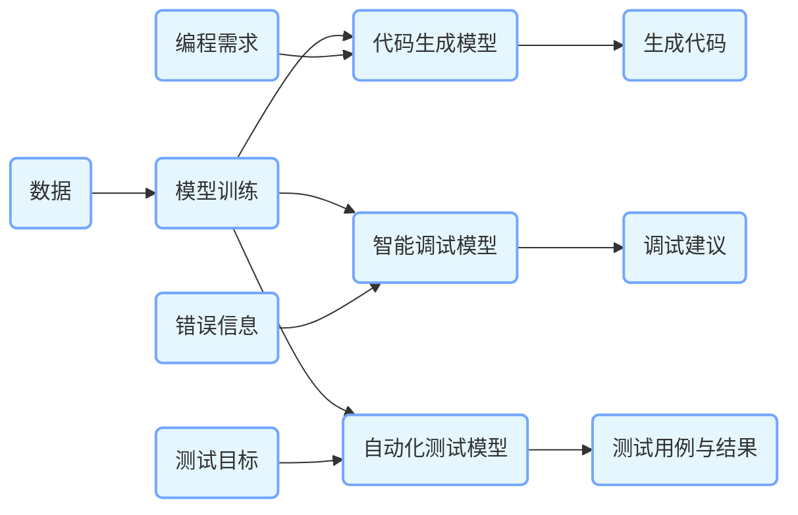

# 未来编程行业的AI应用与发展趋势

> 关键词：编程行业、人工智能、AI应用、发展趋势、代码生成、智能调试、自动化测试

> 摘要：本文聚焦于未来编程行业中人工智能的应用与发展趋势。通过对相关核心概念的阐述、算法原理的剖析、数学模型的讲解以及实际项目案例的分析，深入探讨了AI在编程各个环节的具体应用，包括代码生成、智能调试、自动化测试等。同时，介绍了编程行业中与AI相关的工具和资源，分析了当前的实际应用场景，并对未来的发展趋势和面临的挑战进行了总结，旨在为编程从业者和相关研究者提供全面且深入的参考。

## 1. 背景介绍 
### 1.1 目的和范围
随着人工智能技术的飞速发展，其在编程行业中的应用日益广泛且深入。本文章的目的在于全面探讨未来编程行业中AI的应用现状以及未来的发展趋势，涵盖从基础概念到实际应用的各个方面。范围包括AI在代码开发、测试、维护等编程全生命周期中的应用，以及与之相关的技术、工具和发展方向。

### 1.2 预期读者
本文预期读者主要包括编程行业的从业者，如程序员、软件架构师、CTO等，他们希望了解AI技术在编程中的应用，以便提升自身的编程效率和技能。同时，也适合计算机科学相关专业的学生、研究者，以及对人工智能和编程领域发展感兴趣的爱好者。

### 1.3 文档结构概述
本文将首先介绍与编程行业AI应用相关的核心概念和它们之间的联系，通过文本示意图和Mermaid流程图进行直观展示。接着详细阐述核心算法原理，并结合Python源代码说明具体操作步骤。然后介绍相关的数学模型和公式，通过举例加深理解。之后通过项目实战展示代码实际案例并进行详细解释。再分析实际应用场景，推荐相关的工具和资源。最后总结未来发展趋势与挑战，提供常见问题解答和扩展阅读参考资料。

### 1.4 术语表
#### 1.4.1 核心术语定义
- **人工智能（Artificial Intelligence，AI）**：研究、开发用于模拟、延伸和扩展人的智能的理论、方法、技术及应用系统的一门新的技术科学。
- **机器学习（Machine Learning，ML）**：一门多领域交叉学科，涉及概率论、统计学、逼近论、凸分析、算法复杂度理论等多门学科。它专门研究计算机怎样模拟或实现人类的学习行为，以获取新的知识或技能，重新组织已有的知识结构使之不断改善自身的性能。
- **深度学习（Deep Learning，DL）**：机器学习的一个分支领域，它是一种基于对数据进行表征学习的方法。深度学习通过构建具有很多层的神经网络模型，自动从大量数据中学习特征和模式。
- **自然语言处理（Natural Language Processing，NLP）**：计算机科学、人工智能和语言学的交叉领域，旨在让计算机理解、处理和生成人类语言。

#### 1.4.2 相关概念解释
- **代码生成**：利用AI技术根据用户的需求描述、自然语言指令或已有的代码片段，自动生成符合要求的代码。
- **智能调试**：借助AI算法分析代码中的错误信息、运行日志等，快速定位问题并提供可能的解决方案。
- **自动化测试**：使用AI技术自动生成测试用例，执行测试并分析测试结果，提高测试效率和覆盖率。

#### 1.4.3 缩略词列表
- **AI**：Artificial Intelligence（人工智能）
- **ML**：Machine Learning（机器学习）
- **DL**：Deep Learning（深度学习）
- **NLP**：Natural Language Processing（自然语言处理）

## 2. 核心概念与联系 
在编程行业中，人工智能的应用涉及多个核心概念，这些概念相互关联，共同推动着编程技术的发展。

### 核心概念原理和架构的文本示意图
AI在编程行业的应用主要围绕着数据、模型和编程任务展开。数据是AI学习的基础，包括代码库、错误日志、需求文档等各种与编程相关的信息。模型则是AI的核心，通过对数据的学习和训练，模型可以掌握编程的模式和规律。编程任务包括代码生成、智能调试、自动化测试等，模型根据输入的相关信息，为这些编程任务提供支持和解决方案。

### Mermaid流程图

这个流程图展示了数据、模型和编程任务之间的关系。数据经过模型训练，生成不同的AI模型，这些模型分别针对不同的编程任务，根据相应的输入信息产生输出结果。

## 3. 核心算法原理 & 具体操作步骤 
### 代码生成算法原理及Python示例
代码生成通常基于深度学习中的序列到序列（Sequence-to-Sequence，Seq2Seq）模型，结合注意力机制（Attention Mechanism）。Seq2Seq模型由编码器（Encoder）和解码器（Decoder）组成。编码器将输入的文本（如需求描述）转换为一个固定长度的向量表示，解码器则根据这个向量生成代码序列。注意力机制可以帮助解码器在生成代码时更加关注输入文本的重要部分。

以下是一个简单的基于PyTorch的Seq2Seq代码生成示例：
```python
import torch
import torch.nn as nn
import torch.optim as optim

# 定义编码器
class Encoder(nn.Module):
    def __init__(self, input_size, hidden_size):
        super(Encoder, self).__init__()
        self.hidden_size = hidden_size
        self.embedding = nn.Embedding(input_size, hidden_size)
        self.gru = nn.GRU(hidden_size, hidden_size)

    def forward(self, input, hidden):
        embedded = self.embedding(input).view(1, 1, -1)
        output = embedded
        output, hidden = self.gru(output, hidden)
        return output, hidden

    def initHidden(self):
        return torch.zeros(1, 1, self.hidden_size)

# 定义解码器
class Decoder(nn.Module):
    def __init__(self, hidden_size, output_size):
        super(Decoder, self).__init__()
        self.hidden_size = hidden_size
        self.embedding = nn.Embedding(output_size, hidden_size)
        self.gru = nn.GRU(hidden_size, hidden_size)
        self.out = nn.Linear(hidden_size, output_size)
        self.softmax = nn.LogSoftmax(dim=1)

    def forward(self, input, hidden):
        output = self.embedding(input).view(1, 1, -1)
        output = nn.functional.relu(output)
        output, hidden = self.gru(output, hidden)
        output = self.softmax(self.out(output[0]))
        return output, hidden

    def initHidden(self):
        return torch.zeros(1, 1, self.hidden_size)

# 训练函数
def train(input_tensor, target_tensor, encoder, decoder, encoder_optimizer, decoder_optimizer, criterion):
    encoder_hidden = encoder.initHidden()
    encoder_optimizer.zero_grad()
    decoder_optimizer.zero_grad()
    input_length = input_tensor.size(0)
    target_length = target_tensor.size(0)
    encoder_outputs = torch.zeros(input_length, encoder.hidden_size)
    for ei in range(input_length):
        encoder_output, encoder_hidden = encoder(input_tensor[ei], encoder_hidden)
        encoder_outputs[ei] = encoder_output[0, 0]
    decoder_input = torch.tensor([[0]])
    decoder_hidden = encoder_hidden
    loss = 0
    for di in range(target_length):
        decoder_output, decoder_hidden = decoder(decoder_input, decoder_hidden)
        topv, topi = decoder_output.topk(1)
        decoder_input = topi.squeeze().detach()
        loss += criterion(decoder_output, target_tensor[di].unsqueeze(0))
        if decoder_input.item() == 1:
            break
    loss.backward()
    encoder_optimizer.step()
    decoder_optimizer.step()
    return loss.item() / target_length

# 示例使用
input_size = 100
hidden_size = 256
output_size = 100
encoder = Encoder(input_size, hidden_size)
decoder = Decoder(hidden_size, output_size)
encoder_optimizer = optim.SGD(encoder.parameters(), lr=0.01)
decoder_optimizer = optim.SGD(decoder.parameters(), lr=0.01)
criterion = nn.NLLLoss()

# 模拟输入和目标张量
input_tensor = torch.randint(0, input_size, (10,))
target_tensor = torch.randint(0, output_size, (10,))

# 训练模型
for iter in range(100):
    loss = train(input_tensor, target_tensor, encoder, decoder, encoder_optimizer, decoder_optimizer, criterion)
    if iter % 10 == 0:
        print(f'Iter {iter}, Loss: {loss}')
```
### 智能调试算法原理及Python示例
智能调试可以基于异常检测和机器学习分类算法。首先，收集大量的错误信息和对应的解决方案作为训练数据。然后使用分类算法（如决策树、支持向量机等）对错误信息进行分类，预测可能的错误类型和解决方案。

以下是一个基于决策树的简单智能调试示例：
```python
from sklearn.tree import DecisionTreeClassifier
from sklearn.model_selection import train_test_split
import numpy as np

# 模拟错误信息特征和对应的解决方案标签
X = np.random.randint(0, 2, size=(100, 5))  # 100个样本，每个样本5个特征
y = np.random.randint(0, 3, size=100)  # 3种不同的解决方案标签

# 划分训练集和测试集
X_train, X_test, y_train, y_test = train_test_split(X, y, test_size=0.2, random_state=42)

# 训练决策树分类器
clf = DecisionTreeClassifier()
clf.fit(X_train, y_train)

# 预测测试集
y_pred = clf.predict(X_test)

# 计算准确率
accuracy = np.mean(y_pred == y_test)
print(f'Accuracy: {accuracy}')
```
### 自动化测试算法原理及Python示例
自动化测试可以使用遗传算法生成测试用例。遗传算法通过模拟生物进化过程，不断迭代优化测试用例，以提高测试覆盖率。

以下是一个简单的遗传算法生成测试用例的示例：
```python
import random

# 定义目标函数（这里简单模拟为求最大值）
def target_function(x):
    return -x**2 + 5

# 定义个体类
class Individual:
    def __init__(self, gene):
        self.gene = gene
        self.fitness = target_function(self.gene)

# 定义遗传算法类
class GeneticAlgorithm:
    def __init__(self, population_size, gene_range, mutation_rate):
        self.population_size = population_size
        self.gene_range = gene_range
        self.mutation_rate = mutation_rate
        self.population = [Individual(random.uniform(*gene_range)) for _ in range(population_size)]

    def selection(self):
        total_fitness = sum(ind.fitness for ind in self.population)
        probabilities = [ind.fitness / total_fitness for ind in self.population]
        parents = random.choices(self.population, weights=probabilities, k=2)
        return parents

    def crossover(self, parent1, parent2):
        child_gene = (parent1.gene + parent2.gene) / 2
        return Individual(child_gene)

    def mutation(self, individual):
        if random.random() < self.mutation_rate:
            individual.gene = random.uniform(*self.gene_range)
            individual.fitness = target_function(individual.gene)
        return individual

    def evolve(self):
        new_population = []
        for _ in range(self.population_size):
            parents = self.selection()
            child = self.crossover(*parents)
            child = self.mutation(child)
            new_population.append(child)
        self.population = new_population

    def get_best_individual(self):
        return max(self.population, key=lambda ind: ind.fitness)

# 运行遗传算法
ga = GeneticAlgorithm(population_size=50, gene_range=(-10, 10), mutation_rate=0.1)
for _ in range(100):
    ga.evolve()
best_individual = ga.get_best_individual()
print(f'Best solution: {best_individual.gene}, Fitness: {best_individual.fitness}')
```

## 4. 数学模型和公式 & 详细讲解 & 举例说明 
### 代码生成中的数学模型
在代码生成的Seq2Seq模型中，涉及到多个数学公式。

#### 编码器部分
编码器使用GRU（Gated Recurrent Unit）单元，其数学公式如下：
- 重置门 $r_t$：
$$r_t = \sigma(W_r x_t + U_r h_{t-1} + b_r)$$
- 更新门 $z_t$：
$$z_t = \sigma(W_z x_t + U_z h_{t-1} + b_z)$$
- 候选隐藏状态 $\tilde{h}_t$：
$$\tilde{h}_t = \tanh(W_h x_t + r_t \odot U_h h_{t-1} + b_h)$$
- 隐藏状态 $h_t$：
$$h_t = (1 - z_t) \odot h_{t-1} + z_t \odot \tilde{h}_t$$
其中，$x_t$ 是输入序列的第 $t$ 个元素，$h_{t-1}$ 是上一个时间步的隐藏状态，$W$ 和 $U$ 是权重矩阵，$b$ 是偏置向量，$\sigma$ 是 sigmoid 函数，$\odot$ 表示逐元素相乘。

#### 解码器部分
解码器同样使用GRU单元，其公式与编码器类似。在生成代码时，解码器的输出通过 softmax 函数得到每个词汇的概率分布：
$$P(y_t = j | y_{<t}, h_{t-1}) = \frac{\exp(s_{t,j})}{\sum_{k=1}^{V} \exp(s_{t,k})}$$
其中，$y_t$ 是第 $t$ 个时间步生成的词汇，$s_{t,j}$ 是解码器输出的第 $j$ 个元素，$V$ 是词汇表的大小。

**举例说明**：假设输入的需求描述是“创建一个简单的加法函数”，编码器将这个文本转换为向量表示，解码器根据这个向量逐步生成代码，如“def add(a, b): return a + b”。在生成每个单词时，都根据上述的概率分布进行选择。

### 智能调试中的数学模型
在基于决策树的智能调试中，决策树的构建基于信息增益（Information Gain）。信息增益是通过计算数据集的熵（Entropy）和条件熵（Conditional Entropy）得到的。

#### 熵的计算公式
$$H(S) = -\sum_{i=1}^{n} p_i \log_2 p_i$$
其中，$S$ 是数据集，$p_i$ 是数据集中第 $i$ 类样本的比例，$n$ 是类别数。

#### 条件熵的计算公式
$$H(S|A) = \sum_{v \in Values(A)} \frac{|S_v|}{|S|} H(S_v)$$
其中，$A$ 是属性，$Values(A)$ 是属性 $A$ 的取值集合，$S_v$ 是数据集 $S$ 中属性 $A$ 取值为 $v$ 的子集。

#### 信息增益的计算公式
$$IG(S, A) = H(S) - H(S|A)$$

决策树在每个节点选择信息增益最大的属性进行划分。

**举例说明**：假设我们有一个错误信息数据集，包含错误类型（如语法错误、逻辑错误等）和一些特征（如错误出现的位置、错误信息的关键词等）。通过计算每个特征的信息增益，选择信息增益最大的特征作为根节点进行划分，逐步构建决策树。当新的错误信息输入时，决策树可以根据其特征进行分类，预测可能的错误类型和解决方案。

### 自动化测试中的数学模型
在遗传算法中，适应度函数（Fitness Function）是核心。适应度函数用于评估每个个体的优劣程度。

#### 适应度函数
在上述的自动化测试示例中，适应度函数为：
$$f(x) = -x^2 + 5$$
其中，$x$ 是个体的基因值。

遗传算法通过不断迭代，选择适应度高的个体进行交叉和变异，逐步优化种群。

**举例说明**：假设我们要测试一个函数，该函数的输入范围是 $[-10, 10]$。遗传算法通过生成初始种群，每个个体的基因值在这个范围内随机取值。然后根据适应度函数计算每个个体的适应度，选择适应度高的个体进行交叉和变异，生成新的种群。经过多次迭代，找到适应度最高的个体，即最有可能覆盖测试目标的测试用例。

## 5. 项目实战：代码实际案例和详细解释说明 
### 5.1  开发环境搭建
在进行基于AI的编程项目开发时，需要搭建相应的开发环境。以下是一些常见的步骤：

#### 安装Python
Python是一种广泛使用的编程语言，许多AI框架都基于Python开发。可以从Python官方网站（https://www.python.org/downloads/）下载适合自己操作系统的Python版本进行安装。

#### 安装深度学习框架
如果要进行代码生成等基于深度学习的任务，需要安装深度学习框架，如PyTorch或TensorFlow。以PyTorch为例，可以使用以下命令进行安装：
```bash
pip install torch torchvision
```

#### 安装其他必要的库
根据具体的项目需求，还可能需要安装其他库，如NumPy、Pandas、Scikit-learn等。可以使用以下命令进行安装：
```bash
pip install numpy pandas scikit-learn
```

### 5.2  源代码详细实现和代码解读
以下是一个完整的基于AI的代码生成项目示例，结合自然语言处理和深度学习技术，根据用户的自然语言描述生成Python代码。

```python
import torch
import torch.nn as nn
import torch.optim as optim
from torch.utils.data import Dataset, DataLoader
import numpy as np
import random

# 定义数据集类
class CodeDataset(Dataset):
    def __init__(self, input_texts, target_codes, vocab):
        self.input_texts = input_texts
        self.target_codes = target_codes
        self.vocab = vocab
        self.input_sequences = [self.text_to_sequence(text) for text in input_texts]
        self.target_sequences = [self.text_to_sequence(code) for code in target_codes]

    def text_to_sequence(self, text):
        sequence = []
        for word in text.split():
            if word in self.vocab:
                sequence.append(self.vocab[word])
            else:
                sequence.append(self.vocab['<UNK>'])
        return sequence

    def __len__(self):
        return len(self.input_texts)

    def __getitem__(self, idx):
        input_sequence = self.input_sequences[idx]
        target_sequence = self.target_sequences[idx]
        return torch.tensor(input_sequence), torch.tensor(target_sequence)

# 定义编码器
class Encoder(nn.Module):
    def __init__(self, input_size, hidden_size):
        super(Encoder, self).__init__()
        self.hidden_size = hidden_size
        self.embedding = nn.Embedding(input_size, hidden_size)
        self.gru = nn.GRU(hidden_size, hidden_size)

    def forward(self, input, hidden):
        embedded = self.embedding(input).view(1, 1, -1)
        output = embedded
        output, hidden = self.gru(output, hidden)
        return output, hidden

    def initHidden(self):
        return torch.zeros(1, 1, self.hidden_size)

# 定义解码器
class Decoder(nn.Module):
    def __init__(self, hidden_size, output_size):
        super(Decoder, self).__init__()
        self.hidden_size = hidden_size
        self.embedding = nn.Embedding(output_size, hidden_size)
        self.gru = nn.GRU(hidden_size, hidden_size)
        self.out = nn.Linear(hidden_size, output_size)
        self.softmax = nn.LogSoftmax(dim=1)

    def forward(self, input, hidden):
        output = self.embedding(input).view(1, 1, -1)
        output = nn.functional.relu(output)
        output, hidden = self.gru(output, hidden)
        output = self.softmax(self.out(output[0]))
        return output, hidden

    def initHidden(self):
        return torch.zeros(1, 1, self.hidden_size)

# 训练函数
def train(input_tensor, target_tensor, encoder, decoder, encoder_optimizer, decoder_optimizer, criterion):
    encoder_hidden = encoder.initHidden()
    encoder_optimizer.zero_grad()
    decoder_optimizer.zero_grad()
    input_length = input_tensor.size(0)
    target_length = target_tensor.size(0)
    encoder_outputs = torch.zeros(input_length, encoder.hidden_size)
    for ei in range(input_length):
        encoder_output, encoder_hidden = encoder(input_tensor[ei], encoder_hidden)
        encoder_outputs[ei] = encoder_output[0, 0]
    decoder_input = torch.tensor([[0]])
    decoder_hidden = encoder_hidden
    loss = 0
    for di in range(target_length):
        decoder_output, decoder_hidden = decoder(decoder_input, decoder_hidden)
        topv, topi = decoder_output.topk(1)
        decoder_input = topi.squeeze().detach()
        loss += criterion(decoder_output, target_tensor[di].unsqueeze(0))
        if decoder_input.item() == 1:
            break
    loss.backward()
    encoder_optimizer.step()
    decoder_optimizer.step()
    return loss.item() / target_length

# 生成代码函数
def generate_code(input_text, encoder, decoder, vocab, reverse_vocab):
    input_sequence = [vocab[word] if word in vocab else vocab['<UNK>'] for word in input_text.split()]
    input_tensor = torch.tensor(input_sequence)
    encoder_hidden = encoder.initHidden()
    input_length = input_tensor.size(0)
    encoder_outputs = torch.zeros(input_length, encoder.hidden_size)
    for ei in range(input_length):
        encoder_output, encoder_hidden = encoder(input_tensor[ei], encoder_hidden)
        encoder_outputs[ei] = encoder_output[0, 0]
    decoder_input = torch.tensor([[0]])
    decoder_hidden = encoder_hidden
    output_code = []
    while True:
        decoder_output, decoder_hidden = decoder(decoder_input, decoder_hidden)
        topv, topi = decoder_output.topk(1)
        decoder_input = topi.squeeze().detach()
        if decoder_input.item() == 1:
            break
        output_code.append(reverse_vocab[decoder_input.item()])
    return ' '.join(output_code)

# 示例数据
input_texts = ["create a function to add two numbers", "create a function to multiply two numbers"]
target_codes = ["def add(a b): return a + b", "def multiply(a b): return a * b"]

# 构建词汇表
vocab = {'<PAD>': 0, '<EOS>': 1, '<UNK>': 2}
reverse_vocab = {0: '<PAD>', 1: '<EOS>', 2: '<UNK>'}
index = 3
for text in input_texts + target_codes:
    for word in text.split():
        if word not in vocab:
            vocab[word] = index
            reverse_vocab[index] = word
            index += 1

# 创建数据集和数据加载器
dataset = CodeDataset(input_texts, target_codes, vocab)
dataloader = DataLoader(dataset, batch_size=1, shuffle=True)

# 初始化模型、优化器和损失函数
input_size = len(vocab)
hidden_size = 256
output_size = len(vocab)
encoder = Encoder(input_size, hidden_size)
decoder = Decoder(hidden_size, output_size)
encoder_optimizer = optim.SGD(encoder.parameters(), lr=0.01)
decoder_optimizer = optim.SGD(decoder.parameters(), lr=0.01)
criterion = nn.NLLLoss()

# 训练模型
for epoch in range(100):
    for input_tensor, target_tensor in dataloader:
        input_tensor = input_tensor.squeeze(0)
        target_tensor = target_tensor.squeeze(0)
        loss = train(input_tensor, target_tensor, encoder, decoder, encoder_optimizer, decoder_optimizer, criterion)
    if epoch % 10 == 0:
        print(f'Epoch {epoch}, Loss: {loss}')

# 生成代码示例
input_text = "create a function to add two numbers"
generated_code = generate_code(input_text, encoder, decoder, vocab, reverse_vocab)
print(f'Generated code: {generated_code}')
```
### 5.3  代码解读与分析
#### 数据集类 `CodeDataset`
该类用于处理输入的文本和目标代码，将其转换为序列形式。`text_to_sequence` 方法将文本中的每个单词转换为对应的词汇表索引。`__getitem__` 方法返回输入序列和目标序列的张量。

#### 编码器 `Encoder`
编码器使用GRU单元对输入序列进行编码，将输入的单词嵌入到向量空间中，然后通过GRU计算隐藏状态。

#### 解码器 `Decoder`
解码器同样使用GRU单元，根据编码器的隐藏状态生成目标代码序列。通过 softmax 函数得到每个单词的概率分布，选择概率最大的单词作为输出。

#### 训练函数 `train`
在训练过程中，编码器对输入序列进行编码，解码器根据编码器的隐藏状态生成目标序列。计算生成序列与目标序列之间的损失，并通过反向传播更新模型参数。

#### 生成代码函数 `generate_code`
该函数根据输入的文本生成代码。首先将输入文本转换为序列，然后通过编码器得到隐藏状态，解码器根据隐藏状态逐步生成代码，直到遇到结束符 `<EOS>`。

#### 训练过程
使用示例数据创建数据集和数据加载器，初始化模型、优化器和损失函数。通过多个epoch的训练，不断更新模型参数，降低损失。

#### 生成代码示例
最后，使用训练好的模型对新的输入文本进行代码生成，输出生成的代码。

## 6. 实际应用场景 
### 代码生成
在软件开发中，代码生成可以大大提高开发效率。例如，在创建数据库操作代码时，开发人员只需要描述数据库表的结构和操作需求，AI工具就可以自动生成对应的SQL语句或ORM（对象关系映射）代码。在Web开发中，根据用户界面的设计需求，AI可以生成前端的HTML、CSS和JavaScript代码，减少开发人员的重复劳动。

### 智能调试
智能调试可以帮助开发人员快速定位和解决代码中的错误。当代码出现异常时，智能调试工具可以分析错误信息、堆栈跟踪和代码上下文，提供可能的错误原因和解决方案。例如，在Python代码中出现 `NameError` 时，智能调试工具可以提示可能未定义的变量名，并给出正确的定义建议。

### 自动化测试
自动化测试可以提高软件测试的效率和覆盖率。AI可以根据软件的功能需求和代码结构自动生成测试用例，执行测试并分析测试结果。在大型软件项目中，自动化测试可以节省大量的测试时间和人力成本。例如，在一个电商系统中，AI可以自动生成测试用例，对用户注册、登录、商品浏览、购物车等功能进行全面测试。

### 代码优化
AI可以分析代码的性能瓶颈，提供优化建议。通过对代码的复杂度、执行时间、内存使用等指标的分析，AI可以推荐更高效的算法和数据结构。例如，在处理大规模数据时，AI可以建议使用更合适的排序算法，提高代码的执行效率。

### 代码审查
在团队开发中，AI可以辅助进行代码审查。它可以检查代码的风格规范、潜在的安全漏洞和逻辑错误。例如，检查代码中是否存在SQL注入、跨站脚本攻击（XSS）等安全隐患，以及代码是否符合团队的代码规范。

## 7. 工具和资源推荐
### 7.1 学习资源推荐
#### 7.1.1 书籍推荐
- 《深度学习》（Deep Learning）：由Ian Goodfellow、Yoshua Bengio和Aaron Courville所著，是深度学习领域的经典教材，涵盖了深度学习的基本概念、算法和应用。
- 《Python机器学习》（Python Machine Learning）：由Sebastian Raschka所著，介绍了使用Python进行机器学习的方法和技术，包括各种机器学习算法的实现和应用。
- 《自然语言处理入门》（Natural Language Processing with Python）：由Steven Bird、Ewan Klein和Edward Loper所著，详细介绍了使用Python进行自然语言处理的方法和工具。

#### 7.1.2 在线课程
- Coursera上的“深度学习专项课程”（Deep Learning Specialization）：由Andrew Ng教授讲授，包括深度学习的基础、卷积神经网络、循环神经网络等内容。
- edX上的“人工智能基础”（Fundamentals of Artificial Intelligence）：介绍了人工智能的基本概念、算法和应用。
- 中国大学MOOC上的“Python语言程序设计”：帮助学习者掌握Python编程语言的基础知识和应用。

#### 7.1.3 技术博客和网站
- Medium：是一个开放的技术博客平台，有许多关于人工智能和编程的优质文章。
- Towards Data Science：专注于数据科学和机器学习领域，提供最新的技术文章和案例分析。
- Hacker News：是一个技术新闻和讨论平台，涵盖了编程、人工智能、创业等多个领域的内容。

### 7.2 开发工具框架推荐
#### 7.2.1 IDE和编辑器
- PyCharm：是一款专门为Python开发设计的集成开发环境（IDE），提供了代码编辑、调试、版本控制等功能。
- Visual Studio Code：是一款轻量级的代码编辑器，支持多种编程语言，有丰富的插件生态系统，可以方便地进行AI开发。
- Jupyter Notebook：是一个交互式的开发环境，适合进行数据探索、模型训练和可视化，在AI领域广泛使用。

#### 7.2.2 调试和性能分析工具
- PySnooper：是一个简单易用的Python调试工具，可以自动记录函数的执行过程和变量的值，方便定位问题。
- cProfile：是Python标准库中的性能分析工具，可以分析代码的执行时间和函数调用次数，帮助优化代码性能。
- TensorBoard：是TensorFlow的可视化工具，可以用于查看模型的训练过程、损失曲线、梯度分布等信息。

#### 7.2.3 相关框架和库
- PyTorch：是一个开源的深度学习框架，具有动态计算图的特点，方便进行模型的开发和调试。
- TensorFlow：是一个广泛使用的深度学习框架，提供了丰富的工具和库，支持分布式训练和模型部署。
- Scikit-learn：是一个用于机器学习的Python库，提供了各种机器学习算法的实现和工具，方便进行数据预处理、模型选择和评估。

### 7.3 相关论文著作推荐
#### 7.3.1 经典论文
- “Attention Is All You Need”：提出了Transformer架构，是自然语言处理领域的重要突破，为后续的预训练模型（如BERT、GPT等）奠定了基础。
- “Generative Adversarial Networks”：介绍了生成对抗网络（GAN）的概念和原理，GAN在图像生成、数据增强等领域有广泛应用。
- “Gradient-Based Learning Applied to Document Recognition”：介绍了卷积神经网络（CNN）在手写字符识别中的应用，开创了CNN在计算机视觉领域的先河。

#### 7.3.2 最新研究成果
- 关注arXiv等预印本平台上关于人工智能和编程的最新研究论文，了解最新的技术进展和研究方向。
- 参加相关的学术会议，如NeurIPS（神经信息处理系统大会）、ICML（国际机器学习会议）等，获取最新的研究成果和学术交流机会。

#### 7.3.3 应用案例分析
- 查看开源项目和企业的技术博客，了解AI在编程行业的实际应用案例和经验分享。例如，Google、Facebook等公司的技术博客会分享他们在AI和编程领域的实践经验。

## 8. 总结：未来发展趋势与挑战
### 未来发展趋势
#### 更强大的代码生成能力
未来的AI代码生成工具将能够生成更加复杂、高质量的代码。它们将不仅能够处理常见的编程任务，还能够应对复杂的业务逻辑和算法实现。例如，能够根据自然语言描述自动生成完整的软件系统架构和代码。

#### 深度集成开发环境
AI将深度集成到开发环境中，实现智能代码补全、实时错误提示、自动代码重构等功能。开发人员在编写代码的过程中，AI可以实时提供建议和帮助，提高开发效率和代码质量。

#### 跨语言和跨平台支持
随着软件开发的多样化，AI工具将支持更多的编程语言和平台。开发人员可以在不同的编程语言和平台之间自由切换，AI能够提供一致的支持和服务。

#### 个性化的编程辅助
AI将根据开发人员的编程习惯、技能水平和项目需求，提供个性化的编程辅助。例如，对于新手开发人员，AI可以提供更多的基础指导和示例代码；对于有经验的开发人员，AI可以提供更高级的优化建议和算法推荐。

#### 与物联网和云计算的融合
AI在编程行业的应用将与物联网和云计算技术深度融合。例如，在物联网设备的开发中，AI可以自动生成设备驱动代码和通信协议代码；在云计算环境中，AI可以优化资源分配和任务调度，提高系统的性能和效率。

### 面临的挑战
#### 数据隐私和安全问题
AI在编程行业的应用需要大量的代码数据进行训练，这些数据可能包含企业的商业机密和用户的隐私信息。如何确保数据的隐私和安全是一个重要的挑战。

#### 模型的可解释性
许多AI模型（如深度学习模型）是黑盒模型，其决策过程难以解释。在编程行业中，开发人员需要理解AI生成的代码和提供的建议，因此提高模型的可解释性是一个亟待解决的问题。

#### 技术的局限性
目前的AI技术还存在一定的局限性，例如在处理复杂的语义理解和逻辑推理方面还不够成熟。在一些需要深入领域知识的编程任务中，AI的表现还不尽如人意。

#### 人才短缺
AI在编程行业的应用需要既懂AI技术又懂编程的复合型人才。目前，这类人才相对短缺，如何培养和吸引更多的相关人才是推动AI在编程行业发展的关键。

## 9. 附录：常见问题与解答
### 问题1：AI生成的代码质量如何保证？
AI生成的代码质量可以通过以下几种方式保证：
- 训练数据的质量：使用高质量、规范的代码数据进行训练，提高模型的学习效果。
- 人工审查：对AI生成的代码进行人工审查，检查代码的逻辑正确性、风格规范和性能等方面。
- 测试和验证：对生成的代码进行充分的测试和验证，确保其满足业务需求和功能要求。

### 问题2：AI是否会取代程序员？
AI不会完全取代程序员。虽然AI可以在一些方面提高编程效率和辅助开发，但编程不仅仅是代码的生成，还涉及到需求分析、系统设计、架构规划、业务逻辑理解等多个方面。程序员的创造力、判断力和解决问题的能力是AI无法替代的。AI更多的是作为程序员的辅助工具，帮助他们提高工作效率和质量。

### 问题3：如何选择适合自己的AI开发工具和框架？
选择适合自己的AI开发工具和框架可以考虑以下几个因素：
- 学习成本：选择学习成本较低、易于上手的工具和框架，特别是对于初学者。
- 功能需求：根据自己的项目需求选择具有相应功能的工具和框架，例如需要处理大规模数据的项目可以选择支持分布式训练的框架。
- 社区支持：选择社区活跃、文档丰富的工具和框架，这样在遇到问题时可以更容易找到解决方案和获得帮助。
- 性能和效率：对于对性能要求较高的项目，需要选择性能和效率较高的工具和框架。

### 问题4：AI在编程行业的应用是否会导致失业？
AI在编程行业的应用可能会导致一些传统编程岗位的需求发生变化，但同时也会创造新的就业机会。例如，AI需要专业的开发人员进行模型训练和优化，需要数据科学家进行数据处理和分析，需要安全专家来保障数据和模型的安全。此外，AI的应用也会推动软件开发行业的发展，带来更多的创新和业务机会，从而创造更多的就业岗位。

## 10. 扩展阅读 & 参考资料
### 扩展阅读
- 《人工智能时代的编程革命》：深入探讨了AI对编程行业的影响和变革，以及未来的发展趋势。
- 《编程的未来：AI与人类的协同创新》：介绍了AI与人类在编程领域的协同创新模式和实践案例。
- 《AI驱动的软件开发：从理论到实践》：详细介绍了AI在软件开发各个环节的应用和实践方法。

### 参考资料
- Goodfellow, I., Bengio, Y., & Courville, A. (2016). Deep Learning. MIT Press.
- Raschka, S. (2015). Python Machine Learning. Packt Publishing.
- Bird, S., Klein, E., & Loper, E. (2009). Natural Language Processing with Python. O'Reilly Media.
- Vaswani, A., Shazeer, N., Parmar, N., Uszkoreit, J., Jones, L., Gomez, A. N., ... & Polosukhin, I. (2017). Attention is all you need. In Advances in neural information processing systems (pp. 5998-6008).
- Goodfellow, I. J., Pouget-Abadie, J., Mirza, M., Xu, B., Warde-Farley, D., Ozair, S., ... & Bengio, Y. (2014). Generative adversarial nets. In Advances in neural information processing systems (pp. 2672-2680).
- LeCun, Y., Bottou, L., Bengio, Y., & Haffner, P. (1998). Gradient-based learning applied to document recognition. Proceedings of the IEEE, 86(11), 2278-2324.