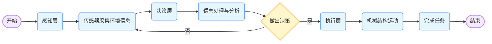

# 机器人技术在各行业应用带来的投资机会

> 关键词：机器人技术、行业应用、投资机会、人工智能、自动化、智能制造、服务机器人

> 摘要：本文深入探讨了机器人技术在各行业的应用现状与发展趋势，详细分析了其为投资者带来的丰富投资机会。通过对机器人技术核心概念、算法原理、数学模型等多方面的介绍，结合项目实战案例和实际应用场景的阐述，为投资者全面展示了机器人技术领域的投资潜力。同时，提供了相关的工具和资源推荐，对未来发展趋势与挑战进行了总结，旨在帮助投资者更好地把握机器人技术带来的投资机遇。

## 1. 背景介绍 
### 1.1 目的和范围
本文章的目的在于全面分析机器人技术在各行业的应用情况，挖掘其中蕴含的投资机会，为投资者提供有价值的参考和决策依据。范围涵盖机器人技术的多个方面，包括核心概念、算法原理、实际应用场景等，涉及的行业包括制造业、物流、医疗、服务等多个领域。

### 1.2 预期读者
本文预期读者主要包括投资者，无论是专业的风险投资机构、私募股权投资机构，还是个人投资者，都可以从本文中获取关于机器人技术投资机会的相关信息。同时，也适合对机器人技术感兴趣的行业从业者、研究人员等阅读，以便了解机器人技术的发展动态和应用前景。

### 1.3 文档结构概述
本文首先介绍机器人技术的背景信息，包括目的、预期读者和文档结构等。接着阐述机器人技术的核心概念与联系，通过文本示意图和 Mermaid 流程图进行直观展示。然后详细讲解核心算法原理和具体操作步骤，并用 Python 源代码进行说明。之后介绍数学模型和公式，并举例说明。通过项目实战案例，对代码进行详细实现和解读。再探讨机器人技术的实际应用场景。推荐相关的工具和资源。最后总结未来发展趋势与挑战，提供常见问题与解答和扩展阅读参考资料。

### 1.4 术语表
#### 1.4.1 核心术语定义
- **机器人技术**：是一门综合了机械工程、电子工程、计算机科学、控制理论等多学科知识的交叉学科，旨在设计、制造和应用能够自主或半自主完成特定任务的机器人系统。
- **工业机器人**：主要用于工业生产领域，能够代替人类完成重复性、危险性高、精度要求高的工作，如焊接、装配、搬运等。
- **服务机器人**：为人类提供各种服务的机器人，包括家用服务机器人（如扫地机器人）、医疗服务机器人、物流服务机器人等。
- **人工智能**：使计算机系统能够模拟人类智能的技术，包括机器学习、深度学习、自然语言处理等，在机器人技术中用于实现机器人的自主决策和智能行为。

#### 1.4.2 相关概念解释
- **自动化**：利用机器人和自动化设备，实现生产过程或业务流程的自动运行，减少人工干预，提高生产效率和质量。
- **智能制造**：将人工智能、物联网、大数据等技术与制造业相结合，实现生产过程的智能化、柔性化和高效化。

#### 1.4.3 缩略词列表
- **AI**：Artificial Intelligence，人工智能
- **IoT**：Internet of Things，物联网
- **PLC**：Programmable Logic Controller，可编程逻辑控制器

## 2. 核心概念与联系 

机器人技术涉及多个核心概念，这些概念相互关联，共同构成了机器人系统的基础。

### 核心概念原理
- **机械结构**：机器人的物理基础，包括机身、关节、驱动装置等，决定了机器人的运动能力和工作空间。不同类型的机器人具有不同的机械结构，如串联机器人、并联机器人等。
- **传感器**：用于感知机器人周围的环境信息，如位置、速度、力、视觉等。常见的传感器包括激光雷达、摄像头、力传感器等。传感器将环境信息转换为电信号，传输给机器人的控制系统。
- **控制系统**：机器人的“大脑”，负责处理传感器采集的信息，根据预设的任务和算法，控制机器人的运动和行为。控制系统可以是基于单片机、工控机或专用的机器人控制器。
- **人工智能算法**：使机器人能够实现自主决策和智能行为的关键。例如，机器学习算法可以让机器人通过学习大量的数据，不断优化自己的行为；计算机视觉算法可以让机器人识别物体和场景。

### 架构的文本示意图
机器人系统的架构可以分为三层：感知层、决策层和执行层。

- **感知层**：由各种传感器组成，负责采集机器人周围的环境信息。
- **决策层**：包括人工智能算法和控制系统，对感知层采集的信息进行处理和分析，做出决策。
- **执行层**：由机器人的机械结构和驱动装置组成，根据决策层的指令，实现机器人的运动和操作。

### Mermaid 流程图


## 3. 核心算法原理 & 具体操作步骤 

### 核心算法原理
在机器人技术中，常用的核心算法包括运动规划算法、机器学习算法和计算机视觉算法等。

#### 运动规划算法
运动规划算法的目的是为机器人找到一条从起始点到目标点的安全、高效的路径。常见的运动规划算法有 A* 算法、Dijkstra 算法等。

**A* 算法原理**：A* 算法是一种启发式搜索算法，它结合了 Dijkstra 算法的最优性和贪心最佳优先搜索算法的高效性。A* 算法通过评估每个节点的代价函数 $f(n)=g(n)+h(n)$ 来选择下一个要扩展的节点，其中 $g(n)$ 是从起始节点到节点 $n$ 的实际代价，$h(n)$ 是从节点 $n$ 到目标节点的估计代价。

#### 机器学习算法
机器学习算法可以让机器人通过学习数据来不断优化自己的行为。常见的机器学习算法包括监督学习、无监督学习和强化学习等。

**强化学习原理**：强化学习是一种通过智能体与环境进行交互，不断尝试和学习，以最大化累积奖励的学习方法。智能体在环境中执行动作，根据环境的反馈（奖励或惩罚）来调整自己的策略。

#### 计算机视觉算法
计算机视觉算法可以让机器人识别物体和场景。常见的计算机视觉算法包括目标检测算法、图像分类算法等。

**目标检测算法原理**：目标检测算法的目的是在图像或视频中检测出特定目标的位置和类别。常用的目标检测算法有 YOLO（You Only Look Once）、Faster R-CNN 等。

### 具体操作步骤及 Python 源代码

#### A* 算法实现
```python
import heapq

class Node:
    def __init__(self, x, y, g=float('inf'), h=float('inf'), parent=None):
        self.x = x
        self.y = y
        self.g = g
        self.h = h
        self.f = g + h
        self.parent = parent

    def __lt__(self, other):
        return self.f < other.f

def heuristic(a, b):
    return abs(a[0] - b[0]) + abs(a[1] - b[1])

def a_star(grid, start, goal):
    rows, cols = len(grid), len(grid[0])
    open_list = []
    closed_set = set()

    start_node = Node(start[0], start[1], g=0, h=heuristic(start, goal))
    heapq.heappush(open_list, start_node)

    while open_list:
        current = heapq.heappop(open_list)

        if (current.x, current.y) == goal:
            path = []
            while current:
                path.append((current.x, current.y))
                current = current.parent
            return path[::-1]

        closed_set.add((current.x, current.y))

        neighbors = [(current.x + dx, current.y + dy) for dx, dy in [(0, 1), (0, -1), (1, 0), (-1, 0)]
                     if 0 <= current.x + dx < rows and 0 <= current.y + dy < cols and grid[current.x + dx][current.y + dy] == 0]

        for neighbor in neighbors:
            if neighbor in closed_set:
                continue

            tentative_g = current.g + 1
            neighbor_node = Node(neighbor[0], neighbor[1])

            if tentative_g < neighbor_node.g:
                neighbor_node.parent = current
                neighbor_node.g = tentative_g
                neighbor_node.h = heuristic(neighbor, goal)
                neighbor_node.f = neighbor_node.g + neighbor_node.h
                heapq.heappush(open_list, neighbor_node)

    return None

# 示例使用
grid = [
    [0, 0, 0, 0],
    [0, 1, 0, 0],
    [0, 0, 0, 0],
    [0, 0, 0, 0]
]
start = (0, 0)
goal = (3, 3)
path = a_star(grid, start, goal)
print(path)
```

#### 强化学习示例（简单的 Q 学习）
```python
import numpy as np

# 定义环境
num_states = 5
num_actions = 2
reward_matrix = np.array([
    [-1, -1, -1, -1, 0],
    [-1, -1, -1, 0, -1],
    [-1, -1, -1, 0, -1],
    [-1, 0, 0, -1, -1],
    [0, -1, -1, -1, -1]
])

# 初始化 Q 表
Q = np.zeros((num_states, num_actions))

# 超参数
learning_rate = 0.1
discount_factor = 0.9
num_episodes = 100

for episode in range(num_episodes):
    state = np.random.randint(0, num_states)
    done = False

    while not done:
        action = np.argmax(Q[state, :])
        next_state = np.random.choice(np.where(reward_matrix[state, :] != -1)[0])
        reward = reward_matrix[state, next_state]

        Q[state, action] = (1 - learning_rate) * Q[state, action] + learning_rate * (reward + discount_factor * np.max(Q[next_state, :]))

        state = next_state

        if state == 4:
            done = True

print(Q)
```

## 4. 数学模型和公式 & 详细讲解 & 举例说明 

### 运动规划算法的数学模型
#### A* 算法公式
A* 算法的核心公式是代价函数 $f(n)=g(n)+h(n)$，其中：
- $g(n)$：从起始节点到节点 $n$ 的实际代价，通常是节点之间的距离。
- $h(n)$：从节点 $n$ 到目标节点的估计代价，也称为启发式函数。常用的启发式函数有曼哈顿距离、欧几里得距离等。

**举例说明**：在一个二维网格地图中，假设起始节点为 $(0, 0)$，目标节点为 $(3, 3)$，当前节点为 $(1, 1)$。如果使用曼哈顿距离作为启发式函数，则 $h((1, 1))=|3 - 1|+|3 - 1| = 4$。如果从起始节点到当前节点的实际代价 $g((1, 1)) = 2$，则 $f((1, 1))=2 + 4 = 6$。

### 强化学习的数学模型
#### Q 学习公式
Q 学习的核心公式是 Q 值更新公式：
$$Q(s, a) \leftarrow (1 - \alpha)Q(s, a) + \alpha(r + \gamma \max_{a'}Q(s', a'))$$
其中：
- $Q(s, a)$：在状态 $s$ 下采取动作 $a$ 的 Q 值。
- $\alpha$：学习率，控制新信息对旧 Q 值的更新程度。
- $r$：执行动作 $a$ 后获得的奖励。
- $\gamma$：折扣因子，用于权衡当前奖励和未来奖励的重要性。
- $s'$：执行动作 $a$ 后转移到的下一个状态。

**举例说明**：假设当前状态 $s = 1$，动作 $a = 0$，$Q(1, 0)=0.2$，学习率 $\alpha = 0.1$，奖励 $r = 1$，折扣因子 $\gamma = 0.9$，下一个状态 $s' = 2$，$\max_{a'}Q(2, a') = 0.3$。则更新后的 $Q(1, 0)$ 为：
$$Q(1, 0)=(1 - 0.1)\times0.2+0.1\times(1 + 0.9\times0.3)=0.2\times0.9+0.1\times(1 + 0.27)=0.18+0.127 = 0.307$$

## 5. 项目实战：代码实际案例和详细解释说明 

### 5.1  开发环境搭建
#### 硬件环境
- **计算机**：建议使用配置较高的计算机，如 Intel Core i7 及以上处理器，16GB 及以上内存。
- **机器人平台**：可以选择开源的机器人开发平台，如 TurtleBot 系列，也可以根据自己的需求定制机器人。

#### 软件环境
- **操作系统**：推荐使用 Ubuntu 系统，因为它对机器人开发有较好的支持。
- **编程语言**：Python，因为 Python 具有丰富的库和工具，适合机器人开发。
- **开发框架**：ROS（Robot Operating System），ROS 是一个开源的机器人操作系统，提供了丰富的工具和库，方便机器人的开发和调试。

### 5.2  源代码详细实现和代码解读
#### 基于 ROS 的简单机器人导航项目
**项目需求**：实现一个简单的机器人在二维地图中从起始点导航到目标点的功能。

**代码实现**：

```python
#!/usr/bin/env python
import rospy
from move_base_msgs.msg import MoveBaseAction, MoveBaseGoal
import actionlib

def movebase_client():
    client = actionlib.SimpleActionClient('move_base', MoveBaseAction)
    client.wait_for_server()

    goal = MoveBaseGoal()
    goal.target_pose.header.frame_id = "map"
    goal.target_pose.header.stamp = rospy.Time.now()

    # 设置目标点的坐标
    goal.target_pose.pose.position.x = 1.0
    goal.target_pose.pose.position.y = 2.0
    goal.target_pose.pose.orientation.w = 1.0

    client.send_goal(goal)
    wait = client.wait_for_result()

    if not wait:
        rospy.logerr("Action server not available!")
        rospy.signal_shutdown("Action server not available!")
    else:
        return client.get_result()

if __name__ == '__main__':
    try:
        rospy.init_node('movebase_client_py')
        result = movebase_client()
        if result:
            rospy.loginfo("Goal execution done!")
    except rospy.ROSInterruptException:
        rospy.loginfo("Navigation test finished.")
```

**代码解读**：
- **导入必要的库**：导入 ROS 相关的库和动作库。
- **创建动作客户端**：使用 `actionlib.SimpleActionClient` 创建一个动作客户端，连接到 `move_base` 动作服务器。
- **设置目标点**：创建一个 `MoveBaseGoal` 对象，设置目标点的坐标和方向。
- **发送目标点**：使用 `client.send_goal` 方法发送目标点。
- **等待结果**：使用 `client.wait_for_result` 方法等待机器人到达目标点。

### 5.3  代码解读与分析
#### 代码功能分析
这段代码实现了一个简单的机器人导航功能，通过 ROS 的动作机制，向 `move_base` 动作服务器发送目标点，然后等待机器人到达目标点。

#### 代码优化建议
- **目标点的动态设置**：可以通过用户输入或其他方式动态设置目标点，而不是硬编码在代码中。
- **错误处理**：可以增加更多的错误处理机制，如网络异常、机器人故障等。

## 6. 实际应用场景 

### 制造业
- **焊接**：工业机器人可以实现高精度的焊接作业，提高焊接质量和效率，减少人工焊接的劳动强度和安全风险。
- **装配**：机器人可以快速、准确地完成零部件的装配任务，提高产品的装配精度和一致性。
- **搬运**：自动化搬运机器人可以在工厂内自动搬运物料和产品，实现物流的自动化。

### 物流行业
- **仓储管理**：AGV（Automated Guided Vehicle）自动导引车可以在仓库内自动搬运货物，实现货物的快速存储和检索。
- **分拣**：分拣机器人可以根据货物的信息，快速、准确地将货物分拣到指定的位置，提高分拣效率。

### 医疗行业
- **手术辅助**：手术机器人可以帮助医生进行高精度的手术操作，减少手术创伤和风险。
- **康复护理**：康复机器人可以辅助患者进行康复训练，提高康复效果。

### 服务行业
- **餐饮服务**：送餐机器人可以在餐厅内自动送餐，提高服务效率和顾客体验。
- **清洁服务**：扫地机器人、擦窗机器人等家用服务机器人可以帮助人们完成日常的清洁工作。

## 7. 工具和资源推荐
### 7.1 学习资源推荐
#### 7.1.1 书籍推荐
- 《机器人学导论》：全面介绍机器人学的基本概念、理论和方法，是机器人领域的经典教材。
- 《机器学习》：周志华著，系统地介绍了机器学习的基本算法和理论。
- 《计算机视觉：算法与应用》：详细介绍计算机视觉的各种算法和应用。

#### 7.1.2 在线课程
- Coursera 上的“机器人学基础”课程：由知名高校的教授授课，内容丰富，讲解详细。
- edX 上的“人工智能基础”课程：介绍人工智能的基本概念和算法，对机器人技术的学习有很大帮助。

#### 7.1.3 技术博客和网站
- 机器人在线：提供机器人技术的最新资讯、产品信息和技术文章。
- 机器之心：专注于人工智能和机器人领域的技术报道和分析。

### 7.2 开发工具框架推荐
#### 7.2.1 IDE和编辑器
- PyCharm：功能强大的 Python 集成开发环境，适合机器人开发中 Python 代码的编写和调试。
- Visual Studio Code：轻量级的代码编辑器，支持多种编程语言和插件，方便机器人项目的开发。

#### 7.2.2 调试和性能分析工具
- RViz：ROS 中的可视化工具，可以直观地显示机器人的模型、传感器数据和运动轨迹。
- Gazebo：开源的机器人仿真环境，可以对机器人的行为和性能进行仿真和测试。

#### 7.2.3 相关框架和库
- ROS（Robot Operating System）：开源的机器人操作系统，提供了丰富的工具和库，方便机器人的开发和调试。
- OpenCV：计算机视觉领域的开源库，提供了各种计算机视觉算法和工具。
- TensorFlow：开源的机器学习框架，可用于机器人的人工智能算法开发。

### 7.3 相关论文著作推荐
#### 7.3.1 经典论文
- “A* Search Algorithm”：介绍 A* 算法的经典论文，对理解运动规划算法有重要意义。
- “Q-Learning”：介绍 Q 学习算法的经典论文，是强化学习领域的重要文献。

#### 7.3.2 最新研究成果
- 关注顶级学术会议如 ICRA（International Conference on Robotics and Automation）、IROS（Intelligent Robots and Systems）上的最新研究成果，了解机器人技术的前沿动态。

#### 7.3.3 应用案例分析
- 分析一些知名企业的机器人应用案例，如亚马逊的仓储机器人、波士顿动力的机器人等，学习他们的成功经验和技术实现方法。

## 8. 总结：未来发展趋势与挑战

### 未来发展趋势
- **智能化**：机器人将越来越智能化，具备更强的自主决策和学习能力，能够更好地适应复杂的环境和任务。
- **协作化**：人机协作将成为未来机器人发展的重要方向，机器人将与人类更加紧密地合作，共同完成任务。
- **微型化和纳米化**：随着微纳技术的发展，机器人将朝着微型化和纳米化的方向发展，在医疗、生物等领域有更广泛的应用。
- **云机器人**：通过云计算和网络技术，机器人可以共享数据和计算资源，提高机器人的智能水平和工作效率。

### 挑战
- **技术瓶颈**：目前机器人技术在某些方面还存在瓶颈，如人工智能算法的可解释性、机器人的感知和认知能力等，需要进一步的研究和突破。
- **安全和伦理问题**：机器人的广泛应用带来了安全和伦理问题，如机器人的自主决策可能导致的安全事故、机器人对人类就业的影响等，需要建立相应的法律法规和伦理准则。
- **成本问题**：机器人的研发和制造成本较高，限制了机器人的大规模应用，需要降低成本，提高机器人的性价比。

## 9. 附录：常见问题与解答
### 问题 1：机器人技术的学习难度大吗？
答：机器人技术是一门跨学科的领域，涉及多个学科的知识，学习难度相对较大。但是，只要有一定的基础和学习方法，逐步深入学习，是可以掌握的。可以从基础的机器人知识学起，如机械结构、传感器等，然后再学习人工智能算法和控制理论等。

### 问题 2：机器人在各行业的应用前景如何？
答：机器人在各行业的应用前景非常广阔。在制造业，机器人可以提高生产效率和质量，降低成本；在物流行业，机器人可以实现物流的自动化和智能化；在医疗行业，机器人可以辅助医生进行手术和康复护理；在服务行业，机器人可以提供各种服务，提高服务质量和效率。随着技术的不断发展，机器人的应用领域还将不断扩大。

### 问题 3：投资机器人技术需要注意哪些问题？
答：投资机器人技术需要注意以下几个问题：
- **技术实力**：关注企业的技术研发能力和创新能力，选择具有核心技术和竞争力的企业。
- **市场需求**：了解市场对机器人产品的需求情况，选择有市场前景的产品和应用领域。
- **团队管理**：考察企业的管理团队和技术团队，选择有经验、有实力的团队。
- **风险评估**：对投资的风险进行评估，制定合理的投资策略。

## 10. 扩展阅读 & 参考资料
- 《机器人技术手册》
- 《人工智能：一种现代的方法》
- ROS 官方文档（http://wiki.ros.org/）
- OpenCV 官方文档（https://docs.opencv.org/）
- TensorFlow 官方文档（https://www.tensorflow.org/）
- 相关学术期刊如《机器人》《IEEE Transactions on Robotics》等。