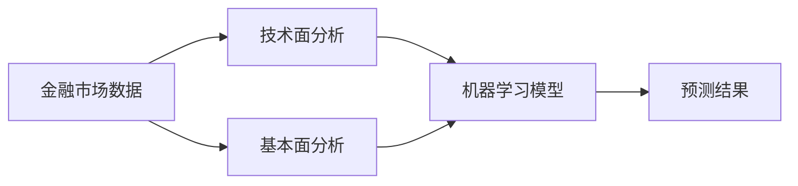

# 机器学习增强技术面与基本面分析

> 关键词：机器学习、技术面分析、基本面分析、金融市场、数据分析、预测模型、量化投资

> 摘要：本文深入探讨了利用机器学习技术增强技术面与基本面分析的相关内容。首先介绍了技术面和基本面分析在金融领域的重要性及传统方法的局限性，引出机器学习在这方面的应用潜力。接着详细阐述了核心概念，包括技术面和基本面分析的原理以及机器学习与它们的联系。通过具体的算法原理、数学模型和公式讲解，展示了如何运用机器学习进行更精准的分析。在项目实战部分，给出了实际案例及代码解读。然后探讨了该技术在不同金融场景中的应用，推荐了相关的学习资源、开发工具和论文著作。最后总结了未来发展趋势与挑战，并对常见问题进行了解答，为读者全面了解和应用机器学习增强技术面与基本面分析提供了有价值的参考。

## 1. 背景介绍 
### 1.1 目的和范围
在金融市场中，技术面分析和基本面分析是投资者常用的两种分析方法。技术面分析主要通过研究市场交易数据，如价格、成交量等，来预测资产价格的未来走势；基本面分析则侧重于评估资产的内在价值，考虑宏观经济因素、公司财务状况等。然而，传统的分析方法在处理海量复杂数据和捕捉数据中的潜在模式方面存在一定的局限性。本文章的目的在于探讨如何利用机器学习技术来增强技术面与基本面分析，提高分析的准确性和效率，为投资者提供更可靠的决策依据。范围涵盖了机器学习在金融市场技术面和基本面分析中的应用原理、算法实现、实际案例以及未来发展趋势等方面。

### 1.2 预期读者
本文预期读者包括金融从业者，如股票分析师、基金经理、量化投资人员等，他们希望借助机器学习技术提升自身的分析能力和投资决策水平；计算机科学和数据分析领域的专业人士，对将机器学习应用于金融领域感兴趣；以及对金融市场和机器学习有一定了解的学生和研究人员，希望深入学习相关知识和技术。

### 1.3 文档结构概述
本文首先介绍背景信息，包括目的、预期读者和文档结构概述等内容。接着阐述核心概念，包括技术面分析、基本面分析以及机器学习与它们的联系，并给出相应的示意图和流程图。然后详细讲解核心算法原理和具体操作步骤，结合Python源代码进行说明。之后介绍数学模型和公式，并通过举例进行详细讲解。在项目实战部分，提供代码实际案例和详细解释说明。再探讨实际应用场景，推荐相关的工具和资源。最后总结未来发展趋势与挑战，解答常见问题，并列出扩展阅读和参考资料。

### 1.4 术语表
#### 1.4.1 核心术语定义
- **技术面分析**：通过对市场交易数据，如价格、成交量、持仓量等的统计和分析，来预测资产价格未来走势的方法。
- **基本面分析**：基于对宏观经济因素、行业发展趋势、公司财务状况等基本面信息的研究，评估资产内在价值的分析方法。
- **机器学习**：一门多领域交叉学科，涉及概率论、统计学、逼近论、凸分析、算法复杂度理论等多门学科。它专门研究计算机怎样模拟或实现人类的学习行为，以获取新的知识或技能，重新组织已有的知识结构使之不断改善自身的性能。
- **量化投资**：将投资理念及策略通过具体指标、参数的设计，体现到具体的模型中，让模型对市场进行不带任何情绪的跟踪。

#### 1.4.2 相关概念解释
- **特征工程**：指从原始数据中提取特征，并将其转换为适合机器学习算法处理的格式的过程。在技术面和基本面分析中，特征工程包括选择合适的技术指标、财务比率等作为输入特征。
- **过拟合**：指模型在训练数据上表现良好，但在测试数据或新数据上表现不佳的现象。过拟合通常是由于模型过于复杂，学习了训练数据中的噪声和异常值。
- **欠拟合**：指模型在训练数据和测试数据上的表现都不佳的现象。欠拟合通常是由于模型过于简单，无法捕捉数据中的复杂模式。

#### 1.4.3 缩略词列表
- **ML**：Machine Learning，机器学习
- **AI**：Artificial Intelligence，人工智能
- **PCA**：Principal Component Analysis，主成分分析
- **LSTM**：Long Short-Term Memory，长短期记忆网络

## 2. 核心概念与联系 
### 技术面分析原理
技术面分析基于以下几个基本假设：市场行为包容消化一切信息；价格以趋势方式演变；历史会重演。技术面分析主要通过研究价格和成交量等市场交易数据，运用各种技术指标和图表形态来预测资产价格的未来走势。常见的技术指标包括移动平均线、相对强弱指标（RSI）、布林带等。

### 基本面分析原理
基本面分析的核心思想是资产的价格应该与其内在价值相符。基本面分析主要考虑宏观经济因素、行业发展趋势、公司财务状况等基本面信息。宏观经济因素包括国内生产总值（GDP）、通货膨胀率、利率等；行业发展趋势包括行业增长率、竞争格局等；公司财务状况包括营业收入、净利润、资产负债表等。通过对这些基本面信息的分析，可以评估资产的内在价值，并判断其价格是否被高估或低估。

### 机器学习与技术面、基本面分析的联系
机器学习可以为技术面和基本面分析提供更强大的数据分析和预测能力。在技术面分析中，机器学习可以处理大量的市场交易数据，发现传统技术指标无法捕捉的潜在模式和规律。例如，通过深度学习算法，可以对价格走势进行更精准的预测。在基本面分析中，机器学习可以处理复杂的基本面信息，如文本数据（新闻报道、公司公告等），挖掘其中的情感倾向和潜在价值。此外，机器学习还可以将技术面和基本面信息结合起来，构建更全面、准确的预测模型。

### 文本示意图
```plaintext
                +----------------+
                | 金融市场数据   |
                +----------------+
                      |
       +-------------+-------------+
       |                           |
+--------------+            +--------------+
| 技术面分析   |            | 基本面分析   |
+--------------+            +--------------+
       |                           |
       +-------------+-------------+
                     |
              +--------------+
              | 机器学习模型 |
              +--------------+
                     |
              +--------------+
              | 预测结果     |
              +--------------+
```

### Mermaid 流程图


## 3. 核心算法原理 & 具体操作步骤 
### 线性回归算法原理
线性回归是一种基本的机器学习算法，用于建立自变量和因变量之间的线性关系。在技术面和基本面分析中，线性回归可以用于预测资产价格的变化。线性回归的基本模型可以表示为：

$$y = \theta_0 + \theta_1x_1 + \theta_2x_2 + \cdots + \theta_nx_n + \epsilon$$

其中，$y$ 是因变量（如资产价格），$x_1, x_2, \cdots, x_n$ 是自变量（如技术指标、基本面指标等），$\theta_0, \theta_1, \cdots, \theta_n$ 是模型的参数，$\epsilon$ 是误差项。

线性回归的目标是找到一组最优的参数 $\theta$，使得预测值与实际值之间的误差最小。通常使用最小二乘法来求解最优参数。最小二乘法的目标函数可以表示为：

$$J(\theta) = \frac{1}{2m}\sum_{i = 1}^{m}(h_{\theta}(x^{(i)}) - y^{(i)})^2$$

其中，$m$ 是样本数量，$h_{\theta}(x^{(i)})$ 是第 $i$ 个样本的预测值，$y^{(i)}$ 是第 $i$ 个样本的实际值。

### Python 代码实现线性回归
```python
import numpy as np
from sklearn.linear_model import LinearRegression
from sklearn.model_selection import train_test_split
from sklearn.metrics import mean_squared_error

# 生成示例数据
np.random.seed(0)
X = np.random.rand(100, 2)
y = 2 * X[:, 0] + 3 * X[:, 1] + np.random.randn(100)

# 划分训练集和测试集
X_train, X_test, y_train, y_test = train_test_split(X, y, test_size=0.2, random_state=42)

# 创建线性回归模型
model = LinearRegression()

# 训练模型
model.fit(X_train, y_train)

# 预测
y_pred = model.predict(X_test)

# 计算均方误差
mse = mean_squared_error(y_test, y_pred)
print(f"均方误差: {mse}")
```

### 具体操作步骤
1. **数据收集**：收集金融市场的技术面和基本面数据，包括价格、成交量、财务报表等。
2. **数据预处理**：对收集到的数据进行清洗、缺失值处理、标准化等操作，以提高数据质量。
3. **特征工程**：从预处理后的数据中提取有用的特征，如技术指标、财务比率等。
4. **模型选择**：根据问题的特点和数据的性质，选择合适的机器学习模型，如线性回归、决策树、神经网络等。
5. **模型训练**：使用训练数据对模型进行训练，调整模型的参数，使其能够更好地拟合数据。
6. **模型评估**：使用测试数据对训练好的模型进行评估，计算模型的性能指标，如均方误差、准确率等。
7. **模型优化**：根据模型评估的结果，对模型进行优化，如调整模型的参数、增加特征等。
8. **预测与应用**：使用优化后的模型对新数据进行预测，并将预测结果应用于投资决策等实际场景中。

## 4. 数学模型和公式 & 详细讲解 & 举例说明 
### 逻辑回归模型
逻辑回归是一种常用的分类算法，用于解决二分类问题。在金融领域，逻辑回归可以用于预测股票的涨跌等问题。逻辑回归的基本模型可以表示为：

$$P(y = 1|x) = \frac{1}{1 + e^{-z}}$$

其中，$P(y = 1|x)$ 是给定特征 $x$ 时，样本属于正类的概率，$z = \theta_0 + \theta_1x_1 + \theta_2x_2 + \cdots + \theta_nx_n$ 是线性组合。

逻辑回归的目标是找到一组最优的参数 $\theta$，使得模型的似然函数最大。似然函数可以表示为：

$$L(\theta) = \prod_{i = 1}^{m}P(y^{(i)}|x^{(i)}; \theta)$$

为了方便计算，通常使用对数似然函数：

$$\ell(\theta) = \log L(\theta) = \sum_{i = 1}^{m}y^{(i)}\log P(y^{(i)}|x^{(i)}; \theta) + (1 - y^{(i)})\log(1 - P(y^{(i)}|x^{(i)}; \theta))$$

通过最大化对数似然函数，可以得到最优的参数 $\theta$。

### 举例说明
假设我们要预测股票的涨跌，我们可以将股票的收盘价、成交量等作为特征，将股票的涨跌情况作为标签（涨为 1，跌为 0）。我们可以使用逻辑回归模型来训练数据，得到一个预测模型。然后，我们可以使用这个模型来预测未来股票的涨跌情况。

```python
from sklearn.linear_model import LogisticRegression
from sklearn.datasets import make_classification
from sklearn.model_selection import train_test_split
from sklearn.metrics import accuracy_score

# 生成示例数据
X, y = make_classification(n_samples=1000, n_features=10, n_informative=5, n_redundant=0, random_state=42)

# 划分训练集和测试集
X_train, X_test, y_train, y_test = train_test_split(X, y, test_size=0.2, random_state=42)

# 创建逻辑回归模型
model = LogisticRegression()

# 训练模型
model.fit(X_train, y_train)

# 预测
y_pred = model.predict(X_test)

# 计算准确率
accuracy = accuracy_score(y_test, y_pred)
print(f"准确率: {accuracy}")
```

### 支持向量机模型
支持向量机（SVM）是一种强大的分类和回归算法。在 SVM 中，目标是找到一个最优的超平面，使得不同类别的样本之间的间隔最大。对于线性可分的情况，SVM 的目标函数可以表示为：

$$\min_{\theta, b}\frac{1}{2}\|\theta\|^2$$

约束条件为：

$$y^{(i)}(\theta^Tx^{(i)} + b) \geq 1, i = 1, 2, \cdots, m$$

对于线性不可分的情况，可以引入松弛变量 $\xi_i$，目标函数变为：

$$\min_{\theta, b, \xi}\frac{1}{2}\|\theta\|^2 + C\sum_{i = 1}^{m}\xi_i$$

约束条件为：

$$y^{(i)}(\theta^Tx^{(i)} + b) \geq 1 - \xi_i, \xi_i \geq 0, i = 1, 2, \cdots, m$$

其中，$C$ 是惩罚参数，用于控制模型的复杂度和泛化能力。

### 举例说明
假设我们要对股票的风险等级进行分类，我们可以将股票的波动率、市盈率等作为特征，将股票的风险等级作为标签。我们可以使用支持向量机模型来训练数据，得到一个分类模型。然后，我们可以使用这个模型来预测未来股票的风险等级。

```python
from sklearn.svm import SVC
from sklearn.datasets import make_classification
from sklearn.model_selection import train_test_split
from sklearn.metrics import accuracy_score

# 生成示例数据
X, y = make_classification(n_samples=1000, n_features=10, n_informative=5, n_redundant=0, random_state=42)

# 划分训练集和测试集
X_train, X_test, y_train, y_test = train_test_split(X, y, test_size=0.2, random_state=42)

# 创建支持向量机模型
model = SVC()

# 训练模型
model.fit(X_train, y_train)

# 预测
y_pred = model.predict(X_test)

# 计算准确率
accuracy = accuracy_score(y_test, y_pred)
print(f"准确率: {accuracy}")
```

## 5. 项目实战：代码实际案例和详细解释说明 
### 5.1  开发环境搭建
1. **安装 Python**：建议使用 Python 3.7 及以上版本。可以从 Python 官方网站（https://www.python.org/downloads/）下载并安装。
2. **安装必要的库**：使用 pip 命令安装必要的库，如 pandas、numpy、scikit-learn、matplotlib 等。

```bash
pip install pandas numpy scikit-learn matplotlib
```

3. **安装开发工具**：可以使用 Jupyter Notebook 或 PyCharm 等开发工具进行代码编写和调试。

### 5.2  源代码详细实现和代码解读
我们以股票价格预测为例，使用线性回归模型进行预测。

```python
import pandas as pd
import numpy as np
from sklearn.linear_model import LinearRegression
from sklearn.model_selection import train_test_split
from sklearn.metrics import mean_squared_error
import matplotlib.pyplot as plt

# 读取股票数据
data = pd.read_csv('stock_data.csv')

# 提取特征和标签
X = data[['Open', 'High', 'Low', 'Volume']].values
y = data['Close'].values

# 划分训练集和测试集
X_train, X_test, y_train, y_test = train_test_split(X, y, test_size=0.2, random_state=42)

# 创建线性回归模型
model = LinearRegression()

# 训练模型
model.fit(X_train, y_train)

# 预测
y_pred = model.predict(X_test)

# 计算均方误差
mse = mean_squared_error(y_test, y_pred)
print(f"均方误差: {mse}")

# 可视化预测结果
plt.figure(figsize=(10, 6))
plt.plot(y_test, label='实际价格')
plt.plot(y_pred, label='预测价格')
plt.xlabel('样本序号')
plt.ylabel('股票价格')
plt.title('股票价格预测结果')
plt.legend()
plt.show()
```

### 代码解读与分析
1. **数据读取**：使用 pandas 库的 `read_csv` 函数读取股票数据文件。
2. **特征提取**：从数据中提取 `Open`、`High`、`Low`、`Volume` 作为特征，`Close` 作为标签。
3. **数据划分**：使用 `train_test_split` 函数将数据划分为训练集和测试集，测试集占比为 20%。
4. **模型创建**：创建线性回归模型。
5. **模型训练**：使用训练数据对模型进行训练。
6. **预测**：使用训练好的模型对测试数据进行预测。
7. **评估**：计算预测结果的均方误差，评估模型的性能。
8. **可视化**：使用 matplotlib 库将实际价格和预测价格进行可视化，直观展示预测结果。

## 6. 实际应用场景 
### 股票投资决策
在股票投资中，投资者可以使用机器学习增强的技术面和基本面分析来预测股票价格的走势，从而做出更明智的投资决策。例如，通过分析股票的技术指标和公司的财务状况，使用机器学习模型预测股票的涨跌概率，投资者可以根据预测结果选择买入或卖出股票。

### 风险管理
金融机构可以使用机器学习增强的技术面和基本面分析来评估投资组合的风险。通过分析市场数据和资产的基本面信息，使用机器学习模型预测资产价格的波动情况，金融机构可以调整投资组合的结构，降低风险。

### 量化投资策略开发
量化投资人员可以使用机器学习增强的技术面和基本面分析来开发量化投资策略。通过对大量的市场数据和基本面信息进行分析，使用机器学习模型挖掘潜在的投资机会，量化投资人员可以构建基于机器学习的量化投资策略，实现自动化交易。

### 宏观经济预测
政府和研究机构可以使用机器学习增强的技术面和基本面分析来预测宏观经济走势。通过分析宏观经济数据、行业数据和企业财务数据，使用机器学习模型预测 GDP、通货膨胀率、利率等宏观经济指标的变化，为政策制定和经济研究提供参考。

## 7. 工具和资源推荐
### 7.1 学习资源推荐
#### 7.1.1 书籍推荐
- 《机器学习》（周志华）：全面介绍了机器学习的基本概念、算法和应用，是机器学习领域的经典教材。
- 《Python 机器学习》（Sebastian Raschka）：结合 Python 语言，详细介绍了机器学习的算法实现和应用，适合初学者学习。
- 《金融机器学习入门》（Yves Hilpisch）：专门介绍了机器学习在金融领域的应用，包括技术面分析、基本面分析、量化投资等方面。

#### 7.1.2 在线课程
- Coursera 上的《机器学习》（Andrew Ng）：由斯坦福大学教授 Andrew Ng 授课，是机器学习领域的经典在线课程。
- edX 上的《数据科学与机器学习微硕士》：提供了系统的数据分析和机器学习课程，适合深入学习。
- 网易云课堂上的《Python 金融大数据分析》：结合 Python 语言，介绍了金融数据分析和机器学习的应用。

#### 7.1.3 技术博客和网站
- Medium：上面有很多关于机器学习和金融领域的技术博客和文章，可以了解最新的技术动态和应用案例。
- Towards Data Science：专注于数据科学和机器学习领域，提供了大量的优质文章和教程。
- 金融界、雪球网等金融类网站：可以获取金融市场的实时数据和相关资讯，为技术面和基本面分析提供数据支持。

### 7.2 开发工具框架推荐
#### 7.2.1 IDE和编辑器
- PyCharm：功能强大的 Python 集成开发环境，提供了代码编辑、调试、版本控制等功能，适合专业开发者使用。
- Jupyter Notebook：交互式的开发环境，适合数据探索和模型实验，方便代码的编写和展示。
- Visual Studio Code：轻量级的代码编辑器，支持多种编程语言和插件，具有良好的扩展性。

#### 7.2.2 调试和性能分析工具
- PDB：Python 内置的调试工具，可以帮助开发者调试代码，查找问题。
- TensorBoard：用于可视化深度学习模型的训练过程和性能指标，方便开发者优化模型。
- Scikit-learn 中的交叉验证和网格搜索功能：可以帮助开发者选择最优的模型参数，提高模型的性能。

#### 7.2.3 相关框架和库
- Scikit-learn：简单易用的机器学习库，提供了各种机器学习算法和工具，适合初学者和快速开发。
- TensorFlow：开源的深度学习框架，广泛应用于图像识别、自然语言处理等领域，也可以用于金融领域的数据分析和预测。
- PyTorch：另一个流行的深度学习框架，具有动态计算图的特点，适合研究和开发复杂的深度学习模型。

### 7.3 相关论文著作推荐
#### 7.3.1 经典论文
- Fama, E. F., & French, K. R. (1992). The cross-section of expected stock returns. The Journal of Finance, 47(2), 427-465.：提出了著名的 Fama-French 三因子模型，对股票收益率的横截面进行了深入研究。
- Sharpe, W. F. (1964). Capital asset prices: A theory of market equilibrium under conditions of risk. The Journal of Finance, 19(3), 425-442.：提出了资本资产定价模型（CAPM），为资产定价和风险管理提供了重要的理论基础。

#### 7.3.2 最新研究成果
- Gu, S., Kelly, B., & Xiu, D. (2020). Empirical asset pricing via machine learning. Review of Financial Studies, 33(5), 2223-2273.：探讨了机器学习在实证资产定价中的应用，提出了基于机器学习的资产定价模型。
- Chen, H., & Zhu, Y. (2021). Machine learning in finance: A review. Journal of Financial Econometrics, 19(3), 515-545.：对机器学习在金融领域的应用进行了全面的综述，包括技术面分析、基本面分析、风险管理等方面。

#### 7.3.3 应用案例分析
- 一些金融机构和研究机构发布的研究报告和案例分析，如高盛、摩根大通等公司的研究报告，介绍了他们在机器学习在金融领域的应用实践和经验。

## 8. 总结：未来发展趋势与挑战
### 未来发展趋势
1. **多模态数据融合**：未来的技术面和基本面分析将不仅仅局限于传统的数值数据，还将融合文本、图像、音频等多模态数据。例如，通过分析新闻报道、公司公告等文本数据，挖掘其中的情感倾向和潜在价值；通过分析卫星图像、传感器数据等，获取更多的市场信息。
2. **深度学习的广泛应用**：深度学习在处理复杂数据和挖掘潜在模式方面具有强大的能力，未来将在技术面和基本面分析中得到更广泛的应用。例如，使用卷积神经网络（CNN）对股票价格走势进行预测，使用循环神经网络（RNN）对时间序列数据进行分析。
3. **强化学习在量化投资中的应用**：强化学习可以根据环境的反馈不断优化投资策略，未来将在量化投资中得到更多的应用。例如，使用强化学习算法构建智能交易系统，实现自动化交易。
4. **跨领域融合**：机器学习与金融、数学、统计学、计算机科学等多个领域的融合将越来越深入。未来的研究和应用将需要跨领域的专业知识和技能，培养复合型人才将成为趋势。

### 挑战
1. **数据质量和隐私问题**：金融市场数据的质量和隐私问题是一个重要的挑战。数据中可能存在噪声、缺失值和异常值，需要进行有效的数据预处理。同时，金融数据涉及到个人隐私和商业机密，需要采取有效的措施保护数据的安全和隐私。
2. **模型解释性问题**：机器学习模型，尤其是深度学习模型，往往是黑盒模型，难以解释模型的决策过程和结果。在金融领域，模型的解释性非常重要，投资者和监管机构需要了解模型的决策依据。因此，如何提高模型的解释性是一个亟待解决的问题。
3. **市场变化和不确定性**：金融市场是复杂多变的，存在着大量的不确定性因素。机器学习模型的性能可能会受到市场变化的影响，需要不断地进行调整和优化。同时，如何应对市场的突发事件和异常情况，也是一个挑战。
4. **人才短缺问题**：机器学习在金融领域的应用需要既懂金融又懂机器学习的复合型人才。目前，这类人才相对短缺，需要加强相关领域的人才培养和教育。

## 9. 附录：常见问题与解答
### 1. 机器学习在技术面和基本面分析中的应用效果如何？
机器学习在技术面和基本面分析中的应用效果取决于多种因素，如数据质量、模型选择、特征工程等。在一些情况下，机器学习可以提高分析的准确性和效率，发现传统方法无法捕捉的潜在模式和规律。但在其他情况下，机器学习模型的性能可能不如传统方法。因此，需要根据具体情况选择合适的方法和模型，并进行不断的优化和调整。

### 2. 如何选择合适的机器学习模型？
选择合适的机器学习模型需要考虑问题的特点、数据的性质、模型的复杂度和可解释性等因素。对于简单的线性问题，可以选择线性回归、逻辑回归等模型；对于复杂的非线性问题，可以选择决策树、神经网络等模型。同时，需要根据数据的规模和特征数量选择合适的模型，避免过拟合和欠拟合。

### 3. 如何处理金融市场数据中的缺失值和异常值？
处理金融市场数据中的缺失值和异常值可以采用多种方法。对于缺失值，可以采用删除、插补等方法进行处理。插补方法包括均值插补、中位数插补、线性插值等。对于异常值，可以采用基于统计方法（如 Z-score 方法）或基于机器学习方法（如孤立森林算法）进行检测和处理。

### 4. 如何评估机器学习模型的性能？
评估机器学习模型的性能可以采用多种指标，如均方误差（MSE）、均方根误差（RMSE）、准确率、召回率、F1 值等。对于回归问题，常用的指标是均方误差和均方根误差；对于分类问题，常用的指标是准确率、召回率和 F1 值。同时，还可以采用交叉验证、混淆矩阵等方法对模型的性能进行评估和分析。

## 10. 扩展阅读 & 参考资料
1. 《金融数据分析与挖掘》（李扬）
2. 《Python 数据科学手册》（Jake VanderPlas）
3. 《深度学习》（Ian Goodfellow、Yoshua Bengio 和 Aaron Courville）
4. 金融界官网（https://www.jrj.com.cn/）
5. 雪球网（https://xueqiu.com/）
6. 雅虎财经（https://finance.yahoo.com/）
7. Fama, E. F., & French, K. R. (1992). The cross-section of expected stock returns. The Journal of Finance, 47(2), 427-465.
8. Sharpe, W. F. (1964). Capital asset prices: A theory of market equilibrium under conditions of risk. The Journal of Finance, 19(3), 425-442.
9. Gu, S., Kelly, B., & Xiu, D. (2020). Empirical asset pricing via machine learning. Review of Financial Studies, 33(5), 2223-2273.
10. Chen, H., & Zhu, Y. (2021). Machine learning in finance: A review. Journal of Financial Econometrics, 19(3), 515-545.