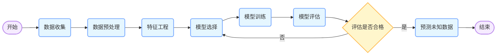

# 机器学习预测公司长期竞争力变化

> 关键词：机器学习、公司长期竞争力、预测模型、特征工程、数据挖掘

> 摘要：本文聚焦于利用机器学习技术预测公司长期竞争力变化这一核心主题。首先介绍了相关背景知识，包括目的、预期读者等内容。接着深入阐述了核心概念，通过文本示意图和 Mermaid 流程图展示其原理与架构。详细讲解了核心算法原理，并结合 Python 源代码进行说明。对涉及的数学模型和公式也进行了详细解读与举例。在项目实战部分，提供了开发环境搭建步骤、源代码实现与解读。探讨了实际应用场景，推荐了相关的学习资源、开发工具框架以及论文著作。最后总结了未来发展趋势与挑战，并对常见问题进行了解答，同时给出扩展阅读和参考资料，旨在为读者全面呈现利用机器学习预测公司长期竞争力变化的理论与实践方法。

## 1. 背景介绍 
### 1.1 目的和范围
在当今竞争激烈的商业环境中，准确预测公司的长期竞争力变化对于投资者、管理者和政策制定者都具有至关重要的意义。投资者可以根据预测结果做出更明智的投资决策，管理者可以提前发现公司面临的挑战并制定相应的战略，政策制定者可以更好地引导产业发展。本研究的目的在于利用机器学习技术构建一个有效的预测模型，通过对公司多方面的数据进行分析，预测公司长期竞争力的变化趋势。

本研究的范围涵盖了多个行业的公司，考虑的因素包括财务数据、市场数据、管理团队信息、技术创新能力等多个维度。通过收集和整理这些数据，利用机器学习算法挖掘其中的规律，以实现对公司长期竞争力变化的准确预测。

### 1.2 预期读者
本文的预期读者包括但不限于以下几类人群：
1. **投资者**：希望通过更科学的方法评估公司的长期价值，从而做出更明智的投资决策。
2. **企业管理者**：希望借助外部的分析工具，了解公司在市场中的竞争力变化趋势，以便及时调整公司战略。
3. **学术研究人员**：对机器学习在商业领域的应用感兴趣，希望通过本文了解相关的研究方法和技术。
4. **政策制定者**：希望通过对公司竞争力的分析，制定更合理的产业政策，促进产业的健康发展。

### 1.3 文档结构概述
本文将按照以下结构进行组织：
1. **背景介绍**：介绍研究的目的、预期读者、文档结构概述以及相关术语表。
2. **核心概念与联系**：阐述与公司长期竞争力预测相关的核心概念，包括竞争力的定义、机器学习的基本原理等，并通过文本示意图和 Mermaid 流程图展示其联系。
3. **核心算法原理 & 具体操作步骤**：详细讲解用于预测的核心机器学习算法原理，并给出具体的操作步骤，同时结合 Python 源代码进行说明。
4. **数学模型和公式 & 详细讲解 & 举例说明**：介绍涉及的数学模型和公式，对其进行详细讲解，并通过具体的例子进行说明。
5. **项目实战：代码实际案例和详细解释说明**：提供一个完整的项目实战案例，包括开发环境搭建、源代码实现与解读。
6. **实际应用场景**：探讨机器学习预测公司长期竞争力变化在实际中的应用场景。
7. **工具和资源推荐**：推荐相关的学习资源、开发工具框架以及论文著作。
8. **总结：未来发展趋势与挑战**：总结利用机器学习预测公司长期竞争力变化的未来发展趋势与面临的挑战。
9. **附录：常见问题与解答**：对常见问题进行解答。
10. **扩展阅读 & 参考资料**：提供扩展阅读的内容和参考资料。

### 1.4 术语表
#### 1.4.1 核心术语定义
1. **公司长期竞争力**：指公司在长期的市场竞争中，能够持续保持优势地位，实现盈利和发展的能力。它包括多个方面，如市场份额、产品创新能力、管理效率等。
2. **机器学习**：是一门多领域交叉学科，涉及概率论、统计学、逼近论、凸分析、算法复杂度理论等多门学科。它专门研究计算机怎样模拟或实现人类的学习行为，以获取新的知识或技能，重新组织已有的知识结构使之不断改善自身的性能。
3. **特征工程**：是指从原始数据中提取特征，并将其转换为适合机器学习算法处理的格式的过程。特征工程的质量直接影响机器学习模型的性能。
4. **预测模型**：是指利用历史数据和机器学习算法构建的，用于预测未来事件或趋势的数学模型。

#### 1.4.2 相关概念解释
1. **数据挖掘**：是指从大量的数据中通过算法搜索隐藏于其中信息的过程。数据挖掘通常与计算机科学有关，并通过统计、在线分析处理、情报检索、机器学习、专家系统（依靠过去的经验法则）和模式识别等诸多方法来实现上述目标。
2. **模型评估**：是指对构建好的机器学习模型进行评估，以确定其性能和准确性的过程。常用的评估指标包括准确率、召回率、F1 值等。
3. **过拟合**：是指机器学习模型在训练数据上表现良好，但在测试数据上表现不佳的现象。过拟合通常是由于模型过于复杂，学习了训练数据中的噪声和异常值导致的。
4. **欠拟合**：是指机器学习模型在训练数据和测试数据上的表现都不佳的现象。欠拟合通常是由于模型过于简单，无法学习到数据中的复杂规律导致的。

#### 1.4.3 缩略词列表
1. **ML**：Machine Learning，机器学习
2. **AI**：Artificial Intelligence，人工智能
3. **RMSE**：Root Mean Squared Error，均方根误差
4. **MAE**：Mean Absolute Error，平均绝对误差

## 2. 核心概念与联系 

### 核心概念原理
#### 公司长期竞争力
公司长期竞争力是一个综合性的概念，它受到多种因素的影响。从财务角度来看，公司的盈利能力、偿债能力、运营能力等指标反映了公司的财务健康状况。例如，净利润率高的公司通常具有更强的盈利能力，能够在市场竞争中更好地生存和发展。从市场角度来看，市场份额、客户满意度等指标反映了公司在市场中的地位和影响力。市场份额大的公司往往具有更强的定价权和竞争优势。从创新角度来看，研发投入、专利数量等指标反映了公司的创新能力。创新能力强的公司能够不断推出新产品和新服务，满足市场需求，从而保持竞争优势。

#### 机器学习
机器学习是实现公司长期竞争力预测的关键技术。它通过对大量历史数据的学习，发现数据中的规律和模式，并利用这些规律和模式对未来进行预测。机器学习算法可以分为监督学习、无监督学习和强化学习等几类。在公司长期竞争力预测中，常用的是监督学习算法，如线性回归、决策树、随机森林、支持向量机等。这些算法通过对已知的公司数据和其对应的竞争力评级进行学习，构建预测模型，然后利用该模型对未知公司的竞争力进行预测。

### 架构的文本示意图
公司长期竞争力预测系统主要由以下几个部分组成：
1. **数据收集模块**：负责收集公司的各种数据，包括财务数据、市场数据、管理团队信息等。
2. **数据预处理模块**：对收集到的数据进行清洗、转换和特征提取等操作，以提高数据的质量和可用性。
3. **模型训练模块**：利用预处理后的数据对机器学习模型进行训练，构建预测模型。
4. **模型评估模块**：对训练好的模型进行评估，以确定其性能和准确性。
5. **预测模块**：利用评估合格的模型对未知公司的长期竞争力进行预测。

### Mermaid 流程图


## 3. 核心算法原理 & 具体操作步骤 

### 线性回归算法原理
线性回归是一种简单而常用的监督学习算法，用于建立自变量和因变量之间的线性关系。在公司长期竞争力预测中，我们可以将公司的各种特征（如财务指标、市场指标等）作为自变量，将公司的长期竞争力评级作为因变量，通过线性回归算法建立它们之间的线性关系。

线性回归的数学模型可以表示为：
$$y = \theta_0 + \theta_1x_1 + \theta_2x_2 + \cdots + \theta_nx_n + \epsilon$$
其中，$y$ 是因变量，$x_1, x_2, \cdots, x_n$ 是自变量，$\theta_0, \theta_1, \cdots, \theta_n$ 是模型的参数，$\epsilon$ 是误差项。

线性回归的目标是找到一组最优的参数 $\theta$，使得预测值 $\hat{y}$ 与真实值 $y$ 之间的误差最小。常用的误差度量方法是均方误差（MSE）：
$$MSE = \frac{1}{m} \sum_{i=1}^{m} (y^{(i)} - \hat{y}^{(i)})^2$$
其中，$m$ 是样本数量，$y^{(i)}$ 是第 $i$ 个样本的真实值，$\hat{y}^{(i)}$ 是第 $i$ 个样本的预测值。

### 具体操作步骤
1. **数据收集**：收集公司的各种数据，包括财务数据、市场数据、管理团队信息等。
2. **数据预处理**：对收集到的数据进行清洗、转换和特征提取等操作，以提高数据的质量和可用性。
3. **特征选择**：从预处理后的数据中选择与公司长期竞争力相关的特征。
4. **模型训练**：利用选择的特征和对应的公司长期竞争力评级数据对线性回归模型进行训练，得到模型的参数。
5. **模型评估**：利用测试数据对训练好的模型进行评估，计算均方误差等评估指标。
6. **预测**：利用评估合格的模型对未知公司的长期竞争力进行预测。

### Python 源代码实现
```python
import numpy as np
from sklearn.linear_model import LinearRegression
from sklearn.model_selection import train_test_split
from sklearn.metrics import mean_squared_error

# 假设我们已经有了预处理好的特征数据 X 和对应的目标数据 y
# X 是一个二维数组，每一行表示一个样本，每一列表示一个特征
# y 是一个一维数组，每个元素表示一个样本的目标值
X = np.array([[1, 2, 3], [4, 5, 6], [7, 8, 9], [10, 11, 12]])
y = np.array([4, 7, 10, 13])

# 划分训练集和测试集
X_train, X_test, y_train, y_test = train_test_split(X, y, test_size=0.2, random_state=42)

# 创建线性回归模型
model = LinearRegression()

# 训练模型
model.fit(X_train, y_train)

# 进行预测
y_pred = model.predict(X_test)

# 计算均方误差
mse = mean_squared_error(y_test, y_pred)
print("均方误差:", mse)
```

## 4. 数学模型和公式 & 详细讲解 & 举例说明 

### 线性回归的数学模型
线性回归的数学模型为：
$$y = \theta_0 + \theta_1x_1 + \theta_2x_2 + \cdots + \theta_nx_n + \epsilon$$
其中，$y$ 是因变量，$x_1, x_2, \cdots, x_n$ 是自变量，$\theta_0, \theta_1, \cdots, \theta_n$ 是模型的参数，$\epsilon$ 是误差项。

$\theta_0$ 是截距项，表示当所有自变量都为 0 时，因变量的取值。$\theta_1, \theta_2, \cdots, \theta_n$ 是斜率项，表示自变量每增加一个单位，因变量的变化量。

### 最小二乘法求解参数
线性回归的目标是找到一组最优的参数 $\theta$，使得预测值 $\hat{y}$ 与真实值 $y$ 之间的误差最小。常用的误差度量方法是均方误差（MSE）：
$$MSE = \frac{1}{m} \sum_{i=1}^{m} (y^{(i)} - \hat{y}^{(i)})^2$$
其中，$m$ 是样本数量，$y^{(i)}$ 是第 $i$ 个样本的真实值，$\hat{y}^{(i)}$ 是第 $i$ 个样本的预测值。

最小二乘法是一种常用的求解线性回归参数的方法。它的基本思想是通过最小化均方误差来求解参数 $\theta$。具体来说，我们可以将均方误差对 $\theta$ 求偏导数，并令偏导数等于 0，得到一组方程组，解这个方程组就可以得到最优的参数 $\theta$。

对于简单线性回归（只有一个自变量），参数 $\theta_0$ 和 $\theta_1$ 的计算公式为：
$$\theta_1 = \frac{\sum_{i=1}^{m} (x^{(i)} - \bar{x})(y^{(i)} - \bar{y})}{\sum_{i=1}^{m} (x^{(i)} - \bar{x})^2}$$
$$\theta_0 = \bar{y} - \theta_1\bar{x}$$
其中，$\bar{x}$ 和 $\bar{y}$ 分别是自变量和因变量的均值。

### 举例说明
假设我们有以下数据集：
| $x$ | $y$ |
|---|---|
| 1 | 2 |
| 2 | 4 |
| 3 | 6 |
| 4 | 8 |

首先，计算自变量和因变量的均值：
$$\bar{x} = \frac{1 + 2 + 3 + 4}{4} = 2.5$$
$$\bar{y} = \frac{2 + 4 + 6 + 8}{4} = 5$$

然后，计算 $\theta_1$：
$$\sum_{i=1}^{4} (x^{(i)} - \bar{x})(y^{(i)} - \bar{y}) = (1 - 2.5)(2 - 5) + (2 - 2.5)(4 - 5) + (3 - 2.5)(6 - 5) + (4 - 2.5)(8 - 5) = 10$$
$$\sum_{i=1}^{4} (x^{(i)} - \bar{x})^2 = (1 - 2.5)^2 + (2 - 2.5)^2 + (3 - 2.5)^2 + (4 - 2.5)^2 = 5$$
$$\theta_1 = \frac{10}{5} = 2$$

最后，计算 $\theta_0$：
$$\theta_0 = \bar{y} - \theta_1\bar{x} = 5 - 2 \times 2.5 = 0$$

所以，线性回归模型为 $y = 2x$。

## 5. 项目实战：代码实际案例和详细解释说明 

### 5.1  开发环境搭建
1. **安装 Python**：建议安装 Python 3.7 及以上版本。可以从 Python 官方网站（https://www.python.org/downloads/）下载安装包进行安装。
2. **安装必要的库**：在命令行中使用以下命令安装必要的库：
```sh
pip install numpy pandas scikit-learn matplotlib
```
3. **选择开发工具**：可以选择使用 PyCharm、Jupyter Notebook 等开发工具。

### 5.2  源代码详细实现和代码解读
```python
import numpy as np
import pandas as pd
from sklearn.model_selection import train_test_split
from sklearn.linear_model import LinearRegression
from sklearn.metrics import mean_squared_error
import matplotlib.pyplot as plt

# 读取数据
data = pd.read_csv('company_data.csv')

# 数据预处理
# 假设数据集中的最后一列是目标变量（公司长期竞争力评级）
X = data.iloc[:, :-1].values
y = data.iloc[:, -1].values

# 划分训练集和测试集
X_train, X_test, y_train, y_test = train_test_split(X, y, test_size=0.2, random_state=42)

# 创建线性回归模型
model = LinearRegression()

# 训练模型
model.fit(X_train, y_train)

# 进行预测
y_pred = model.predict(X_test)

# 计算均方误差
mse = mean_squared_error(y_test, y_pred)
print("均方误差:", mse)

# 可视化预测结果
plt.scatter(y_test, y_pred)
plt.xlabel('真实值')
plt.ylabel('预测值')
plt.title('真实值 vs 预测值')
plt.show()
```
### 代码解读与分析
1. **数据读取**：使用 `pandas` 库的 `read_csv` 函数读取存储公司数据的 CSV 文件。
2. **数据预处理**：将数据集中的特征数据和目标数据分别提取出来，存储在 `X` 和 `y` 中。
3. **划分训练集和测试集**：使用 `sklearn` 库的 `train_test_split` 函数将数据集划分为训练集和测试集，测试集占总数据的 20%。
4. **模型创建与训练**：创建线性回归模型，并使用训练集数据对模型进行训练。
5. **模型预测**：使用训练好的模型对测试集数据进行预测，得到预测结果。
6. **模型评估**：使用 `sklearn` 库的 `mean_squared_error` 函数计算预测结果的均方误差，评估模型的性能。
7. **可视化**：使用 `matplotlib` 库绘制真实值和预测值的散点图，直观地展示模型的预测效果。

## 6. 实际应用场景 
### 投资决策
投资者可以利用机器学习预测公司长期竞争力变化的结果，评估公司的投资价值。对于长期竞争力呈上升趋势的公司，投资者可以考虑增加投资；对于长期竞争力呈下降趋势的公司，投资者可以考虑减少投资或退出投资。

### 企业战略规划
企业管理者可以根据预测结果，了解公司在市场中的竞争力变化趋势，及时调整公司的战略规划。例如，如果预测结果显示公司的长期竞争力将下降，管理者可以加大研发投入，推出新产品，提高市场份额；如果预测结果显示公司的长期竞争力将上升，管理者可以考虑扩大生产规模，拓展市场。

### 政策制定
政策制定者可以通过对公司竞争力的分析，制定更合理的产业政策，促进产业的健康发展。例如，对于长期竞争力较弱的行业，政策制定者可以出台扶持政策，鼓励企业创新，提高行业的整体竞争力；对于长期竞争力较强的行业，政策制定者可以加强监管，引导企业合理竞争。

## 7. 工具和资源推荐
### 7.1 学习资源推荐
#### 7.1.1 书籍推荐
1. 《机器学习》（周志华著）：这是一本经典的机器学习教材，全面介绍了机器学习的基本概念、算法和应用。
2. 《Python 机器学习》（Sebastian Raschka 著）：本书结合 Python 语言，详细介绍了机器学习的算法和实践技巧。
3. 《统计学习方法》（李航著）：这本书系统地介绍了统计学习的主要方法，包括感知机、支持向量机、决策树等。

#### 7.1.2 在线课程
1. Coursera 上的《机器学习》课程（Andrew Ng 教授授课）：这是一门非常经典的机器学习课程，适合初学者入门。
2. edX 上的《数据科学与机器学习微硕士项目》：该项目提供了系统的数据科学和机器学习课程，适合有一定基础的学习者深入学习。
3. 中国大学 MOOC 上的《机器学习》课程：由国内知名高校的教授授课，内容丰富，适合国内学习者。

#### 7.1.3 技术博客和网站
1. Medium：这是一个技术博客平台，上面有很多关于机器学习和数据科学的优秀文章。
2. Towards Data Science：专注于数据科学和机器学习领域的技术博客，提供了很多实用的教程和案例。
3. Kaggle：一个数据科学竞赛平台，上面有很多公开的数据集和优秀的机器学习代码，可以学习和参考。

### 7.2 开发工具框架推荐
#### 7.2.1 IDE和编辑器
1. PyCharm：一款功能强大的 Python 集成开发环境，提供了代码编辑、调试、版本控制等功能。
2. Jupyter Notebook：一个交互式的笔记本环境，适合进行数据探索和模型实验。
3. Visual Studio Code：一款轻量级的代码编辑器，支持多种编程语言，安装相关插件后可以很好地进行 Python 开发。

#### 7.2.2 调试和性能分析工具
1. PDB：Python 自带的调试器，可以帮助开发者调试代码。
2. cProfile：Python 自带的性能分析工具，可以分析代码的性能瓶颈。
3. TensorBoard：TensorFlow 提供的可视化工具，可以帮助开发者可视化模型的训练过程和性能。

#### 7.2.3 相关框架和库
1. Scikit-learn：一个简单易用的机器学习库，提供了各种机器学习算法和工具。
2. TensorFlow：一个开源的机器学习框架，广泛应用于深度学习领域。
3. PyTorch：另一个开源的机器学习框架，具有动态图的优势，适合研究和开发。

### 7.3 相关论文著作推荐
#### 7.3.1 经典论文
1. “A Unified Approach to Interpreting Model Predictions”（Scott Lundberg 等著）：提出了 SHAP 值的概念，用于解释机器学习模型的预测结果。
2. “Gradient-Based Learning Applied to Document Recognition”（Yann LeCun 等著）：介绍了卷积神经网络（CNN）在图像识别中的应用。
3. “Long Short-Term Memory”（Sepp Hochreiter 等著）：提出了长短期记忆网络（LSTM），解决了循环神经网络（RNN）中的梯度消失问题。

#### 7.3.2 最新研究成果
1. 关注顶级学术会议（如 NeurIPS、ICML、CVPR 等）上的相关论文，了解机器学习在预测公司长期竞争力变化等领域的最新研究进展。
2. 关注知名学术期刊（如 Journal of Machine Learning Research、Artificial Intelligence 等）上的相关论文。

#### 7.3.3 应用案例分析
1. 研究一些知名企业利用机器学习预测公司竞争力变化的实际案例，了解其具体的实现方法和应用效果。
2. 分析一些行业报告和研究机构发布的关于公司竞争力分析的案例，学习其分析思路和方法。

## 8. 总结：未来发展趋势与挑战
### 未来发展趋势
1. **多源数据融合**：未来的预测模型将不仅仅依赖于传统的财务数据和市场数据，还将融合更多的数据源，如社交媒体数据、物联网数据等，以更全面地了解公司的运营情况和市场环境。
2. **深度学习的应用**：深度学习具有强大的特征提取和模式识别能力，未来将在公司长期竞争力预测中得到更广泛的应用。例如，使用卷积神经网络（CNN）处理图像数据，使用循环神经网络（RNN）或长短期记忆网络（LSTM）处理时间序列数据。
3. **可解释性增强**：随着机器学习模型的复杂度不断提高，模型的可解释性变得越来越重要。未来的研究将更加关注如何提高模型的可解释性，使决策者能够更好地理解模型的预测结果。
4. **实时预测**：随着数据的实时性要求越来越高，未来的预测模型将具备实时预测的能力，能够及时反映公司竞争力的变化。

### 挑战
1. **数据质量问题**：数据的质量直接影响模型的性能。在实际应用中，数据可能存在缺失值、异常值、噪声等问题，需要进行有效的数据预处理。
2. **模型复杂度与可解释性的平衡**：深度学习模型通常具有较高的复杂度，能够取得较好的预测效果，但模型的可解释性较差。如何在模型复杂度和可解释性之间找到平衡是一个挑战。
3. **数据隐私和安全问题**：在收集和使用公司数据时，需要注意数据的隐私和安全问题。如何在保护数据隐私的前提下，充分利用数据进行预测是一个需要解决的问题。
4. **模型的泛化能力**：不同行业、不同公司的情况差异较大，如何使模型具有良好的泛化能力，能够适用于不同的场景是一个挑战。

## 9. 附录：常见问题与解答
### 1. 如何选择合适的特征？
选择合适的特征是提高模型性能的关键。可以从以下几个方面考虑：
1. **业务知识**：结合业务知识，选择与公司长期竞争力相关的特征。
2. **相关性分析**：计算特征与目标变量之间的相关性，选择相关性较高的特征。
3. **特征重要性评估**：使用特征选择算法（如随机森林的特征重要性评估）评估特征的重要性，选择重要性较高的特征。

### 2. 如何处理数据中的缺失值？
处理数据中的缺失值可以采用以下方法：
1. **删除法**：如果缺失值的比例较小，可以直接删除包含缺失值的样本。
2. **填充法**：可以使用均值、中位数、众数等统计量填充缺失值，也可以使用机器学习算法（如回归算法）预测缺失值。
3. **模型法**：有些机器学习算法（如随机森林）可以直接处理缺失值，不需要进行额外的处理。

### 3. 如何评估模型的性能？
评估模型的性能可以使用以下指标：
1. **均方误差（MSE）**：反映预测值与真实值之间的平均误差。
2. **平均绝对误差（MAE）**：反映预测值与真实值之间的平均绝对误差。
3. **决定系数（$R^2$）**：反映模型对数据的拟合程度，取值范围为 $[0, 1]$，越接近 1 表示拟合效果越好。

### 4. 如何避免过拟合和欠拟合？
避免过拟合和欠拟合可以采用以下方法：
1. **数据增强**：增加训练数据的数量和多样性，减少过拟合的风险。
2. **正则化**：在模型中添加正则化项，限制模型的复杂度，避免过拟合。
3. **模型选择**：选择合适复杂度的模型，避免模型过于复杂或过于简单。
4. **交叉验证**：使用交叉验证的方法评估模型的性能，选择最优的模型参数。

## 10. 扩展阅读 & 参考资料
### 扩展阅读
1. 《人工智能时代的企业竞争力》：探讨了人工智能技术对企业竞争力的影响和挑战。
2. 《大数据与商业智能》：介绍了大数据技术在商业决策中的应用。
3. 《数字化转型与企业战略》：研究了企业数字化转型的战略和方法。

### 参考资料
1. 相关的学术论文和研究报告。
2. 相关的行业标准和规范。
3. 相关的开源代码和数据集。