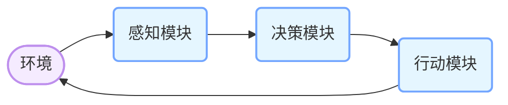

# 构建AI Agent的敏捷开发流程

> 关键词：AI Agent、敏捷开发流程、人工智能、软件开发、机器学习

> 摘要：本文聚焦于构建AI Agent的敏捷开发流程。首先介绍了相关背景，包括目的范围、预期读者等内容。接着阐述了AI Agent的核心概念及其联系，通过文本示意图和Mermaid流程图进行展示。详细讲解了核心算法原理及具体操作步骤，用Python源代码进行说明。还介绍了相关数学模型和公式，并举例说明。通过项目实战，展示了开发环境搭建、源代码实现与解读。探讨了实际应用场景，推荐了相关工具和资源。最后总结了未来发展趋势与挑战，提供了常见问题解答及扩展阅读参考资料，旨在为开发者提供全面、系统的AI Agent敏捷开发指导。

## 1. 背景介绍 
### 1.1 目的和范围
在当今人工智能快速发展的时代，AI Agent作为一种能够自主感知环境、做出决策并执行动作的智能实体，具有广泛的应用前景。本文章的目的在于详细阐述构建AI Agent的敏捷开发流程，帮助开发者高效、高质量地开发出满足需求的AI Agent。范围涵盖从AI Agent的基本概念理解，到核心算法原理的剖析，再到实际项目的开发实现，以及相关工具资源的推荐等方面。

### 1.2 预期读者
本文预期读者包括但不限于人工智能领域的开发者、软件工程师、机器学习爱好者、研究人员以及对AI Agent开发感兴趣的相关从业人员。无论是初学者希望了解AI Agent开发的基本流程，还是有一定经验的开发者寻求优化开发流程的方法，都能从本文中获得有价值的信息。

### 1.3 文档结构概述
本文将按照以下结构展开：首先介绍背景信息，让读者对文章的目的和范围有清晰的认识；接着阐述AI Agent的核心概念与联系，通过文本示意图和Mermaid流程图帮助读者理解其原理和架构；然后详细讲解核心算法原理及具体操作步骤，用Python代码进行说明；再介绍相关数学模型和公式并举例；通过项目实战展示开发环境搭建、源代码实现与解读；探讨实际应用场景；推荐相关工具和资源；最后总结未来发展趋势与挑战，提供常见问题解答及扩展阅读参考资料。

### 1.4 术语表
#### 1.4.1 核心术语定义
- **AI Agent**：人工智能代理，是一种能够感知环境、根据感知信息做出决策并采取行动以实现特定目标的智能实体。
- **敏捷开发**：一种软件开发方法，强调快速迭代、响应变化、团队协作和客户参与，以高效地交付有价值的软件产品。
- **机器学习**：一门多领域交叉学科，涉及概率论、统计学、逼近论、凸分析、算法复杂度理论等多门学科。它专门研究计算机怎样模拟或实现人类的学习行为，以获取新的知识或技能，重新组织已有的知识结构使之不断改善自身的性能。

#### 1.4.2 相关概念解释
- **环境感知**：AI Agent通过各种传感器（如摄像头、麦克风、雷达等）获取周围环境的信息，以便了解自身所处的状态和环境的变化。
- **决策制定**：AI Agent根据感知到的环境信息，运用一定的算法和模型，分析并选择最优的行动方案，以实现预定的目标。
- **行动执行**：AI Agent将决策制定阶段确定的行动方案转化为实际的动作，作用于环境，从而影响环境的状态。

#### 1.4.3 缩略词列表
- **ML**：Machine Learning（机器学习）
- **RL**：Reinforcement Learning（强化学习）
- **DL**：Deep Learning（深度学习）

## 2. 核心概念与联系 
### 核心概念原理
AI Agent的核心概念基于智能体理论，其基本原理是通过感知环境、处理信息、做出决策和执行动作这一系列过程来实现特定的目标。AI Agent可以看作是一个黑盒，输入是环境的感知信息，经过内部的算法和模型处理后，输出是相应的行动。

AI Agent的核心组件包括感知模块、决策模块和行动模块。感知模块负责收集环境信息，决策模块根据感知信息进行分析和推理，制定出最佳的行动策略，行动模块则将决策转化为实际的动作。

### 架构的文本示意图
AI Agent的架构可以用以下文本示意图表示：

```plaintext
+----------------------+
|      环境 (Environment)      |
+----------------------+
           |
           v
+----------------------+
|    感知模块 (Perception Module)    |
+----------------------+
           |
           v
+----------------------+
|    决策模块 (Decision Module)    |
+----------------------+
           |
           v
+----------------------+
|    行动模块 (Action Module)    |
+----------------------+
           |
           v
+----------------------+
|      环境 (Environment)      |
+----------------------+
```

### Mermaid流程图


## 3. 核心算法原理 & 具体操作步骤 
### 核心算法原理
AI Agent的开发涉及多种算法，其中强化学习是一种常用的算法。强化学习的基本思想是智能体通过与环境进行交互，不断尝试不同的动作，并根据环境给予的奖励信号来调整自己的行为策略，以最大化长期累积奖励。

强化学习的核心概念包括状态（State）、动作（Action）、奖励（Reward）和策略（Policy）。状态表示智能体所处的环境状态，动作是智能体在某个状态下可以采取的行为，奖励是环境对智能体采取某个动作后的反馈，策略则是智能体根据当前状态选择动作的规则。

### 具体操作步骤
以下是使用Python实现一个简单的强化学习AI Agent的具体步骤：

#### 步骤1：定义环境
```python
import numpy as np

class Environment:
    def __init__(self):
        self.state = 0
        self.num_states = 5
        self.num_actions = 2

    def reset(self):
        self.state = 0
        return self.state

    def step(self, action):
        if action == 0:
            self.state = max(self.state - 1, 0)
        else:
            self.state = min(self.state + 1, self.num_states - 1)

        reward = 1 if self.state == self.num_states - 1 else 0
        done = self.state == self.num_states - 1
        return self.state, reward, done
```

#### 步骤2：定义智能体
```python
class Agent:
    def __init__(self, num_states, num_actions, learning_rate=0.1, discount_factor=0.9):
        self.num_states = num_states
        self.num_actions = num_actions
        self.learning_rate = learning_rate
        self.discount_factor = discount_factor
        self.q_table = np.zeros((num_states, num_actions))

    def choose_action(self, state):
        if np.random.uniform(0, 1) < 0.1:
            return np.random.choice(self.num_actions)
        else:
            return np.argmax(self.q_table[state])

    def update_q_table(self, state, action, reward, next_state):
        predict = self.q_table[state][action]
        target = reward + self.discount_factor * np.max(self.q_table[next_state])
        self.q_table[state][action] += self.learning_rate * (target - predict)
```

#### 步骤3：训练智能体
```python
env = Environment()
agent = Agent(env.num_states, env.num_actions)

num_episodes = 1000
for episode in range(num_episodes):
    state = env.reset()
    done = False
    while not done:
        action = agent.choose_action(state)
        next_state, reward, done = env.step(action)
        agent.update_q_table(state, action, reward, next_state)
        state = next_state

print("训练完成，Q表：")
print(agent.q_table)
```

## 4. 数学模型和公式 & 详细讲解 & 举例说明 
### 数学模型和公式
在强化学习中，Q学习是一种常用的算法，其核心公式为：

$$Q(s,a) \leftarrow Q(s,a) + \alpha [r + \gamma \max_{a'} Q(s',a') - Q(s,a)]$$

其中：
- $Q(s,a)$ 表示在状态 $s$ 下采取动作 $a$ 的Q值。
- $\alpha$ 是学习率，控制每次更新的步长。
- $r$ 是环境给予的即时奖励。
- $\gamma$ 是折扣因子，用于平衡即时奖励和未来奖励的重要性。
- $s'$ 是采取动作 $a$ 后转移到的下一个状态。
- $\max_{a'} Q(s',a')$ 表示在下一个状态 $s'$ 下所有可能动作中最大的Q值。

### 详细讲解
Q学习的目标是通过不断更新Q表，使得智能体能够学习到最优的策略。在每个时间步，智能体根据当前状态 $s$ 选择一个动作 $a$，执行该动作后环境会返回一个即时奖励 $r$ 和下一个状态 $s'$。然后，智能体根据Q学习公式更新当前状态 $s$ 和动作 $a$ 的Q值。

学习率 $\alpha$ 决定了每次更新的步长，如果 $\alpha$ 太大，智能体可能会过于快速地更新Q值，导致学习不稳定；如果 $\alpha$ 太小，智能体的学习速度会很慢。折扣因子 $\gamma$ 表示未来奖励的重要性，$\gamma$ 越接近1，智能体越关注未来的奖励；$\gamma$ 越接近0，智能体越关注即时奖励。

### 举例说明
假设我们有一个简单的环境，状态空间 $S = \{s_1, s_2, s_3\}$，动作空间 $A = \{a_1, a_2\}$，初始Q表如下：

| 状态 | $a_1$ | $a_2$ |
| ---- | ---- | ---- |
| $s_1$ | 0 | 0 |
| $s_2$ | 0 | 0 |
| $s_3$ | 0 | 0 |

当前状态 $s = s_1$，智能体选择动作 $a = a_1$，执行该动作后环境返回奖励 $r = 1$，下一个状态 $s' = s_2$。假设学习率 $\alpha = 0.1$，折扣因子 $\gamma = 0.9$。

首先，计算目标值：

$\max_{a'} Q(s',a') = \max\{Q(s_2,a_1), Q(s_2,a_2)\} = 0$

$target = r + \gamma \max_{a'} Q(s',a') = 1 + 0.9 \times 0 = 1$

然后，更新Q值：

$Q(s,a) = Q(s_1,a_1) = Q(s_1,a_1) + \alpha [target - Q(s_1,a_1)] = 0 + 0.1 \times (1 - 0) = 0.1$

更新后的Q表如下：

| 状态 | $a_1$ | $a_2$ |
| ---- | ---- | ---- |
| $s_1$ | 0.1 | 0 |
| $s_2$ | 0 | 0 |
| $s_3$ | 0 | 0 |

## 5. 项目实战：代码实际案例和详细解释说明 
### 5.1  开发环境搭建
#### 安装Python
首先，确保你已经安装了Python 3.x版本。可以从Python官方网站（https://www.python.org/downloads/）下载并安装。

#### 安装必要的库
在项目中，我们使用了 `numpy` 库，你可以使用以下命令进行安装：

```sh
pip install numpy
```

### 5.2  源代码详细实现和代码解读
以下是一个完整的AI Agent开发项目的源代码：

```python
import numpy as np

# 定义环境类
class Environment:
    def __init__(self):
        # 初始化状态
        self.state = 0
        # 状态数量
        self.num_states = 5
        # 动作数量
        self.num_actions = 2

    def reset(self):
        # 重置环境状态
        self.state = 0
        return self.state

    def step(self, action):
        if action == 0:
            # 向左移动
            self.state = max(self.state - 1, 0)
        else:
            # 向右移动
            self.state = min(self.state + 1, self.num_states - 1)

        # 计算奖励
        reward = 1 if self.state == self.num_states - 1 else 0
        # 判断是否完成任务
        done = self.state == self.num_states - 1
        return self.state, reward, done

# 定义智能体类
class Agent:
    def __init__(self, num_states, num_actions, learning_rate=0.1, discount_factor=0.9):
        # 状态数量
        self.num_states = num_states
        # 动作数量
        self.num_actions = num_actions
        # 学习率
        self.learning_rate = learning_rate
        # 折扣因子
        self.discount_factor = discount_factor
        # 初始化Q表
        self.q_table = np.zeros((num_states, num_actions))

    def choose_action(self, state):
        if np.random.uniform(0, 1) < 0.1:
            # 以10%的概率随机选择动作
            return np.random.choice(self.num_actions)
        else:
            # 选择Q值最大的动作
            return np.argmax(self.q_table[state])

    def update_q_table(self, state, action, reward, next_state):
        # 计算预测值
        predict = self.q_table[state][action]
        # 计算目标值
        target = reward + self.discount_factor * np.max(self.q_table[next_state])
        # 更新Q表
        self.q_table[state][action] += self.learning_rate * (target - predict)

# 主函数
if __name__ == "__main__":
    # 创建环境对象
    env = Environment()
    # 创建智能体对象
    agent = Agent(env.num_states, env.num_actions)

    # 训练轮数
    num_episodes = 1000
    for episode in range(num_episodes):
        # 重置环境
        state = env.reset()
        done = False
        while not done:
            # 选择动作
            action = agent.choose_action(state)
            # 执行动作，获取下一个状态、奖励和是否完成信息
            next_state, reward, done = env.step(action)
            # 更新Q表
            agent.update_q_table(state, action, reward, next_state)
            # 更新当前状态
            state = next_state

    print("训练完成，Q表：")
    print(agent.q_table)
```

### 5.3  代码解读与分析
#### 环境类（`Environment`）
- `__init__` 方法：初始化环境的状态、状态数量和动作数量。
- `reset` 方法：重置环境的状态为初始状态，并返回该状态。
- `step` 方法：根据智能体选择的动作更新环境状态，计算奖励，并判断是否完成任务，最后返回下一个状态、奖励和是否完成信息。

#### 智能体类（`Agent`）
- `__init__` 方法：初始化智能体的状态数量、动作数量、学习率、折扣因子和Q表。
- `choose_action` 方法：根据当前状态选择动作，以10%的概率随机选择动作，以90%的概率选择Q值最大的动作。
- `update_q_table` 方法：根据Q学习公式更新Q表。

#### 主函数
- 创建环境对象和智能体对象。
- 进行1000轮训练，每轮训练中重置环境状态，智能体不断选择动作、执行动作、更新Q表，直到完成任务。
- 训练完成后，打印Q表。

## 6. 实际应用场景 
### 游戏领域
AI Agent在游戏领域有着广泛的应用，例如在策略游戏中，AI Agent可以作为对手与玩家进行对战。它可以通过感知游戏环境（如地图信息、资源分布、单位状态等），做出决策（如选择攻击目标、建造建筑、调配资源等），并执行相应的动作，以实现游戏目标（如击败对手、占领资源等）。

### 机器人控制
在机器人控制领域，AI Agent可以帮助机器人实现自主导航和任务执行。机器人通过各种传感器（如激光雷达、摄像头、超声波传感器等）感知周围环境，AI Agent根据感知信息做出决策，控制机器人的移动和动作，例如在仓库中自动搬运货物、在危险环境中进行探测和救援等。

### 智能客服
智能客服是AI Agent的另一个重要应用场景。AI Agent可以通过自然语言处理技术理解用户的问题，根据预设的规则和训练好的模型做出回答，与用户进行交互。它可以处理常见问题，提供相关信息，甚至可以引导用户解决复杂问题，提高客户服务的效率和质量。

### 金融投资
在金融投资领域，AI Agent可以分析市场数据（如股票价格、利率、汇率等），根据历史数据和实时信息做出投资决策。它可以预测市场趋势，选择最优的投资组合，帮助投资者降低风险，提高收益。

## 7. 工具和资源推荐
### 7.1 学习资源推荐
#### 7.1.1 书籍推荐
- 《人工智能：一种现代的方法》（Artificial Intelligence: A Modern Approach）：这是一本经典的人工智能教材，全面介绍了人工智能的各个领域，包括搜索算法、知识表示、机器学习、自然语言处理等。
- 《强化学习：原理与Python实现》（Reinforcement Learning: An Introduction）：由强化学习领域的两位先驱Richard S. Sutton和Andrew G. Barto所著，系统地介绍了强化学习的基本概念、算法和应用。
- 《Python机器学习》（Python Machine Learning）：本书详细介绍了如何使用Python进行机器学习，包括数据预处理、模型选择、深度学习等内容，适合初学者学习。

#### 7.1.2 在线课程
- Coursera上的“机器学习”课程：由斯坦福大学的Andrew Ng教授讲授，是一门非常经典的机器学习入门课程，涵盖了机器学习的基本概念、算法和实践。
- edX上的“强化学习基础”课程：由OpenAI的研究人员讲授，深入介绍了强化学习的原理和算法，适合有一定机器学习基础的学习者。
- 哔哩哔哩上的“Python人工智能实战教程”：由国内的一些知名讲师制作，通过实际项目案例讲解人工智能的应用，生动有趣，易于理解。

#### 7.1.3 技术博客和网站
- Medium：这是一个知名的技术博客平台，上面有很多关于人工智能、机器学习、AI Agent等方面的优秀文章，可以帮助你了解最新的技术动态和研究成果。
- Towards Data Science：专注于数据科学和人工智能领域的博客，提供了大量的技术文章、教程和案例分析。
- OpenAI官方博客：OpenAI是人工智能领域的领先研究机构，其官方博客发布了很多关于AI Agent、强化学习等方面的最新研究成果和技术进展。

### 7.2 开发工具框架推荐
#### 7.2.1 IDE和编辑器
- PyCharm：一款专业的Python集成开发环境，提供了丰富的功能，如代码编辑、调试、代码分析、版本控制等，非常适合Python开发。
- Visual Studio Code：一款轻量级的代码编辑器，支持多种编程语言，拥有丰富的插件生态系统，可以方便地进行人工智能开发。
- Jupyter Notebook：一种交互式的开发环境，适合进行数据探索、模型训练和结果展示，在人工智能领域得到了广泛的应用。

#### 7.2.2 调试和性能分析工具
- TensorBoard：TensorFlow的可视化工具，可以帮助你可视化训练过程中的损失函数、准确率、梯度等指标，方便调试和优化模型。
- Py-Spy：一个用于Python程序的性能分析工具，可以帮助你找出程序中的性能瓶颈，提高程序的运行效率。
- cProfile：Python内置的性能分析模块，可以帮助你分析程序中各个函数的执行时间和调用次数，优化代码性能。

#### 7.2.3 相关框架和库
- TensorFlow：由Google开发的开源深度学习框架，提供了丰富的工具和库，支持各种深度学习模型的开发和训练。
- PyTorch：由Facebook开发的开源深度学习框架，具有动态图的特点，易于使用和调试，在学术界和工业界都得到了广泛的应用。
- OpenAI Gym：一个用于开发和比较强化学习算法的工具包，提供了各种模拟环境，方便你进行强化学习的实验和研究。

### 7.3 相关论文著作推荐
#### 7.3.1 经典论文
- “Q-learning”（Watkins, C. J. C. H., & Dayan, P. (1992). Q-learning. Machine learning, 8(3-4), 279-292.）：这是Q学习算法的经典论文，首次提出了Q学习的概念和算法，为强化学习的发展奠定了基础。
- “Playing Atari with Deep Reinforcement Learning”（Mnih, V., Kavukcuoglu, K., Silver, D., Graves, A., Antonoglou, I., Wierstra, D., & Riedmiller, M. (2013). Playing Atari with deep reinforcement learning. arXiv preprint arXiv:1312.5602.）：这篇论文提出了深度Q网络（DQN）算法，将深度学习和强化学习相结合，在Atari游戏中取得了很好的效果，开创了深度强化学习的先河。

#### 7.3.2 最新研究成果
- 关注顶级学术会议（如NeurIPS、ICML、AAAI等）上的相关论文，这些会议汇集了人工智能领域的最新研究成果，可以帮助你了解AI Agent开发的前沿技术和发展趋势。
- 关注知名研究机构（如OpenAI、DeepMind等）的官方网站和博客，他们经常发布最新的研究成果和技术报告。

#### 7.3.3 应用案例分析
- 研究一些实际应用中的AI Agent案例，如AlphaGo在围棋领域的应用、波士顿动力机器人的控制等。通过分析这些案例，可以学习到如何将AI Agent技术应用到实际场景中，解决具体的问题。

## 8. 总结：未来发展趋势与挑战
### 未来发展趋势
#### 多智能体协作
未来的AI Agent将不再是孤立的个体，而是多个智能体之间进行协作，共同完成复杂的任务。例如，在智能交通系统中，多个自动驾驶汽车可以通过协作实现高效的交通流量管理；在物流领域，多个机器人可以协作完成货物的搬运和分拣。

#### 与人类的深度融合
AI Agent将与人类进行更深度的融合，成为人类的智能助手。例如，在医疗领域，AI Agent可以辅助医生进行疾病诊断和治疗方案制定；在教育领域，AI Agent可以根据学生的学习情况提供个性化的学习建议和辅导。

#### 自适应和进化能力
未来的AI Agent将具备更强的自适应和进化能力，能够根据环境的变化和任务的需求自动调整自己的行为策略。例如，在未知环境中，AI Agent可以通过不断探索和学习，快速适应新的环境，找到最优的解决方案。

### 挑战
#### 伦理和道德问题
随着AI Agent的广泛应用，伦理和道德问题变得越来越重要。例如，AI Agent在做出决策时可能会对人类产生影响，如何确保AI Agent的决策符合人类的价值观和道德标准是一个亟待解决的问题。

#### 数据隐私和安全
AI Agent的开发和训练需要大量的数据，这些数据可能包含用户的隐私信息。如何保护数据的隐私和安全，防止数据泄露和滥用是一个重要的挑战。

#### 算法的可解释性
许多AI Agent采用深度学习等复杂的算法，这些算法的决策过程往往是黑盒的，难以解释。在一些关键领域（如医疗、金融等），算法的可解释性至关重要，如何提高AI Agent算法的可解释性是一个需要解决的问题。

## 9. 附录：常见问题与解答
### 问题1：AI Agent和传统软件有什么区别？
AI Agent具有自主感知环境、做出决策和执行动作的能力，能够根据环境的变化动态调整自己的行为。而传统软件通常是按照预先编写的程序逻辑执行固定的任务，缺乏自主学习和适应环境的能力。

### 问题2：强化学习适合所有的AI Agent开发吗？
不是所有的AI Agent开发都适合使用强化学习。强化学习适用于那些需要通过与环境进行交互来学习最优策略的场景，例如游戏、机器人控制等。对于一些已知规则和明确目标的问题，可能使用传统的算法或机器学习方法更合适。

### 问题3：如何评估AI Agent的性能？
评估AI Agent的性能可以从多个方面进行，例如任务完成的准确率、效率、稳定性等。在强化学习中，常用的评估指标包括累积奖励、平均奖励、成功率等。

### 问题4：AI Agent的开发需要具备哪些基础知识？
AI Agent的开发需要具备一定的数学基础（如线性代数、概率论、统计学等）、编程基础（如Python）以及机器学习、人工智能等相关知识。

## 10. 扩展阅读 & 参考资料
### 扩展阅读
- 《深度学习》（Deep Learning）：由Ian Goodfellow、Yoshua Bengio和Aaron Courville所著，全面介绍了深度学习的理论和实践，是深度学习领域的经典著作。
- 《人工智能时代》（The Age of AI）：探讨了人工智能对社会、经济、文化等方面的影响，以及未来的发展趋势。

### 参考资料
- 各开源框架的官方文档，如TensorFlow、PyTorch、OpenAI Gym等。
- 相关学术会议和期刊上的论文，如NeurIPS、ICML、AAAI、Journal of Artificial Intelligence Research等。