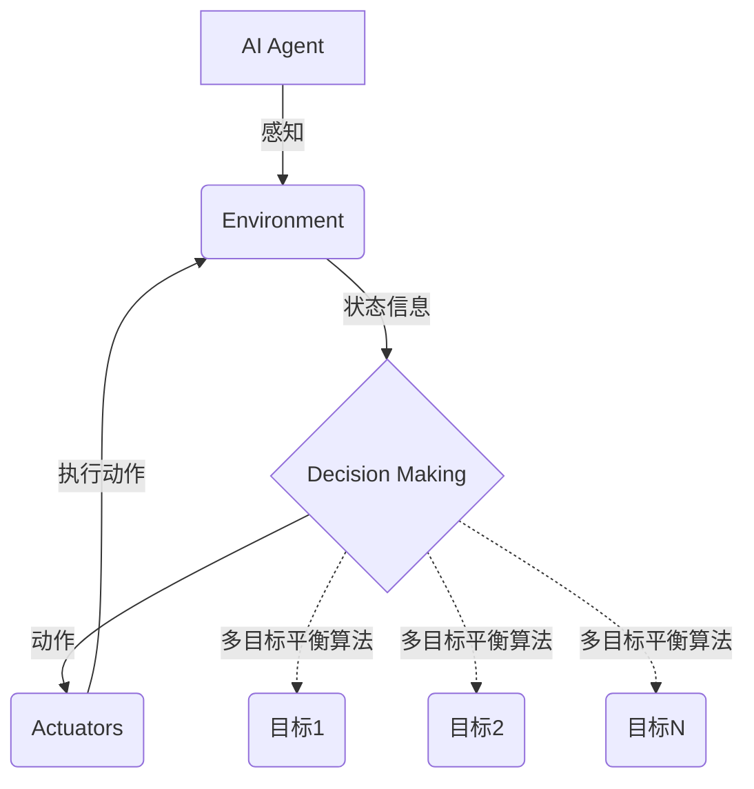

# 构建具有多目标平衡能力的AI Agent

> 关键词：AI Agent、多目标平衡、强化学习、决策算法、智能体设计、目标优化、环境交互

> 摘要：本文聚焦于构建具有多目标平衡能力的AI Agent这一核心主题。在复杂多变的环境中，AI Agent往往需要同时处理多个相互关联甚至相互冲突的目标，如何实现这些目标的有效平衡是提升AI Agent智能水平和应用价值的关键。文章首先介绍了构建此类AI Agent的背景信息，包括目的、预期读者等内容；接着深入阐述了核心概念与联系，通过文本示意图和Mermaid流程图进行清晰呈现；详细讲解了核心算法原理，并结合Python源代码进行具体操作步骤的说明；还给出了相关的数学模型和公式，并举例说明；通过项目实战展示了代码的实际案例及详细解释；探讨了实际应用场景；推荐了相关的工具和资源；最后对未来发展趋势与挑战进行总结，同时提供常见问题解答和扩展阅读参考资料，旨在为相关领域的研究者和开发者提供全面且深入的技术指导。

## 1. 背景介绍 
### 1.1 目的和范围
在当今的人工智能领域，AI Agent被广泛应用于各种复杂的场景中，如自动驾驶、机器人控制、智能游戏等。在这些场景中，AI Agent面临的任务往往不是单一目标的，而是包含多个相互关联、甚至相互冲突的目标。例如，在自动驾驶中，车辆需要同时考虑行驶速度、安全性、能源效率等多个目标；在智能游戏中，玩家控制的角色需要在获取资源、击败敌人、保护队友等多个目标之间进行平衡。因此，构建具有多目标平衡能力的AI Agent具有重要的现实意义。

本文的范围主要涵盖了具有多目标平衡能力的AI Agent的基本概念、核心算法原理、数学模型、项目实战以及实际应用场景等方面，旨在为读者提供一个全面而深入的技术指南，帮助读者理解和掌握构建此类AI Agent的方法和技术。

### 1.2 预期读者
本文预期读者包括人工智能领域的研究者、开发者、相关专业的学生以及对AI Agent技术感兴趣的技术爱好者。对于研究者来说，本文可以为他们的研究提供新的思路和方法；对于开发者来说，本文可以作为他们进行实际项目开发的参考指南；对于学生来说，本文可以帮助他们深入理解AI Agent技术的核心原理和应用；对于技术爱好者来说，本文可以满足他们对新技术的好奇心和求知欲。

### 1.3 文档结构概述
本文的文档结构主要包括以下几个部分：
1. **背景介绍**：介绍构建具有多目标平衡能力的AI Agent的目的、预期读者、文档结构概述和术语表。
2. **核心概念与联系**：阐述AI Agent、多目标平衡等核心概念的原理和架构，通过文本示意图和Mermaid流程图进行展示。
3. **核心算法原理 & 具体操作步骤**：详细讲解实现多目标平衡的核心算法原理，并使用Python源代码进行具体操作步骤的说明。
4. **数学模型和公式 & 详细讲解 & 举例说明**：给出相关的数学模型和公式，并进行详细讲解和举例说明。
5. **项目实战：代码实际案例和详细解释说明**：通过实际项目案例展示代码的实现和详细解释。
6. **实际应用场景**：探讨具有多目标平衡能力的AI Agent在不同领域的实际应用场景。
7. **工具和资源推荐**：推荐相关的学习资源、开发工具框架和论文著作。
8. **总结：未来发展趋势与挑战**：对具有多目标平衡能力的AI Agent的未来发展趋势和挑战进行总结。
9. **附录：常见问题与解答**：提供常见问题的解答。
10. **扩展阅读 & 参考资料**：提供相关的扩展阅读和参考资料。

### 1.4 术语表
#### 1.4.1 核心术语定义
- **AI Agent**：即人工智能智能体，是一种能够感知环境、进行决策并采取行动的实体。它可以是软件程序、机器人或其他具有智能行为的系统。
- **多目标平衡**：指在多个目标之间进行协调和优化，以实现整体性能的最优。这些目标可能相互关联、相互冲突，需要通过合理的算法和策略来进行平衡。
- **强化学习**：一种机器学习方法，通过智能体与环境的交互，根据环境反馈的奖励信号来学习最优的行为策略。
- **决策算法**：用于在多个可选方案中进行选择的算法，在多目标平衡中，决策算法需要考虑多个目标的影响。

#### 1.4.2 相关概念解释
- **目标函数**：用于衡量智能体在实现某个目标时的性能指标。在多目标平衡中，通常有多个目标函数，需要综合考虑这些目标函数来进行决策。
- **帕累托最优**：在多目标优化中，如果一个解在不降低其他目标性能的情况下，无法再提高某个目标的性能，那么这个解就是帕累托最优解。
- **状态空间**：智能体所处环境的所有可能状态的集合。智能体通过感知环境的状态来进行决策。
- **动作空间**：智能体可以采取的所有可能动作的集合。智能体根据当前状态选择合适的动作来实现目标。

#### 1.4.3 缩略词列表
- **AI**：Artificial Intelligence，人工智能
- **RL**：Reinforcement Learning，强化学习
- **MDP**：Markov Decision Process，马尔可夫决策过程

## 2. 核心概念与联系 

### 核心概念原理
#### AI Agent
AI Agent是人工智能系统的核心组成部分，它具有感知、决策和行动的能力。AI Agent通过传感器感知环境的状态，然后根据一定的决策算法选择合适的动作，最后通过执行器将动作作用于环境。例如，在一个机器人导航系统中，机器人通过摄像头、激光雷达等传感器感知周围环境的状态，然后根据路径规划算法选择合适的移动方向和速度，最后通过电机等执行器实现移动。

#### 多目标平衡
多目标平衡是指在多个目标之间进行协调和优化，以实现整体性能的最优。在实际应用中，多个目标往往是相互关联、相互冲突的。例如，在一个生产调度系统中，需要同时考虑生产效率、产品质量和成本等多个目标。提高生产效率可能会降低产品质量，而提高产品质量可能会增加成本。因此，需要通过合理的算法和策略来平衡这些目标，以实现整体性能的最优。

### 架构的文本示意图
```plaintext
+----------------------+
|       AI Agent       |
|----------------------|
|  Sensors (感知模块)  |
|----------------------|
| Decision Making (决策模块) |
|----------------------|
|   Actuators (执行模块)  |
+----------------------+
|      Environment     |
+----------------------+

AI Agent通过Sensors感知Environment的状态，将状态信息传递给Decision Making模块。Decision Making模块根据多目标平衡算法进行决策，选择合适的动作。最后，Actuators将动作作用于Environment，环境状态发生改变，形成一个闭环的交互过程。
```

### Mermaid流程图


这个流程图展示了AI Agent与环境的交互过程，以及决策模块如何使用多目标平衡算法来考虑多个目标。AI Agent首先感知环境状态，然后决策模块根据多目标平衡算法综合考虑多个目标，选择合适的动作，最后执行器将动作作用于环境，环境状态更新后再次被AI Agent感知，形成一个循环。

## 3. 核心算法原理 & 具体操作步骤 

### 核心算法原理
在构建具有多目标平衡能力的AI Agent中，强化学习是一种常用的方法。强化学习通过智能体与环境的交互，根据环境反馈的奖励信号来学习最优的行为策略。在多目标平衡的场景中，需要对传统的强化学习算法进行扩展，以处理多个奖励信号。

一种常见的方法是使用线性加权的方式将多个目标的奖励信号组合成一个综合奖励信号。假设存在 $n$ 个目标，每个目标的奖励信号为 $r_i$，对应的权重为 $w_i$，则综合奖励信号 $R$ 可以表示为：

$R = \sum_{i=1}^{n} w_i r_i$

其中，$\sum_{i=1}^{n} w_i = 1$，$w_i \geq 0$。通过调整权重 $w_i$，可以实现对不同目标的不同重视程度。

另一种方法是使用帕累托最优的思想，在多目标空间中寻找帕累托最优解。智能体在学习过程中，会不断探索不同的策略，找到一组策略，使得在不降低其他目标性能的情况下，无法再提高某个目标的性能。

### 具体操作步骤及Python源代码
以下是一个使用线性加权奖励信号的简单强化学习示例，采用Q学习算法：

```python
import numpy as np

# 定义环境参数
num_states = 10
num_actions = 4
num_goals = 3

# 初始化Q表
Q = np.zeros((num_states, num_actions))

# 初始化目标权重
weights = np.array([0.3, 0.4, 0.3])

# 定义奖励函数，返回多个目标的奖励信号
def reward_function(state, action):
    # 这里只是一个示例，实际应用中需要根据具体问题定义
    rewards = np.array([1, 2, 3])
    return rewards

# 定义Q学习算法
def q_learning(alpha=0.1, gamma=0.9, epsilon=0.1, num_episodes=1000):
    for episode in range(num_episodes):
        state = np.random.randint(0, num_states)
        done = False
        while not done:
            if np.random.uniform(0, 1) < epsilon:
                action = np.random.randint(0, num_actions)
            else:
                action = np.argmax(Q[state, :])
            
            rewards = reward_function(state, action)
            # 计算综合奖励信号
            combined_reward = np.dot(weights, rewards)
            
            next_state = np.random.randint(0, num_states)  # 这里只是示例，实际需要根据环境动态更新
            next_action = np.argmax(Q[next_state, :])
            
            # 更新Q表
            Q[state, action] += alpha * (combined_reward + gamma * Q[next_state, next_action] - Q[state, action])
            
            state = next_state
            
            # 判断是否结束，这里简单假设达到一定条件结束
            if state == 5:
                done = True

# 运行Q学习算法
q_learning()

print("Final Q table:")
print(Q)
```

### 代码解释
1. **环境参数定义**：定义了状态空间的大小 `num_states`、动作空间的大小 `num_actions` 和目标的数量 `num_goals`。
2. **Q表初始化**：使用 `np.zeros` 函数初始化Q表，Q表的大小为 `(num_states, num_actions)`。
3. **目标权重初始化**：定义了每个目标的权重 `weights`，权重之和为1。
4. **奖励函数**：`reward_function` 函数返回多个目标的奖励信号，实际应用中需要根据具体问题进行定义。
5. **Q学习算法**：在每个回合中，智能体根据当前状态选择动作，计算综合奖励信号，更新Q表，直到达到终止条件。
6. **运行算法**：调用 `q_learning` 函数运行Q学习算法，并打印最终的Q表。

## 4. 数学模型和公式 & 详细讲解 & 举例说明 

### 数学模型
在多目标平衡的强化学习中，通常使用马尔可夫决策过程（MDP）来描述智能体与环境的交互过程。MDP可以用一个五元组 $(S, A, P, R, \gamma)$ 来表示，其中：
- $S$ 是状态空间，表示智能体所处环境的所有可能状态的集合。
- $A$ 是动作空间，表示智能体可以采取的所有可能动作的集合。
- $P: S \times A \times S \to [0, 1]$ 是状态转移概率函数，表示在状态 $s$ 下采取动作 $a$ 转移到状态 $s'$ 的概率。
- $R: S \times A \to \mathbb{R}^n$ 是奖励函数，返回 $n$ 个目标的奖励信号。
- $\gamma \in [0, 1]$ 是折扣因子，表示未来奖励的重要程度。

### 公式详细讲解
#### 综合奖励信号
如前面所述，综合奖励信号 $R$ 可以表示为：

$R = \sum_{i=1}^{n} w_i r_i$

其中，$r_i$ 是第 $i$ 个目标的奖励信号，$w_i$ 是第 $i$ 个目标的权重，且 $\sum_{i=1}^{n} w_i = 1$，$w_i \geq 0$。

#### Q学习更新公式
在Q学习算法中，Q值的更新公式为：

$Q(s, a) \leftarrow Q(s, a) + \alpha [R + \gamma \max_{a'} Q(s', a') - Q(s, a)]$

其中，$Q(s, a)$ 是状态 $s$ 下采取动作 $a$ 的Q值，$\alpha$ 是学习率，$R$ 是综合奖励信号，$\gamma$ 是折扣因子，$s'$ 是下一个状态，$a'$ 是下一个状态下的最优动作。

### 举例说明
假设一个智能体在一个二维网格环境中移动，有两个目标：尽快到达目标位置和尽量少走弯路。设到达目标位置的奖励为 $r_1$，少走弯路的奖励为 $r_2$，权重分别为 $w_1 = 0.6$ 和 $w_2 = 0.4$。

当智能体到达目标位置时，$r_1 = 10$，少走弯路的奖励根据路径的曲折程度计算，假设当前少走弯路的奖励 $r_2 = 5$。则综合奖励信号为：

$R = w_1 r_1 + w_2 r_2 = 0.6 \times 10 + 0.4 \times 5 = 6 + 2 = 8$

假设当前状态为 $s$，采取动作 $a$，下一个状态为 $s'$，$Q(s, a) = 2$，$\alpha = 0.1$，$\gamma = 0.9$，$\max_{a'} Q(s', a') = 3$，则更新后的Q值为：

$Q(s, a) = Q(s, a) + \alpha [R + \gamma \max_{a'} Q(s', a') - Q(s, a)]$

$= 2 + 0.1 \times (8 + 0.9 \times 3 - 2)$

$= 2 + 0.1 \times (8 + 2.7 - 2)$

$= 2 + 0.1 \times 8.7$

$= 2 + 0.87$

$= 2.87$

## 5. 项目实战：代码实际案例和详细解释说明 

### 5.1  开发环境搭建
#### 操作系统
可以选择Windows、Linux或macOS等常见的操作系统。这里以Ubuntu 20.04为例进行说明。

#### 编程语言和环境
- **Python**：建议使用Python 3.7及以上版本。可以通过以下命令安装Python：
```bash
sudo apt update
sudo apt install python3 python3-pip
```
- **虚拟环境**：为了避免不同项目之间的依赖冲突，建议使用虚拟环境。可以使用 `venv` 模块创建虚拟环境：
```bash
python3 -m venv myenv
source myenv/bin/activate
```

#### 依赖库安装
在虚拟环境中安装所需的依赖库，主要包括 `numpy`、`matplotlib` 等：
```bash
pip install numpy matplotlib
```

### 5.2  源代码详细实现和代码解读
以下是一个基于Python的多目标平衡AI Agent项目实战代码，模拟一个机器人在迷宫中寻找目标并尽量少碰撞障碍物的场景。

```python
import numpy as np
import matplotlib.pyplot as plt

# 定义迷宫环境
class MazeEnv:
    def __init__(self):
        # 迷宫地图，0表示通路，1表示障碍物，2表示目标
        self.maze = np.array([
            [0, 0, 0, 0],
            [0, 1, 1, 0],
            [0, 1, 0, 0],
            [0, 0, 0, 2]
        ])
        self.num_rows, self.num_cols = self.maze.shape
        self.agent_row = 0
        self.agent_col = 0
        self.done = False

    def reset(self):
        self.agent_row = 0
        self.agent_col = 0
        self.done = False
        return self.get_state()

    def get_state(self):
        return self.agent_row * self.num_cols + self.agent_col

    def step(self, action):
        if action == 0:  # 上
            new_row = self.agent_row - 1
            new_col = self.agent_col
        elif action == 1:  # 下
            new_row = self.agent_row + 1
            new_col = self.agent_col
        elif action == 2:  # 左
            new_row = self.agent_row
            new_col = self.agent_col - 1
        elif action == 3:  # 右
            new_row = self.agent_row
            new_col = self.agent_col + 1

        # 检查是否越界或撞到障碍物
        if new_row < 0 or new_row >= self.num_rows or new_col < 0 or new_col >= self.num_cols or self.maze[new_row, new_col] == 1:
            collision_reward = -1
            new_row = self.agent_row
            new_col = self.agent_col
        else:
            collision_reward = 0

        self.agent_row = new_row
        self.agent_col = new_col

        # 检查是否到达目标
        if self.maze[self.agent_row, self.agent_col] == 2:
            goal_reward = 10
            self.done = True
        else:
            goal_reward = 0

        rewards = np.array([goal_reward, collision_reward])
        return self.get_state(), rewards, self.done

# 定义Q学习智能体
class QLearningAgent:
    def __init__(self, num_states, num_actions, weights, alpha=0.1, gamma=0.9, epsilon=0.1):
        self.num_states = num_states
        self.num_actions = num_actions
        self.weights = weights
        self.alpha = alpha
        self.gamma = gamma
        self.epsilon = epsilon
        self.Q = np.zeros((num_states, num_actions))

    def get_action(self, state):
        if np.random.uniform(0, 1) < self.epsilon:
            action = np.random.randint(0, self.num_actions)
        else:
            action = np.argmax(self.Q[state, :])
        return action

    def update(self, state, action, rewards, next_state):
        combined_reward = np.dot(self.weights, rewards)
        next_action = np.argmax(self.Q[next_state, :])
        self.Q[state, action] += self.alpha * (combined_reward + self.gamma * self.Q[next_state, next_action] - self.Q[state, action])

# 训练智能体
def train_agent(env, agent, num_episodes=1000):
    total_rewards = []
    for episode in range(num_episodes):
        state = env.reset()
        episode_rewards = np.zeros(2)
        done = False
        while not done:
            action = agent.get_action(state)
            next_state, rewards, done = env.step(action)
            agent.update(state, action, rewards, next_state)
            episode_rewards += rewards
            state = next_state
        total_rewards.append(episode_rewards)
    return total_rewards

# 主函数
if __name__ == "__main__":
    env = MazeEnv()
    num_states = env.num_rows * env.num_cols
    num_actions = 4
    weights = np.array([0.8, 0.2])  # 目标奖励权重0.8，碰撞惩罚权重0.2
    agent = QLearningAgent(num_states, num_actions, weights)

    total_rewards = train_agent(env, agent, num_episodes=1000)

    # 绘制训练过程中两个目标的奖励变化曲线
    goal_rewards = [rewards[0] for rewards in total_rewards]
    collision_rewards = [rewards[1] for rewards in total_rewards]

    plt.figure(figsize=(12, 6))
    plt.subplot(1, 2, 1)
    plt.plot(goal_rewards)
    plt.title('Goal Rewards')
    plt.xlabel('Episode')
    plt.ylabel('Reward')

    plt.subplot(1, 2, 2)
    plt.plot(collision_rewards)
    plt.title('Collision Rewards')
    plt.xlabel('Episode')
    plt.ylabel('Reward')

    plt.show()
```

### 5.3  代码解读与分析
#### 迷宫环境类 `MazeEnv`
- **初始化**：定义迷宫地图，包括通路、障碍物和目标的位置，初始化智能体的位置和是否完成任务的标志。
- **重置环境**：将智能体的位置重置到起点，重置完成标志，并返回当前状态。
- **获取状态**：将智能体的行和列位置转换为一个一维状态编号。
- **执行动作**：根据输入的动作更新智能体的位置，检查是否越界或撞到障碍物，计算碰撞奖励，检查是否到达目标，计算目标奖励，返回下一个状态、奖励信号和是否完成任务的标志。

#### Q学习智能体类 `QLearningAgent`
- **初始化**：初始化状态空间大小、动作空间大小、目标权重、学习率、折扣因子、探索率和Q表。
- **选择动作**：根据探索率决定是随机选择动作还是选择Q值最大的动作。
- **更新Q表**：根据综合奖励信号和Q学习更新公式更新Q表。

#### 训练函数 `train_agent`
- 在每个回合中，重置环境，智能体选择动作，环境返回下一个状态和奖励信号，智能体更新Q表，直到任务完成。
- 记录每个回合的两个目标的奖励信号。

#### 主函数
- 创建迷宫环境和Q学习智能体，设置目标权重。
- 调用训练函数训练智能体。
- 绘制训练过程中两个目标的奖励变化曲线，帮助分析智能体的学习过程。

## 6. 实际应用场景 
### 自动驾驶
在自动驾驶领域，车辆需要同时考虑多个目标，如行驶速度、安全性、能源效率等。具有多目标平衡能力的AI Agent可以根据不同的路况和驾驶场景，动态调整这些目标的权重，实现最优的驾驶决策。例如，在高速公路上，车辆可以更注重行驶速度和能源效率；在城市拥堵路段，车辆可以更注重安全性和避免碰撞。

### 机器人控制
机器人在执行任务时，也需要平衡多个目标。例如，在工业生产中，机器人需要在保证生产效率的同时，确保产品质量和设备安全；在服务机器人领域，机器人需要在完成任务的同时，与人类进行友好交互，避免对人类造成伤害。

### 智能游戏
在智能游戏中，玩家控制的角色需要在获取资源、击败敌人、保护队友等多个目标之间进行平衡。具有多目标平衡能力的AI Agent可以作为游戏中的智能对手，根据不同的游戏局势和玩家策略，动态调整自己的行为策略，提高游戏的趣味性和挑战性。

### 资源管理
在资源管理领域，如云计算、电力系统等，需要平衡多个目标，如资源利用率、成本、可靠性等。具有多目标平衡能力的AI Agent可以根据资源的使用情况和需求预测，动态分配资源，实现资源的最优配置。

## 7. 工具和资源推荐
### 7.1 学习资源推荐
#### 7.1.1 书籍推荐
- 《强化学习：原理与Python实现》：本书详细介绍了强化学习的基本原理和算法，并通过Python代码实现了多个实际案例，对于理解和掌握强化学习非常有帮助。
- 《人工智能：一种现代的方法》：这是一本经典的人工智能教材，涵盖了人工智能的各个领域，包括AI Agent、多目标优化等内容，对于建立全面的人工智能知识体系很有价值。
- 《多目标优化》：专门介绍多目标优化的理论和方法，对于深入理解多目标平衡的数学原理和算法有很大的帮助。

#### 7.1.2 在线课程
- Coursera上的“强化学习专项课程”：由知名教授授课，系统地介绍了强化学习的理论和实践，包括多目标强化学习的相关内容。
- edX上的“人工智能基础”：该课程涵盖了人工智能的基本概念和方法，对于初学者来说是一个很好的入门课程。
- 中国大学MOOC上的“机器学习”：由国内知名高校的教授授课，详细介绍了机器学习的各种算法，包括强化学习算法。

#### 7.1.3 技术博客和网站
- OpenAI官方博客：提供了关于人工智能和强化学习的最新研究成果和技术动态。
- Medium上的人工智能相关博客：有很多专业的人工智能开发者和研究者分享自己的经验和见解。
- 机器之心：专注于人工智能领域的资讯和技术分享，提供了大量的优质文章和案例。

### 7.2 开发工具框架推荐
#### 7.2.1 IDE和编辑器
- PyCharm：一款功能强大的Python集成开发环境，提供了代码编辑、调试、版本控制等丰富的功能，非常适合Python开发。
- Visual Studio Code：一款轻量级的代码编辑器，支持多种编程语言，通过安装插件可以方便地进行Python开发和调试。
- Jupyter Notebook：一种交互式的开发环境，适合进行数据分析和算法实验，方便展示代码和结果。

#### 7.2.2 调试和性能分析工具
- PDB：Python自带的调试工具，可以在代码中设置断点，逐步执行代码，查看变量的值和程序的执行流程。
- cProfile：Python的性能分析工具，可以分析代码的运行时间和函数调用次数，帮助优化代码性能。
- TensorBoard：用于可视化深度学习模型的训练过程和性能指标，对于强化学习模型的训练和调试也有很大的帮助。

#### 7.2.3 相关框架和库
- OpenAI Gym：一个开源的强化学习环境库，提供了多种不同的环境，方便进行强化学习算法的实验和验证。
- Stable Baselines：一个基于OpenAI Gym的强化学习库，实现了多种常用的强化学习算法，提供了简单易用的API，方便快速开发和测试。
- NumPy：Python的科学计算库，提供了高效的数组操作和数学函数，是强化学习和多目标优化中常用的工具。

### 7.3 相关论文著作推荐
#### 7.3.1 经典论文
- “Reinforcement Learning: A Survey”：这是一篇关于强化学习的经典综述论文，系统地介绍了强化学习的基本概念、算法和应用。
- “Multi-Objective Optimization Using Evolutionary Algorithms”：介绍了使用进化算法进行多目标优化的方法和理论，对于多目标平衡的研究有重要的参考价值。
- “Markov Decision Processes”：关于马尔可夫决策过程的经典论文，详细阐述了马尔可夫决策过程的数学模型和算法。

#### 7.3.2 最新研究成果
- 关注顶级人工智能会议（如NeurIPS、ICML、AAAI等）上关于多目标强化学习和AI Agent的最新研究论文，了解该领域的前沿动态和研究方向。
- 查阅知名学术期刊（如Journal of Artificial Intelligence Research、Artificial Intelligence等）上的相关研究论文，获取高质量的研究成果。

#### 7.3.3 应用案例分析
- 分析自动驾驶、机器人控制、智能游戏等领域中具有多目标平衡能力的AI Agent的实际应用案例，学习如何将理论和方法应用到实际问题中。
- 参考相关企业（如特斯拉、谷歌、微软等）的技术报告和开源项目，了解他们在多目标平衡AI Agent方面的实践经验和技术方案。

## 8. 总结：未来发展趋势与挑战
### 未来发展趋势
#### 更复杂的多目标建模
未来的AI Agent需要处理更加复杂的多目标问题，这些目标之间的关系可能更加复杂，不仅包括线性关系，还可能包括非线性关系和动态变化的关系。因此，需要研究更加有效的多目标建模方法，以准确地描述和处理这些复杂的目标关系。

#### 自适应的多目标平衡策略
随着环境的动态变化，AI Agent需要能够自适应地调整多目标的平衡策略。例如，在自动驾驶中，当路况发生变化时，车辆需要能够自动调整行驶速度、安全性和能源效率等目标的权重。因此，需要研究自适应的多目标平衡算法，使AI Agent能够根据环境的变化实时调整策略。

#### 与人类的协作和交互
未来的AI Agent将更多地与人类进行协作和交互，需要考虑人类的偏好和意图。例如，在服务机器人领域，机器人需要根据用户的需求和偏好，平衡多个目标，提供更加个性化的服务。因此，需要研究如何将人类的偏好和意图融入到多目标平衡的决策过程中。

#### 跨领域的应用拓展
具有多目标平衡能力的AI Agent将在更多的领域得到应用，如医疗保健、金融、教育等。不同领域的问题具有不同的特点和需求，需要研究如何将多目标平衡的技术和方法应用到不同的领域中，解决实际问题。

### 挑战
#### 计算复杂度
多目标平衡问题通常具有较高的计算复杂度，尤其是在处理大规模状态空间和动作空间时。随着问题规模的增加，计算复杂度会呈指数级增长，这给算法的实现和应用带来了很大的挑战。因此，需要研究高效的算法和优化技术，降低计算复杂度。

#### 目标冲突的处理
在多目标平衡中，目标之间的冲突是一个常见的问题。如何有效地处理目标冲突，找到最优的平衡策略，是一个具有挑战性的问题。需要研究更加有效的目标冲突处理方法，如基于博弈论的方法、基于协商的方法等。

#### 数据的获取和标注
在强化学习中，数据的获取和标注是一个重要的问题。对于多目标平衡的AI Agent，需要获取和标注多个目标的奖励信号，这增加了数据获取和标注的难度。此外，数据的质量和数量也会影响AI Agent的学习效果。因此，需要研究更加有效的数据获取和标注方法，提高数据的质量和数量。

#### 可解释性和可信度
随着AI Agent在越来越多的关键领域得到应用，其可解释性和可信度成为了一个重要的问题。具有多目标平衡能力的AI Agent的决策过程通常比较复杂，如何解释其决策过程和结果，提高其可信度，是一个需要解决的问题。需要研究可解释的多目标平衡算法和方法，使AI Agent的决策过程和结果更加透明和可信。

## 9. 附录：常见问题与解答
### 问题1：如何确定多目标的权重？
确定多目标的权重是一个比较困难的问题，通常需要根据具体的问题和应用场景来确定。一种方法是通过专家经验和领域知识来确定权重，另一种方法是通过实验和优化来确定权重。例如，可以通过多次实验，尝试不同的权重组合，找到最优的权重组合。

### 问题2：多目标平衡的强化学习算法与单目标强化学习算法有什么区别？
多目标平衡的强化学习算法需要处理多个奖励信号，而单目标强化学习算法只需要处理一个奖励信号。在多目标平衡的强化学习中，需要将多个奖励信号组合成一个综合奖励信号，或者使用帕累托最优的思想来寻找最优策略。

### 问题3：如何处理目标之间的冲突？
处理目标之间的冲突可以采用多种方法，如基于线性加权的方法、基于帕累托最优的方法、基于博弈论的方法等。基于线性加权的方法是将多个目标的奖励信号线性组合成一个综合奖励信号，通过调整权重来平衡不同目标的重要性；基于帕累托最优的方法是在多目标空间中寻找帕累托最优解，使得在不降低其他目标性能的情况下，无法再提高某个目标的性能；基于博弈论的方法是将多个目标看作是不同的参与者，通过博弈的方式来找到最优的平衡策略。

### 问题4：多目标平衡的AI Agent在实际应用中需要注意什么？
在实际应用中，需要注意以下几点：
1. **数据质量**：确保获取和标注的数据质量，数据的质量会影响AI Agent的学习效果。
2. **环境适应性**：AI Agent需要能够适应不同的环境变化，在不同的环境中都能实现多目标的平衡。
3. **可解释性**：尽量使AI Agent的决策过程和结果具有可解释性，提高其可信度和用户接受度。
4. **性能优化**：对AI Agent的性能进行优化，降低计算复杂度，提高决策效率。

## 10. 扩展阅读 & 参考资料
### 扩展阅读
- 《深度学习》：深入了解深度学习的原理和方法，对于理解和应用强化学习有很大的帮助。
- 《博弈论》：学习博弈论的基本概念和方法，对于处理多目标之间的冲突和平衡有重要的参考价值。
- 《机器人学导论》：了解机器人的基本原理和控制方法，对于机器人领域的多目标平衡AI Agent的应用有帮助。

### 参考资料
1. Sutton, R. S., & Barto, A. G. (2018). Reinforcement Learning: An Introduction. MIT press.
2. Deb, K. (2001). Multi-Objective Optimization Using Evolutionary Algorithms. John Wiley & Sons.
3. Puterman, M. L. (2014). Markov Decision Processes: Discrete Stochastic Dynamic Programming. John Wiley & Sons.
4. OpenAI Gym官方文档：https://gym.openai.com/
5. Stable Baselines官方文档：https://stable-baselines.readthedocs.io/
6. NumPy官方文档：https://numpy.org/doc/