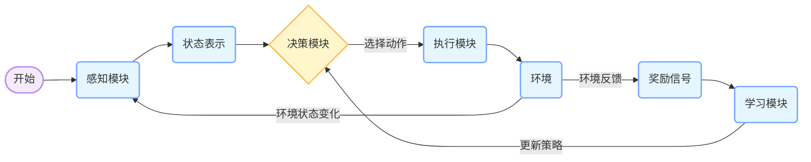

# 构建具有对抗学习能力的AI Agent

> 关键词：AI Agent、对抗学习、强化学习、博弈论、策略优化、智能体交互、深度神经网络

> 摘要：本文围绕构建具有对抗学习能力的AI Agent展开，深入探讨了其核心概念、算法原理、数学模型以及实际应用场景等方面。首先介绍了构建具有对抗学习能力的AI Agent的背景和相关术语，接着阐述了核心概念与联系，包括对抗学习的原理和架构。通过Python源代码详细讲解了核心算法原理和具体操作步骤，同时给出了相应的数学模型和公式并举例说明。在项目实战部分，提供了开发环境搭建、源代码实现和代码解读。最后探讨了实际应用场景、推荐了相关工具和资源，总结了未来发展趋势与挑战，并对常见问题进行了解答，为读者全面深入地了解和构建具有对抗学习能力的AI Agent提供了系统的指导。

## 1. 背景介绍 
### 1.1 目的和范围
在人工智能领域，构建具有对抗学习能力的AI Agent具有重要的意义。其目的在于使智能体能够在复杂的对抗环境中学习和优化策略，以实现更好的性能和适应性。范围涵盖了从理论基础的研究，如博弈论、强化学习等，到实际应用场景的开发，如游戏、机器人竞赛、网络安全等。通过本研究，旨在为相关领域的研究人员和开发者提供全面的技术指导，促进具有对抗学习能力的AI Agent的发展和应用。

### 1.2 预期读者
本文预期读者包括人工智能领域的研究人员、开发者、学生以及对AI Agent和对抗学习感兴趣的技术爱好者。研究人员可以从本文中获取最新的研究思路和方法，开发者可以借鉴实际的代码实现和开发经验，学生可以通过本文系统地学习相关知识，技术爱好者可以了解该领域的基本概念和应用场景。

### 1.3 文档结构概述
本文首先介绍背景知识，包括目的、预期读者和文档结构概述等。接着阐述核心概念与联系，包括对抗学习的原理和架构。然后详细讲解核心算法原理和具体操作步骤，通过Python代码进行示例。随后给出数学模型和公式，并举例说明。在项目实战部分，介绍开发环境搭建、源代码实现和代码解读。之后探讨实际应用场景，推荐相关工具和资源。最后总结未来发展趋势与挑战，解答常见问题，并提供扩展阅读和参考资料。

### 1.4 术语表
#### 1.4.1 核心术语定义
- **AI Agent（人工智能智能体）**：是一种能够感知环境、进行决策并采取行动的智能实体，通过与环境的交互来实现特定的目标。
- **对抗学习**：指智能体在竞争或对抗的环境中，通过与对手的交互和博弈来学习和优化自身策略的过程。
- **强化学习**：是一种机器学习方法，智能体通过在环境中执行动作并根据环境反馈的奖励信号来学习最优策略。
- **博弈论**：研究决策主体在相互对抗或合作情况下的策略选择和均衡问题的理论。
- **策略**：智能体在不同状态下选择动作的规则或方法。

#### 1.4.2 相关概念解释
- **状态（State）**：表示环境在某一时刻的特征或情况，智能体根据当前状态来选择动作。
- **动作（Action）**：智能体在环境中可以执行的操作，不同的动作会导致环境状态的变化。
- **奖励（Reward）**：环境给予智能体的反馈信号，用于评估智能体动作的好坏，智能体的目标是最大化长期累积奖励。
- **对手（Opponent）**：在对抗学习中，与智能体进行竞争或博弈的其他智能体或实体。

#### 1.4.3 缩略词列表
- **DQN（Deep Q-Network）**：深度Q网络，一种基于深度神经网络的强化学习算法。
- **A2C（Advantage Actor-Critic）**：优势演员-评论家算法，结合了策略梯度和价值函数估计的强化学习算法。
- **GAN（Generative Adversarial Network）**：生成对抗网络，一种用于生成数据的对抗学习模型。

## 2. 核心概念与联系 
### 2.1 对抗学习的原理
对抗学习的核心思想是通过智能体之间的对抗和竞争来促进学习和进化。在对抗环境中，每个智能体都试图最大化自己的利益或目标，同时考虑对手的策略。智能体通过与对手的交互，不断观察环境状态和对手的动作，根据反馈的奖励信号来调整自己的策略。这种竞争和交互的过程使得智能体能够学习到更强大的策略，以应对不同的对手和环境变化。

### 2.2 架构的文本示意图
一个典型的具有对抗学习能力的AI Agent架构包括感知模块、决策模块和执行模块。感知模块负责获取环境信息和对手的动作，将其转化为智能体可以理解的状态表示。决策模块根据当前状态和学习到的策略，选择合适的动作。执行模块将决策模块选择的动作执行到环境中，并接收环境的反馈。同时，智能体还包括学习模块，用于根据环境反馈的奖励信号来更新和优化策略。

### 2.3 Mermaid流程图


## 3. 核心算法原理 & 具体操作步骤 
### 3.1 基于强化学习的对抗学习算法原理
在基于强化学习的对抗学习中，智能体的目标是最大化长期累积奖励。以深度Q网络（DQN）为例，其基本原理是使用深度神经网络来近似Q值函数。Q值函数表示在某个状态下执行某个动作的预期累积奖励。智能体通过不断地与环境交互，收集状态、动作、奖励和下一个状态的样本，将这些样本存储在经验回放缓冲区中。然后从经验回放缓冲区中随机采样一批样本，用于训练深度神经网络，更新Q值函数的参数，从而优化智能体的策略。

### 3.2 Python源代码详细阐述
```python
import numpy as np
import torch
import torch.nn as nn
import torch.optim as optim
import random
from collections import deque

# 定义深度Q网络
class DQN(nn.Module):
    def __init__(self, input_dim, output_dim):
        super(DQN, self).__init__()
        self.fc1 = nn.Linear(input_dim, 64)
        self.fc2 = nn.Linear(64, 64)
        self.fc3 = nn.Linear(64, output_dim)

    def forward(self, x):
        x = torch.relu(self.fc1(x))
        x = torch.relu(self.fc2(x))
        x = self.fc3(x)
        return x

# 定义智能体类
class Agent:
    def __init__(self, input_dim, output_dim, learning_rate=0.001, gamma=0.99, epsilon=1.0, epsilon_decay=0.995, epsilon_min=0.01, batch_size=64, memory_size=10000):
        self.input_dim = input_dim
        self.output_dim = output_dim
        self.learning_rate = learning_rate
        self.gamma = gamma
        self.epsilon = epsilon
        self.epsilon_decay = epsilon_decay
        self.epsilon_min = epsilon_min
        self.batch_size = batch_size
        self.memory = deque(maxlen=memory_size)

        self.model = DQN(input_dim, output_dim)
        self.optimizer = optim.Adam(self.model.parameters(), lr=learning_rate)
        self.criterion = nn.MSELoss()

    def remember(self, state, action, reward, next_state, done):
        self.memory.append((state, action, reward, next_state, done))

    def act(self, state):
        if np.random.rand() <= self.epsilon:
            return random.randrange(self.output_dim)
        state = torch.FloatTensor(state).unsqueeze(0)
        q_values = self.model(state)
        action = torch.argmax(q_values).item()
        return action

    def replay(self):
        if len(self.memory) < self.batch_size:
            return
        minibatch = random.sample(self.memory, self.batch_size)
        states, actions, rewards, next_states, dones = zip(*minibatch)

        states = torch.FloatTensor(states)
        actions = torch.LongTensor(actions)
        rewards = torch.FloatTensor(rewards)
        next_states = torch.FloatTensor(next_states)
        dones = torch.FloatTensor(dones)

        q_values = self.model(states)
        q_values = q_values.gather(1, actions.unsqueeze(1)).squeeze(1)

        next_q_values = self.model(next_states)
        next_q_values = next_q_values.max(1)[0]
        target_q_values = rewards + (1 - dones) * self.gamma * next_q_values

        loss = self.criterion(q_values, target_q_values)
        self.optimizer.zero_grad()
        loss.backward()
        self.optimizer.step()

        if self.epsilon > self.epsilon_min:
            self.epsilon *= self.epsilon_decay
```

### 3.3 具体操作步骤
1. **初始化智能体**：创建一个Agent对象，设置输入维度、输出维度、学习率、折扣因子、探索率等参数。
2. **环境交互**：在每个时间步，智能体通过感知模块获取当前环境状态，使用`act`方法选择动作，将动作执行到环境中，获取环境反馈的奖励和下一个状态。
3. **经验回放**：将状态、动作、奖励、下一个状态和是否结束的信息存储在经验回放缓冲区中。当经验回放缓冲区中的样本数量达到一定数量时，使用`replay`方法进行经验回放，训练深度神经网络，更新Q值函数的参数。
4. **重复步骤2和3**：不断重复环境交互和经验回放的过程，直到达到训练的终止条件。

## 4. 数学模型和公式 & 详细讲解 & 举例说明 
### 4.1 Q值函数的定义
在强化学习中，Q值函数 $Q(s, a)$ 表示在状态 $s$ 下执行动作 $a$ 的预期累积奖励。其数学定义为：
$$Q(s, a) = \mathbb{E}\left[\sum_{t=0}^{\infty} \gamma^t r_{t+1} \mid s_0 = s, a_0 = a\right]$$
其中，$\gamma$ 是折扣因子，取值范围为 $[0, 1]$，用于权衡当前奖励和未来奖励的重要性；$r_{t+1}$ 是在时间步 $t+1$ 时获得的奖励。

### 4.2 深度Q网络的目标函数
深度Q网络的目标是最小化预测的Q值和目标Q值之间的均方误差。目标Q值的计算公式为：
$$y_j = r_j + \gamma \max_{a'} Q(s_{j+1}, a'; \theta^{-})$$
其中，$r_j$ 是在时间步 $j$ 时获得的奖励，$s_{j+1}$ 是下一个状态，$\theta^{-}$ 是目标网络的参数。

深度Q网络的目标函数为：
$$L(\theta) = \mathbb{E}\left[(y_j - Q(s_j, a_j; \theta))^2\right]$$
其中，$\theta$ 是当前网络的参数。

### 4.3 举例说明
假设一个简单的环境，状态空间为 $\{s_1, s_2\}$，动作空间为 $\{a_1, a_2\}$。折扣因子 $\gamma = 0.9$。在某个时间步，智能体处于状态 $s_1$，执行动作 $a_1$，获得奖励 $r = 1$，并转移到状态 $s_2$。当前网络预测的 $Q(s_1, a_1; \theta) = 0.5$，目标网络预测的 $\max_{a'} Q(s_2, a'; \theta^{-}) = 0.8$。则目标Q值为：
$$y = r + \gamma \max_{a'} Q(s_2, a'; \theta^{-}) = 1 + 0.9 \times 0.8 = 1.72$$
目标函数的值为：
$$L(\theta) = (y - Q(s_1, a_1; \theta))^2 = (1.72 - 0.5)^2 = 1.4884$$

## 5. 项目实战：代码实际案例和详细解释说明 
### 5.1  开发环境搭建
#### 5.1.1 安装Python
首先需要安装Python，建议使用Python 3.6及以上版本。可以从Python官方网站（https://www.python.org/downloads/）下载并安装。

#### 5.1.2 安装依赖库
使用以下命令安装项目所需的依赖库：
```bash
pip install numpy torch
```

### 5.2  源代码详细实现和代码解读
```python
import numpy as np
import torch
import torch.nn as nn
import torch.optim as optim
import random
from collections import deque

# 定义深度Q网络
class DQN(nn.Module):
    def __init__(self, input_dim, output_dim):
        super(DQN, self).__init__()
        self.fc1 = nn.Linear(input_dim, 64)
        self.fc2 = nn.Linear(64, 64)
        self.fc3 = nn.Linear(64, output_dim)

    def forward(self, x):
        x = torch.relu(self.fc1(x))
        x = torch.relu(self.fc2(x))
        x = self.fc3(x)
        return x

# 定义智能体类
class Agent:
    def __init__(self, input_dim, output_dim, learning_rate=0.001, gamma=0.99, epsilon=1.0, epsilon_decay=0.995, epsilon_min=0.01, batch_size=64, memory_size=10000):
        self.input_dim = input_dim
        self.output_dim = output_dim
        self.learning_rate = learning_rate
        self.gamma = gamma
        self.epsilon = epsilon
        self.epsilon_decay = epsilon_decay
        self.epsilon_min = epsilon_min
        self.batch_size = batch_size
        self.memory = deque(maxlen=memory_size)

        self.model = DQN(input_dim, output_dim)
        self.optimizer = optim.Adam(self.model.parameters(), lr=learning_rate)
        self.criterion = nn.MSELoss()

    def remember(self, state, action, reward, next_state, done):
        self.memory.append((state, action, reward, next_state, done))

    def act(self, state):
        if np.random.rand() <= self.epsilon:
            return random.randrange(self.output_dim)
        state = torch.FloatTensor(state).unsqueeze(0)
        q_values = self.model(state)
        action = torch.argmax(q_values).item()
        return action

    def replay(self):
        if len(self.memory) < self.batch_size:
            return
        minibatch = random.sample(self.memory, self.batch_size)
        states, actions, rewards, next_states, dones = zip(*minibatch)

        states = torch.FloatTensor(states)
        actions = torch.LongTensor(actions)
        rewards = torch.FloatTensor(rewards)
        next_states = torch.FloatTensor(next_states)
        dones = torch.FloatTensor(dones)

        q_values = self.model(states)
        q_values = q_values.gather(1, actions.unsqueeze(1)).squeeze(1)

        next_q_values = self.model(next_states)
        next_q_values = next_q_values.max(1)[0]
        target_q_values = rewards + (1 - dones) * self.gamma * next_q_values

        loss = self.criterion(q_values, target_q_values)
        self.optimizer.zero_grad()
        loss.backward()
        self.optimizer.step()

        if self.epsilon > self.epsilon_min:
            self.epsilon *= self.epsilon_decay

# 定义简单的环境
class SimpleEnv:
    def __init__(self):
        self.state = np.array([0])
        self.done = False

    def reset(self):
        self.state = np.array([0])
        self.done = False
        return self.state

    def step(self, action):
        if action == 0:
            self.state = np.array([1])
            reward = 1
        else:
            self.state = np.array([0])
            reward = -1
        self.done = True
        return self.state, reward, self.done, {}

# 训练智能体
if __name__ == "__main__":
    env = SimpleEnv()
    input_dim = env.reset().shape[0]
    output_dim = 2
    agent = Agent(input_dim, output_dim)

    episodes = 1000
    for episode in range(episodes):
        state = env.reset()
        total_reward = 0
        while True:
            action = agent.act(state)
            next_state, reward, done, _ = env.step(action)
            agent.remember(state, action, reward, next_state, done)
            agent.replay()
            state = next_state
            total_reward += reward
            if done:
                break
        print(f"Episode {episode}: Total Reward = {total_reward}")
```

### 5.3  代码解读与分析
#### 5.3.1 深度Q网络（DQN）类
`DQN` 类继承自 `nn.Module`，定义了一个三层全连接神经网络。输入层的维度为 `input_dim`，输出层的维度为 `output_dim`。中间层使用ReLU激活函数。

#### 5.3.2 智能体类（Agent）
`Agent` 类包含了智能体的主要功能，包括经验回放、动作选择和策略更新。
- `__init__` 方法：初始化智能体的参数，包括学习率、折扣因子、探索率等，创建深度Q网络、优化器和损失函数。
- `remember` 方法：将状态、动作、奖励、下一个状态和是否结束的信息存储在经验回放缓冲区中。
- `act` 方法：根据当前状态选择动作，以一定的概率进行随机探索，否则选择Q值最大的动作。
- `replay` 方法：从经验回放缓冲区中随机采样一批样本，计算目标Q值和预测Q值之间的均方误差，使用反向传播算法更新深度Q网络的参数。

#### 5.3.3 简单环境类（SimpleEnv）
`SimpleEnv` 类定义了一个简单的环境，包含状态、重置方法和步长方法。在这个环境中，智能体有两个动作可以选择，不同的动作会导致不同的奖励和状态转移。

#### 5.3.4 训练过程
在主程序中，创建了一个简单的环境和一个智能体，进行1000个回合的训练。在每个回合中，智能体与环境进行交互，选择动作，获取奖励和下一个状态，将经验存储在经验回放缓冲区中，并进行经验回放更新策略。最后打印每个回合的总奖励。

## 6. 实际应用场景 
### 6.1 游戏领域
在游戏领域，具有对抗学习能力的AI Agent可以用于开发智能游戏对手。例如，在棋类游戏中，AI Agent可以通过与人类玩家或其他AI Agent进行对抗学习，不断提高自己的棋艺水平。在电子竞技游戏中，AI Agent可以作为训练伙伴，帮助玩家提高游戏技能，也可以作为比赛中的对手，提供更具挑战性的游戏体验。

### 6.2 机器人竞赛
在机器人竞赛中，具有对抗学习能力的AI Agent可以控制机器人的行为，使其在竞赛中表现出更智能的策略。例如，在机器人足球比赛中，AI Agent可以根据对手的位置和动作，选择合适的进攻和防守策略，提高机器人队伍的获胜概率。

### 6.3 网络安全
在网络安全领域，具有对抗学习能力的AI Agent可以用于检测和防范网络攻击。例如，AI Agent可以学习攻击者的行为模式，通过与模拟攻击者进行对抗学习，不断优化自己的防御策略，提高网络系统的安全性。

### 6.4 金融领域
在金融领域，具有对抗学习能力的AI Agent可以用于投资决策和风险管理。例如，AI Agent可以学习市场的变化和其他投资者的策略，通过与其他AI Agent进行对抗学习，优化自己的投资策略，提高投资收益。

## 7. 工具和资源推荐
### 7.1 学习资源推荐
#### 7.1.1 书籍推荐
- 《Reinforcement Learning: An Introduction》（《强化学习：原理与Python实现》）：这本书是强化学习领域的经典教材，详细介绍了强化学习的基本概念、算法和应用。
- 《Deep Learning》（《深度学习》）：这本书介绍了深度学习的基本原理和方法，对于理解深度Q网络等基于深度学习的对抗学习算法有很大的帮助。
- 《Game Theory》（《博弈论》）：这本书系统地介绍了博弈论的基本概念、模型和应用，对于理解对抗学习中的策略选择和均衡问题有重要的参考价值。

#### 7.1.2 在线课程
- Coursera上的“Reinforcement Learning Specialization”：这是一个由多门课程组成的强化学习专项课程，涵盖了强化学习的基本理论、算法和实践应用。
- edX上的“Deep Learning Fundamentals”：这门课程介绍了深度学习的基本原理和方法，包括神经网络、卷积神经网络、循环神经网络等。
- Udemy上的“Game Theory for Beginners”：这门课程适合初学者，介绍了博弈论的基本概念和应用。

#### 7.1.3 技术博客和网站
- OpenAI Blog（https://openai.com/blog/）：OpenAI发布的最新研究成果和技术文章，对于了解人工智能领域的前沿动态有很大的帮助。
- Medium上的“Towards Data Science”（https://towardsdatascience.com/）：这是一个专注于数据科学和人工智能领域的技术博客，有很多关于强化学习和对抗学习的优秀文章。
- arXiv（https://arxiv.org/）：这是一个预印本服务器，提供了大量的学术论文，包括人工智能领域的最新研究成果。

### 7.2 开发工具框架推荐
#### 7.2.1 IDE和编辑器
- PyCharm：这是一个专业的Python集成开发环境，提供了丰富的功能和工具，如代码编辑、调试、版本控制等，非常适合开发Python项目。
- Visual Studio Code：这是一个轻量级的代码编辑器，支持多种编程语言，通过安装Python扩展可以实现Python代码的开发和调试。

#### 7.2.2 调试和性能分析工具
- TensorBoard：这是一个用于可视化深度学习模型训练过程的工具，可以实时监控模型的损失函数、准确率等指标，帮助开发者调试和优化模型。
- PyTorch Profiler：这是PyTorch提供的性能分析工具，可以帮助开发者分析模型的性能瓶颈，优化代码的运行效率。

#### 7.2.3 相关框架和库
- PyTorch：这是一个开源的深度学习框架，提供了丰富的深度学习模型和算法，支持GPU加速，非常适合开发基于深度学习的对抗学习算法。
- OpenAI Gym：这是一个开源的强化学习环境库，提供了多种经典的强化学习环境，方便开发者进行算法的测试和验证。
- Stable Baselines3：这是一个基于PyTorch的强化学习库，提供了多种预训练的强化学习算法，方便开发者快速实现强化学习任务。

### 7.3 相关论文著作推荐
#### 7.3.1 经典论文
- “Playing Atari with Deep Reinforcement Learning”：这篇论文提出了深度Q网络（DQN）算法，是强化学习领域的经典之作，为后来的基于深度学习的强化学习算法奠定了基础。
- “Generative Adversarial Networks”：这篇论文提出了生成对抗网络（GAN），开创了对抗学习的新领域，在图像生成、数据增强等领域有广泛的应用。
- “Mastering the Game of Go without Human Knowledge”：这篇论文介绍了AlphaGo Zero，展示了通过纯粹的自我对弈进行对抗学习的强大能力，在棋类游戏领域取得了重大突破。

#### 7.3.2 最新研究成果
- 关注NeurIPS、ICML、AAAI等顶级人工智能会议的最新论文，这些会议收录了人工智能领域的最新研究成果，包括对抗学习方面的前沿技术和算法。
- 关注顶级学术期刊，如Journal of Artificial Intelligence Research（JAIR）、Artificial Intelligence等，这些期刊发表了人工智能领域的高质量研究论文。

#### 7.3.3 应用案例分析
- 研究一些实际应用中的对抗学习案例，如Google DeepMind在游戏、机器人等领域的应用案例，分析其技术实现和应用效果，从中获取灵感和经验。

## 8. 总结：未来发展趋势与挑战
### 8.1 未来发展趋势
#### 8.1.1 多智能体系统的发展
未来，具有对抗学习能力的AI Agent将更多地应用于多智能体系统中。多个智能体之间的协作和竞争将变得更加复杂和多样化，需要研究更有效的多智能体对抗学习算法，以实现智能体之间的协调和优化。

#### 8.1.2 与其他技术的融合
对抗学习将与其他技术，如深度学习、计算机视觉、自然语言处理等进行更深入的融合。例如，在计算机视觉领域，对抗学习可以用于图像生成、图像增强和目标检测等任务；在自然语言处理领域，对抗学习可以用于文本生成、机器翻译和情感分析等任务。

#### 8.1.3 实际应用的拓展
具有对抗学习能力的AI Agent将在更多的实际应用场景中得到应用，如自动驾驶、医疗保健、工业自动化等。这些应用场景对智能体的性能和安全性提出了更高的要求，需要研究更可靠、更高效的对抗学习算法。

### 8.2 挑战
#### 8.2.1 算法的可解释性
目前的对抗学习算法大多基于深度学习，模型的复杂度较高，缺乏可解释性。在一些关键应用场景中，如医疗诊断、自动驾驶等，需要对智能体的决策过程进行解释，以确保其安全性和可靠性。

#### 8.2.2 数据的获取和处理
对抗学习需要大量的数据进行训练，数据的获取和处理是一个挑战。在一些实际应用场景中，数据可能受到隐私、安全等因素的限制，难以获取足够的高质量数据。同时，如何对数据进行有效的预处理和增强，也是需要解决的问题。

#### 8.2.3 智能体的适应性和泛化能力
在不同的环境和对手下，智能体需要具备良好的适应性和泛化能力。目前的对抗学习算法在这方面还存在不足，需要研究更有效的算法来提高智能体的适应性和泛化能力。

## 9. 附录：常见问题与解答
### 9.1 对抗学习和强化学习有什么关系？
对抗学习是强化学习的一种特殊形式，强化学习主要关注智能体在环境中的学习和优化，而对抗学习强调智能体在对抗环境中与对手的交互和博弈。对抗学习可以利用强化学习的算法和技术来实现智能体的策略优化。

### 9.2 如何选择合适的对抗学习算法？
选择合适的对抗学习算法需要考虑多个因素，如问题的复杂度、数据的可用性、计算资源等。对于简单的问题，可以选择基于传统强化学习的算法，如DQN、A2C等；对于复杂的问题，可以考虑使用更高级的算法，如生成对抗网络（GAN）、策略梯度算法等。同时，还可以参考相关的研究论文和开源代码，了解不同算法的优缺点和适用场景。

### 9.3 对抗学习在实际应用中存在哪些问题？
对抗学习在实际应用中存在一些问题，如算法的可解释性、数据的获取和处理、智能体的适应性和泛化能力等。这些问题需要进一步的研究和解决，以提高对抗学习算法的性能和可靠性。

### 9.4 如何提高对抗学习智能体的性能？
可以从多个方面提高对抗学习智能体的性能，如优化算法的参数、增加训练数据、改进模型结构、采用多智能体协作等。同时，还可以通过不断的实验和调优，找到最适合具体问题的方法和策略。

## 10. 扩展阅读 & 参考资料
### 10.1 扩展阅读
- 《Adversarial Machine Learning》（《对抗机器学习》）：这本书系统地介绍了对抗机器学习的基本概念、算法和应用，对于深入了解对抗学习有很大的帮助。
- 《Multi-Agent Systems: Algorithmic, Game-Theoretic, and Logical Foundations》（《多智能体系统：算法、博弈论和逻辑基础》）：这本书介绍了多智能体系统的基本理论和方法，对于研究多智能体对抗学习有重要的参考价值。

### 10.2 参考资料
- 相关的学术论文和研究报告，如NeurIPS、ICML、AAAI等会议的论文，以及顶级学术期刊的文章。
- 开源代码和项目，如OpenAI Gym、Stable Baselines3等，这些资源可以帮助读者更好地理解和实现对抗学习算法。
- 官方文档和教程，如PyTorch、TensorFlow等深度学习框架的官方文档，提供了详细的使用说明和示例代码。