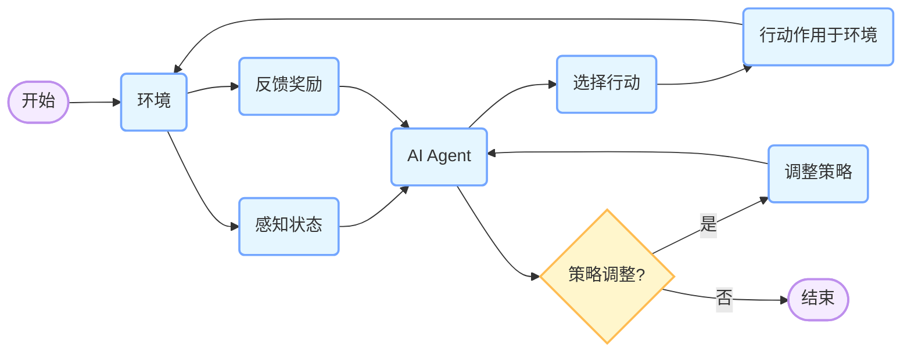

# 构建具有自主学习与探索能力的AI Agent

> 关键词：AI Agent、自主学习、探索能力、强化学习、智能体、环境交互、认知模型

> 摘要：本文围绕构建具有自主学习与探索能力的AI Agent展开，深入探讨其核心概念、算法原理、数学模型等内容。首先介绍了相关背景知识，包括目的范围、预期读者等。接着阐述了AI Agent的核心概念及联系，通过文本示意图和Mermaid流程图进行清晰展示。详细讲解了核心算法原理，并用Python代码进行了具体实现。给出了相应的数学模型和公式，并举例说明。在项目实战部分，通过实际案例详细展示了开发环境搭建、源代码实现与解读。分析了AI Agent的实际应用场景，推荐了学习、开发相关的工具和资源，最后对未来发展趋势与挑战进行总结，并提供常见问题解答和扩展阅读参考资料，旨在为开发者和研究者提供全面深入的技术指导。

## 1. 背景介绍 
### 1.1 目的和范围
随着人工智能技术的不断发展，构建具有自主学习与探索能力的AI Agent成为研究的热点之一。其目的在于让AI Agent能够在复杂、动态且不确定的环境中，不依赖过多的人工干预，自主地进行学习和探索，从而更好地完成各种任务，如机器人导航、游戏策略制定、智能客服等。本文的范围涵盖了AI Agent的核心概念、算法原理、数学模型、项目实战、应用场景等多个方面，旨在全面介绍如何构建这样的智能体。

### 1.2 预期读者
本文预期读者包括人工智能领域的研究者、开发者、学生以及对AI Agent技术感兴趣的技术爱好者。对于研究者，本文可以为其深入研究提供理论和实践参考；对于开发者，有助于他们掌握构建具有自主学习与探索能力的AI Agent的技术和方法；对于学生，可以作为学习人工智能相关知识的拓展资料；对于技术爱好者，能帮助他们了解该领域的前沿技术。

### 1.3 文档结构概述
本文首先介绍背景知识，包括目的范围、预期读者等。然后阐述AI Agent的核心概念及联系，通过文本示意图和Mermaid流程图展示其原理和架构。接着详细讲解核心算法原理，并用Python代码进行实现。给出相应的数学模型和公式，并举例说明。在项目实战部分，通过实际案例展示开发环境搭建、源代码实现与解读。分析AI Agent的实际应用场景，推荐学习、开发相关的工具和资源。最后对未来发展趋势与挑战进行总结，并提供常见问题解答和扩展阅读参考资料。

### 1.4 术语表
#### 1.4.1 核心术语定义
- **AI Agent（人工智能智能体）**：是一种能够感知环境、进行决策并采取行动以实现特定目标的人工智能实体。
- **自主学习**：指智能体在没有明确的外部指导或监督的情况下，通过与环境的交互自动获取知识和技能的过程。
- **探索能力**：智能体在环境中主动尝试不同的行为，以发现新的信息和潜在的最优策略的能力。
- **强化学习**：一种机器学习范式，智能体通过与环境进行交互，根据环境反馈的奖励信号来学习最优策略。

#### 1.4.2 相关概念解释
- **环境**：智能体所处的外部世界，它可以是物理世界（如机器人所处的现实环境），也可以是虚拟世界（如游戏环境）。智能体通过感知环境状态来做出决策。
- **状态**：描述环境在某一时刻的特征和情况的信息集合。智能体根据当前状态选择合适的行动。
- **行动**：智能体在环境中可以采取的具体操作。不同的行动会导致环境状态的改变。
- **奖励**：环境对智能体采取的行动的反馈信号，用于评估行动的好坏。智能体的目标是最大化长期累积奖励。

#### 1.4.3 缩略词列表
- **RL**：Reinforcement Learning，强化学习
- **Q - learning**：一种基于值函数的强化学习算法

## 2. 核心概念与联系 
AI Agent的核心概念主要围绕智能体、环境、状态、行动和奖励等要素展开。智能体作为主体，通过感知环境获取状态信息，然后根据一定的策略选择行动，行动作用于环境后，环境会反馈奖励信号给智能体，智能体根据奖励信号来调整自己的策略，从而实现自主学习和探索。

### 文本示意图
```plaintext
               +----------------+
               |     环境       |
               +----------------+
                      ^  |
                      |  v
            感知状态 |  | 行动
                      |  v
               +----------------+
               |    AI Agent    |
               +----------------+
                      ^
                      |
                 奖励反馈
```

### Mermaid流程图


在这个流程中，AI Agent不断地与环境进行交互，通过感知状态、选择行动、接收奖励反馈，逐渐学习到最优的行为策略。感知状态是智能体了解环境当前情况的过程，基于这些状态信息，智能体依据内部的策略选择合适的行动。行动作用于环境后，环境会产生新的状态和相应的奖励。奖励信号是智能体学习的关键，它反映了智能体行动的好坏。如果奖励不理想，智能体就需要调整自己的策略，以期望在未来获得更好的奖励。

## 3. 核心算法原理 & 具体操作步骤 
强化学习是构建具有自主学习与探索能力的AI Agent的常用算法框架。下面以Q - learning算法为例，详细讲解其原理和具体操作步骤，并使用Python代码进行实现。

### Q - learning算法原理
Q - learning是一种基于值函数的无模型强化学习算法，其核心思想是学习一个Q值函数 $Q(s, a)$，表示在状态 $s$ 下采取行动 $a$ 的期望累积奖励。智能体的目标是通过不断地与环境交互，更新Q值函数，使得最终能够选择出在每个状态下能获得最大累积奖励的行动。

Q值函数的更新公式为：
$$Q(s_t, a_t) \leftarrow Q(s_t, a_t) + \alpha \left[ r_{t+1} + \gamma \max_{a} Q(s_{t+1}, a) - Q(s_t, a_t) \right]$$
其中：
- $s_t$ 是当前状态
- $a_t$ 是当前采取的行动
- $r_{t+1}$ 是执行行动 $a_t$ 后环境反馈的奖励
- $s_{t+1}$ 是执行行动 $a_t$ 后环境的下一个状态
- $\alpha$ 是学习率，控制Q值更新的步长
- $\gamma$ 是折扣因子，用于权衡当前奖励和未来奖励的重要性

### 具体操作步骤
1. **初始化**：初始化Q值函数 $Q(s, a)$ 为随机值或全零值。
2. **循环交互**：
    - 在每个时间步 $t$：
        - 智能体根据当前状态 $s_t$ 和Q值函数选择行动 $a_t$（可以使用 $\epsilon$-贪心策略）。
        - 执行行动 $a_t$，环境反馈奖励 $r_{t+1}$ 并转移到下一个状态 $s_{t+1}$。
        - 根据Q值更新公式更新 $Q(s_t, a_t)$。
    - 重复上述步骤，直到达到终止条件（如达到最大时间步数或任务完成）。

### Python源代码实现
```python
import numpy as np

class QLearningAgent:
    def __init__(self, state_space_size, action_space_size, learning_rate=0.1, discount_factor=0.9, epsilon=0.1):
        # 初始化Q表
        self.Q = np.zeros((state_space_size, action_space_size))
        self.learning_rate = learning_rate
        self.discount_factor = discount_factor
        self.epsilon = epsilon

    def choose_action(self, state):
        # 使用epsilon - 贪心策略选择行动
        if np.random.uniform(0, 1) < self.epsilon:
            # 探索：随机选择一个行动
            action = np.random.choice(self.Q.shape[1])
        else:
            # 利用：选择Q值最大的行动
            action = np.argmax(self.Q[state, :])
        return action

    def update(self, state, action, reward, next_state):
        # 根据Q值更新公式更新Q表
        max_q_next = np.max(self.Q[next_state, :])
        self.Q[state, action] += self.learning_rate * (reward + self.discount_factor * max_q_next - self.Q[state, action])
```

### 代码解释
- `__init__` 方法：初始化Q表，Q表是一个二维数组，行数为状态空间的大小，列数为行动空间的大小。同时初始化学习率、折扣因子和探索率 $\epsilon$。
- `choose_action` 方法：根据 $\epsilon$-贪心策略选择行动。以 $\epsilon$ 的概率随机选择一个行动进行探索，以 $1 - \epsilon$ 的概率选择Q值最大的行动进行利用。
- `update` 方法：根据Q值更新公式更新Q表。首先计算下一个状态的最大Q值，然后根据公式更新当前状态和行动的Q值。

## 4. 数学模型和公式 & 详细讲解 & 举例说明 
### 马尔可夫决策过程（MDP）
马尔可夫决策过程是强化学习的理论基础，它是一个五元组 $(S, A, P, R, \gamma)$，其中：
- $S$ 是状态空间，表示环境所有可能的状态集合。
- $A$ 是行动空间，表示智能体所有可能的行动集合。
- $P(s_{t+1} | s_t, a_t)$ 是状态转移概率，表示在状态 $s_t$ 下采取行动 $a_t$ 后转移到状态 $s_{t+1}$ 的概率。
- $R(s_t, a_t, s_{t+1})$ 是奖励函数，表示在状态 $s_t$ 下采取行动 $a_t$ 转移到状态 $s_{t+1}$ 时获得的奖励。
- $\gamma$ 是折扣因子，$0 \leq \gamma \leq 1$，用于权衡当前奖励和未来奖励的重要性。

### 值函数
#### 状态值函数 $V^\pi(s)$
状态值函数 $V^\pi(s)$ 表示在策略 $\pi$ 下，从状态 $s$ 开始的期望累积奖励：
$$V^\pi(s) = \mathbb{E}_\pi \left[ \sum_{t=0}^{\infty} \gamma^t r_{t+1} | s_0 = s \right]$$
其中，$\mathbb{E}_\pi$ 表示在策略 $\pi$ 下的期望。

#### 动作值函数 $Q^\pi(s, a)$
动作值函数 $Q^\pi(s, a)$ 表示在策略 $\pi$ 下，从状态 $s$ 采取行动 $a$ 开始的期望累积奖励：
$$Q^\pi(s, a) = \mathbb{E}_\pi \left[ \sum_{t=0}^{\infty} \gamma^t r_{t+1} | s_0 = s, a_0 = a \right]$$

### 最优值函数和最优策略
最优状态值函数 $V^*(s)$ 和最优动作值函数 $Q^*(s, a)$ 分别定义为：
$$V^*(s) = \max_\pi V^\pi(s)$$
$$Q^*(s, a) = \max_\pi Q^\pi(s, a)$$
最优策略 $\pi^*$ 是使得 $V^\pi(s)$ 或 $Q^\pi(s, a)$ 达到最大值的策略。

### 举例说明
假设有一个简单的网格世界环境，智能体在一个 $3 \times 3$ 的网格中移动，目标是从起点 $(0, 0)$ 到达终点 $(2, 2)$。智能体可以采取的行动有上、下、左、右四个方向。状态可以用网格的坐标 $(x, y)$ 表示，行动空间 $A = \{ \text{up}, \text{down}, \text{left}, \text{right} \}$。

当智能体从状态 $(0, 0)$ 采取行动 $\text{right}$ 到达状态 $(0, 1)$ 时，如果到达终点则奖励为 $10$，否则奖励为 $-1$。假设学习率 $\alpha = 0.1$，折扣因子 $\gamma = 0.9$。

初始时，$Q((0, 0), \text{right}) = 0$。智能体执行行动后，环境反馈奖励 $r = -1$，下一个状态为 $(0, 1)$。假设 $Q((0, 1), \text{right}) = 0$（初始值），则根据Q值更新公式：
$$Q((0, 0), \text{right}) \leftarrow 0 + 0.1 \left[ -1 + 0.9 \times 0 - 0 \right] = -0.1$$

## 5. 项目实战：代码实际案例和详细解释说明 
### 5.1  开发环境搭建
#### 安装Python
首先需要安装Python，建议使用Python 3.7及以上版本。可以从Python官方网站（https://www.python.org/downloads/） 下载对应操作系统的安装包，按照安装向导进行安装。

#### 安装必要的库
在本项目中，我们需要使用 `numpy` 库进行数值计算。可以使用以下命令进行安装：
```sh
pip install numpy
```

### 5.2  源代码详细实现和代码解读
以下是一个简单的网格世界环境的实现，结合前面的Q - learning智能体，展示如何构建一个具有自主学习与探索能力的AI Agent。

```python
import numpy as np

# 定义网格世界环境
class GridWorld:
    def __init__(self, grid_size=3):
        self.grid_size = grid_size
        self.start_state = (0, 0)
        self.goal_state = (grid_size - 1, grid_size - 1)
        self.current_state = self.start_state
        self.actions = [(0, 1), (0, -1), (1, 0), (-1, 0)]  # 右，左，下，上

    def reset(self):
        # 重置环境到初始状态
        self.current_state = self.start_state
        return self.current_state

    def step(self, action):
        # 执行行动
        new_x = self.current_state[0] + self.actions[action][0]
        new_y = self.current_state[1] + self.actions[action][1]

        # 检查是否越界
        if new_x < 0 or new_x >= self.grid_size or new_y < 0 or new_y >= self.grid_size:
            new_x, new_y = self.current_state

        self.current_state = (new_x, new_y)

        # 计算奖励
        if self.current_state == self.goal_state:
            reward = 10
            done = True
        else:
            reward = -1
            done = False

        return self.current_state, reward, done

# 定义Q - learning智能体
class QLearningAgent:
    def __init__(self, state_space_size, action_space_size, learning_rate=0.1, discount_factor=0.9, epsilon=0.1):
        self.Q = np.zeros((state_space_size, action_space_size))
        self.learning_rate = learning_rate
        self.discount_factor = discount_factor
        self.epsilon = epsilon

    def choose_action(self, state_index):
        if np.random.uniform(0, 1) < self.epsilon:
            action = np.random.choice(self.Q.shape[1])
        else:
            action = np.argmax(self.Q[state_index, :])
        return action

    def update(self, state_index, action, reward, next_state_index):
        max_q_next = np.max(self.Q[next_state_index, :])
        self.Q[state_index, action] += self.learning_rate * (reward + self.discount_factor * max_q_next - self.Q[state_index, action])

# 训练智能体
def train_agent(env, agent, num_episodes=1000):
    for episode in range(num_episodes):
        state = env.reset()
        state_index = state[0] * env.grid_size + state[1]
        done = False

        while not done:
            action = agent.choose_action(state_index)
            next_state, reward, done = env.step(action)
            next_state_index = next_state[0] * env.grid_size + next_state[1]
            agent.update(state_index, action, reward, next_state_index)
            state_index = next_state_index

# 主函数
if __name__ == "__main__":
    grid_size = 3
    env = GridWorld(grid_size)
    state_space_size = grid_size * grid_size
    action_space_size = 4
    agent = QLearningAgent(state_space_size, action_space_size)
    train_agent(env, agent, num_episodes=1000)
    print("训练完成，最终Q表：")
    print(agent.Q)
```

### 5.3  代码解读与分析
#### `GridWorld` 类
- `__init__` 方法：初始化网格世界的大小、起点、终点、当前状态和行动空间。
- `reset` 方法：将环境重置到初始状态，并返回初始状态。
- `step` 方法：执行给定的行动，更新当前状态，计算奖励和判断是否到达终点。如果越界，则保持当前状态不变。

#### `QLearningAgent` 类
- `__init__` 方法：初始化Q表、学习率、折扣因子和探索率。
- `choose_action` 方法：根据 $\epsilon$-贪心策略选择行动。
- `update` 方法：根据Q值更新公式更新Q表。

#### `train_agent` 函数
该函数用于训练智能体。在每个训练回合中，重置环境，智能体不断选择行动、执行行动、更新Q表，直到到达终点。

#### 主函数
创建网格世界环境和Q - learning智能体，调用 `train_agent` 函数进行训练，最后打印出训练后的Q表。

## 6. 实际应用场景 
### 机器人导航
在机器人导航领域，具有自主学习与探索能力的AI Agent可以让机器人在未知环境中自主探索，学习环境地图和最优路径。例如，在仓库中，机器人可以通过与环境的交互，学习到货物存储位置和最优搬运路径，提高物流效率。机器人可以利用传感器感知环境状态，如障碍物的位置、自身的位置等，然后根据学习到的策略选择合适的行动，如前进、后退、转弯等。

### 游戏策略制定
在游戏领域，AI Agent可以通过自主学习和探索，制定出最优的游戏策略。例如，在围棋、象棋等棋类游戏中，AI Agent可以通过与对手的对弈，不断学习和改进自己的策略，提高游戏水平。在电子竞技游戏中，AI Agent可以学习到不同游戏场景下的最优操作，帮助玩家取得更好的成绩。

### 智能客服
在智能客服领域，AI Agent可以通过与用户的交互，学习用户的需求和偏好，提供更加个性化的服务。例如，AI Agent可以根据用户的问题和反馈，自动调整回答策略，提高用户满意度。同时，AI Agent还可以通过探索不同的回答方式，发现更有效的服务策略。

### 资源管理
在资源管理领域，如电力系统、云计算等，AI Agent可以根据环境状态和资源需求，自主学习和探索最优的资源分配策略。例如，在电力系统中，AI Agent可以根据实时的电力需求和发电情况，合理分配电力资源，提高能源利用效率。

## 7. 工具和资源推荐
### 7.1 学习资源推荐
#### 7.1.1 书籍推荐
- 《Reinforcement Learning: An Introduction》（Richard S. Sutton和Andrew G. Barto著）：这是强化学习领域的经典教材，全面介绍了强化学习的理论和算法。
- 《Artificial Intelligence: A Modern Approach》（Stuart Russell和Peter Norvig著）：涵盖了人工智能的各个方面，包括智能体、搜索算法、机器学习等内容。

#### 7.1.2 在线课程
- Coursera上的“Reinforcement Learning Specialization”：由美国大学教授授课，系统讲解强化学习的理论和实践。
- edX上的“Artificial Intelligence”：全面介绍人工智能的基础知识和前沿技术。

#### 7.1.3 技术博客和网站
- OpenAI Blog（https://openai.com/blog/）：OpenAI发布的最新研究成果和技术文章。
- DeepMind Blog（https://deepmind.com/blog/）：DeepMind分享的人工智能领域的研究进展和技术应用。

### 7.2 开发工具框架推荐
#### 7.2.1 IDE和编辑器
- PyCharm：功能强大的Python集成开发环境，提供代码编辑、调试、版本控制等功能。
- Visual Studio Code：轻量级的代码编辑器，支持多种编程语言，有丰富的插件扩展。

#### 7.2.2 调试和性能分析工具
- PDB：Python自带的调试器，可以帮助开发者定位代码中的问题。
- cProfile：Python的性能分析工具，可以分析代码的运行时间和资源消耗。

#### 7.2.3 相关框架和库
- OpenAI Gym：一个开源的强化学习环境库，提供了多种模拟环境，方便开发者进行强化学习算法的测试和验证。
- Stable Baselines3：基于PyTorch的强化学习库，提供了多种预训练的强化学习算法，方便开发者快速实现强化学习智能体。

### 7.3 相关论文著作推荐
#### 7.3.1 经典论文
- “Q - learning”（Watkins和Dayan著）：首次提出Q - learning算法的论文，是强化学习领域的经典之作。
- “Playing Atari with Deep Reinforcement Learning”（Mnih等人著）：提出了深度Q网络（DQN）算法，将深度学习与强化学习相结合，在Atari游戏中取得了很好的效果。

#### 7.3.2 最新研究成果
- 关注NeurIPS、ICML、AAAI等顶级人工智能会议的最新论文，了解强化学习和AI Agent领域的最新研究进展。

#### 7.3.3 应用案例分析
- 可以在ACM Digital Library、IEEE Xplore等数据库中查找AI Agent在不同领域的应用案例，学习实际应用中的技术和方法。

## 8. 总结：未来发展趋势与挑战
### 未来发展趋势
#### 多智能体协同
未来的AI Agent将不再是孤立的个体，而是多个智能体之间进行协同合作。例如，在智能交通系统中，多个自动驾驶汽车可以通过协同学习和探索，实现更高效的交通流量控制和安全行驶。

#### 与人类的深度交互
AI Agent将更加注重与人类的深度交互，能够理解人类的情感、意图和需求，提供更加个性化、人性化的服务。例如，在医疗领域，AI Agent可以与医生和患者进行深度交互，辅助诊断和治疗。

#### 跨领域应用
AI Agent将在更多的领域得到应用，如金融、教育、环保等。通过跨领域的应用，AI Agent可以解决更加复杂的实际问题，创造更大的价值。

### 挑战
#### 数据隐私和安全
在AI Agent的学习和探索过程中，会涉及到大量的数据，如用户的个人信息、环境数据等。如何保证数据的隐私和安全是一个重要的挑战。

#### 可解释性
AI Agent的决策过程往往是基于复杂的算法和模型，难以解释其决策的原因。在一些关键领域，如医疗、金融等，可解释性是非常重要的，需要解决AI Agent决策的可解释性问题。

#### 计算资源需求
构建具有自主学习与探索能力的AI Agent通常需要大量的计算资源，如GPU、TPU等。如何降低计算资源的需求，提高算法的效率是一个亟待解决的问题。

## 9. 附录：常见问题与解答
### 问题1：Q - learning算法一定能收敛到最优策略吗？
答：在一定条件下，Q - learning算法可以收敛到最优策略。这些条件包括：所有的状态 - 行动对都被无限次访问，学习率 $\alpha$ 满足一定的衰减条件等。

### 问题2：如何选择合适的学习率和折扣因子？
答：学习率 $\alpha$ 控制Q值更新的步长，过大的学习率可能导致算法不稳定，过小的学习率会使收敛速度变慢。一般可以从一个较大的值开始，逐渐衰减。折扣因子 $\gamma$ 权衡当前奖励和未来奖励的重要性，$\gamma$ 越接近1，智能体越关注未来的奖励。通常可以根据具体的任务和环境来选择合适的 $\gamma$ 值。

### 问题3：如何处理连续状态和行动空间？
答：对于连续状态和行动空间，可以使用函数逼近的方法，如深度Q网络（DQN）、策略梯度算法等。这些方法通过神经网络来近似Q值函数或策略函数，从而处理连续的状态和行动空间。

## 10. 扩展阅读 & 参考资料
### 扩展阅读
- 《Deep Reinforcement Learning Hands-On》（Max Lapan著）：深入介绍深度强化学习的实践和应用。
- 《Probabilistic Robotics》（Sebastian Thrun等人著）：介绍机器人领域的概率方法和算法，与AI Agent的应用密切相关。

### 参考资料
- Sutton, R. S., & Barto, A. G. (2018). Reinforcement Learning: An Introduction. MIT press.
- Watkins, C. J., & Dayan, P. (1992). Q - learning. Machine learning, 8(3 - 4), 279 - 292.
- Mnih, V., Kavukcuoglu, K., Silver, D., Rusu, A. A., Veness, J., Bellemare, M. G., ... & Petersen, S. (2015). Human - level control through deep reinforcement learning. Nature, 518(7540), 529 - 533.