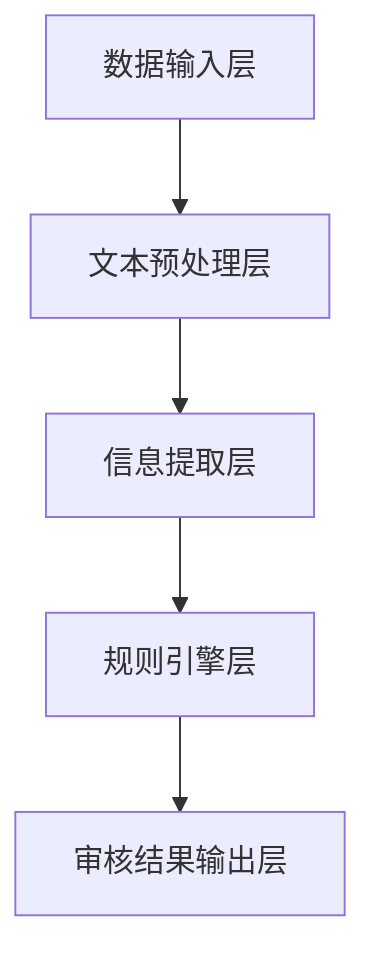

# 构建基于NLP的金融合同自动化审核系统

> 关键词：自然语言处理（NLP）、金融合同、自动化审核系统、信息提取、规则引擎

> 摘要：本文聚焦于构建基于自然语言处理（NLP）的金融合同自动化审核系统。随着金融行业的快速发展，合同数量与日俱增，传统人工审核方式效率低、易出错。该系统利用NLP技术，能自动提取合同关键信息，依据预设规则进行审核，提高审核效率与准确性。文章详细介绍了系统的背景、核心概念、算法原理、数学模型、项目实战、应用场景等内容，还推荐了相关工具和资源，最后对系统的未来发展趋势与挑战进行了总结。

## 1. 背景介绍 
### 1.1 目的和范围
在金融领域，合同是业务开展的重要依据，涉及大量的条款和细节。传统的金融合同审核主要依靠人工完成，这不仅耗费大量的时间和人力成本，而且容易出现人为疏忽和错误。构建基于NLP的金融合同自动化审核系统的目的在于提高审核效率、降低成本、减少人为错误，确保合同审核的准确性和一致性。

本系统的范围涵盖了常见金融合同类型，如贷款合同、投资合同、保险合同等。系统能够对合同文本进行全面的分析，包括条款识别、关键信息提取、合规性检查等功能。

### 1.2 预期读者
本文的预期读者包括金融行业的从业人员，如法务人员、合规人员、风险管理人员等，他们可以通过了解该系统，提高合同审核工作的效率和质量。同时，也适合对自然语言处理和金融科技感兴趣的技术人员，包括程序员、数据科学家、软件架构师等，他们可以从中获取系统构建的技术思路和实现方法。

### 1.3 文档结构概述
本文将按照以下结构进行阐述：首先介绍系统的背景信息，包括目的、预期读者和文档结构概述等；接着阐述核心概念与联系，包括NLP的相关原理和系统的架构；然后详细讲解核心算法原理和具体操作步骤，并用Python代码进行说明；再介绍数学模型和公式，并举例说明；之后通过项目实战展示代码实际案例和详细解释；接着探讨实际应用场景；推荐相关的工具和资源；最后总结未来发展趋势与挑战，并给出常见问题与解答以及扩展阅读和参考资料。

### 1.4 术语表
#### 1.4.1 核心术语定义
- **自然语言处理（NLP）**：是计算机科学、人工智能和语言学交叉的领域，旨在让计算机理解、处理和生成人类语言。
- **金融合同**：金融机构与客户或其他机构之间签订的具有法律效力的协议，规定了双方的权利和义务。
- **自动化审核系统**：利用计算机技术自动对金融合同进行审核的系统，能够快速、准确地检查合同的合规性和完整性。
- **信息提取**：从文本中识别和提取出有价值的信息，如合同中的条款、金额、日期等。
- **规则引擎**：一种软件组件，用于执行预定义的业务规则，在本系统中用于对提取的信息进行合规性检查。

#### 1.4.2 相关概念解释
- **命名实体识别（NER）**：是NLP中的一项任务，用于识别文本中的命名实体，如人名、地名、组织机构名等。在金融合同审核中，可用于识别合同中的关键实体，如客户名称、金融机构名称、合同金额等。
- **文本分类**：将文本划分到不同的类别中。在金融合同审核中，可用于判断合同的类型，如贷款合同、投资合同等。
- **语义理解**：让计算机理解文本的语义信息，包括句子的含义、词语之间的关系等。在金融合同审核中，可用于理解合同条款的具体含义。

#### 1.4.3 缩略词列表
- **NLP**：自然语言处理（Natural Language Processing）
- **NER**：命名实体识别（Named Entity Recognition）

## 2. 核心概念与联系 

### 核心概念原理
自然语言处理（NLP）是构建金融合同自动化审核系统的核心技术。NLP的主要任务包括文本预处理、信息提取、文本分类、语义理解等。

文本预处理是对原始文本进行清洗和转换，包括去除噪声、分词、词性标注等操作，以便后续的处理。信息提取是从文本中提取出关键信息，如合同中的条款、金额、日期等。文本分类是将合同文本划分到不同的类别中，如贷款合同、投资合同等。语义理解是让计算机理解合同条款的具体含义，以便进行合规性检查。

规则引擎是系统的另一个核心组件，它用于执行预定义的业务规则。规则引擎可以根据合同的类型和提取的信息，对合同进行合规性检查，如检查合同中的利率是否符合规定、合同期限是否合理等。

### 架构的文本示意图
本系统的架构主要包括以下几个部分：
1. **数据输入层**：接收金融合同文本，可以是电子文档、扫描件等形式。
2. **文本预处理层**：对输入的文本进行清洗和转换，包括去除噪声、分词、词性标注等操作。
3. **信息提取层**：利用NLP技术从预处理后的文本中提取关键信息，如合同条款、金额、日期等。
4. **规则引擎层**：根据预定义的业务规则，对提取的信息进行合规性检查。
5. **审核结果输出层**：将审核结果以可视化的方式输出，如生成审核报告、标记出不合规的条款等。

### Mermaid 流程图


## 3. 核心算法原理 & 具体操作步骤 

### 核心算法原理
本系统主要使用以下几种NLP算法：
1. **命名实体识别（NER）**：用于识别合同中的关键实体，如客户名称、金融机构名称、合同金额等。常用的NER算法有基于规则的方法、基于机器学习的方法（如条件随机场CRF）和基于深度学习的方法（如BERT）。
2. **文本分类**：用于判断合同的类型，如贷款合同、投资合同等。常用的文本分类算法有朴素贝叶斯、支持向量机、深度学习模型（如卷积神经网络CNN、循环神经网络RNN）等。
3. **语义理解**：用于理解合同条款的具体含义。常用的语义理解算法有词向量模型（如Word2Vec、GloVe）、预训练语言模型（如BERT、GPT）等。

### 具体操作步骤
1. **数据收集**：收集大量的金融合同文本作为训练数据。
2. **数据预处理**：对收集到的文本进行清洗和转换，包括去除噪声、分词、词性标注等操作。
3. **模型训练**：使用预处理后的数据训练NER、文本分类和语义理解模型。
4. **信息提取**：使用训练好的NER模型从合同文本中提取关键信息。
5. **文本分类**：使用训练好的文本分类模型判断合同的类型。
6. **规则引擎配置**：根据合同的类型和业务需求，配置规则引擎的业务规则。
7. **合规性检查**：使用规则引擎对提取的信息进行合规性检查。
8. **审核结果输出**：将审核结果以可视化的方式输出，如生成审核报告、标记出不合规的条款等。

### Python源代码示例
以下是一个简单的Python代码示例，用于实现命名实体识别和文本分类：

```python
import spacy

# 加载英文语言模型
nlp = spacy.load("en_core_web_sm")

# 定义合同文本
contract_text = "This is a loan contract between ABC Bank and John Doe. The loan amount is $100,000."

# 进行命名实体识别
doc = nlp(contract_text)
for ent in doc.ents:
    print(ent.text, ent.label_)

# 文本分类示例（简单的规则匹配）
if "loan" in contract_text.lower():
    print("This is a loan contract.")
else:
    print("This is not a loan contract.")
```

## 4. 数学模型和公式 & 详细讲解 & 举例说明 

### 命名实体识别（NER）的数学模型
基于条件随机场（CRF）的NER模型是一种常用的机器学习模型。CRF是一种概率图模型，用于对序列数据进行建模。在NER中，输入是一个词序列，输出是每个词对应的实体标签序列。

CRF的目标是找到一个最优的标签序列 $y$，使得给定输入序列 $x$ 的条件概率 $P(y|x)$ 最大。条件概率 $P(y|x)$ 可以表示为：

$$P(y|x) = \frac{1}{Z(x)} \exp \left( \sum_{i=1}^{n} \sum_{k=1}^{K} \lambda_k f_k(y_{i-1}, y_i, x, i) \right)$$

其中，$Z(x)$ 是归一化因子，$\lambda_k$ 是特征函数 $f_k$ 的权重，$n$ 是序列的长度，$K$ 是特征函数的数量。

### 文本分类的数学模型
朴素贝叶斯是一种常用的文本分类算法。朴素贝叶斯基于贝叶斯定理，假设特征之间相互独立。对于一个文本 $x$，其属于类别 $c$ 的概率可以表示为：

$$P(c|x) = \frac{P(x|c)P(c)}{P(x)}$$

其中，$P(c|x)$ 是文本 $x$ 属于类别 $c$ 的后验概率，$P(x|c)$ 是在类别 $c$ 下文本 $x$ 出现的概率，$P(c)$ 是类别 $c$ 的先验概率，$P(x)$ 是文本 $x$ 出现的概率。

### 举例说明
假设有一个贷款合同文本，我们使用CRF模型进行命名实体识别。输入的词序列为 ["This", "is", "a", "loan", "contract", "between", "ABC", "Bank", "and", "John", "Doe", "."]，经过训练好的CRF模型，输出的实体标签序列为 ["O", "O", "O", "O", "O", "O", "ORG", "ORG", "O", "PER", "PER", "O"]，其中 "ORG" 表示组织机构名，"PER" 表示人名，"O" 表示其他。

对于文本分类，假设有一个合同文本 "This is an investment contract."，我们使用朴素贝叶斯模型进行分类。根据训练数据，类别 "investment contract" 的先验概率 $P(c)$ 为 0.3，在类别 "investment contract" 下文本 "This is an investment contract." 出现的概率 $P(x|c)$ 为 0.01，文本 "This is an investment contract." 出现的概率 $P(x)$ 为 0.003。则该文本属于类别 "investment contract" 的后验概率 $P(c|x)$ 为：

$$P(c|x) = \frac{0.01 \times 0.3}{0.003} = 1$$

因此，该文本被分类为 "investment contract"。

## 5. 项目实战：代码实际案例和详细解释说明 

### 5.1  开发环境搭建
1. **安装Python**：推荐使用Python 3.7及以上版本。
2. **安装必要的库**：使用pip安装以下库：
    - `spacy`：用于自然语言处理。
    - `sklearn`：用于机器学习。
    - `pandas`：用于数据处理。

```bash
pip install spacy scikit-learn pandas
```

3. **下载语言模型**：下载Spacy的英文语言模型。

```bash
python -m spacy download en_core_web_sm
```

### 5.2  源代码详细实现和代码解读
以下是一个完整的Python代码示例，用于实现金融合同自动化审核系统的基本功能：

```python
import spacy
from sklearn.feature_extraction.text import TfidfVectorizer
from sklearn.naive_bayes import MultinomialNB
import pandas as pd

# 加载英文语言模型
nlp = spacy.load("en_core_web_sm")

# 定义训练数据
data = [
    ("This is a loan contract between ABC Bank and John Doe. The loan amount is $100,000.", "loan contract"),
    ("This is an investment contract with XYZ Investment Company. The investment amount is $50,000.", "investment contract"),
    ("This is an insurance contract with DEF Insurance Company. The insured amount is $200,000.", "insurance contract")
]

# 数据预处理
df = pd.DataFrame(data, columns=['text', 'label'])
vectorizer = TfidfVectorizer()
X = vectorizer.fit_transform(df['text'])
y = df['label']

# 训练文本分类模型
clf = MultinomialNB()
clf.fit(X, y)

# 定义合同审核函数
def contract_audit(contract_text):
    # 命名实体识别
    doc = nlp(contract_text)
    entities = []
    for ent in doc.ents:
        entities.append((ent.text, ent.label_))
    
    # 文本分类
    X_test = vectorizer.transform([contract_text])
    contract_type = clf.predict(X_test)[0]
    
    # 简单的规则引擎：检查贷款合同的金额是否超过100,000美元
    if contract_type == "loan contract":
        for entity in entities:
            if entity[1] == "MONEY":
                amount = float(entity[0].replace('$', '').replace(',', ''))
                if amount > 100000:
                    print("Warning: Loan amount exceeds the limit!")
    
    # 输出审核结果
    print("Contract type:", contract_type)
    print("Entities:", entities)

# 测试合同审核函数
contract_text = "This is a loan contract between GHI Bank and Jane Smith. The loan amount is $150,000."
contract_audit(contract_text)
```

### 5.3  代码解读与分析
1. **数据预处理**：使用`pandas`库将训练数据转换为DataFrame格式，然后使用`TfidfVectorizer`将文本转换为向量表示。
2. **文本分类模型训练**：使用`MultinomialNB`训练朴素贝叶斯文本分类模型。
3. **命名实体识别**：使用Spacy的`nlp`对象对合同文本进行命名实体识别，提取关键实体。
4. **规则引擎**：在合同类型为贷款合同时，检查贷款金额是否超过100,000美元，如果超过则输出警告信息。
5. **审核结果输出**：输出合同类型和提取的实体信息。

## 6. 实际应用场景 
### 金融机构内部审核
金融机构在签订合同前，需要对合同进行审核，确保合同符合法律法规和内部规定。基于NLP的金融合同自动化审核系统可以快速、准确地对合同进行审核，提高审核效率，降低审核成本。

### 监管机构合规检查
监管机构需要对金融机构的合同进行合规检查，确保金融机构的业务活动合法合规。自动化审核系统可以帮助监管机构快速筛选出可能存在问题的合同，提高检查效率。

### 金融科技公司风险评估
金融科技公司在开展业务时，需要对合同的风险进行评估。自动化审核系统可以帮助金融科技公司快速识别合同中的风险点，为风险评估提供依据。

## 7. 工具和资源推荐
### 7.1 学习资源推荐
#### 7.1.1 书籍推荐
- 《Python自然语言处理》：介绍了Python在自然语言处理中的应用，包括文本预处理、信息提取、文本分类等技术。
- 《深度学习》：介绍了深度学习的基本原理和应用，包括神经网络、卷积神经网络、循环神经网络等。
- 《金融科技概论》：介绍了金融科技的基本概念和应用，包括区块链、人工智能、大数据等在金融领域的应用。

#### 7.1.2 在线课程
- Coursera上的“自然语言处理专项课程”：由知名高校的教授授课，介绍了自然语言处理的基本原理和应用。
- edX上的“深度学习微硕士课程”：由顶尖科技公司的专家授课，介绍了深度学习的最新技术和应用。
- 中国大学MOOC上的“金融科技前沿”：由国内高校的教授授课，介绍了金融科技的最新发展和应用。

#### 7.1.3 技术博客和网站
- 机器之心：提供了人工智能、机器学习、自然语言处理等领域的最新技术和应用案例。
- 开源中国：提供了开源技术和项目的介绍和分享。
- 知乎：有很多关于自然语言处理和金融科技的讨论和分享。

### 7.2 开发工具框架推荐
#### 7.2.1 IDE和编辑器
- PyCharm：一款功能强大的Python集成开发环境，提供了代码编辑、调试、版本控制等功能。
- Visual Studio Code：一款轻量级的代码编辑器，支持多种编程语言，有丰富的插件和扩展。
- Jupyter Notebook：一种交互式的编程环境，适合进行数据探索和模型训练。

#### 7.2.2 调试和性能分析工具
- Py-Spy：一个Python性能分析工具，可以帮助开发者找出代码中的性能瓶颈。
- PDB：Python的内置调试器，可以帮助开发者调试代码。
- TensorBoard：一个深度学习可视化工具，可以帮助开发者可视化模型的训练过程和性能指标。

#### 7.2.3 相关框架和库
- Spacy：一个高效的自然语言处理库，提供了命名实体识别、词性标注、句法分析等功能。
- NLTK：一个经典的自然语言处理库，提供了丰富的语料库和工具。
- Transformers：一个基于PyTorch和TensorFlow的深度学习库，提供了预训练的语言模型，如BERT、GPT等。

### 7.3 相关论文著作推荐
#### 7.3.1 经典论文
- "BERT: Pre-training of Deep Bidirectional Transformers for Language Understanding"：介绍了BERT模型的原理和应用，是自然语言处理领域的经典论文。
- "Attention Is All You Need"：介绍了Transformer模型的原理和应用，是深度学习领域的经典论文。
- "Conditional Random Fields: Probabilistic Models for Segmenting and Labeling Sequence Data"：介绍了条件随机场（CRF）模型的原理和应用，是序列标注领域的经典论文。

#### 7.3.2 最新研究成果
- 关注ACL（Association for Computational Linguistics）、EMNLP（Conference on Empirical Methods in Natural Language Processing）等自然语言处理领域的顶级会议，了解最新的研究成果。
- 关注金融科技领域的学术期刊，如《金融研究》、《金融科技时代》等，了解金融科技的最新发展。

#### 7.3.3 应用案例分析
- 阅读金融机构和金融科技公司的技术博客和案例分享，了解基于NLP的金融合同自动化审核系统的实际应用案例。

## 8. 总结：未来发展趋势与挑战
### 未来发展趋势
1. **更强大的预训练语言模型**：随着预训练语言模型的不断发展，如GPT-3、BERT等，金融合同自动化审核系统将能够更好地理解合同文本的语义信息，提高审核的准确性。
2. **多模态融合**：将文本信息与图像、音频等多模态信息融合，能够更全面地审核金融合同，例如对合同中的签名、印章等进行识别和验证。
3. **智能化决策**：结合机器学习和人工智能技术，实现智能化决策，例如根据合同的风险评估结果，自动给出建议和决策。
4. **区块链技术的应用**：将区块链技术应用于金融合同自动化审核系统，能够提高合同的安全性和可信度，实现合同的不可篡改和可追溯。

### 挑战
1. **数据隐私和安全**：金融合同包含大量的敏感信息，如客户的个人信息、财务信息等，如何保护数据的隐私和安全是一个重要的挑战。
2. **语义理解的准确性**：金融合同的语言复杂、专业，语义理解的准确性是一个挑战。如何提高模型对金融术语和专业知识的理解能力，是需要解决的问题。
3. **规则的更新和维护**：金融行业的法律法规和业务规则不断变化，如何及时更新和维护规则引擎的规则，是一个挑战。
4. **人机协作**：虽然自动化审核系统可以提高审核效率，但在一些复杂的情况下，仍然需要人工审核。如何实现人机协作，提高审核的效率和质量，是一个需要研究的问题。

## 9. 附录：常见问题与解答
### 1. 系统对合同文本的格式有什么要求？
系统可以处理常见的文本格式，如TXT、DOCX等。对于扫描件，需要先进行OCR识别，将图像中的文本转换为可编辑的文本。

### 2. 系统的审核准确性如何保证？
系统的审核准确性主要取决于训练数据的质量和模型的性能。通过不断收集和标注高质量的训练数据，优化模型的参数，可以提高系统的审核准确性。同时，还可以结合人工审核进行验证和修正。

### 3. 系统能否处理不同语言的合同文本？
系统可以处理不同语言的合同文本，需要根据不同的语言选择相应的语言模型。例如，对于中文合同文本，可以使用Spacy的中文语言模型或其他中文NLP工具。

### 4. 系统的性能如何？
系统的性能取决于硬件资源和数据量。在配置较高的服务器上，系统可以快速处理大量的合同文本。同时，还可以通过优化算法和模型结构，提高系统的性能。

## 10. 扩展阅读 & 参考资料
1. 《自然语言处理入门》，何晗著
2. 《Python数据分析实战》，徐子沛著
3. Spacy官方文档：https://spacy.io/
4. Scikit-learn官方文档：https://scikit-learn.org/
5. 金融行业相关法律法规和政策文件。