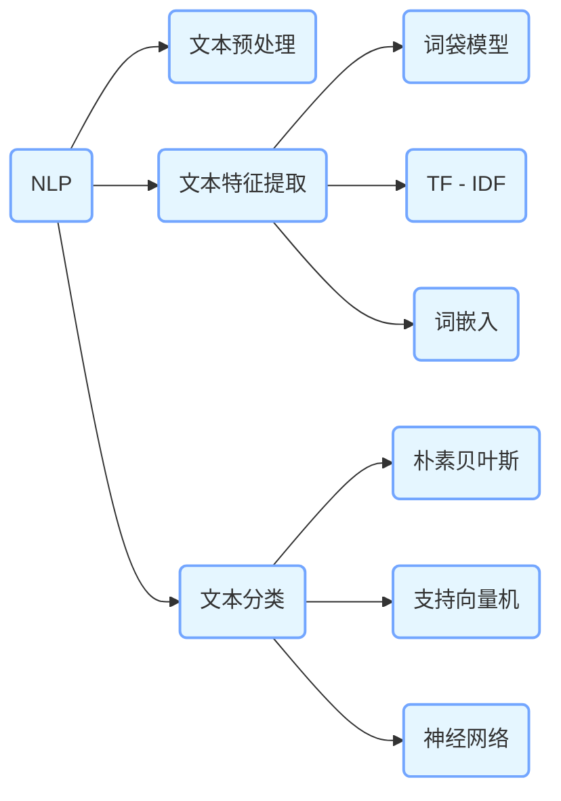

# 构建基于NLP的金融文档自动分类系统

> 关键词：自然语言处理（NLP）、金融文档、自动分类系统、文本特征提取、机器学习算法

> 摘要：本文旨在深入探讨如何构建基于自然语言处理（NLP）的金融文档自动分类系统。随着金融行业的快速发展，每天都会产生大量的金融文档，如年报、研报、新闻资讯等。手动对这些文档进行分类不仅效率低下，而且容易出错。因此，开发一个高效准确的自动分类系统具有重要的现实意义。文章首先介绍了构建该系统的背景，包括目的、预期读者等；接着阐述了核心概念与联系，详细讲解了相关算法原理和具体操作步骤，并给出了数学模型和公式；通过项目实战展示了代码的实际案例和详细解释；分析了该系统的实际应用场景；推荐了相关的学习资源、开发工具框架以及论文著作；最后总结了未来发展趋势与挑战，并对常见问题进行了解答，提供了扩展阅读和参考资料。

## 1. 背景介绍 
### 1.1 目的和范围
随着金融市场的不断发展和信息化程度的提高，金融机构和投资者面临着海量的金融文档信息。这些文档涵盖了公司年报、行业研究报告、财经新闻、政策文件等多种类型，其内容丰富但也复杂多样。手动对这些文档进行分类和管理不仅耗费大量的人力和时间，而且容易出现分类不准确、不及时的问题。因此，构建基于NLP的金融文档自动分类系统的目的在于提高金融文档分类的效率和准确性，帮助金融从业者快速获取所需信息，辅助决策制定。

本系统的范围主要聚焦于对各类金融文档进行分类，包括但不限于股票研究报告、债券分析报告、宏观经济政策解读、公司财务报表等。系统将根据文档的内容、主题、情感倾向等特征，将其归类到不同的预定义类别中，如宏观经济、行业动态、公司业绩、市场趋势等。

### 1.2 预期读者
本文的预期读者主要包括以下几类人群：
- **金融从业者**：如金融分析师、投资经理、交易员等，他们需要处理大量的金融文档，本系统可以帮助他们提高工作效率，快速筛选和获取有价值的信息。
- **数据科学家和机器学习工程师**：对自然语言处理和机器学习算法感兴趣，希望通过实际案例了解如何将NLP技术应用于金融领域，解决文档分类问题。
- **软件开发人员**：关注如何开发实用的软件系统，本系统的构建过程和代码实现可以为他们提供参考和借鉴。
- **研究人员**：从事金融信息处理、自然语言处理等相关领域的研究，本系统的相关技术和方法可以为他们的研究提供新的思路和方向。

### 1.3 文档结构概述
本文将按照以下结构进行详细阐述：
- **核心概念与联系**：介绍与金融文档自动分类系统相关的核心概念，如自然语言处理、文本特征提取、分类算法等，并阐述它们之间的联系。
- **核心算法原理 & 具体操作步骤**：详细讲解实现金融文档自动分类的核心算法原理，包括文本预处理、特征提取、分类模型训练等步骤，并给出相应的Python源代码。
- **数学模型和公式 & 详细讲解 & 举例说明**：介绍用于文本分类的数学模型和公式，如贝叶斯分类器、支持向量机等，并通过具体例子进行详细讲解。
- **项目实战：代码实际案例和详细解释说明**：通过一个实际的项目案例，展示如何搭建开发环境、实现源代码，并对代码进行详细解读和分析。
- **实际应用场景**：分析金融文档自动分类系统在金融行业中的实际应用场景，如信息检索、风险评估、投资决策等。
- **工具和资源推荐**：推荐相关的学习资源、开发工具框架以及论文著作，帮助读者进一步深入学习和研究。
- **总结：未来发展趋势与挑战**：总结金融文档自动分类系统的发展趋势，并分析面临的挑战。
- **附录：常见问题与解答**：对读者可能遇到的常见问题进行解答。
- **扩展阅读 & 参考资料**：提供相关的扩展阅读材料和参考资料，方便读者进一步查阅。

### 1.4 术语表
#### 1.4.1 核心术语定义
- **自然语言处理（NLP）**：是计算机科学、人工智能和语言学的交叉领域，旨在让计算机能够理解、处理和生成人类语言。
- **文本分类**：是指将文本按照一定的规则划分到不同的类别中，是自然语言处理中的一项重要任务。
- **特征提取**：是指从原始文本中提取出能够代表文本特征的信息，如词频、词性、句法结构等。
- **分类模型**：是指用于对文本进行分类的数学模型，如决策树、神经网络、支持向量机等。
- **语料库**：是指用于训练和测试分类模型的文本集合。

#### 1.4.2 相关概念解释
- **词向量**：是将词语表示为向量的形式，以便计算机能够更好地处理和理解文本。常见的词向量表示方法有词袋模型、词嵌入等。
- **深度学习**：是一种基于人工神经网络的机器学习方法，在自然语言处理领域取得了显著的成果，如循环神经网络（RNN）、长短期记忆网络（LSTM）、卷积神经网络（CNN）等。
- **情感分析**：是指对文本中表达的情感倾向进行分析，如积极、消极、中性等。在金融领域，情感分析可以帮助投资者了解市场情绪。

#### 1.4.3 缩略词列表
- **NLP**：Natural Language Processing（自然语言处理）
- **TF-IDF**：Term Frequency-Inverse Document Frequency（词频 - 逆文档频率）
- **SVM**：Support Vector Machine（支持向量机）
- **CNN**：Convolutional Neural Network（卷积神经网络）
- **LSTM**：Long Short-Term Memory（长短期记忆网络）

## 2. 核心概念与联系 

### 2.1 自然语言处理（NLP）
自然语言处理是实现金融文档自动分类系统的核心技术之一。它的主要任务包括文本预处理、文本特征提取、文本分类等。文本预处理是对原始文本进行清洗、分词、去除停用词等操作，以提高文本的质量和处理效率。文本特征提取是将文本转换为计算机能够处理的特征向量，常用的方法有词袋模型、TF-IDF、词嵌入等。文本分类是根据文本的特征向量将其划分到不同的类别中，常用的分类算法有朴素贝叶斯、支持向量机、神经网络等。

### 2.2 文本特征提取
文本特征提取是将文本转换为计算机能够处理的数字特征的过程。常用的文本特征提取方法包括：
- **词袋模型（Bag of Words）**：将文本看作是一个无序的词集合，每个词作为一个特征，通过统计词的出现频率来表示文本的特征。
- **TF-IDF（Term Frequency-Inverse Document Frequency）**：是一种基于词频和逆文档频率的特征提取方法，它不仅考虑了词在文本中的出现频率，还考虑了词在整个语料库中的出现频率，能够更好地反映词的重要性。
- **词嵌入（Word Embedding）**：是将词语表示为低维向量的方法，通过学习词语之间的语义关系，使得语义相近的词语在向量空间中距离较近。常见的词嵌入模型有Word2Vec、GloVe等。

### 2.3 分类算法
分类算法是实现金融文档自动分类的关键。常用的分类算法包括：
- **朴素贝叶斯（Naive Bayes）**：是一种基于贝叶斯定理的简单概率分类器，它假设特征之间相互独立，具有计算简单、训练速度快等优点。
- **支持向量机（Support Vector Machine）**：是一种二分类模型，通过寻找最优的超平面来划分不同类别的样本，具有较好的泛化能力和分类性能。
- **神经网络（Neural Network）**：是一种模仿人类神经系统的机器学习模型，具有强大的非线性拟合能力，能够处理复杂的分类问题。常见的神经网络模型有多层感知机（MLP）、卷积神经网络（CNN）、循环神经网络（RNN）等。

### 2.4 核心概念联系示意图


从示意图可以看出，自然语言处理（NLP）是整个系统的核心，它包含了文本预处理、文本特征提取和文本分类三个主要步骤。文本特征提取为文本分类提供了必要的特征输入，而不同的分类算法则根据这些特征对文本进行分类。

## 3. 核心算法原理 & 具体操作步骤 

### 3.1 文本预处理
文本预处理是对原始文本进行清洗、分词、去除停用词等操作，以提高文本的质量和处理效率。以下是使用Python实现文本预处理的示例代码：

```python
import re
import jieba
import nltk
from nltk.corpus import stopwords

# 下载停用词
nltk.download('stopwords')
# 加载中文停用词
stop_words = set(stopwords.words('chinese'))

def preprocess_text(text):
    # 去除特殊字符和标点符号
    text = re.sub(r'[^\w\s]', '', text)
    # 分词
    words = jieba.lcut(text)
    # 去除停用词
    filtered_words = [word for word in words if word not in stop_words]
    # 拼接成字符串
    preprocessed_text = ' '.join(filtered_words)
    return preprocessed_text

# 示例文本
text = "这是一段示例文本，包含一些特殊字符！@#"
preprocessed_text = preprocess_text(text)
print(preprocessed_text)
```

### 3.2 文本特征提取
#### 3.2.1 TF-IDF特征提取
TF-IDF是一种常用的文本特征提取方法，它通过计算词的词频和逆文档频率来表示词的重要性。以下是使用Python实现TF-IDF特征提取的示例代码：

```python
from sklearn.feature_extraction.text import TfidfVectorizer

# 示例文本列表
corpus = [
    "这是第一个示例文本",
    "这是第二个示例文本",
    "这是第三个示例文本"
]

# 初始化TF-IDF向量器
vectorizer = TfidfVectorizer()
# 提取特征
tfidf_matrix = vectorizer.fit_transform(corpus)

# 打印特征矩阵
print(tfidf_matrix.toarray())
# 打印特征名称
print(vectorizer.get_feature_names_out())
```

#### 3.2.2 词嵌入特征提取
词嵌入是将词语表示为低维向量的方法，常用的词嵌入模型有Word2Vec。以下是使用Python实现Word2Vec词嵌入特征提取的示例代码：

```python
from gensim.models import Word2Vec
import jieba

# 示例文本列表
corpus = [
    "这是第一个示例文本",
    "这是第二个示例文本",
    "这是第三个示例文本"
]

# 分词
tokenized_corpus = [jieba.lcut(text) for text in corpus]

# 训练Word2Vec模型
model = Word2Vec(tokenized_corpus, min_count=1)

# 获取词语的向量表示
vector = model.wv['示例']
print(vector)
```

### 3.3 分类模型训练
#### 3.3.1 朴素贝叶斯分类器
朴素贝叶斯是一种基于贝叶斯定理的简单概率分类器，它假设特征之间相互独立。以下是使用Python实现朴素贝叶斯分类器的示例代码：

```python
from sklearn.naive_bayes import MultinomialNB
from sklearn.feature_extraction.text import TfidfVectorizer
from sklearn.model_selection import train_test_split
from sklearn.metrics import accuracy_score

# 示例文本列表
corpus = [
    "这是关于宏观经济的新闻",
    "这是关于公司业绩的报告",
    "这是关于行业动态的文章",
    "这是关于市场趋势的分析"
]

# 示例标签列表
labels = ["宏观经济", "公司业绩", "行业动态", "市场趋势"]

# 划分训练集和测试集
X_train, X_test, y_train, y_test = train_test_split(corpus, labels, test_size=0.2, random_state=42)

# 提取TF-IDF特征
vectorizer = TfidfVectorizer()
X_train_tfidf = vectorizer.fit_transform(X_train)
X_test_tfidf = vectorizer.transform(X_test)

# 初始化朴素贝叶斯分类器
clf = MultinomialNB()
# 训练模型
clf.fit(X_train_tfidf, y_train)

# 预测
y_pred = clf.predict(X_test_tfidf)

# 计算准确率
accuracy = accuracy_score(y_test, y_pred)
print(f"准确率: {accuracy}")
```

#### 3.3.2 支持向量机分类器
支持向量机是一种二分类模型，通过寻找最优的超平面来划分不同类别的样本。以下是使用Python实现支持向量机分类器的示例代码：

```python
from sklearn.svm import SVC
from sklearn.feature_extraction.text import TfidfVectorizer
from sklearn.model_selection import train_test_split
from sklearn.metrics import accuracy_score

# 示例文本列表
corpus = [
    "这是关于宏观经济的新闻",
    "这是关于公司业绩的报告",
    "这是关于行业动态的文章",
    "这是关于市场趋势的分析"
]

# 示例标签列表
labels = ["宏观经济", "公司业绩", "行业动态", "市场趋势"]

# 划分训练集和测试集
X_train, X_test, y_train, y_test = train_test_split(corpus, labels, test_size=0.2, random_state=42)

# 提取TF-IDF特征
vectorizer = TfidfVectorizer()
X_train_tfidf = vectorizer.fit_transform(X_train)
X_test_tfidf = vectorizer.transform(X_test)

# 初始化支持向量机分类器
clf = SVC()
# 训练模型
clf.fit(X_train_tfidf, y_train)

# 预测
y_pred = clf.predict(X_test_tfidf)

# 计算准确率
accuracy = accuracy_score(y_test, y_pred)
print(f"准确率: {accuracy}")
```

## 4. 数学模型和公式 & 详细讲解 & 举例说明 

### 4.1 朴素贝叶斯分类器
#### 4.1.1 数学模型和公式
朴素贝叶斯分类器基于贝叶斯定理，其基本公式为：

$$P(c|x)=\frac{P(x|c)P(c)}{P(x)}$$

其中，$P(c|x)$ 表示在给定特征 $x$ 的情况下，样本属于类别 $c$ 的概率；$P(x|c)$ 表示在类别 $c$ 下，特征 $x$ 出现的概率；$P(c)$ 表示类别 $c$ 出现的先验概率；$P(x)$ 表示特征 $x$ 出现的概率。

在文本分类中，通常假设特征之间相互独立，即：

$$P(x|c)=\prod_{i=1}^{n}P(x_i|c)$$

其中，$x=(x_1,x_2,\cdots,x_n)$ 表示文本的特征向量。

朴素贝叶斯分类器的分类决策规则为：

$$\hat{c}=\arg\max_{c\in C}P(c|x)=\arg\max_{c\in C}P(x|c)P(c)$$

其中，$C$ 表示所有类别的集合，$\hat{c}$ 表示预测的类别。

#### 4.1.2 详细讲解
朴素贝叶斯分类器的训练过程主要包括计算先验概率 $P(c)$ 和条件概率 $P(x_i|c)$。先验概率 $P(c)$ 可以通过统计训练集中各类别样本的数量来计算，条件概率 $P(x_i|c)$ 可以通过统计训练集中属于类别 $c$ 的样本中特征 $x_i$ 出现的频率来计算。

在预测阶段，根据输入的文本特征向量 $x$，计算每个类别 $c$ 的后验概率 $P(c|x)$，并选择后验概率最大的类别作为预测结果。

#### 4.1.3 举例说明
假设有一个文本分类任务，要将文本分为“体育”和“科技”两类。训练集中有以下样本：

| 文本 | 类别 |
|---|---|
| 篮球比赛很精彩 | 体育 |
| 足球是一项受欢迎的运动 | 体育 |
| 人工智能技术发展迅速 | 科技 |
| 智能手机功能越来越强大 | 科技 |

计算先验概率：
- $P(体育)=\frac{2}{4}=0.5$
- $P(科技)=\frac{2}{4}=0.5$

计算条件概率（以“篮球”为例）：
- $P(篮球|体育)=\frac{1}{2}=0.5$
- $P(篮球|科技)=0$

假设输入的文本为“篮球运动很有趣”，其特征向量包含“篮球”。计算后验概率：
- $P(体育|篮球)=P(篮球|体育)P(体育)=0.5\times0.5 = 0.25$
- $P(科技|篮球)=P(篮球|科技)P(科技)=0\times0.5 = 0$

因为 $P(体育|篮球)>P(科技|篮球)$，所以预测该文本的类别为“体育”。

### 4.2 支持向量机分类器
#### 4.2.1 数学模型和公式
支持向量机的目标是寻找一个最优的超平面，使得不同类别的样本能够被最大程度地分开。对于二分类问题，假设训练集为 $\{(x_1,y_1),(x_2,y_2),\cdots,(x_n,y_n)\}$，其中 $x_i\in\mathbb{R}^d$ 表示样本的特征向量，$y_i\in\{-1,1\}$ 表示样本的类别标签。

支持向量机的优化问题可以表示为：

$$\min_{w,b}\frac{1}{2}\|w\|^2$$

$$s.t.\quad y_i(w^Tx_i + b)\geq1,\quad i = 1,2,\cdots,n$$

其中，$w$ 是超平面的法向量，$b$ 是超平面的偏移量。

为了处理线性不可分的情况，引入松弛变量 $\xi_i\geq0$，优化问题变为：

$$\min_{w,b,\xi}\frac{1}{2}\|w\|^2 + C\sum_{i=1}^{n}\xi_i$$

$$s.t.\quad y_i(w^Tx_i + b)\geq1 - \xi_i,\quad \xi_i\geq0,\quad i = 1,2,\cdots,n$$

其中，$C>0$ 是惩罚参数，用于平衡分类误差和模型复杂度。

通过拉格朗日乘子法求解上述优化问题，得到对偶问题：

$$\max_{\alpha}\sum_{i=1}^{n}\alpha_i - \frac{1}{2}\sum_{i=1}^{n}\sum_{j=1}^{n}\alpha_i\alpha_jy_iy_jx_i^Tx_j$$

$$s.t.\quad \sum_{i=1}^{n}\alpha_iy_i = 0,\quad 0\leq\alpha_i\leq C,\quad i = 1,2,\cdots,n$$

其中，$\alpha_i$ 是拉格朗日乘子。

分类决策函数为：

$$f(x)=\text{sign}\left(\sum_{i=1}^{n}\alpha_iy_ix_i^Tx + b\right)$$

#### 4.2.2 详细讲解
支持向量机的核心思想是通过寻找最优的超平面来划分不同类别的样本。在训练过程中，通过求解优化问题得到拉格朗日乘子 $\alpha_i$ 和偏移量 $b$，从而确定超平面的参数。在预测阶段，根据输入的样本特征向量 $x$，计算分类决策函数的值，根据其正负来判断样本的类别。

#### 4.2.3 举例说明
假设有一个二维的二分类问题，训练集包含以下样本：

| 样本 | 特征向量 $(x_1,x_2)$ | 类别标签 $y$ |
|---|---|---|
| 1 | $(1,2)$ | 1 |
| 2 | $(2,3)$ | 1 |
| 3 | $(3,1)$ | -1 |
| 4 | $(4,2)$ | -1 |

通过求解支持向量机的优化问题，得到超平面的参数 $w=(w_1,w_2)$ 和 $b$。假设输入的样本特征向量为 $(2,2)$，计算分类决策函数的值：

$$f((2,2))=\text{sign}\left(\sum_{i=1}^{4}\alpha_iy_ix_i^T(2,2) + b\right)$$

根据 $f((2,2))$ 的正负来判断该样本的类别。

## 5. 项目实战：代码实际案例和详细解释说明 

### 5.1  开发环境搭建
#### 5.1.1 安装Python
首先，需要安装Python开发环境。可以从Python官方网站（https://www.python.org/downloads/） 下载适合自己操作系统的Python版本，并按照安装向导进行安装。

#### 5.1.2 安装依赖库
在命令行中使用以下命令安装所需的依赖库：

```sh
pip install numpy pandas scikit-learn jieba gensim
```

### 5.2  源代码详细实现和代码解读
#### 5.2.1 数据加载和预处理
```python
import pandas as pd
import re
import jieba
from nltk.corpus import stopwords
import nltk

# 下载停用词
nltk.download('stopwords')
# 加载中文停用词
stop_words = set(stopwords.words('chinese'))

def preprocess_text(text):
    # 去除特殊字符和标点符号
    text = re.sub(r'[^\w\s]', '', text)
    # 分词
    words = jieba.lcut(text)
    # 去除停用词
    filtered_words = [word for word in words if word not in stop_words]
    # 拼接成字符串
    preprocessed_text = ' '.join(filtered_words)
    return preprocessed_text

# 加载数据集
data = pd.read_csv('financial_docs.csv')
# 预处理文本
data['preprocessed_text'] = data['text'].apply(preprocess_text)
```

#### 5.2.2 特征提取
```python
from sklearn.feature_extraction.text import TfidfVectorizer

# 提取TF-IDF特征
vectorizer = TfidfVectorizer()
X = vectorizer.fit_transform(data['preprocessed_text'])
y = data['label']
```

#### 5.2.3 模型训练和评估
```python
from sklearn.model_selection import train_test_split
from sklearn.naive_bayes import MultinomialNB
from sklearn.metrics import accuracy_score

# 划分训练集和测试集
X_train, X_test, y_train, y_test = train_test_split(X, y, test_size=0.2, random_state=42)

# 初始化朴素贝叶斯分类器
clf = MultinomialNB()
# 训练模型
clf.fit(X_train, y_train)

# 预测
y_pred = clf.predict(X_test)

# 计算准确率
accuracy = accuracy_score(y_test, y_pred)
print(f"准确率: {accuracy}")
```

### 5.3  代码解读与分析
- **数据加载和预处理**：使用 `pandas` 库加载金融文档数据集，并对文本进行预处理，包括去除特殊字符、分词、去除停用词等操作。
- **特征提取**：使用 `TfidfVectorizer` 提取文本的TF-IDF特征，将文本转换为特征向量。
- **模型训练和评估**：使用 `train_test_split` 函数将数据集划分为训练集和测试集，使用 `MultinomialNB` 初始化朴素贝叶斯分类器，并进行训练和预测。最后，使用 `accuracy_score` 计算模型的准确率。

## 6. 实际应用场景 
### 6.1 信息检索
金融文档自动分类系统可以帮助金融从业者快速检索和筛选所需的信息。例如，投资者可以根据文档的分类标签，快速找到关于特定公司、行业或市场的研究报告和新闻资讯，提高信息获取的效率。

### 6.2 风险评估
通过对金融文档进行分类和分析，可以及时发现潜在的风险因素。例如，对公司年报、财务报表等文档进行分类和分析，评估公司的财务状况和经营风险；对宏观经济政策解读、行业动态等文档进行分类和分析，评估市场的整体风险。

### 6.3 投资决策
金融文档自动分类系统可以为投资者提供决策支持。例如，通过对不同类型的金融文档进行分类和分析，了解市场趋势、行业发展前景、公司业绩等信息，帮助投资者制定合理的投资策略。

### 6.4 监管合规
金融机构需要遵守各种监管规定，对大量的金融文档进行分类和管理，以确保合规性。金融文档自动分类系统可以帮助金融机构快速准确地对文档进行分类和归档，提高监管合规的效率。

## 7. 工具和资源推荐
### 7.1 学习资源推荐
#### 7.1.1 书籍推荐
- 《Python自然语言处理》：介绍了Python在自然语言处理领域的应用，包括文本预处理、特征提取、分类算法等内容。
- 《统计学习方法》：详细讲解了各种机器学习算法的原理和实现，包括朴素贝叶斯、支持向量机、神经网络等。
- 《深度学习》：介绍了深度学习的基本概念、模型和算法，以及在自然语言处理领域的应用。

#### 7.1.2 在线课程
- Coursera上的“Natural Language Processing Specialization”：由斯坦福大学的教授授课，系统地介绍了自然语言处理的理论和实践。
- edX上的“Introduction to Artificial Intelligence”：介绍了人工智能的基本概念和算法，包括自然语言处理的相关内容。
- 中国大学MOOC上的“自然语言处理”：由国内高校的教授授课，结合实际案例介绍了自然语言处理的技术和应用。

#### 7.1.3 技术博客和网站
- 博客园：有很多关于自然语言处理和机器学习的技术博客，可以学习到最新的技术和实践经验。
- 知乎：有很多关于自然语言处理和金融科技的讨论和分享，可以了解到行业的最新动态和发展趋势。
- 开源中国：提供了很多开源的自然语言处理项目和代码，可以参考和学习。

### 7.2 开发工具框架推荐
#### 7.2.1 IDE和编辑器
- PyCharm：是一款专业的Python集成开发环境，具有代码编辑、调试、版本控制等功能，适合开发Python项目。
- Jupyter Notebook：是一个交互式的开发环境，可以方便地进行代码编写、运行和可视化，适合进行数据分析和机器学习实验。
- Visual Studio Code：是一款轻量级的代码编辑器，支持多种编程语言和插件，适合快速开发和调试。

#### 7.2.2 调试和性能分析工具
- PDB：是Python自带的调试器，可以帮助开发者定位和解决代码中的问题。
- cProfile：是Python的性能分析工具，可以帮助开发者分析代码的性能瓶颈，优化代码效率。
- TensorBoard：是TensorFlow的可视化工具，可以帮助开发者可视化模型的训练过程和性能指标。

#### 7.2.3 相关框架和库
- Scikit-learn：是一个简单易用的机器学习库，提供了各种机器学习算法和工具，包括分类、回归、聚类等。
- Gensim：是一个用于主题建模、文档索引和相似度检索的Python库，提供了Word2Vec、Doc2Vec等词嵌入模型。
- PyTorch：是一个开源的深度学习框架，提供了丰富的神经网络模型和工具，适合进行自然语言处理和深度学习研究。

### 7.3 相关论文著作推荐
#### 7.3.1 经典论文
- “A Comparative Study on Feature Selection in Text Categorization”：比较了不同的文本特征选择方法在文本分类中的性能。
- “Support-Vector Networks”：介绍了支持向量机的基本原理和算法。
- “Efficient Estimation of Word Representations in Vector Space”：提出了Word2Vec模型，用于高效地学习词向量。

#### 7.3.2 最新研究成果
- 关注顶级学术会议，如ACL（Association for Computational Linguistics）、EMNLP（Conference on Empirical Methods in Natural Language Processing）等，了解自然语言处理领域的最新研究成果。
- 查阅知名学术期刊，如Journal of Artificial Intelligence Research（JAIR）、Artificial Intelligence等，获取最新的研究论文。

#### 7.3.3 应用案例分析
- 一些金融科技公司和研究机构会发布关于金融文档处理和分析的应用案例，可以参考这些案例了解实际应用中的技术和方法。

## 8. 总结：未来发展趋势与挑战
### 8.1 未来发展趋势
- **深度学习的广泛应用**：随着深度学习技术的不断发展，越来越多的深度学习模型将被应用于金融文档自动分类系统中，如卷积神经网络（CNN）、长短期记忆网络（LSTM）、Transformer等，以提高分类的准确率和效率。
- **多模态信息融合**：除了文本信息外，金融文档中还可能包含图像、表格、音频等多模态信息。未来的金融文档自动分类系统将融合多模态信息，以更全面地理解文档内容，提高分类的准确性。
- **实时分类和流式处理**：随着金融市场的快速变化，对金融文档的实时分类和处理需求越来越高。未来的系统将支持实时分类和流式处理，能够及时对新产生的金融文档进行分类和分析。
- **可解释性和可信赖性**：在金融领域，模型的可解释性和可信赖性非常重要。未来的金融文档自动分类系统将更加注重模型的可解释性，能够向用户解释分类结果的依据和理由，提高用户对系统的信任度。

### 8.2 挑战
- **数据质量和标注问题**：金融文档数据的质量和标注准确性对分类系统的性能影响很大。由于金融文档的专业性和复杂性，数据标注需要专业的金融知识和经验，标注成本较高，且容易出现标注错误。
- **领域知识融合问题**：金融文档涉及到大量的专业领域知识，如金融术语、行业规则、市场动态等。如何将这些领域知识有效地融合到分类系统中，是一个亟待解决的问题。
- **模型复杂度和计算资源问题**：深度学习模型通常具有较高的复杂度，需要大量的计算资源和时间进行训练和推理。在实际应用中，如何在保证分类性能的前提下，降低模型的复杂度和计算成本，是一个挑战。
- **对抗攻击和安全问题**：金融文档自动分类系统可能会受到对抗攻击，如恶意修改文档内容、注入虚假信息等，从而导致分类结果的错误。如何提高系统的安全性和鲁棒性，防止对抗攻击，是一个重要的问题。

## 9. 附录：常见问题与解答
### 9.1 如何选择合适的分类算法？
选择合适的分类算法需要考虑多个因素，如数据集的大小、特征的类型、分类任务的复杂度等。一般来说，如果数据集较小，特征之间相互独立，可以选择朴素贝叶斯分类器；如果数据集较大，需要处理非线性分类问题，可以选择支持向量机或神经网络。

### 9.2 如何提高分类系统的准确率？
可以从以下几个方面提高分类系统的准确率：
- **数据预处理**：对原始文本进行清洗、分词、去除停用词等操作，提高文本的质量。
- **特征提取**：选择合适的特征提取方法，如TF-IDF、词嵌入等，提取能够代表文本特征的信息。
- **模型选择和调优**：选择合适的分类算法，并对模型的参数进行调优，以提高模型的性能。
- **领域知识融合**：将金融领域的专业知识融合到分类系统中，提高系统对金融文档的理解和分类能力。

### 9.3 如何处理类别不平衡问题？
类别不平衡是指数据集中不同类别的样本数量差异较大的问题。可以采用以下方法处理类别不平衡问题：
- **数据采样**：通过过采样（如SMOTE算法）或欠采样的方法，调整不同类别的样本数量，使数据集更加平衡。
- **代价敏感学习**：在分类算法中引入代价敏感机制，对不同类别的误分类代价进行调整，提高对少数类样本的分类准确率。
- **集成学习**：使用集成学习方法，如Bagging、Boosting等，将多个分类器组合起来，提高分类性能。

## 10. 扩展阅读 & 参考资料
### 10.1 扩展阅读
- 《自然语言处理入门》：适合初学者学习自然语言处理的基础知识和技术。
- 《Python机器学习实战》：通过实际案例介绍了Python在机器学习领域的应用，包括文本分类、图像识别等。
- 《金融科技前沿》：介绍了金融科技领域的最新发展和应用，包括自然语言处理在金融领域的应用。

### 10.2 参考资料
- 《统计自然语言处理》：详细介绍了统计自然语言处理的理论和方法，是自然语言处理领域的经典教材。
- 《机器学习》：由周志华教授编写，系统地介绍了机器学习的基本概念、算法和应用。
- 相关学术论文和研究报告：可以查阅ACM、IEEE等学术数据库，获取自然语言处理和金融领域的最新研究成果。