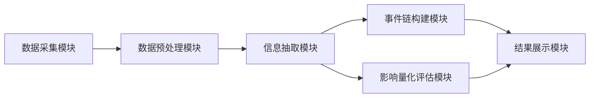

# 构建基于NLP的金融新闻事件链提取与影响量化评估系统

> 关键词：自然语言处理（NLP）、金融新闻、事件链提取、影响量化评估、信息抽取

> 摘要：本文旨在探讨如何构建一个基于自然语言处理（NLP）的金融新闻事件链提取与影响量化评估系统。在金融领域，新闻信息蕴含着丰富的事件及影响信息，对这些信息的有效提取和量化评估能够为投资者、金融机构等提供有价值的决策依据。文章首先介绍了该系统构建的背景，包括目的、预期读者等内容；接着阐述了核心概念与联系，展示了相关的原理和架构；详细讲解了核心算法原理及具体操作步骤，结合Python代码进行说明；分析了数学模型和公式并举例；通过项目实战给出代码实际案例及详细解释；探讨了实际应用场景；推荐了相关的工具和资源；最后总结了未来发展趋势与挑战，还给出了常见问题与解答以及扩展阅读和参考资料，为构建该系统提供全面的技术指导。

## 1. 背景介绍 
### 1.1 目的和范围
在金融市场中，新闻信息的传播速度极快且数量庞大。这些新闻包含了各种金融事件，如公司财报发布、政策调整、行业动态等。然而，这些信息往往是分散和无序的，投资者和金融机构难以快速准确地从中提取关键信息，了解事件之间的关联以及事件对金融市场的影响程度。

本系统的目的在于利用自然语言处理技术，从海量的金融新闻中提取事件链，并对事件的影响进行量化评估。系统的范围涵盖了各类金融新闻来源，包括财经网站、新闻客户端、社交媒体等发布的文本信息，旨在处理多种类型的金融事件，如宏观经济事件、公司层面事件等，并对其在股票市场、债券市场等金融市场的影响进行量化分析。

### 1.2 预期读者
本系统相关技术内容的预期读者包括：
- **金融从业者**：如投资者、基金经理、金融分析师等，他们可以利用系统提取的事件链和量化评估结果进行投资决策、风险评估等。
- **技术开发者**：对自然语言处理、信息抽取等技术感兴趣的程序员、软件工程师，他们可以参考系统的实现原理和代码，进行相关技术的学习和开发。
- **研究人员**：从事金融信息处理、自然语言处理等领域研究的学者，系统的构建思路和方法可以为他们的研究提供参考和借鉴。

### 1.3 文档结构概述
本文将按照以下结构展开：
- **核心概念与联系**：介绍与系统相关的核心概念，如事件链、影响量化评估等，并展示其原理和架构，通过文本示意图和Mermaid流程图进行说明。
- **核心算法原理 & 具体操作步骤**：详细讲解系统所使用的核心算法，如信息抽取算法、事件关联算法等，并使用Python源代码进行阐述。
- **数学模型和公式 & 详细讲解 & 举例说明**：分析系统中涉及的数学模型和公式，如影响量化评估的数学模型，并通过具体例子进行说明。
- **项目实战：代码实际案例和详细解释说明**：通过实际的项目案例，展示系统的开发过程，包括开发环境搭建、源代码实现和代码解读。
- **实际应用场景**：探讨系统在金融领域的实际应用场景，如投资决策支持、风险预警等。
- **工具和资源推荐**：推荐与系统开发和研究相关的学习资源、开发工具框架以及论文著作。
- **总结：未来发展趋势与挑战**：总结系统的发展趋势和面临的挑战。
- **附录：常见问题与解答**：解答在系统开发和使用过程中常见的问题。
- **扩展阅读 & 参考资料**：提供相关的扩展阅读材料和参考资料。

### 1.4 术语表
#### 1.4.1 核心术语定义
- **自然语言处理（NLP）**：是计算机科学、人工智能和语言学交叉的领域，旨在让计算机处理和理解人类语言，包括文本分类、信息抽取、机器翻译等任务。
- **事件链**：是一系列相关金融事件按照时间顺序或逻辑顺序组成的链条，反映了事件之间的因果关系、先后关系等。
- **影响量化评估**：是指对金融事件对金融市场（如股票价格、债券收益率等）的影响程度进行量化的过程，通常使用数值来表示影响的大小和方向。
- **信息抽取**：是从自然语言文本中提取特定信息的技术，如实体识别、关系抽取等。

#### 1.4.2 相关概念解释
- **实体识别**：是信息抽取的一种任务，旨在识别文本中的实体，如公司名称、人物姓名、地点等。
- **关系抽取**：是指从文本中提取实体之间的关系，如“收购”“投资”等关系。
- **情感分析**：是对文本中表达的情感倾向进行分析，判断是积极、消极还是中性情感，在金融新闻中可以用于分析市场情绪。

#### 1.4.3 缩略词列表
- **NLP**：Natural Language Processing（自然语言处理）
- **NER**：Named Entity Recognition（命名实体识别）
- **RE**：Relation Extraction（关系抽取）

## 2. 核心概念与联系 
### 核心概念原理
#### 事件链提取原理
事件链提取的核心在于从金融新闻文本中识别出事件，并分析事件之间的关联关系。首先，通过命名实体识别（NER）技术识别文本中的实体，如公司、人物、时间、地点等。然后，使用关系抽取（RE）技术确定实体之间的关系，从而构建事件。最后，根据事件的时间顺序、因果关系等逻辑关系，将相关事件连接成事件链。

#### 影响量化评估原理
影响量化评估主要基于金融市场数据和新闻事件信息。通过分析新闻事件发生前后金融市场指标（如股票价格、交易量等）的变化，结合情感分析等技术，评估事件对金融市场的影响程度。可以使用回归分析、机器学习等方法建立量化模型，将事件特征映射到影响程度的数值上。

### 架构的文本示意图
本系统主要由以下几个模块组成：
- **数据采集模块**：负责从各种金融新闻来源采集文本数据。
- **数据预处理模块**：对采集到的文本数据进行清洗、分词、词性标注等预处理操作。
- **信息抽取模块**：使用命名实体识别和关系抽取技术，从预处理后的文本中提取事件信息。
- **事件链构建模块**：根据事件之间的逻辑关系，构建事件链。
- **影响量化评估模块**：结合金融市场数据和事件信息，对事件的影响进行量化评估。
- **结果展示模块**：将事件链和影响量化评估结果以可视化的方式展示给用户。

### Mermaid 流程图


## 3. 核心算法原理 & 具体操作步骤 
### 命名实体识别（NER）算法原理
命名实体识别的目的是识别文本中的命名实体，如人名、地名、组织机构名等。这里我们使用基于深度学习的BiLSTM - CRF模型。

#### BiLSTM - CRF模型原理
BiLSTM（双向长短期记忆网络）能够捕捉文本中的上下文信息，它由前向LSTM和后向LSTM组成，可以从两个方向对输入序列进行处理。CRF（条件随机场）是一种判别式概率图模型，用于对序列标注问题进行建模，它可以考虑标签之间的转移概率。

#### Python代码实现
```python
import torch
import torch.nn as nn
from torch.utils.data import Dataset, DataLoader

# 定义BiLSTM - CRF模型
class BiLSTM_CRF(nn.Module):
    def __init__(self, vocab_size, tag_to_ix, embedding_dim, hidden_dim):
        super(BiLSTM_CRF, self).__init__()
        self.embedding_dim = embedding_dim
        self.hidden_dim = hidden_dim
        self.vocab_size = vocab_size
        self.tag_to_ix = tag_to_ix
        self.tagset_size = len(tag_to_ix)

        self.word_embeds = nn.Embedding(vocab_size, embedding_dim)
        self.lstm = nn.LSTM(embedding_dim, hidden_dim // 2,
                            num_layers=1, bidirectional=True)

        # 将LSTM的输出映射到标签空间
        self.hidden2tag = nn.Linear(hidden_dim, self.tagset_size)

        # CRF层
        self.transitions = nn.Parameter(
            torch.randn(self.tagset_size, self.tagset_size))

        # 确保不会转移到开始标签，也不会从结束标签转移
        self.transitions.data[tag_to_ix[START_TAG], :] = -10000
        self.transitions.data[:, tag_to_ix[STOP_TAG]] = -10000

    def _forward_alg(self, feats):
        # 前向算法计算分区函数
        init_alphas = torch.full((1, self.tagset_size), -10000.)
        # START_TAG 的得分初始化为 0
        init_alphas[0][self.tag_to_ix[START_TAG]] = 0.

        forward_var = init_alphas

        for feat in feats:
            alphas_t = []
            for next_tag in range(self.tagset_size):
                emit_score = feat[next_tag].view(
                    1, -1).expand(1, self.tagset_size)
                trans_score = self.transitions[next_tag].view(1, -1)
                next_tag_var = forward_var + trans_score + emit_score
                alphas_t.append(log_sum_exp(next_tag_var).view(1))
            forward_var = torch.cat(alphas_t).view(1, -1)
        terminal_var = forward_var + self.transitions[self.tag_to_ix[STOP_TAG]]
        alpha = log_sum_exp(terminal_var)
        return alpha

    def _get_lstm_features(self, sentence):
        embeds = self.word_embeds(sentence).view(len(sentence), 1, -1)
        lstm_out, _ = self.lstm(embeds)
        lstm_out = lstm_out.view(len(sentence), self.hidden_dim)
        lstm_feats = self.hidden2tag(lstm_out)
        return lstm_feats

    def _score_sentence(self, feats, tags):
        # 计算给定标签序列的得分
        score = torch.zeros(1)
        tags = torch.cat([torch.tensor([self.tag_to_ix[START_TAG]], dtype=torch.long), tags])
        for i, feat in enumerate(feats):
            score = score + \
                self.transitions[tags[i + 1], tags[i]] + feat[tags[i + 1]]
        score = score + self.transitions[self.tag_to_ix[STOP_TAG], tags[-1]]
        return score

    def _viterbi_decode(self, feats):
        backpointers = []

        # 初始化前向变量
        init_vvars = torch.full((1, self.tagset_size), -10000.)
        init_vvars[0][self.tag_to_ix[START_TAG]] = 0

        forward_var = init_vvars
        for feat in feats:
            bptrs_t = []
            viterbivars_t = []

            for next_tag in range(self.tagset_size):
                next_tag_var = forward_var + self.transitions[next_tag]
                best_tag_id = argmax(next_tag_var)
                bptrs_t.append(best_tag_id)
                viterbivars_t.append(next_tag_var[0][best_tag_id].view(1))
            forward_var = (torch.cat(viterbivars_t) + feat).view(1, -1)
            backpointers.append(bptrs_t)

        # 转移到 STOP_TAG
        terminal_var = forward_var + self.transitions[self.tag_to_ix[STOP_TAG]]
        best_tag_id = argmax(terminal_var)
        path_score = terminal_var[0][best_tag_id]

        # 回溯路径
        best_path = [best_tag_id]
        for bptrs_t in reversed(backpointers):
            best_tag_id = bptrs_t[best_tag_id]
            best_path.append(best_tag_id)
        # 弹出开始标签
        start = best_path.pop()
        assert start == self.tag_to_ix[START_TAG]
        best_path.reverse()
        return path_score, best_path

    def neg_log_likelihood(self, sentence, tags):
        feats = self._get_lstm_features(sentence)
        forward_score = self._forward_alg(feats)
        gold_score = self._score_sentence(feats, tags)
        return forward_score - gold_score

    def forward(self, sentence):
        # 进行预测
        lstm_feats = self._get_lstm_features(sentence)
        score, tag_seq = self._viterbi_decode(lstm_feats)
        return score, tag_seq

# 辅助函数
def argmax(vec):
    _, idx = torch.max(vec, 1)
    return idx.item()

def log_sum_exp(vec):
    max_score = vec[0, argmax(vec)]
    return max_score + \
        torch.log(torch.sum(torch.exp(vec - max_score)))

# 示例使用
START_TAG = "<START>"
STOP_TAG = "<STOP>"
EMBEDDING_DIM = 5
HIDDEN_DIM = 4

# 训练数据
training_data = [
    ("the wall street journal reported today that apple corporation made money".split(),
     "B I I I O O O B I O O".split()),
    ("georgia tech is a university in georgia".split(),
     "B I O O O O B".split())
]

# 构建词汇表和标签表
word_to_ix = {}
for sentence, tags in training_data:
    for word in sentence:
        if word not in word_to_ix:
            word_to_ix[word] = len(word_to_ix)

tag_to_ix = {"B": 0, "I": 1, "O": 2, START_TAG: 3, STOP_TAG: 4}

model = BiLSTM_CRF(len(word_to_ix), tag_to_ix, EMBEDDING_DIM, HIDDEN_DIM)
optimizer = torch.optim.SGD(model.parameters(), lr=0.01, weight_decay=1e-4)

# 训练模型
for epoch in range(300):
    for sentence, tags in training_data:
        model.zero_grad()

        sentence_in = prepare_sequence(sentence, word_to_ix)
        targets = torch.tensor([tag_to_ix[t] for t in tags], dtype=torch.long)

        loss = model.neg_log_likelihood(sentence_in, targets)

        loss.backward()
        optimizer.step()

# 预测
with torch.no_grad():
    precheck_sent = prepare_sequence(training_data[0][0], word_to_ix)
    print(model(precheck_sent))
```

### 关系抽取（RE）算法原理
关系抽取的目的是识别实体之间的关系。这里我们使用基于注意力机制的深度学习模型。

#### 基于注意力机制的关系抽取模型原理
该模型首先将文本中的实体和上下文信息进行编码，然后通过注意力机制对不同部分的信息进行加权，最后通过全连接层输出实体之间的关系。

#### Python代码实现
```python
import torch
import torch.nn as nn
import torch.nn.functional as F

# 定义基于注意力机制的关系抽取模型
class AttentionRE(nn.Module):
    def __init__(self, vocab_size, embedding_dim, hidden_dim, num_relations):
        super(AttentionRE, self).__init__()
        self.word_embeds = nn.Embedding(vocab_size, embedding_dim)
        self.lstm = nn.LSTM(embedding_dim, hidden_dim, num_layers=1, bidirectional=True)
        self.fc1 = nn.Linear(hidden_dim * 2, hidden_dim)
        self.fc2 = nn.Linear(hidden_dim, num_relations)

    def forward(self, sentence, entity_pos1, entity_pos2):
        embeds = self.word_embeds(sentence)
        lstm_out, _ = self.lstm(embeds.view(len(sentence), 1, -1))
        lstm_out = lstm_out.view(len(sentence), -1)

        # 提取实体表示
        entity1 = lstm_out[entity_pos1]
        entity2 = lstm_out[entity_pos2]

        # 计算注意力权重
        attention_weights = F.softmax(torch.matmul(lstm_out, torch.cat((entity1, entity2)).unsqueeze(1)), dim=0)
        weighted_sum = torch.sum(attention_weights * lstm_out, dim=0)

        # 全连接层
        hidden = F.relu(self.fc1(weighted_sum))
        output = self.fc2(hidden)
        return output

# 示例使用
vocab_size = 1000
embedding_dim = 100
hidden_dim = 200
num_relations = 5

model = AttentionRE(vocab_size, embedding_dim, hidden_dim, num_relations)
input_sentence = torch.randint(0, vocab_size, (10,))
entity_pos1 = 2
entity_pos2 = 5
output = model(input_sentence, entity_pos1, entity_pos2)
print(output)
```

### 事件链构建算法原理
事件链构建主要基于事件之间的时间顺序、因果关系等逻辑关系。首先，对提取的事件进行时间标注，然后根据时间顺序对事件进行排序。对于因果关系，可以通过文本中的因果连词（如“因为”“所以”等）进行判断，也可以使用机器学习模型进行预测。

### 影响量化评估算法原理
影响量化评估可以使用回归分析或机器学习模型。这里我们以线性回归为例。

#### 线性回归模型原理
线性回归模型假设事件特征（如事件类型、情感倾向等）和金融市场指标变化之间存在线性关系。通过最小化预测值和实际值之间的误差，求解回归系数。

#### Python代码实现
```python
import numpy as np
from sklearn.linear_model import LinearRegression

# 示例数据
X = np.array([[1, 2], [2, 3], [3, 4], [4, 5]])
y = np.array([5, 7, 9, 11])

# 训练线性回归模型
model = LinearRegression()
model.fit(X, y)

# 预测
new_X = np.array([[5, 6]])
prediction = model.predict(new_X)
print(prediction)
```

## 4. 数学模型和公式 & 详细讲解 & 举例说明 
### 命名实体识别（NER）中的数学模型
#### BiLSTM - CRF模型的损失函数
BiLSTM - CRF模型的损失函数是负对数似然损失，其公式为：
$$L(\theta) = - \log P(y|x; \theta)$$
其中，$x$ 是输入的句子，$y$ 是对应的标签序列，$\theta$ 是模型的参数。

具体计算时，$P(y|x; \theta)$ 可以通过前向算法计算分区函数 $Z(x; \theta)$ 和给定标签序列的得分 $s(x, y; \theta)$ 得到：
$$P(y|x; \theta) = \frac{\exp(s(x, y; \theta))}{Z(x; \theta)}$$
$$Z(x; \theta) = \sum_{y'} \exp(s(x, y'; \theta))$$

#### 举例说明
假设我们有一个句子 $x = [w_1, w_2, w_3]$，对应的标签序列 $y = [t_1, t_2, t_3]$。通过BiLSTM得到每个位置的特征向量 $f_1, f_2, f_3$，CRF层的转移矩阵为 $A$。

首先计算给定标签序列的得分 $s(x, y; \theta)$：
$$s(x, y; \theta) = f_1[t_1] + f_2[t_2] + f_3[t_3] + A[t_1, t_2] + A[t_2, t_3]$$

然后通过前向算法计算分区函数 $Z(x; \theta)$，最后计算负对数似然损失 $L(\theta)$。

### 关系抽取（RE）中的数学模型
#### 基于注意力机制的关系抽取模型的损失函数
基于注意力机制的关系抽取模型通常使用交叉熵损失函数，其公式为：
$$L = - \sum_{i=1}^{N} \sum_{j=1}^{C} y_{ij} \log(p_{ij})$$
其中，$N$ 是样本数量，$C$ 是关系类别数量，$y_{ij}$ 是真实标签的one - hot编码，$p_{ij}$ 是模型预测的概率。

#### 举例说明
假设我们有3个样本，2个关系类别。真实标签的one - hot编码为 $y = [[1, 0], [0, 1], [1, 0]]$，模型预测的概率为 $p = [[0.8, 0.2], [0.3, 0.7], [0.6, 0.4]]$。

则交叉熵损失为：
$$L = - (1\times\log(0.8) + 0\times\log(0.2) + 0\times\log(0.3) + 1\times\log(0.7) + 1\times\log(0.6) + 0\times\log(0.4))$$

### 影响量化评估中的数学模型
#### 线性回归模型的数学公式
线性回归模型的数学公式为：
$$y = \beta_0 + \beta_1x_1 + \beta_2x_2 + \cdots + \beta_nx_n + \epsilon$$
其中，$y$ 是金融市场指标的变化，$x_1, x_2, \cdots, x_n$ 是事件特征，$\beta_0, \beta_1, \cdots, \beta_n$ 是回归系数，$\epsilon$ 是误差项。

#### 举例说明
假设我们使用事件的情感倾向 $x_1$ 和事件类型 $x_2$ 作为特征来预测股票价格的变化 $y$。线性回归模型为：
$$y = 0.5 + 0.2x_1 + 0.3x_2 + \epsilon$$
如果一个事件的情感倾向 $x_1 = 0.8$，事件类型 $x_2 = 1$，则预测的股票价格变化为：
$$y = 0.5 + 0.2\times0.8 + 0.3\times1 + \epsilon = 0.96 + \epsilon$$

## 5. 项目实战：代码实际案例和详细解释说明 
### 5.1  开发环境搭建
#### 操作系统
建议使用Linux或macOS系统，因为它们对Python和相关库的支持较好。Windows系统也可以使用，但可能会遇到一些兼容性问题。

#### Python环境
安装Python 3.6及以上版本。可以使用Anaconda或Miniconda来管理Python环境，创建一个新的虚拟环境：
```bash
conda create -n finance_nlp python=3.8
conda activate finance_nlp
```

#### 安装依赖库
安装以下依赖库：
```bash
pip install torch
pip install numpy
pip install sklearn
pip install nltk
pip install pandas
```

### 5.2  源代码详细实现和代码解读
#### 数据采集模块
```python
import requests
from bs4 import BeautifulSoup

def get_financial_news(url):
    try:
        response = requests.get(url)
        response.raise_for_status()
        soup = BeautifulSoup(response.text, 'html.parser')
        news_text = ""
        # 假设新闻内容在<p>标签中
        for p in soup.find_all('p'):
            news_text += p.get_text()
        return news_text
    except Exception as e:
        print(f"Error: {e}")
        return ""

# 示例使用
url = "https://example.com/financial_news"
news_text = get_financial_news(url)
print(news_text)
```
**代码解读**：该函数使用`requests`库发送HTTP请求获取网页内容，然后使用`BeautifulSoup`库解析HTML，提取新闻文本。

#### 数据预处理模块
```python
import nltk
from nltk.tokenize import word_tokenize
from nltk.corpus import stopwords
import string

nltk.download('punkt')
nltk.download('stopwords')

def preprocess_text(text):
    # 转换为小写
    text = text.lower()
    # 分词
    tokens = word_tokenize(text)
    # 去除停用词和标点符号
    stop_words = set(stopwords.words('english'))
    tokens = [token for token in tokens if token not in stop_words and token not in string.punctuation]
    return tokens

# 示例使用
preprocessed_tokens = preprocess_text(news_text)
print(preprocessed_tokens)
```
**代码解读**：该函数将新闻文本转换为小写，使用`nltk`库进行分词，然后去除停用词和标点符号。

#### 信息抽取模块
```python
# 使用前面定义的BiLSTM - CRF和AttentionRE模型
# 这里省略训练和预测的具体代码，参考前面的示例
```

#### 事件链构建模块
```python
import pandas as pd

def build_event_chain(events):
    # 假设events是一个包含事件信息的列表，每个事件包含时间和事件描述
    df = pd.DataFrame(events, columns=['time', 'event'])
    df = df.sort_values(by='time')
    event_chain = df['event'].tolist()
    return event_chain

# 示例使用
events = [('2023-01-01', '公司A发布财报'), ('2023-01-02', '公司A股价上涨')]
event_chain = build_event_chain(events)
print(event_chain)
```
**代码解读**：该函数将事件信息存储在`pandas`的`DataFrame`中，按照时间排序，然后提取事件描述构建事件链。

#### 影响量化评估模块
```python
# 使用前面定义的线性回归模型
# 这里省略训练和预测的具体代码，参考前面的示例
```

#### 结果展示模块
```python
import matplotlib.pyplot as plt

def show_results(event_chain, impact_scores):
    plt.figure(figsize=(10, 6))
    plt.plot(impact_scores)
    plt.xticks(range(len(event_chain)), event_chain, rotation=90)
    plt.xlabel('Events')
    plt.ylabel('Impact Scores')
    plt.title('Event Chain and Impact Scores')
    plt.show()

# 示例使用
impact_scores = [0.2, 0.5, 0.3]
show_results(event_chain, impact_scores)
```
**代码解读**：该函数使用`matplotlib`库绘制事件链和影响得分的折线图。

### 5.3  代码解读与分析
#### 数据采集模块
该模块的主要目的是从网络上获取金融新闻文本。使用`requests`库发送HTTP请求时，需要注意处理异常情况，如网络连接失败、网页返回错误状态码等。`BeautifulSoup`库可以方便地解析HTML，但不同的网站结构可能不同，需要根据实际情况调整提取新闻文本的方法。

#### 数据预处理模块
数据预处理是自然语言处理任务中非常重要的一步。将文本转换为小写可以减少词汇量，分词可以将文本拆分为单词或短语，去除停用词和标点符号可以减少噪声。`nltk`库提供了丰富的工具和资源，方便进行文本预处理。

#### 信息抽取模块
命名实体识别和关系抽取是信息抽取的关键任务。BiLSTM - CRF模型和基于注意力机制的关系抽取模型可以有效地识别实体和关系，但需要大量的训练数据和计算资源。训练过程中需要注意调整超参数，如学习率、批次大小等，以提高模型的性能。

#### 事件链构建模块
事件链构建的关键是确定事件之间的逻辑关系。时间顺序是一种常见的逻辑关系，可以使用`pandas`库方便地对事件进行排序。对于因果关系等复杂的逻辑关系，需要使用更复杂的算法和技术进行判断。

#### 影响量化评估模块
影响量化评估使用线性回归等模型将事件特征映射到影响程度的数值上。需要注意选择合适的特征和模型，并且对数据进行预处理，如归一化等，以提高模型的准确性。

#### 结果展示模块
结果展示模块使用`matplotlib`库将事件链和影响得分以可视化的方式展示给用户。可视化可以帮助用户更直观地理解事件之间的关系和事件对金融市场的影响程度。

## 6. 实际应用场景 
### 投资决策支持
投资者可以利用系统提取的事件链和影响量化评估结果，了解金融市场的动态和趋势，从而做出更明智的投资决策。例如，当系统检测到某公司发布了重大利好消息，且量化评估结果显示该事件对公司股价有较大的积极影响时，投资者可以考虑买入该公司的股票。

### 风险预警
系统可以实时监测金融新闻，当发现可能对金融市场产生重大负面影响的事件时，及时发出风险预警。例如，当系统检测到某行业面临政策调整、经济形势恶化等风险事件时，可以提醒投资者和金融机构采取相应的风险防范措施。

### 金融研究
研究人员可以利用系统提取的大量金融事件数据，进行金融市场的实证研究。例如，研究不同类型的事件对金融市场的影响机制，分析事件之间的因果关系等，为金融理论的发展提供数据支持。

### 企业战略规划
企业可以通过系统了解行业动态和竞争对手的情况，为企业的战略规划提供参考。例如，当系统检测到竞争对手推出了新产品或进行了重大战略调整时，企业可以及时调整自己的战略，以保持竞争优势。

## 7. 工具和资源推荐
### 7.1 学习资源推荐
#### 7.1.1 书籍推荐
- 《自然语言处理入门》：作者何晗，这本书适合初学者，系统地介绍了自然语言处理的基本概念、算法和应用。
- 《深度学习》：作者Ian Goodfellow、Yoshua Bengio和Aaron Courville，这本书是深度学习领域的经典著作，对深度学习的理论和实践进行了全面的介绍。
- 《Python数据分析实战》：作者Sebastian Raschka，这本书介绍了如何使用Python进行数据分析，包括数据处理、可视化、机器学习等内容。

#### 7.1.2 在线课程
- Coursera上的“Natural Language Processing Specialization”：由斯坦福大学的教授授课，系统地介绍了自然语言处理的各个方面。
- edX上的“Deep Learning Fundamentals”：介绍了深度学习的基本原理和应用，适合初学者。
- 中国大学MOOC上的“Python语言程序设计”：由北京理工大学的教授授课，讲解了Python语言的基础知识和应用。

#### 7.1.3 技术博客和网站
- Medium：上面有很多关于自然语言处理、人工智能等领域的技术博客和文章，作者来自世界各地。
- arXiv：是一个预印本数据库，提供了大量的学术论文，包括自然语言处理、机器学习等领域的最新研究成果。
- 开源中国：提供了丰富的技术资讯和开源项目，对自然语言处理和金融信息处理领域的项目有很多介绍和讨论。

### 7.2 开发工具框架推荐
#### 7.2.1 IDE和编辑器
- PyCharm：是一款专业的Python集成开发环境，提供了代码编辑、调试、版本控制等功能，适合大规模项目的开发。
- Visual Studio Code：是一款轻量级的代码编辑器，支持多种编程语言，有丰富的插件可以扩展功能。
- Jupyter Notebook：是一个交互式的开发环境，适合进行数据探索、模型训练和结果展示等工作。

#### 7.2.2 调试和性能分析工具
- Py-Spy：是一个Python性能分析工具，可以帮助开发者找出代码中的性能瓶颈。
- PDB：是Python的内置调试器，可以帮助开发者调试代码，找出代码中的错误。
- TensorBoard：是TensorFlow的可视化工具，可以帮助开发者可视化模型的训练过程和性能指标。

#### 7.2.3 相关框架和库
- PyTorch：是一个开源的深度学习框架，提供了丰富的深度学习模型和工具，适合进行自然语言处理任务的开发。
- NLTK：是一个自然语言处理工具包，提供了丰富的语料库和工具，方便进行文本预处理、词性标注、命名实体识别等任务。
- Scikit-learn：是一个机器学习库，提供了多种机器学习算法和工具，适合进行影响量化评估等任务的开发。

### 7.3 相关论文著作推荐
#### 7.3.1 经典论文
- “Bidirectional LSTM-CRF Models for Sequence Tagging”：介绍了BiLSTM - CRF模型的原理和应用，是命名实体识别领域的经典论文。
- “Attention Is All You Need”：提出了Transformer架构，是自然语言处理领域的重要突破。
- “A Unified Architecture for Natural Language Processing: Deep Neural Networks with Multitask Learning”：介绍了多任务学习在自然语言处理中的应用。

#### 7.3.2 最新研究成果
- 关注ACL（Association for Computational Linguistics）、EMNLP（Conference on Empirical Methods in Natural Language Processing）等自然语言处理领域的顶级会议，这些会议上的论文代表了该领域的最新研究成果。
- 关注金融领域的学术期刊，如《Journal of Finance》《Review of Financial Studies》等，了解金融信息处理和事件分析的最新研究进展。

#### 7.3.3 应用案例分析
- 可以参考一些金融科技公司的研究报告和案例分析，了解他们如何利用自然语言处理技术进行金融新闻分析和事件影响评估。
- 一些开源项目的文档和代码也提供了很好的应用案例，可以参考学习。

## 8. 总结：未来发展趋势与挑战
### 未来发展趋势
#### 多模态融合
未来的金融新闻事件链提取与影响量化评估系统将不仅仅局限于文本信息，还会融合图像、音频等多模态信息。例如，通过分析公司发布的视频财报、新闻发布会的音频内容等，更全面地了解金融事件的信息，提高事件链提取和影响量化评估的准确性。

#### 知识图谱的应用
知识图谱可以将金融领域的实体和关系进行整合和表示，为事件链提取和影响量化评估提供更丰富的背景知识。通过将新闻事件与知识图谱中的信息进行关联，可以更好地理解事件之间的逻辑关系，提高系统的推理能力。

#### 强化学习的引入
强化学习可以根据系统的输出和实际反馈进行学习和优化，提高系统的自适应能力。在金融新闻事件链提取与影响量化评估中，强化学习可以用于优化事件链的构建和影响量化评估的模型，使系统能够更好地适应不同的金融市场环境。

#### 实时性和大规模数据处理
随着金融市场的快速变化，对系统的实时性要求越来越高。未来的系统需要能够实时处理海量的金融新闻数据，及时提取事件链和进行影响量化评估，为投资者和金融机构提供及时的决策支持。

### 挑战
#### 数据质量问题
金融新闻数据来源广泛，质量参差不齐，存在噪声、错误信息等问题。这些问题会影响事件链提取和影响量化评估的准确性，需要研究有效的数据清洗和质量控制方法。

#### 语义理解难题
自然语言的语义具有复杂性和歧义性，准确理解金融新闻的语义是事件链提取和影响量化评估的关键。目前的自然语言处理技术在语义理解方面还存在一定的局限性，需要进一步研究和发展。

#### 模型可解释性
深度学习模型在金融新闻事件链提取与影响量化评估中取得了较好的效果，但这些模型往往是黑盒模型，缺乏可解释性。在金融领域，模型的可解释性非常重要，需要研究如何提高模型的可解释性，使投资者和金融机构能够理解模型的决策过程。

#### 隐私和安全问题
金融新闻数据涉及到大量的敏感信息，如公司财务数据、投资者信息等。在系统的开发和应用过程中，需要重视隐私和安全问题，采取有效的措施保护数据的安全和隐私。

## 9. 附录：常见问题与解答
### 1. 如何选择合适的命名实体识别模型？
选择命名实体识别模型需要考虑多个因素，如数据规模、任务复杂度、计算资源等。对于小规模数据和简单任务，可以选择基于规则的模型或轻量级的机器学习模型，如朴素贝叶斯模型。对于大规模数据和复杂任务，深度学习模型如BiLSTM - CRF、BERT等通常能取得更好的效果。

### 2. 关系抽取的准确率不高怎么办？
关系抽取准确率不高可能是由于数据质量问题、特征选择不当、模型复杂度不够等原因导致的。可以尝试以下方法提高准确率：
- 收集更多高质量的标注数据进行训练。
- 选择更有代表性的特征，如上下文信息、实体类型等。
- 尝试更复杂的模型，如基于注意力机制的深度学习模型。

### 3. 影响量化评估的结果不稳定怎么办？
影响量化评估结果不稳定可能是由于数据噪声、模型过拟合、特征选择不当等原因导致的。可以采取以下措施：
- 对数据进行清洗和预处理，减少噪声的影响。
- 采用正则化方法防止模型过拟合，如L1、L2正则化。
- 选择更合适的特征，避免使用相关性较低的特征。

### 4. 如何处理不同语言的金融新闻？
对于不同语言的金融新闻，可以采用以下方法：
- 选择支持多语言的自然语言处理工具和模型，如多语言的BERT模型。
- 针对不同语言进行数据标注和模型训练，建立不同语言的模型。
- 进行语言翻译，将其他语言的新闻翻译成统一的语言进行处理。

## 10. 扩展阅读 & 参考资料
### 扩展阅读
- 《人工智能：现代方法》：这本书全面介绍了人工智能的各个领域，包括自然语言处理、机器学习、知识表示等，对深入理解相关技术有很大帮助。
- 《金融科技前沿：技术驱动的金融创新》：介绍了金融科技领域的最新发展和应用，包括自然语言处理在金融领域的应用案例。
- 《Python自然语言处理实战：核心技术与算法》：通过实际案例介绍了Python在自然语言处理中的应用，对实践能力的提升有很大帮助。

### 参考资料
- 相关的学术论文和研究报告，如ACL、EMNLP等会议的论文。
- 开源项目的文档和代码，如PyTorch、NLTK等项目的官方文档。
- 金融新闻网站和数据提供商的相关资料，如新浪财经、东方财富等网站的新闻和数据。