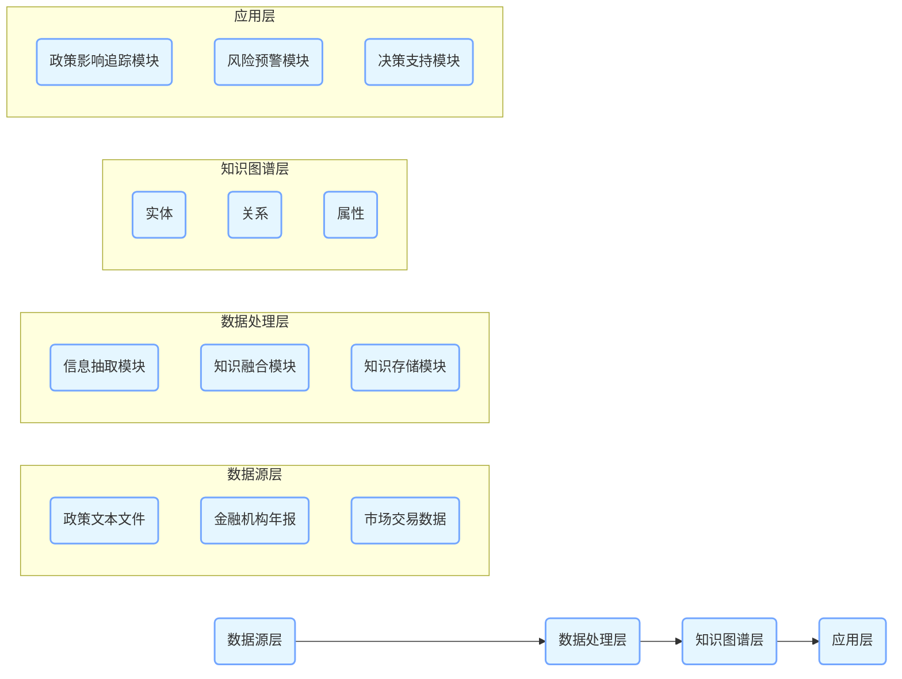

# 构建基于知识图谱的金融监管政策影响追踪系统

> 关键词：知识图谱、金融监管政策、影响追踪系统、信息抽取、图数据库

> 摘要：本文聚焦于构建基于知识图谱的金融监管政策影响追踪系统。在金融市场环境复杂多变的当下，金融监管政策的实施会对各类金融机构、市场和业务产生广泛且复杂的影响。传统的监管政策影响分析方法存在信息整合困难、关系挖掘不足等问题。本系统旨在利用知识图谱强大的知识表示和推理能力，将金融监管政策相关的各类信息进行整合，构建实体和关系网络，实现对政策影响的有效追踪。文章详细阐述了系统的背景、核心概念、算法原理、数学模型、项目实战、实际应用场景等内容，为金融监管领域的政策影响分析提供了一种创新且有效的解决方案。

## 1. 背景介绍 
### 1.1 目的和范围
金融市场的稳定与健康发展离不开有效的监管政策。然而，金融监管政策的实施往往会带来广泛而复杂的影响，涉及金融机构、金融产品、市场参与者等多个层面。传统的政策影响分析方法主要依赖于人工调研和简单的数据统计，难以全面、深入地挖掘政策与各相关实体之间的复杂关系，也无法及时准确地追踪政策影响的动态变化。

本系统的目的在于构建一个基于知识图谱的金融监管政策影响追踪系统，整合金融监管政策相关的各类信息，包括政策文本、金融机构信息、市场数据等，通过知识图谱的构建和推理，实现对政策影响的全面、准确、实时追踪。系统的范围涵盖了金融领域的主要监管政策，以及与之相关的各类金融实体和市场信息。

### 1.2 预期读者
本文的预期读者包括金融监管机构的工作人员、金融机构的风险管理和合规部门人员、从事金融科技研究的学者和研究人员，以及对知识图谱和金融监管政策应用感兴趣的技术爱好者。

### 1.3 文档结构概述
本文将按照以下结构展开：首先介绍系统的背景信息，包括目的、预期读者和文档结构概述；接着阐述系统所涉及的核心概念和它们之间的联系，并通过文本示意图和 Mermaid 流程图进行说明；然后详细讲解系统的核心算法原理和具体操作步骤，同时给出 Python 源代码示例；再介绍系统所涉及的数学模型和公式，并通过举例进行详细说明；之后通过项目实战展示系统的实际开发过程，包括开发环境搭建、源代码实现和代码解读；随后介绍系统的实际应用场景；接着推荐相关的工具和资源；最后总结系统的未来发展趋势与挑战，并提供常见问题与解答以及扩展阅读和参考资料。

### 1.4 术语表
#### 1.4.1 核心术语定义
- **知识图谱**：是一种用图模型来描述知识和建模世界万物之间关联关系的技术方法，由实体、属性和关系构成。
- **金融监管政策**：指金融监管机构为了维护金融市场的稳定、保护投资者利益、促进金融机构合规经营等目的而制定和实施的一系列政策措施。
- **实体**：知识图谱中具有独立意义的对象，如金融机构、政策文件、金融产品等。
- **关系**：表示实体之间的联系，如“影响”“适用”“监管”等。
- **信息抽取**：从非结构化或半结构化的文本中提取出有价值的实体、属性和关系信息的过程。

#### 1.4.2 相关概念解释
- **图数据库**：是一种专门用于存储和处理图数据的数据库，适合存储知识图谱数据，能够高效地处理实体之间的复杂关系。
- **自然语言处理（NLP）**：是计算机科学与语言学的交叉领域，旨在让计算机能够理解和处理人类语言，在信息抽取等环节中发挥重要作用。

#### 1.4.3 缩略词列表
- **NLP**：Natural Language Processing，自然语言处理
- **RDF**：Resource Description Framework，资源描述框架
- **SPARQL**：SPARQL Protocol and RDF Query Language，SPARQL 协议和 RDF 查询语言

## 2. 核心概念与联系 

### 核心概念原理
知识图谱是本系统的核心技术，它将金融监管政策相关的各类信息以图的形式进行表示。在知识图谱中，实体是图中的节点，如金融监管政策、金融机构、金融产品等；关系是图中的边，如政策对金融机构的“监管”关系、金融机构与金融产品的“发行”关系等；属性是实体的特征描述，如政策的发布时间、金融机构的注册资本等。

通过构建这样的知识图谱，我们可以将金融监管政策相关的复杂信息整合在一起，形成一个有机的整体。知识图谱的优势在于它能够清晰地展示实体之间的关系，并且支持基于图的推理和查询，从而帮助我们更好地理解金融监管政策的影响。

### 架构的文本示意图
```plaintext
金融监管政策影响追踪系统架构

数据源层：
- 政策文本文件
- 金融机构年报
- 市场交易数据

数据处理层：
- 信息抽取模块：从数据源中抽取实体、属性和关系
- 知识融合模块：对抽取的信息进行融合和消歧
- 知识存储模块：将融合后的知识存储到图数据库中

知识图谱层：
- 实体：金融监管政策、金融机构、金融产品等
- 关系：监管、适用、发行等
- 属性：政策发布时间、机构注册资本等

应用层：
- 政策影响追踪模块：根据知识图谱推理和查询政策影响
- 风险预警模块：基于政策影响分析进行风险预警
- 决策支持模块：为监管机构和金融机构提供决策支持
```

### Mermaid 流程图


## 3. 核心算法原理 & 具体操作步骤 

### 信息抽取算法原理
信息抽取是构建知识图谱的关键步骤，主要包括实体抽取、属性抽取和关系抽取。这里我们以命名实体识别（NER）算法为例介绍实体抽取的原理。

命名实体识别是自然语言处理中的一项重要任务，其目的是从文本中识别出特定类型的实体，如人名、地名、组织机构名等。在金融领域，我们需要识别出金融监管政策、金融机构、金融产品等实体。

一种常用的命名实体识别算法是基于循环神经网络（RNN）的长短期记忆网络（LSTM）结合条件随机场（CRF）的方法。LSTM 能够处理序列数据的长期依赖关系，而 CRF 则可以利用标签之间的上下文信息进行全局优化。

### Python 源代码示例
```python
import torch
import torch.nn as nn
from torchcrf import CRF

# 定义 LSTM + CRF 模型
class LSTM_CRF(nn.Module):
    def __init__(self, vocab_size, embedding_dim, hidden_dim, num_tags):
        super(LSTM_CRF, self).__init__()
        self.embedding = nn.Embedding(vocab_size, embedding_dim)
        self.lstm = nn.LSTM(embedding_dim, hidden_dim // 2,
                            num_layers=1, bidirectional=True)
        self.hidden2tag = nn.Linear(hidden_dim, num_tags)
        self.crf = CRF(num_tags)

    def forward(self, x):
        embedded = self.embedding(x)
        lstm_out, _ = self.lstm(embedded.view(len(x), 1, -1))
        emissions = self.hidden2tag(lstm_out.view(len(x), -1))
        return emissions

    def decode(self, emissions):
        return self.crf.decode(emissions)

    def loss(self, emissions, tags):
        return -self.crf(emissions, tags)

# 示例数据
vocab_size = 1000
embedding_dim = 100
hidden_dim = 200
num_tags = 5

model = LSTM_CRF(vocab_size, embedding_dim, hidden_dim, num_tags)

# 模拟输入
x = torch.randint(0, vocab_size, (10,))
tags = torch.randint(0, num_tags, (10,))

# 前向传播
emissions = model(x)

# 计算损失
loss = model.loss(emissions, tags)
print(f"Loss: {loss.item()}")

# 解码
pred_tags = model.decode(emissions)
print(f"Predicted tags: {pred_tags}")
```

### 具体操作步骤
1. **数据预处理**：对政策文本、金融机构年报等数据源进行清洗和预处理，包括去除噪声、分词等操作。
2. **模型训练**：使用标注好的训练数据对 LSTM + CRF 模型进行训练，调整模型参数以提高实体识别的准确率。
3. **实体抽取**：将预处理后的文本输入到训练好的模型中，得到识别出的实体。
4. **属性抽取**：通过规则匹配或机器学习算法从文本中抽取实体的属性信息。
5. **关系抽取**：利用依存句法分析、共现分析等方法从文本中抽取实体之间的关系。
6. **知识融合**：对抽取的实体、属性和关系进行融合和消歧，确保知识图谱中信息的一致性和准确性。
7. **知识存储**：将融合后的知识存储到图数据库中，如 Neo4j。

## 4. 数学模型和公式 & 详细讲解 & 举例说明 

### 命名实体识别的数学模型
在基于 LSTM + CRF 的命名实体识别模型中，LSTM 部分的输入是词向量序列 $x = (x_1, x_2, \cdots, x_T)$，其中 $x_t$ 表示第 $t$ 个词的词向量，$T$ 是序列的长度。

LSTM 的输出是隐藏状态序列 $h = (h_1, h_2, \cdots, h_T)$，其中 $h_t$ 可以通过以下公式计算：

$$
\begin{align*}
i_t &= \sigma(W_i x_t + U_i h_{t-1} + b_i) \\
f_t &= \sigma(W_f x_t + U_f h_{t-1} + b_f) \\
o_t &= \sigma(W_o x_t + U_o h_{t-1} + b_o) \\
\tilde{c}_t &= \tanh(W_c x_t + U_c h_{t-1} + b_c) \\
c_t &= f_t \odot c_{t-1} + i_t \odot \tilde{c}_t \\
h_t &= o_t \odot \tanh(c_t)
\end{align*}
$$

其中，$i_t$、$f_t$、$o_t$ 分别是输入门、遗忘门和输出门，$\tilde{c}_t$ 是候选细胞状态，$c_t$ 是细胞状态，$\sigma$ 是 sigmoid 函数，$\odot$ 表示逐元素相乘，$W$ 和 $U$ 是权重矩阵，$b$ 是偏置向量。

LSTM 的输出 $h_t$ 经过线性变换得到发射分数 $e_t(y)$，表示在时刻 $t$ 标签为 $y$ 的分数：

$$
e_t(y) = W_{hy} h_t + b_y
$$

其中，$W_{hy}$ 是权重矩阵，$b_y$ 是偏置向量。

CRF 部分的目标是找到最优的标签序列 $y^* = (y_1^*, y_2^*, \cdots, y_T^*)$，使得条件概率 $P(y|x)$ 最大。条件概率 $P(y|x)$ 可以通过以下公式计算：

$$
P(y|x) = \frac{\exp(\text{Score}(x, y))}{\sum_{y' \in \mathcal{Y}} \exp(\text{Score}(x, y'))}
$$

其中，$\text{Score}(x, y)$ 是标签序列 $y$ 的得分，$\mathcal{Y}$ 是所有可能的标签序列集合。

$\text{Score}(x, y)$ 可以表示为：

$$
\text{Score}(x, y) = \sum_{t=1}^T e_t(y_t) + \sum_{t=1}^{T-1} t(y_t, y_{t+1})
$$

其中，$t(y_t, y_{t+1})$ 是转移分数，表示从标签 $y_t$ 转移到标签 $y_{t+1}$ 的分数。

### 举例说明
假设我们有一个包含金融机构名称的文本：“中国工商银行是一家大型国有银行。”

经过分词后，得到词序列 $x = (\text{中国}, \text{工商银行}, \text{是}, \text{一家}, \text{大型}, \text{国有}, \text{银行}, \text{。})$。

LSTM 模型会对这个词序列进行处理，得到隐藏状态序列 $h$，然后通过线性变换得到发射分数 $e_t(y)$。

假设我们的标签集合为 $\{\text{O}, \text{B-ORG}, \text{I-ORG}\}$，其中 $\text{O}$ 表示非实体，$\text{B-ORG}$ 表示组织机构实体的开始，$\text{I-ORG}$ 表示组织机构实体的内部。

CRF 模型会根据发射分数和转移分数，找到最优的标签序列 $y^* = (\text{O}, \text{B-ORG}, \text{I-ORG}, \text{O}, \text{O}, \text{O}, \text{O}, \text{O})$，从而识别出“中国工商银行”是一个组织机构实体。

## 5. 项目实战：代码实际案例和详细解释说明 

### 5.1  开发环境搭建
#### 硬件环境
- 服务器：推荐使用多核处理器、较大内存（如 16GB 以上）和足够的磁盘空间（如 500GB 以上）的服务器。
- 客户端：普通 PC 或笔记本电脑即可。

#### 软件环境
- 操作系统：推荐使用 Linux 系统，如 Ubuntu 18.04 或更高版本。
- 编程语言：Python 3.7 或更高版本。
- 图数据库：Neo4j 社区版或企业版。
- 开发框架和库：PyTorch、torchcrf、jieba、neo4j-driver 等。

### 5.2  源代码详细实现和代码解读
#### 信息抽取模块
```python
import jieba
import torch
from torchcrf import CRF
import torch.nn as nn

# 定义 LSTM + CRF 模型
class LSTM_CRF(nn.Module):
    def __init__(self, vocab_size, embedding_dim, hidden_dim, num_tags):
        super(LSTM_CRF, self).__init__()
        self.embedding = nn.Embedding(vocab_size, embedding_dim)
        self.lstm = nn.LSTM(embedding_dim, hidden_dim // 2,
                            num_layers=1, bidirectional=True)
        self.hidden2tag = nn.Linear(hidden_dim, num_tags)
        self.crf = CRF(num_tags)

    def forward(self, x):
        embedded = self.embedding(x)
        lstm_out, _ = self.lstm(embedded.view(len(x), 1, -1))
        emissions = self.hidden2tag(lstm_out.view(len(x), -1))
        return emissions

    def decode(self, emissions):
        return self.crf.decode(emissions)

    def loss(self, emissions, tags):
        return -self.crf(emissions, tags)

# 加载模型
vocab_size = 1000
embedding_dim = 100
hidden_dim = 200
num_tags = 5
model = LSTM_CRF(vocab_size, embedding_dim, hidden_dim, num_tags)
model.load_state_dict(torch.load('ner_model.pth'))
model.eval()

# 信息抽取函数
def extract_entities(text):
    words = jieba.lcut(text)
    word_ids = [vocab[word] if word in vocab else 0 for word in words]
    input_tensor = torch.tensor(word_ids)
    emissions = model(input_tensor)
    pred_tags = model.decode(emissions)[0]
    entities = []
    current_entity = []
    for i in range(len(words)):
        tag = tag_list[pred_tags[i]]
        if tag.startswith('B-'):
            if current_entity:
                entities.append(''.join(current_entity))
                current_entity = []
            current_entity.append(words[i])
        elif tag.startswith('I-'):
            if current_entity:
                current_entity.append(words[i])
            else:
                continue
        else:
            if current_entity:
                entities.append(''.join(current_entity))
                current_entity = []
    if current_entity:
        entities.append(''.join(current_entity))
    return entities

# 示例文本
text = "根据《金融监管政策 A》，中国建设银行需要调整业务策略。"
entities = extract_entities(text)
print(f"Extracted entities: {entities}")
```

#### 代码解读
1. **模型定义**：定义了一个 LSTM + CRF 模型，用于命名实体识别。
2. **模型加载**：加载预训练好的模型参数。
3. **信息抽取函数**：对输入的文本进行分词，将词转换为词 ID，输入到模型中进行预测，根据预测的标签序列提取实体。

#### 知识存储模块
```python
from neo4j import GraphDatabase

# 连接到 Neo4j 数据库
uri = "bolt://localhost:7687"
driver = GraphDatabase.driver(uri, auth=("neo4j", "password"))

# 存储实体和关系到 Neo4j
def store_to_neo4j(entities, relationships):
    with driver.session() as session:
        # 创建实体节点
        for entity in entities:
            session.run("MERGE (n:Entity {name: $name})", name=entity)
        # 创建关系
        for rel in relationships:
            session.run("MATCH (a:Entity {name: $source}), (b:Entity {name: $target}) "
                        "MERGE (a)-[r:" + rel[2] + "]->(b)",
                        source=rel[0], target=rel[1])

# 示例关系
relationships = [("《金融监管政策 A》", "中国建设银行", "监管")]
store_to_neo4j(entities, relationships)
```

#### 代码解读
1. **连接数据库**：使用 `neo4j-driver` 连接到 Neo4j 数据库。
2. **存储实体和关系**：通过 Cypher 查询语句在 Neo4j 中创建实体节点和关系。

### 5.3  代码解读与分析
#### 信息抽取模块
- **分词**：使用 `jieba` 库对文本进行分词，将文本转换为词序列。
- **词 ID 转换**：将词转换为对应的词 ID，以便输入到模型中。
- **模型预测**：将词 ID 序列输入到 LSTM + CRF 模型中，得到预测的标签序列。
- **实体提取**：根据预测的标签序列提取实体。

#### 知识存储模块
- **数据库连接**：使用 `neo4j-driver` 连接到 Neo4j 数据库。
- **节点创建**：使用 Cypher 查询语句在 Neo4j 中创建实体节点。
- **关系创建**：使用 Cypher 查询语句在 Neo4j 中创建实体之间的关系。

## 6. 实际应用场景 
### 金融监管机构
- **政策评估**：通过追踪政策对金融机构、金融市场的影响，评估政策的实施效果，为政策的调整和完善提供依据。
- **风险预警**：及时发现政策实施过程中可能引发的金融风险，如金融机构的合规风险、市场的系统性风险等，提前采取措施进行防范。
- **决策支持**：为监管机构的决策提供全面、准确的信息支持，帮助监管机构制定更加科学合理的监管政策。

### 金融机构
- **合规管理**：及时了解监管政策的变化，确保自身业务的合规性，避免因违规行为而受到处罚。
- **风险管理**：评估政策变化对自身业务和风险状况的影响，调整风险管理策略，降低风险。
- **业务创新**：根据政策导向，探索新的业务模式和产品，提高自身的竞争力。

### 投资者
- **投资决策**：了解金融监管政策的影响，评估金融市场和金融机构的风险和收益，做出更加明智的投资决策。
- **风险防范**：提前发现政策变化可能带来的投资风险，采取措施进行防范，保护自己的投资安全。

## 7. 工具和资源推荐
### 7.1 学习资源推荐
#### 7.1.1 书籍推荐
- 《知识图谱：方法、实践与应用》：全面介绍了知识图谱的理论、方法和应用，是学习知识图谱的经典书籍。
- 《Python 自然语言处理实战》：详细介绍了 Python 在自然语言处理中的应用，包括信息抽取、命名实体识别等技术。
- 《金融科技概论》：介绍了金融科技的基本概念、技术和应用，对于理解金融监管政策和金融科技的结合有很大帮助。

#### 7.1.2 在线课程
- Coursera 上的“Natural Language Processing Specialization”：由顶尖大学的教授授课，系统地介绍了自然语言处理的理论和实践。
- edX 上的“Knowledge Graphs”：深入讲解了知识图谱的构建、推理和应用。
- 中国大学 MOOC 上的“金融科技”：介绍了金融科技的前沿技术和应用案例。

#### 7.1.3 技术博客和网站
- 博客园：有很多关于知识图谱、自然语言处理和金融科技的技术文章和经验分享。
- 开源中国：提供了丰富的开源项目和技术资源，对于学习和实践有很大帮助。
- 金融监管机构的官方网站：可以获取最新的金融监管政策和相关信息。

### 7.2 开发工具框架推荐
#### 7.2.1 IDE和编辑器
- PyCharm：是一款专业的 Python 集成开发环境，提供了丰富的代码编辑、调试和项目管理功能。
- Visual Studio Code：是一款轻量级的代码编辑器，支持多种编程语言和插件扩展，适合快速开发和调试。

#### 7.2.2 调试和性能分析工具
- PyTorch Profiler：可以对 PyTorch 模型进行性能分析，帮助优化模型的训练和推理速度。
- Neo4j Browser：是 Neo4j 自带的图形化界面工具，可以方便地对图数据库进行查询和调试。

#### 7.2.3 相关框架和库
- PyTorch：是一个开源的深度学习框架，提供了丰富的神经网络模型和工具，方便进行命名实体识别等自然语言处理任务。
- torchcrf：是一个基于 PyTorch 的条件随机场库，用于实现 CRF 模型。
- jieba：是一个中文分词库，支持多种分词模式，方便对中文文本进行处理。
- neo4j-driver：是 Neo4j 官方提供的 Python 驱动程序，用于连接和操作 Neo4j 图数据库。

### 7.3 相关论文著作推荐
#### 7.3.1 经典论文
- “Entity Linking with a Knowledge Graph: Issues, Techniques, and Solutions”：介绍了实体链接的相关技术和方法，对于知识图谱的构建和应用有重要意义。
- “Named Entity Recognition with Bidirectional LSTM-CNNs”：提出了一种基于双向 LSTM 和卷积神经网络的命名实体识别方法，取得了较好的效果。
- “A Survey on Knowledge Graphs: Representation, Acquisition, and Applications”：对知识图谱的表示、获取和应用进行了全面的综述。

#### 7.3.2 最新研究成果
- 关注 ACL（Association for Computational Linguistics）、KDD（Knowledge Discovery and Data Mining）等顶级学术会议的最新研究成果，了解知识图谱和自然语言处理领域的最新进展。
- 查阅《Journal of Artificial Intelligence Research》、《Artificial Intelligence》等学术期刊上的相关论文，获取最新的研究成果。

#### 7.3.3 应用案例分析
- 分析国内外金融机构和监管机构在金融监管政策影响追踪方面的实际应用案例，学习他们的经验和做法。
- 参考相关的行业报告和研究机构的分析，了解金融科技在金融监管领域的应用现状和发展趋势。

## 8. 总结：未来发展趋势与挑战
### 未来发展趋势
- **多源数据融合**：未来的金融监管政策影响追踪系统将融合更多来源的数据，如社交媒体数据、新闻资讯数据等，以更全面地了解政策的影响。
- **深度学习与知识图谱的深度融合**：利用深度学习技术进一步提高知识图谱的构建和推理能力，如使用预训练语言模型进行信息抽取和关系推理。
- **智能化决策支持**：系统将具备更强的智能化决策支持能力，能够根据政策影响分析结果自动生成决策建议，为监管机构和金融机构提供更高效的决策支持。
- **跨领域应用**：金融监管政策影响追踪系统的技术和方法将逐渐应用到其他领域，如医疗、教育等，实现跨领域的知识管理和决策支持。

### 挑战
- **数据质量和一致性**：金融领域的数据来源广泛，数据质量参差不齐，如何保证数据的质量和一致性是一个挑战。
- **知识图谱的可扩展性**：随着金融市场的发展和监管政策的不断变化，知识图谱需要不断更新和扩展，如何保证知识图谱的可扩展性是一个关键问题。
- **隐私和安全问题**：金融数据涉及大量的敏感信息，如何在保证系统功能的同时，保护数据的隐私和安全是一个重要的挑战。
- **技术人才短缺**：构建基于知识图谱的金融监管政策影响追踪系统需要具备多领域知识和技能的技术人才，目前这类人才相对短缺。

## 9. 附录：常见问题与解答
### 1. 如何提高命名实体识别的准确率？
- **数据标注**：确保训练数据的标注准确、一致，可以通过人工审核和多轮标注来提高标注质量。
- **模型优化**：调整模型的参数，如学习率、批次大小等，使用更复杂的模型结构，如 BERT 等预训练语言模型。
- **特征工程**：除了词向量特征外，还可以引入词性、词频等特征，提高模型的性能。

### 2. 如何处理知识图谱中的实体消歧问题？
- **上下文信息**：利用实体所在的上下文信息，如句子、段落等，来判断实体的具体含义。
- **知识库匹配**：将实体与外部知识库进行匹配，如维基百科、百度百科等，获取实体的更多信息，帮助消歧。
- **机器学习算法**：使用机器学习算法，如聚类算法、分类算法等，对实体进行分类和消歧。

### 3. 如何保证图数据库的性能？
- **索引优化**：在图数据库中创建合适的索引，提高查询效率。
- **数据分区**：对大规模的图数据进行分区存储，减少数据的读写压力。
- **硬件升级**：根据系统的性能需求，升级服务器的硬件配置，如增加内存、提高磁盘读写速度等。

## 10. 扩展阅读 & 参考资料
### 扩展阅读
- 《人工智能：一种现代的方法》：全面介绍了人工智能的基本概念、技术和应用，对于深入理解知识图谱和自然语言处理有很大帮助。
- 《大数据时代》：介绍了大数据的基本概念、技术和应用，对于理解金融领域的数据处理和分析有重要意义。
- 《金融风险管理》：介绍了金融风险管理的基本理论和方法，对于理解金融监管政策的制定和实施有很大帮助。

### 参考资料
- 金融监管机构的官方网站，获取最新的金融监管政策和相关信息。
- 学术数据库，如 IEEE Xplore、ACM Digital Library 等，获取相关的学术论文和研究成果。
- 开源项目的官方文档，如 PyTorch、Neo4j 等，获取技术实现的详细信息。