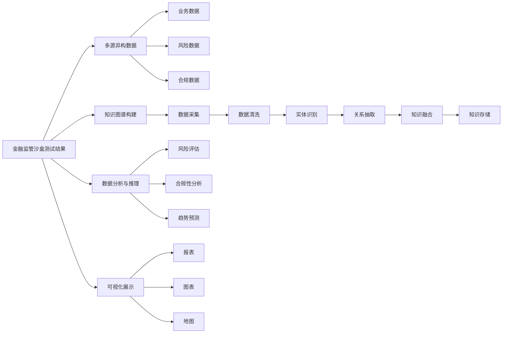

# 构建基于知识图谱的金融监管沙盒测试结果分析平台

> 关键词：知识图谱、金融监管沙盒、测试结果分析平台、人工智能、数据挖掘、金融科技、合规性分析

> 摘要：本文聚焦于构建基于知识图谱的金融监管沙盒测试结果分析平台。金融监管沙盒作为一种创新的监管模式，旨在平衡金融创新与风险管控。而知识图谱凭借其强大的语义表达和关系建模能力，能够有效整合和分析沙盒测试中的多源异构数据。文章首先介绍了该平台构建的背景和相关核心概念，接着详细阐述了核心算法原理、数学模型及具体操作步骤。通过项目实战展示了平台的具体实现过程，并探讨了其实际应用场景。此外，还推荐了相关的工具和资源，最后对未来发展趋势与挑战进行了总结，同时提供了常见问题解答和扩展阅读参考资料，为构建高效、智能的金融监管沙盒测试结果分析平台提供全面的技术指导。

## 1. 背景介绍 
### 1.1 目的和范围
金融行业的快速发展和创新，使得传统的监管方式面临挑战。金融监管沙盒作为一种新兴的监管机制，允许金融创新企业在可控的环境中进行测试，以降低创新风险并促进金融科技的发展。然而，沙盒测试会产生大量的多源异构数据，包括业务数据、风险数据、合规数据等，如何高效地整合和分析这些数据，从海量信息中提取有价值的知识，是当前金融监管面临的重要问题。

本平台的目的是构建一个基于知识图谱的金融监管沙盒测试结果分析平台，利用知识图谱的语义表达和关系推理能力，实现对沙盒测试数据的深度挖掘和分析，为监管机构提供全面、准确的决策支持。平台的范围涵盖了数据采集、数据清洗、知识图谱构建、数据分析和可视化展示等环节，旨在实现金融监管沙盒测试结果的自动化、智能化分析。

### 1.2 预期读者
本文的预期读者包括金融监管机构的工作人员、金融科技企业的研发人员、数据科学家、人工智能专家以及对金融监管和知识图谱技术感兴趣的研究人员。这些读者希望通过了解基于知识图谱的金融监管沙盒测试结果分析平台的构建方法和技术原理，提升自身在金融监管和数据分析领域的能力，推动金融行业的创新和发展。

### 1.3 文档结构概述
本文将按照以下结构进行阐述：首先介绍相关背景和核心概念，包括知识图谱和金融监管沙盒的基本原理和联系；接着详细讲解核心算法原理和具体操作步骤，通过 Python 代码进行示例；然后介绍数学模型和公式，并举例说明；通过项目实战展示平台的具体实现过程，包括开发环境搭建、源代码实现和代码解读；探讨平台的实际应用场景；推荐相关的工具和资源；总结未来发展趋势与挑战；提供常见问题解答和扩展阅读参考资料。

### 1.4 术语表
#### 1.4.1 核心术语定义
- **知识图谱**：是一种语义网络，用于表示实体及其之间的关系。它将现实世界中的各种知识以图的形式进行组织和存储，通过节点表示实体，边表示实体之间的关系，从而实现对知识的结构化表示和推理。
- **金融监管沙盒**：是一种创新的监管机制，允许金融科技企业在一个安全的测试环境中，对创新产品、服务或商业模式进行试验，而不必立即受到全部监管要求的约束。监管机构可以在试验过程中监测和评估创新的风险和收益，为后续的监管决策提供依据。
- **测试结果分析平台**：是一个集成化的系统，用于对金融监管沙盒测试过程中产生的数据进行采集、处理、分析和展示，帮助监管机构和企业了解测试情况，评估创新的可行性和风险。

#### 1.4.2 相关概念解释
- **多源异构数据**：指来自不同数据源、具有不同数据结构和格式的数据。在金融监管沙盒测试中，多源异构数据可能包括企业提交的业务数据、监管机构收集的风险数据、市场数据等。
- **语义表达**：是指用计算机能够理解的方式来表示知识的含义。知识图谱通过定义实体和关系的语义，使得计算机能够对知识进行推理和查询。
- **关系推理**：是指根据知识图谱中已有的实体和关系，推导出新的实体和关系的过程。关系推理可以帮助发现隐藏的知识和潜在的风险。

#### 1.4.3 缩略词列表
- **API**：Application Programming Interface（应用程序编程接口）
- **ETL**：Extract, Transform, Load（数据抽取、转换、加载）
- **KG**：Knowledge Graph（知识图谱）
- **NLP**：Natural Language Processing（自然语言处理）

## 2. 核心概念与联系 

### 知识图谱原理
知识图谱是一种基于图的数据结构，由节点（实体）和边（关系）组成。节点表示现实世界中的实体，如企业、产品、客户等；边表示实体之间的关系，如“属于”、“关联”、“交易”等。知识图谱通过对实体和关系的语义定义，实现了对知识的结构化表示和推理。

知识图谱的构建过程通常包括数据采集、数据清洗、实体识别、关系抽取、知识融合和知识存储等步骤。通过这些步骤，可以将多源异构数据转化为统一的知识图谱结构，方便进行数据分析和推理。

### 金融监管沙盒原理
金融监管沙盒是一种创新的监管模式，旨在为金融科技企业提供一个安全的测试环境，促进金融创新的发展。在沙盒测试过程中，企业可以在一定的监管豁免条件下，对创新产品、服务或商业模式进行试验。监管机构则通过监测和评估试验过程，了解创新的风险和收益，为后续的监管决策提供依据。

金融监管沙盒的主要特点包括：灵活性、可控性、创新性和风险适应性。通过沙盒测试，监管机构可以在保护消费者权益的前提下，鼓励金融科技企业进行创新，同时及时发现和防范潜在的风险。

### 知识图谱与金融监管沙盒的联系
知识图谱在金融监管沙盒测试结果分析中具有重要作用。通过构建金融监管沙盒知识图谱，可以将沙盒测试中的多源异构数据进行整合和关联，形成一个统一的知识体系。知识图谱的语义表达和关系推理能力可以帮助监管机构更好地理解沙盒测试数据，发现潜在的风险和问题，为监管决策提供支持。

例如，通过知识图谱可以分析企业之间的关联关系、产品之间的交叉风险、客户的行为模式等，从而实现对金融监管沙盒测试结果的全面、深入分析。

### 文本示意图
```plaintext
金融监管沙盒测试结果
|
|-- 多源异构数据
|   |-- 业务数据
|   |-- 风险数据
|   |-- 合规数据
|
|-- 知识图谱构建
|   |-- 数据采集
|   |-- 数据清洗
|   |-- 实体识别
|   |-- 关系抽取
|   |-- 知识融合
|   |-- 知识存储
|
|-- 数据分析与推理
|   |-- 风险评估
|   |-- 合规性分析
|   |-- 趋势预测
|
|-- 可视化展示
|   |-- 报表
|   |-- 图表
|   |-- 地图
```

### Mermaid 流程图


## 3. 核心算法原理 & 具体操作步骤 

### 实体识别算法
实体识别是知识图谱构建的重要步骤，其目的是从文本数据中识别出实体。常见的实体识别算法包括基于规则的方法、基于机器学习的方法和基于深度学习的方法。

#### 基于深度学习的实体识别算法（以 BERT 为例）
BERT（Bidirectional Encoder Representations from Transformers）是一种预训练的语言模型，具有强大的语义理解能力。下面是一个使用 Python 和 PyTorch 实现基于 BERT 的实体识别的示例代码：

```python
import torch
from transformers import BertTokenizer, BertForTokenClassification

# 加载预训练的 BERT 模型和分词器
tokenizer = BertTokenizer.from_pretrained('bert-base-chinese')
model = BertForTokenClassification.from_pretrained('bert-base-chinese', num_labels=3)  # 假设 3 个标签：O（非实体）、B（实体开始）、I（实体内部）

# 输入文本
text = "某银行推出了一款新的理财产品"

# 分词
tokens = tokenizer.tokenize(text)
input_ids = tokenizer.convert_tokens_to_ids(tokens)
input_ids = torch.tensor([input_ids])

# 模型预测
with torch.no_grad():
    outputs = model(input_ids)
    logits = outputs.logits
    predicted_labels = torch.argmax(logits, dim=-1)

# 解码预测结果
label_map = {0: 'O', 1: 'B', 2: 'I'}
predicted_labels = [label_map[label.item()] for label in predicted_labels[0]]

# 输出结果
for token, label in zip(tokens, predicted_labels):
    print(f"Token: {token}, Label: {label}")
```

### 关系抽取算法
关系抽取是从文本数据中提取实体之间的关系。常见的关系抽取算法包括基于规则的方法、基于机器学习的方法和基于深度学习的方法。

#### 基于深度学习的关系抽取算法（以 BiLSTM + Attention 为例）
BiLSTM（Bidirectional Long Short-Term Memory）是一种双向的循环神经网络，能够捕捉文本的上下文信息。Attention 机制可以帮助模型聚焦于文本中的重要部分。下面是一个使用 Python 和 PyTorch 实现基于 BiLSTM + Attention 的关系抽取的示例代码：

```python
import torch
import torch.nn as nn
import torch.nn.functional as F

class BiLSTM_Attention(nn.Module):
    def __init__(self, vocab_size, embedding_dim, hidden_dim, num_classes):
        super(BiLSTM_Attention, self).__init__()
        self.embedding = nn.Embedding(vocab_size, embedding_dim)
        self.lstm = nn.LSTM(embedding_dim, hidden_dim, bidirectional=True)
        self.fc = nn.Linear(hidden_dim * 2, num_classes)

    def attention(self, lstm_output, final_state):
        hidden = final_state.view(-1, self.lstm.hidden_size * 2, 1)
        attn_weights = torch.bmm(lstm_output, hidden).squeeze(2)
        soft_attn_weights = F.softmax(attn_weights, 1)
        new_hidden_state = torch.bmm(lstm_output.transpose(1, 2), soft_attn_weights.unsqueeze(2)).squeeze(2)
        return new_hidden_state

    def forward(self, input_ids):
        embedded = self.embedding(input_ids)
        output, (hn, cn) = self.lstm(embedded)
        attn_output = self.attention(output, hn)
        logits = self.fc(attn_output)
        return logits

# 示例参数
vocab_size = 10000
embedding_dim = 100
hidden_dim = 128
num_classes = 5  # 假设 5 种关系类型

# 初始化模型
model = BiLSTM_Attention(vocab_size, embedding_dim, hidden_dim, num_classes)

# 输入数据
input_ids = torch.randint(0, vocab_size, (1, 10))  # 假设输入序列长度为 10

# 模型预测
logits = model(input_ids)
predicted_labels = torch.argmax(logits, dim=-1)

print(f"Predicted labels: {predicted_labels}")
```

### 知识融合算法
知识融合是将不同来源的知识进行整合，消除冲突和冗余，形成统一的知识图谱。常见的知识融合算法包括基于规则的方法、基于机器学习的方法和基于本体的方法。

#### 基于本体的知识融合算法
本体是一种对领域知识的形式化表示，通过定义概念、属性和关系，可以实现对知识的语义理解和融合。下面是一个简单的基于本体的知识融合的示例步骤：

1. 定义本体：使用本体语言（如 OWL）定义金融监管领域的概念、属性和关系。
2. 数据映射：将不同来源的数据映射到本体的概念和属性上。
3. 冲突检测：检测不同来源的数据之间的冲突，如实体名称不一致、属性值冲突等。
4. 冲突解决：采用规则或机器学习方法解决冲突，如选择可信度高的数据、合并数据等。
5. 知识合并：将处理后的数据合并到统一的知识图谱中。

### 具体操作步骤
1. **数据采集**：从金融监管沙盒测试系统、企业信息系统、市场数据平台等多源数据源中采集相关数据，包括业务数据、风险数据、合规数据等。
2. **数据清洗**：对采集到的数据进行清洗，去除噪声、重复数据和错误数据，统一数据格式和编码。
3. **实体识别**：使用上述实体识别算法从清洗后的数据中识别出实体，如企业、产品、客户等。
4. **关系抽取**：使用关系抽取算法从数据中提取实体之间的关系，如“发行”、“购买”、“监管”等。
5. **知识融合**：将不同来源的实体和关系进行融合，消除冲突和冗余，形成统一的知识图谱。
6. **知识存储**：将构建好的知识图谱存储到图数据库（如 Neo4j）中，方便后续的查询和分析。
7. **数据分析与推理**：利用知识图谱的语义表达和关系推理能力，对金融监管沙盒测试结果进行风险评估、合规性分析、趋势预测等。
8. **可视化展示**：将分析结果以报表、图表、地图等形式进行可视化展示，为监管机构提供直观的决策支持。

## 4. 数学模型和公式 & 详细讲解 & 举例说明 

### 实体识别的数学模型
在基于深度学习的实体识别中，通常使用条件随机场（CRF）作为解码层，以考虑标签之间的依赖关系。CRF 是一种概率图模型，其目标是最大化给定输入序列下标签序列的条件概率。

设输入序列为 $x = (x_1, x_2, \cdots, x_n)$，标签序列为 $y = (y_1, y_2, \cdots, y_n)$，CRF 的条件概率公式为：

$$P(y|x) = \frac{\exp(\sum_{i=1}^{n} \sum_{k} \lambda_k t_k(y_{i-1}, y_i, x, i) + \sum_{i=1}^{n} \sum_{l} \mu_l s_l(y_i, x, i))}{Z(x)}$$

其中，$t_k(y_{i-1}, y_i, x, i)$ 是转移特征函数，$s_l(y_i, x, i)$ 是状态特征函数，$\lambda_k$ 和 $\mu_l$ 是对应的权重参数，$Z(x)$ 是归一化因子。

### 关系抽取的数学模型
在基于 BiLSTM + Attention 的关系抽取中，模型的目标是最大化正确关系标签的概率。设输入序列为 $x = (x_1, x_2, \cdots, x_n)$，关系标签为 $r$，模型的损失函数通常使用交叉熵损失：

$$L = -\log P(r|x)$$

其中，$P(r|x)$ 是模型预测的关系标签 $r$ 的概率。

### 知识融合的数学模型
在基于本体的知识融合中，通常使用相似度度量来判断实体和关系的一致性。常见的相似度度量方法包括编辑距离、余弦相似度等。

#### 编辑距离
编辑距离是指将一个字符串转换为另一个字符串所需的最少编辑操作（插入、删除、替换）次数。设字符串 $s_1$ 和 $s_2$ 的编辑距离为 $d(s_1, s_2)$，可以使用动态规划算法计算：

$$d(s_1[i], s_2[j]) = \begin{cases}
i & \text{if } j = 0 \\
j & \text{if } i = 0 \\
d(s_1[i-1], s_2[j-1]) & \text{if } s_1[i] = s_2[j] \\
1 + \min(d(s_1[i-1], s_2[j]), d(s_1[i], s_2[j-1]), d(s_1[i-1], s_2[j-1])) & \text{if } s_1[i] \neq s_2[j]
\end{cases}$$

#### 余弦相似度
余弦相似度是指两个向量之间夹角的余弦值，用于衡量向量之间的相似程度。设向量 $\vec{a}$ 和 $\vec{b}$ 的余弦相似度为 $\cos(\vec{a}, \vec{b})$，计算公式为：

$$\cos(\vec{a}, \vec{b}) = \frac{\vec{a} \cdot \vec{b}}{\|\vec{a}\| \|\vec{b}\|}$$

### 举例说明
#### 实体识别示例
假设输入文本为“某银行推出了一款新的理财产品”，经过实体识别后，识别出的实体为“银行”和“理财产品”，对应的标签分别为“B - 机构”和“B - 产品”。

#### 关系抽取示例
假设输入文本为“某银行发行了一款理财产品”，经过关系抽取后，提取出的关系为“发行”，关系的主体为“银行”，客体为“理财产品”。

#### 知识融合示例
假设从两个不同数据源中获取到关于同一家银行的信息，一个数据源中银行名称为“ABC 银行”，另一个数据源中银行名称为“ABC 商业银行”。通过计算编辑距离或余弦相似度，可以判断这两个名称表示的是同一家银行，从而进行知识融合。

## 5. 项目实战：代码实际案例和详细解释说明 

### 5.1  开发环境搭建
#### 硬件环境
- 服务器：CPU 至少 4 核，内存至少 16GB，硬盘容量至少 500GB。
- 存储设备：建议使用高速固态硬盘（SSD），以提高数据读写速度。

#### 软件环境
- 操作系统：Ubuntu 18.04 或更高版本。
- 编程语言：Python 3.7 或更高版本。
- 数据库：Neo4j 图数据库，用于存储知识图谱。
- 深度学习框架：PyTorch 1.7 或更高版本。
- 自然语言处理库：transformers、nltk 等。

#### 安装步骤
1. 安装 Python 和相关依赖库：
```bash
sudo apt update
sudo apt install python3 python3-pip
pip3 install torch transformers nltk
```
2. 安装 Neo4j 图数据库：
```bash
wget -O - https://debian.neo4j.com/neotechnology.gpg.key | sudo apt-key add -
echo 'deb https://debian.neo4j.com stable 4.4' | sudo tee -a /etc/apt/sources.list.d/neo4j.list
sudo apt update
sudo apt install neo4j
sudo systemctl start neo4j
```

### 5.2  源代码详细实现和代码解读
#### 数据采集模块
```python
import requests
import json

# 从 API 获取数据
def get_data_from_api(url):
    response = requests.get(url)
    if response.status_code == 200:
        return json.loads(response.text)
    else:
        return None

# 示例 API 地址
api_url = "https://example.com/api/data"
data = get_data_from_api(api_url)
if data:
    print("Data collected successfully.")
else:
    print("Failed to collect data.")
```
代码解读：该模块使用 `requests` 库从指定的 API 地址获取数据，并将数据解析为 JSON 格式。如果请求成功，返回解析后的数据；否则返回 `None`。

#### 数据清洗模块
```python
import re

# 去除噪声数据
def clean_data(data):
    cleaned_data = []
    for item in data:
        # 去除特殊字符
        item = re.sub(r'[^\w\s]', '', item)
        # 去除多余空格
        item = re.sub(r'\s+', ' ', item).strip()
        cleaned_data.append(item)
    return cleaned_data

# 示例数据
raw_data = ["  This is some noisy data!  ", "Another item with, punctuation."]
cleaned_data = clean_data(raw_data)
print("Cleaned data:", cleaned_data)
```
代码解读：该模块使用正则表达式去除数据中的特殊字符和多余空格，以达到数据清洗的目的。

#### 实体识别模块
```python
from transformers import BertTokenizer, BertForTokenClassification
import torch

# 加载预训练模型和分词器
tokenizer = BertTokenizer.from_pretrained('bert-base-chinese')
model = BertForTokenClassification.from_pretrained('bert-base-chinese', num_labels=3)

# 实体识别函数
def entity_recognition(text):
    tokens = tokenizer.tokenize(text)
    input_ids = tokenizer.convert_tokens_to_ids(tokens)
    input_ids = torch.tensor([input_ids])

    with torch.no_grad():
        outputs = model(input_ids)
        logits = outputs.logits
        predicted_labels = torch.argmax(logits, dim=-1)

    label_map = {0: 'O', 1: 'B', 2: 'I'}
    predicted_labels = [label_map[label.item()] for label in predicted_labels[0]]

    entities = []
    entity = ""
    for token, label in zip(tokens, predicted_labels):
        if label == 'B':
            if entity:
                entities.append(entity)
            entity = token
        elif label == 'I':
            entity += token
        else:
            if entity:
                entities.append(entity)
            entity = ""

    if entity:
        entities.append(entity)

    return entities

# 示例文本
text = "某银行推出了一款新的理财产品"
entities = entity_recognition(text)
print("Entities:", entities)
```
代码解读：该模块使用预训练的 BERT 模型进行实体识别。首先将输入文本分词并转换为输入 ID，然后通过模型进行预测，最后根据预测结果提取实体。

#### 关系抽取模块
```python
import torch
import torch.nn as nn
import torch.nn.functional as F

class BiLSTM_Attention(nn.Module):
    def __init__(self, vocab_size, embedding_dim, hidden_dim, num_classes):
        super(BiLSTM_Attention, self).__init__()
        self.embedding = nn.Embedding(vocab_size, embedding_dim)
        self.lstm = nn.LSTM(embedding_dim, hidden_dim, bidirectional=True)
        self.fc = nn.Linear(hidden_dim * 2, num_classes)

    def attention(self, lstm_output, final_state):
        hidden = final_state.view(-1, self.lstm.hidden_size * 2, 1)
        attn_weights = torch.bmm(lstm_output, hidden).squeeze(2)
        soft_attn_weights = F.softmax(attn_weights, 1)
        new_hidden_state = torch.bmm(lstm_output.transpose(1, 2), soft_attn_weights.unsqueeze(2)).squeeze(2)
        return new_hidden_state

    def forward(self, input_ids):
        embedded = self.embedding(input_ids)
        output, (hn, cn) = self.lstm(embedded)
        attn_output = self.attention(output, hn)
        logits = self.fc(attn_output)
        return logits

# 示例参数
vocab_size = 10000
embedding_dim = 100
hidden_dim = 128
num_classes = 5

# 初始化模型
model = BiLSTM_Attention(vocab_size, embedding_dim, hidden_dim, num_classes)

# 关系抽取函数
def relation_extraction(text):
    # 假设这里已经将文本转换为输入 ID
    input_ids = torch.randint(0, vocab_size, (1, 10))

    logits = model(input_ids)
    predicted_labels = torch.argmax(logits, dim=-1)

    relation_map = {0: '发行', 1: '购买', 2: '监管', 3: '合作', 4: '投资'}
    relation = relation_map[predicted_labels.item()]

    return relation

# 示例文本
text = "某银行发行了一款理财产品"
relation = relation_extraction(text)
print("Relation:", relation)
```
代码解读：该模块使用 BiLSTM + Attention 模型进行关系抽取。首先定义模型结构，然后通过模型进行预测，最后根据预测结果映射到具体的关系类型。

#### 知识图谱构建模块
```python
from py2neo import Graph, Node, Relationship

# 连接 Neo4j 数据库
graph = Graph("bolt://localhost:7687", auth=("neo4j", "password"))

# 构建知识图谱函数
def build_knowledge_graph(entities, relation):
    # 创建实体节点
    for entity in entities:
        node = Node("Entity", name=entity)
        graph.merge(node, "Entity", "name")

    # 创建关系
    if len(entities) >= 2:
        start_node = graph.nodes.match("Entity", name=entities[0]).first()
        end_node = graph.nodes.match("Entity", name=entities[1]).first()
        rel = Relationship(start_node, relation, end_node)
        graph.merge(rel)

# 示例实体和关系
entities = ["银行", "理财产品"]
relation = "发行"
build_knowledge_graph(entities, relation)
print("Knowledge graph built successfully.")
```
代码解读：该模块使用 `py2neo` 库连接 Neo4j 数据库，并根据实体和关系构建知识图谱。首先创建实体节点，然后创建实体之间的关系。

### 5.3  代码解读与分析
#### 数据采集模块
该模块的主要功能是从外部数据源获取数据。使用 `requests` 库可以方便地发送 HTTP 请求并获取响应数据。在实际应用中，需要根据不同的数据源调整 API 地址和请求参数。

#### 数据清洗模块
数据清洗是数据预处理的重要步骤，它可以去除数据中的噪声和错误，提高数据质量。使用正则表达式可以方便地进行文本处理，如去除特殊字符和多余空格。

#### 实体识别模块
实体识别使用预训练的 BERT 模型，该模型具有强大的语义理解能力。通过将输入文本分词并转换为输入 ID，然后通过模型进行预测，可以准确地识别出文本中的实体。

#### 关系抽取模块
关系抽取使用 BiLSTM + Attention 模型，该模型可以捕捉文本的上下文信息并聚焦于重要部分。通过模型预测可以得到实体之间的关系类型。

#### 知识图谱构建模块
知识图谱构建模块使用 `py2neo` 库连接 Neo4j 数据库，并根据实体和关系构建知识图谱。通过合并节点和关系，可以将数据存储到图数据库中，方便后续的查询和分析。

## 6. 实际应用场景 
### 风险评估
基于知识图谱的金融监管沙盒测试结果分析平台可以对金融创新产品和服务进行全面的风险评估。通过分析企业之间的关联关系、产品的风险特征、客户的信用状况等，可以发现潜在的风险点，并及时采取措施进行防范。

例如，通过知识图谱可以分析出某个金融创新产品与多个高风险企业存在关联关系，或者某个客户的信用记录不佳，从而对该产品或客户的风险进行评估和预警。

### 合规性分析
平台可以对金融创新产品和服务的合规性进行分析。通过将产品和服务的信息与监管政策和法规进行对比，可以发现是否存在违规行为。

例如，知识图谱可以记录监管政策和法规的相关条款，以及金融创新产品和服务的具体信息。通过关系推理可以判断产品和服务是否符合监管要求，如是否存在违规销售、违规操作等行为。

### 趋势预测
利用知识图谱的语义表达和关系推理能力，平台可以对金融市场的发展趋势进行预测。通过分析历史数据、市场动态和企业行为等，可以发现潜在的趋势和规律。

例如，通过分析金融创新产品的推出时间、市场反响和客户需求等信息，可以预测未来金融市场的发展方向，为监管机构和企业提供决策支持。

### 智能决策支持
平台可以为监管机构提供智能决策支持。通过对金融监管沙盒测试结果的分析和推理，平台可以生成可视化的报表和图表，为监管机构提供直观的决策依据。

例如，监管机构可以通过平台了解金融创新产品的风险状况、合规性情况和市场趋势等信息，从而做出科学、合理的监管决策。

## 7. 工具和资源推荐
### 7.1 学习资源推荐
#### 7.1.1 书籍推荐
- 《知识图谱：方法、实践与应用》：全面介绍了知识图谱的基本概念、技术方法和应用案例，是学习知识图谱的经典书籍。
- 《Python 自然语言处理》：详细介绍了 Python 在自然语言处理领域的应用，包括文本处理、实体识别、关系抽取等技术。
- 《金融科技：架构与实践》：介绍了金融科技的发展趋势、技术架构和应用实践，对于理解金融监管沙盒和金融科技的结合具有重要参考价值。

#### 7.1.2 在线课程
- Coursera 上的“Natural Language Processing Specialization”：由斯坦福大学教授授课，全面介绍了自然语言处理的理论和实践。
- edX 上的“Knowledge Graphs”：介绍了知识图谱的基本概念、构建方法和应用场景。
- 中国大学 MOOC 上的“金融科技前沿”：介绍了金融科技的最新发展和应用，包括金融监管沙盒、区块链、人工智能等技术。

#### 7.1.3 技术博客和网站
- 开源中国：提供了丰富的技术文章和开源项目，涵盖了知识图谱、自然语言处理、金融科技等领域。
- 博客园：有很多技术专家分享的技术文章和经验，对于学习和实践具有重要参考价值。
- 机器之心：专注于人工智能和机器学习领域的技术报道和分析，提供了最新的技术动态和研究成果。

### 7.2 开发工具框架推荐
#### 7.2.1 IDE和编辑器
- PyCharm：是一款专业的 Python 集成开发环境，具有强大的代码编辑、调试和分析功能。
- Visual Studio Code：是一款轻量级的代码编辑器，支持多种编程语言和插件扩展，适合快速开发和调试。

#### 7.2.2 调试和性能分析工具
- PDB：Python 自带的调试器，可以帮助开发者定位和解决代码中的问题。
- Py-Spy：是一款性能分析工具，可以分析 Python 代码的性能瓶颈，提高代码的运行效率。

#### 7.2.3 相关框架和库
- Transformers：是一个开源的自然语言处理库，提供了多种预训练模型，如 BERT、GPT 等，方便进行实体识别、关系抽取等任务。
- PyTorch：是一个开源的深度学习框架，具有强大的计算能力和灵活的模型构建能力，适合进行深度学习任务的开发。
- Neo4j Python Driver：是 Neo4j 图数据库的 Python 驱动程序，方便进行知识图谱的存储和查询。

### 7.3 相关论文著作推荐
#### 7.3.1 经典论文
- “BERT: Pre-training of Deep Bidirectional Transformers for Language Understanding”：介绍了 BERT 模型的预训练方法和应用，是自然语言处理领域的经典论文。
- “Knowledge Graph Embedding: A Survey of Approaches and Applications”：对知识图谱嵌入技术进行了全面的综述，介绍了各种知识图谱嵌入方法和应用场景。
- “Financial Technology (FinTech): A Framework for Analysis”：提出了金融科技的分析框架，对于理解金融科技的发展和应用具有重要意义。

#### 7.3.2 最新研究成果
- 关注顶级学术会议，如 AAAI、IJCAI、KDD 等，这些会议上的研究成果代表了知识图谱、自然语言处理和金融科技领域的最新进展。
- 查阅相关学术期刊，如 Journal of Artificial Intelligence Research、ACM Transactions on Knowledge Discovery from Data 等，获取最新的研究论文。

#### 7.3.3 应用案例分析
- 分析国内外金融监管机构和金融科技企业的实际应用案例，了解基于知识图谱的金融监管沙盒测试结果分析平台的应用效果和经验教训。
- 参考行业报告和白皮书，如 Gartner、麦肯锡等机构发布的报告，了解金融科技的发展趋势和应用场景。

## 8. 总结：未来发展趋势与挑战
### 未来发展趋势
#### 智能化程度不断提高
随着人工智能技术的不断发展，基于知识图谱的金融监管沙盒测试结果分析平台将越来越智能化。平台将能够自动识别和分析复杂的金融数据，发现潜在的风险和问题，并提供智能决策支持。

#### 与其他技术深度融合
平台将与区块链、物联网、大数据等技术深度融合，实现金融数据的安全共享和高效处理。例如，利用区块链技术可以实现金融数据的不可篡改和可追溯，提高数据的可信度和安全性。

#### 跨领域应用拓展
平台的应用领域将不断拓展，不仅局限于金融监管领域，还将应用于其他领域，如医疗、教育、交通等。通过构建跨领域的知识图谱，可以实现不同领域数据的整合和分析，为各行业的发展提供支持。

### 挑战
#### 数据质量和安全问题
金融数据的质量和安全是构建基于知识图谱的金融监管沙盒测试结果分析平台的关键问题。数据的准确性、完整性和一致性将直接影响平台的分析结果和决策支持能力。同时，金融数据的安全性也至关重要，需要采取有效的措施保护数据的隐私和安全。

#### 知识图谱构建的复杂性
知识图谱的构建是一个复杂的过程，需要涉及数据采集、清洗、实体识别、关系抽取、知识融合等多个环节。每个环节都需要专业的技术和算法支持，并且需要处理多源异构数据，这增加了知识图谱构建的难度和复杂度。

#### 技术人才短缺
基于知识图谱的金融监管沙盒测试结果分析平台需要具备金融、计算机、数学等多学科知识的技术人才。目前，这类复合型人才相对短缺，这给平台的开发和应用带来了一定的挑战。

## 9. 附录：常见问题与解答
### 1. 知识图谱构建过程中如何处理多源异构数据？
在知识图谱构建过程中，处理多源异构数据可以采用以下步骤：首先进行数据采集，从不同的数据源中获取相关数据；然后进行数据清洗，去除噪声、重复数据和错误数据，统一数据格式和编码；接着进行实体识别和关系抽取，从清洗后的数据中提取实体和关系；最后进行知识融合，将不同来源的实体和关系进行整合，消除冲突和冗余，形成统一的知识图谱。

### 2. 如何提高实体识别和关系抽取的准确率？
可以采用以下方法提高实体识别和关系抽取的准确率：使用预训练的深度学习模型，如 BERT、GPT 等，这些模型具有强大的语义理解能力；增加训练数据的规模和多样性，提高模型的泛化能力；采用集成学习的方法，将多个模型的预测结果进行融合，提高预测的准确率；进行模型调优，调整模型的超参数，以达到最佳的性能。

### 3. 知识图谱在金融监管沙盒测试结果分析中有哪些优势？
知识图谱在金融监管沙盒测试结果分析中具有以下优势：能够整合多源异构数据，形成统一的知识体系，方便进行数据分析和推理；具有强大的语义表达和关系建模能力，可以发现数据之间的潜在关系和隐藏的知识；支持可视化展示，能够将分析结果以直观的方式呈现给监管机构，方便决策；可以进行知识推理，预测未来的发展趋势和潜在的风险，为监管决策提供支持。

### 4. 如何确保金融数据的安全和隐私？
可以采取以下措施确保金融数据的安全和隐私：采用加密技术对数据进行加密存储和传输，防止数据泄露；建立严格的访问控制机制，限制数据的访问权限，只有授权人员才能访问数据；定期进行数据备份，防止数据丢失；进行安全审计和监控，及时发现和处理安全事件。

### 5. 平台的性能如何优化？
可以从以下几个方面优化平台的性能：选择高性能的硬件设备，如高速 CPU、大容量内存和高速固态硬盘，提高数据处理速度；采用分布式计算和并行处理技术，提高系统的并发处理能力；优化算法和模型，减少计算复杂度，提高运行效率；对数据库进行优化，如建立索引、分区存储等，提高数据查询和存储的效率。

## 10. 扩展阅读 & 参考资料
### 扩展阅读
- 《人工智能：现代方法》：全面介绍了人工智能的基本概念、技术方法和应用领域，对于深入理解知识图谱和人工智能技术具有重要参考价值。
- 《大数据时代：生活、工作与思维的大变革》：探讨了大数据时代的特点和影响，以及如何利用大数据进行决策和创新。
- 《区块链：从数字货币到信用社会》：介绍了区块链技术的基本原理、应用场景和发展趋势，对于理解区块链与金融监管的结合具有重要意义。

### 参考资料
- 相关学术论文和研究报告，如发表在顶级学术期刊和会议上的关于知识图谱、自然语言处理、金融科技的论文。
- 开源项目和代码库，如 GitHub 上的知识图谱构建和分析相关的开源项目。
- 官方文档和技术手册，如 Neo4j 图数据库、PyTorch 深度学习框架、Transformers 自然语言处理库的官方文档。