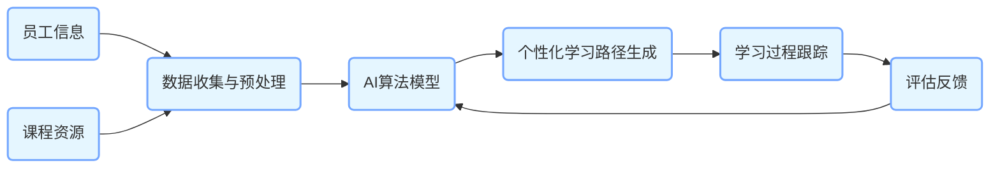

# 构建智能企业培训系统：AI个性化学习路径

> 关键词：智能企业培训系统、AI、个性化学习路径、机器学习、教育科技、企业培训、员工发展

> 摘要：本文围绕构建智能企业培训系统中AI个性化学习路径展开深入探讨。在当今快速发展的企业环境中，传统的培训方式已难以满足员工多样化的学习需求。AI技术的应用为企业培训带来了新的机遇，通过分析员工的学习习惯、知识水平、职业目标等多维度数据，能够为员工量身定制个性化的学习路径，提高培训效果和员工的学习积极性。文章将详细介绍相关核心概念、算法原理、数学模型，通过项目实战展示具体实现过程，探讨实际应用场景，推荐相关工具和资源，并对未来发展趋势与挑战进行总结。

## 1. 背景介绍 
### 1.1 目的和范围
在竞争激烈的商业环境中，企业的成功越来越依赖于员工的技能和知识水平。传统的企业培训往往采用“一刀切”的方式，无法满足不同员工的个性化需求，导致培训效果不佳。本项目的目的在于构建一个智能企业培训系统，利用AI技术为员工提供个性化的学习路径，提高培训的针对性和有效性。

本项目的范围涵盖了从数据收集、分析到学习路径生成的整个流程，包括员工信息管理、课程资源整合、个性化算法设计以及系统的开发和部署。

### 1.2 预期读者
本文的预期读者包括企业培训管理人员、人力资源专家、教育科技从业者、AI研究人员以及对智能企业培训系统感兴趣的技术爱好者。

### 1.3 文档结构概述
本文将按照以下结构进行阐述：首先介绍核心概念与联系，包括智能企业培训系统和AI个性化学习路径的原理和架构；接着讲解核心算法原理和具体操作步骤，并用Python代码详细阐述；然后介绍数学模型和公式，并举例说明；通过项目实战展示代码实际案例和详细解释；探讨实际应用场景；推荐相关的工具和资源；最后总结未来发展趋势与挑战，并提供常见问题与解答以及扩展阅读和参考资料。

### 1.4 术语表
#### 1.4.1 核心术语定义
- **智能企业培训系统**：利用先进的信息技术和AI算法，对企业员工培训过程进行智能化管理和个性化服务的系统。
- **AI个性化学习路径**：基于AI技术，根据员工的个人特征、学习历史、职业目标等因素，为员工定制的专属学习计划和课程安排。
- **机器学习**：一门多领域交叉学科，涉及概率论、统计学、逼近论、凸分析、算法复杂度理论等多门学科。它专门研究计算机怎样模拟或实现人类的学习行为，以获取新的知识或技能，重新组织已有的知识结构使之不断改善自身的性能。

#### 1.4.2 相关概念解释
- **数据挖掘**：从大量的数据中通过算法搜索隐藏于其中信息的过程。在智能企业培训系统中，数据挖掘用于分析员工的学习数据，发现潜在的学习模式和需求。
- **推荐系统**：一种信息过滤系统，旨在预测用户对物品的“评分”或“偏好”。在本系统中，推荐系统用于为员工推荐合适的课程和学习路径。

#### 1.4.3 缩略词列表
- **AI**：Artificial Intelligence，人工智能
- **ML**：Machine Learning，机器学习
- **LMS**：Learning Management System，学习管理系统

## 2. 核心概念与联系 
### 2.1 智能企业培训系统原理
智能企业培训系统是一个综合性的平台，它整合了员工信息管理、课程资源管理、学习过程跟踪、评估反馈等功能。其核心原理是通过收集员工的多维度数据，包括基本信息、学习历史、工作绩效等，利用AI算法对这些数据进行分析和挖掘，从而实现对员工学习需求的精准识别和个性化培训方案的制定。

### 2.2 AI个性化学习路径原理
AI个性化学习路径的实现依赖于机器学习算法，如协同过滤、深度学习等。这些算法通过分析员工的学习行为、兴趣爱好、知识水平等数据，构建员工的学习画像，然后根据学习画像为员工推荐适合的课程和学习顺序。同时，系统会根据员工的学习进度和反馈不断调整学习路径，以确保其始终符合员工的需求。

### 2.3 核心概念架构示意图

该架构图展示了智能企业培训系统中各核心概念之间的联系。员工信息和课程资源作为输入数据，经过数据收集与预处理后，进入AI算法模型进行分析。模型根据分析结果生成个性化学习路径，员工按照学习路径进行学习，系统对学习过程进行跟踪并收集评估反馈，反馈信息又作为输入回到AI算法模型，用于调整和优化学习路径。

## 3. 核心算法原理 & 具体操作步骤 
### 3.1 协同过滤算法原理
协同过滤算法是推荐系统中常用的算法之一，它基于用户之间的相似性来进行推荐。在智能企业培训系统中，协同过滤算法可以用于发现具有相似学习需求和行为的员工群体，然后根据这些群体的学习历史为员工推荐课程。

协同过滤算法主要分为基于用户的协同过滤和基于物品的协同过滤。基于用户的协同过滤通过计算用户之间的相似度，找到与目标用户相似的其他用户，然后根据这些相似用户的偏好来推荐物品；基于物品的协同过滤则是通过计算物品之间的相似度，根据目标用户对已有物品的偏好来推荐相似的物品。

### 3.2 具体操作步骤
#### 3.2.1 数据收集
收集员工的学习数据，包括课程浏览记录、学习时长、考试成绩等。同时，收集课程的相关信息，如课程难度、课程类型、课程内容等。

#### 3.2.2 数据预处理
对收集到的数据进行清洗、归一化和特征提取等操作，以提高数据的质量和可用性。例如，将课程浏览记录转换为用户对课程的评分，将考试成绩进行标准化处理等。

#### 3.2.3 相似度计算
根据预处理后的数据，计算用户之间或物品之间的相似度。常用的相似度计算方法包括余弦相似度、皮尔逊相关系数等。

#### 3.2.4 推荐生成
根据相似度计算结果，为目标用户推荐课程。例如，在基于用户的协同过滤中，找到与目标用户最相似的K个用户，然后根据这K个用户的课程评分，为目标用户推荐评分较高的课程。

### 3.3 Python代码实现
```python
import numpy as np
from sklearn.metrics.pairwise import cosine_similarity

# 示例用户-课程评分矩阵
ratings = np.array([
    [5, 3, 0, 1],
    [4, 0, 0, 1],
    [1, 1, 0, 5],
    [1, 0, 0, 4],
    [0, 1, 5, 4]
])

# 计算用户之间的相似度
user_similarity = cosine_similarity(ratings)

# 定义目标用户
target_user = 0

# 找到与目标用户最相似的K个用户
K = 2
similar_users = np.argsort(user_similarity[target_user])[::-1][1:K+1]

# 推荐课程
recommended_courses = []
for user in similar_users:
    for course in range(ratings.shape[1]):
        if ratings[target_user][course] == 0 and ratings[user][course] > 0:
            recommended_courses.append(course)

print("推荐的课程索引：", recommended_courses)
```
### 3.4 代码解释
1. **数据定义**：定义了一个用户-课程评分矩阵`ratings`，其中每一行表示一个用户，每一列表示一个课程，矩阵中的元素表示用户对课程的评分。
2. **相似度计算**：使用`cosine_similarity`函数计算用户之间的余弦相似度，得到用户相似度矩阵`user_similarity`。
3. **找到相似用户**：选择目标用户`target_user`，并找到与目标用户最相似的`K`个用户。
4. **推荐课程**：遍历相似用户的课程评分，将目标用户未评分但相似用户评分较高的课程添加到推荐列表中。

## 4. 数学模型和公式 & 详细讲解 & 举例说明 
### 4.1 余弦相似度公式
余弦相似度是一种常用的相似度计算方法，用于衡量两个向量之间的夹角余弦值。在协同过滤算法中，余弦相似度可以用于计算用户之间或物品之间的相似度。

余弦相似度的计算公式为：
$$
\cos(\vec{A}, \vec{B}) = \frac{\vec{A} \cdot \vec{B}}{\|\vec{A}\| \|\vec{B}\|}
$$
其中，$\vec{A}$和$\vec{B}$是两个向量，$\vec{A} \cdot \vec{B}$表示向量的点积，$\|\vec{A}\|$和$\|\vec{B}\|$分别表示向量的模。

### 4.2 详细讲解
余弦相似度的取值范围在[-1, 1]之间，值越接近1表示两个向量越相似，值越接近-1表示两个向量越不相似。在协同过滤算法中，我们通常只关注相似度为正的情况，因为负相似度表示两个向量的方向相反，在推荐系统中没有实际意义。

### 4.3 举例说明
假设有两个用户的课程评分向量分别为$\vec{A} = [5, 3, 0, 1]$和$\vec{B} = [4, 0, 0, 1]$，则它们的余弦相似度计算如下：
1. 计算向量的点积：
$$
\vec{A} \cdot \vec{B} = 5 \times 4 + 3 \times 0 + 0 \times 0 + 1 \times 1 = 21
$$
2. 计算向量的模：
$$
\|\vec{A}\| = \sqrt{5^2 + 3^2 + 0^2 + 1^2} = \sqrt{35}
$$
$$
\|\vec{B}\| = \sqrt{4^2 + 0^2 + 0^2 + 1^2} = \sqrt{17}
$$
3. 计算余弦相似度：
$$
\cos(\vec{A}, \vec{B}) = \frac{21}{\sqrt{35} \times \sqrt{17}} \approx 0.86
$$
这表明这两个用户的课程评分向量比较相似。

## 5. 项目实战：代码实际案例和详细解释说明 
### 5.1  开发环境搭建
#### 5.1.1 硬件环境
- 服务器：建议使用配置较高的云服务器，如阿里云ECS、腾讯云CVM等，至少具备4核8GB内存。
- 存储：使用云存储服务，如阿里云OSS、腾讯云COS等，用于存储课程资源和员工学习数据。

#### 5.1.2 软件环境
- 操作系统：Linux系统，如Ubuntu 18.04或更高版本。
- 编程语言：Python 3.7或更高版本。
- 数据库：MySQL 8.0或更高版本，用于存储员工信息、课程信息和学习记录等数据。
- Web框架：Django或Flask，用于开发Web应用程序。

#### 5.1.3 安装依赖库
使用`pip`安装所需的Python库，如`numpy`、`pandas`、`scikit-learn`、`Django`等。
```bash
pip install numpy pandas scikit-learn django
```

### 5.2  源代码详细实现和代码解读
#### 5.2.1 数据库设计
首先设计数据库表结构，包括员工表、课程表、学习记录表等。以下是使用Django模型定义的示例代码：
```python
from django.db import models

class Employee(models.Model):
    name = models.CharField(max_length=100)
    department = models.CharField(max_length=100)
    position = models.CharField(max_length=100)

class Course(models.Model):
    title = models.CharField(max_length=200)
    description = models.TextField()
    difficulty = models.CharField(max_length=20)
    course_type = models.CharField(max_length=50)

class LearningRecord(models.Model):
    employee = models.ForeignKey(Employee, on_delete=models.CASCADE)
    course = models.ForeignKey(Course, on_delete=models.CASCADE)
    score = models.IntegerField()
    learning_time = models.IntegerField()
```
**代码解读**：
- `Employee`模型用于存储员工的基本信息，包括姓名、部门和职位。
- `Course`模型用于存储课程的相关信息，包括标题、描述、难度和课程类型。
- `LearningRecord`模型用于存储员工的学习记录，包括员工ID、课程ID、考试成绩和学习时长。

#### 5.2.2 数据收集与预处理
编写代码从数据库中收集员工的学习数据，并进行预处理。以下是一个简单的示例代码：
```python
import pandas as pd
from .models import LearningRecord

def collect_and_preprocess_data():
    records = LearningRecord.objects.all()
    data = []
    for record in records:
        data.append([record.employee.id, record.course.id, record.score, record.learning_time])
    df = pd.DataFrame(data, columns=['employee_id', 'course_id', 'score', 'learning_time'])
    # 数据预处理，如归一化等
    df['score'] = (df['score'] - df['score'].min()) / (df['score'].max() - df['score'].min())
    df['learning_time'] = (df['learning_time'] - df['learning_time'].min()) / (df['learning_time'].max() - df['learning_time'].min())
    return df
```
**代码解读**：
- 从数据库中获取所有的学习记录，并将其转换为DataFrame格式。
- 对考试成绩和学习时长进行归一化处理，将其取值范围缩放到[0, 1]之间。

#### 5.2.3 个性化学习路径生成
使用协同过滤算法生成个性化学习路径。以下是一个简化的示例代码：
```python
import numpy as np
from sklearn.metrics.pairwise import cosine_similarity

def generate_personalized_learning_path(employee_id, df):
    # 构建用户-课程评分矩阵
    user_course_matrix = df.pivot(index='employee_id', columns='course_id', values='score').fillna(0)
    # 计算用户之间的相似度
    user_similarity = cosine_similarity(user_course_matrix)
    # 找到目标用户的索引
    target_user_index = user_course_matrix.index.get_loc(employee_id)
    # 找到与目标用户最相似的K个用户
    K = 2
    similar_users_indices = np.argsort(user_similarity[target_user_index])[::-1][1:K+1]
    # 推荐课程
    recommended_courses = []
    for user_index in similar_users_indices:
        similar_user_id = user_course_matrix.index[user_index]
        similar_user_data = df[df['employee_id'] == similar_user_id]
        for _, row in similar_user_data.iterrows():
            if row['employee_id'] != employee_id and row['course_id'] not in df[df['employee_id'] == employee_id]['course_id'].values:
                recommended_courses.append(row['course_id'])
    return recommended_courses
```
**代码解读**：
- 从DataFrame中构建用户-课程评分矩阵，并将缺失值填充为0。
- 计算用户之间的余弦相似度。
- 找到目标用户的索引，并找到与目标用户最相似的`K`个用户。
- 遍历相似用户的学习记录，将目标用户未学习过的课程添加到推荐列表中。

### 5.3  代码解读与分析
#### 5.3.1 数据库设计分析
数据库表结构的设计是整个系统的基础，合理的表结构可以提高数据的存储效率和查询性能。通过将员工信息、课程信息和学习记录分别存储在不同的表中，可以实现数据的模块化管理，便于后续的维护和扩展。

#### 5.3.2 数据收集与预处理分析
数据收集和预处理是个性化学习路径生成的关键步骤。通过从数据库中收集员工的学习数据，并进行归一化等预处理操作，可以提高数据的质量和可用性，从而提高个性化推荐的准确性。

#### 5.3.3 个性化学习路径生成分析
协同过滤算法是一种简单有效的个性化推荐算法，通过计算用户之间的相似度，可以为目标用户推荐相似用户喜欢的课程。然而，协同过滤算法也存在一些局限性，如数据稀疏性、冷启动问题等。在实际应用中，可以结合其他算法，如内容推荐算法、深度学习算法等，来提高个性化推荐的效果。

## 6. 实际应用场景 
### 6.1 新员工入职培训
对于新入职的员工，智能企业培训系统可以根据其岗位需求和个人背景，为其制定个性化的入职培训计划。例如，对于技术岗位的新员工，可以推荐编程语言、开发工具等相关课程；对于销售岗位的新员工，可以推荐销售技巧、客户关系管理等相关课程。

### 6.2 员工技能提升
随着企业业务的发展和市场环境的变化，员工需要不断提升自己的技能和知识水平。智能企业培训系统可以根据员工的工作绩效和职业发展目标，为其推荐适合的培训课程，帮助员工提升技能，适应企业的发展需求。

### 6.3 团队协作培训
在企业中，团队协作能力是非常重要的。智能企业培训系统可以根据团队成员的技能互补性和协作需求，为团队制定共同的培训计划，提高团队的协作效率和创新能力。

### 6.4 领导力发展
对于企业的管理层，智能企业培训系统可以为其提供领导力发展相关的课程和培训资源，帮助他们提升领导能力和管理水平，更好地带领团队实现企业目标。

## 7. 工具和资源推荐
### 7.1 学习资源推荐
#### 7.1.1 书籍推荐
- 《机器学习》（周志华）：全面介绍了机器学习的基本概念、算法和应用，是机器学习领域的经典教材。
- 《Python数据分析实战》（Sebastian Raschka）：详细介绍了使用Python进行数据分析的方法和技巧，包括数据处理、可视化、机器学习等方面的内容。
- 《推荐系统实践》（项亮）：深入讲解了推荐系统的原理、算法和实践经验，对于理解和实现个性化推荐系统具有重要的参考价值。

#### 7.1.2 在线课程
- Coursera上的“机器学习”课程（Andrew Ng教授）：由机器学习领域的知名专家授课，内容深入浅出，是学习机器学习的优质课程。
- edX上的“数据科学微硕士项目”：涵盖了数据科学的各个方面，包括数据分析、机器学习、深度学习等，适合有一定编程基础的学习者。
- 网易云课堂上的“Python全栈开发工程师”课程：全面介绍了Python的基础知识和应用，包括Web开发、数据分析、人工智能等方面的内容。

#### 7.1.3 技术博客和网站
- 博客园：国内知名的技术博客平台，有许多关于机器学习、数据分析、人工智能等领域的优质博客文章。
- 知乎：一个知识分享平台，有很多关于技术和学术的讨论和问答，可以从中获取最新的技术动态和研究成果。
- Kaggle：一个数据科学竞赛平台，提供了大量的数据集和竞赛题目，可以通过参与竞赛来提高自己的数据分析和机器学习能力。

### 7.2 开发工具框架推荐
#### 7.2.1 IDE和编辑器
- PyCharm：一款专业的Python集成开发环境，提供了丰富的功能和插件，适合Python开发。
- Visual Studio Code：一款轻量级的代码编辑器，支持多种编程语言，有丰富的扩展插件，可以满足不同的开发需求。

#### 7.2.2 调试和性能分析工具
- PDB：Python自带的调试器，可以帮助开发者定位和解决代码中的问题。
- cProfile：Python的性能分析工具，可以分析代码的运行时间和资源消耗情况，帮助开发者优化代码性能。

#### 7.2.3 相关框架和库
- TensorFlow：一个开源的机器学习框架，提供了丰富的工具和接口，用于构建和训练深度学习模型。
- PyTorch：另一个流行的深度学习框架，具有简洁易用的特点，适合快速开发和实验。
- Scikit-learn：一个用于机器学习的Python库，提供了各种常用的机器学习算法和工具，方便开发者进行数据处理和模型训练。

### 7.3 相关论文著作推荐
#### 7.3.1 经典论文
- “Item-based Collaborative Filtering Recommendation Algorithms”（Sarwar等）：介绍了基于物品的协同过滤算法，是协同过滤领域的经典论文。
- “Deep Learning”（LeCun等）：对深度学习的发展历程、基本原理和应用进行了全面的综述，是深度学习领域的重要文献。

#### 7.3.2 最新研究成果
- 在ACM SIGKDD、NeurIPS等顶级学术会议上发表的关于推荐系统和人工智能的最新研究论文，可以通过学术数据库如IEEE Xplore、ACM Digital Library等获取。

#### 7.3.3 应用案例分析
- 《智能教育：人工智能如何重塑教育》：介绍了人工智能在教育领域的应用案例和实践经验，对于理解智能企业培训系统的应用有一定的参考价值。

## 8. 总结：未来发展趋势与挑战
### 8.1 未来发展趋势
- **融合多模态数据**：未来的智能企业培训系统将不仅仅依赖于员工的学习数据，还会融合员工的行为数据、生理数据等多模态数据，以更全面地了解员工的学习需求和状态，提供更精准的个性化学习路径。
- **强化学习的应用**：强化学习可以根据员工的学习反馈实时调整学习路径，使学习过程更加自适应和优化。未来，强化学习将在智能企业培训系统中得到更广泛的应用。
- **虚拟现实和增强现实技术的结合**：虚拟现实和增强现实技术可以为员工提供沉浸式的学习体验，使培训更加生动和有趣。未来，智能企业培训系统将与虚拟现实和增强现实技术相结合，创造更加优质的培训环境。

### 8.2 挑战
- **数据隐私和安全**：智能企业培训系统需要收集和处理大量的员工数据，包括个人信息、学习记录等，数据隐私和安全问题是一个重要的挑战。企业需要采取有效的措施来保护员工的数据安全，防止数据泄露和滥用。
- **算法的可解释性**：AI算法往往是黑盒模型，其决策过程难以理解和解释。在智能企业培训系统中，员工和管理人员需要了解个性化学习路径的生成原因和依据，因此算法的可解释性是一个亟待解决的问题。
- **技术的普及和应用成本**：虽然AI技术在不断发展和进步，但在企业中的普及和应用还面临着技术门槛高、成本大等问题。企业需要加大对技术研发和人才培养的投入，降低技术应用成本，推动智能企业培训系统的广泛应用。

## 9. 附录：常见问题与解答
### 9.1 智能企业培训系统需要多少员工数据才能有效运行？
智能企业培训系统需要足够的员工数据来进行分析和建模，但具体的数据量取决于多种因素，如员工数量、课程种类、学习行为的多样性等。一般来说，数据量越大，个性化推荐的效果越好。但在收集数据时，需要注意保护员工的隐私和数据安全。

### 9.2 如何解决协同过滤算法中的冷启动问题？
冷启动问题是指在新用户或新物品加入系统时，由于缺乏足够的数据，无法进行有效的推荐。可以采用以下方法解决冷启动问题：
- **基于内容的推荐**：对于新用户，可以根据其基本信息和兴趣爱好，推荐相关的课程；对于新物品，可以根据其内容特征，推荐给可能感兴趣的用户。
- **引导用户提供信息**：在用户注册或使用系统时，引导用户提供一些基本信息和偏好，以便系统进行个性化推荐。
- **使用混合推荐算法**：结合协同过滤算法和其他推荐算法，如基于内容的推荐算法、深度学习算法等，提高推荐的准确性和稳定性。

### 9.3 智能企业培训系统的实施需要多长时间？
智能企业培训系统的实施时间取决于系统的规模和复杂度、企业的需求和资源等因素。一般来说，小型企业的智能企业培训系统实施可能需要几个月的时间，而大型企业的系统实施可能需要一年以上的时间。在实施过程中，需要进行需求分析、系统设计、开发测试、上线部署等多个阶段，确保系统的顺利实施和稳定运行。

## 10. 扩展阅读 & 参考资料
### 10.1 扩展阅读
- 《人工智能时代的教育革命》：探讨了人工智能对教育领域的影响和变革，为智能企业培训系统的发展提供了新的思路和方向。
- 《工业4.0时代的人才培养》：介绍了工业4.0时代对人才的需求和培养模式，对于智能企业培训系统的设计和实施具有一定的参考价值。

### 10.2 参考资料
- 相关的学术论文和研究报告，如ACM SIGKDD、NeurIPS等会议上发表的论文。
- 开源项目和代码库，如GitHub上的相关项目，可以参考其中的实现思路和代码示例。
- 企业培训领域的行业报告和白皮书，了解行业的最新动态和发展趋势。