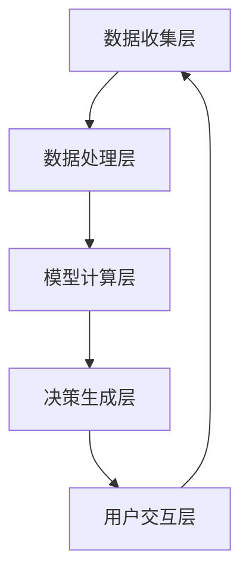

# 构建智能化的个人退休金投资组合动态调整助手

> 关键词：智能化、个人退休金、投资组合、动态调整、助手、人工智能、金融科技

> 摘要：本文聚焦于构建智能化的个人退休金投资组合动态调整助手。随着人口老龄化加剧，个人退休金的合理投资与管理愈发重要。传统的投资组合调整方式往往难以适应复杂多变的市场环境和个人情况的动态变化。本助手借助人工智能等先进技术，旨在为个人提供精准、高效且个性化的退休金投资组合动态调整方案。文章深入探讨了相关核心概念、算法原理、数学模型，通过项目实战展示了具体实现过程，并分析了其实际应用场景，同时推荐了相关工具和资源，最后对未来发展趋势与挑战进行了总结。

## 1. 背景介绍 
### 1.1 目的和范围
在当今社会，退休金规划是个人财务规划的重要组成部分。随着金融市场的不断发展和变化，个人退休金投资面临着诸多挑战，如市场波动、投资产品复杂多样等。本项目的目的在于构建一个智能化的助手，帮助个人根据自身的财务状况、风险偏好、退休目标等因素，动态调整退休金投资组合，以实现资产的保值增值和退休生活的财务安全。

本项目的范围涵盖了从数据收集、分析到投资组合策略生成和动态调整的全过程。涉及到个人财务数据的获取与处理、市场数据的分析、投资组合优化算法的实现以及智能决策系统的构建等多个方面。

### 1.2 预期读者
本文的预期读者包括对个人退休金规划和投资管理感兴趣的普通投资者，希望通过智能化工具提升投资效率和收益的金融从业者，以及从事人工智能、金融科技等相关领域研究和开发的技术人员。

### 1.3 文档结构概述
本文首先介绍了构建智能化个人退休金投资组合动态调整助手的背景和相关概念，包括核心概念的原理和架构。接着详细阐述了核心算法原理和具体操作步骤，并给出了相应的数学模型和公式。通过项目实战部分展示了如何在实际中实现该助手，包括开发环境搭建、源代码实现和代码解读。然后分析了该助手的实际应用场景，推荐了相关的工具和资源。最后总结了未来的发展趋势与挑战，并提供了常见问题的解答和扩展阅读的参考资料。

### 1.4 术语表
#### 1.4.1 核心术语定义
- **个人退休金**：个人为退休后生活储备的资金，通常通过工作期间的储蓄、养老保险等方式积累。
- **投资组合**：由多种不同的投资产品（如股票、债券、基金等）组成的集合，旨在通过分散投资降低风险并实现一定的收益目标。
- **动态调整**：根据市场变化、个人财务状况和风险偏好等因素，实时或定期对投资组合进行调整，以适应不同的情况。
- **智能化助手**：利用人工智能技术，如机器学习、深度学习等，为用户提供智能决策支持和个性化服务的软件系统。

#### 1.4.2 相关概念解释
- **风险偏好**：个人对投资风险的承受能力和意愿。不同的风险偏好会影响投资组合的配置，风险偏好较高的投资者可能会更多地配置股票等高风险资产，而风险偏好较低的投资者则倾向于配置债券等低风险资产。
- **资产配置**：将资金分配到不同类型的资产中，以实现投资组合的风险和收益平衡。常见的资产类别包括股票、债券、现金、房地产等。
- **市场波动性**：金融市场价格的波动程度，通常用标准差等指标来衡量。市场波动性越大，投资风险越高。

#### 1.4.3 缩略词列表
- **AI**：Artificial Intelligence，人工智能
- **ML**：Machine Learning，机器学习
- **DL**：Deep Learning，深度学习
- **ETF**：Exchange - Traded Fund，交易型开放式指数基金
- **ROI**：Return on Investment，投资回报率

## 2. 核心概念与联系 

### 核心概念原理
智能化的个人退休金投资组合动态调整助手的核心原理是基于人工智能技术，结合个人的财务状况、风险偏好和市场数据，通过算法模型对投资组合进行优化和动态调整。

个人的财务状况包括当前的退休金储备、收入水平、支出情况等，这些信息是确定投资目标和可投资资金的基础。风险偏好则反映了个人对投资风险的承受能力和意愿，它决定了投资组合中不同风险资产的比例。市场数据包括股票价格、债券收益率、宏观经济指标等，这些数据反映了市场的变化和趋势，是投资决策的重要依据。

助手通过收集和分析这些数据，利用机器学习和优化算法，计算出最优的投资组合配置方案。并且，随着市场的变化和个人情况的改变，助手会实时或定期对投资组合进行动态调整，以确保投资组合始终符合个人的目标和市场环境。

### 架构的文本示意图
该助手的架构主要包括以下几个部分：

1. **数据收集层**：负责收集个人财务数据、市场数据等信息。个人财务数据可以通过用户输入、与金融机构的数据接口等方式获取；市场数据可以从金融数据提供商、证券交易所等渠道获取。
2. **数据处理层**：对收集到的数据进行清洗、预处理和特征提取。清洗数据是为了去除噪声和错误数据；预处理包括数据归一化、标准化等操作；特征提取是为了提取出对投资决策有重要影响的特征。
3. **模型计算层**：利用机器学习和优化算法对处理后的数据进行分析和计算。机器学习算法可以用于预测市场趋势、评估投资风险等；优化算法可以用于求解最优的投资组合配置方案。
4. **决策生成层**：根据模型计算的结果，生成投资组合调整建议和决策方案。这些建议和方案会考虑个人的风险偏好、投资目标等因素，以确保决策的个性化和合理性。
5. **用户交互层**：提供用户界面，让用户可以方便地输入个人信息、查看投资组合情况和接收决策建议。同时，用户也可以对决策建议进行反馈和调整。

### Mermaid 流程图


## 3. 核心算法原理 & 具体操作步骤 

### 核心算法原理
本助手主要使用以下几种核心算法：

#### 1. 风险评估算法
风险评估是投资决策的重要环节，本助手使用风险价值（VaR）方法来评估投资组合的风险。VaR 是指在一定的置信水平下，投资组合在未来一段时间内可能遭受的最大损失。

#### 2. 投资组合优化算法
投资组合优化的目标是在给定的风险水平下，实现投资组合的预期收益最大化；或者在给定的预期收益水平下，实现投资组合的风险最小化。本助手使用马科维茨的均值 - 方差模型来进行投资组合优化。

#### 3. 机器学习预测算法
为了更好地预测市场趋势和资产价格变化，本助手使用机器学习算法，如支持向量机（SVM）、神经网络等。这些算法可以通过对历史市场数据的学习，建立预测模型，从而对未来的市场情况进行预测。

### 具体操作步骤
#### 1. 数据收集
- 收集个人的财务信息，包括退休金账户余额、每月收入、每月支出、预计退休年龄等。
- 收集市场数据，包括股票价格、债券收益率、宏观经济指标等。

#### 2. 数据预处理
- 清洗数据，去除噪声和错误数据。
- 对数据进行归一化和标准化处理，以提高算法的性能。

#### 3. 风险评估
- 根据个人的财务状况和投资组合，计算投资组合的 VaR 值。
- 根据 VaR 值评估投资组合的风险水平。

#### 4. 投资组合优化
- 使用均值 - 方差模型，根据个人的风险偏好和预期收益目标，求解最优的投资组合配置方案。

#### 5. 机器学习预测
- 使用机器学习算法对市场趋势和资产价格变化进行预测。
- 根据预测结果，对投资组合进行动态调整。

#### 6. 决策生成
- 根据风险评估、投资组合优化和机器学习预测的结果，生成投资组合调整建议和决策方案。

#### 7. 用户交互
- 将决策方案展示给用户，并接收用户的反馈和调整。

### Python 源代码阐述
以下是一个简单的 Python 示例，演示了如何使用均值 - 方差模型进行投资组合优化：

```python
import numpy as np
import pandas as pd
from pypfopt.efficient_frontier import EfficientFrontier
from pypfopt import risk_models
from pypfopt import expected_returns

# 示例数据：假设我们有 4 种资产的历史收益率数据
data = pd.DataFrame({
    'Asset1': [0.01, 0.02, 0.03, 0.04, 0.05],
    'Asset2': [0.02, 0.03, 0.04, 0.05, 0.06],
    'Asset3': [0.03, 0.04, 0.05, 0.06, 0.07],
    'Asset4': [0.04, 0.05, 0.06, 0.07, 0.08]
})

# 计算预期收益率和协方差矩阵
mu = expected_returns.mean_historical_return(data)
S = risk_models.sample_cov(data)

# 创建 EfficientFrontier 对象
ef = EfficientFrontier(mu, S)

# 求解最优投资组合
weights = ef.max_sharpe()
cleaned_weights = ef.clean_weights()

print("最优投资组合权重：", cleaned_weights)
```

## 4. 数学模型和公式 & 详细讲解 & 举例说明 

### 风险价值（VaR）模型
风险价值（VaR）是指在一定的置信水平下，投资组合在未来一段时间内可能遭受的最大损失。其数学公式为：

$$VaR_{\alpha} = - z_{\alpha} \sigma \sqrt{\Delta t}$$

其中，$VaR_{\alpha}$ 是在置信水平 $\alpha$ 下的风险价值，$z_{\alpha}$ 是标准正态分布的分位数，$\sigma$ 是投资组合的收益率标准差，$\Delta t$ 是时间间隔。

例如，假设一个投资组合的收益率标准差为 0.1，时间间隔为 1 天，置信水平为 95%。则 $z_{\alpha} = 1.645$，$VaR_{0.95} = - 1.645 \times 0.1 \times \sqrt{1} = - 0.1645$，这意味着在 95% 的置信水平下，该投资组合在一天内可能遭受的最大损失为 16.45%。

### 均值 - 方差模型
均值 - 方差模型是由马科维茨提出的一种投资组合优化模型，其目标是在给定的风险水平下，实现投资组合的预期收益最大化；或者在给定的预期收益水平下，实现投资组合的风险最小化。

设投资组合中包含 $n$ 种资产，其权重向量为 $w = (w_1, w_2, \cdots, w_n)^T$，预期收益率向量为 $\mu = (\mu_1, \mu_2, \cdots, \mu_n)^T$，协方差矩阵为 $\Sigma$。则投资组合的预期收益率 $E(R_p)$ 和方差 $\sigma_p^2$ 分别为：

$$E(R_p) = w^T \mu$$

$$\sigma_p^2 = w^T \Sigma w$$

均值 - 方差模型的优化问题可以表示为：

$$\min_{w} w^T \Sigma w$$

$$s.t. \quad w^T \mu = E(R_p^*) \quad \sum_{i = 1}^{n} w_i = 1 \quad w_i \geq 0, i = 1, 2, \cdots, n$$

其中，$E(R_p^*)$ 是给定的预期收益率目标。

例如，假设我们有两种资产，其预期收益率分别为 $\mu_1 = 0.1$ 和 $\mu_2 = 0.2$，协方差矩阵为 $\Sigma = \begin{bmatrix} 0.01 & 0.005 \\ 0.005 & 0.04 \end{bmatrix}$，给定的预期收益率目标为 $E(R_p^*) = 0.15$。则可以通过求解上述优化问题，得到最优的投资组合权重。

### 机器学习预测模型
机器学习预测模型通常使用回归或分类算法来预测市场趋势和资产价格变化。以支持向量机（SVM）为例，其基本原理是在特征空间中找到一个最优的超平面，使得不同类别的样本能够被最大程度地分开。

对于回归问题，SVM 的目标是找到一个函数 $f(x) = w^T \phi(x) + b$，使得预测值与真实值之间的误差最小。其中，$w$ 是权重向量，$\phi(x)$ 是特征映射函数，$b$ 是偏置项。

SVM 的优化问题可以表示为：

$$\min_{w, b, \xi} \frac{1}{2} w^T w + C \sum_{i = 1}^{n} \xi_i$$

$$s.t. \quad y_i - w^T \phi(x_i) - b \leq \epsilon + \xi_i \quad w^T \phi(x_i) + b - y_i \leq \epsilon + \xi_i \quad \xi_i \geq 0, i = 1, 2, \cdots, n$$

其中，$y_i$ 是真实值，$\xi_i$ 是松弛变量，$C$ 是惩罚参数，$\epsilon$ 是误差容忍度。

## 5. 项目实战：代码实际案例和详细解释说明 

### 5.1  开发环境搭建
#### 1. 安装 Python
首先，需要安装 Python 环境。可以从 Python 官方网站（https://www.python.org/downloads/）下载适合自己操作系统的 Python 安装包，并按照安装向导进行安装。

#### 2. 安装必要的库
本项目需要使用一些 Python 库，如 Pandas、Numpy、Scikit - learn、PyPortfolioOpt 等。可以使用以下命令进行安装：

```bash
pip install pandas numpy scikit-learn pypfopt
```

#### 3. 配置开发环境
可以使用集成开发环境（IDE），如 PyCharm、Jupyter Notebook 等进行开发。这里以 Jupyter Notebook 为例，可以使用以下命令安装 Jupyter Notebook：

```bash
pip install jupyter notebook
```

安装完成后，在命令行中输入以下命令启动 Jupyter Notebook：

```bash
jupyter notebook
```

### 5.2  源代码详细实现和代码解读
以下是一个完整的 Python 代码示例，实现了一个简单的个人退休金投资组合动态调整助手：

```python
import pandas as pd
import numpy as np
from pypfopt.efficient_frontier import EfficientFrontier
from pypfopt import risk_models
from pypfopt import expected_returns
from sklearn.svm import SVR
from sklearn.model_selection import train_test_split
from sklearn.preprocessing import StandardScaler

# 步骤 1：数据收集
# 假设我们有 4 种资产的历史收益率数据
data = pd.DataFrame({
    'Asset1': [0.01, 0.02, 0.03, 0.04, 0.05, 0.06, 0.07, 0.08, 0.09, 0.1],
    'Asset2': [0.02, 0.03, 0.04, 0.05, 0.06, 0.07, 0.08, 0.09, 0.1, 0.11],
    'Asset3': [0.03, 0.04, 0.05, 0.06, 0.07, 0.08, 0.09, 0.1, 0.11, 0.12],
    'Asset4': [0.04, 0.05, 0.06, 0.07, 0.08, 0.09, 0.1, 0.11, 0.12, 0.13]
})

# 步骤 2：数据预处理
# 计算预期收益率和协方差矩阵
mu = expected_returns.mean_historical_return(data)
S = risk_models.sample_cov(data)

# 划分训练集和测试集
X = data.drop(columns=['Asset4'])
y = data['Asset4']
X_train, X_test, y_train, y_test = train_test_split(X, y, test_size=0.2, random_state=42)

# 数据标准化
scaler = StandardScaler()
X_train_scaled = scaler.fit_transform(X_train)
X_test_scaled = scaler.transform(X_test)

# 步骤 3：机器学习预测
# 使用支持向量机进行回归预测
svr = SVR(kernel='rbf', C=100, gamma=0.1)
svr.fit(X_train_scaled, y_train)
y_pred = svr.predict(X_test_scaled)

# 步骤 4：投资组合优化
# 创建 EfficientFrontier 对象
ef = EfficientFrontier(mu, S)

# 求解最优投资组合
weights = ef.max_sharpe()
cleaned_weights = ef.clean_weights()

# 步骤 5：决策生成
print("最优投资组合权重：", cleaned_weights)
print("资产 4 的预测收益率：", y_pred)
```

### 5.3  代码解读与分析
#### 1. 数据收集
代码中使用 `pandas` 库创建了一个包含 4 种资产历史收益率的 DataFrame 对象。在实际应用中，这些数据可以从金融数据提供商、证券交易所等渠道获取。

#### 2. 数据预处理
- 使用 `expected_returns.mean_historical_return` 函数计算资产的预期收益率。
- 使用 `risk_models.sample_cov` 函数计算资产的协方差矩阵。
- 使用 `train_test_split` 函数将数据划分为训练集和测试集。
- 使用 `StandardScaler` 对数据进行标准化处理，以提高机器学习算法的性能。

#### 3. 机器学习预测
- 使用支持向量机（SVR）进行回归预测，预测资产 4 的收益率。
- 使用 `fit` 方法对模型进行训练，使用 `predict` 方法进行预测。

#### 4. 投资组合优化
- 使用 `EfficientFrontier` 类创建一个投资组合优化对象。
- 使用 `max_sharpe` 方法求解最优投资组合，该方法可以在给定的风险水平下，实现投资组合的预期收益最大化。

#### 5. 决策生成
- 打印最优投资组合的权重和资产 4 的预测收益率，作为投资决策的参考。

## 6. 实际应用场景 
### 个人退休金规划
对于普通投资者来说，智能化的个人退休金投资组合动态调整助手可以帮助他们根据自己的财务状况、风险偏好和退休目标，制定个性化的退休金投资计划。助手可以实时或定期对投资组合进行动态调整，以适应市场变化和个人情况的改变，确保退休金的保值增值。

### 金融机构客户服务
金融机构可以将该助手集成到自己的客户服务系统中，为客户提供更加专业、个性化的投资建议和服务。通过分析客户的财务数据和风险偏好，助手可以为客户推荐合适的投资产品和投资组合，并根据市场变化及时调整投资策略，提高客户的满意度和忠诚度。

### 投资研究和分析
投资研究人员可以使用该助手进行投资组合优化和风险分析，帮助他们更好地理解市场规律和投资风险。助手可以提供各种投资组合方案和风险评估指标，为投资研究和决策提供参考依据。

## 7. 工具和资源推荐
### 7.1 学习资源推荐
#### 7.1.1 书籍推荐
- 《投资学》（博迪著）：全面介绍了投资学的基本概念、理论和方法，是投资领域的经典教材。
- 《机器学习》（周志华著）：系统地介绍了机器学习的基本概念、算法和应用，是学习机器学习的优秀教材。
- 《Python 数据分析实战》（韦斯·麦金尼著）：详细介绍了使用 Python 进行数据分析的方法和技巧，是学习数据分析的实用书籍。

#### 7.1.2 在线课程
- Coursera 上的“Machine Learning”课程：由斯坦福大学的 Andrew Ng 教授授课，是学习机器学习的经典课程。
- edX 上的“Data Science MicroMasters Program”课程：提供了全面的数据科学知识和技能培训，包括数据分析、机器学习、深度学习等方面。
- Udemy 上的“Python for Finance: Investment Fundamentals & Data Analytics”课程：专门介绍了使用 Python 进行金融数据分析和投资组合管理的方法和技巧。

#### 7.1.3 技术博客和网站
- Medium：一个技术博客平台，上面有很多关于人工智能、金融科技等领域的优秀文章。
- Towards Data Science：专注于数据科学和机器学习领域的技术博客，提供了很多实用的教程和案例。
- QuantNet：一个金融量化领域的专业网站，提供了金融量化、投资组合管理等方面的知识和资源。

### 7.2 开发工具框架推荐
#### 7.2.1 IDE和编辑器
- PyCharm：一款功能强大的 Python 集成开发环境，提供了代码编辑、调试、版本控制等功能。
- Jupyter Notebook：一个交互式的编程环境，适合进行数据分析和机器学习实验。
- Visual Studio Code：一款轻量级的代码编辑器，支持多种编程语言，具有丰富的插件扩展功能。

#### 7.2.2 调试和性能分析工具
- PDB：Python 自带的调试工具，可以帮助开发者调试代码中的错误。
- Py-Spy：一个性能分析工具，可以帮助开发者分析 Python 代码的性能瓶颈。
- Memory Profiler：一个内存分析工具，可以帮助开发者分析 Python 代码的内存使用情况。

#### 7.2.3 相关框架和库
- Pandas：一个强大的数据分析库，提供了数据结构和数据分析工具，方便进行数据处理和分析。
- Numpy：一个科学计算库，提供了高效的数组操作和数学函数，是机器学习和数据分析的基础库。
- Scikit - learn：一个机器学习库，提供了各种机器学习算法和工具，方便进行机器学习模型的开发和训练。
- PyPortfolioOpt：一个投资组合优化库，提供了投资组合优化算法和工具，方便进行投资组合管理和优化。

### 7.3 相关论文著作推荐
#### 7.3.1 经典论文
- “Portfolio Selection”（Harry Markowitz）：提出了均值 - 方差模型，奠定了现代投资组合理论的基础。
- “Capital Asset Pricing Model”（William Sharpe）：提出了资本资产定价模型，用于计算资产的预期收益率和风险。
- “A Non - parametric Approach to the Pricing of Contingent Claims”（Fisher Black, Myron Scholes）：提出了布莱克 - 斯科尔斯期权定价模型，是期权定价领域的经典论文。

#### 7.3.2 最新研究成果
- 关注顶级金融期刊，如《Journal of Finance》、《Review of Financial Studies》等，上面发表了很多关于投资组合管理、金融科技等领域的最新研究成果。
- 关注顶级计算机科学期刊，如《Journal of Artificial Intelligence Research》、《ACM Transactions on Intelligent Systems and Technology》等，上面发表了很多关于人工智能、机器学习等领域的最新研究成果。

#### 7.3.3 应用案例分析
- 可以参考一些金融机构的研究报告和案例分析，了解他们在投资组合管理和金融科技应用方面的实践经验和成果。
- 关注一些金融科技公司的官方网站和博客，了解他们在智能化投资助手等方面的应用案例和技术创新。

## 8. 总结：未来发展趋势与挑战
### 未来发展趋势
#### 1. 智能化程度不断提高
随着人工智能技术的不断发展，智能化的个人退休金投资组合动态调整助手将具备更强的学习和决策能力。它可以通过深度学习等技术，自动发现市场规律和投资机会，为用户提供更加精准、个性化的投资建议。

#### 2. 多资产类别融合
未来的助手将不仅仅局限于股票、债券等传统资产类别，还将涵盖数字货币、房地产、大宗商品等多资产类别。通过多资产类别融合，可以进一步分散投资风险，提高投资组合的收益稳定性。

#### 3. 与区块链技术结合
区块链技术具有去中心化、不可篡改等特点，可以提高投资信息的透明度和安全性。未来的助手可能会与区块链技术结合，实现投资交易的自动化和智能化，降低交易成本和风险。

### 挑战
#### 1. 数据安全和隐私保护
个人退休金投资涉及到大量的个人财务信息和敏感数据，数据安全和隐私保护是至关重要的。如何确保数据在收集、存储和处理过程中的安全性和隐私性，是一个亟待解决的问题。

#### 2. 模型准确性和可靠性
投资决策是基于模型的计算和预测结果，模型的准确性和可靠性直接影响到投资收益和风险。如何提高模型的准确性和可靠性，减少模型误差和偏差，是一个挑战。

#### 3. 法律法规和监管合规
金融领域受到严格的法律法规和监管要求的约束，智能化的投资助手需要遵守相关的法律法规和监管规定。如何确保助手的开发和运营符合法律法规和监管要求，是一个需要关注的问题。

## 9. 附录：常见问题与解答
### 1. 该助手的投资建议一定能保证盈利吗？
不能。金融市场是复杂多变的，存在很多不确定性因素。该助手的投资建议是基于历史数据和模型计算得出的，只能提供参考，不能保证一定能盈利。投资者需要根据自己的情况进行判断和决策。

### 2. 如何确保个人财务信息的安全？
在开发和运营过程中，会采取一系列的数据安全和隐私保护措施，如数据加密、访问控制、安全审计等。同时，遵守相关的法律法规和监管要求，确保个人财务信息的安全和隐私。

### 3. 助手的模型多久更新一次？
模型的更新频率取决于市场变化和数据的更新情况。一般来说，会定期对模型进行评估和更新，以确保模型的准确性和可靠性。在市场出现重大变化时，也会及时对模型进行调整。

### 4. 该助手适用于所有投资者吗？
不是。该助手的投资建议是根据个人的财务状况、风险偏好和退休目标等因素生成的，不同的投资者情况不同，投资建议也会不同。投资者需要根据自己的实际情况选择适合自己的投资方式和工具。

## 10. 扩展阅读 & 参考资料
### 扩展阅读
- 《金融科技前沿》：介绍了金融科技领域的最新发展趋势和技术应用。
- 《人工智能与金融》：探讨了人工智能在金融领域的应用和挑战。

### 参考资料
- 相关金融数据提供商的官方网站，如雅虎财经、万得资讯等。
- 相关金融机构的研究报告和公告。
- 相关学术期刊和会议论文。