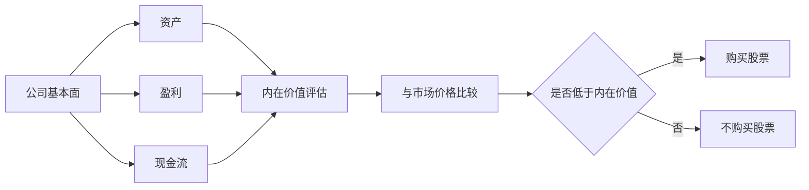
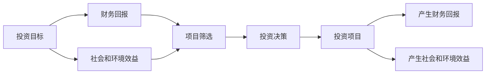

# 格雷厄姆特价股票理论在影响力投资中的应用

> 关键词：格雷厄姆特价股票理论、影响力投资、价值评估、投资策略、社会责任

> 摘要：本文深入探讨了格雷厄姆特价股票理论在影响力投资中的应用。首先介绍了相关背景，包括目的范围、预期读者等内容。接着阐述了核心概念，剖析了格雷厄姆特价股票理论与影响力投资的联系。详细讲解了核心算法原理和具体操作步骤，通过数学模型和公式进一步分析。结合项目实战给出实际案例及详细解释，探讨了其实际应用场景。同时推荐了相关工具和资源，最后总结未来发展趋势与挑战，解答常见问题并提供扩展阅读与参考资料，旨在为投资者在影响力投资中运用格雷厄姆特价股票理论提供全面的指导和深入的思考。

## 1. 背景介绍 
### 1.1 目的和范围
本研究的主要目的在于探索格雷厄姆特价股票理论在影响力投资领域的具体应用方式和效果。随着社会对可持续发展和企业社会责任的关注度不断提高，影响力投资逐渐成为投资领域的重要方向。而格雷厄姆特价股票理论作为价值投资的经典理论，其强调的以低于内在价值的价格购买股票的理念，在影响力投资中是否适用以及如何应用，具有重要的研究价值。

本研究的范围涵盖了格雷厄姆特价股票理论的基本原理、影响力投资的概念和特点，以及两者结合的具体策略和实际案例分析。通过对相关理论和实践的研究，旨在为投资者提供一套可行的投资思路和方法，帮助他们在追求财务回报的同时，实现社会和环境效益。

### 1.2 预期读者
本文预期读者主要包括专业投资者、投资机构从业者、金融领域研究人员以及对影响力投资和价值投资感兴趣的个人。对于专业投资者和投资机构从业者来说，本文可以为他们在制定投资策略时提供新的视角和方法；对于金融领域研究人员，本文的研究内容可以为他们的学术研究提供参考；对于普通投资者，本文可以帮助他们更好地理解影响力投资和格雷厄姆特价股票理论，提高投资决策的科学性和合理性。

### 1.3 文档结构概述
本文将按照以下结构展开：首先介绍核心概念，包括格雷厄姆特价股票理论和影响力投资的基本定义和原理，以及两者之间的联系；接着详细阐述核心算法原理和具体操作步骤，通过数学模型和公式对相关理论进行量化分析；然后通过项目实战，给出实际案例并进行详细解释说明；之后探讨该理论在影响力投资中的实际应用场景；再推荐相关的工具和资源，包括学习资源、开发工具框架和相关论文著作；最后总结未来发展趋势与挑战，解答常见问题并提供扩展阅读与参考资料。

### 1.4 术语表
#### 1.4.1 核心术语定义
- **格雷厄姆特价股票理论**：由本杰明·格雷厄姆（Benjamin Graham）提出的一种价值投资理论，该理论认为股票存在内在价值，投资者应该以低于内在价值的价格购买股票，以获取安全边际和投资回报。
- **影响力投资**：是一种旨在产生可衡量的社会和环境效益，同时获得财务回报的投资方式。投资者在选择投资项目时，不仅考虑财务因素，还关注项目对社会和环境的影响。

#### 1.4.2 相关概念解释
- **价值投资**：是一种基于股票内在价值进行投资的策略，强调通过对公司基本面的分析，寻找被低估的股票进行投资。
- **安全边际**：是格雷厄姆特价股票理论中的重要概念，指的是股票的市场价格低于其内在价值的部分。安全边际越大，投资风险越小。

#### 1.4.3 缩略词列表
- **ESG**：环境（Environmental）、社会（Social）和治理（Governance）的缩写，是影响力投资中常用的评估指标体系。

## 2. 核心概念与联系 
### 格雷厄姆特价股票理论原理
格雷厄姆特价股票理论的核心在于对股票内在价值的评估。格雷厄姆认为，股票的内在价值是由公司的基本面决定的，包括公司的资产、盈利、现金流等因素。投资者可以通过对这些基本面因素的分析，计算出股票的内在价值。

其基本架构可以用以下示意图表示：


### 影响力投资原理
影响力投资强调在投资过程中考虑社会和环境因素。投资者通过选择具有积极社会和环境影响的项目进行投资，不仅可以获得财务回报，还可以为社会和环境做出贡献。

其基本架构可以用以下示意图表示：


### 两者的联系
格雷厄姆特价股票理论和影响力投资并非相互排斥，而是可以相互结合。在影响力投资中，投资者可以运用格雷厄姆特价股票理论的方法，寻找那些既具有良好社会和环境效益，又被市场低估的股票。这样可以在实现社会和环境目标的同时，获得更高的投资回报。

具体来说，投资者可以在筛选具有影响力的投资项目时，运用格雷厄姆的价值评估方法，对项目的财务状况进行分析，确保投资的安全性和收益性。同时，在考虑股票的内在价值时，也可以将社会和环境因素纳入评估体系，使内在价值的计算更加全面和准确。

## 3. 核心算法原理 & 具体操作步骤 
### 核心算法原理
在应用格雷厄姆特价股票理论进行影响力投资时，核心算法在于计算股票的内在价值。一种常用的方法是使用股息折现模型（Dividend Discount Model, DDM）。

股息折现模型的基本思想是，股票的内在价值等于其未来股息的现值之和。假设公司的股息以固定增长率 $g$ 增长，且投资者要求的回报率为 $r$，则股票的内在价值 $V$ 可以用以下公式表示：

$V = \frac{D_1}{r - g}$

其中，$D_1$ 是下一期的股息。

### 具体操作步骤
#### 步骤 1：确定具有影响力的投资领域
投资者首先需要根据自己的价值观和投资目标，确定具有影响力的投资领域，如清洁能源、教育、医疗等。

#### 步骤 2：筛选具有影响力的公司
在确定的投资领域中，筛选出那些具有良好社会和环境效益的公司。可以通过查看公司的 ESG 报告、社会责任报告等资料，评估公司在环境、社会和治理方面的表现。

#### 步骤 3：计算公司的内在价值
对于筛选出的公司，运用股息折现模型或其他价值评估方法，计算其内在价值。以下是使用 Python 实现股息折现模型的代码示例：

```python
def calculate_intrinsic_value(D1, r, g):
    """
    计算股票的内在价值
    :param D1: 下一期的股息
    :param r: 投资者要求的回报率
    :param g: 股息增长率
    :return: 股票的内在价值
    """
    if r <= g:
        raise ValueError("投资者要求的回报率必须大于股息增长率")
    return D1 / (r - g)

# 示例数据
D1 = 2.0  # 下一期的股息
r = 0.1  # 投资者要求的回报率
g = 0.05  # 股息增长率

intrinsic_value = calculate_intrinsic_value(D1, r, g)
print(f"股票的内在价值为: {intrinsic_value}")
```

#### 步骤 4：比较内在价值和市场价格
将计算出的内在价值与股票的市场价格进行比较。如果市场价格低于内在价值，则说明股票被低估，具有投资价值。

#### 步骤 5：做出投资决策
根据比较结果，做出投资决策。如果股票被低估且具有良好的社会和环境效益，则可以考虑购买该股票。

## 4. 数学模型和公式 & 详细讲解 & 举例说明 
### 股息折现模型公式详细讲解
股息折现模型 $V = \frac{D_1}{r - g}$ 中，$D_1$ 表示下一期的股息，$r$ 表示投资者要求的回报率，$g$ 表示股息增长率。

- **$D_1$ 的确定**：$D_1$ 可以根据公司过去的股息政策和盈利情况进行预测。一般来说，可以参考公司的历史股息增长率，结合对公司未来盈利的预期，估算下一期的股息。
- **$r$ 的确定**：$r$ 是投资者要求的回报率，它反映了投资者对投资风险的预期。$r$ 通常由无风险利率和风险溢价两部分组成。无风险利率可以参考国债收益率，风险溢价则需要根据公司的行业特点、财务状况等因素进行确定。
- **$g$ 的确定**：$g$ 是股息增长率，它反映了公司的盈利增长能力。$g$ 可以通过分析公司的历史盈利增长率、行业发展趋势等因素进行估算。

### 举例说明
假设某公司下一期的股息 $D_1$ 为 3 元，投资者要求的回报率 $r$ 为 0.12，股息增长率 $g$ 为 0.06。则该公司股票的内在价值为：

$V = \frac{D_1}{r - g} = \frac{3}{0.12 - 0.06} = 50$（元）

如果该股票的市场价格为 40 元，低于其内在价值 50 元，则说明该股票被低估，具有投资价值。

### 其他数学模型
除了股息折现模型，还可以使用自由现金流折现模型（Discounted Cash Flow, DCF）来计算股票的内在价值。自由现金流折现模型的基本思想是，股票的内在价值等于其未来自由现金流的现值之和。

自由现金流折现模型的公式为：

$V = \sum_{t=1}^{n} \frac{FCF_t}{(1 + r)^t} + \frac{TV}{(1 + r)^n}$

其中，$FCF_t$ 是第 $t$ 期的自由现金流，$TV$ 是终值，$r$ 是折现率。

## 5. 项目实战：代码实际案例和详细解释说明 
### 5.1  开发环境搭建
- **Python 环境**：建议使用 Python 3.7 及以上版本。可以从 Python 官方网站（https://www.python.org/downloads/） 下载并安装。
- **开发工具**：推荐使用 PyCharm 或 Jupyter Notebook 作为开发工具。PyCharm 是一款功能强大的 Python 集成开发环境，Jupyter Notebook 则适合进行交互式的数据分析和代码编写。
- **相关库**：需要安装 pandas、numpy 等常用的数据分析库，以及 yfinance 库用于获取股票数据。可以使用以下命令进行安装：

```sh
pip install pandas numpy yfinance
```

### 5.2  源代码详细实现和代码解读
以下是一个使用 Python 实现格雷厄姆特价股票理论在影响力投资中应用的完整代码示例：

```python
import yfinance as yf
import pandas as pd

# 步骤 1：确定具有影响力的投资领域和公司
# 这里以清洁能源领域为例，选取几家具有代表性的公司
tickers = ['FSLR', 'ENPH', 'SEDG']

# 步骤 2：获取公司的财务数据
def get_financial_data(ticker):
    stock = yf.Ticker(ticker)
    financials = stock.financials
    dividends = stock.dividends
    return financials, dividends

# 步骤 3：计算公司的内在价值
def calculate_intrinsic_value(dividends, r, g):
    if len(dividends) == 0:
        return None
    D1 = dividends[-1] * (1 + g)
    if r <= g:
        raise ValueError("投资者要求的回报率必须大于股息增长率")
    return D1 / (r - g)

# 步骤 4：比较内在价值和市场价格
def compare_intrinsic_and_market_value(intrinsic_value, market_price):
    if intrinsic_value is None:
        return None
    if intrinsic_value > market_price:
        return '低估'
    else:
        return '高估'

# 步骤 5：主函数
def main():
    r = 0.1  # 投资者要求的回报率
    g = 0.05  # 股息增长率
    results = []

    for ticker in tickers:
        financials, dividends = get_financial_data(ticker)
        intrinsic_value = calculate_intrinsic_value(dividends, r, g)
        stock = yf.Ticker(ticker)
        market_price = stock.history(period='1d')['Close'][-1]
        valuation = compare_intrinsic_and_market_value(intrinsic_value, market_price)

        result = {
            '股票代码': ticker,
            '内在价值': intrinsic_value,
            '市场价格': market_price,
            '估值情况': valuation
        }
        results.append(result)

    df = pd.DataFrame(results)
    print(df)

if __name__ == "__main__":
    main()
```

### 5.3  代码解读与分析
- **获取财务数据**：使用 `yfinance` 库获取公司的财务数据和股息数据。
- **计算内在价值**：根据股息折现模型计算公司的内在价值。
- **比较内在价值和市场价格**：将计算出的内在价值与市场价格进行比较，判断股票是被低估还是高估。
- **输出结果**：将计算结果存储在一个 DataFrame 中，并打印输出。

需要注意的是，该代码示例只是一个简单的演示，实际应用中还需要考虑更多因素，如公司的财务状况、行业发展趋势等。

## 6. 实际应用场景 
### 个人投资者
对于个人投资者来说，格雷厄姆特价股票理论在影响力投资中的应用可以帮助他们在追求财务回报的同时，实现自己的社会和环境价值观。例如，一个关注环境保护的投资者可以运用该理论，寻找那些在清洁能源领域被低估的股票进行投资，既可以为环保事业做出贡献，又可以获得投资收益。

### 机构投资者
机构投资者如养老基金、慈善基金等，通常具有长期投资的特点，并且对社会和环境效益有较高的要求。他们可以运用格雷厄姆特价股票理论，筛选出那些既具有良好财务状况又具有积极社会和环境影响的投资项目，实现资产的保值增值和社会价值的创造。

### 企业社会责任投资
企业在进行社会责任投资时，也可以借鉴格雷厄姆特价股票理论。企业可以通过投资那些被低估的具有社会和环境效益的企业，不仅可以提升自身的社会形象，还可以获得一定的财务回报。

## 7. 工具和资源推荐
### 7.1 学习资源推荐
#### 7.1.1 书籍推荐
- 《聪明的投资者》（The Intelligent Investor）：本杰明·格雷厄姆的经典著作，详细阐述了价值投资的理念和方法。
- 《影响力投资：实践与案例》：介绍了影响力投资的概念、策略和实际案例，对投资者有很大的参考价值。

#### 7.1.2 在线课程
- Coursera 上的“价值投资原理”课程：由知名教授授课，系统讲解价值投资的理论和实践。
- edX 上的“影响力投资导论”课程：帮助学习者了解影响力投资的基本概念和方法。

#### 7.1.3 技术博客和网站
- Seeking Alpha：提供股票分析和投资建议的网站，有很多关于价值投资和影响力投资的文章。
- ESG Investor：专注于 ESG 投资和影响力投资的网站，提供最新的行业动态和研究报告。

### 7.2 开发工具框架推荐
#### 7.2.1 IDE和编辑器
- PyCharm：功能强大的 Python 集成开发环境，适合专业开发者使用。
- Jupyter Notebook：交互式的数据分析和代码编写工具，适合快速验证和展示代码。

#### 7.2.2 调试和性能分析工具
- PDB：Python 内置的调试工具，可以帮助开发者定位和解决代码中的问题。
- cProfile：Python 内置的性能分析工具，可以分析代码的运行时间和资源消耗情况。

#### 7.2.3 相关框架和库
- yfinance：用于获取股票数据的 Python 库，方便快捷。
- pandas：强大的数据分析库，可用于数据处理和分析。

### 7.3 相关论文著作推荐
#### 7.3.1 经典论文
- “The Theory of Investment Value”：本杰明·格雷厄姆和大卫·多德（David Dodd）的经典论文，奠定了价值投资的理论基础。
- “Impact Investing: A Theory of Financing Social Entrepreneurship”：探讨了影响力投资的理论和实践，对该领域的研究有重要贡献。

#### 7.3.2 最新研究成果
- 关注顶级金融期刊如《Journal of Finance》《Review of Financial Studies》等，获取影响力投资和价值投资的最新研究成果。

#### 7.3.3 应用案例分析
- 查看行业报告和研究机构发布的影响力投资案例分析，了解实际应用中的经验和教训。

## 8. 总结：未来发展趋势与挑战
### 未来发展趋势
- **市场规模扩大**：随着社会对可持续发展和企业社会责任的关注度不断提高，影响力投资的市场规模有望持续扩大。越来越多的投资者将关注社会和环境效益，格雷厄姆特价股票理论在影响力投资中的应用也将更加广泛。
- **评估体系完善**：未来，关于影响力投资的评估体系将不断完善，包括 ESG 评估指标、社会和环境效益的量化方法等。这将有助于投资者更准确地评估投资项目的价值，提高投资决策的科学性。
- **技术创新推动**：随着大数据、人工智能等技术的发展，投资者可以利用这些技术更高效地获取和分析信息，提高格雷厄姆特价股票理论在影响力投资中的应用效果。

### 挑战
- **数据质量和可用性**：影响力投资中涉及到大量的社会和环境数据，这些数据的质量和可用性可能存在问题。投资者需要花费更多的时间和精力来收集和验证数据。
- **估值难度增加**：在考虑社会和环境因素的情况下，股票的内在价值评估变得更加复杂。如何准确地将社会和环境效益纳入估值模型，是一个需要解决的难题。
- **市场波动风险**：影响力投资市场也会受到市场波动的影响，投资者需要具备较强的风险承受能力和风险管理能力。

## 9. 附录：常见问题与解答
### 问题 1：格雷厄姆特价股票理论是否适用于所有行业？
解答：格雷厄姆特价股票理论适用于大多数行业，但不同行业的特点和估值方法可能会有所不同。在应用该理论时，需要结合行业的具体情况进行分析。

### 问题 2：如何确定投资者要求的回报率 $r$ 和股息增长率 $g$？
解答：投资者要求的回报率 $r$ 可以参考无风险利率和风险溢价进行确定。股息增长率 $g$ 可以通过分析公司的历史盈利增长率、行业发展趋势等因素进行估算。但这些参数的确定都具有一定的主观性，需要投资者根据自己的判断和经验进行调整。

### 问题 3：影响力投资是否会降低投资回报？
解答：影响力投资并不一定会降低投资回报。事实上，一些研究表明，具有良好社会和环境效益的公司往往具有更强的竞争力和更稳定的财务状况，从长期来看，可能会带来更高的投资回报。

## 10. 扩展阅读 & 参考资料
### 扩展阅读
- 《可持续金融与投资》：深入探讨可持续金融和投资的相关理论和实践。
- 《社会责任投资：原则与实践》：介绍社会责任投资的概念、策略和案例。

### 参考资料
- 本杰明·格雷厄姆. 《聪明的投资者》. 人民邮电出版社.
- 相关行业报告和研究机构发布的资料.
- 金融期刊上发表的学术论文.