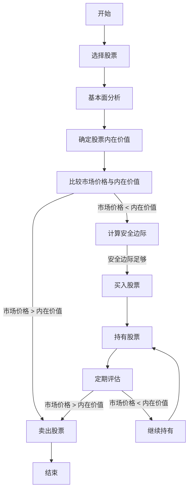

# 格雷厄姆特价股票理论在新兴市场的适用性

> 关键词：格雷厄姆特价股票理论、新兴市场、价值投资、适用性、股票估值

> 摘要：本文旨在深入探讨格雷厄姆特价股票理论在新兴市场的适用性。首先介绍了格雷厄姆特价股票理论的背景和核心概念，分析新兴市场的特点。接着详细阐述该理论的核心算法原理与具体操作步骤，通过数学模型和公式进行理论支撑，并举例说明。通过项目实战展示该理论在实际投资中的应用，包括开发环境搭建、源代码实现与解读。探讨了该理论在新兴市场的实际应用场景，推荐了相关的学习资源、开发工具和论文著作。最后总结其未来发展趋势与挑战，解答常见问题并提供扩展阅读和参考资料，为投资者在新兴市场运用格雷厄姆特价股票理论提供全面的参考和指导。

## 1. 背景介绍 
### 1.1 目的和范围
格雷厄姆特价股票理论作为价值投资的经典理论，在成熟资本市场中被广泛应用并取得了显著成效。然而，新兴市场具有与成熟市场不同的特点，其市场环境、投资者结构、监管政策等方面存在较大差异。本研究的目的在于系统地分析格雷厄姆特价股票理论在新兴市场的适用性，评估该理论在新兴市场投资决策中的有效性和局限性，为投资者在新兴市场运用该理论提供理论支持和实践指导。研究范围涵盖了全球主要新兴市场，包括亚洲、拉丁美洲、非洲等地区的股票市场，通过对不同新兴市场的案例分析和实证研究，探讨该理论在不同市场环境下的表现。

### 1.2 预期读者
本文预期读者主要包括对价值投资理论感兴趣的投资者，无论是个人投资者还是机构投资者，都可以从本文中获取关于格雷厄姆特价股票理论在新兴市场应用的相关知识和经验。同时，金融专业的学生和研究人员也可以将本文作为研究新兴市场投资策略和价值投资理论的参考资料。此外，证券分析师、基金经理等金融从业者也可以通过本文了解该理论在新兴市场的适用性，为其投资决策和研究工作提供参考。

### 1.3 文档结构概述
本文共分为十个部分。第一部分为背景介绍，阐述了研究的目的和范围、预期读者、文档结构概述以及术语表。第二部分介绍格雷厄姆特价股票理论的核心概念与联系，包括原理和架构的文本示意图以及 Mermaid 流程图。第三部分详细讲解核心算法原理和具体操作步骤，并使用 Python 源代码进行阐述。第四部分介绍数学模型和公式，通过详细讲解和举例说明加深对理论的理解。第五部分进行项目实战，包括开发环境搭建、源代码详细实现和代码解读以及代码分析。第六部分探讨该理论在新兴市场的实际应用场景。第七部分推荐相关的工具和资源，包括学习资源、开发工具框架和相关论文著作。第八部分总结未来发展趋势与挑战。第九部分为附录，解答常见问题。第十部分提供扩展阅读和参考资料。

### 1.4 术语表
#### 1.4.1 核心术语定义
- **格雷厄姆特价股票理论**：由本杰明·格雷厄姆提出的价值投资理论，该理论认为股票存在内在价值，当股票价格低于其内在价值时，股票被低估，具有投资价值，这种被低估的股票被称为特价股票。
- **新兴市场**：指发展中国家或地区的股票市场，这些市场通常具有较高的经济增长率，但市场机制和监管体系相对不成熟，市场波动性较大。
- **价值投资**：一种投资策略，强调通过分析公司的基本面，寻找被低估的股票进行投资，以获取长期的投资回报。
- **股票内在价值**：股票所代表的公司的真实价值，通常通过对公司的财务状况、盈利能力、资产质量等因素进行分析和评估来确定。
- **安全边际**：股票价格低于其内在价值的幅度，安全边际越大，投资风险越低。

#### 1.4.2 相关概念解释
- **基本面分析**：通过研究公司的财务报表、行业前景、管理层素质等基本面因素，评估公司的价值和投资潜力。
- **市盈率（P/E）**：股票价格与每股收益的比率，反映了市场对公司盈利的预期。
- **市净率（P/B）**：股票价格与每股净资产的比率，反映了市场对公司净资产的估值。
- **股息率**：股息与股票价格的比率，反映了公司向股东分配利润的能力。

#### 1.4.3 缩略词列表
- **P/E**：市盈率（Price-to-Earnings Ratio）
- **P/B**：市净率（Price-to-Book Ratio）
- **EPS**：每股收益（Earnings Per Share）
- **ROE**：净资产收益率（Return on Equity）

## 2. 核心概念与联系 

### 格雷厄姆特价股票理论原理
格雷厄姆特价股票理论的核心思想是股票具有内在价值，而市场价格往往会偏离内在价值。当市场价格低于内在价值时，股票被低估，投资者可以买入；当市场价格高于内在价值时，股票被高估，投资者应该卖出。该理论强调通过基本面分析来确定股票的内在价值，注重公司的财务状况、盈利能力和资产质量等因素。同时，格雷厄姆提出了安全边际的概念，认为投资者应该在股票价格低于内在价值一定幅度时买入，以降低投资风险。

### 架构的文本示意图
```plaintext
格雷厄姆特价股票理论
|-- 核心思想
|   |-- 股票内在价值
|   |-- 市场价格与内在价值的偏离
|-- 基本面分析
|   |-- 财务状况分析
|   |   |-- 资产负债表
|   |   |-- 利润表
|   |   |-- 现金流量表
|   |-- 盈利能力分析
|   |   |-- 毛利率
|   |   |-- 净利率
|   |   |-- ROE
|   |-- 资产质量分析
|   |   |-- 净资产
|   |   |-- 固定资产
|   |   |-- 无形资产
|-- 安全边际
|   |-- 定义
|   |-- 计算方法
|   |-- 作用
```

### Mermaid 流程图


## 3. 核心算法原理 & 具体操作步骤 

### 核心算法原理
格雷厄姆特价股票理论的核心算法是确定股票的内在价值。格雷厄姆提出了多种计算内在价值的方法，其中一种经典的方法是使用以下公式：

$$V = \frac{EPS \times (8.5 + 2g) \times 4.4}{Y}$$

其中：
- $V$ 表示股票的内在价值
- $EPS$ 表示每股收益
- $8.5$ 是格雷厄姆认为的一家无增长公司的合理市盈率
- $g$ 表示公司的预期增长率
- $4.4$ 是 1962 年的 AAA 级公司债券收益率
- $Y$ 是当前的 AAA 级公司债券收益率

### 具体操作步骤
1. **收集数据**：收集目标股票的财务报表，包括资产负债表、利润表和现金流量表，获取每股收益（EPS）等数据。同时，查询当前的 AAA 级公司债券收益率（Y）。
2. **估计公司预期增长率（g）**：可以通过分析公司的历史业绩、行业前景、管理层计划等因素来估计公司的预期增长率。
3. **计算内在价值（V）**：将收集到的数据代入上述公式，计算股票的内在价值。
4. **比较市场价格与内在价值**：将计算得到的内在价值与当前股票的市场价格进行比较。如果市场价格低于内在价值，则股票被低估；如果市场价格高于内在价值，则股票被高估。
5. **计算安全边际**：安全边际可以用以下公式计算：

$$安全边际 = \frac{内在价值 - 市场价格}{内在价值} \times 100\%$$

如果安全边际足够大（一般认为安全边际大于 20% - 30%），则可以考虑买入股票。

### Python 源代码实现
```python
def calculate_intrinsic_value(eps, g, y):
    """
    计算股票的内在价值
    :param eps: 每股收益
    :param g: 公司预期增长率
    :param y: 当前的AAA级公司债券收益率
    :return: 股票的内在价值
    """
    # 1962年的AAA级公司债券收益率
    historical_yield = 4.4
    # 无增长公司的合理市盈率
    base_pe = 8.5
    intrinsic_value = (eps * (base_pe + 2 * g) * historical_yield) / y
    return intrinsic_value

def calculate_safety_margin(intrinsic_value, market_price):
    """
    计算安全边际
    :param intrinsic_value: 股票的内在价值
    :param market_price: 股票的市场价格
    :return: 安全边际（百分比）
    """
    safety_margin = ((intrinsic_value - market_price) / intrinsic_value) * 100
    return safety_margin

# 示例数据
eps = 2.0  # 每股收益
g = 0.1  # 公司预期增长率为10%
y = 3.0  # 当前的AAA级公司债券收益率为3%
market_price = 30.0  # 股票的市场价格

# 计算内在价值
intrinsic_value = calculate_intrinsic_value(eps, g, y)
print(f"股票的内在价值: {intrinsic_value}")

# 计算安全边际
safety_margin = calculate_safety_margin(intrinsic_value, market_price)
print(f"安全边际: {safety_margin}%")
```

## 4. 数学模型和公式 & 详细讲解 & 举例说明 

### 数学模型和公式
格雷厄姆计算内在价值的公式为：

$$V = \frac{EPS \times (8.5 + 2g) \times 4.4}{Y}$$

### 详细讲解
- **EPS（每股收益）**：是公司净利润与发行在外普通股股数的比值，反映了公司的盈利能力。每股收益越高，说明公司的盈利能力越强。
- **8.5**：是格雷厄姆认为的一家无增长公司的合理市盈率。市盈率是股票价格与每股收益的比率，反映了市场对公司盈利的预期。对于无增长的公司，市场给予的合理市盈率为 8.5。
- **2g**：表示公司预期增长率对市盈率的影响。公司的预期增长率越高，市场给予的市盈率也会越高。
- **4.4**：是 1962 年的 AAA 级公司债券收益率，作为一个基准收益率。
- **Y**：是当前的 AAA 级公司债券收益率，反映了当前的市场利率水平。市场利率的变化会影响股票的估值，当市场利率上升时，股票的估值会下降；当市场利率下降时，股票的估值会上升。

### 举例说明
假设某公司的每股收益（EPS）为 3 元，预期增长率（g）为 15%，当前的 AAA 级公司债券收益率（Y）为 3.5%。

首先，计算 $(8.5 + 2g)$ 的值：

$$8.5 + 2 \times 0.15 = 8.5 + 0.3 = 8.8$$

然后，代入公式计算内在价值（V）：

$$V = \frac{3 \times 8.8 \times 4.4}{3.5} \approx \frac{116.16}{3.5} \approx 33.19$$

如果该股票的当前市场价格为 30 元，则安全边际为：

$$安全边际 = \frac{33.19 - 30}{33.19} \times 100\% \approx \frac{3.19}{33.19} \times 100\% \approx 9.61\%$$

由于安全边际小于 20% - 30%，按照格雷厄姆的理论，该股票可能不是一个非常理想的投资选择。

## 5. 项目实战：代码实际案例和详细解释说明 

### 5.1  开发环境搭建
1. **安装 Python**：从 Python 官方网站（https://www.python.org/downloads/）下载并安装 Python 3.x 版本。
2. **安装必要的库**：使用 pip 安装所需的库，如 pandas、numpy 等。打开命令行窗口，输入以下命令：

```sh
pip install pandas numpy
```

3. **选择开发工具**：可以选择使用 PyCharm、Jupyter Notebook 等开发工具。如果使用 PyCharm，从 JetBrains 官方网站（https://www.jetbrains.com/pycharm/download/）下载并安装 PyCharm Community 版本；如果使用 Jupyter Notebook，可以使用 Anaconda 进行安装，从 Anaconda 官方网站（https://www.anaconda.com/products/individual）下载并安装 Anaconda。

### 5.2  源代码详细实现和代码解读
```python
import pandas as pd
import numpy as np

def calculate_intrinsic_value(eps, g, y):
    """
    计算股票的内在价值
    :param eps: 每股收益
    :param g: 公司预期增长率
    :param y: 当前的AAA级公司债券收益率
    :return: 股票的内在价值
    """
    # 1962年的AAA级公司债券收益率
    historical_yield = 4.4
    # 无增长公司的合理市盈率
    base_pe = 8.5
    intrinsic_value = (eps * (base_pe + 2 * g) * historical_yield) / y
    return intrinsic_value

def calculate_safety_margin(intrinsic_value, market_price):
    """
    计算安全边际
    :param intrinsic_value: 股票的内在价值
    :param market_price: 股票的市场价格
    :return: 安全边际（百分比）
    """
    safety_margin = ((intrinsic_value - market_price) / intrinsic_value) * 100
    return safety_margin

# 读取股票数据文件
data = pd.read_csv('stock_data.csv')

# 初始化结果列表
results = []

# 遍历每一行数据
for index, row in data.iterrows():
    eps = row['EPS']
    g = row['Growth_Rate']
    y = row['Bond_Yield']
    market_price = row['Market_Price']
    
    # 计算内在价值
    intrinsic_value = calculate_intrinsic_value(eps, g, y)
    
    # 计算安全边际
    safety_margin = calculate_safety_margin(intrinsic_value, market_price)
    
    # 将结果添加到列表中
    results.append({
        'Stock_Name': row['Stock_Name'],
        'Intrinsic_Value': intrinsic_value,
        'Safety_Margin': safety_margin
    })

# 将结果转换为 DataFrame
result_df = pd.DataFrame(results)

# 筛选出安全边际大于 30% 的股票
selected_stocks = result_df[result_df['Safety_Margin'] > 30]

# 输出结果
print(selected_stocks)
```

### 代码解读与分析
1. **导入必要的库**：导入 pandas 和 numpy 库，用于数据处理和数值计算。
2. **定义计算内在价值和安全边际的函数**：`calculate_intrinsic_value` 函数用于计算股票的内在价值，`calculate_safety_margin` 函数用于计算安全边际。
3. **读取股票数据文件**：使用 `pandas` 的 `read_csv` 函数读取包含股票数据的 CSV 文件。
4. **遍历每一行数据**：使用 `iterrows` 方法遍历数据的每一行，获取每股收益（EPS）、公司预期增长率（g）、当前的 AAA 级公司债券收益率（Y）和股票的市场价格。
5. **计算内在价值和安全边际**：调用定义的函数计算每只股票的内在价值和安全边际。
6. **将结果添加到列表中**：将每只股票的名称、内在价值和安全边际添加到结果列表中。
7. **将结果转换为 DataFrame**：使用 `pandas` 的 `DataFrame` 函数将结果列表转换为 DataFrame。
8. **筛选出安全边际大于 30% 的股票**：使用布尔索引筛选出安全边际大于 30% 的股票。
9. **输出结果**：打印筛选出的股票信息。

通过上述代码，我们可以对多只股票进行批量分析，筛选出符合格雷厄姆特价股票理论的股票。

## 6. 实际应用场景 
### 个人投资者
个人投资者可以使用格雷厄姆特价股票理论在新兴市场中寻找被低估的股票进行投资。通过基本面分析和计算股票的内在价值，个人投资者可以判断股票的投资价值，选择具有安全边际的股票进行长期投资。例如，个人投资者可以关注新兴市场中一些具有稳定盈利能力和良好资产质量的公司，通过分析其财务报表和行业前景，计算其内在价值，当股票价格低于内在价值且安全边际足够大时，买入该股票。

### 机构投资者
机构投资者如基金公司、保险公司等可以将格雷厄姆特价股票理论作为投资策略的一部分。机构投资者通常具有更专业的研究团队和更丰富的资源，可以对新兴市场中的大量股票进行深入分析和研究。通过运用该理论，机构投资者可以筛选出具有投资价值的股票，构建投资组合，降低投资风险，提高投资回报。例如，基金公司可以根据格雷厄姆特价股票理论选择一些被低估的股票纳入基金组合，以实现资产的保值增值。

### 证券分析师
证券分析师可以运用格雷厄姆特价股票理论对新兴市场中的股票进行估值和评级。通过分析公司的基本面和计算股票的内在价值，证券分析师可以为投资者提供投资建议和参考。例如，证券分析师可以发布研究报告，推荐一些被低估的股票，并分析其投资价值和风险。

### 企业并购
在企业并购中，格雷厄姆特价股票理论可以帮助收购方评估目标公司的价值。通过分析目标公司的财务状况和盈利能力，计算其内在价值，收购方可以判断目标公司是否被低估，从而确定合理的收购价格。例如，一家企业在考虑收购新兴市场中的另一家企业时，可以运用该理论对目标企业进行估值，避免过高的收购价格。

## 7. 工具和资源推荐
### 7.1 学习资源推荐
#### 7.1.1 书籍推荐
- 《聪明的投资者》（The Intelligent Investor）：本杰明·格雷厄姆的经典著作，被誉为投资领域的圣经，详细阐述了价值投资的理念和方法。
- 《证券分析》（Security Analysis）：同样是本杰明·格雷厄姆的著作，是价值投资理论的奠基之作，对股票和债券的分析方法进行了深入探讨。
- 《怎样选择成长股》（Common Stocks and Uncommon Profits）：菲利普·费雪的著作，介绍了寻找成长股的方法和技巧，与格雷厄姆的价值投资理论相互补充。

#### 7.1.2 在线课程
- Coursera 上的“投资学原理”课程：由知名大学的教授授课，系统地介绍了投资学的基本原理和方法，包括价值投资理论。
- Udemy 上的“价值投资实战课程”：通过实际案例讲解价值投资的应用，帮助学习者掌握价值投资的技巧。

#### 7.1.3 技术博客和网站
- 雪球网：国内知名的投资交流社区，有很多投资者分享自己的投资经验和研究成果，包括对格雷厄姆特价股票理论的应用和讨论。
- Seeking Alpha：国外的投资研究网站，提供大量的股票分析报告和投资观点，对理解价值投资理论在不同市场的应用有很大帮助。

### 7.2 开发工具框架推荐
#### 7.2.1 IDE和编辑器
- PyCharm：一款专业的 Python 集成开发环境，具有代码自动补全、调试、版本控制等功能，适合开发与股票分析相关的 Python 程序。
- Jupyter Notebook：一个交互式的开发环境，支持 Python、R 等多种编程语言，方便进行数据探索和分析，适合进行股票数据的处理和可视化。

#### 7.2.2 调试和性能分析工具
- pdb：Python 自带的调试工具，可以帮助开发者在代码中设置断点，逐步执行代码，查找和解决问题。
- cProfile：Python 的性能分析工具，可以分析代码的运行时间和函数调用情况，帮助开发者优化代码性能。

#### 7.2.3 相关框架和库
- pandas：用于数据处理和分析的 Python 库，提供了高效的数据结构和数据操作方法，适合处理股票数据。
- numpy：用于数值计算的 Python 库，提供了大量的数学函数和数组操作方法，在股票数据的计算和分析中经常使用。
- matplotlib：用于数据可视化的 Python 库，可以绘制各种图表，如折线图、柱状图、散点图等，帮助开发者直观地展示股票数据。

### 7.3 相关论文著作推荐
#### 7.3.1 经典论文
- Graham, B., & Dodd, D. L. (1934). Security Analysis. This classic paper lays the foundation for value investing theory and provides a detailed analysis of stock and bond valuation methods.
- Graham, B. (1949). The Intelligent Investor. This paper further elaborates on the concept and method of value investing, emphasizing the importance of safety margin.

#### 7.3.2 最新研究成果
- Research on the applicability of Graham's special - value stock theory in emerging markets in recent years, which can be found in academic databases such as SSRN, EBSCOhost, etc. These studies usually analyze the effectiveness and limitations of the theory in emerging markets through empirical research and case analysis.

#### 7.3.3 应用案例分析
- Case studies of investment companies or investors applying Graham's special - value stock theory in emerging markets. These case studies can be found in financial magazines, investment research reports, etc. By analyzing these cases, we can better understand how to apply the theory in practice.

## 8. 总结：未来发展趋势与挑战
### 未来发展趋势
1. **与其他投资理论的融合**：随着金融市场的不断发展和变化，格雷厄姆特价股票理论可能会与其他投资理论如成长投资理论、量化投资理论等相互融合。例如，在寻找被低估股票的同时，结合公司的成长潜力进行综合分析，以提高投资决策的准确性。
2. **大数据和人工智能的应用**：大数据和人工智能技术的发展将为格雷厄姆特价股票理论的应用带来新的机遇。通过收集和分析大量的股票数据、公司财务数据、行业数据等，利用人工智能算法可以更准确地估计公司的预期增长率和股票的内在价值，提高投资决策的效率和准确性。
3. **在新兴市场的更广泛应用**：随着新兴市场的不断发展和成熟，投资者对价值投资理念的认识和接受程度不断提高，格雷厄姆特价股票理论在新兴市场的应用将更加广泛。同时，新兴市场的特点也将促使该理论不断进行改进和完善，以适应新兴市场的特殊环境。

### 挑战
1. **新兴市场数据的质量和可靠性**：新兴市场的数据质量和可靠性相对较低，可能存在数据不完整、不准确等问题。这将给计算股票内在价值和分析公司基本面带来困难，影响投资决策的准确性。
2. **市场波动性和不确定性**：新兴市场的市场波动性较大，受到宏观经济政策、政治局势、国际资本流动等多种因素的影响。股票价格的波动可能会导致股票的市场价格与内在价值的偏离较大，增加了运用格雷厄姆特价股票理论进行投资的难度和风险。
3. **投资者情绪和行为偏差**：新兴市场的投资者结构相对复杂，投资者情绪和行为偏差对市场的影响较大。投资者的过度乐观或悲观情绪可能会导致股票价格的非理性波动，使股票价格难以反映其内在价值，从而影响格雷厄姆特价股票理论的应用效果。

## 9. 附录：常见问题与解答
### 1. 格雷厄姆特价股票理论在新兴市场一定能取得成功吗？
不一定。虽然格雷厄姆特价股票理论在成熟市场中被证明是有效的，但新兴市场具有其特殊性，如市场机制不完善、数据质量不高、投资者情绪波动较大等。这些因素可能会影响该理论在新兴市场的应用效果，投资者需要结合新兴市场的实际情况进行分析和判断，并采取适当的风险管理措施。

### 2. 如何准确估计公司的预期增长率（g）？
估计公司的预期增长率是一个复杂的过程，需要综合考虑多个因素。可以从以下几个方面入手：
- **分析公司的历史业绩**：观察公司过去几年的营业收入、净利润等指标的增长情况，了解公司的增长趋势。
- **研究行业前景**：分析公司所处行业的发展趋势、市场规模、竞争格局等因素，判断行业的增长潜力。
- **关注公司的战略规划**：了解公司的新产品研发、市场拓展、并购重组等战略规划，评估这些举措对公司未来增长的影响。
- **参考专业机构的研究报告**：可以参考证券公司、研究机构等发布的研究报告，获取他们对公司预期增长率的估计和分析。

### 3. 安全边际的大小应该如何确定？
安全边际的大小没有固定的标准，一般认为安全边际大于 20% - 30% 比较合适。但在实际应用中，需要根据市场环境、行业特点、公司风险等因素进行综合考虑。在新兴市场中，由于市场波动性较大，可能需要更高的安全边际来降低投资风险。

### 4. 格雷厄姆特价股票理论适用于所有类型的股票吗？
不是。该理论更适用于具有稳定盈利能力、良好资产质量和可预测现金流的公司的股票。对于一些新兴行业的公司，如科技初创企业，由于其未来发展的不确定性较大，盈利模式不稳定，难以准确估计其内在价值，因此格雷厄姆特价股票理论可能不太适用。

## 10. 扩展阅读 & 参考资料
### 扩展阅读
- 《金融炼金术》（The Alchemy of Finance）：乔治·索罗斯的著作，介绍了他的反身性理论，对理解金融市场的运行机制和投资者行为有很大帮助。
- 《穷查理宝典》（Poor Charlie's Almanack）：收录了查理·芒格的演讲和文章，阐述了他的投资理念和思维方式，与格雷厄姆的价值投资理论相互补充。

### 参考资料
- Graham, B., & Dodd, D. L. (1934). Security Analysis.
- Graham, B. (1949). The Intelligent Investor.
- Fama, E. F., & French, K. R. (1992). The Cross - Section of Expected Stock Returns.
- 雪球网、Seeking Alpha 等投资网站上的相关文章和研究报告。
- 各新兴市场国家的证券交易所发布的市场数据和研究报告。