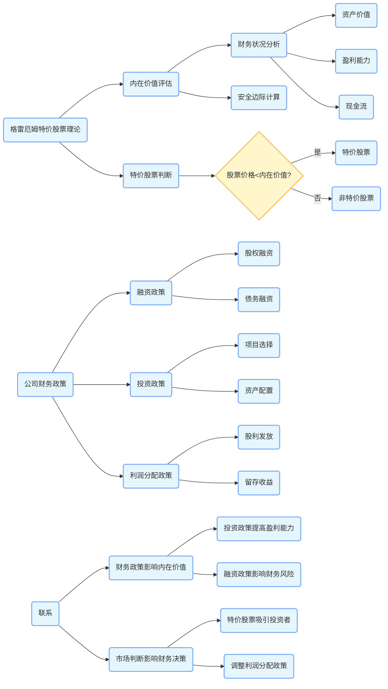

# 格雷厄姆特价股票理论对公司财务政策的影响

> 关键词：格雷厄姆特价股票理论、公司财务政策、价值投资、财务决策、股票估值

> 摘要：本文深入探讨了格雷厄姆特价股票理论对公司财务政策的影响。首先介绍了格雷厄姆特价股票理论的背景和核心概念，接着分析了该理论的算法原理及数学模型。通过项目实战案例，详细展示了理论在实际中的应用。同时，探讨了该理论在不同实际场景中的影响，并推荐了相关的学习资源、开发工具和论文著作。最后总结了未来的发展趋势与挑战，解答了常见问题并提供了扩展阅读和参考资料，旨在全面剖析格雷厄姆特价股票理论与公司财务政策之间的关系及其影响。

## 1. 背景介绍 
### 1.1 目的和范围
本研究的目的在于全面、深入地分析格雷厄姆特价股票理论对公司财务政策产生的影响。格雷厄姆作为价值投资的先驱，其特价股票理论在投资领域具有深远的影响。公司的财务政策涉及到融资、投资、利润分配等多个关键方面，探究该理论与公司财务政策的关联，有助于公司更好地制定合理的财务决策，优化资源配置，提升公司价值。研究范围涵盖了格雷厄姆特价股票理论的基本原理、相关数学模型，以及该理论在不同行业、不同规模公司中的应用情况，通过理论分析和实际案例相结合的方式，揭示其对公司财务政策的多维度影响。

### 1.2 预期读者
本文预期读者包括公司财务管理人员、投资分析师、金融专业学生以及对价值投资和公司财务政策感兴趣的人士。对于公司财务管理人员，有助于他们在制定财务政策时，充分考虑市场对公司股票价值的评估，从而做出更符合公司长远利益的决策；投资分析师可以通过了解该理论对公司财务政策的影响，更准确地评估公司的投资价值；金融专业学生能够借此深入学习价值投资理论与公司财务实践的结合；而对该领域感兴趣的人士可以拓宽知识面，加深对投资和公司财务运作的理解。

### 1.3 文档结构概述
本文将按照以下结构展开：首先介绍格雷厄姆特价股票理论的背景知识，包括目的、预期读者和文档结构概述等内容，同时对相关术语进行定义和解释；接着阐述该理论的核心概念及其与公司财务政策的联系，并通过文本示意图和 Mermaid 流程图进行直观展示；然后详细讲解该理论的核心算法原理，结合 Python 源代码进行说明，同时介绍相关的数学模型和公式，并举例说明；之后通过项目实战，展示该理论在实际中的应用，包括开发环境搭建、源代码实现和代码解读；再探讨该理论在不同实际场景中的应用；推荐相关的学习资源、开发工具和论文著作；最后总结未来发展趋势与挑战，解答常见问题并提供扩展阅读和参考资料。

### 1.4 术语表
#### 1.4.1 核心术语定义
- **格雷厄姆特价股票理论**：由本杰明·格雷厄姆（Benjamin Graham）提出的一种价值投资理论，该理论认为股票存在内在价值，当股票价格低于其内在价值一定程度时，即成为特价股票，具有投资价值。
- **公司财务政策**：公司在融资、投资、利润分配等方面制定的一系列政策和决策，旨在实现公司价值最大化和股东利益最大化。
- **内在价值**：股票所代表的公司的真实价值，通常基于公司的财务状况、盈利能力、资产价值等因素进行评估。

#### 1.4.2 相关概念解释
- **价值投资**：一种投资策略，强调通过对公司基本面的分析，寻找被市场低估的股票进行投资，以获取长期的投资回报。
- **安全边际**：格雷厄姆理论中的重要概念，指股票的内在价值与市场价格之间的差值，安全边际越大，投资风险越低。

#### 1.4.3 缩略词列表
- **EPS**：Earnings Per Share，每股收益
- **BVPS**：Book Value Per Share，每股账面价值

## 2. 核心概念与联系 
### 格雷厄姆特价股票理论核心概念
格雷厄姆特价股票理论的核心在于寻找被市场低估的股票。格雷厄姆认为，股票的价格会围绕其内在价值波动，但市场往往会出现非理性的情况，导致股票价格偏离其内在价值。当股票价格低于内在价值一定程度时，就形成了特价股票。内在价值的评估主要基于公司的财务状况，包括资产、盈利、现金流等因素。

### 公司财务政策核心概念
公司财务政策主要包括融资政策、投资政策和利润分配政策。融资政策涉及公司如何筹集资金，包括股权融资、债务融资等方式；投资政策关注公司如何将资金投入到不同的项目中，以实现资产的增值；利润分配政策则决定了公司将多少利润分配给股东，多少留存用于再投资。

### 两者的联系
格雷厄姆特价股票理论与公司财务政策存在着紧密的联系。一方面，公司的财务政策会影响其内在价值，进而影响股票价格是否成为特价股票。例如，合理的投资政策可以提高公司的盈利能力，增加公司的内在价值；而不当的融资政策可能会增加公司的财务风险，降低其内在价值。另一方面，市场对公司股票是否为特价股票的判断，也会影响公司的财务决策。如果公司股票被市场认为是特价股票，可能会吸引更多的投资者，从而影响公司的融资成本和融资方式；同时，公司也可能会调整其利润分配政策，以提高股东的信心。

### 文本示意图
```plaintext
格雷厄姆特价股票理论
|
|-- 内在价值评估
|   |-- 财务状况分析
|   |   |-- 资产价值
|   |   |-- 盈利能力
|   |   |-- 现金流
|   |
|   |-- 安全边际计算
|
|-- 特价股票判断
|   |-- 股票价格与内在价值比较

公司财务政策
|
|-- 融资政策
|   |-- 股权融资
|   |-- 债务融资
|
|-- 投资政策
|   |-- 项目选择
|   |-- 资产配置
|
|-- 利润分配政策
|   |-- 股利发放
|   |-- 留存收益

联系
|
|-- 财务政策影响内在价值
|   |-- 投资政策提高盈利能力
|   |-- 融资政策影响财务风险
|
|-- 市场判断影响财务决策
|   |-- 特价股票吸引投资者
|   |-- 调整利润分配政策
```

### Mermaid 流程图


## 3. 核心算法原理 & 具体操作步骤 
### 格雷厄姆内在价值评估算法原理
格雷厄姆提出了一种简单的内在价值评估公式：
\[ V = EPS \times (8.5 + 2g) \]
其中，$V$ 表示股票的内在价值，$EPS$ 是每股收益，$g$ 是预期的长期增长率（以百分比表示），8.5 是格雷厄姆认为的一家无增长公司的合理市盈率。

### 具体操作步骤
1. **获取每股收益（EPS）**：可以从公司的财务报表中获取过去几年的每股收益数据，然后计算平均每股收益。
2. **估计预期长期增长率（g）**：可以通过分析公司的历史业绩、行业发展趋势、宏观经济环境等因素来估计公司的预期长期增长率。
3. **计算内在价值（V）**：将每股收益和预期长期增长率代入上述公式，计算出股票的内在价值。
4. **判断是否为特价股票**：将计算出的内在价值与当前股票市场价格进行比较，如果市场价格低于内在价值一定比例（如 50%），则认为该股票是特价股票。

### Python 源代码实现
```python
def graham_intrinsic_value(eps, growth_rate):
    """
    计算格雷厄姆理论下的股票内在价值
    :param eps: 每股收益
    :param growth_rate: 预期长期增长率（百分比）
    :return: 股票内在价值
    """
    return eps * (8.5 + 2 * growth_rate)

# 示例数据
eps = 2.0  # 每股收益为 2 元
growth_rate = 0.05  # 预期长期增长率为 5%

# 计算内在价值
intrinsic_value = graham_intrinsic_value(eps, growth_rate)
print(f"股票内在价值: {intrinsic_value} 元")

# 当前股票市场价格
market_price = 10.0

# 判断是否为特价股票
if market_price < intrinsic_value * 0.5:
    print("该股票是特价股票")
else:
    print("该股票不是特价股票")
```

### 代码解释
- `graham_intrinsic_value` 函数接受每股收益和预期长期增长率作为参数，根据格雷厄姆的公式计算股票的内在价值。
- 示例数据中，每股收益为 2 元，预期长期增长率为 5%，调用函数计算出内在价值。
- 将计算出的内在价值与当前股票市场价格进行比较，判断该股票是否为特价股票。

## 4. 数学模型和公式 & 详细讲解 & 举例说明 
### 格雷厄姆内在价值公式
\[ V = EPS \times (8.5 + 2g) \]
#### 详细讲解
- **EPS（每股收益）**：是指公司净利润与发行在外普通股股数的比值，反映了公司每股股票的盈利水平。每股收益越高，说明公司的盈利能力越强。
- **8.5**：格雷厄姆认为，一家无增长的公司的合理市盈率为 8.5。市盈率是股票价格与每股收益的比值，反映了市场对公司盈利的预期。
- **2g**：$g$ 是预期的长期增长率，乘以 2 是为了考虑公司增长的因素。公司的增长会增加其未来的盈利，从而提高其内在价值。

#### 举例说明
假设一家公司的每股收益为 3 元，预期长期增长率为 8%。则根据格雷厄姆公式计算其内在价值：
\[ V = 3 \times (8.5 + 2 \times 0.08) = 3 \times (8.5 + 0.16) = 3 \times 8.66 = 25.98 \text{（元）} \]
如果当前该股票的市场价格为 12 元，由于 $12 < 25.98 \times 0.5 = 12.99$，则可以认为该股票是特价股票。

### 安全边际公式
安全边际（Margin of Safety）可以用以下公式表示：
\[ MOS = \frac{V - P}{V} \times 100\% \]
其中，$MOS$ 是安全边际率，$V$ 是股票的内在价值，$P$ 是股票的市场价格。

#### 详细讲解
安全边际率反映了股票价格低于内在价值的程度，安全边际率越高，说明投资风险越低。当安全边际率大于一定比例（如 50%）时，通常认为该股票具有较高的投资价值。

#### 举例说明
继续以上述例子为例，内在价值 $V = 25.98$ 元，市场价格 $P = 12$ 元，则安全边际率为：
\[ MOS = \frac{25.98 - 12}{25.98} \times 100\% \approx \frac{13.98}{25.98} \times 100\% \approx 53.81\% \]
由于安全边际率大于 50%，说明该股票具有较高的安全边际，投资风险相对较低。

## 5. 项目实战：代码实际案例和详细解释说明 
### 5.1  开发环境搭建
- **操作系统**：可以选择 Windows、Linux 或 macOS 操作系统。
- **Python 环境**：建议安装 Python 3.7 及以上版本。可以从 Python 官方网站（https://www.python.org/downloads/）下载并安装。
- **开发工具**：可以使用 PyCharm、VS Code 等集成开发环境（IDE），也可以使用 Jupyter Notebook 进行交互式开发。
- **第三方库**：需要安装 `pandas`、`numpy` 等用于数据处理和分析的库，可以使用以下命令进行安装：
```sh
pip install pandas numpy
```

### 5.2  源代码详细实现和代码解读
```python
import pandas as pd
import numpy as np

# 读取公司财务数据
def read_financial_data(file_path):
    """
    读取公司财务数据
    :param file_path: 数据文件路径
    :return: 财务数据 DataFrame
    """
    data = pd.read_csv(file_path)
    return data

# 计算平均每股收益
def calculate_average_eps(data):
    """
    计算平均每股收益
    :param data: 财务数据 DataFrame
    :return: 平均每股收益
    """
    eps_values = data['EPS'].values
    average_eps = np.mean(eps_values)
    return average_eps

# 估计预期长期增长率（简单示例，实际中需更复杂分析）
def estimate_growth_rate(data):
    """
    估计预期长期增长率
    :param data: 财务数据 DataFrame
    :return: 预期长期增长率
    """
    # 这里简单地使用过去几年的平均增长率作为估计值
    growth_rates = data['Growth_Rate'].values
    average_growth_rate = np.mean(growth_rates)
    return average_growth_rate

# 计算格雷厄姆内在价值
def graham_intrinsic_value(eps, growth_rate):
    """
    计算格雷厄姆理论下的股票内在价值
    :param eps: 每股收益
    :param growth_rate: 预期长期增长率（百分比）
    :return: 股票内在价值
    """
    return eps * (8.5 + 2 * growth_rate)

# 判断是否为特价股票
def is_bargain_stock(intrinsic_value, market_price, margin_threshold=0.5):
    """
    判断是否为特价股票
    :param intrinsic_value: 股票内在价值
    :param market_price: 股票市场价格
    :param margin_threshold: 安全边际阈值
    :return: 是否为特价股票
    """
    if market_price < intrinsic_value * margin_threshold:
        return True
    else:
        return False

# 主函数
def main():
    file_path = 'financial_data.csv'  # 财务数据文件路径
    market_price = 15.0  # 当前股票市场价格

    # 读取财务数据
    data = read_financial_data(file_path)

    # 计算平均每股收益
    average_eps = calculate_average_eps(data)

    # 估计预期长期增长率
    growth_rate = estimate_growth_rate(data)

    # 计算格雷厄姆内在价值
    intrinsic_value = graham_intrinsic_value(average_eps, growth_rate)

    # 判断是否为特价股票
    bargain = is_bargain_stock(intrinsic_value, market_price)

    if bargain:
        print("该股票是特价股票")
    else:
        print("该股票不是特价股票")

if __name__ == "__main__":
    main()
```

### 5.3  代码解读与分析
- **`read_financial_data` 函数**：用于读取公司的财务数据，假设数据以 CSV 文件的形式存储。
- **`calculate_average_eps` 函数**：计算过去几年的平均每股收益，使用 `numpy` 库的 `mean` 函数进行计算。
- **`estimate_growth_rate` 函数**：估计预期长期增长率，这里简单地使用过去几年的平均增长率作为估计值，实际中需要更复杂的分析。
- **`graham_intrinsic_value` 函数**：根据格雷厄姆公式计算股票的内在价值。
- **`is_bargain_stock` 函数**：判断股票是否为特价股票，通过比较市场价格和内在价值的一定比例。
- **`main` 函数**：主函数，依次调用上述函数，完成数据读取、计算和判断，并输出结果。

## 6. 实际应用场景 
### 公司融资决策
如果公司股票被市场认为是特价股票，可能会吸引更多的投资者，从而降低公司的股权融资成本。公司可以考虑增加股权融资的比例，以筹集更多的资金用于扩大生产、研发等项目。例如，一家科技公司的股票由于市场低估成为特价股票，该公司可以通过增发股票的方式，以较低的成本筹集资金，用于新技术的研发和市场拓展。

### 公司投资决策
当公司股票被市场低估时，公司管理层可能会认为市场对公司的未来发展前景评估不足。此时，公司可以加大对一些有潜力项目的投资，以提升公司的长期价值。例如，一家传统制造业公司的股票被市场低估，公司管理层可以决定加大对智能制造领域的投资，提高生产效率和产品质量，从而提升公司的竞争力和内在价值。

### 利润分配决策
如果公司股票是特价股票，为了提高股东的信心，公司可能会调整其利润分配政策，增加股利的发放。这样可以吸引更多的投资者关注公司，提升股票的市场价格。例如，一家公用事业公司的股票被市场低估，公司可以适当提高股利支付率，向股东传递公司经营稳定、有能力回报股东的信号。

### 并购重组决策
对于拥有特价股票的公司，可能会成为其他公司并购的目标。因为收购方可以以较低的成本获得公司的控制权，从而实现资源整合和协同效应。同时，被低估的公司也可以主动寻求并购重组的机会，以提升公司的价值。例如，一家小型企业的股票被市场低估，一家大型企业可以通过并购该小型企业，获得其技术、市场渠道等资源，实现规模扩张和多元化发展。

## 7. 工具和资源推荐
### 7.1 学习资源推荐
#### 7.1.1 书籍推荐
- 《聪明的投资者》（The Intelligent Investor）：本杰明·格雷厄姆的经典著作，详细阐述了价值投资的理念和方法，是学习格雷厄姆特价股票理论的必读之书。
- 《证券分析》（Security Analysis）：同样是格雷厄姆的著作，对证券的估值和分析进行了深入探讨，为理解公司内在价值的评估提供了理论基础。
- 《财务报表分析与证券定价》（Financial Statement Analysis and Security Valuation）：介绍了如何通过分析公司的财务报表来评估公司的价值，对于理解公司财务政策与股票价值的关系有很大帮助。

#### 7.1.2 在线课程
- Coursera 平台上的“Financial Markets”课程：由耶鲁大学教授罗伯特·席勒（Robert Shiller）讲授，涵盖了金融市场的基本原理、投资策略等内容，有助于深入理解股票市场和公司财务政策。
- edX 平台上的“Introduction to Financial Accounting”课程：介绍了财务会计的基本概念和方法，对于读懂公司财务报表、理解公司财务状况有很大帮助。

#### 7.1.3 技术博客和网站
- Seeking Alpha（https://seekingalpha.com/）：一个专业的投资研究网站，提供了大量关于股票分析、公司财务政策等方面的文章和研究报告。
- Investopedia（https://www.investopedia.com/）：一个金融知识学习网站，有丰富的金融术语解释、投资策略分析等内容，适合初学者学习。

### 7.2 开发工具框架推荐
#### 7.2.1 IDE和编辑器
- PyCharm：一款专业的 Python 集成开发环境，具有代码自动补全、调试、版本控制等功能，适合开发复杂的数据分析和投资分析程序。
- VS Code：一款轻量级的代码编辑器，支持多种编程语言，通过安装相关插件可以实现 Python 开发的各种功能，如代码调试、格式化等。

#### 7.2.2 调试和性能分析工具
- `pdb`：Python 自带的调试工具，可以帮助开发者在代码中设置断点、查看变量值等，方便调试程序。
- `cProfile`：Python 标准库中的性能分析工具，可以分析程序的运行时间和函数调用情况，帮助优化程序性能。

#### 7.2.3 相关框架和库
- `pandas`：用于数据处理和分析的 Python 库，提供了高效的数据结构和数据操作方法，适合处理公司财务数据。
- `numpy`：Python 的数值计算库，提供了大量的数学函数和数组操作方法，在计算股票内在价值等方面有广泛应用。

### 7.3 相关论文著作推荐
#### 7.3.1 经典论文
- “The Theory of Investment Value” by John Burr Williams：提出了股利贴现模型，为股票估值提供了重要的理论基础，与格雷厄姆的价值投资理论有一定的关联。
- “Capital Structure and Corporate Performance: Evidence from China” by Wei Zhang, Xiaojun Chang：研究了公司资本结构与公司绩效之间的关系，对于理解公司融资政策对公司价值的影响有参考价值。

#### 7.3.2 最新研究成果
- 关注《Journal of Financial Economics》、《The Review of Financial Studies》等国际顶级金融学术期刊，这些期刊上发表的最新研究成果可以帮助了解格雷厄姆特价股票理论和公司财务政策领域的前沿动态。

#### 7.3.3 应用案例分析
- 可以参考一些知名投资机构的研究报告和案例分析，如巴菲特的伯克希尔·哈撒韦公司的年报，其中包含了很多关于价值投资和公司财务决策的实际案例，具有很高的学习和参考价值。

## 8. 总结：未来发展趋势与挑战
### 未来发展趋势
- **与大数据和人工智能的结合**：随着大数据和人工智能技术的发展，未来可以利用更多的数据和更先进的算法来更准确地评估公司的内在价值和判断股票是否为特价股票。例如，通过分析社交媒体数据、行业新闻等非结构化数据，挖掘影响公司价值的潜在因素。
- **国际化应用**：随着全球经济一体化的发展，格雷厄姆特价股票理论将在更广泛的国际市场中得到应用。不同国家和地区的公司财务政策和股票市场环境存在差异，需要进一步研究该理论在不同市场中的适用性和调整方法。
- **与可持续发展理念的融合**：越来越多的投资者开始关注公司的社会责任和可持续发展能力。未来，在评估公司内在价值时，可能会更多地考虑公司的环境、社会和治理（ESG）因素，将格雷厄姆特价股票理论与可持续发展理念相结合。

### 挑战
- **数据准确性和可靠性**：准确的财务数据是评估公司内在价值的基础，但公司财务报表可能存在虚假信息或会计操纵的情况，这给股票估值带来了挑战。同时，宏观经济数据、行业数据等也可能存在误差，影响对公司预期增长率的估计。
- **市场的复杂性和不确定性**：股票市场受到多种因素的影响，如宏观经济环境、政策变化、投资者情绪等，市场的复杂性和不确定性增加了判断股票是否为特价股票的难度。即使股票价格低于内在价值，也可能由于市场的非理性因素而长期维持低价。
- **理论的局限性**：格雷厄姆特价股票理论是基于一定的假设和简化模型提出的，存在一定的局限性。例如，该理论对公司未来增长的估计较为简单，没有充分考虑行业竞争、技术创新等因素对公司价值的影响。

## 9. 附录：常见问题与解答
### 问题 1：格雷厄姆内在价值公式中的 8.5 和 2 是如何确定的？
答：8.5 是格雷厄姆根据经验认为的一家无增长公司的合理市盈率。2 是为了考虑公司增长的因素，是一个经验系数。这些数值是格雷厄姆在长期的投资实践和研究中总结出来的，但并不是绝对的，不同的投资者和分析师可能会根据实际情况进行调整。

### 问题 2：如何准确估计公司的预期长期增长率？
答：估计公司的预期长期增长率是一个复杂的过程，需要综合考虑多个因素。可以分析公司的历史业绩，了解其过去的增长趋势；研究行业的发展前景，判断公司所处行业的增长潜力；关注宏观经济环境，了解经济增长对公司业务的影响；还可以参考专业分析师的研究报告和预测。但需要注意的是，预期长期增长率只是一个估计值，存在一定的不确定性。

### 问题 3：格雷厄姆特价股票理论在新兴行业中是否适用？
答：格雷厄姆特价股票理论在新兴行业中的适用性存在一定的局限性。新兴行业通常具有高增长、高风险的特点，公司的盈利模式和未来发展前景难以准确预测，传统的财务指标可能无法充分反映公司的价值。例如，一些科技初创公司可能在短期内没有盈利，但具有很大的发展潜力。在这种情况下，需要结合新兴行业的特点，对格雷厄姆理论进行适当的调整和补充，采用更灵活的估值方法。

### 问题 4：公司财务政策的调整会立即影响股票价格吗？
答：公司财务政策的调整不一定会立即影响股票价格。股票价格受到多种因素的综合影响，包括市场预期、投资者情绪等。公司财务政策的调整需要一定的时间才能体现出效果，投资者也需要时间来评估这些政策对公司未来价值的影响。因此，股票价格可能会在一段时间后才对公司财务政策的调整做出反应。

## 10. 扩展阅读 & 参考资料
### 扩展阅读
- 《价值投资实战手册》：作者唐朝，结合中国股票市场的实际情况，深入讲解了价值投资的理念和方法，对于理解格雷厄姆特价股票理论在中国市场的应用有很大帮助。
- 《漫步华尔街》（A Random Walk Down Wall Street）：作者伯顿·马尔基尔（Burton G. Malkiel），探讨了股票市场的有效性和投资策略，从不同的角度分析了股票投资的问题。

### 参考资料
- Graham, Benjamin. The Intelligent Investor. HarperBusiness, 2003.
- Graham, Benjamin, and David Dodd. Security Analysis. McGraw-Hill, 1934.
- Williams, John Burr. The Theory of Investment Value. Harvard University Press, 1938.
- 相关公司的财务报表和年报。
- 金融学术期刊和研究报告。