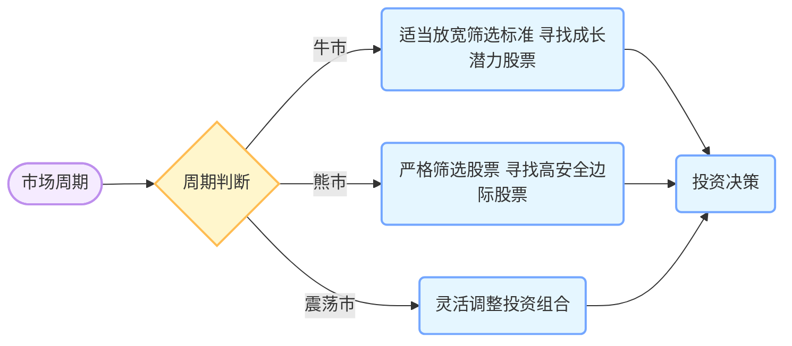

# 格雷厄姆特价股票策略在不同市场周期中的动态调整

> 关键词：格雷厄姆特价股票策略、市场周期、动态调整、价值投资、股票估值

> 摘要：本文深入探讨了格雷厄姆特价股票策略在不同市场周期中的动态调整方法。首先介绍了格雷厄姆特价股票策略的背景与核心概念，接着阐述其核心算法原理和具体操作步骤，通过数学模型和公式详细讲解策略的理论基础。在项目实战部分，给出代码实际案例并进行详细解释。分析了该策略在不同市场周期的实际应用场景，推荐了相关的学习工具和资源。最后总结其未来发展趋势与挑战，解答常见问题并提供扩展阅读和参考资料，旨在为投资者在不同市场环境下运用格雷厄姆特价股票策略提供全面、深入的指导。

## 1. 背景介绍 
### 1.1 目的和范围
格雷厄姆特价股票策略作为价值投资领域的经典策略，由本杰明·格雷厄姆创立，旨在寻找被市场低估的股票以获取长期投资回报。本文章的目的在于探讨该策略在不同市场周期（如牛市、熊市、震荡市）中的动态调整方法，以提高策略的适应性和盈利能力。范围涵盖了策略的原理、算法、实际应用案例以及相关工具资源等方面，为投资者和研究人员提供全面的参考。

### 1.2 预期读者
本文预期读者包括对价值投资感兴趣的个人投资者、金融从业者、投资研究人员以及相关专业的学生。无论是初涉投资领域的新手，还是有一定经验的专业人士，都能从本文中获取关于格雷厄姆特价股票策略在不同市场周期调整的有价值信息。

### 1.3 文档结构概述
本文首先介绍格雷厄姆特价股票策略的背景知识，包括目的、预期读者和文档结构等。接着阐述核心概念与联系，给出原理和架构的文本示意图及 Mermaid 流程图。然后讲解核心算法原理和具体操作步骤，通过 Python 源代码详细说明。之后介绍数学模型和公式，并举例说明。在项目实战部分，详细介绍开发环境搭建、源代码实现和代码解读。分析该策略在不同市场周期的实际应用场景，推荐相关的学习工具和资源。最后总结未来发展趋势与挑战，解答常见问题并提供扩展阅读和参考资料。

### 1.4 术语表
#### 1.4.1 核心术语定义
- **格雷厄姆特价股票策略**：一种基于价值投资理念的股票投资策略，通过对股票基本面的分析，寻找价格低于内在价值的股票进行投资。
- **市场周期**：指股票市场从牛市到熊市，再到牛市的周期性变化过程，通常包括牛市、熊市和震荡市三个阶段。
- **价值投资**：一种投资理念，强调通过对公司基本面的分析，寻找被市场低估的股票，长期持有以获取投资回报。
- **股票估值**：对股票内在价值的评估，常用的方法包括市盈率、市净率、现金流折现等。

#### 1.4.2 相关概念解释
- **牛市**：指股票市场整体上涨的阶段，投资者情绪乐观，市场交易活跃。
- **熊市**：指股票市场整体下跌的阶段，投资者情绪悲观，市场交易清淡。
- **震荡市**：指股票市场在一定区间内波动的阶段，市场缺乏明显的趋势。

#### 1.4.3 缩略词列表
- **PE**：市盈率（Price-to-Earnings Ratio），指股票价格与每股收益的比率。
- **PB**：市净率（Price-to-Book Ratio），指股票价格与每股净资产的比率。
- **DCF**：现金流折现（Discounted Cash Flow），一种股票估值方法，通过预测公司未来的现金流并折现来评估股票的内在价值。

## 2. 核心概念与联系 

### 格雷厄姆特价股票策略的核心原理
格雷厄姆特价股票策略的核心原理基于价值投资理念，认为股票的价格会围绕其内在价值波动。当股票价格低于其内在价值时，股票被低估，具有投资价值；当股票价格高于其内在价值时，股票被高估，应避免投资。

格雷厄姆提出了一系列评估股票内在价值的方法，其中最著名的是“安全边际”原则。安全边际是指股票价格与内在价值之间的差额，差额越大，投资的安全性越高。格雷厄姆认为，投资者应该寻找具有足够安全边际的股票进行投资，以降低投资风险。

### 策略与市场周期的联系
不同的市场周期对股票价格和公司基本面有着不同的影响，因此格雷厄姆特价股票策略需要根据市场周期进行动态调整。

在牛市中，市场整体上涨，投资者情绪乐观，股票价格普遍较高。此时，按照格雷厄姆的标准，可能很难找到被低估的股票。因此，在牛市中，策略可能需要适当放宽筛选标准，或者寻找一些具有成长潜力的股票，以获取更高的收益。

在熊市中，市场整体下跌，投资者情绪悲观，股票价格普遍较低。此时，可能会出现大量被低估的股票，是实施格雷厄姆特价股票策略的好时机。投资者可以更加严格地筛选股票，寻找具有较高安全边际的股票进行投资。

在震荡市中，市场缺乏明显的趋势，股票价格波动较大。此时，策略需要更加灵活，根据市场的短期变化及时调整投资组合。

### 文本示意图
格雷厄姆特价股票策略与市场周期的联系可以用以下文本示意图表示：

市场周期 -> 股票价格和公司基本面变化 -> 格雷厄姆特价股票策略调整 -> 投资决策

### Mermaid 流程图


## 3. 核心算法原理 & 具体操作步骤 

### 核心算法原理
格雷厄姆特价股票策略的核心算法主要包括股票筛选和估值两个部分。

#### 股票筛选
股票筛选是根据格雷厄姆提出的一系列标准，从众多股票中筛选出符合条件的股票。常见的筛选标准包括：
- **低市盈率（PE）**：市盈率是股票价格与每股收益的比率，低市盈率通常表示股票被低估。
- **低市净率（PB）**：市净率是股票价格与每股净资产的比率，低市净率通常表示股票被低估。
- **高股息率**：股息率是股息与股票价格的比率，高股息率表示股票具有较高的分红能力。

#### 估值
估值是对筛选出的股票进行内在价值评估，以确定股票是否被低估。常见的估值方法包括：
- **股息折现模型（DDM）**：通过预测公司未来的股息并折现来评估股票的内在价值。
- **现金流折现模型（DCF）**：通过预测公司未来的现金流并折现来评估股票的内在价值。
- **相对估值法**：通过与同行业其他公司的市盈率、市净率等指标进行比较，来评估股票的相对价值。

### 具体操作步骤
以下是使用 Python 实现格雷厄姆特价股票策略的具体操作步骤：

```python
import pandas as pd
import yfinance as yf

# 步骤 1：获取股票数据
def get_stock_data(tickers, start_date, end_date):
    data = yf.download(tickers, start=start_date, end=end_date)
    return data

# 步骤 2：筛选股票
def screen_stocks(data):
    # 计算市盈率和市净率
    data['PE'] = data['Close'] / data['Earnings Per Share']
    data['PB'] = data['Close'] / data['Book Value Per Share']
    
    # 筛选低市盈率和低市净率的股票
    screened_data = data[(data['PE'] < 15) & (data['PB'] < 1.5)]
    
    return screened_data

# 步骤 3：估值
def value_stocks(screened_data):
    # 这里简单使用股息折现模型进行估值
    # 假设股息增长率为 5%，折现率为 10%
    dividend_growth_rate = 0.05
    discount_rate = 0.1
    
    screened_data['Intrinsic Value'] = screened_data['Dividends'] * (1 + dividend_growth_rate) / (discount_rate - dividend_growth_rate)
    
    # 筛选出价格低于内在价值的股票
    undervalued_stocks = screened_data[screened_data['Close'] < screened_data['Intrinsic Value']]
    
    return undervalued_stocks

# 主函数
def main():
    tickers = ['AAPL', 'MSFT', 'GOOG']  # 股票代码列表
    start_date = '2020-01-01'
    end_date = '2021-01-01'
    
    # 获取股票数据
    stock_data = get_stock_data(tickers, start_date, end_date)
    
    # 筛选股票
    screened_stocks = screen_stocks(stock_data)
    
    # 估值
    undervalued_stocks = value_stocks(screened_stocks)
    
    print(undervalued_stocks)

if __name__ == "__main__":
    main()
```

### 代码解释
- `get_stock_data` 函数：使用 `yfinance` 库获取指定股票在指定时间范围内的数据。
- `screen_stocks` 函数：计算股票的市盈率和市净率，并筛选出低市盈率和低市净率的股票。
- `value_stocks` 函数：使用股息折现模型对筛选出的股票进行估值，并筛选出价格低于内在价值的股票。
- `main` 函数：调用上述函数，完成股票数据获取、筛选和估值的整个流程，并打印出被低估的股票。

## 4. 数学模型和公式 & 详细讲解 & 举例说明 

### 股息折现模型（DDM）
股息折现模型是一种基于股息的股票估值方法，其基本思想是将股票的内在价值视为未来股息的现值之和。

#### 公式
- **零增长模型**：假设股息增长率为 0，即每年的股息保持不变。公式为：
$$V = \frac{D}{r}$$
其中，$V$ 表示股票的内在价值，$D$ 表示每年的股息，$r$ 表示折现率。

- **固定增长模型**：假设股息以固定的增长率 $g$ 增长。公式为：
$$V = \frac{D_1}{r - g}$$
其中，$V$ 表示股票的内在价值，$D_1$ 表示下一年的股息，$r$ 表示折现率，$g$ 表示股息增长率。

#### 详细讲解
零增长模型适用于股息稳定的公司，如一些公用事业公司。固定增长模型适用于股息具有稳定增长趋势的公司。在使用股息折现模型时，需要估计股息增长率和折现率。股息增长率可以根据公司的历史股息数据和行业发展趋势进行估计，折现率可以根据市场利率和公司的风险水平进行估计。

#### 举例说明
假设某公司每年的股息为 $2$ 元，折现率为 $10\%$，则根据零增长模型，该股票的内在价值为：
$$V = \frac{2}{0.1} = 20$$（元）

假设该公司下一年的股息为 $2.1$ 元，股息增长率为 $5\%$，折现率为 $10\%$，则根据固定增长模型，该股票的内在价值为：
$$V = \frac{2.1}{0.1 - 0.05} = 42$$（元）

### 现金流折现模型（DCF）
现金流折现模型是一种基于现金流的股票估值方法，其基本思想是将股票的内在价值视为未来现金流的现值之和。

#### 公式
$$V = \sum_{t=1}^{n} \frac{CF_t}{(1 + r)^t} + \frac{TV}{(1 + r)^n}$$
其中，$V$ 表示股票的内在价值，$CF_t$ 表示第 $t$ 年的现金流，$r$ 表示折现率，$TV$ 表示终值，$n$ 表示预测期数。

#### 详细讲解
现金流折现模型需要预测公司未来的现金流和终值。现金流可以包括经营现金流、投资现金流和融资现金流等。终值可以使用永续增长模型或退出倍数法等方法进行估计。在使用现金流折现模型时，需要估计折现率，折现率可以根据市场利率和公司的风险水平进行估计。

#### 举例说明
假设某公司未来三年的现金流分别为 $100$ 万元、$120$ 万元和 $150$ 万元，折现率为 $10\%$，终值为 $1000$ 万元，预测期数为 $3$ 年，则该公司股票的内在价值为：
$$V = \frac{100}{(1 + 0.1)^1} + \frac{120}{(1 + 0.1)^2} + \frac{150}{(1 + 0.1)^3} + \frac{1000}{(1 + 0.1)^3} \approx 909.09 + 99.17 + 112.69 + 751.31 = 1872.26$$（万元）

### 相对估值法
相对估值法是一种通过与同行业其他公司的估值指标进行比较来评估股票价值的方法。常见的估值指标包括市盈率、市净率、市销率等。

#### 公式
- **市盈率法**：
$$V = PE \times EPS$$
其中，$V$ 表示股票的内在价值，$PE$ 表示同行业平均市盈率，$EPS$ 表示公司的每股收益。

- **市净率法**：
$$V = PB \times BVPS$$
其中，$V$ 表示股票的内在价值，$PB$ 表示同行业平均市净率，$BVPS$ 表示公司的每股净资产。

#### 详细讲解
相对估值法的优点是简单易懂，易于操作。但是，该方法的缺点是依赖于同行业其他公司的估值指标，可能存在行业整体高估或低估的情况。在使用相对估值法时，需要选择合适的同行业公司和估值指标。

#### 举例说明
假设某公司的每股收益为 $2$ 元，同行业平均市盈率为 $15$，则根据市盈率法，该股票的内在价值为：
$$V = 15 \times 2 = 30$$（元）

假设该公司的每股净资产为 $10$ 元，同行业平均市净率为 $2$，则根据市净率法，该股票的内在价值为：
$$V = 2 \times 10 = 20$$（元）

## 5. 项目实战：代码实际案例和详细解释说明 

### 5.1  开发环境搭建
#### 操作系统
本项目可以在 Windows、Mac OS 或 Linux 等操作系统上进行开发。

#### 编程语言和库
- **Python**：本项目使用 Python 作为编程语言，建议使用 Python 3.7 及以上版本。
- **yfinance**：用于获取股票数据。
- **pandas**：用于数据处理和分析。

#### 安装步骤
1. 安装 Python：从 Python 官方网站（https://www.python.org/downloads/） 下载并安装 Python。
2. 安装 `yfinance` 和 `pandas` 库：打开命令行终端，输入以下命令：
```sh
pip install yfinance pandas
```

### 5.2  源代码详细实现和代码解读
以下是一个完整的格雷厄姆特价股票策略的 Python 代码示例：

```python
import pandas as pd
import yfinance as yf

# 获取股票数据
def get_stock_data(tickers, start_date, end_date):
    data = yf.download(tickers, start=start_date, end=end_date)
    # 处理缺失值
    data = data.dropna()
    return data

# 筛选股票
def screen_stocks(data):
    # 计算市盈率和市净率
    data['PE'] = data['Close'] / data['Earnings Per Share']
    data['PB'] = data['Close'] / data['Book Value Per Share']
    
    # 筛选低市盈率和低市净率的股票
    screened_data = data[(data['PE'] < 15) & (data['PB'] < 1.5)]
    
    return screened_data

# 估值
def value_stocks(screened_data):
    # 这里简单使用股息折现模型进行估值
    # 假设股息增长率为 5%，折现率为 10%
    dividend_growth_rate = 0.05
    discount_rate = 0.1
    
    screened_data['Intrinsic Value'] = screened_data['Dividends'] * (1 + dividend_growth_rate) / (discount_rate - dividend_growth_rate)
    
    # 筛选出价格低于内在价值的股票
    undervalued_stocks = screened_data[screened_data['Close'] < screened_data['Intrinsic Value']]
    
    return undervalued_stocks

# 主函数
def main():
    tickers = ['AAPL', 'MSFT', 'GOOG', 'AMZN', 'FB']  # 股票代码列表
    start_date = '2020-01-01'
    end_date = '2021-01-01'
    
    # 获取股票数据
    stock_data = get_stock_data(tickers, start_date, end_date)
    
    # 筛选股票
    screened_stocks = screen_stocks(stock_data)
    
    # 估值
    undervalued_stocks = value_stocks(screened_stocks)
    
    print(undervalued_stocks)

if __name__ == "__main__":
    main()
```

### 5.3  代码解读与分析
- **`get_stock_data` 函数**：该函数使用 `yfinance` 库获取指定股票在指定时间范围内的数据，并处理缺失值。
- **`screen_stocks` 函数**：该函数计算股票的市盈率和市净率，并筛选出低市盈率和低市净率的股票。
- **`value_stocks` 函数**：该函数使用股息折现模型对筛选出的股票进行估值，并筛选出价格低于内在价值的股票。
- **`main` 函数**：该函数调用上述函数，完成股票数据获取、筛选和估值的整个流程，并打印出被低估的股票。

### 代码优化建议
- **数据来源**：可以使用更专业的金融数据接口，如 Bloomberg、Wind 等，以获取更准确和全面的股票数据。
- **估值方法**：可以结合多种估值方法，如现金流折现模型、相对估值法等，以提高估值的准确性。
- **风险控制**：可以增加风险控制措施，如设置止损点、分散投资等，以降低投资风险。

## 6. 实际应用场景 

### 牛市中的应用
在牛市中，市场整体上涨，投资者情绪乐观，股票价格普遍较高。此时，按照格雷厄姆的标准，可能很难找到被低估的股票。因此，在牛市中，格雷厄姆特价股票策略可以适当放宽筛选标准，或者寻找一些具有成长潜力的股票，以获取更高的收益。

例如，可以将市盈率的筛选标准从小于 15 放宽到小于 20，市净率的筛选标准从小于 1.5 放宽到小于 2。同时，可以关注一些新兴行业的股票，如科技、医疗等，这些行业的股票通常具有较高的成长潜力。

### 熊市中的应用
在熊市中，市场整体下跌，投资者情绪悲观，股票价格普遍较低。此时，可能会出现大量被低估的股票，是实施格雷厄姆特价股票策略的好时机。投资者可以更加严格地筛选股票，寻找具有较高安全边际的股票进行投资。

例如，可以将市盈率的筛选标准降低到小于 10，市净率的筛选标准降低到小于 1。同时，可以关注一些防御性行业的股票，如消费、公用事业等，这些行业的股票通常在熊市中表现较为稳定。

### 震荡市中的应用
在震荡市中，市场缺乏明显的趋势，股票价格波动较大。此时，格雷厄姆特价股票策略需要更加灵活，根据市场的短期变化及时调整投资组合。

例如，可以采用波段操作的方法，在股票价格下跌到一定程度时买入，在股票价格上涨到一定程度时卖出。同时，可以关注一些事件驱动型的股票，如资产重组、业绩超预期等，这些股票通常在短期内会有较大的涨幅。

## 7. 工具和资源推荐
### 7.1 学习资源推荐
#### 7.1.1 书籍推荐
- 《聪明的投资者》（The Intelligent Investor）：本杰明·格雷厄姆的经典著作，详细阐述了价值投资的理念和方法。
- 《证券分析》（Security Analysis）：本杰明·格雷厄姆和戴维·多德的经典著作，是价值投资领域的权威教材。
- 《怎样选择成长股》（Common Stocks and Uncommon Profits）：菲利普·费雪的经典著作，介绍了寻找成长股的方法和技巧。

#### 7.1.2 在线课程
- Coursera 上的“投资学原理”（Principles of Investing）课程：由哥伦比亚大学教授讲授，介绍了投资的基本原理和方法。
- edX 上的“价值投资基础”（Foundations of Value Investing）课程：由南加州大学教授讲授，介绍了价值投资的理念和实践。

#### 7.1.3 技术博客和网站
- Seeking Alpha（https://seekingalpha.com/）：一个提供股票分析和投资建议的网站，有很多专业的投资者和分析师分享自己的观点和研究成果。
- GuruFocus（https://www.gurufocus.com/）：一个专注于价值投资的网站，提供股票估值、财务分析、投资组合跟踪等功能。

### 7.2 开发工具框架推荐
#### 7.2.1 IDE和编辑器
- PyCharm：一个专业的 Python 集成开发环境，提供代码编辑、调试、版本控制等功能。
- Visual Studio Code：一个轻量级的代码编辑器，支持多种编程语言，有丰富的插件可以扩展功能。

#### 7.2.2 调试和性能分析工具
- PDB：Python 自带的调试工具，可以在代码中设置断点，逐步执行代码，查看变量的值。
- cProfile：Python 自带的性能分析工具，可以分析代码的运行时间和函数调用情况。

#### 7.2.3 相关框架和库
- `yfinance`：用于获取股票数据的 Python 库。
- `pandas`：用于数据处理和分析的 Python 库。
- `numpy`：用于科学计算的 Python 库。

### 7.3 相关论文著作推荐
#### 7.3.1 经典论文
- Graham, B., & Dodd, D. L. (1934). Security Analysis. McGraw-Hill.
- Graham, B. (1949). The Intelligent Investor. Harper & Brothers.

#### 7.3.2 最新研究成果
- Fama, E. F., & French, K. R. (1992). The cross-section of expected stock returns. The Journal of Finance, 47(2), 427-465.
- Piotroski, J. D. (2000). Value investing: The use of historical financial statement information to separate winners from losers. The Journal of Accounting Research, 38(2), 1-41.

#### 7.3.3 应用案例分析
- Greenblatt, J. (2005). The Little Book That Beats the Market. John Wiley & Sons.
- Buffett, W. E. (2008). Letter to Shareholders of Berkshire Hathaway Inc.

## 8. 总结：未来发展趋势与挑战
### 未来发展趋势
- **智能化**：随着人工智能和机器学习技术的发展，格雷厄姆特价股票策略可能会与这些技术相结合，实现智能化的股票筛选和估值。例如，可以使用机器学习算法对大量的股票数据进行分析，挖掘出潜在的投资机会。
- **全球化**：随着全球经济的一体化，投资者可以更容易地投资于全球范围内的股票市场。格雷厄姆特价股票策略可以应用于不同国家和地区的股票市场，寻找被低估的股票。
- **多元化**：未来，格雷厄姆特价股票策略可能会与其他投资策略相结合，形成多元化的投资组合。例如，可以将价值投资与成长投资、量化投资等策略相结合，以降低投资风险，提高投资收益。

### 挑战
- **数据质量**：格雷厄姆特价股票策略需要大量的股票数据进行分析，数据的质量直接影响到策略的有效性。然而，股票数据可能存在不准确、不完整等问题，需要投资者进行数据清洗和预处理。
- **市场变化**：股票市场是不断变化的，市场环境、公司基本面等因素都会影响股票的价格和估值。格雷厄姆特价股票策略需要不断适应市场变化，及时调整投资组合。
- **竞争压力**：随着价值投资理念的普及，越来越多的投资者开始采用格雷厄姆特价股票策略进行投资。这可能会导致市场上被低估的股票越来越少，投资机会越来越难寻找，竞争压力也越来越大。

## 9. 附录：常见问题与解答
### 问题 1：格雷厄姆特价股票策略适合所有投资者吗？
解答：格雷厄姆特价股票策略是一种基于价值投资理念的长期投资策略，适合那些有一定投资经验、能够承受一定风险、并且愿意长期持有股票的投资者。对于短期投资者或风险承受能力较低的投资者来说，该策略可能不太适合。

### 问题 2：如何确定股票的内在价值？
解答：确定股票的内在价值是一个复杂的过程，需要考虑多个因素，如公司的盈利能力、资产状况、现金流、行业前景等。常见的估值方法包括股息折现模型、现金流折现模型、相对估值法等。在实际应用中，可以结合多种估值方法，以提高估值的准确性。

### 问题 3：在不同市场周期中，如何调整格雷厄姆特价股票策略的筛选标准？
解答：在牛市中，可以适当放宽筛选标准，寻找具有成长潜力的股票；在熊市中，应更加严格地筛选股票，寻找具有较高安全边际的股票；在震荡市中，策略需要更加灵活，根据市场的短期变化及时调整投资组合。

### 问题 4：格雷厄姆特价股票策略的风险如何控制？
解答：可以通过以下方法控制格雷厄姆特价股票策略的风险：
- **分散投资**：将资金分散投资于不同行业、不同公司的股票，以降低单一股票的风险。
- **设置止损点**：在买入股票时，设置止损点，当股票价格下跌到一定程度时，及时卖出股票，以避免损失进一步扩大。
- **定期调整投资组合**：根据市场变化和公司基本面的变化，定期调整投资组合，以保持投资组合的合理性。

## 10. 扩展阅读 & 参考资料
### 扩展阅读
- 《巴菲特致股东的信》（Letters to Shareholders of Berkshire Hathaway Inc.）：沃伦·巴菲特每年写给股东的信，分享了他的投资理念和经验。
- 《金融炼金术》（The Alchemy of Finance）：乔治·索罗斯的著作，介绍了他的投资哲学和操作方法。

### 参考资料
- Graham, B., & Dodd, D. L. (1934). Security Analysis. McGraw-Hill.
- Graham, B. (1949). The Intelligent Investor. Harper & Brothers.
- Fama, E. F., & French, K. R. (1992). The cross-section of expected stock returns. The Journal of Finance, 47(2), 427-465.
- Piotroski, J. D. (2000). Value investing: The use of historical financial statement information to separate winners from losers. The Journal of Accounting Research, 38(2), 1-41.
- Greenblatt, J. (2005). The Little Book That Beats the Market. John Wiley & Sons.
- Buffett, W. E. (2008). Letter to Shareholders of Berkshire Hathaway Inc.