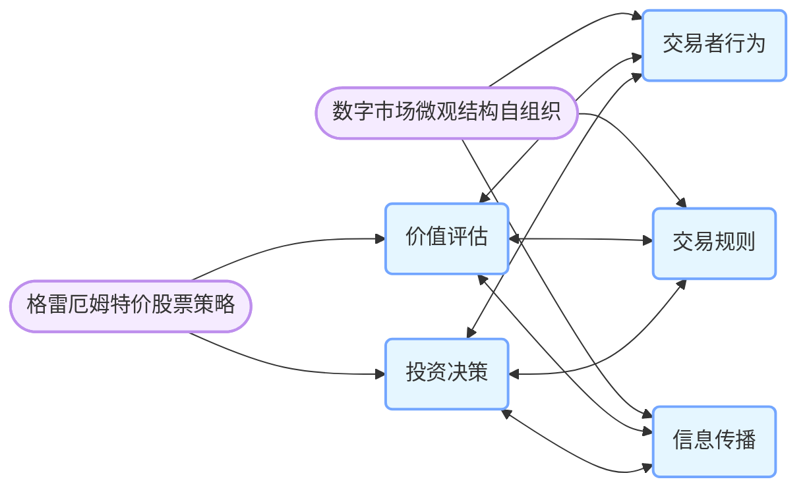

# 格雷厄姆特价股票策略在不同数字市场微观结构自组织中的动态调整

> 关键词：格雷厄姆特价股票策略、数字市场、微观结构自组织、动态调整、股票投资

> 摘要：本文聚焦于格雷厄姆特价股票策略在不同数字市场微观结构自组织中的动态调整。首先介绍了研究的背景、目的、预期读者等内容，阐述了相关核心概念及其联系，深入剖析了格雷厄姆特价股票策略的核心算法原理并给出具体操作步骤，同时介绍了相关的数学模型和公式。通过项目实战，详细展示了代码实现及解读。探讨了该策略在实际中的应用场景，推荐了相关的学习资源、开发工具框架以及论文著作。最后对未来发展趋势与挑战进行总结，并给出常见问题的解答和扩展阅读参考资料，旨在为投资者和研究者在数字市场中运用格雷厄姆特价股票策略提供全面且深入的理论与实践指导。

## 1. 背景介绍 
### 1.1 目的和范围
在当今数字化快速发展的时代，金融市场发生了巨大的变革，数字市场逐渐兴起。格雷厄姆特价股票策略作为一种经典的价值投资策略，在传统金融市场中取得了显著的成果。然而，数字市场具有独特的微观结构自组织特性，这使得传统的投资策略需要进行相应的调整。本研究的目的在于探讨格雷厄姆特价股票策略如何在不同数字市场微观结构自组织中进行动态调整，以提高投资的有效性和适应性。研究范围涵盖了各种类型的数字市场，包括但不限于数字货币市场、数字资产交易市场等，分析不同市场微观结构下策略的调整方法和效果。

### 1.2 预期读者
本文预期读者包括金融投资者，尤其是对价值投资策略感兴趣并希望在数字市场中应用的投资者；金融领域的研究者，关注数字市场微观结构和投资策略的相关研究；金融科技从业者，致力于开发和优化数字市场投资工具和系统的专业人员；以及相关专业的学生，如金融、经济学、计算机科学等专业，希望深入了解数字市场投资策略的理论和实践。

### 1.3 文档结构概述
本文将按照以下结构进行阐述：首先介绍研究的背景信息，包括目的、预期读者和文档结构概述等；接着阐述格雷厄姆特价股票策略及数字市场微观结构自组织的核心概念及其联系；然后深入剖析核心算法原理并给出具体操作步骤，同时介绍相关的数学模型和公式；通过项目实战展示代码实现和详细解读；探讨该策略在实际中的应用场景；推荐相关的学习资源、开发工具框架和论文著作；最后对未来发展趋势与挑战进行总结，给出常见问题的解答和扩展阅读参考资料。

### 1.4 术语表
#### 1.4.1 核心术语定义
- **格雷厄姆特价股票策略**：由本杰明·格雷厄姆提出的一种价值投资策略，其核心思想是寻找价格低于内在价值的股票进行投资，以获取长期的投资回报。
- **数字市场**：指基于数字化技术进行交易的市场，包括数字货币市场、数字资产交易市场等，具有交易速度快、信息传播迅速等特点。
- **微观结构自组织**：指数字市场中各种微观元素（如交易者、交易规则、信息等）相互作用、相互影响，自发形成一定的结构和秩序的过程。

#### 1.4.2 相关概念解释
- **价值投资**：一种投资理念，强调通过分析公司的基本面，如财务状况、盈利能力等，评估公司的内在价值，寻找被市场低估的股票进行投资。
- **市场效率**：指市场价格反映信息的程度，有效市场假说认为市场价格能够迅速、准确地反映所有可用信息。
- **自组织临界性**：系统在没有外部干预的情况下，自发地达到一种临界状态，此时系统的微小变化可能导致大规模的连锁反应。

#### 1.4.3 缩略词列表
- **EMH**：Efficient Market Hypothesis，有效市场假说
- **AI**：Artificial Intelligence，人工智能
- **ML**：Machine Learning，机器学习

## 2. 核心概念与联系 

### 格雷厄姆特价股票策略原理
格雷厄姆特价股票策略的核心在于寻找被市场低估的股票。其基本原理是通过对公司的财务报表进行分析，计算公司的内在价值，然后与股票的市场价格进行比较。如果市场价格低于内在价值，则认为该股票被低估，具有投资价值。

格雷厄姆提出了一系列评估公司内在价值的方法，其中最著名的是“净流动资产价值”法。该方法认为，公司的内在价值至少应该等于其净流动资产价值，即流动资产减去总负债。如果股票价格低于净流动资产价值的一定比例（通常为三分之二），则认为该股票是被低估的特价股票。

### 数字市场微观结构自组织原理
数字市场的微观结构自组织是一个复杂的过程，涉及到众多微观元素的相互作用。交易者的行为、交易规则的制定、信息的传播等因素都会影响市场的微观结构。

在数字市场中，交易者可以根据自己的交易策略和市场信息进行交易决策。不同的交易策略会导致不同的交易行为，这些交易行为相互作用，形成了市场的交易模式。交易规则的制定也会对市场的微观结构产生影响，例如交易手续费、交易时间等规则会影响交易者的交易成本和交易频率。信息的传播速度和质量也会影响市场的微观结构，快速、准确的信息传播可以使市场更加有效，而虚假、误导性的信息则可能导致市场的混乱。

### 两者的联系
格雷厄姆特价股票策略在数字市场中的应用需要考虑数字市场微观结构自组织的特点。数字市场的快速变化和高度复杂性使得传统的价值评估方法可能不再适用。例如，数字资产的价值可能不仅仅取决于其财务状况，还受到市场情绪、技术创新等因素的影响。

因此，在数字市场中应用格雷厄姆特价股票策略时，需要对策略进行动态调整。根据数字市场微观结构自组织的变化，及时调整价值评估方法和投资决策标准，以适应市场的变化。同时，数字市场的微观结构自组织也可以为格雷厄姆特价股票策略的调整提供信息和依据。例如，通过分析市场的交易模式和信息传播规律，可以更好地判断股票的低估程度和投资时机。

### 文本示意图
格雷厄姆特价股票策略与数字市场微观结构自组织的联系可以用以下文本示意图表示：

格雷厄姆特价股票策略（价值评估、投资决策） <-- 相互影响 --> 数字市场微观结构自组织（交易者行为、交易规则、信息传播）

### Mermaid 流程图


## 3. 核心算法原理 & 具体操作步骤 

### 核心算法原理
格雷厄姆特价股票策略的核心算法在于计算股票的内在价值并与市场价格进行比较。在数字市场中，由于市场的复杂性和快速变化，需要对传统的内在价值计算方法进行改进。

我们可以采用多因素模型来计算股票的内在价值。多因素模型考虑了多个影响股票价值的因素，包括财务指标、市场情绪、技术创新等。具体来说，我们可以将股票的内在价值 $V$ 表示为：

$V = f(F, M, T)$

其中，$F$ 表示财务指标，如净利润、净资产等；$M$ 表示市场情绪指标，如投资者信心指数、成交量等；$T$ 表示技术创新指标，如研发投入、专利数量等。

函数 $f$ 可以通过机器学习算法进行训练和优化。我们可以使用历史数据来训练机器学习模型，以找到最适合的函数形式。

### 具体操作步骤
1. **数据收集**：收集股票的财务数据、市场数据和技术创新数据。财务数据包括净利润、净资产、营业收入等；市场数据包括股票价格、成交量、投资者信心指数等；技术创新数据包括研发投入、专利数量等。
2. **数据预处理**：对收集到的数据进行清洗、归一化等预处理操作，以提高数据的质量和可用性。
3. **特征工程**：从预处理后的数据中提取有用的特征，如财务比率、市场趋势等。
4. **模型训练**：使用机器学习算法（如线性回归、决策树、神经网络等）对提取的特征进行训练，以得到股票内在价值的预测模型。
5. **价值评估**：使用训练好的模型对当前股票的内在价值进行评估。
6. **投资决策**：将股票的内在价值与市场价格进行比较，如果市场价格低于内在价值，则认为该股票被低估，具有投资价值。

### Python 源代码实现
```python
import pandas as pd
from sklearn.model_selection import train_test_split
from sklearn.linear_model import LinearRegression
from sklearn.preprocessing import StandardScaler

# 数据收集（假设数据已经存储在 CSV 文件中）
data = pd.read_csv('stock_data.csv')

# 数据预处理
# 去除缺失值
data = data.dropna()

# 分离特征和标签
X = data.drop('market_price', axis=1)
y = data['market_price']

# 特征工程
# 标准化特征
scaler = StandardScaler()
X_scaled = scaler.fit_transform(X)

# 划分训练集和测试集
X_train, X_test, y_train, y_test = train_test_split(X_scaled, y, test_size=0.2, random_state=42)

# 模型训练
model = LinearRegression()
model.fit(X_train, y_train)

# 价值评估
# 假设我们有一组新的数据
new_data = pd.read_csv('new_stock_data.csv')
new_data_scaled = scaler.transform(new_data)
predicted_value = model.predict(new_data_scaled)

# 投资决策
market_price = new_data['market_price'].values[0]
if market_price < predicted_value[0]:
    print("该股票被低估，具有投资价值。")
else:
    print("该股票未被低估，不具有投资价值。")
```

## 4. 数学模型和公式 & 详细讲解 & 举例说明 

### 多因素模型公式
如前所述，股票的内在价值 $V$ 可以表示为：

$V = f(F, M, T)$

其中，$F$ 表示财务指标向量，$F = [F_1, F_2, \cdots, F_n]$，$F_i$ 表示第 $i$ 个财务指标，如净利润、净资产等；$M$ 表示市场情绪指标向量，$M = [M_1, M_2, \cdots, M_m]$，$M_j$ 表示第 $j$ 个市场情绪指标，如投资者信心指数、成交量等；$T$ 表示技术创新指标向量，$T = [T_1, T_2, \cdots, T_k]$，$T_l$ 表示第 $l$ 个技术创新指标，如研发投入、专利数量等。

函数 $f$ 可以采用线性组合的形式，即：

$V = \alpha_0 + \sum_{i=1}^{n} \alpha_i F_i + \sum_{j=1}^{m} \beta_j M_j + \sum_{l=1}^{k} \gamma_l T_l$

其中，$\alpha_0$ 是常数项，$\alpha_i$、$\beta_j$、$\gamma_l$ 是待确定的系数。

### 详细讲解
多因素模型考虑了多个影响股票价值的因素，相比于传统的单因素模型，能够更全面地反映股票的真实价值。财务指标反映了公司的基本面情况，市场情绪指标反映了投资者对股票的预期和信心，技术创新指标反映了公司的创新能力和发展潜力。

通过线性组合的形式，我们可以将各个因素的影响进行量化。系数 $\alpha_i$、$\beta_j$、$\gamma_l$ 表示各个因素对股票内在价值的影响程度。这些系数可以通过机器学习算法进行训练和优化，以使得模型的预测结果更加准确。

### 举例说明
假设我们有以下数据：

| 股票代码 | 净利润（$F_1$） | 净资产（$F_2$） | 投资者信心指数（$M_1$） | 成交量（$M_2$） | 研发投入（$T_1$） | 专利数量（$T_2$） | 市场价格 |
| --- | --- | --- | --- | --- | --- | --- | --- |
| 000001 | 1000 | 5000 | 0.8 | 10000 | 200 | 10 | 50 |
| 000002 | 1200 | 6000 | 0.9 | 12000 | 250 | 12 | 60 |
| 000003 | 800 | 4000 | 0.7 | 8000 | 150 | 8 | 40 |

假设我们已经通过机器学习算法训练得到了以下系数：

$\alpha_0 = 10$，$\alpha_1 = 0.01$，$\alpha_2 = 0.005$，$\beta_1 = 5$，$\beta_2 = 0.001$，$\gamma_1 = 0.02$，$\gamma_2 = 2$

对于股票 000001，我们可以计算其内在价值：

$V = 10 + 0.01 \times 1000 + 0.005 \times 5000 + 5 \times 0.8 + 0.001 \times 10000 + 0.02 \times 200 + 2 \times 10$

$V = 10 + 10 + 25 + 4 + 10 + 4 + 20 = 83$

由于市场价格为 50，低于内在价值 83，因此该股票被低估，具有投资价值。

## 5. 项目实战：代码实际案例和详细解释说明 

### 5.1  开发环境搭建
1. **安装 Python**：从 Python 官方网站（https://www.python.org/downloads/）下载并安装 Python 3.x 版本。
2. **安装必要的库**：使用以下命令安装必要的 Python 库：
```sh
pip install pandas scikit-learn
```
3. **准备数据**：将股票的财务数据、市场数据和技术创新数据存储在 CSV 文件中，确保数据格式正确。

### 5.2  源代码详细实现和代码解读
```python
import pandas as pd
from sklearn.model_selection import train_test_split
from sklearn.linear_model import LinearRegression
from sklearn.preprocessing import StandardScaler

# 数据收集（假设数据已经存储在 CSV 文件中）
data = pd.read_csv('stock_data.csv')

# 数据预处理
# 去除缺失值
data = data.dropna()

# 分离特征和标签
X = data.drop('market_price', axis=1)
y = data['market_price']

# 特征工程
# 标准化特征
scaler = StandardScaler()
X_scaled = scaler.fit_transform(X)

# 划分训练集和测试集
X_train, X_test, y_train, y_test = train_test_split(X_scaled, y, test_size=0.2, random_state=42)

# 模型训练
model = LinearRegression()
model.fit(X_train, y_train)

# 价值评估
# 假设我们有一组新的数据
new_data = pd.read_csv('new_stock_data.csv')
new_data_scaled = scaler.transform(new_data)
predicted_value = model.predict(new_data_scaled)

# 投资决策
market_price = new_data['market_price'].values[0]
if market_price < predicted_value[0]:
    print("该股票被低估，具有投资价值。")
else:
    print("该股票未被低估，不具有投资价值。")
```

### 代码解读与分析
1. **数据收集**：使用 `pandas` 库的 `read_csv` 函数从 CSV 文件中读取股票数据。
2. **数据预处理**：使用 `dropna` 函数去除数据中的缺失值，以保证数据的质量。
3. **特征工程**：使用 `StandardScaler` 类对特征进行标准化处理，使得不同特征具有相同的尺度，提高模型的训练效果。
4. **模型训练**：使用 `LinearRegression` 类创建线性回归模型，并使用训练集数据进行训练。
5. **价值评估**：读取新的数据，并使用训练好的模型对其内在价值进行预测。
6. **投资决策**：将预测的内在价值与市场价格进行比较，根据比较结果做出投资决策。

## 6. 实际应用场景 
### 数字货币市场
在数字货币市场中，价格波动较大，市场情绪对价格的影响较为明显。格雷厄姆特价股票策略可以通过考虑数字货币的基本面因素（如技术创新、社区活跃度等）和市场情绪因素，寻找被低估的数字货币进行投资。例如，某些数字货币项目具有强大的技术团队和创新的技术方案，但由于市场情绪低迷，价格被低估。此时，投资者可以根据格雷厄姆特价股票策略的调整方法，评估其内在价值，判断是否具有投资价值。

### 数字资产交易市场
数字资产交易市场包括各种类型的数字资产，如虚拟土地、数字艺术品等。这些数字资产的价值评估相对复杂，不仅取决于其本身的特性，还受到市场供需关系和投资者偏好的影响。格雷厄姆特价股票策略可以通过分析数字资产的稀缺性、实用性、市场需求等因素，计算其内在价值。当市场价格低于内在价值时，投资者可以考虑买入该数字资产。

### 金融科技公司股票市场
金融科技公司在数字市场中具有重要地位，其股票价格受到技术创新、市场竞争等因素的影响。格雷厄姆特价股票策略可以通过分析金融科技公司的财务状况、研发投入、市场份额等因素，评估其内在价值。对于那些具有强大技术实力和创新能力，但股票价格暂时被低估的金融科技公司，投资者可以根据策略进行投资。

## 7. 工具和资源推荐
### 7.1 学习资源推荐
#### 7.1.1 书籍推荐
- 《聪明的投资者》（The Intelligent Investor）：本杰明·格雷厄姆的经典著作，详细阐述了价值投资的理论和方法。
- 《金融市场微观结构理论》（Market Microstructure Theory）：介绍了金融市场微观结构的基本理论和模型。
- 《机器学习》（Machine Learning）：周志华编著，系统介绍了机器学习的基本概念、算法和应用。

#### 7.1.2 在线课程
- Coursera 上的“Financial Markets”：由耶鲁大学教授罗伯特·席勒（Robert Shiller）讲授，介绍了金融市场的基本原理和投资策略。
- edX 上的“Machine Learning for Trading”：由哥伦比亚大学教授讲授，介绍了机器学习在金融交易中的应用。

#### 7.1.3 技术博客和网站
- Seeking Alpha：提供股票分析、投资策略等金融领域的专业文章和观点。
- Towards Data Science：专注于数据科学和机器学习领域的技术博客，提供最新的技术文章和案例分析。

### 7.2 开发工具框架推荐
#### 7.2.1 IDE和编辑器
- PyCharm：一款功能强大的 Python 集成开发环境，提供代码编辑、调试、版本控制等功能。
- Jupyter Notebook：一种交互式的开发环境，适合进行数据探索和模型训练。

#### 7.2.2 调试和性能分析工具
- pdb：Python 内置的调试工具，用于调试 Python 代码。
- cProfile：Python 内置的性能分析工具，用于分析代码的性能瓶颈。

#### 7.2.3 相关框架和库
- Pandas：用于数据处理和分析的 Python 库，提供了高效的数据结构和数据操作方法。
- Scikit-learn：用于机器学习的 Python 库，提供了丰富的机器学习算法和工具。

### 7.3 相关论文著作推荐
#### 7.3.1 经典论文
- Fama, E. F., & French, K. R. (1992). The cross-section of expected stock returns. The Journal of Finance, 47(2), 427-465. 该论文提出了著名的 Fama-French 三因子模型，对股票收益的横截面进行了深入分析。
- Grossman, S. J., & Stiglitz, J. E. (1980). On the impossibility of informationally efficient markets. The American Economic Review, 70(3), 393-408. 该论文探讨了市场效率与信息传播的关系。

#### 7.3.2 最新研究成果
- 关注顶级金融期刊，如 The Journal of Finance、The Review of Financial Studies 等，获取数字市场微观结构和投资策略的最新研究成果。

#### 7.3.3 应用案例分析
- 研究一些知名投资机构在数字市场中的投资案例，分析其投资策略和决策过程，从中获取经验和启示。

## 8. 总结：未来发展趋势与挑战
### 未来发展趋势
1. **智能化发展**：随着人工智能和机器学习技术的不断发展，格雷厄姆特价股票策略将更加智能化。通过使用更复杂的机器学习模型和算法，可以更准确地评估股票的内在价值，提高投资决策的准确性。
2. **多市场融合**：数字市场与传统金融市场的融合将越来越深入，格雷厄姆特价股票策略将在更广泛的市场中得到应用。投资者可以通过跨市场投资，实现资产的多元化配置。
3. **个性化定制**：投资者的需求越来越多样化，未来的格雷厄姆特价股票策略将更加注重个性化定制。根据投资者的风险偏好、投资目标等因素，为投资者提供个性化的投资策略和建议。

### 挑战
1. **数据质量和可靠性**：数字市场的数据量庞大且复杂，数据质量和可靠性是一个重要的挑战。不准确或不完整的数据可能导致模型的预测结果出现偏差，影响投资决策的准确性。
2. **市场不确定性**：数字市场具有高度的不确定性，市场价格受到多种因素的影响，如政策变化、技术创新、市场情绪等。这些不确定性增加了投资决策的难度，需要投资者具备更强的风险意识和应对能力。
3. **技术更新换代快**：人工智能和机器学习技术发展迅速，新的算法和模型不断涌现。投资者需要不断学习和更新知识，以跟上技术的发展步伐，确保策略的有效性。

## 9. 附录：常见问题与解答
### 问题 1：格雷厄姆特价股票策略在数字市场中是否仍然有效？
解答：格雷厄姆特价股票策略在数字市场中仍然具有一定的有效性，但需要进行相应的调整。数字市场具有独特的微观结构和特点，传统的价值评估方法可能不再适用。因此，需要结合数字市场的特点，采用多因素模型等方法来评估股票的内在价值。

### 问题 2：如何选择合适的机器学习算法来计算股票的内在价值？
解答：选择合适的机器学习算法需要考虑多个因素，如数据的特点、模型的复杂度、计算效率等。对于线性关系较强的数据，可以选择线性回归算法；对于非线性关系较强的数据，可以选择决策树、神经网络等算法。同时，还可以通过交叉验证等方法来评估不同算法的性能，选择最优的算法。

### 问题 3：如何处理数字市场中的异常数据？
解答：处理数字市场中的异常数据可以采用以下方法：一是直接删除异常数据，但这种方法可能会导致数据丢失；二是使用统计方法对异常数据进行修正，如均值替换、中位数替换等；三是使用机器学习算法对异常数据进行识别和处理，如基于聚类的方法、基于密度的方法等。

## 10. 扩展阅读 & 参考资料
### 扩展阅读
- 《漫步华尔街》（A Random Walk Down Wall Street）：介绍了有效市场假说和随机漫步理论，对投资策略有深入的探讨。
- 《黑天鹅》（The Black Swan）：讲述了极端事件对金融市场的影响，提醒投资者要关注市场的不确定性。

### 参考资料
- 本杰明·格雷厄姆. 《聪明的投资者》. 人民邮电出版社.
- Fama, E. F., & French, K. R. (1992). The cross-section of expected stock returns. The Journal of Finance, 47(2), 427-465.
- Grossman, S. J., & Stiglitz, J. E. (1980). On the impossibility of informationally efficient markets. The American Economic Review, 70(3), 393-408.