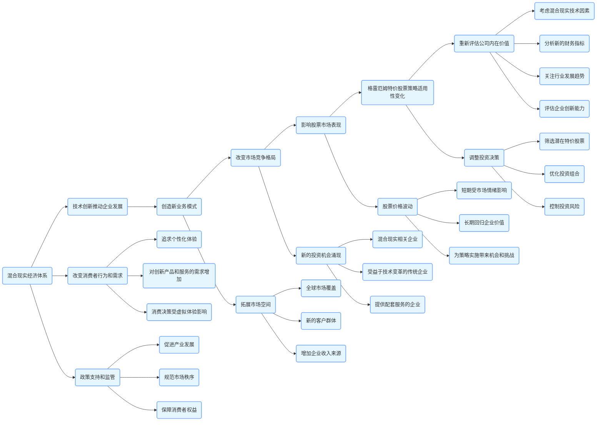

# 格雷厄姆特价股票策略在混合现实经济体系下的表现

> 关键词：格雷厄姆特价股票策略、混合现实经济体系、股票投资、市场表现、价值评估

> 摘要：本文旨在深入探讨格雷厄姆特价股票策略在混合现实经济体系下的表现。首先介绍了研究的背景、目的、预期读者以及文档结构等内容。接着阐述了格雷厄姆特价股票策略和混合现实经济体系的核心概念及两者联系。通过详细的算法原理和具体操作步骤，结合数学模型和公式，对该策略进行了理论剖析。以项目实战的方式展示了代码实现和解读，分析其在实际中的应用。探讨了该策略在不同场景下的实际应用，推荐了相关的学习资源、开发工具和论文著作。最后总结了未来发展趋势与挑战，并对常见问题进行解答，给出扩展阅读和参考资料，为投资者在混合现实经济体系下运用格雷厄姆特价股票策略提供全面的参考。

## 1. 背景介绍 
### 1.1 目的和范围
随着科技的飞速发展，混合现实（MR）技术逐渐融入经济体系，改变了许多行业的运营模式和市场格局。股票市场作为经济的重要组成部分，也受到了混合现实经济体系的影响。格雷厄姆特价股票策略作为一种经典的价值投资策略，其在传统经济环境下的有效性已得到广泛认可。然而，在混合现实经济体系这一新兴背景下，该策略的表现有待深入研究。

本研究的范围主要聚焦于格雷厄姆特价股票策略在混合现实经济体系下的适用性和表现评估。通过对相关理论、算法、实际案例的分析，探讨该策略在新经济环境下的优势、局限性以及可能的改进方向。

### 1.2 预期读者
本文预期读者包括对股票投资感兴趣的个人投资者、金融机构的专业分析师、从事金融科技研究的学者以及关注混合现实经济发展的相关人士。对于希望了解在混合现实经济体系下如何运用价值投资策略的读者，本文将提供有价值的参考和思路。

### 1.3 文档结构概述
本文共分为十个部分。第一部分为背景介绍，阐述研究的目的、范围、预期读者和文档结构。第二部分介绍格雷厄姆特价股票策略和混合现实经济体系的核心概念及两者联系，并通过文本示意图和 Mermaid 流程图进行展示。第三部分详细讲解核心算法原理和具体操作步骤，同时给出 Python 源代码。第四部分介绍相关的数学模型和公式，并进行详细讲解和举例说明。第五部分通过项目实战展示代码实际案例并进行详细解释。第六部分探讨该策略在实际应用中的场景。第七部分推荐相关的学习资源、开发工具和论文著作。第八部分总结未来发展趋势与挑战。第九部分为附录，解答常见问题。第十部分提供扩展阅读和参考资料。

### 1.4 术语表
#### 1.4.1 核心术语定义
- **格雷厄姆特价股票策略**：由本杰明·格雷厄姆（Benjamin Graham）提出的一种价值投资策略，其核心思想是寻找被市场低估的股票，通过分析公司的财务状况、资产价值等因素，以低于其内在价值的价格买入股票，等待市场对股票价值的重新认识，从而获得投资收益。
- **混合现实经济体系**：是指融合了虚拟现实（VR）、增强现实（AR）和真实世界的经济体系。在这个体系中，虚拟经济和实体经济相互交织、相互影响，创造出全新的商业机会和经济模式。

#### 1.4.2 相关概念解释
- **价值投资**：是一种基于对公司内在价值的评估进行投资的理念。投资者通过分析公司的财务报表、行业前景、管理团队等因素，确定公司的内在价值，并在股票价格低于内在价值时买入，等待价格回归价值。
- **虚拟现实（VR）**：是一种利用计算机技术生成的虚拟环境，用户可以通过头戴式显示器等设备沉浸其中，获得身临其境的体验。
- **增强现实（AR）**：是一种将虚拟信息与真实世界相结合的技术，通过手机、眼镜等设备，将虚拟图像、文字等信息叠加在真实场景中，增强用户对现实世界的感知。

#### 1.4.3 缩略词列表
- **MR**：混合现实（Mixed Reality）
- **VR**：虚拟现实（Virtual Reality）
- **AR**：增强现实（Augmented Reality）

## 2. 核心概念与联系 

### 格雷厄姆特价股票策略核心原理
格雷厄姆特价股票策略的核心在于寻找那些被市场错误定价的股票。其理论基础是股票的市场价格会围绕其内在价值波动，但由于市场的非理性因素，股票价格可能会偏离内在价值。投资者的任务就是通过深入分析公司的基本面，找到那些价格低于内在价值的股票，即所谓的“特价股票”。

公司的内在价值主要由其资产价值、盈利能力和未来发展潜力等因素决定。格雷厄姆提出了一系列的财务指标和分析方法来评估公司的内在价值，例如市盈率（P/E）、市净率（P/B）、股息收益率等。一般来说，低市盈率、低市净率和高股息收益率的股票更有可能被低估。

### 混合现实经济体系概述
混合现实经济体系是科技发展的产物，它将虚拟世界和现实世界紧密结合。在这个体系中，企业可以利用混合现实技术创造出全新的产品和服务，拓展市场空间。例如，在教育领域，通过混合现实技术可以实现更加生动、直观的教学体验；在工业领域，混合现实技术可以用于远程协作、设备维护等方面。

混合现实经济体系的发展也改变了消费者的行为和需求。消费者更加注重个性化、沉浸式的体验，对产品和服务的质量和创新要求更高。这使得企业需要不断创新和升级，以满足消费者的需求。

### 两者联系的文本示意图
```plaintext
混合现实经济体系
├─ 技术创新推动企业发展
│   ├─ 创造新业务模式
│   │   ├─ 改变市场竞争格局
│   │   │   ├─ 影响股票市场表现
│   │   │   │   ├─ 格雷厄姆特价股票策略适用性变化
│   │   │   │   │   ├─ 重新评估公司内在价值
│   │   │   │   │   │   ├─ 考虑混合现实技术因素
│   │   │   │   │   │   ├─ 分析新的财务指标
│   │   │   │   │   │   ├─ 关注行业发展趋势
│   │   │   │   │   │   └─ 评估企业创新能力
│   │   │   │   │   └─ 调整投资决策
│   │   │   │   │       ├─ 筛选潜在特价股票
│   │   │   │   │       ├─ 优化投资组合
│   │   │   │   │       └─ 控制投资风险
│   │   │   │   └─ 股票价格波动
│   │   │   │       ├─ 短期受市场情绪影响
│   │   │   │       ├─ 长期回归企业价值
│   │   │   │       └─ 为策略实施带来机会和挑战
│   │   │   └─ 新的投资机会涌现
│   │   │       ├─ 混合现实相关企业
│   │   │       ├─ 受益于技术变革的传统企业
│   │   │       └─ 提供配套服务的企业
│   │   └─ 拓展市场空间
│   │       ├─ 全球市场覆盖
│   │       ├─ 新的客户群体
│   │       └─ 增加企业收入来源
│   └─ 改变消费者行为和需求
│       ├─ 追求个性化体验
│       ├─ 对创新产品和服务的需求增加
│       └─ 消费决策受虚拟体验影响
└─ 政策支持和监管
    ├─ 促进产业发展
    ├─ 规范市场秩序
    └─ 保障消费者权益
```

### Mermaid 流程图


从上述示意图和流程图可以看出，混合现实经济体系通过影响企业的发展和市场竞争格局，进而影响股票市场的表现，这对格雷厄姆特价股票策略的适用性产生了重要影响。投资者需要在新的经济环境下重新评估公司的内在价值，调整投资决策，以适应市场的变化。

## 3. 核心算法原理 & 具体操作步骤 

### 核心算法原理
格雷厄姆特价股票策略的核心算法基于对公司内在价值的评估和股票价格的比较。其基本思想是通过计算一系列财务指标，筛选出那些被低估的股票。以下是一些关键的财务指标和计算方法：

- **市盈率（P/E）**：市盈率是指股票价格与每股收益（EPS）的比值，反映了投资者为获取公司每一元盈利所愿意支付的价格。计算公式为：
  $$P/E = \frac{股票价格}{每股收益}$$
  一般来说，较低的市盈率意味着股票可能被低估。

- **市净率（P/B）**：市净率是指股票价格与每股净资产（BVPS）的比值，反映了股票价格相对于公司净资产的倍数。计算公式为：
  $$P/B = \frac{股票价格}{每股净资产}$$
  较低的市净率通常表示股票具有较高的安全边际。

- **股息收益率（Dividend Yield）**：股息收益率是指公司每股股息与股票价格的比值，反映了投资者从股息中获得的收益。计算公式为：
  $$股息收益率 = \frac{每股股息}{股票价格} \times 100\%$$
  较高的股息收益率意味着投资者可以获得更多的现金回报。

### 具体操作步骤
1. **数据收集**：收集股票市场中相关公司的财务数据，包括股票价格、每股收益、每股净资产、每股股息等。这些数据可以从金融数据库、公司年报、证券交易所网站等渠道获取。
2. **指标计算**：根据收集到的数据，计算每家公司的市盈率、市净率和股息收益率等指标。
3. **筛选股票**：设定一定的筛选标准，例如市盈率低于某个阈值、市净率低于某个阈值、股息收益率高于某个阈值等，筛选出符合条件的股票。
4. **深入分析**：对筛选出的股票进行深入分析，包括公司的行业前景、竞争优势、管理团队等因素，评估公司的未来发展潜力。
5. **投资决策**：根据分析结果，选择合适的股票进行投资，并确定投资比例，构建投资组合。

### Python 源代码实现
```python
import pandas as pd

# 示例数据：假设已经从数据库或其他渠道获取到相关数据
data = {
    '股票代码': ['000001', '000002', '000003', '000004', '000005'],
    '股票价格': [10.0, 15.0, 20.0, 25.0, 30.0],
    '每股收益': [1.0, 1.2, 1.5, 1.8, 2.0],
    '每股净资产': [5.0, 8.0, 10.0, 12.0, 15.0],
    '每股股息': [0.5, 0.6, 0.8, 1.0, 1.2]
}

df = pd.DataFrame(data)

# 计算市盈率、市净率和股息收益率
df['市盈率'] = df['股票价格'] / df['每股收益']
df['市净率'] = df['股票价格'] / df['每股净资产']
df['股息收益率'] = df['每股股息'] / df['股票价格'] * 100

# 设定筛选标准
pe_threshold = 10
pb_threshold = 2
dividend_yield_threshold = 3

# 筛选符合条件的股票
selected_stocks = df[(df['市盈率'] < pe_threshold) & (df['市净率'] < pb_threshold) & (df['股息收益率'] > dividend_yield_threshold)]

print(selected_stocks)
```

### 代码解释
1. **数据收集**：使用字典 `data` 模拟从数据库或其他渠道获取到的股票数据，并将其转换为 Pandas 数据框 `df`。
2. **指标计算**：使用 Pandas 的算术运算功能，计算每家公司的市盈率、市净率和股息收益率，并将结果添加到数据框中。
3. **筛选股票**：设定市盈率、市净率和股息收益率的阈值，使用布尔索引筛选出符合条件的股票。
4. **结果输出**：打印筛选出的股票信息。

通过上述代码，我们可以快速筛选出可能被低估的股票，为投资决策提供参考。

## 4. 数学模型和公式 & 详细讲解 & 举例说明 

### 内在价值评估模型
格雷厄姆提出了一种简单的内在价值评估模型，用于估算股票的内在价值。该模型基于公司的每股收益和预期增长率，计算公式如下：
$$V = \frac{EPS \times (8.5 + 2g)}{Y}$$
其中：
- $V$ 表示股票的内在价值
- $EPS$ 表示每股收益
- $8.5$ 是格雷厄姆认为的一家业绩稳定的公司的合理市盈率倍数
- $g$ 表示公司的预期增长率（以百分比表示）
- $Y$ 表示当前的 AAA 级债券收益率

### 详细讲解
这个模型的核心思想是，股票的内在价值取决于公司的盈利能力（每股收益）和未来的增长潜力（预期增长率）。$8.5$ 作为一个基础的市盈率倍数，反映了市场对业绩稳定公司的合理估值。预期增长率 $g$ 越高，股票的内在价值就越高。而当前的 AAA 级债券收益率 $Y$ 则作为一个参考利率，用于调整股票的估值。当债券收益率上升时，股票的内在价值会相应下降；反之，当债券收益率下降时，股票的内在价值会上升。

### 举例说明
假设某公司的每股收益为 $2$ 元，预期增长率为 $10\%$，当前的 AAA 级债券收益率为 $3\%$。则该公司股票的内在价值为：
$$V = \frac{2 \times (8.5 + 2 \times 10)}{3} = \frac{2 \times (8.5 + 20)}{3} = \frac{2 \times 28.5}{3} = 19$$（元）

如果当前该股票的市场价格为 $15$ 元，低于其内在价值 $19$ 元，根据格雷厄姆特价股票策略，该股票可能被低估，具有投资价值。

### 安全边际计算
安全边际是格雷厄姆价值投资理论中的一个重要概念，它表示股票的内在价值与市场价格之间的差值，反映了投资的风险程度。安全边际越大，投资的风险就越小。计算公式如下：
$$安全边际 = \frac{内在价值 - 市场价格}{内在价值} \times 100\%$$

继续以上述例子为例，该股票的安全边际为：
$$安全边际 = \frac{19 - 15}{19} \times 100\% \approx 21.05\%$$

这意味着，如果市场价格上涨到内在价值水平，投资者可以获得约 $21.05\%$ 的收益。同时，较高的安全边际也为投资者提供了一定的缓冲空间，降低了投资风险。

### 风险调整后的预期收益率计算
在混合现实经济体系下，由于市场的不确定性增加，投资者需要考虑风险因素对预期收益率的影响。可以使用资本资产定价模型（CAPM）来计算风险调整后的预期收益率，公式如下：
$$E(R_i) = R_f + \beta_i \times (E(R_m) - R_f)$$
其中：
- $E(R_i)$ 表示股票 $i$ 的预期收益率
- $R_f$ 表示无风险收益率，通常可以用国债收益率来近似代替
- $\beta_i$ 表示股票 $i$ 的贝塔系数，反映了股票相对于市场的波动程度
- $E(R_m)$ 表示市场组合的预期收益率

假设无风险收益率 $R_f = 2\%$，市场组合的预期收益率 $E(R_m) = 8\%$，某股票的贝塔系数 $\beta_i = 1.2$。则该股票的风险调整后的预期收益率为：
$$E(R_i) = 2\% + 1.2 \times (8\% - 2\%) = 2\% + 1.2 \times 6\% = 2\% + 7.2\% = 9.2\%$$

通过计算风险调整后的预期收益率，投资者可以更准确地评估股票的投资价值，做出合理的投资决策。

## 5. 项目实战：代码实际案例和详细解释说明 

### 5.1  开发环境搭建
#### 操作系统
本项目可以在 Windows、Linux 或 macOS 等主流操作系统上进行开发。建议使用最新版本的操作系统，以确保系统的稳定性和兼容性。

#### 编程语言和库
- **Python**：Python 是一种功能强大、易于学习的编程语言，广泛应用于数据处理、分析和机器学习等领域。建议使用 Python 3.7 及以上版本。
- **Pandas**：Pandas 是一个用于数据处理和分析的 Python 库，提供了高效的数据结构和数据操作方法。可以使用以下命令安装：
  ```sh
  pip install pandas
  ```
- **Numpy**：Numpy 是一个用于科学计算的 Python 库，提供了高效的数组操作和数学函数。可以使用以下命令安装：
  ```sh
  pip install numpy
  ```
- **Matplotlib**：Matplotlib 是一个用于数据可视化的 Python 库，可以绘制各种类型的图表。可以使用以下命令安装：
  ```sh
  pip install matplotlib
  ```

#### 数据来源
本项目需要获取股票市场的相关数据，包括股票价格、财务报表等。可以使用以下数据来源：
- **Tushare**：Tushare 是一个免费、开源的 Python 财经数据接口包，提供了丰富的金融数据。可以使用以下命令安装：
  ```sh
  pip install tushare
  ```
- **Yahoo Finance**：Yahoo Finance 是一个知名的金融数据网站，提供了全球股票市场的实时行情和历史数据。可以使用 `yfinance` 库来获取 Yahoo Finance 的数据，安装命令如下：
  ```sh
  pip install yfinance
  ```

### 5.2  源代码详细实现和代码解读
```python
import tushare as ts
import pandas as pd
import numpy as np
import matplotlib.pyplot as plt

# 设置 Tushare 令牌
ts.set_token('your_token')
pro = ts.pro_api()

# 获取股票列表
def get_stock_list():
    df = pro.stock_basic(exchange='', list_status='L', fields='ts_code,symbol,name,area,industry,list_date')
    return df

# 获取财务数据
def get_financial_data(ts_code):
    df = pro.daily_basic(ts_code=ts_code, fields='ts_code,trade_date,close,pe_ttm,pb,total_share,total_mv')
    return df

# 筛选特价股票
def screen_bargain_stocks(stock_list, pe_threshold=10, pb_threshold=2):
    bargain_stocks = []
    for index, row in stock_list.iterrows():
        ts_code = row['ts_code']
        financial_data = get_financial_data(ts_code)
        if not financial_data.empty:
            latest_data = financial_data.iloc[0]
            pe_ttm = latest_data['pe_ttm']
            pb = latest_data['pb']
            if pe_ttm < pe_threshold and pb < pb_threshold:
                bargain_stocks.append(row)
    return pd.DataFrame(bargain_stocks)

# 主函数
def main():
    stock_list = get_stock_list()
    bargain_stocks = screen_bargain_stocks(stock_list)
    print(bargain_stocks)

    # 可视化分析
    if not bargain_stocks.empty:
        plt.figure(figsize=(10, 6))
        plt.scatter(bargain_stocks['pe_ttm'], bargain_stocks['pb'])
        plt.xlabel('市盈率 (P/E)')
        plt.ylabel('市净率 (P/B)')
        plt.title('特价股票的市盈率与市净率分布')
        plt.grid(True)
        plt.show()

if __name__ == '__main__':
    main()
```

### 5.3  代码解读与分析
1. **导入库**：导入所需的 Python 库，包括 Tushare、Pandas、Numpy 和 Matplotlib。
2. **设置 Tushare 令牌**：Tushare 需要用户提供令牌才能访问其数据接口。用户需要在 Tushare 官网注册并获取自己的令牌，然后将其替换代码中的 `your_token`。
3. **获取股票列表**：`get_stock_list` 函数使用 Tushare 的 `stock_basic` 接口获取当前市场上所有上市股票的基本信息，包括股票代码、名称、行业等。
4. **获取财务数据**：`get_financial_data` 函数使用 Tushare 的 `daily_basic` 接口获取指定股票的财务数据，包括市盈率、市净率、总市值等。
5. **筛选特价股票**：`screen_bargain_stocks` 函数遍历股票列表，对每只股票的财务数据进行分析，筛选出市盈率低于 `pe_threshold` 且市净率低于 `pb_threshold` 的股票。
6. **主函数**：`main` 函数调用上述函数，获取股票列表并筛选出特价股票，然后打印筛选结果。同时，使用 Matplotlib 绘制特价股票的市盈率与市净率分布散点图，以便直观地观察数据分布情况。

通过这个项目实战，我们可以看到如何使用 Python 和 Tushare 库来实现格雷厄姆特价股票策略的筛选过程，并对筛选结果进行可视化分析。

## 6. 实际应用场景 
### 个人投资者
对于个人投资者来说，格雷厄姆特价股票策略在混合现实经济体系下仍然具有一定的应用价值。个人投资者可以利用该策略筛选出被低估的股票，进行长期投资。在混合现实经济体系中，一些传统行业的企业可能会因为积极拥抱混合现实技术而获得新的发展机遇，但其股票价格可能尚未完全反映其潜在价值。个人投资者可以通过深入研究这些企业的基本面，结合格雷厄姆特价股票策略，找到具有投资潜力的股票。

例如，一家传统制造业企业通过引入混合现实技术，实现了生产过程的数字化和智能化，提高了生产效率和产品质量。但由于市场对该技术的应用效果存在一定的不确定性，该企业的股票价格可能被低估。个人投资者可以通过分析该企业的财务报表、技术创新能力和市场前景等因素，判断其是否符合格雷厄姆特价股票策略的筛选标准。如果符合，投资者可以考虑买入该股票，等待市场对其价值的重新认识，从而获得投资收益。

### 机构投资者
机构投资者如基金公司、证券公司等，通常会管理大量的资金，需要进行多元化的投资组合管理。格雷厄姆特价股票策略可以作为机构投资者投资组合的一部分，用于降低投资风险和提高投资收益。

在混合现实经济体系下，机构投资者可以利用该策略筛选出混合现实相关行业的特价股票，同时结合其他投资策略，构建多元化的投资组合。例如，机构投资者可以将一部分资金投资于混合现实技术研发企业的股票，另一部分资金投资于受益于混合现实技术应用的传统行业企业的股票。通过这种方式，机构投资者可以在享受混合现实经济发展带来的投资机会的同时，降低单一行业投资的风险。

### 企业战略投资
企业在进行战略投资时，也可以借鉴格雷厄姆特价股票策略的思想。企业可以通过分析目标企业的内在价值和市场价格，寻找那些被低估的企业进行投资或并购。在混合现实经济体系下，企业可以关注那些在混合现实技术领域具有一定技术实力和市场潜力，但由于资金、市场推广等原因而尚未实现其价值的企业。

例如，一家大型科技企业可以通过收购一家专注于混合现实内容创作的小型企业，快速进入混合现实内容市场，拓展其业务领域。在收购过程中，科技企业可以运用格雷厄姆特价股票策略的方法，评估小型企业的内在价值，确定合理的收购价格，从而实现企业的战略目标。

### 风险管理
在混合现实经济体系下，市场的不确定性增加，股票价格的波动也更加剧烈。格雷厄姆特价股票策略中的安全边际概念可以帮助投资者进行风险管理。投资者在选择股票时，可以选择那些具有较高安全边际的股票，即内在价值远高于市场价格的股票。这样，即使市场出现不利变化，股票价格下跌，投资者也有一定的缓冲空间，降低了投资损失的风险。

例如，投资者在评估一只股票时，计算出其内在价值为 $50$ 元，而当前市场价格为 $30$ 元，安全边际为 $40\%$。如果市场出现不利变化，股票价格下跌 $20\%$，即跌至 $24$ 元，投资者仍然可以获得一定的收益，因为股票的内在价值仍然高于市场价格。

## 7. 工具和资源推荐
### 7.1 学习资源推荐
#### 7.1.1 书籍推荐
- **《聪明的投资者》（The Intelligent Investor）**：作者是本杰明·格雷厄姆（Benjamin Graham），这本书是价值投资领域的经典之作，详细阐述了格雷厄姆的投资理念和方法，对理解格雷厄姆特价股票策略具有重要的指导意义。
- **《证券分析》（Security Analysis）**：同样是本杰明·格雷厄姆的著作，被誉为投资领域的“圣经”。该书深入探讨了证券分析的基本原理和方法，包括财务报表分析、估值模型等，为投资者提供了全面的投资分析框架。
- **《混合现实：从概念到实践》（Mixed Reality: From Concept to Practice）**：这本书介绍了混合现实技术的基本概念、发展历程和应用场景，帮助读者了解混合现实经济体系的技术基础和发展趋势。

#### 7.1.2 在线课程
- **Coursera 上的“投资学原理”（Principles of Investing）**：该课程由知名大学的教授授课，系统地介绍了投资学的基本原理和方法，包括价值投资、风险评估等内容，对学习格雷厄姆特价股票策略有很大的帮助。
- **Udemy 上的“混合现实开发入门”（Introduction to Mixed Reality Development）**：该课程适合对混合现实技术感兴趣的读者，介绍了混合现实开发的基本工具和技术，帮助读者了解混合现实技术在经济领域的应用。

#### 7.1.3 技术博客和网站
- **Seeking Alpha**：这是一个知名的金融投资博客网站，提供了大量的股票分析、投资策略和市场评论等内容。投资者可以在该网站上了解到最新的市场动态和投资观点，获取有关格雷厄姆特价股票策略的实践经验。
- **VRScout**：专注于虚拟现实和混合现实领域的新闻和技术报道，提供了关于混合现实技术发展趋势、应用案例和行业动态等信息，帮助读者了解混合现实经济体系的最新情况。

### 7.2 开发工具框架推荐
#### 7.2.1 IDE和编辑器
- **PyCharm**：是一款专业的 Python 集成开发环境（IDE），提供了丰富的代码编辑、调试和分析功能，适合用于开发和调试与格雷厄姆特价股票策略相关的 Python 代码。
- **Visual Studio Code**：是一款轻量级的代码编辑器，支持多种编程语言和插件扩展。它具有简洁的界面和强大的功能，是开发混合现实应用和数据分析项目的常用工具。

#### 7.2.2 调试和性能分析工具
- **pdb**：是 Python 自带的调试器，可以帮助开发者在代码执行过程中进行调试，查找和解决代码中的问题。
- **cProfile**：是 Python 的性能分析工具，可以帮助开发者分析代码的性能瓶颈，优化代码的执行效率。

#### 7.2.3 相关框架和库
- **Scikit-learn**：是一个用于机器学习的 Python 库，提供了丰富的机器学习算法和工具，可用于股票价格预测、风险评估等方面的数据分析。
- **Unity**：是一个跨平台的游戏开发引擎，也广泛应用于混合现实应用的开发。它提供了丰富的开发工具和资源，帮助开发者快速创建高质量的混合现实应用。

### 7.3 相关论文著作推荐
#### 7.3.1 经典论文
- **“The Theory of Investment Value” by John Burr Williams**：该论文提出了股票内在价值的折现现金流模型，为价值投资理论奠定了基础，对理解格雷厄姆特价股票策略的理论根源具有重要意义。
- **“Efficient Capital Markets: A Review of Theory and Empirical Work” by Eugene F. Fama**：这篇论文介绍了有效市场假说，探讨了市场效率对投资策略的影响，为投资者理解股票市场的运行机制提供了理论支持。

#### 7.3.2 最新研究成果
- **“Mixed Reality in the Financial Industry: Opportunities and Challenges”**：该研究探讨了混合现实技术在金融行业的应用前景和面临的挑战，分析了混合现实经济体系对金融市场和投资策略的影响。
- **“Value Investing in the Digital Age: Adaptation and Innovation”**：研究了在数字化时代，价值投资策略的适应性和创新发展，为在混合现实经济体系下应用格雷厄姆特价股票策略提供了新的思路。

#### 7.3.3 应用案例分析
- **“Case Study: Applying Graham's Bargain Stock Strategy in the Emerging Technologies Sector”**：该案例分析了在新兴技术领域应用格雷厄姆特价股票策略的实践经验和效果，为投资者在混合现实相关行业应用该策略提供了参考。
- **“The Impact of Mixed Reality on Corporate Valuation and Investment Decisions”**：通过实际案例分析了混合现实技术对企业估值和投资决策的影响，帮助投资者更好地评估混合现实经济体系下企业的价值。

## 8. 总结：未来发展趋势与挑战
### 未来发展趋势
#### 混合现实技术与金融市场的深度融合
随着混合现实技术的不断发展和成熟，它将与金融市场实现更深度的融合。例如，投资者可以通过混合现实技术进行虚拟的股票交易模拟，更加直观地了解市场动态和投资策略的效果。金融机构也可以利用混合现实技术进行客户服务和培训，提高服务质量和效率。

#### 数据驱动的投资决策
在混合现实经济体系下，数据的重要性将更加凸显。投资者将越来越依赖大数据和人工智能技术来进行投资决策。通过对海量的金融数据、企业数据和市场数据的分析，投资者可以更准确地评估企业的内在价值和市场趋势，优化格雷厄姆特价股票策略的应用。

#### 跨行业投资机会增加
混合现实技术的应用将打破传统行业的界限，创造出更多的跨行业投资机会。例如，传统制造业与混合现实技术的结合将催生出智能制造等新兴领域，投资者可以通过格雷厄姆特价股票策略挖掘这些领域中被低估的企业，实现跨行业的多元化投资。

### 挑战
#### 技术不确定性
混合现实技术仍处于发展阶段，其技术路线和应用前景存在一定的不确定性。这使得投资者在评估混合现实相关企业的价值时面临较大的困难。例如，一些企业可能在混合现实技术研发上投入了大量资金，但由于技术难题无法攻克，导致其无法实现商业化应用，从而影响企业的盈利能力和股票价值。

#### 市场波动性增加
混合现实经济体系的发展将带来市场结构和竞争格局的变化，导致市场波动性增加。股票价格可能会受到技术创新、政策变化、市场情绪等多种因素的影响，使得格雷厄姆特价股票策略的筛选标准和投资决策变得更加复杂。投资者需要更加敏锐地捕捉市场变化，及时调整投资策略。

#### 数据质量和隐私问题
在数据驱动的投资决策过程中，数据质量和隐私问题是投资者面临的重要挑战。不准确或不完整的数据可能会导致错误的投资决策，而数据隐私泄露则可能会给投资者和企业带来严重的损失。投资者需要建立有效的数据管理和安全机制，确保数据的质量和隐私安全。

## 9. 附录：常见问题与解答
### 1. 格雷厄姆特价股票策略在混合现实经济体系下是否仍然有效？
格雷厄姆特价股票策略的核心思想是寻找被低估的股票，这一思想在混合现实经济体系下仍然具有一定的有效性。然而，由于混合现实经济体系的特殊性，投资者需要对该策略进行适当的调整和优化。例如，在评估企业的内在价值时，需要考虑混合现实技术对企业未来发展的影响；在筛选股票时，需要关注混合现实相关行业的发展趋势和企业的创新能力。

### 2. 如何获取混合现实相关企业的财务数据？
可以通过多种渠道获取混合现实相关企业的财务数据。常见的渠道包括金融数据库（如 Wind、东方财富等）、企业年报、证券交易所网站等。此外，还可以使用一些数据接口工具，如 Tushare、Yahoo Finance 等，获取股票市场的实时行情和历史数据。

### 3. 在混合现实经济体系下，如何评估企业的创新能力？
评估企业的创新能力可以从多个方面入手。首先，可以关注企业的研发投入情况，包括研发费用的金额和占比。较高的研发投入通常意味着企业对创新的重视。其次，可以考察企业的专利数量和质量，专利是企业创新成果的重要体现。此外，还可以关注企业的技术团队、创新文化和与科研机构的合作情况等。

### 4. 格雷厄姆特价股票策略的筛选标准是否需要根据市场情况进行调整？
是的，格雷厄姆特价股票策略的筛选标准需要根据市场情况进行调整。不同的市场环境下，股票的估值水平和风险特征可能会有所不同。例如，在牛市行情中，股票的市盈率和市净率可能会普遍较高，此时可以适当提高筛选标准；而在熊市行情中，股票的估值水平较低，可以适当降低筛选标准。此外，还需要考虑行业特点和企业的发展阶段等因素，灵活调整筛选标准。

### 5. 如何控制在混合现实经济体系下应用格雷厄姆特价股票策略的投资风险？
可以通过多种方式控制投资风险。首先，要进行充分的基本面分析，深入了解企业的财务状况、行业前景和竞争优势等因素，选择具有较高安全边际的股票。其次，要进行多元化投资，构建合理的投资组合，降低单一股票的风险。此外，还可以设置止损点，当股票价格下跌到一定程度时，及时卖出股票，避免损失进一步扩大。

## 10. 扩展阅读 & 参考资料
### 扩展阅读
- 《创新者的窘境》（The Innovator's Dilemma）：该书探讨了企业在面对技术创新和市场变化时所面临的挑战和机遇，对理解混合现实经济体系下企业的发展和投资具有一定的启示作用。
- 《金融炼金术》（The Alchemy of Finance）：作者是乔治·索罗斯（George Soros），这本书介绍了索罗斯的投资哲学和方法，包括反身性理论等，对投资者拓宽投资视野和思维方式有很大的帮助。

### 参考资料
- [Tushare 官方文档](https://tushare.pro/document/1)
- [Yahoo Finance 官方网站](https://finance.yahoo.com/)
- [Seeking Alpha 官方网站](https://seekingalpha.com/)
- [VRScout 官方网站](https://vrscout.com/)
- [Coursera 官方网站](https://www.coursera.org/)
- [Udemy 官方网站](https://www.udemy.com/)
- [Scikit-learn 官方文档](https://scikit-learn.org/stable/documentation.html)
- [Unity 官方网站](https://unity.com/)