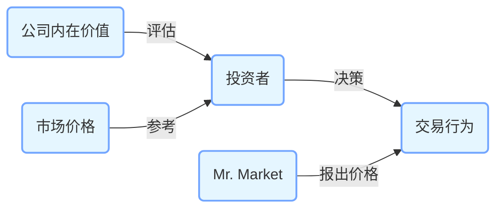

# 格雷厄姆的Mr. Market比喻及其现代意义

> 关键词：格雷厄姆、Mr. Market、价值投资、市场情绪、现代金融市场、投资决策、市场波动

> 摘要：本文深入探讨了格雷厄姆提出的Mr. Market比喻，详细阐述了其核心概念、原理以及在现代金融市场中的重要意义。通过对该比喻的多维度分析，结合数学模型、实际案例和具体操作步骤，旨在帮助投资者更好地理解市场情绪和波动，从而做出更明智的投资决策。同时，介绍了相关的学习资源、开发工具和研究成果，对未来金融市场的发展趋势与挑战进行了展望，并对常见问题进行了解答。

## 1. 背景介绍 
### 1.1 目的和范围
本文章的主要目的是全面剖析格雷厄姆的Mr. Market比喻，揭示其深刻内涵和在现代金融环境中的应用价值。通过对这一经典概念的研究，帮助投资者、金融从业者以及对金融市场感兴趣的人士更好地理解市场行为和投资决策的本质。文章的范围涵盖了Mr. Market比喻的起源、核心原理、在不同市场环境下的表现，以及如何将其应用于实际投资操作中。

### 1.2 预期读者
本文预期读者包括但不限于专业投资者、金融分析师、经济学学生、对金融市场和投资有兴趣的普通读者。无论是希望深入了解价值投资理论的专业人士，还是刚刚接触金融领域的初学者，都能从本文中获得有价值的信息和启示。

### 1.3 文档结构概述
本文将按照以下结构展开：首先介绍格雷厄姆的Mr. Market比喻的背景和相关术语；接着阐述其核心概念和内在联系，通过文本示意图和Mermaid流程图进行直观展示；然后详细讲解核心算法原理和具体操作步骤，结合Python源代码进行说明；随后介绍相关的数学模型和公式，并通过具体例子进行讲解；再通过项目实战，给出代码实际案例并进行详细解释；分析该比喻在实际应用中的场景；推荐相关的学习资源、开发工具和研究成果；最后总结未来发展趋势与挑战，解答常见问题并提供扩展阅读和参考资料。

### 1.4 术语表
#### 1.4.1 核心术语定义
- **格雷厄姆（Graham）**：本杰明·格雷厄姆（Benjamin Graham）是现代证券分析和价值投资理论的奠基人，被誉为“华尔街教父”。他的投资理念和方法对后世产生了深远的影响。
- **Mr. Market**：格雷厄姆提出的一个拟人化概念，代表金融市场的参与者情绪和市场价格波动的不确定性。Mr. Market每天都会出现，给出一个买卖价格，但其情绪极不稳定，时而乐观时而悲观。
- **价值投资（Value Investing）**：一种投资策略，强调通过分析公司的内在价值，以低于其内在价值的价格购买股票，从而获得长期投资回报。

#### 1.4.2 相关概念解释
- **市场情绪（Market Sentiment）**：指投资者对金融市场的整体看法和心理预期，它会影响投资者的决策和市场价格的波动。市场情绪可以是乐观的、悲观的或中性的。
- **内在价值（Intrinsic Value）**：公司或资产的真实价值，它基于公司的基本面因素，如盈利能力、资产负债状况、行业前景等。内在价值是价值投资的核心概念之一。
- **市场效率（Market Efficiency）**：指市场价格反映所有可用信息的程度。有效市场假说认为，在有效市场中，市场价格能够迅速、准确地反映所有信息，因此投资者很难通过分析信息获得超额收益。

#### 1.4.3 缩略词列表
- **EMH**：Efficient Market Hypothesis，有效市场假说

## 2. 核心概念与联系 

### Mr. Market比喻的核心原理
格雷厄姆将金融市场比喻成一个名叫Mr. Market的人，他是投资者的生意伙伴。Mr. Market每天都会出现，报出一个价格，愿意买入或卖出投资者手中的股票。Mr. Market的情绪极不稳定，有时他非常乐观，认为一切都很美好，会给出一个很高的价格；有时他又非常悲观，觉得世界末日即将来临，会给出一个很低的价格。

投资者的任务是不要被Mr. Market的情绪所左右，而是要根据公司的内在价值来做出投资决策。当Mr. Market给出的价格低于公司的内在价值时，投资者应该买入股票；当价格高于内在价值时，投资者应该卖出股票。

### 文本示意图
```plaintext
投资者 <------> Mr. Market
|                   |
| 根据内在价值决策 | 情绪不稳定，报出价格
|                   |
公司内在价值 <------> 市场价格
```

### Mermaid流程图


## 3. 核心算法原理 & 具体操作步骤 

### 核心算法原理
在应用Mr. Market比喻进行投资决策时，核心算法是评估公司的内在价值，并将其与市场价格进行比较。下面是一个简化的Python代码示例，用于计算公司的内在价值和判断投资决策。

```python
# 假设我们使用股息折现模型（Dividend Discount Model, DDM）来计算公司的内在价值
# 股息折现模型的公式为：V = D1 / (r - g)
# 其中，V 是公司的内在价值，D1 是下一年的股息，r 是折现率，g 是股息增长率

def calculate_intrinsic_value(dividend_next_year, discount_rate, growth_rate):
    """
    计算公司的内在价值
    :param dividend_next_year: 下一年的股息
    :param discount_rate: 折现率
    :param growth_rate: 股息增长率
    :return: 公司的内在价值
    """
    if discount_rate <= growth_rate:
        raise ValueError("折现率必须大于股息增长率")
    return dividend_next_year / (discount_rate - growth_rate)

def make_investment_decision(intrinsic_value, market_price):
    """
    根据内在价值和市场价格做出投资决策
    :param intrinsic_value: 公司的内在价值
    :param market_price: 市场价格
    :return: 投资决策（买入、卖出或持有）
    """
    if intrinsic_value > market_price:
        return "买入"
    elif intrinsic_value < market_price:
        return "卖出"
    else:
        return "持有"

# 示例数据
dividend_next_year = 2.0  # 下一年的股息为 2 元
discount_rate = 0.1  # 折现率为 10%
growth_rate = 0.05  # 股息增长率为 5%
market_price = 30.0  # 市场价格为 30 元

# 计算内在价值
intrinsic_value = calculate_intrinsic_value(dividend_next_year, discount_rate, growth_rate)

# 做出投资决策
decision = make_investment_decision(intrinsic_value, market_price)

print(f"公司的内在价值为: {intrinsic_value} 元")
print(f"市场价格为: {market_price} 元")
print(f"投资决策: {decision}")
```

### 具体操作步骤
1. **收集数据**：收集公司的财务数据，包括股息、盈利、资产负债等信息，以及宏观经济数据，如利率、通货膨胀率等。
2. **选择估值模型**：根据公司的特点和行业情况，选择合适的估值模型，如股息折现模型、现金流折现模型、市盈率模型等。
3. **计算内在价值**：使用选择的估值模型，结合收集到的数据，计算公司的内在价值。
4. **获取市场价格**：通过金融市场数据平台，获取公司股票的当前市场价格。
5. **比较内在价值和市场价格**：将计算得到的内在价值与市场价格进行比较，根据比较结果做出投资决策。
6. **监控和调整**：定期监控公司的财务状况和市场价格的变化，根据情况调整投资组合。

## 4. 数学模型和公式 & 详细讲解 & 举例说明 

### 股息折现模型（Dividend Discount Model, DDM）
股息折现模型是一种常用的估值模型，它基于股票的未来股息流来计算股票的内在价值。其基本公式为：

$$V = \frac{D_1}{r - g}$$

其中：
- $V$ 是股票的内在价值
- $D_1$ 是下一年的股息
- $r$ 是折现率，反映了投资者对股票投资的预期收益率
- $g$ 是股息增长率，假设股息以固定的增长率 $g$ 增长

### 详细讲解
- **股息 $D_1$**：通常可以根据公司过去的股息分配情况和盈利预测来估算下一年的股息。
- **折现率 $r$**：折现率是投资者要求的最低收益率，它受到多种因素的影响，如无风险利率、市场风险溢价、公司的风险水平等。一般来说，无风险利率可以参考国债收益率，市场风险溢价可以根据历史数据估算，公司的风险水平可以通过贝塔系数来衡量。
- **股息增长率 $g$**：股息增长率可以根据公司的历史股息增长情况、行业发展趋势和公司的盈利预测来估算。需要注意的是，股息增长率不能超过折现率，否则模型将无法收敛。

### 举例说明
假设一家公司下一年的股息预计为 2 元，投资者要求的折现率为 10%，股息增长率为 5%。根据股息折现模型，该公司股票的内在价值为：

$$V = \frac{2}{0.1 - 0.05} = \frac{2}{0.05} = 40 \text{ 元}$$

如果该公司股票的当前市场价格为 30 元，由于内在价值大于市场价格，根据投资决策原则，投资者应该买入该股票。

### 现金流折现模型（Discounted Cash Flow, DCF）
现金流折现模型是一种更全面的估值模型，它考虑了公司未来的自由现金流。其基本公式为：

$$V = \sum_{t = 1}^{n} \frac{FCF_t}{(1 + r)^t} + \frac{TV}{(1 + r)^n}$$

其中：
- $V$ 是公司的内在价值
- $FCF_t$ 是第 $t$ 年的自由现金流
- $r$ 是折现率
- $n$ 是预测期数
- $TV$ 是终值，通常使用永续增长模型计算

### 详细讲解
- **自由现金流 $FCF_t$**：自由现金流是公司在满足了所有运营和投资需求后剩余的现金流量，它反映了公司的实际盈利能力和现金创造能力。自由现金流可以通过公司的财务报表计算得到。
- **折现率 $r$**：与股息折现模型中的折现率类似，反映了投资者对公司投资的预期收益率。
- **终值 $TV$**：终值是预测期结束后公司的价值，通常使用永续增长模型计算。永续增长模型的公式为：

$$TV = \frac{FCF_{n + 1}}{r - g}$$

其中，$FCF_{n + 1}$ 是预测期结束后下一年的自由现金流，$g$ 是永续增长率。

### 举例说明
假设一家公司未来 5 年的自由现金流分别为 100 万元、120 万元、140 万元、160 万元和 180 万元，折现率为 10%，永续增长率为 3%。预测期结束后下一年的自由现金流预计为 190 万元。则该公司的内在价值为：

首先计算预测期内自由现金流的现值：

$$PV_1 = \frac{100}{(1 + 0.1)^1} = 90.91 \text{ 万元}$$
$$PV_2 = \frac{120}{(1 + 0.1)^2} = 99.17 \text{ 万元}$$
$$PV_3 = \frac{140}{(1 + 0.1)^3} = 105.18 \text{ 万元}$$
$$PV_4 = \frac{160}{(1 + 0.1)^4} = 109.29 \text{ 万元}$$
$$PV_5 = \frac{180}{(1 + 0.1)^5} = 111.73 \text{ 万元}$$

预测期内自由现金流的现值总和为：

$$PV_{total} = PV_1 + PV_2 + PV_3 + PV_4 + PV_5 = 90.91 + 99.17 + 105.18 + 109.29 + 111.73 = 516.28 \text{ 万元}$$

然后计算终值的现值：

$$TV = \frac{190}{0.1 - 0.03} = 2714.29 \text{ 万元}$$
$$PV_{TV} = \frac{2714.29}{(1 + 0.1)^5} = 1683.44 \text{ 万元}$$

最后计算公司的内在价值：

$$V = PV_{total} + PV_{TV} = 516.28 + 1683.44 = 2199.72 \text{ 万元}$$

## 5. 项目实战：代码实际案例和详细解释说明 

### 5.1  开发环境搭建
- **Python 环境**：建议使用 Python 3.7 及以上版本。可以从 Python 官方网站（https://www.python.org/downloads/）下载并安装。
- **开发工具**：可以使用 PyCharm、Jupyter Notebook 等开发工具。PyCharm 是一款功能强大的 Python 集成开发环境，Jupyter Notebook 则适合进行交互式编程和数据分析。
- **相关库**：需要安装一些常用的 Python 库，如 `pandas`、`numpy` 等。可以使用以下命令进行安装：

```sh
pip install pandas numpy
```

### 5.2  源代码详细实现和代码解读
以下是一个更完整的 Python 代码示例，用于实现基于股息折现模型的投资决策系统。

```python
import pandas as pd
import numpy as np

class InvestmentDecisionSystem:
    def __init__(self, dividend_data, discount_rate, growth_rate):
        """
        初始化投资决策系统
        :param dividend_data: 股息数据，DataFrame 格式，包含年份和股息两列
        :param discount_rate: 折现率
        :param growth_rate: 股息增长率
        """
        self.dividend_data = dividend_data
        self.discount_rate = discount_rate
        self.growth_rate = growth_rate

    def calculate_next_year_dividend(self):
        """
        计算下一年的股息
        :return: 下一年的股息
        """
        last_dividend = self.dividend_data['股息'].iloc[-1]
        return last_dividend * (1 + self.growth_rate)

    def calculate_intrinsic_value(self):
        """
        计算公司的内在价值
        :return: 公司的内在价值
        """
        dividend_next_year = self.calculate_next_year_dividend()
        if self.discount_rate <= self.growth_rate:
            raise ValueError("折现率必须大于股息增长率")
        return dividend_next_year / (self.discount_rate - self.growth_rate)

    def make_investment_decision(self, market_price):
        """
        根据内在价值和市场价格做出投资决策
        :param market_price: 市场价格
        :return: 投资决策（买入、卖出或持有）
        """
        intrinsic_value = self.calculate_intrinsic_value()
        if intrinsic_value > market_price:
            return "买入"
        elif intrinsic_value < market_price:
            return "卖出"
        else:
            return "持有"

# 示例数据
dividend_data = pd.DataFrame({
    '年份': [2016, 2017, 2018, 2019, 2020],
    '股息': [1.5, 1.6, 1.7, 1.8, 1.9]
})

discount_rate = 0.1  # 折现率为 10%
growth_rate = 0.05  # 股息增长率为 5%
market_price = 30.0  # 市场价格为 30 元

# 创建投资决策系统实例
investment_system = InvestmentDecisionSystem(dividend_data, discount_rate, growth_rate)

# 计算内在价值
intrinsic_value = investment_system.calculate_intrinsic_value()

# 做出投资决策
decision = investment_system.make_investment_decision(market_price)

print(f"公司的内在价值为: {intrinsic_value} 元")
print(f"市场价格为: {market_price} 元")
print(f"投资决策: {decision}")
```

### 5.3  代码解读与分析
- **类的定义**：`InvestmentDecisionSystem` 类封装了投资决策系统的核心功能，包括计算下一年的股息、计算公司的内在价值和做出投资决策。
- **数据初始化**：在类的构造函数中，接收股息数据、折现率和股息增长率作为参数，并进行初始化。
- **计算下一年的股息**：`calculate_next_year_dividend` 方法根据历史股息数据和股息增长率计算下一年的股息。
- **计算公司的内在价值**：`calculate_intrinsic_value` 方法使用股息折现模型计算公司的内在价值。
- **做出投资决策**：`make_investment_decision` 方法根据内在价值和市场价格做出投资决策。
- **示例数据和调用**：在主程序中，创建了示例股息数据、折现率、股息增长率和市场价格，并使用 `InvestmentDecisionSystem` 类进行投资决策。

## 6. 实际应用场景 
### 股票投资
在股票投资中，Mr. Market比喻可以帮助投资者更好地理解市场价格的波动，避免被市场情绪所左右。投资者可以通过分析公司的内在价值，在市场价格低于内在价值时买入股票，在市场价格高于内在价值时卖出股票，从而实现长期的投资收益。

### 基金投资
对于基金投资者来说，也可以运用Mr. Market比喻的思想。当市场情绪悲观，基金净值下跌时，投资者可以评估基金所投资的资产的内在价值，如果内在价值仍然较高，可以考虑增加投资；当市场情绪乐观，基金净值大幅上涨时，可以适当减持。

### 企业并购
在企业并购中，收购方需要评估被收购企业的内在价值。Mr. Market比喻提醒收购方不要被市场的短期波动和情绪所影响，要基于被收购企业的真实价值进行决策。如果市场价格低于被收购企业的内在价值，收购方可以考虑进行收购；如果市场价格过高，则需要谨慎决策。

### 宏观经济分析
从宏观经济的角度来看，Mr. Market比喻可以帮助政策制定者和经济学家理解市场参与者的情绪和行为对经济的影响。市场情绪的波动可能导致资产价格的过度波动，进而影响经济的稳定。政策制定者可以通过调整政策来引导市场情绪，促进经济的健康发展。

## 7. 工具和资源推荐
### 7.1 学习资源推荐
#### 7.1.1 书籍推荐
- 《聪明的投资者》（The Intelligent Investor）：本杰明·格雷厄姆的经典著作，被誉为投资界的圣经。书中详细阐述了价值投资的理念和方法，以及Mr. Market比喻的内涵。
- 《证券分析》（Security Analysis）：同样是格雷厄姆的著作，是价值投资理论的奠基之作。该书对证券的分析方法、估值模型等进行了深入的探讨。
- 《巴菲特致股东的信》（Letters to Shareholders of Berkshire Hathaway）：沃伦·巴菲特是格雷厄姆的学生，他的投资理念深受格雷厄姆的影响。这本书收录了巴菲特历年致股东的信，从中可以学习到巴菲特的投资思想和实践经验。

#### 7.1.2 在线课程
- Coursera 上的“投资学原理”（Principles of Investing）：该课程由知名大学的教授授课，系统地介绍了投资学的基本原理和方法，包括价值投资、资产定价等内容。
- edX 上的“金融市场”（Financial Markets）：这门课程由耶鲁大学的教授主讲，涵盖了金融市场的各个方面，如股票市场、债券市场、衍生品市场等，有助于深入了解金融市场的运行机制。

#### 7.1.3 技术博客和网站
- Seeking Alpha（https://seekingalpha.com/）：一个专业的金融投资网站，提供了大量的股票分析、市场评论和投资策略等内容。
- The Motley Fool（https://www.fool.com/）：致力于为投资者提供独立的投资建议和分析，有很多关于价值投资和市场分析的文章。

### 7.2 开发工具框架推荐
#### 7.2.1 IDE和编辑器
- PyCharm：功能强大的 Python 集成开发环境，具有代码编辑、调试、自动完成等功能，适合开发复杂的 Python 程序。
- Jupyter Notebook：交互式编程环境，适合进行数据分析和模型开发。可以方便地展示代码、数据和可视化结果。

#### 7.2.2 调试和性能分析工具
- PDB：Python 内置的调试器，可以帮助开发者定位代码中的错误。
- cProfile：Python 的性能分析工具，可以分析代码的运行时间和函数调用情况，帮助优化代码性能。

#### 7.2.3 相关框架和库
- Pandas：用于数据处理和分析的 Python 库，提供了高效的数据结构和数据操作方法。
- NumPy：Python 的数值计算库，提供了高效的数组和矩阵运算功能。
- Matplotlib：用于数据可视化的 Python 库，可以绘制各种类型的图表，如折线图、柱状图、散点图等。

### 7.3 相关论文著作推荐
#### 7.3.1 经典论文
- Fama, E. F., & French, K. R. (1992). The cross-section of expected stock returns. Journal of Finance, 47(2), 427-465. 该论文提出了著名的 Fama-French 三因子模型，对股票收益的横截面进行了深入研究。
- Sharpe, W. F. (1964). Capital asset prices: A theory of market equilibrium under conditions of risk. The Journal of Finance, 19(3), 425-442. 夏普提出了资本资产定价模型（CAPM），为资产定价理论奠定了基础。

#### 7.3.2 最新研究成果
- Barberis, N., & Thaler, R. H. (2003). A survey of behavioral finance. Handbook of the Economics of Finance, 1, 1053-1128. 该论文对行为金融学的研究成果进行了全面的综述，探讨了投资者的心理和行为对金融市场的影响。
- Cochrane, J. H. (2017). Asset pricing: Revised edition. Princeton University Press. 这本书对资产定价理论进行了系统的阐述，涵盖了现代资产定价的最新研究成果。

#### 7.3.3 应用案例分析
- Graham, B., & Dodd, D. L. (1934). Security analysis. McGraw-Hill. 该书包含了许多实际的证券分析案例，通过对这些案例的分析，可以更好地理解价值投资的方法和应用。
- Buffett, W. E. (1984). The superinvestors of Graham-and-Doddsville. Hermes, 17(1), 4-22. 巴菲特在这篇文章中介绍了格雷厄姆的学生们的投资案例，展示了价值投资的成功实践。

## 8. 总结：未来发展趋势与挑战
### 未来发展趋势
- **科技与金融的融合**：随着科技的不断进步，金融市场也在不断创新。人工智能、大数据、区块链等技术将在投资领域得到更广泛的应用，帮助投资者更准确地评估公司的内在价值，更好地应对市场波动。
- **全球市场的一体化**：全球经济的一体化趋势将继续加强，金融市场之间的联系也将更加紧密。投资者需要更加关注全球市场的动态，考虑不同国家和地区的经济、政治和文化因素对投资的影响。
- **社会责任投资的兴起**：越来越多的投资者开始关注企业的社会责任和可持续发展。未来，社会责任投资将成为一种重要的投资趋势，投资者将更加注重企业的环境、社会和治理（ESG）表现。

### 挑战
- **市场的不确定性**：金融市场的不确定性是永恒的挑战。尽管有各种估值模型和分析方法，但市场价格仍然受到多种因素的影响，如宏观经济数据、政策变化、地缘政治风险等。投资者需要不断学习和适应市场的变化，提高自己的风险承受能力。
- **信息过载**：在信息时代，投资者面临着大量的信息。如何从海量的信息中筛选出有价值的信息，并做出正确的投资决策，是一个巨大的挑战。投资者需要提高自己的信息分析能力和判断力。
- **行为偏差**：投资者的行为偏差是影响投资决策的重要因素。如过度自信、羊群效应、损失厌恶等行为偏差可能导致投资者做出错误的决策。投资者需要认识到自己的行为偏差，并通过学习和实践来克服这些偏差。

## 9. 附录：常见问题与解答
### 问题 1：如何准确估算公司的内在价值？
答：估算公司的内在价值是一个复杂的过程，需要综合考虑多种因素。常见的方法包括股息折现模型、现金流折现模型、市盈率模型等。在使用这些模型时，需要收集公司的财务数据、行业数据和宏观经济数据，并对这些数据进行分析和预测。同时，还需要考虑公司的竞争优势、管理团队、行业前景等定性因素。由于内在价值的估算涉及到很多假设和预测，因此存在一定的不确定性。投资者可以采用多种方法进行估算，并结合自己的判断和经验来确定一个合理的内在价值范围。

### 问题 2：Mr. Market比喻是否适用于所有市场？
答：Mr. Market比喻的核心思想是市场情绪的波动和投资者的理性决策，这一思想在大多数市场中都是适用的。然而，不同市场的特点和运行机制可能有所不同，因此在应用时需要结合具体市场情况进行调整。例如，新兴市场的波动性可能较大，市场效率相对较低，投资者在应用Mr. Market比喻时需要更加谨慎。此外，一些特殊的市场，如期货市场、期权市场等，其交易机制和风险特征与股票市场有所不同，需要采用不同的分析方法和投资策略。

### 问题 3：如何避免被市场情绪所左右？
答：要避免被市场情绪所左右，投资者需要具备以下几点：
1. **建立自己的投资体系**：明确自己的投资目标、风险承受能力和投资策略，不随市场情绪的波动而轻易改变。
2. **加强学习和研究**：不断学习投资知识和分析方法，提高自己的投资能力和判断力。通过对公司基本面和市场趋势的深入研究，做出理性的投资决策。
3. **保持冷静和耐心**：在市场波动时，保持冷静的头脑，不被短期的涨跌所影响。要有耐心，等待合适的投资机会。
4. **分散投资**：通过分散投资降低单一资产的风险，减少市场波动对投资组合的影响。

### 问题 4：股息折现模型有哪些局限性？
答：股息折现模型的局限性主要包括以下几点：
1. **假设条件严格**：该模型假设股息以固定的增长率增长，这在现实中很难实现。公司的股息政策可能会受到多种因素的影响，如盈利情况、投资机会、管理层决策等，股息增长率可能会发生变化。
2. **对数据要求较高**：需要准确估算下一年的股息、折现率和股息增长率。这些数据的估算存在一定的主观性和不确定性，可能会影响模型的准确性。
3. **不适合非分红公司**：对于不分红或分红很少的公司，股息折现模型无法适用。这些公司可能将盈利用于再投资，以实现业务的增长，此时需要采用其他估值模型，如现金流折现模型。

## 10. 扩展阅读 & 参考资料
1. Graham, B. (2003). The intelligent investor. HarperBusiness.
2. Graham, B., & Dodd, D. L. (1934). Security analysis. McGraw-Hill.
3. Buffett, W. E. (1984). The superinvestors of Graham-and-Doddsville. Hermes, 17(1), 4-22.
4. Fama, E. F., & French, K. R. (1992). The cross-section of expected stock returns. Journal of Finance, 47(2), 427-465.
5. Sharpe, W. F. (1964). Capital asset prices: A theory of market equilibrium under conditions of risk. The Journal of Finance, 19(3), 425-442.
6. Barberis, N., & Thaler, R. H. (2003). A survey of behavioral finance. Handbook of the Economics of Finance, 1, 1053-1128.
7. Cochrane, J. H. (2017). Asset pricing: Revised edition. Princeton University Press.
8. Seeking Alpha. (https://seekingalpha.com/)
9. The Motley Fool. (https://www.fool.com/)
10. Coursera. (https://www.coursera.org/)
11. edX. (https://www.edx.org/)