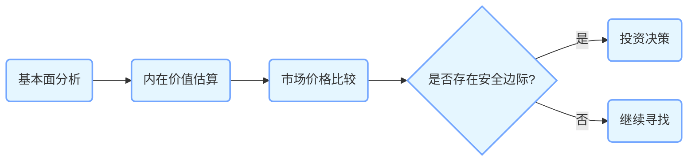

# 格雷厄姆的价值投资著作解析

> 关键词：格雷厄姆、价值投资、著作解析、投资理念、证券分析

> 摘要：本文章旨在深入解析格雷厄姆的价值投资著作，全面剖析其核心投资理念、理论体系与方法。通过对格雷厄姆经典著作的研究，揭示价值投资的本质和精髓，帮助投资者更好地理解和应用价值投资策略。文章从背景介绍入手，阐述格雷厄姆及其著作的重要意义，接着分析核心概念与联系，深入讲解核心算法原理与具体操作步骤，探讨相关数学模型和公式，通过项目实战案例展示价值投资在实际中的应用，介绍实际应用场景，推荐学习和开发的工具与资源，最后总结未来发展趋势与挑战，解答常见问题并提供扩展阅读和参考资料，为投资者提供全面、深入的价值投资知识体系。

## 1. 背景介绍 
### 1.1 目的和范围
本解析的目的在于对格雷厄姆的价值投资著作进行系统、深入的研究，全面挖掘其著作中蕴含的投资智慧和方法。范围涵盖格雷厄姆的主要代表作，如《证券分析》《聪明的投资者》等，旨在从理论到实践，从理念到方法，全方位解读价值投资的内涵和应用。

### 1.2 预期读者
预期读者包括对价值投资感兴趣的投资者、金融从业者、经济专业学生以及希望提升投资知识和技能的人士。无论您是投资新手还是有一定经验的专业人士，都能从本解析中获得有价值的信息和启示。

### 1.3 文档结构概述
本文将按照以下结构展开：首先介绍背景信息，包括目的、读者和文档结构；接着阐述核心概念与联系，梳理价值投资的基本概念和相互关系；然后深入讲解核心算法原理和具体操作步骤，结合 Python 代码进行说明；再探讨数学模型和公式，并举例说明；通过项目实战展示价值投资在实际中的应用；介绍实际应用场景；推荐相关的工具和资源；总结未来发展趋势与挑战；解答常见问题；最后提供扩展阅读和参考资料。

### 1.4 术语表
#### 1.4.1 核心术语定义
- **价值投资**：一种基于公司内在价值进行投资的策略，投资者通过分析公司的财务状况、经营业绩等因素，寻找被市场低估的股票进行投资。
- **内在价值**：公司的真实价值，由公司的资产、盈利能力、现金流等因素决定。
- **安全边际**：股票的市场价格低于其内在价值的部分，为投资者提供了一定的缓冲空间，降低投资风险。
- **基本面分析**：通过研究公司的财务报表、行业前景、宏观经济环境等基本面因素，评估公司的内在价值和投资价值。

#### 1.4.2 相关概念解释
- **成长股投资**：与价值投资相对，成长股投资更注重公司的未来成长潜力，而不是当前的内在价值。成长股投资者通常愿意为具有高成长潜力的公司支付较高的价格。
- **技术分析**：通过研究股票的价格走势、成交量等技术指标，预测股票未来的价格走势。与基本面分析不同，技术分析不关注公司的内在价值。

#### 1.4.3 缩略词列表
- **EPS**：每股收益（Earnings Per Share），反映公司每股股票的盈利水平。
- **P/E**：市盈率（Price-to-Earnings Ratio），衡量股票价格相对于每股收益的倍数，用于评估股票的估值水平。
- **ROE**：净资产收益率（Return on Equity），反映公司运用自有资本的效率。

## 2. 核心概念与联系 

### 2.1 价值投资的核心概念
价值投资的核心概念包括内在价值、安全边际和基本面分析。内在价值是价值投资的基石，它是公司的真实价值，不受市场短期波动的影响。投资者的目标是寻找市场价格低于内在价值的股票，从而获得投资回报。安全边际是价值投资的重要原则，它为投资者提供了一定的保护，降低了投资风险。基本面分析是评估内在价值的主要方法，通过研究公司的财务报表、行业前景、宏观经济环境等因素，投资者可以更准确地评估公司的内在价值。

### 2.2 核心概念的联系
内在价值、安全边际和基本面分析三者之间相互关联、相互影响。基本面分析是确定内在价值的基础，通过对公司基本面的深入研究，投资者可以更准确地估算公司的内在价值。安全边际则是基于内在价值和市场价格的比较而确定的，当市场价格低于内在价值时，就存在安全边际。安全边际的大小取决于内在价值的估算准确性和市场价格的波动情况。同时，安全边际也影响着投资者的投资决策，较大的安全边际意味着更低的投资风险和更高的潜在回报，因此投资者通常更倾向于选择具有较大安全边际的股票。

### 2.3 价值投资的原理和架构示意图

这个示意图展示了价值投资的基本原理和架构。投资者首先通过基本面分析估算公司的内在价值，然后将内在价值与市场价格进行比较，判断是否存在安全边际。如果存在安全边际，投资者就可以做出投资决策；如果不存在安全边际，投资者则需要继续寻找其他投资机会。

## 3. 核心算法原理 & 具体操作步骤 

### 3.1 核心算法原理
价值投资的核心算法原理是通过对公司基本面的分析，估算公司的内在价值，并将其与市场价格进行比较，寻找具有安全边际的投资机会。下面我们将使用 Python 代码来详细阐述这个过程。

### 3.2 具体操作步骤及 Python 代码实现

#### 3.2.1 数据获取
首先，我们需要获取公司的财务数据，如每股收益（EPS）、市盈率（P/E）等。我们可以使用 `pandas-datareader` 库来获取这些数据。
```python
import pandas_datareader.data as web
import datetime

# 定义获取数据的时间范围
start = datetime.datetime(2020, 1, 1)
end = datetime.datetime(2023, 12, 31)

# 获取某公司的财务数据，这里以苹果公司（AAPL）为例
ticker = 'AAPL'
df = web.DataReader(ticker, 'yahoo', start, end)

# 获取每股收益数据（假设从其他数据源获取）
eps = 5.0

# 获取市盈率数据（假设从其他数据源获取）
pe_ratio = 20.0
```

#### 3.2.2 内在价值估算
接下来，我们可以使用市盈率法来估算公司的内在价值。市盈率法的公式为：内在价值 = 每股收益 × 合理市盈率。
```python
# 假设合理市盈率为 15
reasonable_pe = 15

# 估算内在价值
intrinsic_value = eps * reasonable_pe
print(f"估算的内在价值为: {intrinsic_value}")
```

#### 3.2.3 安全边际计算
然后，我们可以计算安全边际。安全边际的计算公式为：安全边际 = （内在价值 - 市场价格）/ 内在价值 × 100%。
```python
# 获取当前市场价格
current_price = df['Close'].iloc[-1]

# 计算安全边际
margin_of_safety = ((intrinsic_value - current_price) / intrinsic_value) * 100
print(f"安全边际为: {margin_of_safety}%")
```

#### 3.2.4 投资决策
最后，我们可以根据安全边际的大小做出投资决策。一般来说，安全边际越大，投资风险越低，潜在回报越高。
```python
# 设定安全边际阈值
threshold = 20

if margin_of_safety > threshold:
    print("存在较大安全边际，可以考虑投资。")
else:
    print("安全边际较小，建议谨慎投资。")
```

## 4. 数学模型和公式 & 详细讲解 & 举例说明 

### 4.1 市盈率法估算内在价值
市盈率法是一种常用的估算公司内在价值的方法，其数学公式为：
$$V = EPS \times P/E_{r}$$
其中，$V$ 表示公司的内在价值，$EPS$ 表示每股收益，$P/E_{r}$ 表示合理市盈率。

#### 4.1.1 详细讲解
每股收益（$EPS$）是公司净利润与发行在外普通股股数的比值，反映了公司每股股票的盈利水平。合理市盈率（$P/E_{r}$）是根据公司的行业特点、盈利能力、成长前景等因素确定的一个合理的市盈率倍数。通过将每股收益乘以合理市盈率，我们可以估算出公司的内在价值。

#### 4.1.2 举例说明
假设某公司的每股收益为 3 元，合理市盈率为 12 倍。则该公司的内在价值为：
$$V = 3 \times 12 = 36 \text{（元）}$$

### 4.2 安全边际计算
安全边际的计算公式为：
$$MOS = \frac{V - P}{V} \times 100\%$$
其中，$MOS$ 表示安全边际，$V$ 表示公司的内在价值，$P$ 表示市场价格。

#### 4.2.1 详细讲解
安全边际反映了市场价格低于内在价值的程度，它为投资者提供了一定的缓冲空间。当安全边际较大时，意味着市场价格被低估的程度较高，投资风险相对较低；当安全边际较小时，意味着市场价格接近或高于内在价值，投资风险相对较高。

#### 4.2.2 举例说明
假设某公司的内在价值为 50 元，市场价格为 40 元。则该公司的安全边际为：
$$MOS = \frac{50 - 40}{50} \times 100\% = 20\%$$

## 5. 项目实战：代码实际案例和详细解释说明 

### 5.1  开发环境搭建
#### 5.1.1 安装 Python
首先，你需要安装 Python 环境。可以从 Python 官方网站（https://www.python.org/downloads/） 下载适合你操作系统的 Python 安装包，并按照安装向导进行安装。

#### 5.1.2 安装必要的库
在安装好 Python 后，你需要安装一些必要的库，如 `pandas-datareader`、`matplotlib` 等。可以使用以下命令进行安装：
```sh
pip install pandas-datareader matplotlib
```

### 5.2  源代码详细实现和代码解读

```python
import pandas_datareader.data as web
import datetime
import matplotlib.pyplot as plt

# 定义获取数据的时间范围
start = datetime.datetime(2020, 1, 1)
end = datetime.datetime(2023, 12, 31)

# 获取某公司的财务数据，这里以微软公司（MSFT）为例
ticker = 'MSFT'
df = web.DataReader(ticker, 'yahoo', start, end)

# 获取每股收益数据（假设从其他数据源获取）
eps = 6.0

# 获取市盈率数据（假设从其他数据源获取）
pe_ratio = 25.0

# 假设合理市盈率为 20
reasonable_pe = 20

# 估算内在价值
intrinsic_value = eps * reasonable_pe
print(f"估算的内在价值为: {intrinsic_value}")

# 获取当前市场价格
current_price = df['Close'].iloc[-1]

# 计算安全边际
margin_of_safety = ((intrinsic_value - current_price) / intrinsic_value) * 100
print(f"安全边际为: {margin_of_safety}%")

# 设定安全边际阈值
threshold = 15

if margin_of_safety > threshold:
    print("存在较大安全边际，可以考虑投资。")
else:
    print("安全边际较小，建议谨慎投资。")

# 绘制股价走势图
plt.figure(figsize=(10, 6))
plt.plot(df['Close'])
plt.title(f"{ticker} Stock Price")
plt.xlabel("Date")
plt.ylabel("Price")
plt.show()
```

### 5.3  代码解读与分析
- **数据获取**：使用 `pandas-datareader` 库从雅虎财经获取微软公司（MSFT）的股价数据。
- **内在价值估算**：根据假设的每股收益和合理市盈率，使用市盈率法估算公司的内在价值。
- **安全边际计算**：将内在价值与当前市场价格进行比较，计算安全边际。
- **投资决策**：根据安全边际的大小，判断是否可以考虑投资。
- **股价走势图**：使用 `matplotlib` 库绘制微软公司的股价走势图，帮助投资者直观地了解股价的波动情况。

## 6. 实际应用场景 
### 6.1 个人投资者
对于个人投资者来说，价值投资是一种稳健的投资策略。通过学习格雷厄姆的价值投资理念，个人投资者可以更好地分析公司的基本面，寻找被市场低估的股票，从而实现资产的增值。例如，个人投资者可以在市场低迷时，通过价值投资策略寻找具有安全边际的股票，长期持有，等待市场回暖，获得投资回报。

### 6.2 机构投资者
机构投资者，如基金公司、保险公司等，也广泛应用价值投资策略。机构投资者通常拥有更丰富的研究资源和专业的投资团队，他们可以通过深入的基本面分析，挖掘具有投资价值的公司。同时，价值投资策略也符合机构投资者的长期投资目标和风险偏好，有助于实现资产的稳健增值。

### 6.3 企业并购
在企业并购领域，价值投资理念也具有重要的应用价值。收购方可以通过对目标公司的基本面分析，估算其内在价值，从而确定合理的收购价格。同时，价值投资理念也可以帮助收购方评估目标公司的潜在价值和风险，为并购决策提供依据。

## 7. 工具和资源推荐
### 7.1 学习资源推荐
#### 7.1.1 书籍推荐
- 《证券分析》（Security Analysis）：格雷厄姆的经典著作，被誉为价值投资的“圣经”，深入阐述了价值投资的理论和方法。
- 《聪明的投资者》（The Intelligent Investor）：同样是格雷厄姆的代表作，以通俗易懂的语言介绍了价值投资的理念和策略，适合初学者阅读。
- 《怎样选择成长股》（Common Stocks and Uncommon Profits）：菲利普·费雪的经典著作，介绍了成长股投资的方法和技巧，与价值投资理念相互补充。

#### 7.1.2 在线课程
- Coursera 上的“投资学原理”（Principles of Investing）：由知名大学教授授课，系统介绍投资学的基本原理和方法，包括价值投资理念。
- edX 上的“金融市场”（Financial Markets）：由耶鲁大学教授罗伯特·席勒授课，深入探讨金融市场的运行机制和投资策略，对价值投资有深入的讲解。

#### 7.1.3 技术博客和网站
- 雪球网（https://xueqiu.com/）：国内知名的投资社区，提供丰富的股票分析、投资策略和财经资讯，有很多价值投资者分享自己的经验和观点。
- Seeking Alpha（https://seekingalpha.com/）：国外知名的投资研究网站，提供大量的股票分析报告和投资建议，对价值投资有深入的研究和讨论。

### 7.2 开发工具框架推荐
#### 7.2.1 IDE和编辑器
- PyCharm：一款专业的 Python 集成开发环境，提供丰富的代码编辑、调试和分析功能，适合开发价值投资相关的 Python 程序。
- Jupyter Notebook：一种交互式的开发环境，适合进行数据分析和可视化，方便用户在一个文档中同时展示代码、数据和分析结果。

#### 7.2.2 调试和性能分析工具
- pdb：Python 内置的调试工具，可用于调试 Python 代码，帮助用户查找和解决代码中的问题。
- cProfile：Python 内置的性能分析工具，可用于分析 Python 代码的性能瓶颈，帮助用户优化代码。

#### 7.2.3 相关框架和库
- pandas：一个强大的数据分析库，提供了丰富的数据结构和数据分析工具，适合处理和分析金融数据。
- numpy：一个用于科学计算的库，提供了高效的数组操作和数学函数，可用于金融数据的计算和分析。

### 7.3 相关论文著作推荐
#### 7.3.1 经典论文
- “The Theory of Investment Value” by John Burr Williams：提出了现金流折现模型，为价值投资提供了重要的理论基础。
- “Security Analysis” by Benjamin Graham and David Dodd：格雷厄姆和多德的经典论文，系统阐述了价值投资的理论和方法。

#### 7.3.2 最新研究成果
- 关注顶级金融学术期刊，如《Journal of Finance》《Review of Financial Studies》等，这些期刊发表了很多关于价值投资的最新研究成果。

#### 7.3.3 应用案例分析
- 可以在学术数据库和商业期刊中查找关于价值投资应用案例的分析报告，了解价值投资在实际中的应用效果和经验教训。

## 8. 总结：未来发展趋势与挑战
### 8.1 未来发展趋势
- **数字化和智能化**：随着科技的不断发展，价值投资将越来越多地借助数字化和智能化工具。例如，利用大数据分析和人工智能算法，可以更高效地获取和分析公司的财务数据和市场信息，提高价值投资的准确性和效率。
- **全球投资**：随着全球经济一体化的加深，价值投资将越来越多地跨越国界。投资者可以通过全球资产配置，寻找更多的投资机会，降低投资风险。
- **社会责任投资**：越来越多的投资者开始关注公司的社会责任和可持续发展。未来，价值投资可能会将社会责任因素纳入投资决策的考虑范围，推动企业更加注重社会责任和可持续发展。

### 8.2 挑战
- **市场有效性**：随着市场的不断发展和信息的日益透明，市场的有效性不断提高。这意味着寻找被市场低估的股票将变得越来越困难，价值投资的难度也将相应增加。
- **宏观经济不确定性**：宏观经济环境的不确定性，如经济衰退、通货膨胀、利率波动等，会对公司的经营业绩和股票价格产生影响，增加价值投资的风险。
- **数据质量和可靠性**：价值投资依赖于准确、可靠的财务数据和市场信息。然而，数据质量和可靠性可能会受到各种因素的影响，如公司财务造假、数据误差等，这给价值投资带来了挑战。

## 9. 附录：常见问题与解答
### 9.1 价值投资适合所有投资者吗？
价值投资并不适合所有投资者。价值投资需要投资者具备一定的财务知识和分析能力，能够深入研究公司的基本面。同时，价值投资通常是一种长期投资策略，需要投资者有足够的耐心和定力。因此，对于缺乏投资知识和经验、追求短期收益的投资者来说，价值投资可能并不适合。

### 9.2 如何确定合理的市盈率？
确定合理的市盈率需要综合考虑多个因素，如公司的行业特点、盈利能力、成长前景、市场环境等。一般来说，可以参考同行业其他公司的市盈率水平，结合公司的自身情况进行调整。同时，也可以使用一些估值模型，如现金流折现模型，来估算公司的合理市盈率。

### 9.3 价值投资一定会获得收益吗？
价值投资并不能保证一定会获得收益。虽然价值投资的理念是寻找被市场低估的股票，但市场价格的波动是复杂多变的，受到多种因素的影响。即使公司的内在价值被低估，市场价格也可能在短期内不会反映其内在价值，甚至可能继续下跌。因此，价值投资也存在一定的风险，投资者需要做好风险控制和资产配置。

## 10. 扩展阅读 & 参考资料
### 10.1 扩展阅读
- 《巴菲特致股东的信》（The Essays of Warren Buffett）：沃伦·巴菲特的经典著作，收录了他多年来致股东的信，从中可以了解到巴菲特的投资理念和方法，他深受格雷厄姆价值投资理念的影响。
- 《金融炼金术》（The Alchemy of Finance）：乔治·索罗斯的著作，介绍了他的反身性理论和投资策略，与价值投资理念形成对比和补充。

### 10.2 参考资料
- 格雷厄姆的原著《证券分析》《聪明的投资者》等。
- 相关的金融学术期刊和研究报告。
- 在线金融数据库和财经网站提供的资料和数据。