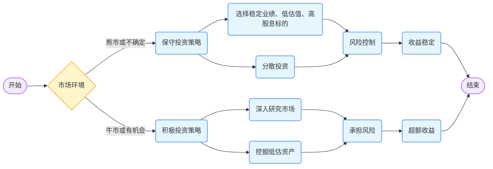

# 格雷厄姆的保守投资策略vs积极投资策略

> 关键词：格雷厄姆、保守投资策略、积极投资策略、价值投资、风险控制、投资组合、收益目标

> 摘要：本文围绕格雷厄姆提出的保守投资策略和积极投资策略展开深入探讨。详细阐述两种策略的核心概念、联系，深入剖析其算法原理和数学模型，结合实际案例展示策略的应用与实现。同时分析不同策略的实际应用场景，推荐相关学习资源、开发工具框架以及论文著作。最后对两种策略的未来发展趋势与挑战进行总结，并在附录中解答常见问题，为投资者全面了解和运用这两种投资策略提供参考。

## 1. 背景介绍 
### 1.1 目的和范围
本文章的目的在于全面、深入地分析格雷厄姆的保守投资策略和积极投资策略，帮助投资者清晰地理解这两种策略的本质、特点、适用场景以及优缺点。通过详细讲解策略的原理、算法、数学模型和实际案例，为不同风险偏好和投资目标的投资者提供有价值的决策依据。文章的范围涵盖了两种投资策略的理论基础、实践操作、应用场景、相关资源以及未来发展趋势等多个方面。

### 1.2 预期读者
本文预期读者主要包括对投资领域感兴趣的初学者，希望通过了解不同投资策略来构建自己的投资理念和方法；有一定投资经验的投资者，期望进一步优化自己的投资组合，提高投资收益；金融专业的学生和研究人员，需要深入研究投资理论和实践，为学术研究和职业发展积累知识。

### 1.3 文档结构概述
本文共分为十个部分。第一部分为背景介绍，阐述文章的目的、预期读者、文档结构概述和术语表；第二部分介绍核心概念与联系，包括保守投资策略和积极投资策略的原理和架构，并通过文本示意图和 Mermaid 流程图进行展示；第三部分讲解核心算法原理和具体操作步骤，使用 Python 源代码详细阐述；第四部分介绍数学模型和公式，并进行详细讲解和举例说明；第五部分是项目实战，包括开发环境搭建、源代码详细实现和代码解读；第六部分分析实际应用场景；第七部分推荐工具和资源，包括学习资源、开发工具框架和相关论文著作；第八部分总结未来发展趋势与挑战；第九部分为附录，解答常见问题；第十部分提供扩展阅读和参考资料。

### 1.4 术语表
#### 1.4.1 核心术语定义
- **保守投资策略**：格雷厄姆提出的一种强调风险控制，追求资产稳健增值的投资策略。该策略倾向于选择具有稳定业绩、低估值、高股息的投资标的，注重投资的安全性和确定性。
- **积极投资策略**：与保守投资策略相对，积极投资策略更注重主动寻找投资机会，通过深入研究和分析市场，挖掘被低估的资产，以获取超额收益。该策略通常承担较高的风险，对投资者的专业知识和投资经验要求较高。
- **价值投资**：一种基于公司内在价值进行投资的理念，通过分析公司的财务状况、行业前景等因素，寻找被市场低估的股票，在价格低于内在价值时买入，等待价格回归价值时卖出。
- **投资组合**：由多种不同的投资资产组成的集合，通过合理配置资产，可以降低投资风险，实现投资目标。
- **风险控制**：在投资过程中，采取各种措施降低投资风险，保护投资者的本金和收益。

#### 1.4.2 相关概念解释
- **股息**：公司向股东分配的利润，是投资者获取投资收益的一种方式。
- **市盈率（P/E）**：股票价格与每股收益的比率，反映了市场对公司未来盈利的预期。
- **市净率（P/B）**：股票价格与每股净资产的比率，衡量了股票的估值水平。
- **安全边际**：股票的内在价值与市场价格之间的差额，安全边际越大，投资风险越低。

#### 1.4.3 缩略词列表
- **P/E**：市盈率（Price-to-Earnings Ratio）
- **P/B**：市净率（Price-to-Book Ratio）

## 2. 核心概念与联系 

### 保守投资策略原理
保守投资策略的核心思想是确保投资的安全性和稳定性。投资者通常会选择具有以下特征的投资标的：
1. **稳定的业绩**：公司具有持续的盈利能力和稳定的现金流，能够在不同的市场环境下保持相对稳定的经营状况。
2. **低估值**：股票的市盈率、市净率等估值指标处于较低水平，相对于公司的内在价值具有较高的安全边际。
3. **高股息**：公司定期向股东分配较高的股息，为投资者提供稳定的现金流收益。

保守投资策略的目标是在控制风险的前提下，实现资产的稳健增值。投资者通常会采用分散投资的方式，将资金分配到不同行业、不同类型的资产中，以降低单一资产的风险。

### 积极投资策略原理
积极投资策略的核心思想是通过主动寻找投资机会，获取超额收益。投资者通常会进行深入的市场研究和分析，挖掘被市场低估的资产。积极投资策略的特点包括：
1. **深入研究**：投资者需要对公司的基本面、行业前景、宏观经济环境等进行深入研究，以寻找具有潜力的投资标的。
2. **承担较高风险**：由于积极投资策略更注重获取超额收益，因此投资者通常需要承担较高的风险。
3. **灵活调整投资组合**：投资者会根据市场变化和投资机会的出现，灵活调整投资组合，以实现投资目标。

### 两种策略的联系
保守投资策略和积极投资策略并不是相互排斥的，而是可以相互补充的。在实际投资中，投资者可以根据自己的风险偏好、投资目标和市场环境，灵活运用两种策略。例如，在市场处于熊市或不确定性较高时，投资者可以采用保守投资策略，以保护资产的安全；在市场处于牛市或有明显的投资机会时，投资者可以采用积极投资策略，以获取超额收益。

### 文本示意图
```plaintext
保守投资策略 <------ 风险控制 ------ 投资组合 ------ 收益稳定
                             |
                             | 相互补充
                             |
积极投资策略 <------ 主动寻找机会 ------ 承担风险 ------ 超额收益
```

### Mermaid 流程图


## 3. 核心算法原理 & 具体操作步骤 

### 保守投资策略算法原理
保守投资策略的核心算法原理是基于价值投资理念，通过评估公司的内在价值，选择具有安全边际的投资标的。具体步骤如下：
1. **筛选投资标的**：根据公司的财务报表、行业排名等指标，筛选出具有稳定业绩、低估值、高股息的公司。
2. **评估内在价值**：使用估值模型（如现金流折现模型、股息折现模型等）评估公司的内在价值。
3. **计算安全边际**：计算股票的市场价格与内在价值之间的差额，选择安全边际较大的股票。
4. **构建投资组合**：将筛选出的股票按照一定的比例构建投资组合，以实现分散投资的目的。

### Python 代码实现保守投资策略
```python
import pandas as pd
import numpy as np

# 假设我们有一个包含公司财务信息的 DataFrame
data = {
    'company': ['A', 'B', 'C', 'D', 'E'],
    'pe_ratio': [10, 15, 20, 8, 12],
    'pb_ratio': [1.2, 1.5, 1.8, 1, 1.3],
    'dividend_yield': [0.05, 0.03, 0.02, 0.06, 0.04],
    'roe': [0.15, 0.12, 0.1, 0.18, 0.13]
}
df = pd.DataFrame(data)

# 筛选条件
def filter_stocks(df):
    filtered_df = df[(df['pe_ratio'] < 15) & (df['pb_ratio'] < 1.5) & (df['dividend_yield'] > 0.04) & (df['roe'] > 0.1)]
    return filtered_df

# 评估内在价值（简单示例，使用市盈率法）
def estimate_intrinsic_value(df):
    df['intrinsic_value'] = df['pe_ratio'] * df['roe']
    return df

# 计算安全边际
def calculate_safety_margin(df):
    # 假设市场价格等于市盈率
    df['safety_margin'] = df['intrinsic_value'] - df['pe_ratio']
    return df

# 构建投资组合（简单平均分配）
def build_portfolio(df):
    portfolio = df.copy()
    portfolio['weight'] = 1 / len(portfolio)
    return portfolio

# 执行保守投资策略
filtered_df = filter_stocks(df)
intrinsic_value_df = estimate_intrinsic_value(filtered_df)
safety_margin_df = calculate_safety_margin(intrinsic_value_df)
portfolio = build_portfolio(safety_margin_df)

print(portfolio)
```

### 积极投资策略算法原理
积极投资策略的核心算法原理是通过深入研究市场和公司，挖掘被低估的资产。具体步骤如下：
1. **市场研究**：分析宏观经济环境、行业趋势等因素，确定具有潜力的行业和板块。
2. **公司分析**：对选定行业中的公司进行深入分析，包括公司的基本面、竞争优势、管理层能力等。
3. **估值分析**：使用多种估值方法（如市盈率法、市净率法、现金流折现法等）评估公司的价值，寻找被低估的股票。
4. **投资决策**：根据估值分析结果，做出投资决策，买入被低估的股票。

### Python 代码实现积极投资策略
```python
# 假设我们有一个包含行业和公司信息的 DataFrame
industry_data = {
    'industry': ['Technology', 'Finance', 'Consumer Goods'],
    'growth_rate': [0.2, 0.1, 0.15]
}
industry_df = pd.DataFrame(industry_data)

company_data = {
    'company': ['Tech1', 'Tech2', 'Fin1', 'Fin2', 'Cons1', 'Cons2'],
    'industry': ['Technology', 'Technology', 'Finance', 'Finance', 'Consumer Goods', 'Consumer Goods'],
    'pe_ratio': [20, 18, 15, 12, 18, 16],
    'pb_ratio': [2, 1.8, 1.5, 1.2, 1.6, 1.4],
    'roe': [0.2, 0.18, 0.15, 0.12, 0.18, 0.16]
}
company_df = pd.DataFrame(company_data)

# 市场研究：选择增长最快的行业
def select_industry(industry_df):
    fastest_growing_industry = industry_df[industry_df['growth_rate'] == industry_df['growth_rate'].max()]['industry'].values[0]
    return fastest_growing_industry

# 公司分析：筛选出选定行业的公司
def filter_companies_by_industry(company_df, industry):
    filtered_df = company_df[company_df['industry'] == industry]
    return filtered_df

# 估值分析：计算公司的相对估值
def calculate_relative_value(df):
    df['relative_value'] = df['pe_ratio'] / df['roe']
    return df

# 投资决策：选择相对估值最低的公司
def select_stock(df):
    selected_stock = df[df['relative_value'] == df['relative_value'].min()]['company'].values[0]
    return selected_stock

# 执行积极投资策略
selected_industry = select_industry(industry_df)
filtered_companies = filter_companies_by_industry(company_df, selected_industry)
relative_value_df = calculate_relative_value(filtered_companies)
selected_stock = select_stock(relative_value_df)

print(f"Selected industry: {selected_industry}")
print(f"Selected stock: {selected_stock}")
```

## 4. 数学模型和公式 & 详细讲解 & 举例说明 

### 保守投资策略数学模型
#### 现金流折现模型（DCF）
现金流折现模型是一种常用的估值模型，其基本原理是将公司未来的现金流折现到当前，以计算公司的内在价值。公式如下：
$$
V = \sum_{t=1}^{n} \frac{CF_t}{(1 + r)^t} + \frac{TV}{(1 + r)^n}
$$
其中：
- $V$ 是公司的内在价值
- $CF_t$ 是第 $t$ 期的现金流
- $r$ 是折现率
- $n$ 是预测期数
- $TV$ 是终值

**详细讲解**：现金流折现模型的核心是预测公司未来的现金流，并选择合适的折现率将其折现到当前。预测现金流需要考虑公司的经营状况、行业前景、宏观经济环境等因素。折现率反映了投资者对投资风险的预期，通常可以使用资本资产定价模型（CAPM）来计算。

**举例说明**：假设一家公司未来三年的现金流分别为 100 万元、120 万元、150 万元，预测期结束后的终值为 1000 万元，折现率为 10%。则该公司的内在价值为：
$$
V = \frac{100}{(1 + 0.1)^1} + \frac{120}{(1 + 0.1)^2} + \frac{150}{(1 + 0.1)^3} + \frac{1000}{(1 + 0.1)^3} \approx 90.91 + 99.17 + 112.70 + 751.31 = 1054.09 \text{（万元）}
$$

#### 股息折现模型（DDM）
股息折现模型是基于公司股息分配的估值模型，其基本原理是将公司未来的股息折现到当前，以计算公司的内在价值。公式如下：
$$
V = \frac{D_1}{r - g}
$$
其中：
- $V$ 是公司的内在价值
- $D_1$ 是下一期的股息
- $r$ 是折现率
- $g$ 是股息增长率

**详细讲解**：股息折现模型适用于具有稳定股息分配的公司。在使用该模型时，需要预测公司未来的股息增长率，并选择合适的折现率。股息增长率可以根据公司的历史股息分配情况、盈利增长情况等因素进行预测。

**举例说明**：假设一家公司下一期的股息为 2 元，股息增长率为 5%，折现率为 10%。则该公司的内在价值为：
$$
V = \frac{2}{0.1 - 0.05} = 40 \text{（元）}
$$

### 积极投资策略数学模型
#### 市盈率法
市盈率法是一种简单的估值方法，其基本原理是根据公司的盈利水平和市场平均市盈率来计算公司的合理股价。公式如下：
$$
P = EPS \times P/E
$$
其中：
- $P$ 是公司的合理股价
- $EPS$ 是每股收益
- $P/E$ 是市盈率

**详细讲解**：市盈率法的关键是选择合适的市盈率。市盈率可以参考同行业公司的平均市盈率，也可以根据公司的盈利增长情况、风险水平等因素进行调整。

**举例说明**：假设一家公司的每股收益为 2 元，同行业公司的平均市盈率为 15 倍。则该公司的合理股价为：
$$
P = 2 \times 15 = 30 \text{（元）}
$$

#### 市净率法
市净率法是根据公司的净资产和市场平均市净率来计算公司的合理股价。公式如下：
$$
P = BVPS \times P/B
$$
其中：
- $P$ 是公司的合理股价
- $BVPS$ 是每股净资产
- $P/B$ 是市净率

**详细讲解**：市净率法适用于资产价值较为稳定的公司。在使用该模型时，需要选择合适的市净率。市净率可以参考同行业公司的平均市净率，也可以根据公司的资产质量、盈利能力等因素进行调整。

**举例说明**：假设一家公司的每股净资产为 10 元，同行业公司的平均市净率为 1.5 倍。则该公司的合理股价为：
$$
P = 10 \times 1.5 = 15 \text{（元）}
$$

## 5. 项目实战：代码实际案例和详细解释说明 

### 5.1  开发环境搭建
为了实现保守投资策略和积极投资策略的代码，我们需要搭建以下开发环境：
1. **Python 环境**：建议使用 Python 3.7 及以上版本。可以从 Python 官方网站（https://www.python.org/downloads/） 下载并安装。
2. **开发工具**：推荐使用 PyCharm 或 Jupyter Notebook 作为开发工具。PyCharm 是一款专业的 Python 集成开发环境，提供了丰富的功能和工具；Jupyter Notebook 是一个交互式的开发环境，适合进行数据探索和代码演示。
3. **必要的库**：需要安装 pandas、numpy 等库。可以使用以下命令进行安装：
```sh
pip install pandas numpy
```

### 5.2  源代码详细实现和代码解读
#### 保守投资策略代码实现
```python
import pandas as pd
import numpy as np

# 假设我们有一个包含公司财务信息的 DataFrame
data = {
    'company': ['A', 'B', 'C', 'D', 'E'],
    'pe_ratio': [10, 15, 20, 8, 12],
    'pb_ratio': [1.2, 1.5, 1.8, 1, 1.3],
    'dividend_yield': [0.05, 0.03, 0.02, 0.06, 0.04],
    'roe': [0.15, 0.12, 0.1, 0.18, 0.13]
}
df = pd.DataFrame(data)

# 筛选条件
def filter_stocks(df):
    filtered_df = df[(df['pe_ratio'] < 15) & (df['pb_ratio'] < 1.5) & (df['dividend_yield'] > 0.04) & (df['roe'] > 0.1)]
    return filtered_df

# 评估内在价值（简单示例，使用市盈率法）
def estimate_intrinsic_value(df):
    df['intrinsic_value'] = df['pe_ratio'] * df['roe']
    return df

# 计算安全边际
def calculate_safety_margin(df):
    # 假设市场价格等于市盈率
    df['safety_margin'] = df['intrinsic_value'] - df['pe_ratio']
    return df

# 构建投资组合（简单平均分配）
def build_portfolio(df):
    portfolio = df.copy()
    portfolio['weight'] = 1 / len(portfolio)
    return portfolio

# 执行保守投资策略
filtered_df = filter_stocks(df)
intrinsic_value_df = estimate_intrinsic_value(filtered_df)
safety_margin_df = calculate_safety_margin(intrinsic_value_df)
portfolio = build_portfolio(safety_margin_df)

print(portfolio)
```
**代码解读**：
1. **数据准备**：创建一个包含公司财务信息的 DataFrame，包括市盈率、市净率、股息率和净资产收益率等指标。
2. **筛选条件**：定义 `filter_stocks` 函数，根据预设的筛选条件（市盈率小于 15、市净率小于 1.5、股息率大于 0.04、净资产收益率大于 0.1）筛选出符合要求的公司。
3. **评估内在价值**：定义 `estimate_intrinsic_value` 函数，使用市盈率法估算公司的内在价值。
4. **计算安全边际**：定义 `calculate_safety_margin` 函数，计算股票的安全边际，假设市场价格等于市盈率。
5. **构建投资组合**：定义 `build_portfolio` 函数，将筛选出的股票按照简单平均的方式构建投资组合。
6. **执行策略**：依次调用上述函数，执行保守投资策略，并打印投资组合信息。

#### 积极投资策略代码实现
```python
# 假设我们有一个包含行业和公司信息的 DataFrame
industry_data = {
    'industry': ['Technology', 'Finance', 'Consumer Goods'],
    'growth_rate': [0.2, 0.1, 0.15]
}
industry_df = pd.DataFrame(industry_data)

company_data = {
    'company': ['Tech1', 'Tech2', 'Fin1', 'Fin2', 'Cons1', 'Cons2'],
    'industry': ['Technology', 'Technology', 'Finance', 'Finance', 'Consumer Goods', 'Consumer Goods'],
    'pe_ratio': [20, 18, 15, 12, 18, 16],
    'pb_ratio': [2, 1.8, 1.5, 1.2, 1.6, 1.4],
    'roe': [0.2, 0.18, 0.15, 0.12, 0.18, 0.16]
}
company_df = pd.DataFrame(company_data)

# 市场研究：选择增长最快的行业
def select_industry(industry_df):
    fastest_growing_industry = industry_df[industry_df['growth_rate'] == industry_df['growth_rate'].max()]['industry'].values[0]
    return fastest_growing_industry

# 公司分析：筛选出选定行业的公司
def filter_companies_by_industry(company_df, industry):
    filtered_df = company_df[company_df['industry'] == industry]
    return filtered_df

# 估值分析：计算公司的相对估值
def calculate_relative_value(df):
    df['relative_value'] = df['pe_ratio'] / df['roe']
    return df

# 投资决策：选择相对估值最低的公司
def select_stock(df):
    selected_stock = df[df['relative_value'] == df['relative_value'].min()]['company'].values[0]
    return selected_stock

# 执行积极投资策略
selected_industry = select_industry(industry_df)
filtered_companies = filter_companies_by_industry(company_df, selected_industry)
relative_value_df = calculate_relative_value(filtered_companies)
selected_stock = select_stock(relative_value_df)

print(f"Selected industry: {selected_industry}")
print(f"Selected stock: {selected_stock}")
```
**代码解读**：
1. **数据准备**：创建两个 DataFrame，一个包含行业信息，另一个包含公司信息。
2. **市场研究**：定义 `select_industry` 函数，选择增长最快的行业。
3. **公司分析**：定义 `filter_companies_by_industry` 函数，筛选出选定行业的公司。
4. **估值分析**：定义 `calculate_relative_value` 函数，计算公司的相对估值，使用市盈率除以净资产收益率。
5. **投资决策**：定义 `select_stock` 函数，选择相对估值最低的公司。
6. **执行策略**：依次调用上述函数，执行积极投资策略，并打印选定的行业和股票信息。

### 5.3  代码解读与分析
#### 保守投资策略代码分析
- **优点**：代码结构清晰，易于理解和实现。通过筛选条件和安全边际的计算，可以有效控制投资风险，选择具有较高安全边际的投资标的。
- **缺点**：使用的估值方法较为简单，仅使用市盈率法估算内在价值，可能无法准确反映公司的真实价值。投资组合的构建方式也较为简单，仅采用简单平均分配的方式，没有考虑不同股票之间的相关性和风险特征。

#### 积极投资策略代码分析
- **优点**：代码逻辑明确，通过市场研究、公司分析、估值分析和投资决策等步骤，能够系统地寻找被低估的股票。
- **缺点**：依赖于对行业增长速度和公司财务指标的准确预测，实际应用中可能存在较大的误差。相对估值方法也有一定的局限性，不能完全反映公司的内在价值。

## 6. 实际应用场景 
### 保守投资策略应用场景
1. **风险偏好较低的投资者**：对于那些风险承受能力较低，注重资产安全和稳定收益的投资者，保守投资策略是一个不错的选择。例如，退休人员、老年投资者等，他们通常希望自己的资产能够稳健增值，避免较大的波动。
2. **市场不确定性较高时**：当市场处于熊市、经济衰退或存在较大不确定性时，保守投资策略可以帮助投资者降低风险，保护资产。例如，在金融危机期间，许多投资者选择了保守投资策略，将资金投向低估值、高股息的蓝筹股，以规避市场风险。
3. **长期投资**：保守投资策略适合长期投资，通过选择具有稳定业绩和高股息的公司，投资者可以获得稳定的现金流收益，并随着公司的成长实现资产的增值。例如，一些优质的公用事业公司、消费类公司等，具有较强的抗周期性和稳定的现金流，适合长期持有。

### 积极投资策略应用场景
1. **风险偏好较高的投资者**：对于那些风险承受能力较高，追求超额收益的投资者，积极投资策略更具吸引力。例如，年轻的投资者、专业投资者等，他们愿意承担较高的风险，以获取更高的回报。
2. **市场处于牛市或有明显投资机会时**：当市场处于牛市或有明显的投资机会时，积极投资策略可以帮助投资者抓住机会，获取超额收益。例如，在科技行业快速发展的时期，投资者可以通过深入研究，挖掘具有潜力的科技公司，实现资产的快速增值。
3. **短期投资**：积极投资策略适合短期投资，投资者可以通过灵活调整投资组合，抓住市场的短期波动，获取短期收益。例如，一些量化投资者通过分析市场数据，利用算法进行短期交易，获取超额收益。

## 7. 工具和资源推荐
### 7.1 学习资源推荐
#### 7.1.1 书籍推荐
- **《聪明的投资者》**：本杰明·格雷厄姆著，被誉为投资界的圣经。本书系统地阐述了格雷厄姆的投资理念和方法，包括保守投资策略和积极投资策略，对投资者具有很高的指导价值。
- **《证券分析》**：本杰明·格雷厄姆和戴维·多德著，是价值投资领域的经典著作。本书深入探讨了证券分析的基本原理和方法，包括财务报表分析、估值模型等，为投资者提供了全面的投资分析工具。
- **《巴菲特致股东的信》**：沃伦·巴菲特著，本书收录了巴菲特多年来致股东的信，从中可以了解到巴菲特的投资理念、选股标准和投资策略，对投资者具有很大的启发作用。

#### 7.1.2 在线课程
- **Coursera 上的《投资学原理》**：由知名大学教授授课，系统地介绍了投资学的基本原理和方法，包括资产定价、投资组合理论、风险管理等内容。
- **Udemy 上的《价值投资实战课程》**：该课程结合实际案例，详细讲解了价值投资的方法和技巧，包括如何筛选股票、评估公司价值、构建投资组合等。
- **中国大学 MOOC 上的《金融市场与金融机构》**：课程涵盖了金融市场的基本概念、金融机构的运作机制以及投资策略等内容，适合初学者学习。

#### 7.1.3 技术博客和网站
- **雪球网**：国内知名的投资社区，提供股票、基金、债券等多种投资产品的信息和分析。用户可以在雪球网上交流投资经验、分享投资观点。
- **价值大师网**：专注于价值投资领域，提供公司估值、财务分析、投资组合管理等工具和服务。网站还发布了大量的价值投资研究报告和文章，对投资者有很大的帮助。
- **Seeking Alpha**：国外知名的投资研究网站，汇聚了众多投资专家和分析师的观点和研究报告。网站提供股票、基金、债券等多种投资产品的分析和评级，对投资者了解市场动态和投资机会有很大的帮助。

### 7.2 开发工具框架推荐
#### 7.2.1 IDE和编辑器
- **PyCharm**：专业的 Python 集成开发环境，提供了丰富的功能和工具，如代码编辑、调试、版本控制等。PyCharm 还支持多种插件，可以扩展其功能。
- **Jupyter Notebook**：交互式的开发环境，适合进行数据探索和代码演示。Jupyter Notebook 可以将代码、文本、图表等内容整合在一起，方便用户进行数据分析和展示。
- **Visual Studio Code**：轻量级的代码编辑器，支持多种编程语言。Visual Studio Code 具有丰富的插件生态系统，可以满足不同用户的需求。

#### 7.2.2 调试和性能分析工具
- **pdb**：Python 内置的调试工具，可以帮助用户在代码中设置断点、单步执行代码、查看变量值等。
- **cProfile**：Python 内置的性能分析工具，可以帮助用户分析代码的性能瓶颈，找出执行时间较长的代码段。
- **Py-Spy**：一个跨平台的 Python 性能分析工具，可以实时监控 Python 程序的性能，找出性能瓶颈。

#### 7.2.3 相关框架和库
- **pandas**：用于数据处理和分析的 Python 库，提供了丰富的数据结构和函数，如 DataFrame、Series 等。pandas 可以方便地进行数据清洗、转换、分析等操作。
- **numpy**：用于科学计算的 Python 库，提供了高效的数组操作和数学函数。numpy 是许多数据分析和机器学习库的基础。
- **scikit-learn**：用于机器学习的 Python 库，提供了丰富的机器学习算法和工具，如分类、回归、聚类等。scikit-learn 可以帮助用户进行数据建模和分析。

### 7.3 相关论文著作推荐
#### 7.3.1 经典论文
- **《资本资产定价模型：市场均衡的理论》**：威廉·夏普著，提出了资本资产定价模型（CAPM），该模型是现代金融理论的重要基石之一，用于描述资产的预期收益率与风险之间的关系。
- **《有效资本市场：理论与实证研究回顾》**：尤金·法玛著，系统地阐述了有效市场假说，该假说认为市场价格已经反映了所有可用的信息，投资者无法通过分析历史信息或公开信息获得超额收益。
- **《证券市场线的实证检验》**：迈克尔·詹森著，对资本资产定价模型进行了实证检验，验证了该模型在实际市场中的有效性。

#### 7.3.2 最新研究成果
- **《行为金融学：对传统金融理论的挑战》**：理查德·泰勒等著，介绍了行为金融学的基本理论和研究成果，该领域主要研究投资者的心理和行为对金融市场的影响。
- **《机器学习在投资决策中的应用》**：一些学者和研究机构正在探索如何将机器学习算法应用于投资决策，如股票预测、风险评估等。相关研究成果可以帮助投资者更好地理解市场动态，提高投资决策的准确性。
- **《可持续投资：理论与实践》**：随着社会对可持续发展的关注度不断提高，可持续投资成为了一个热门话题。相关研究探讨了如何将环境、社会和治理（ESG）因素纳入投资决策，实现经济、社会和环境的可持续发展。

#### 7.3.3 应用案例分析
- **《巴菲特投资案例分析》**：分析了巴菲特的投资案例，包括他的选股标准、投资策略、风险管理等方面。通过对这些案例的研究，投资者可以学习到巴菲特的投资智慧和方法。
- **《量化投资案例分析》**：介绍了量化投资的基本原理和方法，并通过实际案例展示了量化投资在股票、期货、期权等市场中的应用。量化投资通过运用数学模型和计算机算法进行投资决策，可以提高投资效率和准确性。
- **《价值投资在中国市场的应用案例分析》**：研究了价值投资在中国市场的应用情况，分析了中国市场的特点和价值投资策略的适应性。通过对这些案例的分析，投资者可以了解价值投资在中国市场的实践经验和挑战。

## 8. 总结：未来发展趋势与挑战
### 未来发展趋势
1. **融合趋势**：保守投资策略和积极投资策略将呈现融合的趋势。投资者将更加注重风险控制和收益的平衡，根据市场环境和自身情况灵活运用两种策略。例如，在市场不确定性较高时，采用保守投资策略保护资产；在市场有明显投资机会时，采用积极投资策略获取超额收益。
2. **智能化趋势**：随着人工智能和机器学习技术的发展，投资决策将越来越智能化。投资者可以利用大数据分析、机器学习算法等技术，对市场数据和公司信息进行深入挖掘和分析，提高投资决策的准确性和效率。例如，量化投资策略将得到更广泛的应用，通过算法自动进行投资决策和交易。
3. **可持续投资趋势**：随着社会对可持续发展的关注度不断提高，可持续投资将成为未来投资的重要方向。投资者将更加注重环境、社会和治理（ESG）因素，将可持续发展理念纳入投资决策。例如，选择具有良好 ESG 表现的公司进行投资，推动企业的可持续发展。
4. **全球化趋势**：随着全球经济一体化的发展，投资市场将更加全球化。投资者将有更多的机会参与全球市场的投资，获取更广泛的投资机会。同时，投资者也需要关注全球市场的动态和风险，做好风险管理。

### 挑战
1. **市场不确定性增加**：全球经济和政治环境的不确定性增加，如贸易摩擦、地缘政治冲突、疫情等，给投资市场带来了较大的波动和风险。投资者需要更加谨慎地进行投资决策，做好风险管理。
2. **技术变革带来的挑战**：人工智能、机器学习等技术的发展给投资领域带来了新的机遇，但也带来了新的挑战。例如，算法交易可能会加剧市场的波动，数据安全和隐私问题也需要得到重视。投资者需要不断学习和掌握新的技术，以适应市场的变化。
3. **投资者情绪和行为的影响**：投资者的情绪和行为对投资市场有重要的影响。例如，过度乐观或悲观的情绪可能导致投资者做出错误的投资决策。投资者需要提高自身的心理素质，保持理性和冷静，避免受到情绪的影响。
4. **监管政策的变化**：监管政策的变化对投资市场有重要的影响。例如，新的金融监管政策可能会限制某些投资产品的发行和交易，影响投资者的投资选择。投资者需要关注监管政策的变化，及时调整投资策略。

## 9. 附录：常见问题与解答
### 1. 保守投资策略和积极投资策略哪种更好？
这两种策略没有绝对的好坏之分，取决于投资者的风险偏好、投资目标和市场环境。保守投资策略适合风险偏好较低、注重资产安全和稳定收益的投资者；积极投资策略适合风险偏好较高、追求超额收益的投资者。在不同的市场环境下，两种策略的表现也会有所不同。投资者应根据自己的情况选择合适的投资策略。

### 2. 如何确定自己的风险偏好？
投资者可以通过以下几个方面来确定自己的风险偏好：
- **财务状况**：包括收入、资产、负债等情况。财务状况较好的投资者可能具有较高的风险承受能力。
- **投资目标**：投资目标不同，风险偏好也会不同。例如，短期投资目标可能更注重资产的流动性和安全性，而长期投资目标可能更能承受较高的风险。
- **投资经验**：有丰富投资经验的投资者可能对风险有更深刻的认识，能够承受较高的风险。
- **心理承受能力**：投资者可以通过自我评估，了解自己对投资损失的承受能力。心理承受能力较强的投资者可能更适合高风险的投资策略。

### 3. 保守投资策略是否意味着没有风险？
保守投资策略并不意味着没有风险，只是相对来说风险较低。保守投资策略主要通过选择低估值、高股息、业绩稳定的投资标的，以及分散投资等方式来降低风险。但即使是这些优质的投资标的，也可能受到市场环境、行业竞争、公司经营等因素的影响，导致投资损失。因此，投资者在采用保守投资策略时，也需要做好风险管理。

### 4. 积极投资策略需要具备哪些条件？
积极投资策略需要投资者具备以下条件：
- **专业知识**：投资者需要具备一定的金融、财务、经济等方面的专业知识，以便对市场和公司进行深入研究和分析。
- **投资经验**：积极投资策略需要投资者有一定的投资经验，能够应对市场的波动和风险。
- **时间和精力**：积极投资策略需要投资者花费大量的时间和精力进行市场研究、公司分析、投资决策等工作。
- **风险承受能力**：积极投资策略通常承担较高的风险，投资者需要具备较高的风险承受能力。

### 5. 如何构建一个合理的投资组合？
构建一个合理的投资组合需要考虑以下几个方面：
- **资产配置**：根据投资者的风险偏好和投资目标，将资金分配到不同类型的资产中，如股票、债券、基金、现金等。不同类型的资产具有不同的风险和收益特征，通过合理的资产配置可以降低投资组合的风险。
- **分散投资**：将资金分散投资到不同行业、不同公司的股票中，以降低单一资产的风险。分散投资可以通过投资指数基金、行业基金等方式实现。
- **定期调整**：根据市场环境和投资目标的变化，定期调整投资组合的资产配置和股票持仓。例如，当市场处于牛市时，可以适当增加股票的持仓比例；当市场处于熊市时，可以适当增加债券的持仓比例。
- **风险控制**：在构建投资组合时，需要考虑投资组合的风险水平，确保投资组合的风险在投资者可承受的范围内。可以通过设置止损点、控制仓位等方式进行风险控制。

## 10. 扩展阅读 & 参考资料
### 扩展阅读
- 《金融炼金术》：乔治·索罗斯著，本书介绍了索罗斯的投资理念和方法，包括反身性理论等，对投资者有很大的启发。
- 《漫步华尔街》：伯顿·马尔基尔著，本书以通俗易懂的语言介绍了投资的基本原理和方法，包括股票、债券、基金等投资产品的特点和投资策略。
- 《穷查理宝典》：彼得·考夫曼编著，本书收录了查理·芒格的演讲和文章，从中可以了解到芒格的投资理念、思维方式和人生智慧。

### 参考资料
- 本杰明·格雷厄姆. 《聪明的投资者》. 人民邮电出版社.
- 本杰明·格雷厄姆, 戴维·多德. 《证券分析》. 海南出版社.
- 沃伦·巴菲特. 《巴菲特致股东的信》. 机械工业出版社.
- 威廉·夏普. 《资本资产定价模型：市场均衡的理论》. Journal of Finance.
- 尤金·法玛. 《有效资本市场：理论与实证研究回顾》. Journal of Financial Economics.
- 迈克尔·詹森. 《证券市场线的实证检验》. Journal of Financial Economics.