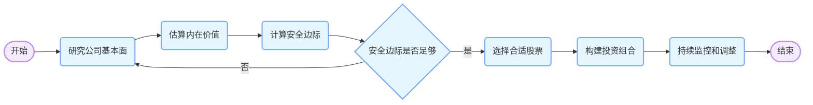

# 格雷厄姆的保守投资者策略

> 关键词：格雷厄姆、保守投资者策略、价值投资、安全边际、财务分析、股票估值、投资组合

> 摘要：本文章深入探讨了格雷厄姆的保守投资者策略，旨在为投资者提供一套稳健且具有可操作性的投资方法。通过介绍格雷厄姆策略的背景、核心概念、算法原理、数学模型等内容，详细阐述了该策略的理论基础。同时，结合项目实战案例，展示了如何在实际投资中运用这一策略。此外，还介绍了该策略的实际应用场景、相关工具和资源，并对其未来发展趋势与挑战进行了总结。希望读者通过本文能深入理解格雷厄姆保守投资者策略的精髓，提升自身的投资能力和决策水平。

## 1. 背景介绍 
### 1.1 目的和范围
格雷厄姆作为价值投资理论的奠基人，他的保守投资者策略在投资领域具有深远的影响。本文章的目的在于全面、深入地解析格雷厄姆的保守投资者策略，使投资者能够系统地了解该策略的原理、方法和应用。文章的范围涵盖了格雷厄姆策略的各个方面，包括核心概念、算法原理、数学模型、实际应用案例等，旨在为投资者提供一个全面的知识体系，帮助他们在投资实践中更好地运用这一策略。

### 1.2 预期读者
本文预期读者主要包括对投资领域感兴趣的初学者、有一定投资经验但希望进一步提升投资水平的投资者、金融专业的学生以及从事金融研究和投资分析的专业人士。无论你是刚刚接触投资领域，还是已经有了一定的投资实践，都能从本文中获取有价值的信息和启示。

### 1.3 文档结构概述
本文将按照以下结构展开：首先介绍格雷厄姆保守投资者策略的背景信息，包括目的、预期读者和文档结构概述等；接着阐述该策略的核心概念与联系，通过文本示意图和 Mermaid 流程图进行直观展示；然后详细讲解核心算法原理和具体操作步骤，并使用 Python 源代码进行阐述；再介绍相关的数学模型和公式，并举例说明；之后通过项目实战案例，展示该策略在实际投资中的应用；接着探讨该策略的实际应用场景；随后推荐相关的工具和资源；最后总结该策略的未来发展趋势与挑战，并提供常见问题与解答以及扩展阅读和参考资料。

### 1.4 术语表
#### 1.4.1 核心术语定义
- **价值投资**：一种基于公司内在价值进行投资的策略，投资者通过分析公司的财务状况、经营业绩等因素，寻找被市场低估的股票进行投资。
- **安全边际**：指股票的内在价值与市场价格之间的差距，安全边际越大，投资风险越低。
- **内在价值**：公司在未来所能产生的现金流量的现值，是评估公司真实价值的重要指标。
- **市盈率（P/E）**：股票价格与每股收益的比率，反映了市场对公司盈利能力的预期。
- **市净率（P/B）**：股票价格与每股净资产的比率，衡量了股票的估值水平。

#### 1.4.2 相关概念解释
- **财务分析**：对公司的财务报表进行分析，包括资产负债表、利润表和现金流量表等，以评估公司的财务状况和经营业绩。
- **股票估值**：通过各种方法对股票的内在价值进行评估，确定股票的合理价格。
- **投资组合**：投资者将资金分散投资于不同的股票、债券等资产，以降低投资风险。

#### 1.4.3 缩略词列表
- **P/E**：市盈率（Price-to-Earnings Ratio）
- **P/B**：市净率（Price-to-Book Ratio）

## 2. 核心概念与联系 

### 核心概念原理
格雷厄姆的保守投资者策略基于价值投资的理念，强调投资者应该关注公司的内在价值，而不是市场的短期波动。该策略的核心概念包括安全边际、内在价值、财务分析等。

- **安全边际**：安全边际是格雷厄姆保守投资者策略的核心原则之一。格雷厄姆认为，投资者在购买股票时，应该以低于股票内在价值的价格买入，以确保在市场出现不利变化时，投资者的本金能够得到保障。安全边际的存在可以降低投资风险，提高投资的成功率。
- **内在价值**：内在价值是公司在未来所能产生的现金流量的现值。格雷厄姆认为，公司的内在价值是由其资产、盈利能力、股息政策等因素决定的。投资者可以通过对公司的财务报表进行分析，以及对公司的未来发展前景进行评估，来估算公司的内在价值。
- **财务分析**：财务分析是评估公司内在价值的重要手段。投资者可以通过对公司的资产负债表、利润表和现金流量表等财务报表进行分析，了解公司的财务状况、经营业绩和现金流量情况。财务分析可以帮助投资者发现公司的潜在风险和投资机会。

### 架构的文本示意图
```plaintext
格雷厄姆保守投资者策略
|-- 核心原则
|   |-- 安全边际
|   |-- 内在价值
|-- 分析方法
|   |-- 财务分析
|   |   |-- 资产负债表分析
|   |   |-- 利润表分析
|   |   |-- 现金流量表分析
|   |-- 股票估值
|       |-- 市盈率法
|       |-- 市净率法
|-- 投资组合
|   |-- 分散投资
|   |-- 风险控制
```

### Mermaid 流程图


## 3. 核心算法原理 & 具体操作步骤 

### 核心算法原理
格雷厄姆的保守投资者策略主要涉及到股票估值和安全边际的计算。下面我们将详细介绍这些算法的原理。

- **市盈率法估值**：市盈率法是一种常用的股票估值方法，其基本原理是通过比较公司的市盈率与行业平均市盈率，来判断股票的估值水平。计算公式为：
    - 股票价值 = 每股收益 × 合理市盈率
    - 合理市盈率可以参考行业平均市盈率或公司的历史市盈率。

- **市净率法估值**：市净率法是另一种常用的股票估值方法，其基本原理是通过比较公司的市净率与行业平均市净率，来判断股票的估值水平。计算公式为：
    - 股票价值 = 每股净资产 × 合理市净率
    - 合理市净率可以参考行业平均市净率或公司的历史市净率。

- **安全边际计算**：安全边际是股票的内在价值与市场价格之间的差距，计算公式为：
    - 安全边际 = （内在价值 - 市场价格） / 内在价值 × 100%

### 具体操作步骤
1. **研究公司基本面**：投资者首先需要对公司的业务模式、竞争优势、行业地位等基本面情况进行研究，了解公司的经营状况和发展前景。
2. **收集财务数据**：收集公司的财务报表，包括资产负债表、利润表和现金流量表等，以便进行财务分析。
3. **进行财务分析**：对公司的财务报表进行分析，计算各项财务指标，如市盈率、市净率、净资产收益率等，评估公司的财务状况和经营业绩。
4. **估算内在价值**：根据公司的财务数据和行业情况，选择合适的估值方法，估算公司的内在价值。
5. **计算安全边际**：将估算的内在价值与市场价格进行比较，计算安全边际。
6. **筛选股票**：选择安全边际足够大的股票进行投资。
7. **构建投资组合**：将筛选出的股票按照一定的比例构建投资组合，以分散投资风险。
8. **持续监控和调整**：定期对投资组合进行监控和调整，根据公司的基本面变化和市场情况，及时调整投资组合。

### Python 源代码示例
```python
import pandas as pd

# 定义计算市盈率法估值的函数
def pe_valuation(eps, pe_ratio):
    """
    计算市盈率法估值
    :param eps: 每股收益
    :param pe_ratio: 合理市盈率
    :return: 股票价值
    """
    return eps * pe_ratio

# 定义计算市净率法估值的函数
def pb_valuation(bvps, pb_ratio):
    """
    计算市净率法估值
    :param bvps: 每股净资产
    :param pb_ratio: 合理市净率
    :return: 股票价值
    """
    return bvps * pb_ratio

# 定义计算安全边际的函数
def safety_margin(intrinsic_value, market_price):
    """
    计算安全边际
    :param intrinsic_value: 内在价值
    :param market_price: 市场价格
    :return: 安全边际
    """
    return (intrinsic_value - market_price) / intrinsic_value * 100

# 示例数据
data = {
    '股票代码': ['000001', '000002'],
    '每股收益': [2.0, 1.5],
    '每股净资产': [10.0, 8.0],
    '合理市盈率': [15, 12],
    '合理市净率': [2, 1.5],
    '市场价格': [25, 18]
}

df = pd.DataFrame(data)

# 计算市盈率法估值
df['市盈率法估值'] = df.apply(lambda row: pe_valuation(row['每股收益'], row['合理市盈率']), axis=1)

# 计算市净率法估值
df['市净率法估值'] = df.apply(lambda row: pb_valuation(row['每股净资产'], row['合理市净率']), axis=1)

# 计算平均内在价值
df['内在价值'] = (df['市盈率法估值'] + df['市净率法估值']) / 2

# 计算安全边际
df['安全边际'] = df.apply(lambda row: safety_margin(row['内在价值'], row['市场价格']), axis=1)

print(df)
```

## 4. 数学模型和公式 & 详细讲解 & 举例说明 

### 市盈率法估值公式
市盈率法估值公式为：
$$V_{pe} = EPS \times PE_{r}$$
其中，$V_{pe}$ 表示股票的市盈率法估值，$EPS$ 表示每股收益，$PE_{r}$ 表示合理市盈率。

#### 详细讲解
市盈率法估值的基本原理是，投资者愿意为公司的每股收益支付一定的倍数。合理市盈率可以参考行业平均市盈率或公司的历史市盈率。如果公司的市盈率低于合理市盈率，则说明股票可能被低估；反之，则说明股票可能被高估。

#### 举例说明
假设某公司的每股收益为 2 元，行业平均市盈率为 15，则该公司的市盈率法估值为：
$$V_{pe} = 2 \times 15 = 30 \text{（元）}$$
如果该公司的市场价格为 25 元，则说明股票可能被低估。

### 市净率法估值公式
市净率法估值公式为：
$$V_{pb} = BVPS \times PB_{r}$$
其中，$V_{pb}$ 表示股票的市净率法估值，$BVPS$ 表示每股净资产，$PB_{r}$ 表示合理市净率。

#### 详细讲解
市净率法估值的基本原理是，投资者愿意为公司的每股净资产支付一定的倍数。合理市净率可以参考行业平均市净率或公司的历史市净率。如果公司的市净率低于合理市净率，则说明股票可能被低估；反之，则说明股票可能被高估。

#### 举例说明
假设某公司的每股净资产为 10 元，行业平均市净率为 2，则该公司的市净率法估值为：
$$V_{pb} = 10 \times 2 = 20 \text{（元）}$$
如果该公司的市场价格为 18 元，则说明股票可能被低估。

### 安全边际计算公式
安全边际计算公式为：
$$SM = \frac{V - P}{V} \times 100\%$$
其中，$SM$ 表示安全边际，$V$ 表示内在价值，$P$ 表示市场价格。

#### 详细讲解
安全边际反映了股票的内在价值与市场价格之间的差距。安全边际越大，说明股票的投资风险越低；反之，则说明股票的投资风险越高。

#### 举例说明
假设某公司的内在价值为 30 元，市场价格为 25 元，则该股票的安全边际为：
$$SM = \frac{30 - 25}{30} \times 100\% \approx 16.67\%$$
这意味着，即使公司的内在价值下降 16.67%，投资者的本金仍然能够得到保障。

## 5. 项目实战：代码实际案例和详细解释说明 

### 5.1  开发环境搭建
- **Python 环境**：建议使用 Python 3.7 及以上版本。可以从 Python 官方网站（https://www.python.org/downloads/） 下载并安装。
- **开发工具**：推荐使用 PyCharm 或 Jupyter Notebook 作为开发工具。
- **第三方库**：需要安装 pandas 库，用于数据处理和分析。可以使用以下命令进行安装：
```sh
pip install pandas
```

### 5.2  源代码详细实现和代码解读
```python
import pandas as pd

# 定义计算市盈率法估值的函数
def pe_valuation(eps, pe_ratio):
    """
    计算市盈率法估值
    :param eps: 每股收益
    :param pe_ratio: 合理市盈率
    :return: 股票价值
    """
    return eps * pe_ratio

# 定义计算市净率法估值的函数
def pb_valuation(bvps, pb_ratio):
    """
    计算市净率法估值
    :param bvps: 每股净资产
    :param pb_ratio: 合理市净率
    :return: 股票价值
    """
    return bvps * pb_ratio

# 定义计算安全边际的函数
def safety_margin(intrinsic_value, market_price):
    """
    计算安全边际
    :param intrinsic_value: 内在价值
    :param market_price: 市场价格
    :return: 安全边际
    """
    return (intrinsic_value - market_price) / intrinsic_value * 100

# 示例数据
data = {
    '股票代码': ['000001', '000002'],
    '每股收益': [2.0, 1.5],
    '每股净资产': [10.0, 8.0],
    '合理市盈率': [15, 12],
    '合理市净率': [2, 1.5],
    '市场价格': [25, 18]
}

df = pd.DataFrame(data)

# 计算市盈率法估值
df['市盈率法估值'] = df.apply(lambda row: pe_valuation(row['每股收益'], row['合理市盈率']), axis=1)

# 计算市净率法估值
df['市净率法估值'] = df.apply(lambda row: pb_valuation(row['每股净资产'], row['合理市净率']), axis=1)

# 计算平均内在价值
df['内在价值'] = (df['市盈率法估值'] + df['市净率法估值']) / 2

# 计算安全边际
df['安全边际'] = df.apply(lambda row: safety_margin(row['内在价值'], row['市场价格']), axis=1)

print(df)
```

#### 代码解读
1. **导入库**：导入 pandas 库，用于数据处理和分析。
2. **定义函数**：定义了三个函数，分别用于计算市盈率法估值、市净率法估值和安全边际。
3. **准备数据**：创建一个包含股票信息的字典，并将其转换为 pandas 数据框。
4. **计算估值**：使用 `apply` 方法对数据框的每一行应用定义的函数，计算市盈率法估值、市净率法估值和平均内在价值。
5. **计算安全边际**：使用 `apply` 方法对数据框的每一行应用定义的函数，计算安全边际。
6. **输出结果**：打印包含所有计算结果的数据框。

### 5.3  代码解读与分析
通过上述代码，我们可以实现对股票的估值和安全边际的计算。代码的核心在于使用 pandas 库进行数据处理和分析，通过定义函数来实现具体的计算逻辑。这种实现方式具有以下优点：
- **模块化**：将不同的计算逻辑封装在不同的函数中，提高了代码的可维护性和可扩展性。
- **数据处理能力**：pandas 库提供了强大的数据处理和分析功能，使得数据的处理和计算更加方便和高效。
- **可视化**：可以将计算结果保存为 CSV 文件或进行可视化处理，方便进一步的分析和决策。

## 6. 实际应用场景 
格雷厄姆的保守投资者策略适用于以下实际应用场景：

### 个人投资者
对于个人投资者来说，格雷厄姆的保守投资者策略提供了一种稳健的投资方法。个人投资者可以通过学习和运用该策略，对股票进行估值和筛选，选择安全边际足够大的股票进行投资，降低投资风险。同时，该策略强调长期投资和分散投资，有助于个人投资者实现资产的稳健增值。

### 机构投资者
机构投资者如基金公司、保险公司等，也可以运用格雷厄姆的保守投资者策略进行投资决策。机构投资者通常拥有更丰富的资源和专业的研究团队，可以对公司的基本面进行更深入的研究和分析。通过运用该策略，机构投资者可以筛选出具有投资价值的股票，构建合理的投资组合，提高投资收益。

### 金融分析师
金融分析师可以运用格雷厄姆的保守投资者策略对公司进行估值和分析，为投资者提供投资建议。金融分析师可以通过对公司的财务报表进行分析，估算公司的内在价值和安全边际，评估公司的投资价值。同时，金融分析师还可以根据市场情况和公司的基本面变化，及时调整投资建议。

## 7. 工具和资源推荐
### 7.1 学习资源推荐
#### 7.1.1 书籍推荐
- 《聪明的投资者》（The Intelligent Investor）：格雷厄姆的经典著作，详细阐述了价值投资的理念和方法，是学习格雷厄姆保守投资者策略的必读之书。
- 《证券分析》（Security Analysis）：格雷厄姆和多德合著的另一部经典著作，对证券分析的理论和方法进行了系统的阐述，是价值投资领域的权威著作。
- 《巴菲特致股东的信》（Letters to Shareholders）：巴菲特每年写给股东的信，包含了他的投资理念、策略和经验，对理解格雷厄姆的保守投资者策略具有重要的参考价值。

#### 7.1.2 在线课程
- Coursera 上的“投资学原理”（Principles of Investing）课程：该课程由知名教授授课，系统地介绍了投资学的基本原理和方法，包括价值投资、资产定价等内容。
- edX 上的“金融市场”（Financial Markets）课程：该课程由耶鲁大学教授罗伯特·席勒（Robert Shiller）授课，深入探讨了金融市场的运行机制和投资策略。

#### 7.1.3 技术博客和网站
- 雪球网（https://xueqiu.com/）：国内知名的投资社区，提供股票、基金等投资产品的资讯、分析和交流平台。
- 价值投资网（https://www.value-investing.net/）：专注于价值投资领域的网站，提供价值投资的理论、案例和研究报告等内容。

### 7.2 开发工具框架推荐
#### 7.2.1 IDE和编辑器
- PyCharm：一款专业的 Python 集成开发环境，提供代码编辑、调试、版本控制等功能，适合开发 Python 程序。
- Jupyter Notebook：一种交互式的开发环境，支持多种编程语言，适合进行数据探索、分析和可视化。

#### 7.2.2 调试和性能分析工具
- PyCharm 调试器：PyCharm 自带的调试工具，可以帮助开发者快速定位和解决代码中的问题。
- cProfile：Python 内置的性能分析工具，可以帮助开发者分析代码的性能瓶颈。

#### 7.2.3 相关框架和库
- pandas：Python 中用于数据处理和分析的库，提供了高效的数据结构和数据操作方法。
- numpy：Python 中用于科学计算的库，提供了高效的数组操作和数学函数。

### 7.3 相关论文著作推荐
#### 7.3.1 经典论文
- Graham, Benjamin, and David L. Dodd. "Security Analysis." McGraw-Hill, 1934. 该论文是价值投资领域的经典之作，对证券分析的理论和方法进行了系统的阐述。
- Graham, Benjamin. "The Intelligent Investor." Harper Business, 1949. 该论文详细阐述了价值投资的理念和方法，是学习格雷厄姆保守投资者策略的重要文献。

#### 7.3.2 最新研究成果
- Fama, Eugene F., and Kenneth R. French. "Common risk factors in the returns on stocks and bonds." Journal of Financial Economics 33.1 (1993): 3-56. 该论文提出了著名的 Fama-French 三因子模型，对资产定价理论的发展产生了重要影响。
- Asness, Clifford S., et al. "Value and momentum everywhere." The Journal of Finance 68.3 (2013): 929-985. 该论文研究了价值和动量投资策略在全球市场的有效性，为投资者提供了新的投资思路。

#### 7.3.3 应用案例分析
- Buffett, Warren E. "The Superinvestors of Graham-and-Doddsville." Hermes 17 (1984). 该案例分析了格雷厄姆的学生们的投资业绩，证明了价值投资策略的有效性。
- Greenblatt, Joel. "The Little Book That Beats the Market." John Wiley & Sons, 2005. 该案例介绍了一种简单有效的投资策略，即“神奇公式”，对格雷厄姆的保守投资者策略进行了拓展和应用。

## 8. 总结：未来发展趋势与挑战
### 未来发展趋势
- **与科技融合**：随着科技的不断发展，格雷厄姆的保守投资者策略将与大数据、人工智能等技术相结合。通过大数据分析，可以获取更全面、准确的公司信息，提高估值的准确性；利用人工智能算法，可以对海量数据进行快速处理和分析，挖掘潜在的投资机会。
- **全球投资视野**：随着全球经济一体化的发展，投资者的投资视野将更加全球化。格雷厄姆的保守投资者策略将被应用于全球市场，投资者可以在全球范围内寻找被低估的股票，构建更加多元化的投资组合。
- **社会责任投资**：越来越多的投资者开始关注企业的社会责任，将社会责任纳入投资决策的考虑因素。格雷厄姆的保守投资者策略可能会与社会责任投资相结合，投资者在追求投资回报的同时，也会关注企业的社会和环境影响。

### 挑战
- **市场环境变化**：市场环境是不断变化的，新的经济形势、政策法规、行业竞争等因素都会对股票市场产生影响。格雷厄姆的保守投资者策略是基于历史数据和经验总结出来的，在面对新的市场环境时，可能需要进行调整和改进。
- **信息不对称**：在股票市场中，信息不对称是一个普遍存在的问题。一些公司可能会隐瞒或虚报财务信息，投资者很难获取到准确、全面的信息。这会增加投资者的决策难度，影响格雷厄姆保守投资者策略的实施效果。
- **量化投资竞争**：随着量化投资的发展，越来越多的投资者开始使用量化模型和算法进行投资决策。量化投资具有高效、准确的特点，对传统的价值投资策略构成了一定的挑战。格雷厄姆的保守投资者策略需要不断创新和改进，以适应量化投资的竞争。

## 9. 附录：常见问题与解答
### 问题 1：格雷厄姆的保守投资者策略适用于所有类型的股票吗？
解答：不是的。格雷厄姆的保守投资者策略更适用于具有稳定业绩、财务状况良好的蓝筹股。对于一些新兴行业的成长股，由于其业绩波动较大，未来发展前景不确定，该策略可能不太适用。

### 问题 2：如何确定合理的市盈率和市净率？
解答：合理的市盈率和市净率可以参考行业平均水平、公司的历史数据以及市场环境等因素。一般来说，可以通过分析同行业其他公司的市盈率和市净率，以及公司过去几年的市盈率和市净率变化情况，来确定一个合理的范围。

### 问题 3：安全边际多大才合适？
解答：安全边际的大小没有一个固定的标准，一般来说，安全边际越大，投资风险越低。格雷厄姆建议安全边际至少在 20% - 30% 以上，但具体的安全边际大小还需要根据投资者的风险偏好、市场环境等因素来确定。

### 问题 4：如何进行投资组合的调整？
解答：投资组合的调整需要根据公司的基本面变化、市场情况以及投资者的投资目标等因素来进行。当公司的基本面发生变化，如业绩下滑、财务状况恶化等，或者市场情况发生变化，如市场趋势反转、行业竞争加剧等，投资者需要及时调整投资组合。同时，投资者也可以根据自己的投资目标和风险偏好，定期对投资组合进行调整。

## 10. 扩展阅读 & 参考资料
### 扩展阅读
- 《漫步华尔街》（A Random Walk Down Wall Street）：本书介绍了各种投资理论和策略，对投资者了解市场和投资决策具有重要的参考价值。
- 《金融炼金术》（The Alchemy of Finance）：乔治·索罗斯的著作，阐述了他的投资哲学和交易策略，对投资者的思维方式和投资理念具有启发作用。

### 参考资料
- Graham, Benjamin. "The Intelligent Investor." Harper Business, 1949.
- Graham, Benjamin, and David L. Dodd. "Security Analysis." McGraw-Hill, 1934.
- Buffett, Warren E. "The Superinvestors of Graham-and-Doddsville." Hermes 17 (1984).
- Fama, Eugene F., and Kenneth R. French. "Common risk factors in the returns on stocks and bonds." Journal of Financial Economics 33.1 (1993): 3-56.
- Asness, Clifford S., et al. "Value and momentum everywhere." The Journal of Finance 68.3 (2013): 929-985.