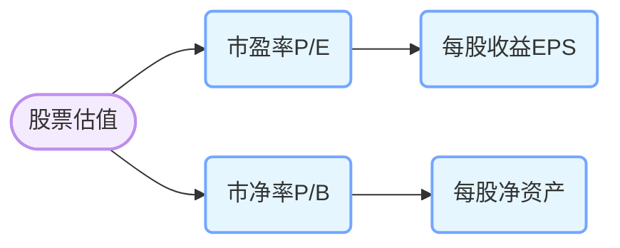

# 格雷厄姆的市盈率和市净率使用指南

> 关键词：格雷厄姆、市盈率、市净率、价值投资、股票估值、财务分析、投资策略

> 摘要：本文围绕格雷厄姆的市盈率和市净率展开，深入探讨这两个重要指标的原理、计算方法及在投资领域的应用。通过对核心概念的解析、算法原理的阐述、数学模型的讲解、项目实战案例的分析，帮助读者全面理解和掌握如何运用市盈率和市净率进行股票估值和投资决策。同时，介绍了相关的实际应用场景、学习资源、开发工具等内容，并对未来发展趋势与挑战进行总结，旨在为投资者提供一套系统、实用的格雷厄姆市盈率和市净率使用指南。

## 1. 背景介绍 
### 1.1 目的和范围
本指南的目的在于详细介绍格雷厄姆的市盈率（P/E）和市净率（P/B）这两个重要的投资分析指标。范围涵盖了这两个指标的基本概念、计算方法、在投资决策中的应用，以及通过实际案例展示如何运用这些指标进行股票估值和筛选。旨在帮助投资者，尤其是价值投资者，更好地理解和运用这两个指标，提高投资决策的准确性和成功率。

### 1.2 预期读者
本文预期读者包括对价值投资感兴趣的个人投资者、金融专业学生、金融从业者以及希望深入了解股票估值方法的相关人士。无论您是投资新手还是有一定经验的投资者，都能从本文中获取关于市盈率和市净率的深入知识和实用的投资分析技巧。

### 1.3 文档结构概述
本文将按照以下结构展开：首先介绍背景信息，包括目的、预期读者和文档结构概述等；接着阐述核心概念与联系，包括市盈率和市净率的原理和架构；然后详细讲解核心算法原理和具体操作步骤，通过Python源代码进行说明；再介绍相关的数学模型和公式，并举例说明；之后通过项目实战展示代码实际案例和详细解释；接着探讨实际应用场景；随后推荐相关的工具和资源；最后进行总结，分析未来发展趋势与挑战，并提供常见问题与解答以及扩展阅读和参考资料。

### 1.4 术语表
#### 1.4.1 核心术语定义
- **市盈率（P/E）**：是指股票价格除以每股收益（EPS）的比率。它反映了投资者为获取公司每一元盈利所愿意支付的价格，是衡量股票估值的重要指标之一。
- **市净率（P/B）**：是指股票价格与每股净资产的比率。它体现了市场对公司净资产的估值水平，可用于判断股票的相对价值。
- **每股收益（EPS）**：是指公司净利润与发行在外普通股股数的比值，反映了每股股票的盈利水平。
- **每股净资产**：是指股东权益与总股数的比率，反映了每股股票所拥有的净资产价值。

#### 1.4.2 相关概念解释
- **价值投资**：是一种投资策略，强调通过分析公司的基本面，寻找被低估的股票，以合理的价格买入并长期持有，从而获得投资回报。
- **股票估值**：是指对股票的内在价值进行评估，以确定股票是否被高估或低估，为投资决策提供依据。

#### 1.4.3 缩略词列表
- **P/E**：市盈率（Price-to-Earnings Ratio）
- **P/B**：市净率（Price-to-Book Ratio）
- **EPS**：每股收益（Earnings Per Share）

## 2. 核心概念与联系 

### 2.1 市盈率（P/E）原理
市盈率是衡量股票估值的常用指标，其基本原理是通过比较股票价格与每股收益，来判断投资者为获取公司盈利所支付的成本。较高的市盈率可能表示市场对公司未来盈利增长有较高的预期，或者股票被高估；较低的市盈率则可能表示股票被低估或者公司面临一定的风险。

#### 市盈率的分类
- **静态市盈率**：使用过去一年的每股收益计算，反映的是公司过去的盈利情况。
- **动态市盈率**：考虑了公司未来的盈利预测，使用预测的每股收益计算，更能反映公司的未来发展潜力。
- **滚动市盈率**：使用最近四个季度的每股收益计算，综合了过去和近期的盈利情况。

### 2.2 市净率（P/B）原理
市净率反映了市场对公司净资产的估值水平。其原理是将股票价格与每股净资产进行比较，市净率较低可能表示股票被低估，具有一定的投资价值；市净率较高则可能表示市场对公司的预期较高，或者股票存在高估的风险。

### 2.3 市盈率和市净率的联系
市盈率和市净率都是评估股票价值的重要指标，它们之间存在一定的联系。一般来说，市盈率和市净率较高的股票，可能被市场认为具有较高的成长性和盈利能力；而市盈率和市净率较低的股票，可能被市场认为存在一定的风险或者增长潜力有限。同时，市盈率和市净率也可以相互验证，当市盈率和市净率都较低时，股票被低估的可能性较大；当市盈率和市净率都较高时，股票被高估的可能性较大。

### 2.4 核心概念架构的文本示意图
```plaintext
            股票估值
               |
        ---------------
       |               |
    市盈率（P/E）    市净率（P/B）
       |               |
    每股收益（EPS）  每股净资产
```

### 2.5 Mermaid流程图


## 3. 核心算法原理 & 具体操作步骤 

### 3.1 市盈率（P/E）算法原理及Python实现
#### 算法原理
市盈率的计算公式为：
\[ P/E = \frac{股票价格}{每股收益（EPS）} \]

#### Python代码实现
```python
def calculate_pe(stock_price, eps):
    """
    计算市盈率
    :param stock_price: 股票价格
    :param eps: 每股收益
    :return: 市盈率
    """
    if eps == 0:
        return None  # 避免除零错误
    return stock_price / eps

# 示例数据
stock_price = 50
eps = 2

# 计算市盈率
pe = calculate_pe(stock_price, eps)
print(f"市盈率: {pe}")
```

### 3.2 市净率（P/B）算法原理及Python实现
#### 算法原理
市净率的计算公式为：
\[ P/B = \frac{股票价格}{每股净资产} \]

#### Python代码实现
```python
def calculate_pb(stock_price, book_value_per_share):
    """
    计算市净率
    :param stock_price: 股票价格
    :param book_value_per_share: 每股净资产
    :return: 市净率
    """
    if book_value_per_share == 0:
        return None  # 避免除零错误
    return stock_price / book_value_per_share

# 示例数据
stock_price = 50
book_value_per_share = 10

# 计算市净率
pb = calculate_pb(stock_price, book_value_per_share)
print(f"市净率: {pb}")
```

### 3.3 具体操作步骤
1. **获取数据**：通过金融数据提供商、公司财务报表等渠道获取股票价格、每股收益和每股净资产等数据。
2. **数据处理**：对获取的数据进行清洗和整理，确保数据的准确性和完整性。
3. **计算指标**：使用上述Python代码计算市盈率和市净率。
4. **分析结果**：根据计算结果，结合行业平均水平、公司历史数据等进行分析，判断股票的估值水平。

## 4. 数学模型和公式 & 详细讲解 & 举例说明 

### 4.1 市盈率（P/E）数学模型和公式
#### 基本公式
\[ P/E = \frac{P}{EPS} \]
其中，$P$ 表示股票价格，$EPS$ 表示每股收益。

#### 详细讲解
市盈率反映了投资者为获取公司每一元盈利所愿意支付的价格。例如，如果一只股票的价格为 $50$ 元，每股收益为 $2$ 元，则该股票的市盈率为：
\[ P/E = \frac{50}{2} = 25 \]
这意味着投资者为获取该公司每一元盈利愿意支付 $25$ 元。一般来说，市盈率较高的股票，市场对其未来盈利增长的预期较高；市盈率较低的股票，可能被市场认为存在一定的风险或者增长潜力有限。

### 4.2 市净率（P/B）数学模型和公式
#### 基本公式
\[ P/B = \frac{P}{BVPS} \]
其中，$P$ 表示股票价格，$BVPS$ 表示每股净资产。

#### 详细讲解
市净率体现了市场对公司净资产的估值水平。例如，如果一只股票的价格为 $50$ 元，每股净资产为 $10$ 元，则该股票的市净率为：
\[ P/B = \frac{50}{10} = 5 \]
这意味着市场对该公司净资产的估值是其账面价值的 $5$ 倍。一般来说，市净率较低的股票，可能被低估，具有一定的投资价值；市净率较高的股票，可能被高估，存在一定的风险。

### 4.3 举例说明
假设我们要分析两家公司 A 和 B 的股票估值情况。相关数据如下：

| 公司 | 股票价格（元） | 每股收益（元） | 每股净资产（元） |
| ---- | -------------- | -------------- | ---------------- |
| A    | 30             | 2              | 10               |
| B    | 60             | 3              | 15               |

#### 计算市盈率
- 公司 A 的市盈率：
\[ P/E_A = \frac{30}{2} = 15 \]
- 公司 B 的市盈率：
\[ P/E_B = \frac{60}{3} = 20 \]

#### 计算市净率
- 公司 A 的市净率：
\[ P/B_A = \frac{30}{10} = 3 \]
- 公司 B 的市净率：
\[ P/B_B = \frac{60}{15} = 4 \]

#### 分析结果
从市盈率来看，公司 A 的市盈率较低，可能表示其股票相对被低估；公司 B 的市盈率较高，可能表示市场对其未来盈利增长的预期较高。从市净率来看，公司 A 的市净率也较低，可能具有一定的投资价值；公司 B 的市净率较高，可能存在一定的高估风险。综合考虑，投资者可以进一步分析两家公司的基本面、行业前景等因素，做出更合理的投资决策。

## 5. 项目实战：代码实际案例和详细解释说明 

### 5.1  开发环境搭建
#### 安装Python
首先，需要安装Python编程语言。可以从Python官方网站（https://www.python.org/downloads/）下载适合自己操作系统的Python安装包，并按照安装向导进行安装。

#### 安装必要的库
在本项目中，我们需要使用 `pandas` 库来处理数据，`yfinance` 库来获取股票数据。可以使用以下命令进行安装：
```sh
pip install pandas yfinance
```

### 5.2  源代码详细实现和代码解读
```python
import yfinance as yf
import pandas as pd

def get_stock_data(ticker, start_date, end_date):
    """
    获取股票数据
    :param ticker: 股票代码
    :param start_date: 开始日期
    :param end_date: 结束日期
    :return: 股票数据
    """
    data = yf.download(ticker, start=start_date, end=end_date)
    return data

def get_financial_data(ticker):
    """
    获取公司财务数据
    :param ticker: 股票代码
    :return: 财务数据
    """
    stock = yf.Ticker(ticker)
    financials = stock.financials
    balance_sheet = stock.balance_sheet
    return financials, balance_sheet

def calculate_eps(financials):
    """
    计算每股收益
    :param financials: 财务数据
    :return: 每股收益
    """
    net_income = financials.loc['Net Income'].values[0]
    shares_outstanding = financials.loc['Basic Average Shares'].values[0]
    eps = net_income / shares_outstanding
    return eps

def calculate_book_value_per_share(balance_sheet):
    """
    计算每股净资产
    :param balance_sheet: 资产负债表数据
    :return: 每股净资产
    """
    total_equity = balance_sheet.loc['Total Stockholder Equity'].values[0]
    shares_outstanding = balance_sheet.loc['Common Stock'].values[0]
    book_value_per_share = total_equity / shares_outstanding
    return book_value_per_share

def calculate_pe_pb(ticker, start_date, end_date):
    """
    计算市盈率和市净率
    :param ticker: 股票代码
    :param start_date: 开始日期
    :param end_date: 结束日期
    :return: 市盈率和市净率
    """
    # 获取股票数据
    stock_data = get_stock_data(ticker, start_date, end_date)
    latest_stock_price = stock_data['Close'].iloc[-1]

    # 获取财务数据
    financials, balance_sheet = get_financial_data(ticker)

    # 计算每股收益和每股净资产
    eps = calculate_eps(financials)
    book_value_per_share = calculate_book_value_per_share(balance_sheet)

    # 计算市盈率和市净率
    if eps == 0 or book_value_per_share == 0:
        return None, None
    pe = latest_stock_price / eps
    pb = latest_stock_price / book_value_per_share

    return pe, pb

# 示例数据
ticker = 'AAPL'
start_date = '2023-01-01'
end_date = '2023-12-31'

# 计算市盈率和市净率
pe, pb = calculate_pe_pb(ticker, start_date, end_date)
print(f"市盈率: {pe}")
print(f"市净率: {pb}")
```

### 5.3  代码解读与分析
- **`get_stock_data` 函数**：使用 `yfinance` 库下载指定股票在指定日期范围内的股票数据。
- **`get_financial_data` 函数**：使用 `yfinance` 库获取指定股票的财务数据和资产负债表数据。
- **`calculate_eps` 函数**：根据财务数据计算每股收益。
- **`calculate_book_value_per_share` 函数**：根据资产负债表数据计算每股净资产。
- **`calculate_pe_pb` 函数**：综合上述函数，计算指定股票的市盈率和市净率。

通过这个项目实战，我们可以自动化地获取股票数据和财务数据，并计算出市盈率和市净率，为投资决策提供参考。

## 6. 实际应用场景 
### 6.1 股票筛选
投资者可以使用市盈率和市净率作为筛选股票的指标。例如，设定市盈率和市净率的阈值，筛选出市盈率和市净率较低的股票，这些股票可能被低估，具有一定的投资价值。

### 6.2 行业比较
通过比较不同行业的市盈率和市净率水平，可以了解不同行业的估值差异。一般来说，新兴行业的市盈率和市净率可能较高，而传统行业的市盈率和市净率可能较低。投资者可以根据行业的估值情况，选择具有投资潜力的行业。

### 6.3 公司估值
市盈率和市净率可以用于对公司进行估值。通过与同行业其他公司的市盈率和市净率进行比较，或者与公司历史的市盈率和市净率进行比较，可以判断公司的估值是否合理。

### 6.4 投资组合管理
在构建投资组合时，投资者可以考虑股票的市盈率和市净率水平，合理配置不同估值水平的股票，以降低投资组合的风险，提高投资组合的收益。

## 7. 工具和资源推荐
### 7.1 学习资源推荐
#### 7.1.1 书籍推荐
- 《聪明的投资者》（The Intelligent Investor）：本杰明·格雷厄姆（Benjamin Graham）的经典著作，详细介绍了价值投资的理念和方法，包括市盈率和市净率的应用。
- 《证券分析》（Security Analysis）：同样是本杰明·格雷厄姆的著作，是价值投资领域的权威书籍，对股票估值和分析有深入的阐述。
- 《财务报表分析与证券定价》（Financial Statement Analysis and Security Valuation）：提供了财务报表分析和股票估值的理论和方法，有助于深入理解市盈率和市净率等指标。

#### 7.1.2 在线课程
- Coursera上的“投资学原理”（Principles of Investing）课程：介绍了投资的基本原理和方法，包括股票估值和分析。
- edX上的“财务报表分析”（Financial Statement Analysis）课程：详细讲解了财务报表的分析方法，对理解市盈率和市净率的计算和应用有很大帮助。

#### 7.1.3 技术博客和网站
- 雪球网（https://xueqiu.com/）：提供股票行情、财务数据、投资分析等信息，有很多投资者分享的关于市盈率和市净率的分析文章。
- 东方财富网（https://www.eastmoney.com/）：是国内知名的金融信息网站，提供丰富的股票数据和分析工具，可用于查询和分析市盈率和市净率等指标。

### 7.2 开发工具框架推荐
#### 7.2.1 IDE和编辑器
- PyCharm：是一款专业的Python集成开发环境，具有强大的代码编辑、调试和项目管理功能，适合开发Python程序来计算和分析市盈率和市净率。
- Visual Studio Code：是一款轻量级的代码编辑器，支持多种编程语言，通过安装相关插件可以方便地进行Python开发。

#### 7.2.2 调试和性能分析工具
- `pdb`：是Python内置的调试器，可以帮助开发者在代码运行过程中进行调试，查找问题。
- `cProfile`：是Python的性能分析工具，可以分析代码的性能瓶颈，优化代码效率。

#### 7.2.3 相关框架和库
- `pandas`：是Python中用于数据处理和分析的强大库，可以方便地处理股票数据和财务数据。
- `yfinance`：是一个Python库，用于获取雅虎财经的股票数据和财务数据，简化了数据获取的过程。

### 7.3 相关论文著作推荐
#### 7.3.1 经典论文
- Fama, E. F., & French, K. R. (1992). The cross-section of expected stock returns. Journal of Finance, 47(2), 427-465. 该论文研究了股票预期回报的横截面特征，对市盈率和市净率等指标在投资分析中的应用有重要的理论贡献。
- Graham, B., & Dodd, D. L. (1934). Security Analysis. 本杰明·格雷厄姆和戴维·多德的经典著作，奠定了价值投资的理论基础，对市盈率和市净率等估值指标进行了深入探讨。

#### 7.3.2 最新研究成果
- 可以通过学术数据库如Web of Science、EBSCOhost等搜索关于市盈率和市净率的最新研究论文，了解该领域的最新研究动态和成果。

#### 7.3.3 应用案例分析
- 一些金融研究机构和投资公司会发布关于市盈率和市净率应用的案例分析报告，可以通过相关机构的官方网站或金融资讯平台获取这些报告，学习实际应用中的经验和方法。

## 8. 总结：未来发展趋势与挑战
### 8.1 未来发展趋势
- **数字化和智能化**：随着科技的发展，金融数据的获取和分析将更加数字化和智能化。投资者可以利用大数据、人工智能等技术，更快速、准确地计算和分析市盈率和市净率等指标，提高投资决策的效率和准确性。
- **跨市场和跨行业应用**：市盈率和市净率等估值指标的应用将不再局限于单一市场和行业，而是会在全球范围内和不同行业之间进行比较和分析。投资者可以通过跨市场和跨行业的比较，发现更多的投资机会。
- **与其他指标的结合**：未来，市盈率和市净率将与其他财务指标、非财务指标（如ESG指标）等结合使用，形成更加全面、综合的投资分析体系，为投资者提供更准确的投资建议。

### 8.2 挑战
- **数据质量和准确性**：市盈率和市净率的计算依赖于准确的股票价格、每股收益和每股净资产等数据。然而，金融数据的质量和准确性可能受到多种因素的影响，如财务报表造假、数据更新不及时等，这给投资者的分析和决策带来了挑战。
- **市场变化的不确定性**：股票市场是复杂多变的，市盈率和市净率等指标只能反映公司的历史和当前情况，无法准确预测未来市场的变化。投资者需要结合其他因素，如宏观经济环境、行业发展趋势等，综合判断投资风险。
- **行业差异的影响**：不同行业的市盈率和市净率水平存在较大差异，不能简单地进行跨行业比较。投资者需要了解不同行业的特点和估值逻辑，才能正确运用市盈率和市净率进行投资分析。

## 9. 附录：常见问题与解答
### 9.1 市盈率和市净率为负数是什么意思？
- **市盈率为负数**：当公司的净利润为负数时，每股收益也为负数，从而导致市盈率为负数。这通常表示公司处于亏损状态，投资者需要谨慎对待。
- **市净率为负数**：当公司的净资产为负数时，每股净资产也为负数，导致市净率为负数。这可能表示公司的负债超过了资产，面临较大的财务风险。

### 9.2 如何选择合适的市盈率和市净率参考标准？
- 可以参考同行业其他公司的市盈率和市净率水平，了解行业的平均估值情况。同时，也可以参考公司的历史市盈率和市净率数据，判断公司当前的估值是否合理。此外，还需要结合公司的基本面、行业前景等因素进行综合分析。

### 9.3 市盈率和市净率在不同市场环境下的有效性如何？
- 在稳定的市场环境下，市盈率和市净率等估值指标可以较好地反映股票的价值。但在市场波动较大、宏观经济环境变化剧烈的情况下，这些指标的有效性可能会受到影响。投资者需要结合其他因素，如市场情绪、政策变化等，进行综合判断。

## 10. 扩展阅读 & 参考资料
### 10.1 扩展阅读
- 《金融炼金术》（The Alchemy of Finance）：乔治·索罗斯（George Soros）的著作，探讨了金融市场的运行规律和投资哲学，对投资者的思维方式有很大的启发。
- 《漫步华尔街》（A Random Walk Down Wall Street）：伯顿·马尔基尔（Burton Malkiel）的著作，介绍了股票市场的随机性和投资策略，有助于投资者树立正确的投资观念。

### 10.2 参考资料
- 雅虎财经（https://finance.yahoo.com/）：提供丰富的股票数据和财务信息，是获取股票数据的重要来源之一。
- 巨潮资讯网（https://www.cninfo.com.cn/）：是中国上市公司信息披露的指定网站，可获取国内上市公司的财务报表和相关公告。