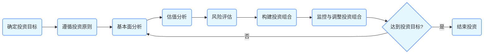

# 格雷厄姆的防御型投资：在地缘政治不确定性中的重要性

> 关键词：格雷厄姆、防御型投资、地缘政治不确定性、投资策略、风险管理、价值投资、资产配置

> 摘要：本文深入探讨了格雷厄姆的防御型投资策略在地缘政治不确定性环境中的重要性。首先介绍了防御型投资的背景知识，包括其目的、预期读者等内容。接着阐述了防御型投资的核心概念与联系，通过原理和架构的文本示意图以及 Mermaid 流程图进行清晰展示。详细讲解了核心算法原理和具体操作步骤，并结合数学模型和公式进行举例说明。通过项目实战给出代码实际案例及详细解释。分析了防御型投资在不同场景下的实际应用，推荐了相关的学习资源、开发工具框架以及论文著作。最后总结了防御型投资的未来发展趋势与挑战，解答常见问题并提供扩展阅读和参考资料，旨在帮助投资者在复杂的地缘政治环境中运用防御型投资策略实现资产的保值增值。

## 1. 背景介绍 
### 1.1 目的和范围
在当今全球化的时代，地缘政治的不确定性日益增加，这给金融市场带来了极大的波动和风险。格雷厄姆的防御型投资策略作为一种经典的投资理念，旨在帮助投资者在复杂多变的市场环境中保护资产、降低风险并实现长期稳定的回报。本文的目的在于深入剖析格雷厄姆防御型投资策略的核心原理、操作方法以及其在地缘政治不确定性中的重要意义和应用价值。范围涵盖了从理论基础到实际应用的各个方面，包括核心概念的阐述、算法原理的讲解、数学模型的分析、项目实战案例的展示以及实际应用场景的探讨等。

### 1.2 预期读者
本文预期读者主要包括金融投资领域的专业人士，如投资经理、基金分析师、金融顾问等，他们可以从本文中深入了解防御型投资策略的理论和实践，为其投资决策提供参考和依据。同时，也适合有一定投资经验的个人投资者，帮助他们在复杂的地缘政治环境中优化自己的投资组合，提高投资的安全性和收益性。此外，对于金融专业的学生和研究人员来说，本文可以作为学习和研究投资理论与实践的参考资料。

### 1.3 文档结构概述
本文将按照以下结构进行阐述：首先介绍防御型投资的背景知识，包括目的、预期读者、文档结构概述和术语表。接着深入探讨防御型投资的核心概念与联系，通过文本示意图和 Mermaid 流程图进行直观展示。然后详细讲解核心算法原理和具体操作步骤，结合 Python 源代码进行说明。之后分析数学模型和公式，并通过举例进行详细讲解。通过项目实战给出代码实际案例和详细解释。探讨防御型投资的实际应用场景。推荐相关的工具和资源，包括学习资源、开发工具框架和论文著作。最后总结防御型投资的未来发展趋势与挑战，解答常见问题并提供扩展阅读和参考资料。

### 1.4 术语表
#### 1.4.1 核心术语定义
- **格雷厄姆的防御型投资**：由本杰明·格雷厄姆提出的一种投资策略，强调通过选择具有稳定财务状况、低估值和良好股息记录的股票和其他资产，以降低投资风险，实现资产的长期保值和增值。
- **地缘政治不确定性**：指由于国际政治关系、地区冲突、政策变化等因素导致的政治环境不稳定，从而对经济和金融市场产生不确定影响的情况。
- **投资组合**：投资者将资金分散投资于不同的资产，如股票、债券、现金等，以达到降低风险和实现预期收益的目的。
- **价值投资**：一种投资理念，通过分析公司的基本面，寻找被市场低估的股票，以长期持有获取价值回归带来的收益。
- **风险管理**：识别、评估和应对投资过程中各种风险的过程，旨在降低风险对投资组合的影响。

#### 1.4.2 相关概念解释
- **安全边际**：在价值投资中，安全边际是指股票的内在价值与市场价格之间的差距。安全边际越大，投资的风险越低。
- **股息率**：股息率是指股票每年的股息与股票价格的比率，反映了股票的分红收益情况。
- **资产配置**：投资者根据自己的风险承受能力和投资目标，将资金分配到不同类型的资产上，以实现投资组合的优化。

#### 1.4.3 缩略词列表
- **PE**：市盈率（Price - Earnings Ratio），指股票价格与每股收益的比率，用于衡量股票的估值水平。
- **PB**：市净率（Price - Book Ratio），指股票价格与每股净资产的比率，反映了股票的估值情况。
- **ROE**：净资产收益率（Return on Equity），指公司净利润与股东权益的比率，反映了公司的盈利能力。

## 2. 核心概念与联系 

### 核心概念原理
格雷厄姆的防御型投资策略基于价值投资的理念，强调投资者应该关注资产的内在价值，而不是市场的短期波动。其核心原理在于通过对公司基本面的深入分析，选择具有稳定财务状况、低估值和良好股息记录的股票和其他资产，以构建一个相对稳定的投资组合。在地缘政治不确定性的环境下，市场波动加剧，投资者面临的风险增加。防御型投资策略通过分散投资、选择优质资产等方式，降低投资组合对地缘政治风险的敏感性，从而保护投资者的资产。

### 架构的文本示意图
格雷厄姆的防御型投资策略架构可以分为以下几个层次：
1. **投资目标**：实现资产的长期保值和增值，降低投资风险。
2. **投资原则**：
    - **价值投资原则**：寻找被市场低估的资产，以获取价值回归带来的收益。
    - **分散投资原则**：将资金分散投资于不同的资产和行业，降低单一资产或行业的风险。
    - **安全边际原则**：在投资时，确保资产的市场价格低于其内在价值，以提供一定的安全保障。
3. **投资决策过程**：
    - **基本面分析**：通过对公司的财务报表、行业前景、管理团队等方面的分析，评估公司的内在价值。
    - **估值分析**：运用各种估值方法，如市盈率、市净率等，确定资产的合理价格。
    - **风险评估**：评估投资过程中可能面临的各种风险，如市场风险、地缘政治风险等，并采取相应的措施进行风险管理。
4. **投资组合管理**：根据投资目标和风险承受能力，构建和调整投资组合，确保投资组合的稳定性和收益性。

### Mermaid 流程图


## 3. 核心算法原理 & 具体操作步骤 

### 核心算法原理
格雷厄姆的防御型投资策略的核心算法原理主要基于对公司基本面的分析和估值。其中，估值是确定投资价值的关键步骤。常用的估值方法包括市盈率法、市净率法和股息折现模型等。

#### 市盈率法
市盈率（PE）是指股票价格与每股收益的比率，反映了市场对公司盈利能力的预期。市盈率法的基本公式为：
$$P = EPS \times PE$$
其中，$P$ 表示股票价格，$EPS$ 表示每股收益，$PE$ 表示市盈率。

#### 市净率法
市净率（PB）是指股票价格与每股净资产的比率，反映了市场对公司净资产的估值。市净率法的基本公式为：
$$P = BVPS \times PB$$
其中，$P$ 表示股票价格，$BVPS$ 表示每股净资产，$PB$ 表示市净率。

#### 股息折现模型
股息折现模型（DDM）是一种基于股息的估值方法，其基本思想是将股票的价值视为未来股息的现值之和。股息折现模型的基本公式为：
$$V = \sum_{t = 1}^{\infty} \frac{D_t}{(1 + r)^t}$$
其中，$V$ 表示股票的内在价值，$D_t$ 表示第 $t$ 期的股息，$r$ 表示折现率。

### 具体操作步骤
以下是运用格雷厄姆的防御型投资策略进行投资的具体操作步骤：
1. **确定投资目标和风险承受能力**：投资者首先需要明确自己的投资目标，如资产保值、增值或获取稳定的股息收益等。同时，评估自己的风险承受能力，以便确定合适的投资组合。
2. **筛选投资标的**：
    - **财务状况分析**：通过分析公司的财务报表，如资产负债表、利润表和现金流量表，评估公司的财务状况，包括盈利能力、偿债能力和运营能力等。
    - **估值分析**：运用市盈率、市净率等估值方法，筛选出被市场低估的股票。
    - **股息分析**：关注公司的股息政策，选择具有稳定股息记录和较高股息率的股票。
3. **构建投资组合**：根据投资目标和风险承受能力，将筛选出的投资标的进行合理配置，构建一个分散化的投资组合。投资组合中可以包括不同行业、不同规模的股票，以及债券、现金等其他资产。
4. **监控和调整投资组合**：定期对投资组合进行监控和评估，根据市场变化和公司基本面的变化，及时调整投资组合。例如，当某些股票的估值过高或公司基本面恶化时，及时卖出；当发现新的被低估的股票时，及时买入。

### Python 源代码示例
以下是一个简单的 Python 代码示例，用于实现市盈率法和市净率法的估值计算：

```python
# 市盈率法估值计算
def pe_valuation(eps, pe):
    """
    市盈率法估值计算
    :param eps: 每股收益
    :param pe: 市盈率
    :return: 股票价格
    """
    return eps * pe

# 市净率法估值计算
def pb_valuation(bvps, pb):
    """
    市净率法估值计算
    :param bvps: 每股净资产
    :param pb: 市净率
    :return: 股票价格
    """
    return bvps * pb

# 示例数据
eps = 2.0  # 每股收益
pe = 15.0  # 市盈率
bvps = 10.0  # 每股净资产
pb = 1.5  # 市净率

# 计算股票价格
pe_price = pe_valuation(eps, pe)
pb_price = pb_valuation(bvps, pb)

print(f"市盈率法计算的股票价格: {pe_price}")
print(f"市净率法计算的股票价格: {pb_price}")
```

## 4. 数学模型和公式 & 详细讲解 & 举例说明 

### 数学模型和公式
#### 市盈率法
市盈率法的基本公式为：
$$P = EPS \times PE$$
其中，$P$ 表示股票价格，$EPS$ 表示每股收益，$PE$ 表示市盈率。

#### 市净率法
市净率法的基本公式为：
$$P = BVPS \times PB$$
其中，$P$ 表示股票价格，$BVPS$ 表示每股净资产，$PB$ 表示市净率。

#### 股息折现模型
股息折现模型（DDM）的基本公式为：
$$V = \sum_{t = 1}^{\infty} \frac{D_t}{(1 + r)^t}$$
其中，$V$ 表示股票的内在价值，$D_t$ 表示第 $t$ 期的股息，$r$ 表示折现率。

### 详细讲解
#### 市盈率法
市盈率法是一种简单直观的估值方法，它基于市场对公司盈利能力的预期。市盈率越高，说明市场对公司的未来盈利增长越乐观；市盈率越低，说明市场对公司的未来盈利增长越悲观。在使用市盈率法时，需要注意选择合适的市盈率倍数。一般来说，可以参考同行业其他公司的市盈率水平，或者根据公司的历史市盈率数据进行分析。

#### 市净率法
市净率法是一种基于公司净资产的估值方法，它反映了市场对公司净资产的估值。市净率越低，说明股票的价格相对净资产越便宜，投资价值越高。市净率法适用于那些资产规模较大、净资产相对稳定的公司，如银行、房地产等行业。

#### 股息折现模型
股息折现模型是一种基于股息的估值方法，它认为股票的价值等于未来股息的现值之和。在使用股息折现模型时，需要对未来股息的增长情况进行预测，并选择合适的折现率。折现率的选择通常考虑市场利率、公司的风险水平等因素。

### 举例说明
#### 市盈率法举例
假设某公司的每股收益为 $2$ 元，同行业其他公司的平均市盈率为 $15$ 倍。则根据市盈率法，该公司的股票价格为：
$$P = EPS \times PE = 2 \times 15 = 30$$（元）

#### 市净率法举例
假设某公司的每股净资产为 $10$ 元，同行业其他公司的平均市净率为 $1.5$ 倍。则根据市净率法，该公司的股票价格为：
$$P = BVPS \times PB = 10 \times 1.5 = 15$$（元）

#### 股息折现模型举例
假设某公司每年的股息为 $1$ 元，且股息保持不变，市场利率为 $5\%$。则根据股息折现模型，该公司的股票内在价值为：
$$V = \sum_{t = 1}^{\infty} \frac{D_t}{(1 + r)^t} = \frac{1}{0.05} = 20$$（元）

## 5. 项目实战：代码实际案例和详细解释说明 

### 5.1  开发环境搭建
在进行防御型投资策略的项目实战时，我们可以使用 Python 作为开发语言，并借助一些常用的库和工具。以下是开发环境搭建的步骤：
1. **安装 Python**：从 Python 官方网站（https://www.python.org/downloads/）下载并安装 Python 3.x 版本。
2. **安装必要的库**：使用 `pip` 命令安装以下必要的库：
    - `pandas`：用于数据处理和分析。
    - `numpy`：用于数值计算。
    - `matplotlib`：用于数据可视化。

```bash
pip install pandas numpy matplotlib
```

### 5.2  源代码详细实现和代码解读
以下是一个使用 Python 实现防御型投资策略的项目实战代码示例，包括数据获取、筛选投资标的、构建投资组合和可视化分析等步骤。

```python
import pandas as pd
import numpy as np
import matplotlib.pyplot as plt

# 示例数据：模拟股票数据
data = {
    '股票代码': ['A', 'B', 'C', 'D', 'E'],
    '每股收益': [2.0, 1.5, 3.0, 1.2, 2.5],
    '市盈率': [15.0, 12.0, 20.0, 10.0, 18.0],
    '每股净资产': [10.0, 8.0, 15.0, 6.0, 12.0],
    '市净率': [1.5, 1.2, 2.0, 1.0, 1.8],
    '股息率': [0.03, 0.04, 0.02, 0.05, 0.03]
}

df = pd.DataFrame(data)

# 筛选投资标的
# 条件：市盈率低于行业平均市盈率（假设行业平均市盈率为 16），市净率低于行业平均市净率（假设行业平均市净率为 1.6），股息率高于 0.03
selected_stocks = df[(df['市盈率'] < 16) & (df['市净率'] < 1.6) & (df['股息率'] > 0.03)]

# 构建投资组合
# 简单平均分配资金
weights = np.ones(len(selected_stocks)) / len(selected_stocks)

# 计算投资组合的相关指标
selected_stocks['预期价格_PE'] = selected_stocks['每股收益'] * selected_stocks['市盈率']
selected_stocks['预期价格_PB'] = selected_stocks['每股净资产'] * selected_stocks['市净率']

# 可视化分析
plt.figure(figsize=(10, 6))
plt.bar(selected_stocks['股票代码'], selected_stocks['预期价格_PE'], label='预期价格（市盈率法）')
plt.bar(selected_stocks['股票代码'], selected_stocks['预期价格_PB'], label='预期价格（市净率法）', alpha=0.7)
plt.xlabel('股票代码')
plt.ylabel('预期价格')
plt.title('防御型投资组合股票预期价格')
plt.legend()
plt.show()
```

### 5.3  代码解读与分析
1. **数据获取**：使用 `pandas` 库创建一个包含股票数据的 DataFrame，包括每股收益、市盈率、每股净资产、市净率和股息率等信息。
2. **筛选投资标的**：根据预设的条件（市盈率低于行业平均市盈率，市净率低于行业平均市净率，股息率高于 0.03）筛选出符合要求的股票。
3. **构建投资组合**：采用简单平均分配资金的方法，为筛选出的股票分配权重。
4. **计算投资组合的相关指标**：使用市盈率法和市净率法计算筛选出的股票的预期价格。
5. **可视化分析**：使用 `matplotlib` 库绘制柱状图，直观展示投资组合中股票的预期价格。

通过这个项目实战，我们可以看到如何运用格雷厄姆的防御型投资策略进行投资标的的筛选和投资组合的构建，并通过可视化分析更好地理解投资组合的情况。

## 6. 实际应用场景 
### 地缘政治冲突时期
在地缘政治冲突时期，金融市场往往会出现剧烈波动。股票市场可能会大幅下跌，投资者的信心受到打击。此时，格雷厄姆的防御型投资策略可以帮助投资者降低风险。例如，投资者可以选择具有稳定财务状况、低估值和良好股息记录的蓝筹股，这些股票通常具有较强的抗风险能力。同时，增加债券、现金等安全资产的配置比例，以提高投资组合的稳定性。

### 政策变化频繁时期
当政策变化频繁时，不同行业和企业受到的影响各不相同。防御型投资策略可以帮助投资者避免受到政策风险的过度影响。投资者可以通过深入分析政策走向，选择那些受益于政策支持或对政策变化不敏感的行业和企业进行投资。例如，在环保政策加强的情况下，清洁能源、环保设备等行业可能会受益，投资者可以适当配置这些行业的股票。

### 经济衰退时期
在经济衰退时期，企业的盈利能力下降，市场需求萎缩。防御型投资策略可以帮助投资者保护资产。投资者可以选择消费必需品、公用事业等防御性行业的股票，这些行业的需求相对稳定，受经济周期的影响较小。同时，增加债券的配置比例，债券通常在经济衰退时期表现较为稳定，可以提供一定的固定收益。

## 7. 工具和资源推荐
### 7.1 学习资源推荐
#### 7.1.1 书籍推荐
- 《聪明的投资者》（The Intelligent Investor）：本杰明·格雷厄姆的经典著作，系统阐述了防御型投资和价值投资的理念和方法，是投资者必读的书籍之一。
- 《证券分析》（Security Analysis）：同样是格雷厄姆的著作，深入探讨了证券分析的基本原理和方法，对投资者理解公司基本面分析和估值具有重要的指导意义。
- 《漫步华尔街》（A Random Walk Down Wall Street）：这本书介绍了各种投资理论和策略，包括有效市场假说、资产配置等，帮助投资者建立全面的投资知识体系。

#### 7.1.2 在线课程
- Coursera 平台上的“投资学原理”（Principles of Investing）课程：由知名大学的教授授课，系统讲解投资学的基本原理和方法，包括资产定价、投资组合理论等内容。
- edX 平台上的“金融市场”（Financial Markets）课程：耶鲁大学教授罗伯特·席勒（Robert Shiller）主讲，深入探讨金融市场的运行机制和投资策略。

#### 7.1.3 技术博客和网站
- 雪球网（https://xueqiu.com/）：国内知名的投资社区，提供股票、基金等投资产品的资讯、分析和交流平台，投资者可以在这里获取最新的市场信息和其他投资者的观点。
- Seeking Alpha（https://seekingalpha.com/）：国外知名的投资研究网站，提供大量的股票分析报告、投资策略文章和市场评论，有助于投资者了解国际市场动态。

### 7.2 开发工具框架推荐
#### 7.2.1 IDE和编辑器
- PyCharm：一款专业的 Python 集成开发环境，具有强大的代码编辑、调试和项目管理功能，适合开发复杂的投资分析程序。
- Jupyter Notebook：一种交互式的开发环境，支持代码、文本、图表等多种形式的展示，非常适合进行数据分析和可视化。

#### 7.2.2 调试和性能分析工具
- pdb：Python 内置的调试器，可以帮助开发者逐步调试代码，查找和解决问题。
- cProfile：Python 的性能分析工具，可以分析代码的运行时间和函数调用情况，帮助开发者优化代码性能。

#### 7.2.3 相关框架和库
- pandas：用于数据处理和分析的 Python 库，提供了丰富的数据结构和函数，方便进行数据清洗、整理和分析。
- numpy：用于数值计算的 Python 库，提供了高效的数组和矩阵运算功能，是很多数据分析和机器学习库的基础。
- matplotlib：用于数据可视化的 Python 库，可以绘制各种类型的图表，如折线图、柱状图、散点图等，帮助开发者直观展示数据。

### 7.3 相关论文著作推荐
#### 7.3.1 经典论文
- “The Theory of Investment Value” by John Burr Williams：该论文提出了股息折现模型，为价值投资提供了重要的理论基础。
- “Efficient Capital Markets: A Review of Theory and Empirical Work” by Eugene F. Fama：这篇论文提出了有效市场假说，对金融市场的研究产生了深远的影响。

#### 7.3.2 最新研究成果
- 关注顶级金融学术期刊，如《Journal of Finance》《Review of Financial Studies》等，这些期刊发表了很多关于投资理论、风险管理等方面的最新研究成果。

#### 7.3.3 应用案例分析
- 一些知名金融机构的研究报告和案例分析，如摩根大通、高盛等，这些报告通常会结合实际市场情况，分析不同投资策略的应用效果和风险。

## 8. 总结：未来发展趋势与挑战
### 未来发展趋势
#### 数字化和智能化
随着科技的不断发展，投资领域也将越来越数字化和智能化。投资者可以利用大数据、人工智能等技术，更高效地获取和分析市场信息，优化投资决策。例如，通过机器学习算法对海量的财务数据和市场数据进行分析，挖掘潜在的投资机会。

#### 全球资产配置
地缘政治不确定性的增加使得投资者更加注重全球资产配置，以分散风险。未来，投资者将有更多的机会参与国际市场的投资，通过配置不同国家和地区的资产，降低单一市场波动对投资组合的影响。

#### 可持续投资
可持续投资将成为未来投资的重要趋势。投资者越来越关注企业的环境、社会和治理（ESG）表现，将 ESG 因素纳入投资决策过程中。具有良好 ESG 表现的企业通常具有更强的竞争力和可持续发展能力，有望为投资者带来长期稳定的回报。

### 挑战
#### 数据质量和安全问题
在数字化和智能化的投资环境中，数据质量和安全问题至关重要。不准确或不完整的数据可能导致投资决策失误，而数据泄露和网络攻击则可能给投资者带来巨大的损失。因此，投资者需要加强数据管理和安全保护，确保数据的可靠性和安全性。

#### 地缘政治风险的复杂性
地缘政治风险的复杂性不断增加，其影响范围和程度难以准确预测。投资者需要不断提高对地缘政治风险的认知和分析能力，及时调整投资策略，以应对不断变化的市场环境。

#### 投资者情绪的影响
投资者情绪在金融市场中起着重要的作用。在市场波动剧烈时，投资者的情绪容易受到影响，导致非理性的投资决策。因此，投资者需要保持冷静和理性，避免被情绪左右，坚持长期投资的理念。

## 9. 附录：常见问题与解答
### 1. 防御型投资策略是否适合所有投资者？
防御型投资策略适合那些风险承受能力较低、追求资产稳定增值的投资者。对于风险承受能力较高、追求高收益的投资者来说，可能需要结合其他投资策略，如成长型投资策略等。

### 2. 如何确定股票的内在价值？
确定股票的内在价值可以采用多种方法，如市盈率法、市净率法、股息折现模型等。同时，还需要对公司的基本面进行深入分析，包括财务状况、行业前景、管理团队等方面。

### 3. 在地缘政治不确定性环境下，如何调整投资组合？
在地缘政治不确定性环境下，可以适当增加债券、现金等安全资产的配置比例，降低股票等风险资产的配置比例。同时，选择具有稳定财务状况、低估值和良好股息记录的股票，以及受益于政策支持或对政策变化不敏感的行业和企业进行投资。

### 4. 防御型投资策略是否能完全避免投资风险？
防御型投资策略可以降低投资风险，但不能完全避免投资风险。市场是复杂多变的，地缘政治不确定性等因素可能会对投资组合产生影响。投资者需要不断监控和调整投资组合，以适应市场变化。

## 10. 扩展阅读 & 参考资料
### 扩展阅读
- 《金融炼金术》（The Alchemy of Finance）by 乔治·索罗斯（George Soros）：这本书介绍了索罗斯的投资哲学和方法，对投资者理解市场的复杂性和不确定性具有重要的启示作用。
- 《黑天鹅》（The Black Swan）by 纳西姆·尼古拉斯·塔勒布（Nassim Nicholas Taleb）：探讨了不可预测的重大事件对金融市场和投资的影响，帮助投资者提高对风险的认识和应对能力。

### 参考资料
- 本杰明·格雷厄姆（Benjamin Graham）的相关著作和论文。
- 金融学术期刊上发表的关于投资理论、风险管理等方面的研究论文。
- 知名金融机构的研究报告和市场分析。