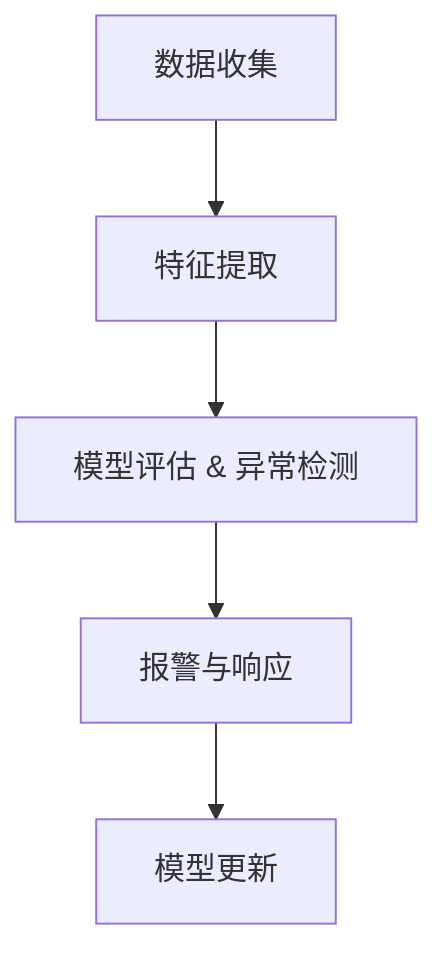

# 模型监控：实时跟踪AI Agent的健康状态

> 关键词：模型监控、AI Agent、健康状态、实时跟踪、性能评估、异常检测、数据漂移

> 摘要：随着人工智能技术的飞速发展，AI Agent在各个领域的应用日益广泛。然而，确保AI Agent的稳定运行和良好性能至关重要。模型监控作为实时跟踪AI Agent健康状态的关键手段，能够及时发现潜在问题并采取相应措施。本文深入探讨了模型监控的相关概念、核心算法、数学模型，通过项目实战展示具体实现，分析实际应用场景，推荐相关工具和资源，最后总结未来发展趋势与挑战，旨在为读者全面了解和应用模型监控技术提供指导。

## 1. 背景介绍 
### 1.1 目的和范围
在当今数字化时代，AI Agent被广泛应用于智能客服、自动驾驶、金融风险评估等众多领域。然而，由于数据的动态变化、模型的固有局限性等因素，AI Agent在运行过程中可能会出现性能下降、预测不准确等问题。模型监控的目的就是实时跟踪AI Agent的健康状态，及时发现并解决这些问题，确保其持续稳定地运行。本文的范围涵盖了模型监控的基本概念、核心算法、数学模型、实际应用案例以及相关工具和资源等方面。

### 1.2 预期读者
本文预期读者包括人工智能领域的研究人员、开发者、数据科学家、机器学习工程师以及对模型监控技术感兴趣的技术爱好者。对于有一定编程和机器学习基础的读者，能够深入理解模型监控的技术细节和实现方法；对于初学者，也可以通过本文初步了解模型监控的基本概念和应用场景。

### 1.3 文档结构概述
本文按照以下结构进行组织：首先介绍模型监控的背景知识，包括目的、预期读者和文档结构概述；接着阐述核心概念与联系，包括相关概念的原理和架构，并通过Mermaid流程图进行可视化展示；然后详细讲解核心算法原理和具体操作步骤，使用Python源代码进行说明；再介绍数学模型和公式，并举例说明；通过项目实战展示代码实际案例和详细解释；分析实际应用场景；推荐相关的工具和资源；最后总结未来发展趋势与挑战，并提供常见问题与解答以及扩展阅读和参考资料。

### 1.4 术语表
#### 1.4.1 核心术语定义
- **模型监控**：指对AI Agent运行过程中的各种指标和状态进行实时监测和分析，以评估其健康状态并及时发现潜在问题的过程。
- **AI Agent**：是一种能够感知环境、做出决策并采取行动的智能实体，通常基于机器学习或深度学习模型构建。
- **健康状态**：反映AI Agent在性能、准确性、稳定性等方面的综合表现，是评估其是否正常运行的重要依据。
- **数据漂移**：指在模型训练和部署后，输入数据的分布发生变化，可能导致模型性能下降的现象。
- **异常检测**：通过对监控数据的分析，识别出与正常模式不符的异常情况，以便及时采取措施。

#### 1.4.2 相关概念解释
- **性能评估**：对AI Agent的预测准确性、召回率、F1值等指标进行评估，以衡量其性能表现。
- **模型更新**：当发现模型性能下降或数据发生变化时，对模型进行更新和优化，以提高其性能和适应性。
- **监控指标**：用于衡量AI Agent健康状态的各种参数，如预测误差、响应时间、资源利用率等。

#### 1.4.3 缩略词列表
- **AI**：Artificial Intelligence，人工智能
- **ML**：Machine Learning，机器学习
- **DL**：Deep Learning，深度学习
- **ROC**：Receiver Operating Characteristic，受试者工作特征曲线
- **AUC**：Area Under the Curve，曲线下面积

## 2. 核心概念与联系 
### 2.1 模型监控的基本原理
模型监控的基本原理是通过收集AI Agent运行过程中的各种数据，如输入数据、输出结果、模型参数等，然后对这些数据进行分析和处理，以评估AI Agent的健康状态。具体来说，模型监控包括以下几个关键步骤：
1. **数据收集**：从AI Agent的运行环境中收集各种相关数据，如日志文件、数据库记录、传感器数据等。
2. **特征提取**：从收集到的数据中提取有价值的特征，如统计特征、时域特征、频域特征等。
3. **模型评估**：使用预先定义的评估指标对AI Agent的性能进行评估，如准确率、召回率、F1值等。
4. **异常检测**：通过对监控数据的分析，识别出与正常模式不符的异常情况，如数据漂移、模型性能下降等。
5. **报警与响应**：当检测到异常情况时，及时发出报警信号，并采取相应的措施进行处理，如模型更新、参数调整等。

### 2.2 模型监控与AI Agent的关系
模型监控与AI Agent密切相关，它是确保AI Agent稳定运行和良好性能的重要手段。具体来说，模型监控可以为AI Agent提供以下支持：
1. **性能优化**：通过实时监测AI Agent的性能指标，及时发现性能瓶颈，并采取相应的措施进行优化，如调整模型参数、增加计算资源等。
2. **故障诊断**：当AI Agent出现故障或异常情况时，通过对监控数据的分析，快速定位故障原因，并采取相应的措施进行修复。
3. **数据管理**：监控输入数据的质量和分布情况，及时发现数据漂移等问题，并采取相应的措施进行处理，如数据清洗、数据增强等。
4. **模型更新**：根据监控结果，及时对模型进行更新和优化，以适应数据的变化和业务需求的变化。

### 2.3 核心概念架构的文本示意图
模型监控的核心概念架构可以用以下文本示意图表示：

```plaintext
                数据收集
                    |
                    v
               特征提取
                    |
                    v
            模型评估 & 异常检测
                    |
                    v
               报警与响应
                    |
                    v
               模型更新
```

### 2.4 Mermaid流程图


## 3. 核心算法原理 & 具体操作步骤 
### 3.1 异常检测算法原理
异常检测是模型监控中的关键环节，其目的是识别出与正常模式不符的异常情况。常见的异常检测算法包括基于统计的方法、基于机器学习的方法和基于深度学习的方法。下面以基于统计的方法为例，介绍异常检测的算法原理。

基于统计的异常检测方法假设正常数据服从某种统计分布，如正态分布、泊松分布等。通过对正常数据的统计分析，可以得到该分布的参数，如均值、标准差等。然后，对于新的数据点，计算其与正常分布的偏离程度，如果偏离程度超过一定的阈值，则认为该数据点是异常点。

### 3.2 具体操作步骤
以下是基于统计的异常检测方法的具体操作步骤：
1. **数据预处理**：对收集到的数据进行清洗和预处理，去除噪声和缺失值。
2. **统计建模**：根据正常数据的特点，选择合适的统计分布进行建模，并估计分布的参数。
3. **异常检测**：对于新的数据点，计算其与正常分布的偏离程度，如马氏距离、Z分数等。
4. **阈值设定**：根据业务需求和数据特点，设定合适的阈值，当偏离程度超过阈值时，认为该数据点是异常点。
5. **报警与处理**：当检测到异常点时，及时发出报警信号，并采取相应的措施进行处理，如人工审核、模型更新等。

### 3.3 Python源代码实现
```python
import numpy as np

# 生成示例数据
np.random.seed(0)
normal_data = np.random.normal(loc=0, scale=1, size=100)
new_data = np.array([5, -4, 0.5, -0.3])

# 计算正常数据的均值和标准差
mean = np.mean(normal_data)
std = np.std(normal_data)

# 设定阈值
threshold = 3

# 异常检测
for data_point in new_data:
    z_score = (data_point - mean) / std
    if np.abs(z_score) > threshold:
        print(f"数据点 {data_point} 是异常点")
    else:
        print(f"数据点 {data_point} 是正常点")
```

### 3.4 代码解释
上述代码实现了基于Z分数的异常检测方法。具体解释如下：
1. **数据生成**：使用`numpy`库生成100个服从正态分布的随机数作为正常数据，同时生成4个新的数据点。
2. **统计建模**：计算正常数据的均值和标准差。
3. **异常检测**：对于每个新的数据点，计算其Z分数，并与设定的阈值进行比较。如果Z分数的绝对值超过阈值，则认为该数据点是异常点。
4. **结果输出**：根据异常检测的结果，输出每个数据点是正常点还是异常点。

## 4. 数学模型和公式 & 详细讲解 & 举例说明 
### 4.1 基于Z分数的异常检测数学模型
基于Z分数的异常检测方法是一种常用的统计方法，其数学模型如下：

设 $X = \{x_1, x_2, \cdots, x_n\}$ 是一组正常数据，其均值为 $\mu$，标准差为 $\sigma$。对于新的数据点 $x$，其Z分数定义为：

$$Z = \frac{x - \mu}{\sigma}$$

其中，$Z$ 表示数据点 $x$ 与均值 $\mu$ 的偏离程度，以标准差 $\sigma$ 为单位。

### 4.2 阈值设定的数学原理
阈值的设定是异常检测中的关键步骤，它直接影响到异常检测的准确性和召回率。一般来说，阈值的设定需要根据业务需求和数据特点进行调整。常见的阈值设定方法包括经验法、基于统计分布的方法和基于机器学习的方法。

基于统计分布的方法假设正常数据服从某种统计分布，如正态分布。根据正态分布的性质，约 $99.7\%$ 的数据点落在均值 $\pm 3\sigma$ 的范围内，因此可以将阈值设定为 $3$。当数据点的Z分数的绝对值超过 $3$ 时，认为该数据点是异常点。

### 4.3 举例说明
假设某公司的员工工资数据服从正态分布，均值为 $\mu = 5000$ 元，标准差为 $\sigma = 1000$ 元。现在有一个新员工的工资为 $x = 8000$ 元，我们可以计算其Z分数：

$$Z = \frac{8000 - 5000}{1000} = 3$$

由于 $Z = 3$，刚好等于阈值，因此该员工的工资处于正常范围的边界。如果新员工的工资为 $x = 9000$ 元，则其Z分数为：

$$Z = \frac{9000 - 5000}{1000} = 4$$

由于 $Z = 4 > 3$，超过了阈值，因此可以认为该员工的工资是异常高的。

## 5. 项目实战：代码实际案例和详细解释说明 
### 5.1  开发环境搭建
本项目实战使用Python语言进行开发，需要安装以下库：
- `numpy`：用于数值计算和数组操作。
- `pandas`：用于数据处理和分析。
- `scikit-learn`：用于机器学习算法的实现。
- `matplotlib`：用于数据可视化。

可以使用以下命令进行安装：
```sh
pip install numpy pandas scikit-learn matplotlib
```

### 5.2  源代码详细实现和代码解读
以下是一个基于Python的模型监控项目实战代码示例，该示例使用鸢尾花数据集进行分类任务，并实时监控模型的性能。

```python
import numpy as np
import pandas as pd
from sklearn.datasets import load_iris
from sklearn.model_selection import train_test_split
from sklearn.linear_model import LogisticRegression
from sklearn.metrics import accuracy_score
import matplotlib.pyplot as plt

# 加载鸢尾花数据集
iris = load_iris()
X = iris.data
y = iris.target

# 划分训练集和测试集
X_train, X_test, y_train, y_test = train_test_split(X, y, test_size=0.2, random_state=42)

# 训练模型
model = LogisticRegression()
model.fit(X_train, y_train)

# 初始化监控指标列表
accuracy_list = []
step_list = []

# 模拟实时数据更新
for i in range(10):
    # 生成新的测试数据
    new_X_test = np.random.normal(loc=X_test.mean(axis=0), scale=X_test.std(axis=0), size=X_test.shape)
    new_y_test = model.predict(new_X_test)
    
    # 计算模型性能
    accuracy = accuracy_score(y_test, new_y_test)
    accuracy_list.append(accuracy)
    step_list.append(i)
    
    # 输出当前性能
    print(f"Step {i}: Accuracy = {accuracy}")
    
    # 当性能下降到一定阈值时，进行模型更新
    if accuracy < 0.8:
        print("模型性能下降，进行模型更新...")
        model.fit(new_X_test, new_y_test)

# 绘制性能曲线
plt.plot(step_list, accuracy_list)
plt.xlabel('Step')
plt.ylabel('Accuracy')
plt.title('Model Performance Monitoring')
plt.show()
```

### 5.3  代码解读与分析
上述代码实现了一个简单的模型监控项目，具体解读如下：
1. **数据加载与划分**：使用`sklearn`库加载鸢尾花数据集，并将其划分为训练集和测试集。
2. **模型训练**：使用逻辑回归模型对训练集进行训练。
3. **实时监控**：模拟实时数据更新，每次生成新的测试数据，并计算模型的准确率。
4. **性能评估**：将每次计算的准确率添加到列表中，并输出当前性能。
5. **模型更新**：当准确率下降到一定阈值（0.8）时，进行模型更新，使用新的数据重新训练模型。
6. **数据可视化**：使用`matplotlib`库绘制模型性能曲线，直观展示模型性能的变化情况。

通过这个项目实战，我们可以实时监控模型的性能，并在性能下降时及时进行模型更新，确保模型的稳定运行。

## 6. 实际应用场景 
### 6.1 金融风险评估
在金融领域，模型监控可以用于实时跟踪信用风险评估模型的健康状态。通过监控模型的预测准确性、召回率等指标，及时发现模型性能下降的情况，并采取相应的措施进行调整，如更新模型参数、增加训练数据等。同时，模型监控还可以检测数据漂移的情况，当输入数据的分布发生变化时，及时调整模型以适应新的数据分布，提高风险评估的准确性。

### 6.2 医疗诊断
在医疗领域，模型监控可以用于实时跟踪疾病诊断模型的健康状态。通过监控模型的诊断准确率、特异性等指标，及时发现模型误诊或漏诊的情况，并采取相应的措施进行改进，如优化模型算法、增加专家知识等。此外，模型监控还可以监测患者数据的变化情况，当患者的病情发生变化时，及时调整模型以提高诊断的准确性。

### 6.3 自动驾驶
在自动驾驶领域，模型监控可以用于实时跟踪自动驾驶模型的健康状态。通过监控模型的决策准确性、安全性等指标，及时发现模型出现的异常情况，如误判路况、碰撞风险等，并采取相应的措施进行处理，如切换到安全模式、进行人工干预等。同时，模型监控还可以监测车辆传感器数据的变化情况，当传感器数据出现异常时，及时调整模型以确保自动驾驶的安全性。

### 6.4 智能客服
在智能客服领域，模型监控可以用于实时跟踪聊天机器人模型的健康状态。通过监控模型的回答准确率、用户满意度等指标，及时发现模型回答不准确或不恰当的情况，并采取相应的措施进行改进，如优化模型的语言理解能力、增加训练数据等。此外，模型监控还可以监测用户问题的变化情况，当用户问题的类型发生变化时，及时调整模型以提高智能客服的服务质量。

## 7. 工具和资源推荐
### 7.1 学习资源推荐
#### 7.1.1 书籍推荐
- 《机器学习》（周志华著）：全面介绍了机器学习的基本概念、算法和应用，是学习机器学习的经典教材。
- 《深度学习》（Ian Goodfellow、Yoshua Bengio和Aaron Courville著）：深入讲解了深度学习的原理、模型和应用，是深度学习领域的权威著作。
- 《Python机器学习实战》（Sebastian Raschka著）：通过实际案例介绍了Python在机器学习中的应用，适合初学者快速入门。

#### 7.1.2 在线课程
- Coursera上的“机器学习”课程（Andrew Ng教授主讲）：是一门非常经典的机器学习在线课程，内容全面，讲解详细。
- edX上的“深度学习”课程（由麻省理工学院等高校提供）：深入介绍了深度学习的理论和实践，适合有一定基础的学习者。
- 吴恩达的“深度学习专项课程”：包括多个深度学习相关的课程，内容丰富，实践性强。

#### 7.1.3 技术博客和网站
- Medium：是一个技术博客平台，上面有很多关于人工智能、机器学习和模型监控的优秀文章。
- Towards Data Science：专注于数据科学和机器学习领域的技术博客，提供了很多实用的技术文章和案例分析。
- Kaggle：是一个数据科学竞赛平台，上面有很多关于模型监控和机器学习的公开数据集和优秀代码示例。

### 7.2 开发工具框架推荐
#### 7.2.1 IDE和编辑器
- PyCharm：是一款专业的Python集成开发环境，提供了丰富的代码编辑、调试和部署功能。
- Jupyter Notebook：是一个交互式的编程环境，适合进行数据探索和模型实验。
- Visual Studio Code：是一款轻量级的代码编辑器，支持多种编程语言，并且有丰富的插件可以扩展功能。

#### 7.2.2 调试和性能分析工具
- TensorBoard：是TensorFlow提供的一个可视化工具，用于监控模型的训练过程和性能指标。
- PyTorch Profiler：是PyTorch提供的一个性能分析工具，用于分析模型的计算性能和内存使用情况。
- cProfile：是Python标准库中的一个性能分析工具，用于分析Python代码的运行时间和函数调用情况。

#### 7.2.3 相关框架和库
- Scikit-learn：是一个简单易用的机器学习框架，提供了丰富的机器学习算法和工具。
- TensorFlow：是一个广泛使用的深度学习框架，提供了高效的分布式计算和模型部署功能。
- PyTorch：是一个灵活的深度学习框架，适合进行研究和开发。

### 7.3 相关论文著作推荐
#### 7.3.1 经典论文
- “Deep Learning”（Yoshua Bengio、Ian Goodfellow和Aaron Courville著）：是深度学习领域的经典综述论文，全面介绍了深度学习的发展历程、理论基础和应用场景。
- “The Elements of Statistical Learning”（Trevor Hastie、Robert Tibshirani和Jerome Friedman著）：是统计学习领域的经典著作，深入讲解了统计学习的理论和方法。
- “Pattern Recognition and Machine Learning”（Christopher M. Bishop著）：是模式识别和机器学习领域的经典教材，系统介绍了模式识别和机器学习的基本概念、算法和应用。

#### 7.3.2 最新研究成果
- 关注顶级学术会议如NeurIPS、ICML、CVPR等上的相关论文，了解模型监控领域的最新研究成果和发展趋势。
- 关注知名学术期刊如Journal of Machine Learning Research、Artificial Intelligence等上的相关论文，获取高质量的研究成果。

#### 7.3.3 应用案例分析
- 关注工业界的技术博客和案例分享，了解模型监控在实际应用中的具体实现和效果。
- 参考Kaggle上的优秀竞赛案例，学习如何使用模型监控技术解决实际问题。

## 8. 总结：未来发展趋势与挑战
### 8.1 未来发展趋势
- **自动化与智能化**：未来的模型监控系统将更加自动化和智能化，能够自动识别和处理各种异常情况，减少人工干预。例如，通过引入强化学习算法，让模型监控系统能够自动调整监控策略和阈值，以适应不同的应用场景和数据变化。
- **多模态监控**：随着人工智能技术的发展，模型的输入和输出将越来越多样化，包括图像、语音、文本等多种模态。未来的模型监控系统将能够对多模态数据进行综合监控，提高监控的准确性和全面性。
- **联邦学习下的模型监控**：联邦学习是一种新兴的机器学习范式，它允许在不共享原始数据的情况下进行模型训练。未来的模型监控系统需要适应联邦学习的特点，解决在分布式环境下的模型监控问题，如数据隐私保护、模型性能评估等。
- **与业务系统的深度融合**：模型监控将不再仅仅是一个独立的系统，而是与业务系统深度融合，为业务决策提供更直接的支持。例如，在金融领域，模型监控系统可以实时监测风险评估模型的性能，并根据监控结果及时调整业务策略。

### 8.2 挑战
- **数据隐私与安全**：在模型监控过程中，需要收集和分析大量的数据，这些数据可能包含用户的敏感信息。如何在保证数据隐私和安全的前提下进行有效的模型监控是一个重要的挑战。例如，需要采用加密技术、差分隐私等方法来保护数据的隐私。
- **复杂环境下的监控**：在实际应用中，AI Agent往往运行在复杂多变的环境中，如网络延迟、数据丢失、恶意攻击等。如何在这些复杂环境下准确地监控模型的健康状态是一个具有挑战性的问题。需要开发更加鲁棒的监控算法和技术，以应对各种复杂情况。
- **模型可解释性与监控**：随着深度学习模型的广泛应用，模型的可解释性问题日益突出。在模型监控过程中，不仅需要关注模型的性能指标，还需要了解模型的决策过程和依据。如何在监控模型的同时提高模型的可解释性是一个亟待解决的问题。
- **监控成本与效率**：模型监控需要消耗大量的计算资源和时间，尤其是在处理大规模数据和复杂模型时。如何在保证监控效果的前提下降低监控成本，提高监控效率是一个重要的挑战。需要优化监控算法和系统架构，采用分布式计算、并行计算等技术来提高监控效率。

## 9. 附录：常见问题与解答
### 9.1 模型监控需要监控哪些指标？
模型监控需要监控的指标包括但不限于以下几类：
- **性能指标**：如准确率、召回率、F1值、均方误差等，用于评估模型的预测准确性和性能表现。
- **稳定性指标**：如模型的方差、标准差等，用于评估模型的稳定性和可靠性。
- **资源利用率指标**：如CPU使用率、内存使用率、磁盘I/O等，用于评估模型运行时的资源消耗情况。
- **数据质量指标**：如数据的缺失率、异常值比例、数据分布等，用于评估输入数据的质量和稳定性。

### 9.2 如何选择合适的异常检测算法？
选择合适的异常检测算法需要考虑以下几个因素：
- **数据类型**：不同的异常检测算法适用于不同类型的数据，如数值型数据、文本型数据、图像数据等。
- **数据分布**：如果数据服从某种特定的分布，如正态分布，可以选择基于统计的异常检测算法；如果数据分布复杂，可以选择基于机器学习或深度学习的异常检测算法。
- **异常类型**：不同的异常检测算法对不同类型的异常的检测效果不同，如点异常、上下文异常、集体异常等。需要根据具体的异常类型选择合适的算法。
- **计算资源和时间**：不同的异常检测算法的计算复杂度和时间复杂度不同，需要根据实际情况选择合适的算法，以满足计算资源和时间的要求。

### 9.3 模型监控系统的部署方式有哪些？
模型监控系统的部署方式主要有以下几种：
- **本地部署**：将模型监控系统部署在本地服务器或计算机上，适合对数据隐私和安全性要求较高的场景。
- **云端部署**：将模型监控系统部署在云平台上，如亚马逊AWS、谷歌云、阿里云等，适合对计算资源和可扩展性要求较高的场景。
- **混合部署**：将模型监控系统的部分组件部署在本地，部分组件部署在云端，结合本地部署和云端部署的优点，适合对数据隐私和计算资源都有一定要求的场景。

### 9.4 如何进行模型更新？
进行模型更新的步骤如下：
1. **数据收集**：收集新的数据，包括输入数据和对应的标签数据。
2. **数据预处理**：对新的数据进行清洗、预处理和特征提取，以保证数据的质量和一致性。
3. **模型训练**：使用新的数据对模型进行重新训练，可以选择增量训练或全量训练的方式。
4. **模型评估**：使用测试数据对更新后的模型进行评估，检查模型的性能是否有所提升。
5. **模型部署**：如果更新后的模型性能满足要求，将其部署到生产环境中替换旧的模型。

## 10. 扩展阅读 & 参考资料
### 10.1 扩展阅读
- 《人工智能时代的模型管理与监控》：深入探讨了模型管理和监控的相关理论和实践，对模型监控技术有更深入的介绍。
- 《数据驱动的人工智能系统监控与优化》：介绍了如何通过数据驱动的方法对人工智能系统进行监控和优化，包括模型监控的具体实现方法和案例分析。

### 10.2 参考资料
- Scikit-learn官方文档：https://scikit-learn.org/stable/
- TensorFlow官方文档：https://www.tensorflow.org/
- PyTorch官方文档：https://pytorch.org/
- Kaggle官方网站：https://www.kaggle.com/